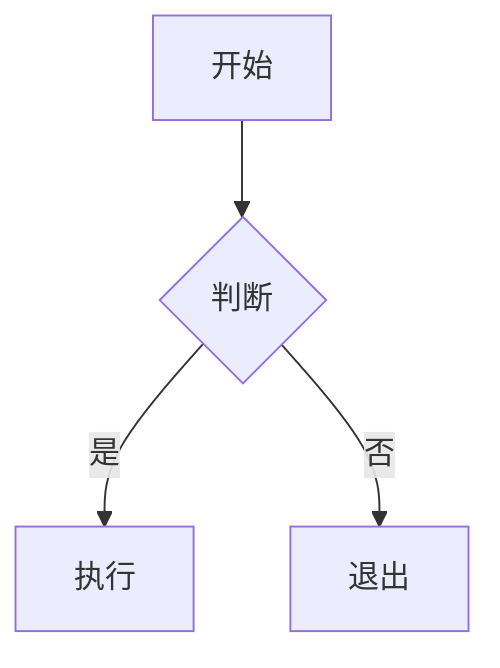

# Minecraft Learning

Minecraft 原版 / Iris / Sodium 源码教程与技术分析站点，纯静态页面，可本地直接打开或通过任意静态服务器托管。

## 目录结构

```
MinecraftLearning/   （本地文件夹可仍命名为 Blog，仅作说明）
├── index.html              # 根路径：跳转至 website/index.html（主站）
├── tech-blog.html          # 「技术随笔」文章列表（node convert.js 生成）
├── article.html            # 博客单篇文章页
├── styles.css              # 博客主样式
├── script.js               # 博客交互脚本
├── convert.js              # 博客 Markdown → HTML 转换脚本
│
├── posts/                  # 博客文章源文件（Markdown）
│
├── website/                # MC 教程站
│   ├── index.html          # 教程站首页
│   ├── catalog.html        # 文档目录
│   ├── styles.css          # 教程站主样式
│   ├── script.js           # 教程站交互脚本
│   ├── tutorial.js         # 教程页专用脚本
│   ├── convert.js          # 教程 Markdown → HTML 转换脚本
│   │
│   ├── scripts/
│   │   ├── config.js       # 模组配置文件
│   │   └── utils.js       # 共享工具函数
│   │
│   ├── content/            # 教程源码（Markdown）
│   │   ├── mc/1.21/        # MC 1.21 教程 + 源码分析
│   │   ├── iris/           # Iris 光影教程 + 分析
│   │   └── sodium/         # Sodium 优化教程 + 分析
│   │
│   ├── docs/               # 生成的 HTML 文档（部署用）
│   └── tutorials/           # 编译后的教程页（备用）
│
├── static/                 # 静态资源
├── package.json            # 项目配置
└── DEPLOY.md              # 部署指南
```

## 快速开始

### 1. 安装依赖（可选）

```bash
npm install
```

### 2. 本地预览

```bash
# 使用静态服务器
npm run dev

# 或直接用浏览器打开（根目录 index 会跳到 website/）
open website/index.html
```

### 3. 构建

```bash
# 构建博客
npm run build:blog

# 构建教程站
npm run build:website

# 构建全部
npm run build:all
```

## 写博客文章

### 1. 创建文章

在 `posts/` 目录下创建新的 Markdown 文件：

```markdown
---
title: 文章标题
date: 2026-03-19
category: frontend
categoryName: 前端
tags: [JavaScript, React]
readingTime: 5
excerpt: 文章摘要，简短介绍内容。
---

## 正文内容

这里是文章正文...
```

### 2. 支持的分类

| category | categoryName |
|----------|--------------|
| frontend | 前端 |
| backend | 后端 |
| devops | DevOps |
| tool | 工具 |
| thoughts | 随想 |

### 3. 重新构建

```bash
node convert.js
```

## 编写教程

### 1. 创建教程

在 `website/content/` 下创建 Markdown 文件：

```markdown
# 教程标题

> **简介** 这里是教程的简短描述

## 第一部分

正文内容...

## 第二部分

更多内容...
```

### 2. 代码块格式

```java
// 普通代码块
public class Example {
    public void test() {
        System.out.println("Hello");
    }
}
```



```startLine:endLine:filepath
// 代码引用块（用于引用源码）
```

### 3. 重新构建

```bash
cd website
node convert.js
```

## 项目脚本

| 脚本 | 说明 |
|------|------|
| `npm run build:blog` | 构建博客 |
| `npm run build:website` | 构建教程站 |
| `npm run build:all` | 构建全部 |
| `npm run seo` | 仅刷新根目录 `sitemap.xml` / `robots.txt` |
| `npm run dev` | 启动开发服务器 |
| `npm run clean` | 清理生成的文档 |

## 部署

项目已配置 GitHub Pages：

1. 推送代码到 GitHub `main` 分支
2. GitHub Actions 自动构建
3. 访问 `https://你的用户名.github.io/MincraftLearning/`（与 GitHub 仓库名一致）

详细部署指南请查看 [DEPLOY.md](DEPLOY.md)。

## 技术栈

- **前端**: HTML5, CSS3, Vanilla JavaScript
- **内容**: Markdown
- **图标**: Font Awesome 6.4
- **字体**: Noto Sans SC (Google Fonts)
- **图表**: Mermaid.js

## 浏览器支持

- Chrome 80+
- Firefox 75+
- Safari 13+
- Edge 80+

## License

MIT
