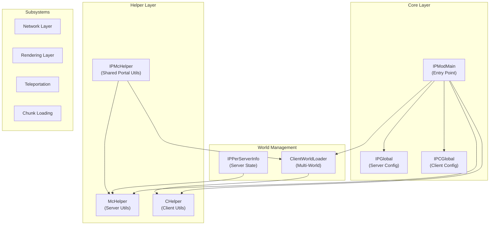
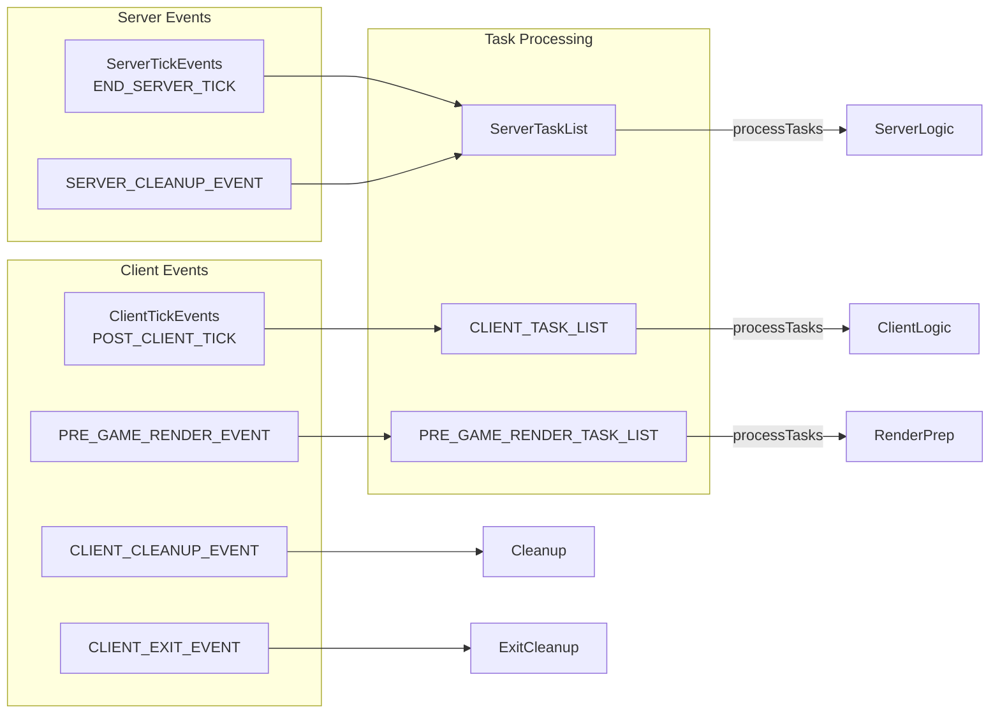
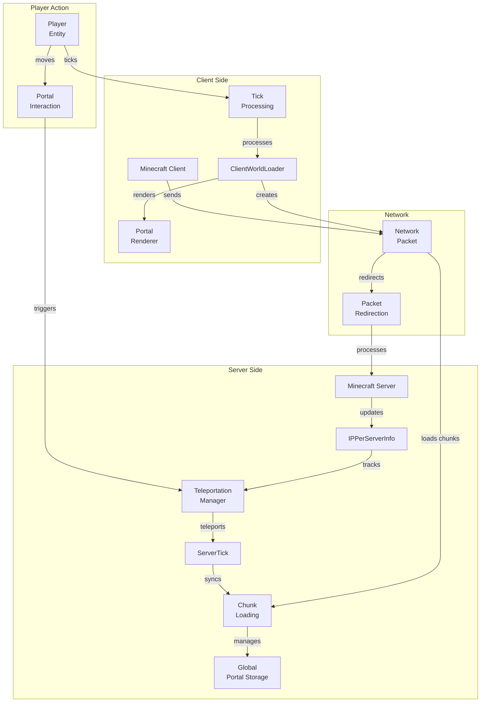
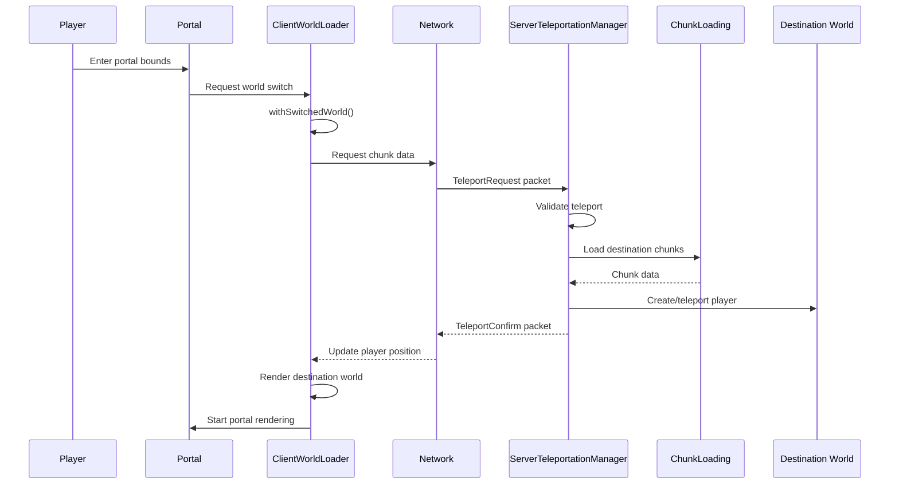

# ImmersivePortalsMod Core Architecture Analysis

```yaml
---
title: Core Architecture Analysis
readingTime: 45
---
```

## Table of Contents

- [Overview](#overview)
- [Package Structure and Core Classes](#package-structure-and-core-classes)
- [IPModMain Entry Point](#ipmodmain-entry-point)
- [Global Configuration (IPGlobal & IPCGlobal)](#global-configuration-ipglobal--ipcglobal)
- [Helper Classes (McHelper, CHelper, IPMcHelper)](#helper-classes-mchelper-chelper-ipmchelper)
- [ClientWorldLoader Multi-World Management](#clientworldloader-multi-world-management)
- [Event System](#event-system)
- [Data Flow Diagram](#data-flow-diagram)
- [Key Design Patterns](#key-design-patterns)

---

## Overview

ImmersivePortalsMod (IPCM) is a sophisticated Minecraft mod that enables seamless cross-dimensional portal experiences. Unlike vanilla portals that display loading screens during dimension transitions, this mod renders portal destinations in real-time and supports complex portal hierarchies (nested portals). The architecture follows a **client-server separation** pattern with shared core logic, heavily leveraging Fabric's event system and Mixin for bytecode injection.

The mod consists of approximately 375+ Java files organized into multiple subsystems:



---

## Package Structure and Core Classes

The `qouteall.imm_ptl.core` package serves as the central hub for the mod. Here's the directory structure:

```
qouteall/imm_ptl/core/
├── IPModMain.java              # Main entry point
├── IPGlobal.java               # Server-side global state
├── IPCGlobal.java              # Client-side global state
├── McHelper.java               # Minecraft server utilities
├── CHelper.java                # Minecraft client utilities  
├── IPMcHelper.java             # Cross-side portal utilities
├── ClientWorldLoader.java      # Multi-world management
├── IPPerServerInfo.java        # Per-server state storage
├── ScaleUtils.java             # Scaling portal utilities
│
├── block_manipulation/         # Block interaction handlers
├── chunk_loading/              # Chunk management & entity sync
├── collision/                  # Portal collision system
├── commands/                   # Command registration
├── compat/                     # Third-party mod compatibility
├──ducks/                       # Mixin interface definitions
├── misc_utils/                 # Utilities (ServerTaskList, etc.)
├── network/                   # Packet handling
├── platform_specific/          # Platform-dependent code
├── portal/                    # Portal entity definitions
├── render/                     # Rendering pipeline
├── teleportation/              # Teleport mechanics
└── mixin/                      # Bytecode injection
    ├── client/                 # Client-side mixins
    └── common/                 # Shared mixins
```

### Core Class Responsibilities

| Class | Responsibility | Side |
|-------|---------------|------|
| `IPModMain` | Mod initialization, registry | Common |
| `IPGlobal` | Configuration, server events | Server |
| `IPCGlobal` | Client renderer, client events | Client |
| `McHelper` | Server-side Minecraft utilities | Server |
| `CHelper` | Client-side Minecraft utilities | Client |
| `IPMcHelper` | Portal-aware operations | Common |
| `ClientWorldLoader` | Multi-world simulation | Client |
| `IPPerServerInfo` | Server-per-instance state | Server |

---

## IPModMain Entry Point

`IPModMain` is the central initialization hub, following Fabric's mod initialization pattern.

### Initialization Sequence

```java
// 58:128:assets\ImmersivePortalsMod-6.0.6-mc1.21.1\src\main\java\qouteall\imm_ptl\core\IPModMain.java
public static void init() {
    loadConfig();
    
    Helper.LOGGER.info("Immersive Portals Mod Initializing");
    
    ImmPtlNetworking.init();
    ImmPtlNetworkConfig.init();
    PacketRedirection.init();
    
    // Register event-driven task processors
    IPGlobal.POST_CLIENT_TICK_EVENT.register(IPGlobal.CLIENT_TASK_LIST::processTasks);
    IPGlobal.PRE_GAME_RENDER_EVENT.register(IPGlobal.PRE_GAME_RENDER_TASK_LIST::processTasks);
    
    // Initialize portal shape handlers
    RectangularPortalShape.init();
    SpecialFlatPortalShape.init();
    BoxPortalShape.init();
    
    // Chunk and world management
    ImmPtlChunkTracking.init();
    WorldInfoSender.init();
    GlobalPortalStorage.init();
    EntitySync.init();
    
    // Core systems
    ServerTeleportationManager.init();
    CollisionHelper.init();
    PortalExtension.init();
    
    // Performance monitoring
    GcMonitor.initCommon();
    ServerPerformanceMonitor.init();
    ImmPtlChunkTickets.init();
    
    // Compatibility and commands
    IPPortingLibCompat.init();
    BlockManipulationServer.init();
    
    CommandRegistrationCallback.EVENT.register(
        (dispatcher, ctx, environment) -> PortalCommand.register(dispatcher, ctx)
    );
    
    // Debug and utilities
    DebugUtil.init();
    ServerTaskList.init();
    CustomPortalGenManager.init();
    
    // Animation drivers
    RotationAnimation.init();
    NormalAnimation.init();
}
```

### Configuration Loading

The mod uses ** Cloth Config** for configuration management:

```java
// 130:153:assets\ImmersivePortalsMod-6.0.6-mc1.21.1\src\main\java\qouteall\imm_ptl\core\IPModMain.java
private static void loadConfig() {
    // Upgrade old config file format
    Path gameDir = O_O.getGameDir();
    File oldConfigFile = gameDir.resolve("config")
        .resolve("immersive_portals_fabric.json").toFile();
    if (oldConfigFile.exists()) {
        File dest = gameDir.resolve("config")
            .resolve("immersive_portals.json").toFile();
        boolean succeeded = oldConfigFile.renameTo(dest);
        // ... handle migration
    }
    
    // Register AutoConfig with save listener
    IPGlobal.configHolder = AutoConfig.register(
        IPConfig.class, 
        GsonConfigSerializer::new
    );
    IPGlobal.configHolder.registerSaveListener((configHolder, ipConfig) -> {
        ipConfig.onConfigChanged();
        return InteractionResult.SUCCESS;
    });
    
    IPConfig ipConfig = IPConfig.getConfig();
    ipConfig.onConfigChanged();
}
```

### Entity Registration

The mod registers **9 custom entity types**:

```java
// 162:213:assets\ImmersivePortalsMod-6.0.6-mc1.21.1\src\main\java\qouteall\imm_ptl\core\IPModMain.java
public static void registerEntityTypes(BiConsumer<ResourceLocation, EntityType<?>> regFunc) {
    // Portal variants
    regFunc.accept(McHelper.newResourceLocation("immersive_portals", "portal"), Portal.ENTITY_TYPE);
    regFunc.accept(McHelper.newResourceLocation("immersive_portals", "nether_portal_new"), NetherPortalEntity.ENTITY_TYPE);
    regFunc.accept(McHelper.newResourceLocation("immersive_portals", "end_portal"), EndPortalEntity.ENTITY_TYPE);
    
    // Mirror variants
    regFunc.accept(McHelper.newResourceLocation("immersive_portals", "mirror"), Mirror.ENTITY_TYPE);
    regFunc.accept(McHelper.newResourceLocation("immersive_portals", "breakable_mirror"), BreakableMirror.ENTITY_TYPE);
    
    // Global portals
    regFunc.accept(McHelper.newResourceLocation("immersive_portals", "global_tracked_portal"), GlobalTrackedPortal.ENTITY_TYPE);
    regFunc.accept(McHelper.newResourceLocation("immersive_portals", "border_portal"), WorldWrappingPortal.ENTITY_TYPE);
    regFunc.accept(McHelper.newResourceLocation("immersive_portals", "end_floor_portal"), VerticalConnectingPortal.ENTITY_TYPE);
    regFunc.accept(McHelper.newResourceLocation("immersive_portals", "general_breakable_portal"), GeneralBreakablePortal.ENTITY_TYPE);
    
    // UI element
    regFunc.accept(McHelper.newResourceLocation("immersive_portals", "loading_indicator"), LoadingIndicatorEntity.entityType);
}
```

---

## Global Configuration (IPGlobal & IPCGlobal)

### IPGlobal - Server-Side Configuration

`IPGlobal` holds **static configuration fields** that are synchronized between server and client, plus server-specific events and state.

```java
// 15:173:assets\ImmersivePortalsMod-6.0.6-mc1.21.1\src\main\java\qouteall\imm_ptl\core\IPGlobal.java
public class IPGlobal {
    
    public static ConfigHolder<IPConfig> configHolder;
    
    // Portal limits
    public static int maxNormalPortalRadius = 32;
    public static int maxPortalLayer = 5;
    public static int indirectLoadingRadiusCap = 8;
    
    // Performance flags
    public static boolean lagAttackProof = true;
    public static boolean tickOnlyIfChunkLoaded = true;
    public static boolean enableClientPerformanceAdjustment = true;
    public static boolean enableServerPerformanceAdjustment = true;
    
    // Rendering options
    public static RenderMode renderMode = RenderMode.normal;
    public static boolean doCheckGlError = true;
    public static boolean renderYourselfInPortal = true;
    public static boolean correctCrossPortalEntityRendering = true;
    public static boolean enableClippingMechanism = true;
    
    // Teleportation
    public static boolean disableTeleportation = false;
    public static boolean teleportationDebugEnabled = false;
    
    // Portal modes
    public static NetherPortalMode netherPortalMode = NetherPortalMode.adaptive;
    public static EndPortalMode endPortalMode = EndPortalMode.normal;
    
    // Task lists for deferred execution
    public static final MyTaskList CLIENT_TASK_LIST = new MyTaskList();
    public static final MyTaskList PRE_GAME_RENDER_TASK_LIST = new MyTaskList();
    public static final MyTaskList PRE_TOTAL_RENDER_TASK_LIST = new MyTaskList();
    
    // Server events
    public static final Event<Consumer<MinecraftServer>> SERVER_CLEANUP_EVENT =
        Helper.createConsumerEvent();
    
    // Enums
    public static enum RenderMode { normal, compatibility, debug, none }
    public static enum NetherPortalMode { normal, vanilla, adaptive, disabled }
    public static enum EndPortalMode { normal, toObsidianPlatform, scaledView, scaledViewRotating, vanilla }
}
```

### IPCGlobal - Client-Side Configuration

`IPCGlobal` is client-only (`@Environment(EnvType.CLIENT)`) and manages renderer instances and client-specific state.

```java
// 13:52:assets\ImmersivePortalsMod-6.0.6-mc1.21.1\src\main\java\qouteall\imm_ptl\core\IPCGlobal.java
@Environment(EnvType.CLIENT)
public class IPCGlobal {
    
    // Renderer instances
    public static PortalRenderer renderer;
    public static RendererUsingStencil rendererUsingStencil;
    public static RendererUsingFrameBuffer rendererUsingFrameBuffer;
    public static RendererDummy rendererDummy = new RendererDummy();
    public static RendererDebug rendererDebug = new RendererDebug();
    
    // Performance tuning
    public static int maxIdleChunkRendererNum = 500;
    public static boolean doUseAdvancedFrustumCulling = true;
    public static boolean useHackedChunkRenderDispatcher = true;
    public static boolean useFrontClipping = true;
    public static boolean earlyFrustumCullingPortal = true;
    
    // Stencil and compatibility
    public static boolean useSeparatedStencilFormat = false;
    public static boolean experimentalIrisPortalRenderer = false;
    
    // Client lifecycle events
    public static final Event<Runnable> CLIENT_CLEANUP_EVENT = Helper.createRunnableEvent();
    public static final Event<Runnable> CLIENT_EXIT_EVENT = Helper.createRunnableEvent();
}
```

### Configuration Synchronization

The mod uses a **dual-layer config system**:

1. **IPConfig** - Cloth Config GUI managed settings
2. **IPGlobal/IPCGlobal** - Runtime-reflected fields updated via `onConfigChanged()`

```java
// When config changes, these static fields are updated
public void onConfigChanged() {
    IPGlobal.netherPortalMode = this.netherPortalMode;
    IPGlobal.endPortalMode = this.endPortalMode;
    IPGlobal.maxNormalPortalRadius = this.maxNormalPortalRadius;
    IPCGlobal.maxIdleChunkRendererNum = this.maxIdleChunkRendererNum;
    // ... etc
}
```

---

## Helper Classes (McHelper, CHelper, IPMcHelper)

### McHelper - Server Minecraft Utilities

`McHelper` provides a comprehensive set of **server-side** Minecraft utility methods, acting as a facade over Minecraft's server APIs.

**Entity Finding and Manipulation:**

```java
// 204:217:assets\ImmersivePortalsMod-6.0.6-mc1.21.1\src\main\java\qouteall\imm_ptl\core\McHelper.java
public static <ENTITY extends Entity> List<ENTITY> getEntitiesNearby(
    Level world,
    Vec3 center,
    Class<ENTITY> entityClass,
    double range
) {
    return findEntitiesRough(
        entityClass, world, center,
        (int) (range / 16 + 1),
        e -> true
    );
}

// 610:639:assets\ImmersivePortalsMod-6.0.6-mc1.21.1\src\main\java\qouteall\imm_ptl\core\McHelper.java
public static <T extends Entity> List<T> findEntitiesRough(
    Class<T> entityClass,
    Level world,
    Vec3 center,
    int radiusChunks,
    Predicate<T> predicate
) {
    if (radiusChunks <= 0) radiusChunks = 1;
    if (radiusChunks > 32) radiusChunks = 32;  // Cap at 32 chunks
    
    SectionPos sectionPos = SectionPos.of(center);
    
    return findEntities(
        entityClass,
        ((IEWorld) world).portal_getEntityLookup(),
        sectionPos.x() - radiusChunks, sectionPos.x() + radiusChunks,
        sectionPos.y() - radiusChunks, sectionPos.y() + radiusChunks,
        sectionPos.z() - radiusChunks, sectionPos.z() + radiusChunks,
        predicate
    );
}
```

**Multi-threaded Task Processing:**

```java
// 130:202:assets\ImmersivePortalsMod-6.0.6-mc1.21.1\src\main\java\qouteall\imm_ptl\core\McHelper.java
public static <T> void performMultiThreadedFindingTaskOnServer(
    MinecraftServer server,
    Stream<T> stream,
    Predicate<T> predicate,
    IntPredicate taskWatcher,
    Consumer<T> onFound,
    Runnable onNotFound,
    Runnable finalizer
) {
    int[] progress = new int[1];
    Helper.SimpleBox<Boolean> isAborted = new Helper.SimpleBox<>(false);
    
    CompletableFuture<Void> future = CompletableFuture.runAsync(
        () -> {
            T result = stream.peek(obj -> progress[0] += 1)
                .filter(predicate)
                .findFirst()
                .orElse(null);
            // ... handle result
        },
        Util.backgroundExecutor()
    );
    
    // Poll on server thread
    ServerTaskList.of(server).addTask(() -> {
        if (future.isDone()) { /* handle completion */ }
        if (future.isCancelled()) { /* handle abort */ }
        boolean shouldContinue = taskWatcher.test(progress[0]);
        if (!shouldContinue) {
            isAborted.obj = true;
            future.cancel(true);
            return true;  // Task complete
        }
        return false;  // Continue polling
    });
}
```

### CHelper - Client Minecraft Utilities

`CHelper` is client-only (`@Environment(EnvType.CLIENT)`) and provides client-side rendering and interaction utilities.

```java
// 38:148:assets\ImmersivePortalsMod-6.0.6-mc1.21.1\src\main\java\qouteall\imm_ptl\core\CHelper.java
@Environment(EnvType.CLIENT)
public class CHelper {
    
    public static PlayerInfo getClientPlayerListEntry() {
        return Minecraft.getInstance().getConnection().getPlayerInfo(
            Minecraft.getInstance().player.getGameProfile().getId()
        );
    }
    
    public static Level getClientWorld(ResourceKey<Level> dimension) {
        return ClientWorldLoader.getWorld(dimension);
    }
    
    public static Vec3 getCurrentCameraPos() {
        return Minecraft.getInstance().gameRenderer.getMainCamera().getPosition();
    }
    
    // OpenGL error checking
    public static void checkGlError() {
        if (!IPGlobal.doCheckGlError) return;
        if (reportedErrorNum > 100) return;
        doCheckGlError();
    }
    
    // Depth clamp control for portal clipping
    public static void disableDepthClamp() {
        if (IPGlobal.enableClippingMechanism) {
            GL11.glDisable(GL32.GL_DEPTH_CLAMP);
        }
    }
    
    public static void enableDepthClamp() {
        if (IPGlobal.enableClippingMechanism) {
            GL11.glEnable(GL32.GL_DEPTH_CLAMP);
        }
    }
    
    // Dimension icon loading with fallback
    public static ResourceLocation getDimensionIconPath(ResourceKey<Level> dimension) {
        ResourceLocation dimIconPath = ResourceLocation.fromNamespaceAndPath(
            dimensionId.getNamespace(),
            "textures/dimension/" + dimensionId.getPath() + ".png"
        );
        // Falls back to mod icon if dimension-specific icon not found
        // ...
    }
}
```

### IPMcHelper - Cross-Side Portal Utilities

`IPMcHelper` provides **portal-specific operations** that work on both client and server sides, making heavy use of context switching.

```java
// 38:52:assets\ImmersivePortalsMod-6.0.6-mc1.21.1\src\main\java\qouteall\imm_ptl\core\IPMcHelper.java
public class IPMcHelper {
    public static final LimitedLogger limitedLogger = new LimitedLogger(20);
    
    // Include global portals in search
    public static void foreachNearbyPortals(
        Level world, Vec3 pos, int range, Consumer<Portal> func
    ) {
        // Check global portals first
        List<Portal> globalPortals = GlobalPortalStorage.getGlobalPortals(world);
        for (Portal globalPortal : globalPortals) {
            if (globalPortal.getDistanceToNearestPointInPortal(pos) < range * 2) {
                func.accept(globalPortal);
            }
        }
        
        // Then check nearby entity portals
        McHelper.foreachEntitiesByPointAndRoughRadius(
            Portal.class, world, pos, range, func
        );
    }
```

**Portal Ray Tracing:**

```java
// 120:166:assets\ImmersivePortalsMod-6.0.6-mc1.21.1\src\main\java\qouteall\imm_ptl\core\IPMcHelper.java
public static List<Tuple<Portal, Vec3>> rayTracePortals(
    Level world,
    Vec3 start,
    Vec3 end,
    boolean includeGlobalPortals,
    Predicate<Portal> filter
) {
    // Calculate search radius based on ray length
    Vec3 middle = start.scale(0.5).add(end.scale(0.5));
    int chunkRadius = (int) Math.ceil(Math.abs(start.distanceTo(end) / 2) / 16);
    
    // Get nearby portals
    List<Portal> nearby = McHelper.getEntitiesNearby(world, middle, Portal.class, chunkRadius * 16);
    if (includeGlobalPortals) {
        nearby.addAll(GlobalPortalStorage.getGlobalPortals(world));
    }
    
    // Find portals intersecting the ray
    List<Tuple<Portal, Vec3>> hits = new ArrayList<>();
    nearby.forEach(portal -> {
        if (filter == null || filter.test(portal)) {
            Vec3 intersection = portal.rayTrace(start, end);
            if (intersection != null) {
                hits.add(new Tuple<>(portal, intersection));
            }
        }
    });
    
    // Sort by distance
    hits.sort((pair1, pair2) -> {
        Vec3 intersection1 = pair1.getB();
        Vec3 intersection2 = pair2.getB();
        return (int) Math.signum(
            intersection1.distanceToSqr(start) - intersection2.distanceToSqr(start)
        );
    });
    
    return hits;
}
```

**Recursive Cross-Portal Ray Tracing:**

```java
// 192:254:assets\ImmersivePortalsMod-6.0.6-mc1.21.1\src\main\java\qouteall\imm_ptl\core\IPMcHelper.java
private static Tuple<BlockHitResult, List<Portal>> rayTrace(
    Level world,
    ClipContext context,
    boolean includeGlobalPortals,
    List<Portal> portals
) {
    Vec3 start = context.getFrom();
    Vec3 end = context.getTo();
    
    // Limit portal layer depth
    if (portals.size() > IPGlobal.maxPortalLayer) {
        return new Tuple<>(BlockHitResult.miss(end, ...), portals);
    }
    
    // Normal block ray trace
    BlockHitResult hitResult = world.clip(context);
    
    // Find portal intersections
    List<Tuple<Portal, Vec3>> rayTracedPortals =
        rayTracePortals(world, start, end, includeGlobalPortals, Portal::isInteractable);
    
    if (rayTracedPortals.isEmpty()) {
        return new Tuple<>(hitResult, portals);
    }
    
    // Transform ray through portal and recurse into destination world
    Portal portal = rayTracedPortals.get(0).getA();
    IERayTraceContext betterContext = (IERayTraceContext) context;
    
    betterContext.ip_setStart(portal.transformPoint(intersection))
                 .ip_setEnd(portal.transformPoint(end));
    
    portals.add(portal);
    Level destWorld = portal.getDestinationWorld();
    
    return withSwitchedContext(destWorld, 
        () -> rayTrace(destWorld, context, includeGlobalPortals, portals)
    );
}
```

---

## ClientWorldLoader Multi-World Management

`ClientWorldLoader` is the **heart of multi-world rendering**, enabling the client to maintain and render multiple dimensions simultaneously without loading screens.

### Core Data Structures

```java
// 54:83:assets\ImmersivePortalsMod-6.0.6-mc1.21.1\src\main\java\qouteall\imm_ptl\core\ClientWorldLoader.java
@Environment(EnvType.CLIENT)
public class ClientWorldLoader {
    private static final Logger LOGGER = LoggerFactory.getLogger(ClientWorldLoader.class);
    
    // Dimension -> ClientLevel mapping
    private static final Map<ResourceKey<Level>, ClientLevel> CLIENT_WORLD_MAP =
        new Object2ObjectOpenHashMap<>();
    
    // Dimension -> LevelRenderer mapping (for rendering each dimension)
    public static final Map<ResourceKey<Level>, LevelRenderer> WORLD_RENDERER_MAP =
        new Object2ObjectOpenHashMap<>();
    
    // Dimension -> RenderHelper mapping (lights, fog, etc.)
    public static final Map<ResourceKey<Level>, DimensionRenderHelper> RENDER_HELPER_MAP =
        new Object2ObjectOpenHashMap<>();
    
    // Dimension type mapping from server
    public static @Nullable Map<ResourceKey<Level>, ResourceKey<DimensionType>> dimIdToDimTypeId;
    
    public static boolean isClientRemoteTicking = false;
    public static boolean isWorldSwitched = false;
```

### World Tick Management

```java
// 111:147:assets\ImmersivePortalsMod-6.0.6-mc1.21.1\src\main\java\qouteall\imm_ptl\core\ClientWorldLoader.java
public static void tick() {
    if (IPCGlobal.isClientRemoteTickingEnabled) {
        isClientRemoteTicking = true;
        
        // Tick all non-primary worlds
        CLIENT_WORLD_MAP.values().forEach(world -> {
            if (CLIENT.level != world) {
                tickRemoteWorld(world);
            }
        });
        
        // Tick all secondary world renderers
        WORLD_RENDERER_MAP.values().forEach(worldRenderer -> {
            if (worldRenderer != CLIENT.levelRenderer) {
                worldRenderer.tick();
            }
        });
        isClientRemoteTicking = false;
    }
    
    // Update render helpers (lightmaps, etc.)
    for (DimensionRenderHelper helper : RENDER_HELPER_MAP.values()) {
        helper.tick();
        // Check for lightmap texture conflicts
    }
}

private static void tickRemoteWorld(ClientLevel newWorld) {
    List<Portal> nearbyPortals = CHelper.getClientNearbyPortals(10).collect(Collectors.toList());
    
    withSwitchedWorld(newWorld, () -> {
        newWorld.tickEntities();
        newWorld.tick(() -> true);
        
        if (!CLIENT.isPaused()) {
            tickRemoteWorldRandomTicksClient(newWorld, nearbyPortals);
        }
        
        newWorld.pollLightUpdates();
    });
}
```

### World Creation and Context Switching

```java
// 389:487:assets\ImmersivePortalsMod-6.0.6-mc1.21.1\src\main\java\qouteall\imm_ptl\core\ClientWorldLoader.java
private static ClientLevel createSecondaryClientWorld(ResourceKey<Level> dimension) {
    isCreatingClientWorld = true;
    
    CLIENT.getProfiler().push("create_world");
    
    int chunkLoadDistance = 3;
    
    // Create dedicated LevelRenderer for this world
    LevelRenderer worldRenderer = new LevelRenderer(
        CLIENT,
        CLIENT.getEntityRenderDispatcher(),
        CLIENT.getBlockEntityRenderDispatcher(),
        CLIENT.renderBuffers()
    );
    
    ClientLevel newWorld;
    try {
        ClientPacketListener mainNetHandler = CLIENT.player.connection;
        ResourceKey<DimensionType> dimensionTypeKey = dimIdToDimTypeId.get(dimension);
        
        Holder<DimensionType> dimensionType = registryManager
            .registryOrThrow(Registries.DIMENSION_TYPE)
            .getHolderOrThrow(dimensionTypeKey);
        
        // Create level data (day time not shared between worlds)
        ClientLevel.ClientLevelData properties = new ClientLevel.ClientLevelData(
            currentProperty.getDifficulty(),
            currentProperty.isHardcore(),
            ((IEClientLevelData) currentProperty).ip_getIsFlat()
        );
        
        newWorld = new ClientLevel(
            mainNetHandler,
            properties,
            dimension,
            dimensionType,
            chunkLoadDistance,
            simulationDistance,
            CLIENT::getProfiler,
            worldRenderer,
            CLIENT.level.isDebug(),
            CLIENT.level.getBiomeManager().biomeZoomSeed
        );
        
        // Share map data and tick rate manager across worlds
        ((IEClientLevel_Accessor) newWorld).ip_setMapData(mapData);
        ((IEClientWorld) newWorld).ip_setTickRateManager(CLIENT.level.tickRateManager());
        
        worldRenderer.setLevel(newWorld);
        
        CLIENT_WORLD_MAP.put(dimension, newWorld);
        WORLD_RENDERER_MAP.put(dimension, worldRenderer);
        
        CLIENT_WORLD_LOAD_EVENT.invoker().accept(newWorld);
    }
    finally {
        isCreatingClientWorld = false;
    }
    
    return newWorld;
}
```

### Context Switching Pattern

```java
// 544:583:assets\ImmersivePortalsMod-6.0.6-mc1.21.1\src\main\java\qouteall\imm_ptl\core\ClientWorldLoader.java
public static <T> T withSwitchedWorld(ClientLevel newWorld, Supplier<T> supplier) {
    Validate.isTrue(CLIENT.isSameThread(), "not on client thread");
    Validate.isTrue(CLIENT.player != null, "player is null");
    
    ClientPacketListener networkHandler = CLIENT.getConnection();
    
    // Save original state
    ClientLevel originalWorld = CLIENT.level;
    LevelRenderer originalWorldRenderer = CLIENT.levelRenderer;
    ClientLevel originalNetHandlerWorld = networkHandler.getLevel();
    boolean originalIsWorldSwitched = isWorldSwitched;
    
    // Switch context
    CLIENT.level = newWorld;
    ((IEParticleManager) CLIENT.particleEngine).ip_setWorld(newWorld);
    ((IEMinecraftClient) CLIENT).ip_setWorldRenderer(getWorldRenderer(newWorld.dimension()));
    ((IEClientPlayNetworkHandler) networkHandler).ip_setWorld(newWorld);
    isWorldSwitched = true;
    
    try {
        return supplier.get();
    }
    finally {
        // Restore original state
        CLIENT.level = originalWorld;
        ((IEMinecraftClient) CLIENT).ip_setWorldRenderer(originalWorldRenderer);
        ((IEParticleManager) CLIENT.particleEngine).ip_setWorld(originalWorld);
        ((IEClientPlayNetworkHandler) networkHandler).ip_setWorld(originalNetHandlerWorld);
        isWorldSwitched = originalIsWorldSwitched;
    }
}
```

---

## Event System

The mod uses a **dual event system** combining Fabric's event infrastructure with custom task lists.

### Fabric Event Integration



### Event Definitions

**IPGlobal Events:**

```java
// 26:38:assets\ImmersivePortalsMod-6.0.6-mc1.21.1\src\main\java\qouteall\imm_ptl\core\IPGlobal.java
// Fires right after ticking client world (earlier than Fabric's END_CLIENT_TICK)
public static final Event<Runnable> POST_CLIENT_TICK_EVENT = Helper.createRunnableEvent();

// Fires before game rendering
public static final Event<Runnable> PRE_GAME_RENDER_EVENT = Helper.createRunnableEvent();

// Fires when server is shutting down
public static final Event<Consumer<MinecraftServer>> SERVER_CLEANUP_EVENT =
    Helper.createConsumerEvent();
```

**IPCGlobal Events:**

```java
// 44:51:assets\ImmersivePortalsMod-6.0.6-mc1.21.1\src\main\java\qouteall\imm_ptl\core\IPCGlobal.java
// Fires when client exits world OR during conventional dimension travel
public static final Event<Runnable> CLIENT_CLEANUP_EVENT = Helper.createRunnableEvent();

// Fires only when client exits world (not during dimension travel)
public static final Event<Runnable> CLIENT_EXIT_EVENT = Helper.createRunnableEvent();
```

**ClientWorldLoader Events:**

```java
// 60:63:assets\ImmersivePortalsMod-6.0.6-mc1.21.1\src\main\java\qouteall\imm_ptl\core\ClientWorldLoader.java
// Fires when a dimension is dynamically removed
public static final Event<Consumer<ResourceKey<Level>>> CLIENT_DIMENSION_DYNAMIC_REMOVE_EVENT =
    Helper.createConsumerEvent();

// Fires when a new client world is created
public static final Event<Consumer<ClientLevel>> CLIENT_WORLD_LOAD_EVENT =
    Helper.createConsumerEvent();
```

### Task List Processing

```java
// 9:24:assets\ImmersivePortalsMod-6.0.6-mc1.21.1\src\main\java\qouteall\imm_ptl\core\mc_utils\ServerTaskList.java
public class ServerTaskList {
    public static void init() {
        ServerTickEvents.END_SERVER_TICK.register(server -> {
            of(server).processTasks();
        });
        
        IPGlobal.SERVER_CLEANUP_EVENT.register(server -> {
            of(server).forceClearTasks();
        });
    }
    
    public static MyTaskList of(MinecraftServer server) {
        return IPPerServerInfo.of(server).taskList;
    }
}
```

**Event Registration in IPModMain:**

```java
// 71:73:assets\ImmersivePortalsMod-6.0.6-mc1.21.1\src\main\java\qouteall\imm_ptl\core\IPModMain.java
IPGlobal.POST_CLIENT_TICK_EVENT.register(IPGlobal.CLIENT_TASK_LIST::processTasks);
IPGlobal.PRE_GAME_RENDER_EVENT.register(IPGlobal.PRE_GAME_RENDER_TASK_LIST::processTasks);
```

---

## Data Flow Diagram



### Teleportation Flow



---

## Key Design Patterns

### 1. **Singleton Global State Pattern**

Both `IPGlobal` and `IPCGlobal` use static fields as lightweight singletons, avoiding the overhead of true singleton instances while providing global access.

```java
// Example usage
IPGlobal.maxPortalLayer = 5;
IPCGlobal.rendererUsingStencil = new RendererUsingStencil();
```

### 2. **Context Switching Pattern**

Used extensively for multi-world operations on the client:

```java
// Pattern: Save -> Switch -> Execute -> Restore
T withSwitchedContext(Level world, Supplier<T> func) {
    // Save current world context
    ClientLevel original = CLIENT.level;
    try {
        // Switch to new context
        CLIENT.level = (ClientLevel) world;
        return func.get();  // Execute in new context
    }
    finally {
        CLIENT.level = original;  // Always restore
    }
}
```

### 3. **Event-Driven Task Processing**

Tasks are queued and processed during specific game phases:

```java
// Deferred server task
ServerTaskList.of(server).addTask(() -> {
    if (condition) return true;  // Task complete
    return false;  // Continue next tick
});

// Deferred client task
IPGlobal.CLIENT_TASK_LIST.addTask(() -> {
    doSomething();
    return true;
});
```

### 4. **Duck Typing via Mixin Interfaces**

Custom interfaces (`IE*`) expose internal Minecraft state:

```java
// IEWorld interface exposes entity lookup
public interface IEWorld {
    LevelEntityGetter<Entity> portal_getEntityLookup();
}

// Usage
LevelEntityGetter<Entity> lookup = ((IEWorld) world).portal_getEntityLookup();
```

### 5. **Builder Pattern for Portal Shapes**

Portal shapes use initialization builders:

```java
// In IPModMain
RectangularPortalShape.init();
SpecialFlatPortalShape.init();
BoxPortalShape.init();
```

### 6. **Per-Server State Storage**

`IPPerServerInfo` provides per-server-instance state without static pollution:

```java
// 12:26:assets\ImmersivePortalsMod-6.0.6-mc1.21.1\src\main\java\qouteall\imm_ptl\core\IPPerServerInfo.java
public class IPPerServerInfo {
    public final MyTaskList taskList = new MyTaskList();
    public @Nullable DimIntIdMap dimIntIdMap;
    public @Nullable CustomPortalGenManager customPortalGenManager;
    public final ServerTeleportationManager teleportationManager = new ServerTeleportationManager();
    public final PortalWandInteraction portalWandInteraction = new PortalWandInteraction();
    
    public static IPPerServerInfo of(MinecraftServer server) {
        return ((IEMinecraftServer) server).ip_getPerServerInfo();
    }
}
```

### 7. **Multi-World Renderer Management**

The client maintains parallel renderers for all loaded dimensions:

```java
// Each dimension has its own LevelRenderer
Map<ResourceKey<Level>, LevelRenderer> WORLD_RENDERER_MAP;
Map<ResourceKey<Level>, DimensionRenderHelper> RENDER_HELPER_MAP;
Map<ResourceKey<Level>, ClientLevel> CLIENT_WORLD_MAP;
```

### 8. **Compatibility Layer Pattern**

Third-party mod compatibility via interface injection:

```java
// GravityChangerInterface
public static final GravityChangerInterface INSTANCE = ...;
public static Interface<GravityChangerInterface> invoker = 
    () -> GravityChangerInterface.INSTANCE;

// Usage works whether mod is present or not
Vec3 eyeOffset = GravityChangerInterface.invoker.getEyeOffset(entity);
```

---

## Summary

The ImmersivePortalsMod core architecture demonstrates sophisticated Minecraft modding patterns:

| Aspect | Implementation |
|--------|---------------|
| **Entry Point** | `IPModMain.init()` orchestrates all subsystems |
| **Config** | Dual-layer: Cloth Config GUI + static field reflection |
| **Client State** | `IPCGlobal` + `ClientWorldLoader` for multi-world |
| **Server State** | `IPGlobal` + `IPPerServerInfo` for per-server data |
| **Events** | Fabric events + custom task lists |
| **Context** | `withSwitchedWorld()` for safe cross-world operations |
| **Entities** | 9 custom entity types + extensive Mixin duck interfaces |
| **Rendering** | Per-dimension LevelRenderer + portal-specific renderers |

The architecture enables seamless portal experiences by maintaining synchronized state across dimensions on both client and server, with careful attention to thread safety and context management.
