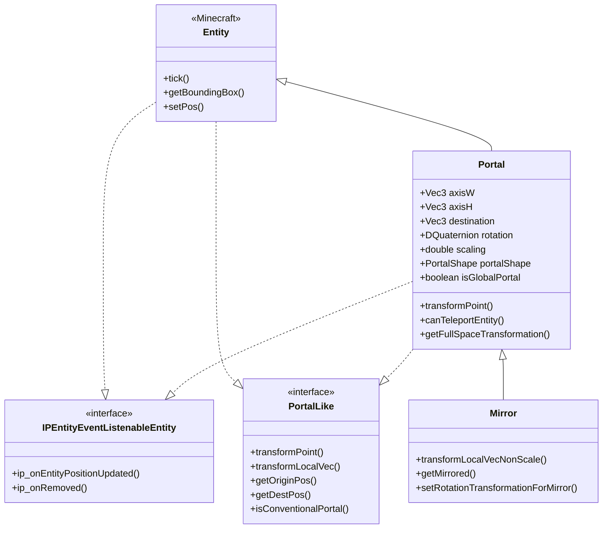
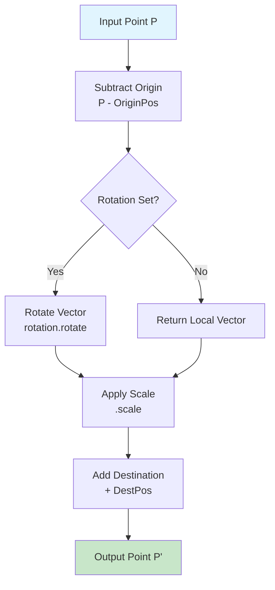
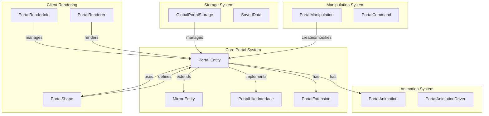
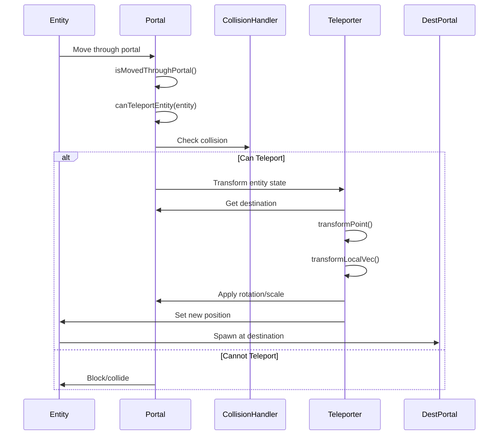

# Portal Entity System

## Table of Contents

- [Overview](#overview)
- [Portal Entity Class Hierarchy](#portal-entity-class-hierarchy)
- [Core Portal Entity (Portal.java)](#core-portal-entity-portaljava)
- [Transformation Mathematics](#transformation-mathematics)
- [Mirror System](#mirror-system)
- [Global Portal Storage](#global-portal-storage)
- [Portal Types Classification](#portal-types-classification)
- [Portal Lifecycle Management](#portal-lifecycle-management)
- [Architecture Diagram](#architecture-diagram)

---

## Overview

ImmersivePortalsMod 的传送门实体系统是整个模组的核心模块，负责实现跨维度传送、空间变换、渲染管理等关键功能。该系统基于 Minecraft 的实体系统（Entity）进行扩展，通过精心设计的数学变换实现复杂的空间扭曲效果。

传送门实体系统的主要组件包括：

| Component | Description |
|-----------|-------------|
| `Portal` | 核心传送门实体类，处理传送、变换、碰撞 |
| `Mirror` | 镜像实体，继承自 Portal，提供反射变换 |
| `PortalLike` | 接口，定义传送门行为的抽象 |
| `PortalManipulation` | 工具类，提供传送门操作的静态方法 |
| `PortalRenderInfo` | 客户端渲染信息管理 |
| `GlobalPortalStorage` | 全局传送门持久化存储 |

传送门系统支持多种高级特性：
- **空间缩放**：通过传送门可以实现物品/玩家在不同尺寸空间间移动
- **空间旋转**：传送时可以对玩家视角进行旋转
- **双向传送**：两个平行传送门形成闭环
- **镜像反射**：类似镜子的反射效果
- **动画系统**：传送门可以具有动画效果

---

## Portal Entity Class Hierarchy

### Class Hierarchy Diagram



### Key Class Relationships

传送门实体系统采用了多层继承和接口实现的架构：

1. **基础层**：Minecraft `Entity` 类提供实体基本功能
2. **接口层**：`PortalLike` 接口定义传送门核心行为，`IPEntityEventListenableEntity` 接口提供事件监听能力
3. **实现层**：`Portal` 类实现所有传送门逻辑
4. **扩展层**：`Mirror` 类在 Portal 基础上添加镜像变换

---

## Core Portal Entity (Portal.java)

### Entity Type Creation

`Portal.java` 是传送门系统的核心实体类。首先需要通过 Fabric 的 `FabricEntityTypeBuilder` 创建实体类型：

```83:108:D:\Minecraft-Learning\assets\ImmersivePortalsMod-6.0.6-mc1.21.1\src\main\java\qouteall\imm_ptl\core\portal\Portal.java
public class Portal extends Entity implements
    PortalLike, IPEntityEventListenableEntity {
    private static final Logger LOGGER = LogUtils.getLogger();
    
    public static final EntityType<Portal> ENTITY_TYPE = createPortalEntityType(Portal::new);
    
    public static <T extends Portal> EntityType<T> createPortalEntityType(
        EntityType.EntityFactory<T> constructor
    ) {
        return FabricEntityTypeBuilder.create(
                MobCategory.MISC,
                constructor
            ).dimensions(
                // eye height should be 0
                EntityDimensions.fixed(0, 0)
            ).fireImmune()
            .trackRangeBlocks(96)
            .trackedUpdateRate(20)
            .forceTrackedVelocityUpdates(true)
            .build();
    }
```

关键配置说明：
- **尺寸固定为 (0, 0)**：传送门是平面结构，不需要体积
- **火焰免疫**：传送门不会被岩浆/火焰破坏
- **跟踪范围 96 方块**：客户端需要同步的感知范围
- **强制追踪速度更新**：确保位置同步精确

### Core Properties

传送门实体的核心属性定义了传送门的空间特性和行为：

```113:139:D:\Minecraft-Learning\assets\ImmersivePortalsMod-6.0.6-mc1.21.1\src\main\java\qouteall\imm_ptl\core\portal\Portal.java
    protected double width = 0;
    protected double height = 0;
    protected double thickness = 0;
    
    protected Vec3 axisW;
    protected Vec3 axisH;
    
    protected ResourceKey<Level> dimensionTo;
    
    protected Vec3 destination;
    
    protected boolean teleportable = true;
    
    protected @Nullable PortalShape portalShape;
    
    @Nullable
    public UUID specificPlayerId;
    
    @Nullable
    protected DQuaternion rotation;
    
    protected double scaling = 1.0;
```

| Property | Type | Description |
|----------|------|-------------|
| `axisW`, `axisH` | Vec3 | 定义传送门平面的两个正交轴向量 |
| `dimensionTo` | ResourceKey<Level> | 目标维度 |
| `destination` | Vec3 | 目标位置 |
| `rotation` | DQuaternion | 旋转变换（四元数） |
| `scaling` | double | 缩放因子 |
| `portalShape` | PortalShape | 传送门形状（矩形、圆形等） |
| `specificPlayerId` | UUID | 限制特定玩家使用 |

### Axis System (坐标轴系统)

传送门的方向通过两个正交的轴向量 `axisW` 和 `axisH` 定义：

- `axisW`：水平轴向量，确定传送门的"宽度"方向
- `axisH`：垂直轴向量，确定传送门的"高度"方向
- `normal = axisW.cross(axisH)`：平面法向量，垂直于传送门平面

```482:487:D:\Minecraft-Learning\assets\ImmersivePortalsMod-6.0.6-mc1.21.1\src\main\java\qouteall\imm_ptl\core\portal\Portal.java
    public Vec3 getNormal() {
        if (normalCache == null) {
            normalCache = axisW.cross(axisH).normalize();
        }
        return normalCache;
    }
```

### NBT Serialization

传送门数据通过 NBT 进行持久化存储：

```233:363:D:\Minecraft-Learning\assets\ImmersivePortalsMod-6.0.6-mc1.21.1\src\main\java\qouteall\imm_ptl\core\portal\Portal.java
    @Override
    protected void readAdditionalSaveData(CompoundTag compoundTag) {
        width = compoundTag.getDouble("width");
        height = compoundTag.getDouble("height");
        thickness = compoundTag.getDouble("thickness");
        axisW = Helper.getVec3d(compoundTag, "axisW").normalize();
        axisH = Helper.getVec3d(compoundTag, "axisH").normalize();
        dimensionTo = Helper.getWorldId(compoundTag, "dimensionTo");
        destination = Helper.getVec3d(compoundTag, "destination");
        specificPlayerId = Helper.getUuid(compoundTag, "specificPlayer");
        
        if (compoundTag.contains("portalShape")) {
            CompoundTag portalShapeTag = compoundTag.getCompound("portalShape");
            PortalShape portalShape = PortalShapeSerialization.deserialize(portalShapeTag);
            // ...
        }
        
        if (compoundTag.contains("rotationA")) {
            setRotationTransformationD(new DQuaternion(
                compoundTag.getFloat("rotationB"),
                compoundTag.getFloat("rotationC"),
                compoundTag.getFloat("rotationD"),
                compoundTag.getFloat("rotationA")
            ));
        }
        // ...
    }
```

---

## Transformation Mathematics

传送门系统使用四元数（Quaternion）和 4x4 变换矩阵实现复杂的三维空间变换。

### Point Transformation

点的变换是传送门的核心功能，将原位置的点变换到目标位置：

```464:476:D:\Minecraft-Learning\assets\ImmersivePortalsMod-6.0.6-mc1.21.1\src\main\java\qouteall\imm_ptl\core\portal\Portal.java
    /**
     * @return use the portal's transformation to transform a point
     */
    @Override
    public Vec3 transformPoint(Vec3 pos) {
        Vec3 localPos = pos.subtract(getOriginPos());
        
        return transformLocalVec(localPos).add(getDestPos());
    }
    
    /**
     * Transform a vector in portal-centered coordinate (without translation transformation)
     */
    @Override
    public Vec3 transformLocalVec(Vec3 localVec) {
        return transformLocalVecNonScale(localVec).scale(scaling);
    }
```

### Vector Transformation with Rotation

向量的旋转变换通过四元数实现：

```1202:1208:D:\Minecraft-Learning\assets\ImmersivePortalsMod-6.0.6-mc1.21.1\src\main\java\qouteall\imm_ptl\core\portal\Portal.java
    public Vec3 transformLocalVecNonScale(Vec3 localVec) {
        if (rotation == null) {
            return localVec;
        }
        
        return rotation.rotate(localVec);
    }
    
    public Vec3 inverseTransformLocalVecNonScale(Vec3 localVec) {
        if (rotation == null) {
            return localVec;
        }
        
        return rotation.getConjugated().rotate(localVec);
    }
```

### Full Space Transformation Matrix

完整空间变换使用 4x4 矩阵表示：

```1403:1412:D:\Minecraft-Learning\assets\ImmersivePortalsMod-6.0.6-mc1.21.1\src\main\java\qouteall\imm_ptl\core\portal\Portal.java
    public Matrix4d getFullSpaceTransformation() {
        Vec3 originPos = getOriginPos();
        Vec3 destPos = getDestPos();
        DQuaternion rot = getRotationD();
        return new Matrix4d()
            .translation(destPos.x, destPos.y, destPos.z)
            .scale(getScale())
            .rotate(rot.toMcQuaternion())
            .translate(-originPos.x, -originPos.y, -originPos.z);
    }
```

变换顺序（从右到左）：
1. **平移到原点**：`translate(-originPos)`
2. **旋转变换**：`rotate(rot)`
3. **缩放变换**：`scale(getScale)`
4. **平移到目标**：`translate(destPos)`

### Transformation Flow Diagram



### Orientation Quaternion

传送门的方向通过四元数表示，这允许平滑的旋转插值：

```402:408:D:\Minecraft-Learning\assets\ImmersivePortalsMod-6.0.6-mc1.21.1\src\main\java\qouteall\imm_ptl\core\portal\PortalManipulation.java
    public static DQuaternion getPortalOrientationQuaternion(
        Vec3 axisW, Vec3 axisH
    ) {
        Vec3 normal = axisW.cross(axisH);
        
        return DQuaternion.matrixToQuaternion(axisW, axisH, normal);
    }
```

---

## Mirror System

`Mirror` 是 `Portal` 的子类，专门实现镜像/反射效果。镜子在 ImmersivePortalsMod 中用于实现"镜像房间"等功能。

### Mirror Class Definition

```12:45:D:\Minecraft-Learning\assets\ImmersivePortalsMod-6.0.6-mc1.21.1\src\main\java\qouteall\imm_ptl\core\portal\Mirror.java
public class Mirror extends Portal {
    public static final EntityType<Mirror> ENTITY_TYPE = Portal.createPortalEntityType(Mirror::new);
    
    public Mirror(EntityType<?> entityType, Level world) {
        super(entityType, world);
    }
    
    @Override
    public void tick() {
        super.tick();
        setTeleportable(false);
        setInteractable(false);
    }
    
    public Vec3 getMirrored(Vec3 vec) {
        Vec3 normal = getNormal();
        return mirroredVec(vec, normal);
    }
    
    public static Vec3 mirroredVec(Vec3 vec, Vec3 normal) {
        double len = vec.dot(normal);
        return vec.add(normal.scale(len * -2));
    }
```

镜像的核心原理是向量反射公式：
```
mirrored_vec = vec - 2 * (vec · normal) * normal
```

### Mirror Transformation Override

Mirror 重写了向量的旋转变换，在原有旋转基础上添加镜像反射：

```27:50:D:\Minecraft-Learning\assets\ImmersivePortalsMod-6.0.6-mc1.21.1\src\main\java\qouteall\imm_ptl\core\portal\Mirror.java
    // rotate before mirror
    @Override
    public Vec3 transformLocalVecNonScale(Vec3 localVec) {
        return getMirrored(super.transformLocalVecNonScale(localVec));
    }
    
    @Override
    public Vec3 inverseTransformLocalVecNonScale(Vec3 localVec) {
        return super.inverseTransformLocalVecNonScale(getMirrored(localVec));
    }
```

### Mirror Full Space Transformation

Mirror 使用反射矩阵而不是旋转矩阵：

```52:63:D:\Minecraft-Learning\assets\ImmersivePortalsMod-6.0.6-mc1.21.1\src\main\java\qouteall\imm_ptl\core\portal\Mirror.java
    @Override
    public Matrix4d getFullSpaceTransformation() {
        Vec3 originPos = getOriginPos();
        Vec3 destPos = getDestPos();
        DQuaternion rot = getRotationD();
        return new Matrix4d()
            .translation(destPos.x, destPos.y, destPos.z)
            .reflect(getNormal().x, getNormal().y, getNormal().z, 0)
            .scale(getScale())
            .rotate(rot.toMcQuaternion())
            .translate(-originPos.x, -originPos.y, -originPos.z);
    }
```

### Visual Rotation for Mirror

为了使镜子的旋转在视觉上匹配预期，需要特殊的处理：

```65:82:D:\Minecraft-Learning\assets\ImmersivePortalsMod-6.0.6-mc1.21.1\src\main\java\qouteall\imm_ptl\core\portal\Mirror.java
    /**
     * the mirror's transformation: firstly rotate, then mirror
     * totalTrans = mirror * rotation
     * the mirror transform is applied after rotation, so the reflection direction is rotated, which is not what we want
     * to make the new mirror's rotation to visually match, we need
     * visualRotation = newRotation * mirror
     * newRotation = visualRotation * mirror^-1
     * mirror = mirror^-1
     */
    public void setRotationTransformationForMirror(DQuaternion visualRotation) {
        Matrix3d mirrorTrans = new Matrix3d().reflect(
            getNormal().x, getNormal().y, getNormal().z
        );
        Matrix3d visualRotationTrans = new Matrix3d().rotate(visualRotation.toMcQuaternion());
        Matrix3d newRotation = new Matrix3d().mul(visualRotationTrans).mul(mirrorTrans);
        Quaterniond mirrorRotation = new Quaterniond().setFromNormalized(newRotation);
        setRotation(DQuaternion.fromMcQuaternion(mirrorRotation));
    }
```

---

## Global Portal Storage

全局传送门存储是 ImmersivePortalsMod 的持久化机制，允许传送门跨区块加载保持存在。

### GlobalPortalStorage Class

```55:112:D:\Minecraft-Learning\assets\ImmersivePortalsMod-6.0.6-mc1.21.1\src\main\java\qouteall\imm_ptl\core\portal\global_portals\GlobalPortalStorage.java
public class GlobalPortalStorage extends SavedData {
    private static final Logger LOGGER = LogUtils.getLogger();
    
    public List<Portal> data;
    public final WeakReference<ServerLevel> world;
    private int version = 1;
    private boolean shouldReSync = false;
    
    @Nullable
    public BlockState bedrockReplacement;
    
    public static void init() {
        ServerTickEvents.END_SERVER_TICK.register((server) -> {
            server.getAllLevels().forEach(world1 -> {
                GlobalPortalStorage gps = GlobalPortalStorage.get(world1);
                gps.tick();
            });
        });
        // ...
    }
    
    public static GlobalPortalStorage get(ServerLevel world) {
        return world.getDataStorage().computeIfAbsent(
            new SavedData.Factory<>(
                () -> {
                    LOGGER.info("Global portal storage initialized {}", world.dimension().location());
                    return new GlobalPortalStorage(world);
                },
                (nbt, holderLookup) -> {
                    GlobalPortalStorage globalPortalStorage = new GlobalPortalStorage(world);
                    globalPortalStorage.fromNbt(nbt);
                    return globalPortalStorage;
                },
                null
            ),
            "global_portal"
        );
    }
```

### Global Portal Lifecycle

全局传送门通过以下方式管理：

```165:180:D:\Minecraft-Learning\assets\ImmersivePortalsMod-6.0.6-mc1.21.1\src\main\java\qouteall\imm_ptl\core\portal\global_portals\GlobalPortalStorage.java
    public void removePortal(Portal portal) {
        data.remove(portal);
        portal.remove(Entity.RemovalReason.KILLED);
        onDataChanged();
    }
    
    public void addPortal(Portal portal) {
        Validate.isTrue(!data.contains(portal));
        
        Validate.isTrue(portal.isPortalValid());
        
        portal.isGlobalPortal = true;
        portal.myUnsetRemoved();
        data.add(portal);
        onDataChanged();
    }
```

### Normal to Global Portal Conversion

普通传送门可以转换为全局传送门：

```351:363:D:\Minecraft-Learning\assets\ImmersivePortalsMod-6.0.6-mc1.21.1\src\main\java\qouteall\imm_ptl\core\portal\global_portals\GlobalPortalStorage.java
    public static void convertNormalPortalIntoGlobalPortal(Portal portal) {
        Validate.isTrue(!portal.getIsGlobal());
        Validate.isTrue(!portal.level().isClientSide());
        
        // global portal can only be square
        portal.setPortalShapeToDefault();
        
        portal.remove(Entity.RemovalReason.KILLED);
        
        Portal newPortal = McHelper.copyEntity(portal);
        
        get(((ServerLevel) portal.level())).addPortal(newPortal);
    }
```

### NBT Serialization

全局传送门存储完整序列化所有传送门数据：

```265:295:D:\Minecraft-Learning\assets\ImmersivePortalsMod-6.0.6-mc1.21.1\src\main\java\qouteall\imm_ptl\core\portal\global_portals\GlobalPortalStorage.java
    @Override
    public @NotNull CompoundTag save(CompoundTag tag, HolderLookup.Provider registries) {
        if (data == null) {
            return tag;
        }
        
        ListTag listTag = new ListTag();
        ServerLevel currWorld = world.get();
        Validate.notNull(currWorld, "world is null");
        
        for (Portal portal : data) {
            Validate.isTrue(portal.level() == currWorld);
            CompoundTag portalTag = new CompoundTag();
            portal.saveWithoutId(portalTag);
            portalTag.putString(
                "entity_type",
                EntityType.getKey(portal.getType()).toString()
            );
            listTag.add(portalTag);
        }
        
        tag.put("data", listTag);
        tag.putInt("version", version);
        
        if (bedrockReplacement != null) {
            tag.put("bedrockReplacement", NbtUtils.writeBlockState(bedrockReplacement));
        }
        
        return tag;
    }
```

---

## Portal Types Classification

ImmersivePortalsMod 支持多种传送门类型，形成复杂的传送门集群关系。

### Portal Relationships

传送门之间可以形成多种关系类型：

| Relationship | Description | Creation Method |
|-------------|-------------|-----------------|
| **Reverse Portal** | 目标世界的返回传送门 | `createReversePortal()` |
| **Flipped Portal** | 同一世界的镜像传送门 | `createFlippedPortal()` |
| **Parallel Portal** | 平行的双向传送门对 | 自动配对 |
| **Cluster Portal** | 由主传送门派生的多个关联传送门 | PortalExtension |

### Reverse Portal Creation

反向传送门创建函数：

```88:117:D:\Minecraft-Learning\assets\ImmersivePortalsMod-6.0.6-mc1.21.1\src\main\java\qouteall\imm_ptl\core\portal\PortalManipulation.java
    public static <T extends Portal> T createReversePortal(Portal portal, EntityType<T> entityType) {
        Level world = portal.getDestinationWorld();
        
        T newPortal = entityType.create(world);
        assert newPortal != null;
        newPortal.setDestDim(portal.level().dimension());
        newPortal.setPos(portal.getDestPos().x, portal.getDestPos().y, portal.getDestPos().z);
        newPortal.setDestination(portal.getOriginPos());
        newPortal.specificPlayerId = portal.specificPlayerId;
        
        newPortal.setWidth(portal.getWidth() * portal.getScaling());
        newPortal.setHeight(portal.getHeight() * portal.getScaling());
        newPortal.setThickness(portal.getThickness() * portal.getScaling());
        newPortal.setAxisW(portal.getAxisW().scale(-1));
        newPortal.setAxisH(portal.getAxisH());
        
        newPortal.setPortalShape(portal.getPortalShape().getReverse());
        
        if (portal.getRotation() != null) {
            rotatePortalBody(newPortal, portal.getRotation());
            newPortal.setRotation(portal.getRotation().getConjugated());
        }
        
        newPortal.setScaling(1.0 / portal.getScaling());
        
        copyAdditionalProperties(newPortal, portal);
        
        return newPortal;
    }
```

### Flipped Portal Creation

翻转传送门（同一世界的镜像）：

```132:156:D:\Minecraft-Learning\assets\ImmersivePortalsMod-6.0.6-mc1.21.1\src\main\java\qouteall\imm_ptl\core\portal\PortalManipulation.java
    public static <T extends Portal> T createFlippedPortal(Portal portal, EntityType<T> entityType) {
        Level world = portal.level();
        T newPortal = entityType.create(world);
        assert newPortal != null;
        newPortal.setDestDim(portal.getDestDim());
        newPortal.setPos(portal.getX(), portal.getY(), portal.getZ());
        newPortal.setDestination(portal.getDestPos());
        newPortal.specificPlayerId = portal.specificPlayerId;
        
        newPortal.setWidth(portal.getWidth());
        newPortal.setHeight(portal.getHeight());
        newPortal.setThickness(portal.getThickness());
        newPortal.setAxisW(portal.getAxisW().scale(-1));
        newPortal.setAxisH(portal.getAxisH());
        
        newPortal.setPortalShape(portal.getPortalShape().getFlipped());
        
        newPortal.setRotation(portal.getRotation());
        newPortal.setScaling(portal.getScaling());
        
        copyAdditionalProperties(newPortal, portal);
        
        return newPortal;
    }
```

### Portal Validation

传送门的有效性检查：

```989:1021:D:\Minecraft-Learning\assets\ImmersivePortalsMod-6.0.6-mc1.21.1\src\main\java\qouteall\imm_ptl\core\portal\Portal.java
    public boolean isPortalValid() {
        boolean valid = dimensionTo != null &&
            width != 0 &&
            height != 0 &&
            axisW != null &&
            axisH != null &&
            getDestPos() != null &&
            axisW.lengthSqr() > 0.9 &&
            axisH.lengthSqr() > 0.9 &&
            getY() > (McHelper.getMinY(level()) - 100);
        if (valid) {
            if (level() instanceof ServerLevel serverLevel) {
                ServerLevel destWorld = serverLevel.getServer().getLevel(dimensionTo);
                if (destWorld == null) {
                    LOGGER.error("Portal Dest Dimension Missing {}", dimensionTo.location());
                    return false;
                }
                boolean inWorldBorder = destWorld.getWorldBorder().isWithinBounds(BlockPos.containing(getDestPos()));
                if (!inWorldBorder) {
                    LOGGER.error("Destination out of World Border {}", this);
                    return false;
                }
            }
            
            if (level().isClientSide()) {
                return isPortalValidClient();
            }
            
            return true;
        }
        return false;
    }
```

---

## Portal Lifecycle Management

### Entity Events

传送门实现了 `IPEntityEventListenableEntity` 接口来处理生命周期事件：

```451:458:D:\Minecraft-Learning\assets\ImmersivePortalsMod-6.0.6-mc1.21.1\src\main\java\qouteall\imm_ptl\core\portal\Portal.java
    @Override
    public void ip_onEntityPositionUpdated() {
        updateCache();
    }
    
    @Override
    public void ip_onRemoved(RemovalReason reason) {
        PORTAL_DISPOSE_SIGNAL.invoker().accept(this);
    }
```

### Portal Tick

每个游戏刻传送门执行以下操作：

```930:958:D:\Minecraft-Learning\assets\ImmersivePortalsMod-6.0.6-mc1.21.1\src\main\java\qouteall\imm_ptl\core\portal\Portal.java
    @Override
    public void tick() {
        if (getBoundingBox().equals(NULL_BOX)) {
            LOGGER.error("Abnormal bounding box {}", this);
        }
        
        lastTickPortalState = getThisTickPortalState();
        
        if (!level().isClientSide()) {
            if (reloadAndSyncNextTick) {
                reloadAndSyncToClient();
            }
        }
        
        if (level().isClientSide()) {
            CLIENT_PORTAL_TICK_SIGNAL.invoker().accept(this);
        }
        else {
            if (!isPortalValid()) {
                LOGGER.info("Removed invalid portal {}", this);
                remove(RemovalReason.KILLED);
                return;
            }
            SERVER_PORTAL_TICK_SIGNAL.invoker().accept(this);
        }
        
        animation.tick(this);
        
        super.tick();
    }
```

### Cache System

传送门使用缓存系统提高性能：

```552:570:D:\Minecraft-Learning\assets\ImmersivePortalsMod-6.0.6-mc1.21.1\src\main\java\qouteall\imm_ptl\core\portal\Portal.java
    public void updateCache() {
        if (axisW == null || axisH == null) {
            return;
        }
        
        portalStateCache = null;
        boundingBoxCache = null;
        thinBoundingBoxCache = null;
        normalCache = null;
        contentDirectionCache = null;
        thisSideCollisionExclusion = null;
        thisSideStateCache = null;
        otherSideStateCache = null;
    }
```

缓存的字段（私有缓存）：
- `boundingBoxCache`：碰撞箱
- `thinBoundingBoxCache`：薄边界箱
- `normalCache`：平面法向量
- `contentDirectionCache`：内容方向
- `portalStateCache`：传送门状态
- `thisSideStateCache`/`otherSideStateCache`：双边状态

### Server-Client Synchronization

服务器端修改传送门后需要同步到客户端：

```519:546:D:\Minecraft-Learning\assets\ImmersivePortalsMod-6.0.6-mc1.21.1\src\main\java\qouteall\imm_ptl\core\portal\Portal.java
    public void reloadAndSyncToClient() {
        reloadAndSyncNextTick = false;
        
        Validate.isTrue(!isGlobalPortal, "global portal is not synced by this");
        Validate.isTrue(!level().isClientSide(), "must be used on server side");
        updateCache();
        
        var packet = createSyncPacket();
        
        McHelper.sendToTrackers(this, packet);
    }
    
    public void reloadAndSyncToClientNextTick() {
        Validate.isTrue(!level().isClientSide(), "must be used on server side");
        reloadAndSyncNextTick = true;
    }
    
    public void reloadAndSyncClusterToClientNextTick() {
        PortalExtension.forClusterPortals(this, Portal::reloadAndSyncToClientNextTick);
    }
```

---

## Portal Render Info (Client-Side)

`PortalRenderInfo` 管理传送门的渲染相关状态，包括可见性预测。

### Visibility Prediction

传送门使用 GPU 查询来实现可见性预测，减少不必要的渲染：

```212:257:D:\Minecraft-Learning\assets\ImmersivePortalsMod-6.0.6-mc1.21.1\src\main\java\qouteall\imm_ptl\core\portal\PortalRenderInfo.java
    public static boolean renderAndDecideVisibility(Portal portal, Runnable queryRendering) {
        ProfilerFiller profiler = Minecraft.getInstance().getProfiler();
        
        boolean decision;
        if (IPGlobal.offsetOcclusionQuery) {
            PortalRenderInfo renderInfo = get(portal);
            
            List<UUID> renderingDescription = WorldRenderInfo.getRenderingDescription();
            
            Visibility visibility = renderInfo.getVisibility(renderingDescription);
            
            GlQueryObject lastFrameQuery = visibility.lastFrameQuery;
            GlQueryObject thisFrameQuery = visibility.acquireThisFrameQuery();
            
            thisFrameQuery.performQueryAnySamplePassed(queryRendering);
            
            boolean noPredict =
                renderInfo.isFrequentlyMispredicted() ||
                    QueryManager.queryStallCounter <= 3;
            
            if (lastFrameQuery != null) {
                boolean lastFrameVisible = lastFrameQuery.fetchQueryResult();
                
                if (!lastFrameVisible && noPredict) {
                    profiler.push("fetch_this_frame");
                    decision = thisFrameQuery.fetchQueryResult();
                    profiler.pop();
                    QueryManager.queryStallCounter++;
                }
                else {
                    decision = lastFrameVisible;
                    renderInfo.updatePredictionStatus(visibility, decision);
                }
            }
            else {
                profiler.push("fetch_this_frame");
                decision = thisFrameQuery.fetchQueryResult();
                profiler.pop();
                QueryManager.queryStallCounter++;
            }
        }
        else {
            decision = QueryManager.renderAndGetDoesAnySamplePass(queryRendering);
        }
        return decision;
    }
```

### Resource Management

使用 Java 的 Cleaner 机制进行资源清理：

```115:144:D:\Minecraft-Learning\assets\ImmersivePortalsMod-6.0.6-mc1.21.1\src\main\java\qouteall\imm_ptl\core\portal\PortalRenderInfo.java
    public PortalRenderInfo() {
        CLEANER.register(this, getGcDirectedCleaningFunc());
    }
    
    private Runnable getGcDirectedCleaningFunc() {
        Map<List<UUID>, Visibility> infoMap1 = this.infoMap;
        return () -> {
            LOGGER.debug("Running GC-directed PortalRenderInfo clean");
            
            IPGlobal.PRE_TOTAL_RENDER_TASK_LIST.addOneShotTask(() -> {
                disposeInfoMap(infoMap1);
            });
        };
    }
    
    @Override
    public void close() throws Exception {
        dispose();
    }
```

---

## PortalLike Interface

`PortalLike` 接口定义了传送门行为的抽象，允许其他类实现类似的传送门功能：

```20:108:D:\Minecraft-Learning\assets\ImmersivePortalsMod-6.0.6-mc1.21.1\src\main\java\qouteall\imm_ptl\core\portal\PortalLike.java
public interface PortalLike {
    boolean isConventionalPortal();
    
    AABB getThinBoundingBox();
    
    Vec3 transformPoint(Vec3 pos);
    
    Vec3 transformLocalVec(Vec3 localVec);
    
    Vec3 transformLocalVecNonScale(Vec3 localVec);
    
    Vec3 inverseTransformLocalVec(Vec3 localVec);
    
    Vec3 inverseTransformPoint(Vec3 point);
    
    double getDistanceToNearestPointInPortal(Vec3 point);
    
    double getDestAreaRadiusEstimation();
    
    Vec3 getOriginPos();
    
    Vec3 getDestPos();
    
    Level getOriginWorld();
    
    Level getDestWorld();
    
    ResourceKey<Level> getDestDim();
    
    // ... more methods
}
```

---

## Architecture Diagram

### Complete System Architecture



### Teleportation Flow



---

## Source File Reference

| File | Path |
|------|------|
| Portal.java | `D:\Minecraft-Learning\assets\ImmersivePortalsMod-6.0.6-mc1.21.1\src\main\java\qouteall\imm_ptl\core\portal\Portal.java` |
| Mirror.java | `D:\Minecraft-Learning\assets\ImmersivePortalsMod-6.0.6-mc1.21.1\src\main\java\qouteall\imm_ptl\core\portal\Mirror.java` |
| PortalLike.java | `D:\Minecraft-Learning\assets\ImmersivePortalsMod-6.0.6-mc1.21.1\src\main\java\qouteall\imm_ptl\core\portal\PortalLike.java` |
| PortalManipulation.java | `D:\Minecraft-Learning\assets\ImmersivePortalsMod-6.0.6-mc1.21.1\src\main\java\qouteall\imm_ptl\core\portal\PortalManipulation.java` |
| PortalRenderInfo.java | `D:\Minecraft-Learning\assets\ImmersivePortalsMod-6.0.6-mc1.21.1\src\main\java\qouteall\imm_ptl\core\portal\PortalRenderInfo.java` |
| GlobalPortalStorage.java | `D:\Minecraft-Learning\assets\ImmersivePortalsMod-6.0.6-mc1.21.1\src\main\java\qouteall\imm_ptl\core\portal\global_portals\GlobalPortalStorage.java` |

---

## Key Takeaways

1. **实体系统设计**：传送门继承 Minecraft `Entity` 类，充分利用已有的实体管理机制
2. **数学变换核心**：四元数和 4x4 矩阵实现平滑的旋转和缩放变换
3. **缓存优化**：通过多重缓存减少重复计算，提升性能
4. **持久化方案**：全局传送门使用 SavedData 实现跨维度持久化
5. **客户端同步**：服务器端修改后通过自定义数据包同步到客户端
6. **接口抽象**：PortalLike 接口允许第三方实现传送门行为
