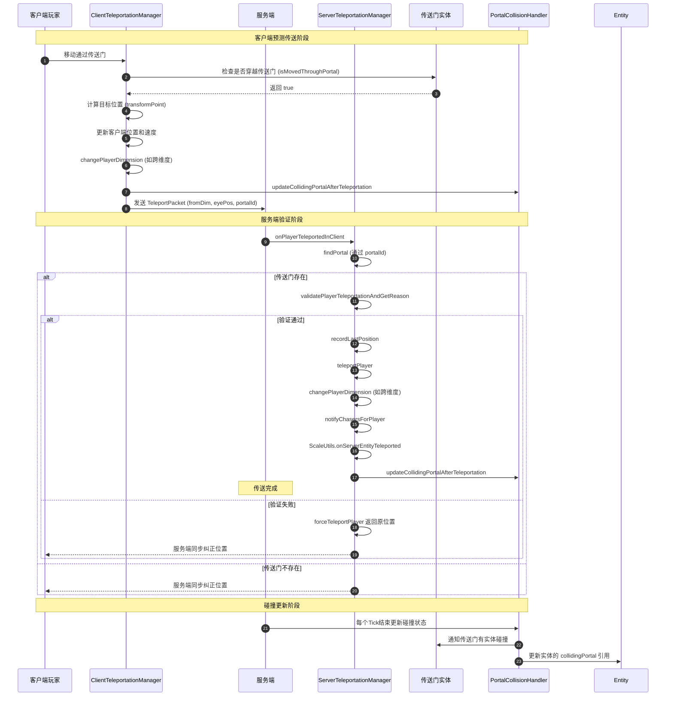
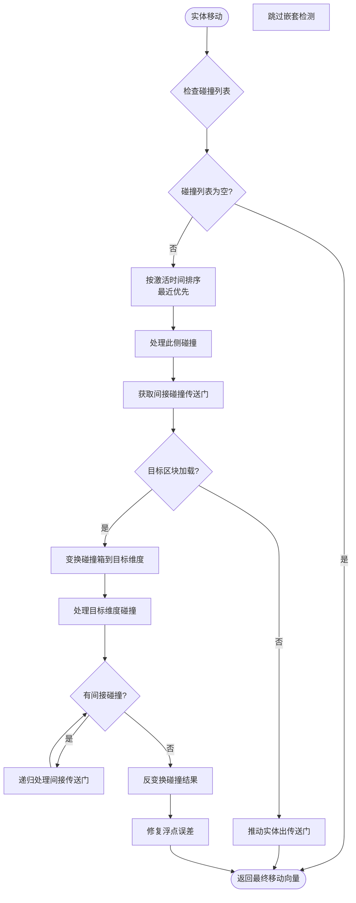

## Table of Contents

- [Overview](#overview)
- [Server-Side Teleportation (ServerTeleportationManager)](#server-side-teleportation-serverteleportationmanager)
- [Client-Side Teleportation (ClientTeleportationManager)](#client-side-teleportation-clientteleportationmanager)
- [Collision Detection System (PortalCollisionHandler)](#collision-detection-system-portalcollisionhandler)
- [Teleportation Flow Diagram](#teleportation-flow-diagram)
- [Collision Handling Flow](#collision-handling-flow)
- [Key Validation Logic](#key-validation-logic)
- [Special Cases (Vehicles, Entities)](#special-cases-vehicles-entities)

## Overview

ImmersivePortalsMod 的传送系统是一个复杂的双端（客户端/服务端）协同机制，实现了跨维度传送、碰撞检测和实体移动处理。该系统的核心设计理念是**客户端先行预测传送，服务端最终验证授权**，这与 Minecraft 原生的客户端预测-服务端验证架构完美契合。

传送系统涉及四个核心类：
- **ServerTeleportationManager**：服务端传送管理，处理所有传送请求的验证和执行
- **ClientTeleportationManager**：客户端传送管理，实现客户端预测传送逻辑
- **PortalCollisionHandler**：碰撞处理器，管理实体与传送门之间的碰撞交互
- **CollisionHelper**：碰撞辅助工具，提供碰撞检测的底层算法支持

### 核心数据流

```
客户端检测传送条件 → 客户端预测传送 → 发送传送包到服务端
                                          ↓
服务端验证 ← 查找对应传送门 ← 接收传送包
    ↓
验证通过：执行服务端传送 → 更新碰撞状态
    ↓
验证失败：强制拉回玩家
```

## Server-Side Teleportation (ServerTeleportationManager)

`ServerTeleportationManager` 是服务端传送的核心管理类，负责处理所有服务器端的传送逻辑。它采用单例模式，通过 `IPPerServerInfo` 与每个 Minecraft 服务器实例关联。

### 核心数据结构

```53:59:D:\Minecraft-Learning\assets\ImmersivePortalsMod-6.0.6-mc1.21.1\src\main\java\qouteall\imm_ptl\core\teleportation\ServerTeleportationManager.java
public class ServerTeleportationManager {
    private static final Logger LOGGER = LogUtils.getLogger();
    
    private final Set<Entity> teleportingEntities = new HashSet<>();
    private final WeakHashMap<Entity, Long> lastTeleportGameTime = new WeakHashMap<>();
    public boolean isFiringMyChangeDimensionEvent = false;
    public final WeakHashMap<ServerPlayer, WithDim<Vec3>> lastPosition = new WeakHashMap<>();
```

关键字段说明：
- `teleportingEntities`：标记当前正在传送的实体，防止重复传送
- `lastTeleportGameTime`：记录实体上次传送的游戏时间，用于冷却验证
- `lastPosition`：记录玩家上次位置，用于传送后的位置同步

### 初始化与Tick机制

```65:82:D:\Minecraft-Learning\assets\ImmersivePortalsMod-6.0.6-mc1.21.1\src\main\java\qouteall\imm_ptl\core\teleportation\ServerTeleportationManager.java
public static void init() {
    ServerTickEvents.END_SERVER_TICK.register(server -> {
        of(server).tick(server);
    });
    
    Portal.SERVER_PORTAL_TICK_SIGNAL.register(
        (portal) -> {
            ServerTeleportationManager serverTeleportationManager = of(portal.getServer());
            getEntitiesToTeleport(portal).forEach(entity -> {
                serverTeleportationManager.startTeleportingRegularEntity(portal, entity);
            });
        }
    );
    
    DimensionAPI.SERVER_PRE_REMOVE_DIMENSION_EVENT.register(
        world -> of(world.getServer()).evacuatePlayersFromDimension(world)
    );
}
```

初始化过程注册了三个关键事件处理器：
1. **服务器Tick结束事件**：每个Tick结束时清理 `teleportingEntities` 并管理全局传送门传送
2. **传送门Tick信号**：当传送门Tick时，获取应被传送的实体列表
3. **维度移除前事件**：维度被移除时撤离所有玩家

### 玩家传送处理

玩家传送是最高优先级的传送类型，通过 `onPlayerTeleportedInClient` 方法处理客户端发起的传送请求：

```160:226:D:\Minecraft-Learning\assets\ImmersivePortalsMod-6.0.6-mc1.21.1\src\main\java\qouteall\imm_ptl\core\teleportation\ServerTeleportationManager.java
public void onPlayerTeleportedInClient(
    ServerPlayer player,
    ResourceKey<Level> dimensionBefore,
    Vec3 eyePosBeforeTeleportation,
    UUID portalId
) {
    if (player.getRemovalReason() != null) {
        LOGGER.error("Trying to teleport a removed player {}", player);
        return;
    }
    
    Portal portal = findPortal(player.server, dimensionBefore, portalId);
    
    if (portal == null) {
        LOGGER.error(
            "Unable to find portal {} in {} to teleport {}",
            portalId, dimensionBefore.location(), player
        );
        return;
    }
    
    // ... validation and teleportation logic
}
```

该方法执行以下步骤：
1. 检查玩家是否已被移除
2. 根据 `portalId` 查找对应的传送门实体
3. 验证传送是否合法（通过 `validatePlayerTeleportationAndGetReason`）
4. 执行传送并处理副作用（如重力变化、跟随实体同步）

### 传送验证逻辑

传送验证是安全性的关键环节，`validatePlayerTeleportationAndGetReason` 方法实现了多层次验证：

```264:296:D:\Minecraft-Learning\assets\ImmersivePortalsMod-6.0.6-mc1.21.1\src\main\java\qouteall\imm_ptl\core\teleportation\ServerTeleportationManager.java
private @Nullable String validatePlayerTeleportationAndGetReason(
    ServerPlayer player,
    ResourceKey<Level> dimensionBefore,
    Vec3 posBefore,
    Portal portal
) {
    if (player.getVehicle() != null) {
        return null; // 骑乘状态下不验证（由单独处理）
    }
    
    // 检查是否有待处理的传送请求
    if (((IEServerPlayNetworkHandler) player.connection).ip_hasAwaitingTeleport()) {
        return "has awaiting teleport";
    }
    
    if (!portal.canTeleportEntity(player)) {
        return "portal cannot teleport player";
    }
    
    if (player.level().dimension() != dimensionBefore) {
        return "player is not in the dimensionBefore in packet";
    }
    
    if (player.position().distanceToSqr(posBefore) > 16 * 16) {
        return "player is too far from the posBefore in packet";
    }
    
    if (portal.getDistanceToNearestPointInPortal(posBefore) > 20) {
        return "posBefore is too far from portal";
    }
    
    return null;
}
```

验证项目包括：
- **传送冷却检查**：防止频繁传送
- **传送门权限检查**：传送门是否可以传送该玩家
- **维度一致性**：玩家当前维度是否与请求一致
- **位置距离检查**：玩家当前位置与声称位置的距离（16格以内）
- **传送门距离检查**：玩家与传送门的距离（20格以内）

### 维度切换实现

维度切换是传送的核心操作，`changePlayerDimension` 方法处理玩家在不同维度间的移动：

```421:485:D:\Minecraft-Learning\assets\ImmersivePortalsMod-6.0.6-mc1.21.1\src\main\java\qouteall\imm_ptl\core\teleportation\ServerTeleportationManager.java
private void changePlayerDimension(
    ServerPlayer player,
    ServerLevel fromWorld,
    ServerLevel toWorld,
    Vec3 newEyePos
) {
    // 避免玩家从旧世界移除时取消追踪所有实体
    teleportingEntities.add(player);
    
    Entity vehicle = player.getVehicle();
    if (vehicle != null) {
        ((IEServerPlayerEntity) player).ip_stopRidingWithoutTeleportRequest();
    }
    
    Vec3 oldPos = player.position();
    
    fromWorld.removePlayerImmediately(player, Entity.RemovalReason.CHANGED_DIMENSION);
    ((IEEntity) player).ip_unsetRemoved();
    
    McHelper.setEyePos(player, newEyePos, newEyePos);
    McHelper.updateBoundingBox(player);
    
    player.setServerLevel(toWorld);
    toWorld.addDuringTeleport(player);
    
    // 处理骑乘的载具跨维度传送
    if (vehicle != null) {
        Vec3 offset = McHelper.getVehicleOffsetFromPassenger(vehicle, player);
        Vec3 vehiclePos = player.position().add(offset);
        vehicle = teleportVehicleAcrossDimensions(
            vehicle,
            toWorld.dimension(),
            vehiclePos.add(McHelper.getEyeOffset(vehicle))
        );
        // ... 重新设置骑乘关系
    }
    
    O_O.onPlayerTravelOnServer(player, fromWorld, toWorld);
    ((IEServerPlayerEntity) player).portal_worldChanged(fromWorld, oldPos);
}
```

关键点：
1. 将玩家加入 `teleportingEntities` 防止实体追踪问题
2. 解除骑乘关系后单独处理载具传送
3. 使用 `removePlayerImmediately` 避免触发实体追踪清理
4. 维度切换后保持玩家的骑乘关系

### 普通实体传送

对于非玩家实体（如生物、物品等），通过 `teleportRegularEntity` 方法处理：

```507:583:D:\Minecraft-Learning\assets\ImmersivePortalsMod-6.0.6-mc1.21.1\src\main\java\qouteall\imm_ptl\core\teleportation\ServerTeleportationManager.java
private void teleportRegularEntity(Entity entity, Portal portal) {
    Validate.isTrue(!(entity instanceof ServerPlayer));
    if (entity.getRemovalReason() != null) {
        return;
    }
    
    if (entity.level() != portal.level()) {
        return;
    }
    
    if (portal.getDistanceToNearestPointInPortal(entity.getEyePosition()) > 5) {
        return;
    }
    
    long currGameTime = McHelper.getServerGameTime();
    Long lastTeleportGameTime = this.lastTeleportGameTime.getOrDefault(entity, 0L);
    if (currGameTime - lastTeleportGameTime <= 0) {
        return;
    }
    this.lastTeleportGameTime.put(entity, currGameTime);
    
    Vec3 velocity = entity.getDeltaMovement();
    Vec3 oldPos = entity.position();
    
    List<Entity> passengerList = entity.getPassengers();
    
    Vec3 newEyePos = getRegularEntityTeleportedEyePos(entity, portal);
    
    TeleportationUtil.transformEntityVelocity(
        portal, entity, TeleportationUtil.PortalPointVelocity.ZERO, oldPos
    );
    
    if (portal.getDestDim() != entity.level().dimension()) {
        entity = changeEntityDimension(entity, portal.getDestDim(), newEyePos, true);
        // 处理乘客列表...
    }
    
    // 避免位置插值导致的卡顿
    McHelper.sendToTrackers(
        entity,
        McRemoteProcedureCall.createPacketToSendToClient(
            "qouteall.imm_ptl.core.teleportation.ClientTeleportationManager.RemoteCallables.updateEntityPos",
            entity.level().dimension(),
            entity.getId(),
            entity.position()
        )
    );
}
```

## Client-Side Teleportation (ClientTeleportationManager)

客户端传送管理器实现客户端预测传送（Client-Side Prediction），允许玩家在服务端确认前体验流畅的传送效果。这是实现无缝跨维度传送体验的关键。

### 客户端Tick循环

```95:100:D:\Minecraft-Learning\assets\ImmersivePortalsMod-6.0.6-mc1.21.1\src\main\java\qouteall\imm_ptl\core\teleportation\ClientTeleportationManager.java
private static void tick() {
    tickTimeForTeleportation++;
    changePlayerMotionIfCollidingWithPortal();
    
    isTeleportingTick = false;
}
```

客户端的 `tick` 方法非常简单，主要作用是递增传送时间计数器并处理传送门碰撞时的运动调整。

### 主传送逻辑

`manageTeleportation` 是客户端传送的核心方法，处理每一帧的传送检测：

```121:203:D:\Minecraft-Learning\assets\ImmersivePortalsMod-6.0.6-mc1.21.1\src\main\java\qouteall\imm_ptl\core\teleportation\ClientTeleportationManager.java
public static void manageTeleportation(boolean isTicking_) {
    if (IPGlobal.disableTeleportation) {
        return;
    }
    
    isTicking = isTicking_;
    teleportationCounter++;
    isTeleportingFrame = false;
    
    if (client.level == null || client.player == null) {
        lastPlayerEyePos = null;
        return;
    }
    
    // 未初始化的玩家（坐标为0,0,0）
    if (client.player.xo == 0 && client.player.yo == 0 && client.player.zo == 0) {
        return;
    }
    
    // 处理自定义动画传送门的状态更新
    ClientPortalAnimationManagement.foreachCustomAnimatedPortals(
        portal -> {
            PortalExtension.forClusterPortals(
                portal, p -> p.animation.updateClientState(p, teleportationCounter)
            );
        }
    );
    
    float realPartialTicks = RenderStates.getPartialTick();
    TeleportationUtil.Teleportation lastTeleportation = null;
    
    // 支持连续传送（Combo-Teleport）
    // 用于处理多层嵌套传送门
    if (lastPlayerEyePos != null) {
        for (int i = 0; i <= teleportLimitPerFrame; i++) {
            TeleportationUtil.Teleportation teleportation = tryTeleport(realPartialTicks);
            if (teleportation == null) {
                break;
            }
            else {
                lastTeleportation = teleportation;
                if (i == teleportLimitPerFrame) {
                    // 拒绝超过限制的连续传送
                    LOGGER.info("Combo teleport out of limit. Reject teleportation!");
                    forceTeleportPlayer(originalDim, oldPos);
                    return;
                }
            }
        }
    }
    
    // 传送后位置调整
    if (lastTeleportation != null) {
        if (PortalExtension.get(lastTeleportation.portal()).adjustPositionAfterTeleport) {
            adjustPlayerPosition(client.player);
        }
    }
    
    lastPlayerEyePos = getPlayerEyePos(realPartialTicks);
}
```

关键特性：
- **连续传送支持**：允许单帧内通过多个传送门（最多3次）
- **动画状态同步**：更新动画传送门的客户端状态
- **位置调整**：传送后自动调整玩家位置避免卡在方块中

### 传送尝试逻辑

`tryTeleport` 方法实现具体的传送检测逻辑：

```210:314:D:\Minecraft-Learning\assets\ImmersivePortalsMod-6.0.6-mc1.21.1\src\main\java\qouteall\imm_ptl\core\teleportation\ClientTeleportationManager.java
private static TeleportationUtil.Teleportation tryTeleport(float partialTicks) {
    LocalPlayer player = client.player;
    Vec3 thisFrameEyePos = getPlayerEyePos(partialTicks);
    
    // 移动过快时跳过传送检测
    if (lastPlayerEyePos.distanceToSqr(thisFrameEyePos) > 1600) {
        return null;
    }
    
    ArrayList<TeleportationUtil.Teleportation> teleportationCandidates = new ArrayList<>();
    
    // 遍历附近传送门
    IPMcHelper.traverseNearbyPortals(
        player.level(),
        thisFrameEyePos,
        IPGlobal.maxNormalPortalRadius + 1,
        portal -> {
            if (!portal.canTeleportEntity(player)) {
                return;
            }
            
            // 区分动态传送和静态传送
            if (portal.animation.clientLastFramePortalStateCounter == teleportationCounter - 1
                && portal.animation.clientLastFramePortalState != null) {
                // 动态传送（动画传送门）
                TeleportationUtil.Teleportation teleportation =
                    TeleportationUtil.checkDynamicTeleportation(
                        portal,
                        portal.animation.clientLastFramePortalState,
                        portal.animation.clientCurrentFramePortalState,
                        lastPlayerEyePos,
                        thisFrameEyePos,
                        portal.animation.lastTickAnimatedState,
                        portal.animation.thisTickAnimatedState,
                        lastTickEyePos,
                        thisTickEyePos,
                        partialTicks
                    );
                if (teleportation != null) {
                    teleportationCandidates.add(teleportation);
                }
            }
            else {
                // 静态传送
                TeleportationUtil.Teleportation teleportation =
                    TeleportationUtil.checkStaticTeleportation(
                        portal,
                        lastPlayerEyePos, thisFrameEyePos,
                        lastTickEyePos, thisTickEyePos
                    );
                if (teleportation != null) {
                    teleportationCandidates.add(teleportation);
                }
            }
        }
    );
    
    // 选择最近的传送碰撞点
    TeleportationUtil.Teleportation teleportation = teleportationCandidates
        .stream()
        .min(Comparator.comparingDouble(
            p -> p.worldCollisionPoint().distanceToSqr(lastPlayerEyePos)
        ))
        .orElse(null);
    
    // 执行传送并更新状态
    if (teleportation != null) {
        Portal portal = teleportation.portal();
        teleportPlayer(teleportation, partialTicks);
        
        // 调整 lastPlayerEyePos 避免浮点误差导致重复传送
        double adjustment = portal.respectParallelOrientedPortal() ? -0.001 : 0.001;
        Vec3 newDelta = teleportation.newThisTickEyePos()
            .subtract(teleportation.newLastTickEyePos());
        lastPlayerEyePos = teleportation.teleportationCheckpoint()
            .add(newDelta.scale(adjustment));
        
        return teleportation;
    }
    
    return null;
}
```

### 客户端执行传送

`teleportPlayer` 方法执行实际的客户端传送操作：

```320:424:D:\Minecraft-Learning\assets\ImmersivePortalsMod-6.0.6-mc1.21.1\src\main\java\qouteall\imm_ptl\core\teleportation\ClientTeleportationManager.java
private static void teleportPlayer(
    TeleportationUtil.Teleportation teleportation, float partialTicks
) {
    Portal portal = teleportation.portal();
    
    if (tickTimeForTeleportation <= teleportTickTimeLimit) {
        return; // 冷却时间内拒绝传送
    }
    
    lastTeleportGameTime = tickTimeForTeleportation;
    
    LocalPlayer player = client.player;
    ResourceKey<Level> toDimension = portal.getDestDim();
    
    ClientLevel fromWorld = client.level;
    ResourceKey<Level> fromDimension = fromWorld.dimension();
    
    // 跨维度处理
    if (fromDimension != toDimension) {
        ClientLevel toWorld = ClientWorldLoader.getWorld(toDimension);
        changePlayerDimension(player, fromWorld, toWorld, newThisTickEyePos);
    }
    
    // 更新位置和碰撞箱
    McHelper.setEyePos(player, newThisTickEyePos, newLastTickEyePos);
    McHelper.updateBoundingBox(player);
    
    // 处理旋转和重力变化
    Vec3 oldRealVelocity = McHelper.getWorldVelocity(player);
    TransformationManager.managePlayerRotationAndChangeGravity(portal);
    McHelper.setWorldVelocity(player, oldRealVelocity);
    
    // 转换速度
    TeleportationUtil.transformEntityVelocity(
        portal, player, teleportation.portalPointVelocity(), thisTickEyePos
    );
    
    // 处理骑乘载具
    if (vehicle != null) {
        TeleportationUtil.transformEntityVelocity(
            portal, vehicle, teleportation.portalPointVelocity(), oldVehiclePos
        );
    }
    
    // 缩放处理
    ScaleUtils.onClientPlayerTeleported(portal);
    
    // 发送传送包到服务端进行验证
    player.connection.send(ClientPlayNetworking.createC2SPacket(
        new ImmPtlNetworking.TeleportPacket(
            PortalAPI.clientDimKeyToInt(fromDimension),
            thisTickEyePos,
            portal.getUUID()
        )
    ));
    
    // 更新碰撞状态
    PortalCollisionHandler.updateCollidingPortalAfterTeleportation(
        player, newThisTickEyePos, newLastTickEyePos, RenderStates.getPartialTick()
    );
    
    isTeleportingTick = true;
    isTeleportingFrame = true;
}
```

### 客户端维度切换

```458:527:D:\Minecraft-Learning\assets\ImmersivePortalsMod-6.0.6-mc1.21.1\src\main\java\qouteall\imm_ptl\core\teleportation\ClientTeleportationManager.java
public static void changePlayerDimension(
    LocalPlayer player, ClientLevel fromWorld, ClientLevel toWorld, Vec3 newEyePos
) {
    Validate.isTrue(!WorldRenderInfo.isRendering());
    Validate.isTrue(!FrontClipping.isClippingEnabled);
    Validate.isTrue(!PacketRedirectionClient.getIsProcessingRedirectedMessage());
    
    Entity vehicle = player.getVehicle();
    player.unRide();
    
    // 更新网络处理器关联的世界
    ((IEClientPlayNetworkHandler) client.getConnection()).ip_setWorld(toWorld);
    
    fromWorld.removeEntity(player.getId(), Entity.RemovalReason.CHANGED_DIMENSION);
    ((IEEntity) player).ip_setWorld(toWorld);
    
    McHelper.setEyePos(player, newEyePos, newEyePos);
    McHelper.updateBoundingBox(player);
    
    ((IEEntity) player).ip_unsetRemoved();
    toWorld.addEntity(player);
    ((IEAbstractClientPlayer) player).ip_setClientLevel(toWorld);
    
    // 更新渲染器相关资源
    IEGameRenderer gameRenderer = (IEGameRenderer) Minecraft.getInstance().gameRenderer;
    gameRenderer.ip_setLightmapTextureManager(
        ClientWorldLoader.getDimensionRenderHelper(toDimension).lightmapTexture
    );
    
    client.level = toWorld;
    ((IEMinecraftClient) client).ip_setWorldRenderer(
        ClientWorldLoader.getWorldRenderer(toDimension)
    );
    
    // 处理粒子系统世界引用
    if (client.particleEngine != null) {
        ((IEParticleManager) client.particleEngine).ip_setWorld(toWorld);
    }
    
    client.getBlockEntityRenderDispatcher().setLevel(toWorld);
    
    // 载具跨维度传送
    if (vehicle != null) {
        Vec3 offset = McHelper.getVehicleOffsetFromPassenger(vehicle, player);
        Vec3 vehiclePos = player.position().add(offset);
        moveClientEntityAcrossDimension(vehicle, toWorld, vehiclePos);
        player.startRiding(vehicle, true);
    }
    
    // 雾和光照上下文更新
    FogRendererContext.onPlayerTeleport(fromDimension, toDimension);
    O_O.onPlayerChangeDimensionClient(fromDimension, toDimension);
}
```

## Collision Detection System (PortalCollisionHandler)

碰撞检测系统是传送门功能的核心，负责检测实体何时与传送门碰撞，并处理跨传送门的碰撞响应。

### 碰撞条目管理

```29:66:D:\Minecraft-Learning\assets\ImmersivePortalsMod-6.0.6-mc1.21.1\src\main\java\qouteall\imm_ptl\core\collision\PortalCollisionHandler.java
public class PortalCollisionHandler {
    private static final int maxCollidingPortals = 6;
    
    public long lastActiveTime;
    public final List<PortalCollisionEntry> portalCollisions = new ArrayList<>();
    
    public boolean isRecentlyCollidingWithPortal(Entity entity) {
        return getTiming(entity) - lastActiveTime < 20;
    }
    
    public void update(Entity entity) {
        portalCollisions.removeIf(p -> {
            // 移除不在同一维度的碰撞
            if (p.portal.level() != entity.level()) {
                return true;
            }
            
            // 扩展碰撞箱检测
            AABB stretchedBoundingBox = CollisionHelper.getStretchedBoundingBox(entity);
            if (!stretchedBoundingBox.inflate(0.5).intersects(p.portal.getBoundingBox())) {
                return true;
            }
            
            // 时间同步检查（3tick内的碰撞视为有效）
            if (Math.abs(getTiming(entity) - p.activeTime) >= 3) {
                return true;
            }
            
            // 基于眼睛位置重新检查碰撞
            if (!CollisionHelper.mayEntityCollideWithPortal(
                entity, p.portal, entity.getEyePosition(0), entity.getBoundingBox()
            )) {
                return true;
            }
            
            return false;
        });
    }
```

每个实体维护一个 `portalCollisions` 列表，记录当前与其碰撞的所有传送门。最大支持6个传送门同时碰撞（用于处理嵌套传送门场景）。

### 碰撞响应处理

`handleCollision` 方法是碰撞响应的核心入口：

```72:142:D:\Minecraft-Learning\assets\ImmersivePortalsMod-6.0.6-mc1.21.1\src\main\java\qouteall\imm_ptl\core\collision\PortalCollisionHandler.java
public Vec3 handleCollision(
    Entity entity, Vec3 attemptedMove
) {
    if (portalCollisions.isEmpty()) {
        return attemptedMove;
    }
    
    entity.level().getProfiler().push("cross_portal_collision");
    
    portalCollisions.sort(
        Comparator.comparingLong((PortalCollisionEntry p) -> p.activeTime).reversed()
    );
    
    Vec3 result = doHandleCollision(
        entity, attemptedMove, 1, portalCollisions, entity.getBoundingBox()
    );
    
    entity.level().getProfiler().pop();
    
    return result;
}

private static Vec3 doHandleCollision(
    Entity entity, Vec3 attemptedMove, int portalLayer,
    List<PortalCollisionEntry> portalCollisions, AABB originalBoundingBox
) {
    Vec3 currentMove = attemptedMove;
    
    // 处理传送门此侧的移动
    currentMove = handleThisSideMove(
        entity, currentMove,
        originalBoundingBox,
        portalCollisions
    );
    
    // 处理传送门彼侧的碰撞检测
    for (PortalCollisionEntry portalCollision : portalCollisions) {
        Portal portal = portalCollision.portal;
        Vec3 eyePos = entity.getEyePosition(0);
        currentMove = handleOtherSideMove(
            entity, currentMove, portal,
            originalBoundingBox, portal.transformPoint(eyePos),
            portalLayer
        );
    }
    
    // 修复浮点误差
    Vec3 r = new Vec3(
        CollisionHelper.fixCoordinateFloatingPointError(attemptedMove.x, currentMove.x),
        CollisionHelper.fixCoordinateFloatingPointError(attemptedMove.y, currentMove.y),
        CollisionHelper.fixCoordinateFloatingPointError(attemptedMove.z, currentMove.z)
    );
    
    return r;
}
```

碰撞处理分为两个阶段：
1. **此侧处理**：计算在传送门这一侧的碰撞响应
2. **彼侧处理**：将碰撞检测延伸到传送门目标维度

### 彼侧碰撞处理

`handleOtherSideMove` 实现跨传送门的碰撞检测，这是系统最复杂的部分：

```145:244:D:\Minecraft-Learning\assets\ImmersivePortalsMod-6.0.6-mc1.21.1\src\main\java\qouteall\imm_ptl\core\collision\PortalCollisionHandler.java
private static Vec3 handleOtherSideMove(
    Entity entity,
    Vec3 attemptedMove,
    Portal collidingPortal,
    AABB originalBoundingBox,
    Vec3 transformedEyePos,
    int portalLayer
) {
    if (!collidingPortal.getHasCrossPortalCollision()) {
        return attemptedMove;
    }
    
    // 限制最大递归层级
    if (portalLayer >= 5) {
        return attemptedMove;
    }
    
    // 变换移动向量到传送门本地坐标
    Vec3 transformedAttemptedMove = collidingPortal.transformLocalVec(attemptedMove);
    
    // 变换碰撞箱到目标维度
    AABB boxOtherSide = CollisionHelper.transformBox(collidingPortal, originalBoundingBox);
    if (boxOtherSide == null) {
        return attemptedMove;
    }
    
    // 过大碰撞箱跳过计算
    if (isBoxTooBig(boxOtherSide)) {
        return attemptedMove;
    }
    
    Level destinationWorld = collidingPortal.getDestWorld();
    
    // 检查目标维度区块是否加载
    if (!destinationWorld.hasChunkAt(BlockPos.containing(boxOtherSide.getCenter()))) {
        if (portalLayer <= 1) {
            return handleOtherSideChunkNotLoaded(
                entity, attemptedMove, collidingPortal, originalBoundingBox
            );
        }
        return attemptedMove;
    }
    
    // 查找目标维度的间接碰撞传送门
    List<Portal> indirectCollidingPortals = McHelper.findEntitiesByBox(
        Portal.class,
        collidingPortal.getDestinationWorld(),
        boxOtherSide.expandTowards(transformedAttemptedMove),
        IPGlobal.maxNormalPortalRadius,
        p -> CollisionHelper.mayEntityCollideWithPortal(
            entity, p, transformedEyePos, boxOtherSide
        ) && collidingPortal.isOnDestinationSide(p.getOriginPos(), 0.1)
    );
    
    // 获取变换后的重力方向
    Direction transformedGravityDirection = collidingPortal.getTransformedGravityDirection(
        GravityChangerInterface.invoker.getGravityDirection(entity)
    );
    
    // 获取内部裁剪平面
    Plane innerClipping = collidingPortal.getInnerClipping();
    
    // 处理与目标维度方块的碰撞
    Vec3 collided = transformedAttemptedMove;
    collided = CollisionHelper.handleCollisionWithShapeProcessor(
        entity, boxOtherSide, destinationWorld,
        collided,
        shape -> {
            VoxelShape current = innerClipping == null ? shape :
                CollisionHelper.clipVoxelShape(
                    shape, innerClipping.pos(), innerClipping.normal()
                );
            
            if (!indirectCollidingPortals.isEmpty()) {
                current = processThisSideCollisionShape(
                    current, indirectCollidingPortals
                );
            }
            
            return current;
        },
        transformedGravityDirection, collidingPortal.getScale()
    );
    
    // 递归处理间接碰撞传送门
    if (!indirectCollidingPortals.isEmpty()) {
        for (Portal indirectCollidingPortal : indirectCollidingPortals) {
            collided = handleOtherSideMove(
                entity, collided,
                indirectCollidingPortal, boxOtherSide,
                collidingPortal.transformPoint(transformedEyePos),
                portalLayer + 1
            );
        }
    }
    
    // 反变换碰撞结果
    Vec3 result = collidingPortal.inverseTransformLocalVec(collided);
    
    return result;
}
```

### CollisionHelper 工具类

`CollisionHelper` 提供碰撞检测的底层算法支持：

```49:98:D:\Minecraft-Learning\assets\ImmersivePortalsMod-6.0.6-mc1.21.1\src\main\java\qouteall\imm_ptl\core\collision\CollisionHelper.java
/**
 * 使用平面裁剪AABB盒
 * 法线指向的一侧将被保留
 */
public static @Nullable AABB clipBox(AABB box, Vec3 planePos, Vec3 planeNormal) {
    boolean xForward = planeNormal.x > 0;
    boolean yForward = planeNormal.y > 0;
    boolean zForward = planeNormal.z > 0;
    
    Vec3 pushedPos = new Vec3(
        xForward ? box.minX : box.maxX,
        yForward ? box.minY : box.maxY,
        zForward ? box.minZ : box.maxZ
    );
    Vec3 staticPos = new Vec3(
        xForward ? box.maxX : box.minX,
        yForward ? box.maxY : box.minY,
        zForward ? box.maxZ : box.minZ
    );
    
    double tOfPushedPos = Helper.getCollidingT(planePos, planeNormal, pushedPos, planeNormal);
    boolean isPushedPosInFrontOfPlane = tOfPushedPos < 0;
    if (isPushedPosInFrontOfPlane) {
        return box;
    }
    boolean isStaticPosInFrontOfPlane = Helper.isInFrontOfPlane(
        staticPos, planePos, planeNormal
    );
    if (!isStaticPosInFrontOfPlane) {
        return null; // 完全裁剪
    }
    
    // 部分裁剪
    Vec3 afterBeingPushed = pushedPos.add(planeNormal.scale(tOfPushedPos));
    return new AABB(afterBeingPushed, staticPos);
}

/**
 * 检查AABB是否完全在平面后面
 */
public static boolean isBoxFullyBehindPlane(Vec3 planePos, Vec3 planeNormal, AABB box) {
    boolean xForward = planeNormal.x > 0;
    boolean yForward = planeNormal.y > 0;
    boolean zForward = planeNormal.z > 0;
    
    Vec3 testingPos = new Vec3(
        xForward ? box.maxX : box.minX,
        yForward ? box.maxY : box.minY,
        zForward ? box.maxZ : box.minZ
    );
    
    return testingPos.subtract(planePos).dot(planeNormal) < 0;
}
```

### 碰撞更新循环

```403:436:D:\Minecraft-Learning\assets\ImmersivePortalsMod-6.0.6-mc1.21.1\src\main\java\qouteall\imm_ptl\core\collision\CollisionHelper.java
public static void updateCollidingPortalForWorld(Level world, float partialTick) {
    world.getProfiler().push("update_colliding_portal");
    
    List<Portal> globalPortals = GlobalPortalStorage.getGlobalPortals(world);
    Iterable<Entity> worldEntityList = McHelper.getWorldEntityList(world);
    
    for (Entity entity : worldEntityList) {
        if (entity instanceof Portal portal) {
            // 传送门之间的碰撞更新
            CollisionHelper.notifyCollidingPortals(portal, partialTick);
        }
        else {
            AABB entityBoundingBoxStretched = getStretchedBoundingBox(entity);
            for (Portal globalPortal : globalPortals) {
                AABB globalPortalBoundingBox = globalPortal.getBoundingBox();
                if (entityBoundingBoxStretched.intersects(globalPortalBoundingBox)) {
                    if (canCollideWithPortal(entity, globalPortal, partialTick)) {
                        ((IEEntity) entity).ip_notifyCollidingWithPortal(globalPortal);
                    }
                }
            }
        }
    }
    
    world.getProfiler().pop();
}
```

服务端在每个Tick结束时调用此方法更新所有实体的碰撞状态。

## Teleportation Flow Diagram

下面的 Mermaid 图展示了一次完整的玩家传送流程：



## Collision Handling Flow

下面的流程图展示碰撞检测系统的详细工作流程：



## Key Validation Logic

### 实体是否应该传送

```94:106:D:\Minecraft-Learning\assets\ImmersivePortalsMod-6.0.6-mc1.21.1\src\main\java\qouteall\imm_ptl\core\teleportation\ServerTeleportationManager.java
public static boolean shouldEntityTeleport(Portal portal, Entity entity) {
    if (entity.level() != portal.level()) {return false;}
    if (!portal.canTeleportEntity(entity)) {return false;}
    Vec3 lastEyePos = entity.getEyePosition(0);
    Vec3 nextEyePos = entity.getEyePosition(1);
    
    if (entity instanceof Projectile) {
        nextEyePos = nextEyePos.add(McHelper.getWorldVelocity(entity));
    }
    
    boolean movedThroughPortal = portal.isMovedThroughPortal(lastEyePos, nextEyePos);
    return movedThroughPortal;
}
```

关键判断逻辑：
1. **维度匹配**：实体必须在传送门所在维度
2. **传送权限**：传送门允许传送该实体
3. **眼睛位置穿越**：实体的眼睛从传送门一侧穿越到另一侧

### 实体传送冷却

```721:725:D:\Minecraft-Learning\assets\ImmersivePortalsMod-6.0.6-mc1.21.1\src\main\java\qouteall\imm_ptl\core\teleportation\ServerTeleportationManager.java
public boolean isJustTeleported(Entity entity, long valveTickTime) {
    long currGameTime = McHelper.getServerGameTime();
    Long lastTeleportGameTime = this.lastTeleportGameTime.getOrDefault(entity, -100000L);
    return currGameTime - lastTeleportGameTime < valveTickTime;
}
```

防止实体在短时间内多次传送造成问题。

## Special Cases (Vehicles, Entities)

### 载具传送处理

载具传送是传送系统中最复杂的特殊情况之一，需要保持玩家与载具的骑乘关系：

```449:464:D:\Minecraft-Learning\assets\ImmersivePortalsMod-6.0.6-mc1.21.1\src\main\java\qouteall\imm_ptl\core\teleportation\ServerTeleportationManager.java
if (vehicle != null) {
    Vec3 offset = McHelper.getVehicleOffsetFromPassenger(vehicle, player);
    Vec3 vehiclePos = player.position().add(offset);
    vehicle = teleportVehicleAcrossDimensions(
        vehicle,
        toWorld.dimension(),
        vehiclePos.add(McHelper.getEyeOffset(vehicle))
    );
    McHelper.setPosAndLastTickPos(
        vehicle,
        player.position().add(offset),
        McHelper.lastTickPosOf(player).add(offset)
    );
    ((IEServerPlayerEntity) player).ip_startRidingWithoutTeleportRequest(vehicle);
    McHelper.adjustVehicle(player);
}
```

处理步骤：
1. 计算载具相对于玩家的偏移量
2. 单独传送载具到目标维度
3. 传送完成后重新建立骑乘关系
4. 调整载具位置与玩家同步

### 实体簇（Entity Cluster）传送

对于有乘客的实体（如矿车上的玩家、骑乘的生物），需要检查整个实体簇：

```710:719:D:\Minecraft-Learning\assets\ImmersivePortalsMod-6.0.6-mc1.21.1\src\main\java\qouteall\imm_ptl\core\teleportation\ServerTeleportationManager.java
private boolean doesEntityClusterContainPlayer(Entity entity) {
    if (entity instanceof Player) {
        return true;
    }
    List<Entity> passengerList = entity.getPassengers();
    if (passengerList.isEmpty()) {
        return false;
    }
    return passengerList.stream().anyMatch(this::doesEntityClusterContainPlayer);
}
```

这是一个递归检查，用于确定实体簇中是否包含玩家。如果包含玩家，则整个簇应作为一个整体处理。

### 追踪者跟随（Chaser）处理

当玩家通过传送门后，追击玩家的生物（如僵尸）需要被引导到目标维度：

```764:824:D:\Minecraft-Learning\assets\ImmersivePortalsMod-6.0.6-mc1.21.1\src\main\java\qouteall\imm_ptl\core\teleportation\ServerTeleportationManager.java
private static void notifyChasersForPlayer(
    ServerPlayer player,
    Portal portal
) {
    List<Mob> chasers = McHelper.findEntitiesRough(
        Mob.class,
        player.level(),
        player.position(),
        1,
        e -> e.getTarget() == player
    );
    
    for (Mob chaser : chasers) {
        chaser.setTarget(null);
        notifyChaser(player, portal, chaser);
    }
}
```

追击者会收到一个任务，每帧检查玩家是否已传送到目标维度，然后在目标维度重新设置追踪目标。

### 维度移除时的玩家撤离

```826:845:D:\Minecraft-Learning\assets\ImmersivePortalsMod-6.0.6-mc1.21.1\src\main\java\qouteall\imm_ptl\core\teleportation\ServerTeleportationManager.java
private void evacuatePlayersFromDimension(ServerLevel world) {
    List<ServerPlayer> players = new ArrayList<>(
        MiscHelper.getServer().getPlayerList().getPlayers()
    );
    for (ServerPlayer player : players) {
        if (player.level().dimension() == world.dimension()) {
            ServerLevel overWorld = McHelper.getOverWorldOnServer();
            BlockPos spawnPos = overWorld.getSharedSpawnPos();
            
            forceTeleportPlayer(
                player, Level.OVERWORLD, Vec3.atCenterOf(spawnPos)
            );
            
            player.sendSystemMessage(Component.literal(
                "Teleported to spawn pos because dimension %s had been removed"
                    .formatted(world.dimension().location())
            ));
        }
    }
}
```

当维度被移除前，所有在该维度的玩家都会被强制传送到主世界出生点。

## Source Files Reference

所有分析的源码文件位于：

- `D:\Minecraft-Learning\assets\ImmersivePortalsMod-6.0.6-mc1.21.1\src\main\java\qouteall\imm_ptl\core\teleportation\ServerTeleportationManager.java`
- `D:\Minecraft-Learning\assets\ImmersivePortalsMod-6.0.6-mc1.21.1\src\main\java\qouteall\imm_ptl\core\teleportation\ClientTeleportationManager.java`
- `D:\Minecraft-Learning\assets\ImmersivePortalsMod-6.0.6-mc1.21.1\src\main\java\qouteall\imm_ptl\core\collision\PortalCollisionHandler.java`
- `D:\Minecraft-Learning\assets\ImmersivePortalsMod-6.0.6-mc1.21.1\src\main\java\qouteall\imm_ptl\core\collision\CollisionHelper.java`
