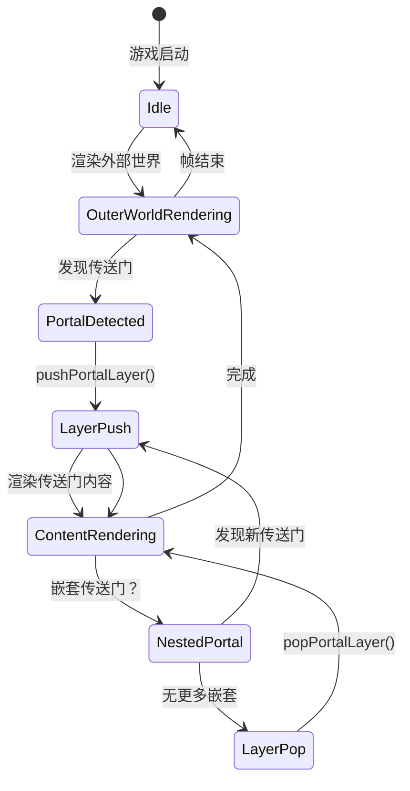
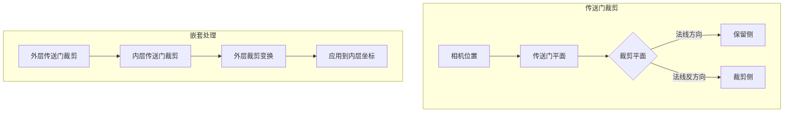
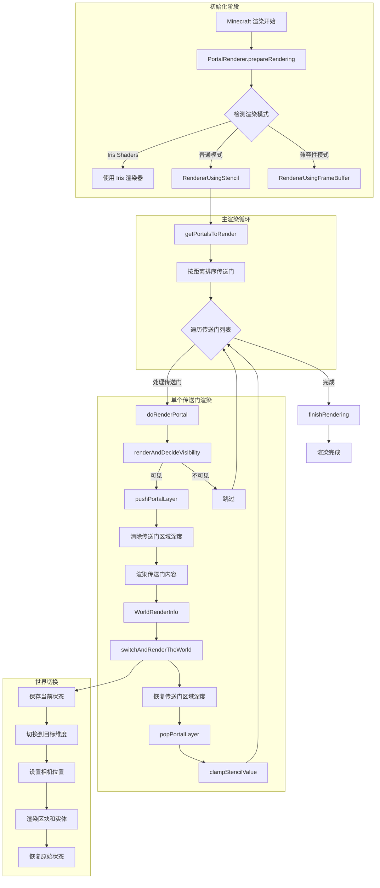
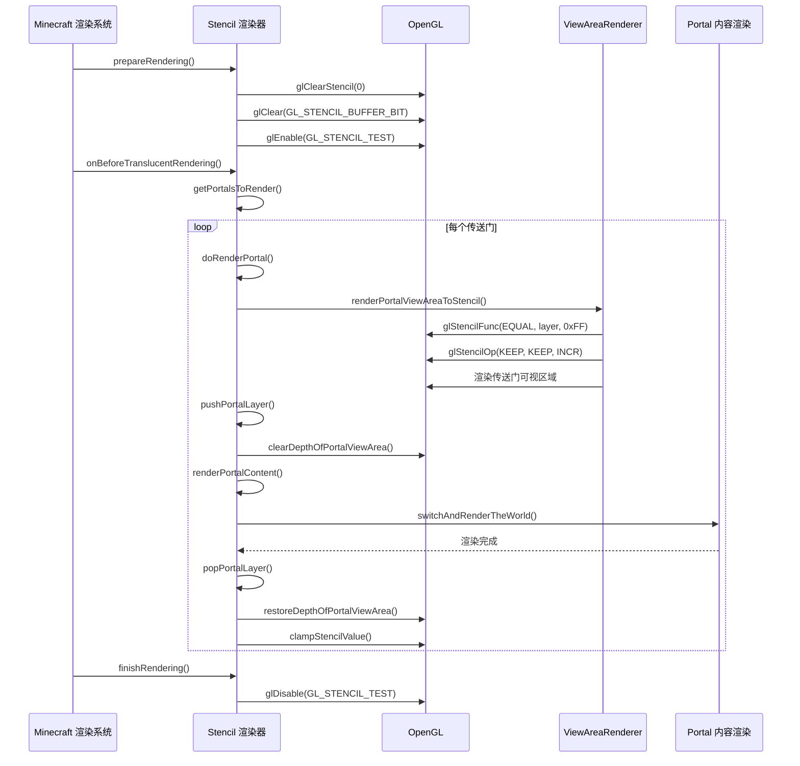
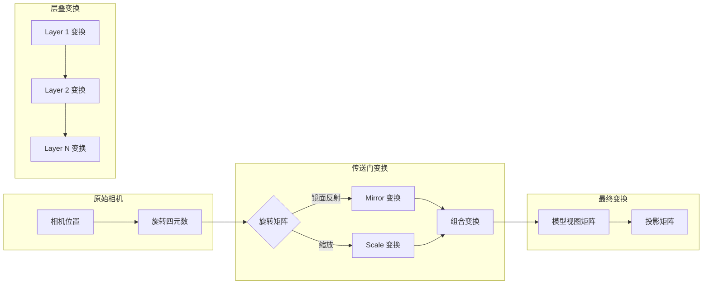
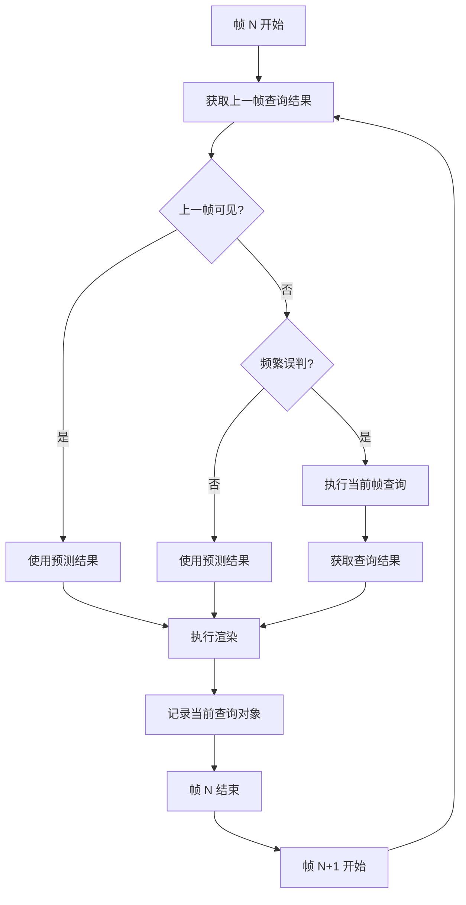

## Table of Contents

- [Overview](#overview)
- [Portal Renderer Architecture](#portal-renderer-architecture)
- [Renderer Types (Stencil vs FrameBuffer)](#renderer-types-stencil-vs-framebuffer)
- [Portal Layer System (PortalRendering)](#portal-layer-system-portalrendering)
- [Cross-Portal View Rendering](#cross-portal-view-rendering)
- [Front Clipping Planes](#front-clipping-planes)
- [Rendering Pipeline Diagram](#rendering-pipeline-diagram)
- [Camera Transformation System](#camera-transformation-system)
- [Visibility Prediction and Occlusion Query](#visibility-prediction-and-occlusion-query)

## Overview

ImmersivePortalsMod 的渲染系统是一个复杂但优雅的解决方案，用于在 Minecraft 中实现跨维度传送门效果。核心挑战在于：当玩家透过传送门观察时，需要正确渲染目标维度的内容，同时保持正确的深度测试、裁剪和视觉效果。

渲染系统的设计目标：

1. **跨维度渲染**：透过传送门看到另一个维度的世界
2. **多层嵌套**：支持传送门内再看向传送门（Portal Layer）
3. **正确的深度关系**：确保传送门内容与外部世界的深度一致
4. **性能优化**：使用遮挡查询预测传送门可见性
5. **兼容性**：支持 Sodium、Iris 等渲染优化 mod

渲染系统的核心文件结构：

```
render/
├── PortalRenderer.java           # 渲染器基类
├── renderer/
│   ├── RendererUsingStencil.java    # 模板缓冲渲染器
│   └── RendererUsingFrameBuffer.java # 帧缓冲渲染器
├── context_management/
│   ├── PortalRendering.java         # 传送门层管理
│   ├── WorldRenderInfo.java         # 世界渲染信息
│   └── RenderStates.java            # 渲染状态
├── ViewAreaRenderer.java         # 传送门可视区域渲染
├── FrontClipping.java            # 前向裁剪平面
├── CrossPortalViewRendering.java # 第三人称跨传送门视图
└── MyGameRenderer.java           # 世界切换渲染
```

## Portal Renderer Architecture

### 抽象基类设计

`PortalRenderer` 是所有渲染器的抽象基类，定义了一组生命周期方法：

```42:81:assets\ImmersivePortalsMod-6.0.6-mc1.21.1\src\main\java\qouteall\imm_ptl\core\render\renderer\PortalRenderer.java
public abstract class PortalRenderer {
    
    public abstract void onBeforeTranslucentRendering(Matrix4f modelView);
    public abstract void onAfterTranslucentRendering(Matrix4f modelView);
    public abstract void onHandRenderingEnded();
    public abstract void prepareRendering();
    public abstract void finishRendering();
    public abstract void renderPortalInEntityRenderer(Portal portal);
    public abstract boolean replaceFrameBufferClearing();
```

### 渲染器选择逻辑

渲染系统会根据不同的配置和 mod 组合选择合适的渲染器：

```312:362:assets\ImmersivePortalsMod-6.0.6-mc1.21.1\src\main\java\qouteall\imm_ptl\core\render\renderer\PortalRenderer.java
public static void switchToCorrectRenderer() {
    if (PortalRendering.isRendering()) {
        return;
    }
    
    if (IrisInterface.invoker.isIrisPresent()) {
        if (IrisInterface.invoker.isShaders()) {
            if (IPCGlobal.experimentalIrisPortalRenderer) {
                switchRenderer(ExperimentalIrisPortalRenderer.instance);
                return;
            }
            switch (IPGlobal.renderMode) {
                case normal -> switchRenderer(IrisPortalRenderer.instance);
                case compatibility -> switchRenderer(IrisCompatibilityPortalRenderer.instance);
                // ...
            }
            return;
        }
    }
    
    switch (IPGlobal.renderMode) {
        case normal -> switchRenderer(IPCGlobal.rendererUsingStencil);
        case compatibility -> switchRenderer(IPCGlobal.rendererUsingFrameBuffer);
        // ...
    }
}
```

### 传送门筛选

`getPortalsToRender` 方法负责收集需要渲染的传送门，并按距离排序：

```86:123:assets\ImmersivePortalsMod-6.0.6-mc1.21.1\src\main\java\qouteall\imm_ptl\core\render\renderer\PortalRenderer.java
protected List<Portal> getPortalsToRender(Matrix4f modelView) {
    // 收集全局传送门和实体传送门
    List<Portal> globalPortals = GlobalPortalStorage.getGlobalPortals(world);
    for (Portal globalPortal : globalPortals) {
        if (!shouldSkipRenderingPortal(globalPortal, frustumSupplier)) {
            renderables.add(globalPortal);
        }
    }
    
    world.entitiesForRendering().forEach(e -> {
        if (e instanceof Portal portal) {
            if (!shouldSkipRenderingPortal(portal, frustumSupplier)) {
                renderables.add(portal);
            }
        }
    });
    
    // 按距离排序，近的先渲染
    Vec3 cameraPos = CHelper.getCurrentCameraPos();
    renderables.sort(Comparator.comparingDouble(
        e -> e.getDistanceToNearestPointInPortal(cameraPos)
    ));
    return renderables;
}
```

## Renderer Types (Stencil vs FrameBuffer)

### RendererUsingStencil - 模板缓冲渲染器

这是默认且最高效的渲染器，使用 OpenGL 模板缓冲来限制渲染区域。

#### 核心原理

1. **模板缓冲写入**：将传送门的可视区域写入模板缓冲
2. **深度缓冲清除**：清除传送门区域外的深度值
3. **世界渲染**：只渲染模板缓冲指定的区域
4. **深度恢复**：恢复传送门边框的原始深度值

#### 初始化阶段

```91:108:assets\ImmersivePortalsMod-6.0.6-mc1.21.1\src\main\java\qouteall\imm_ptl\core\render\renderer\RendererUsingStencil.java
@Override
public void prepareRendering() {
    if (!IPPortingLibCompat.getIsStencilEnabled(client.getMainRenderTarget())) {
        IPPortingLibCompat.setIsStencilEnabled(client.getMainRenderTarget(), true);
    }
    
    client.getMainRenderTarget().bindWrite(false);
    
    GL11.glClearStencil(0);
    GL11.glClear(GL11.GL_STENCIL_BUFFER_BIT);  // 清除模板缓冲为0
    
    GlStateManager._enableDepthTest();
    GL11.glEnable(GL_STENCIL_TEST);
}
```

#### 传送门渲染流程

```123:168:assets\ImmersivePortalsMod-6.0.6-mc1.21.1\src\main\java\qouteall\imm_ptl\core\render\renderer\RendererUsingStencil.java
protected void doRenderPortal(Portal portal, Matrix4f modelView) {
    // 1. 检查是否跳过渲染
    if (shouldSkipRenderingInsideFuseViewPortal(portal)) {
        return;
    }
    
    // 2. 将传送门可视区域写入模板缓冲（模板值+1）
    int outerPortalStencilValue = PortalRendering.getPortalLayer();
    boolean anySamplePassed = PortalRenderInfo.renderAndDecideVisibility(portal, () -> {
        renderPortalViewAreaToStencil(portal, modelView);
    });
    
    if (!anySamplePassed) {
        setStencilStateForWorldRendering();
        return;
    }
    
    // 3. 入栈传送门层
    PortalRendering.pushPortalLayer(portal);
    
    // 4. 清除传送门区域的深度
    if (!portal.isFuseView()) {
        clearDepthOfThePortalViewArea(portal);
    }
    
    // 5. 渲染传送门内容
    setStencilStateForWorldRendering();
    renderPortalContent(portal);
    
    // 6. 出栈传送门层
    PortalRendering.popPortalLayer();
    
    // 7. 恢复深度
    if (!portal.isFuseView()) {
        restoreDepthOfPortalViewArea(portal, modelView, thisPortalStencilValue);
    }
    
    // 8. 限制模板值（防止无限嵌套）
    clampStencilValue(outerPortalStencilValue);
}
```

#### 模板值管理

使用递增的模板值来追踪传送门嵌套层级：

```175:201:assets\ImmersivePortalsMod-6.0.6-mc1.21.1\src\main\java\qouteall\imm_ptl\core\render\renderer\RendererUsingStencil.java
private void renderPortalViewAreaToStencil(Portal portal, Matrix4f modelView) {
    int outerPortalStencilValue = PortalRendering.getPortalLayer();
    
    // 只渲染当前层级对应的模板值
    GL11.glStencilFunc(GL_EQUAL, outerPortalStencilValue, 0xFF);
    
    // 如果模板和深度测试都通过，模板值+1
    GL11.glStencilOp(GL_KEEP, GL_KEEP, GL_INCR);
    GL11.glStencilMask(0xFF);
    
    FrontClipping.updateInnerClipping(modelView);
    
    // 渲染传送门可视区域到模板缓冲
    ViewAreaRenderer.renderPortalArea(
        portal, Vec3.ZERO,
        modelView,
        RenderSystem.getProjectionMatrix(),
        true, true,
        true, true
    );
}
```

#### 深度缓冲操作

清除和恢复传送门区域深度的技巧：

```203:229:assets\ImmersivePortalsMod-6.0.6-mc1.21.1\src\main\java\qouteall\imm_ptl\core\render\renderer\RendererUsingStencil.java
private void clearDepthOfThePortalViewArea(Portal portal) {
    GlStateManager._enableDepthTest();
    GlStateManager._depthMask(true);
    
    setStencilStateForWorldRendering();
    
    // 不操作颜色缓冲
    GL11.glColorMask(false, false, false, false);
    
    int originalDepthFunc = GL11.glGetInteger(GL_DEPTH_FUNC);
    
    // 总是通过深度测试
    GL11.glDepthFunc(GL_ALWAYS);
    
    // 像素深度设为最远（1.0）
    GL11.glDepthRange(1, 1);
    
    // 渲染屏幕三角形
    MyRenderHelper.renderScreenTriangle();
    
    // 恢复状态
    GL11.glColorMask(true, true, true, true);
    GL11.glDepthFunc(originalDepthFunc);
    GL11.glDepthRange(0, 1);
}
```

### RendererUsingFrameBuffer - 帧缓冲渲染器

这是兼容性渲染器，用于不支持模板缓冲的高级特性（如某些 Sodium 配置）。

#### 核心原理

1. 创建辅助帧缓冲
2. 在辅助帧缓冲中渲染传送门内容
3. 将辅助帧缓冲的内容绘制到主帧缓冲的传送门区域

```23:98:assets\ImmersivePortalsMod-6.0.6-mc1.21.1\src\main\java\qouteall\imm_ptl\core\render\renderer\RendererUsingFrameBuffer.java
public class RendererUsingFrameBuffer extends PortalRenderer {
    SecondaryFrameBuffer secondaryFrameBuffer = new SecondaryFrameBuffer();
    
    @Override
    protected void doRenderPortal(Portal portal, Matrix4f modelView) {
        // 只支持单层传送门
        if (PortalRendering.isRendering()) {
            return;
        }
        
        PortalRendering.pushPortalLayer(portal);
        
        // 保存当前帧缓冲
        RenderTarget oldFrameBuffer = client.getMainRenderTarget();
        
        // 切换到辅助帧缓冲
        ((IEMinecraftClient) client).ip_setFrameBuffer(secondaryFrameBuffer.fb);
        secondaryFrameBuffer.fb.bindWrite(true);
        
        // 清除辅助帧缓冲
        GlStateManager._clearColor(1, 0, 1, 1);
        GlStateManager._clearDepth(1);
        GlStateManager._clear(
            GL11.GL_COLOR_BUFFER_BIT | GL11.GL_DEPTH_BUFFER_BIT,
            Minecraft.ON_OSX
        );
        
        // 渲染传送门内容
        renderPortalContent(portal);
        
        // 恢复主帧缓冲
        ((IEMinecraftClient) client).ip_setFrameBuffer(oldFrameBuffer);
        oldFrameBuffer.bindWrite(true);
        
        PortalRendering.popPortalLayer();
        
        // 将辅助帧缓冲绘制到主帧缓冲
        CHelper.enableDepthClamp();
        renderSecondBufferIntoMainBuffer(portal, modelView);
        CHelper.disableDepthClamp();
    }
}
```

### 两种渲染器对比

| 特性 | Stencil | FrameBuffer |
|------|---------|-------------|
| 性能 | 更高（单通道渲染） | 较低（多通道） |
| 多层嵌套 | 支持 | 仅支持单层 |
| 内存占用 | 低 | 较高 |
| 兼容性 | 需要模板缓冲支持 | 更广泛 |
| 适用场景 | 默认配置 | 兼容性/调试模式 |

## Portal Layer System (PortalRendering)

`PortalRendering` 是传送门层级的核心管理系统，处理嵌套传送门的渲染。

### 层栈机制

```28:60:assets\ImmersivePortalsMod-6.0.6-mc1.21.1\src\main\java\qouteall\imm_ptl\core\render\context_management\PortalRendering.java
public class PortalRendering {
    private static final Stack<Portal> portalLayers = new Stack<>();
    private static boolean isRenderingCache = false;
    private static boolean isRenderingOddNumberOfMirrorsCache = false;
    
    public static void pushPortalLayer(Portal portal) {
        portalLayers.push(portal);
        updateCache();
    }
    
    public static void popPortalLayer() {
        portalLayers.pop();
        updateCache();
    }
    
    public static int getPortalLayer() {
        return portalLayers.size();
    }
```

### 缓存更新逻辑

```43:53:assets\ImmersivePortalsMod-6.0.6-mc1.21.1\src\main\java\qouteall\imm_ptl\core\render\context_management\PortalRendering.java
private static void updateCache() {
    isRenderingCache = getPortalLayer() != 0;
    
    int mirrorNum = 0;
    for (Portal portal : portalLayers) {
        if (portal instanceof Mirror) {
            mirrorNum++;
        }
    }
    isRenderingOddNumberOfMirrorsCache = (mirrorNum % 2 == 1);
}
```

### 相机位置变换

当渲染嵌套传送门时，需要将相机位置通过所有传送门变换：

```105:111:assets\ImmersivePortalsMod-6.0.6-mc1.21.1\src\main\java\qouteall\imm_ptl\core\render\context_management\PortalRendering.java
public static Vec3 getRenderingCameraPos() {
    Vec3 pos = RenderStates.originalCamera.getPosition();
    for (Portal portal : portalLayers) {
        pos = portal.transformPoint(pos);
    }
    return pos;
}
```

### 层数限制

为了性能和安全，传送门嵌套层数有限制：

```70:75:assets\ImmersivePortalsMod-6.0.6-mc1.21.1\src\main\java\qouteall\imm_ptl\core\render\context_management\PortalRendering.java
public static int getMaxPortalLayer() {
    if (RenderStates.isLaggy) {
        return 1;
    }
    return IPGlobal.maxPortalLayer;
}
```

### 裁剪平面继承

当嵌套传送门没有内部裁剪平面时，需要从外层继承：

```178:214:assets\ImmersivePortalsMod-6.0.6-mc1.21.1\src\main\java\qouteall\imm_ptl\core\render\context_management\PortalRendering.java
public static @Nullable Plane getActiveClippingPlane() {
    Portal renderingPortal = getRenderingPortal();
    Plane plane = renderingPortal.getInnerClipping();
    
    if (plane == null) {
        if (portalLayers.size() >= 2) {
            // 从外层继承裁剪平面
            int i = portalLayers.size() - 2;
            while (i >= 0) {
                Portal portal = portalLayers.get(i);
                Plane outerPlane = portal.getInnerClipping();
                
                if (outerPlane != null) {
                    // 变换裁剪平面到当前坐标系
                    for (int j = i + 1; j < portalLayers.size(); j++) {
                        Portal portal1 = portalLayers.get(j);
                        outerPlane = new Plane(
                            portal1.transformPoint(outerPlane.pos()),
                            portal1.transformLocalVecNonScale(outerPlane.normal())
                        );
                    }
                    return outerPlane;
                }
                i--;
            }
        }
    }
    return plane;
}
```

### Portal Layer 状态机流程



## Cross-Portal View Rendering

第三人称视角下，相机可以穿过传送门看向另一侧。`CrossPortalViewRendering` 处理这种特殊情况。

### 第三人称相机计算

```29:98:assets\ImmersivePortalsMod-6.0.6-mc1.21.1\src\main\java\qouteall\imm_ptl\core\render\CrossPortalViewRendering.java
public static boolean renderCrossPortalView() {
    if (!IPGlobal.enableCrossPortalView) {
        return false;
    }
    
    Entity cameraEntity = client.cameraEntity;
    Vec3 realCameraPos = camera.getPosition();
    Vec3 isometricAdjustedOriginalCameraPos = TransformationManager.getIsometricAdjustedCameraPos(camera);
    
    Vec3 physicalPlayerHeadPos = ClientTeleportationManager.getPlayerEyePos(RenderStates.getPartialTick());
    
    // 射线检测传送门
    Pair<Portal, Vec3> portalHit = PortalCommand.raytracePortals(
        client.level, physicalPlayerHeadPos, isometricAdjustedOriginalCameraPos, true
    ).orElse(null);
    
    if (portalHit == null) {
        return false;
    }
    
    Portal portal = portalHit.getFirst();
    
    if (!portal.canTeleportEntity(cameraEntity)) {
        return false;
    }
    
    Vec3 renderingCameraPos;
    
    if (isThirdPerson()) {
        // 计算第三人称相机位置
        double distance = getThirdPersonMaxDistance();
        Vec3 thirdPersonPos = realCameraPos.subtract(physicalPlayerHeadPos).normalize()
            .scale(distance).add(physicalPlayerHeadPos);
        renderingCameraPos = getThirdPersonCameraPos(thirdPersonPos, portal, hitPos);
    }
    else {
        renderingCameraPos = portal.transformPoint(realCameraPos);
    }
    
    // 设置相机位置
    ((IECamera) RenderStates.originalCamera).portal_setPos(renderingCameraPos);
    
    // 执行跨维度渲染
    WorldRenderInfo worldRenderInfo = new WorldRenderInfo.Builder()
        .setWorld(ClientWorldLoader.getWorld(portal.getDestDim()))
        .setCameraPos(renderingCameraPos)
        .setCameraTransformation(portal.getAdditionalCameraTransformation())
        .setOverwriteCameraTransformation(false)
        .build();
    
    IPCGlobal.renderer.invokeWorldRendering(worldRenderInfo);
    
    return true;
}
```

### 第三人称相机碰撞检测

```113:134:assets\ImmersivePortalsMod-6.0.6-mc1.21.1\src\main\java\qouteall\imm_ptl\core\render\CrossPortalViewRendering.java
private static Vec3 getThirdPersonCameraPos(Vec3 endPos, Portal portal, Vec3 startPos) {
    Vec3 rtStart = portal.transformPoint(startPos);
    Vec3 rtEnd = portal.transformPoint(endPos);
    
    // 检测传送门变换后的路径是否会撞到方块
    BlockHitResult blockHitResult = portal.getDestinationWorld().clip(
        new ClipContext(
            rtStart, rtEnd,
            ClipContext.Block.VISUAL,
            ClipContext.Fluid.NONE,
            client.cameraEntity
        )
    );
    
    if (blockHitResult.getType() == HitResult.Type.BLOCK) {
        return rtStart.add(rtEnd.subtract(rtStart).normalize().scale(
            getThirdPersonMaxDistance()
        ));
    }
    
    return blockHitResult.getLocation();
}
```

## Front Clipping Planes

前向裁剪平面是 ImmersivePortalsMod 渲染系统的重要组成部分，用于防止渲染错误。

### 裁剪平面管理

```21:46:assets\ImmersivePortalsMod-6.0.6-mc1.21.1\src\main\java\qouteall\imm_ptl\core\render\FrontClipping.java
public class FrontClipping {
    private static double[] activeClipPlaneEquationBeforeModelView;
    private static double[] activeClipPlaneAfterModelView;
    
    public static boolean isClippingEnabled = false;
    
    public static void disableClipping() {
        if (IPGlobal.enableClippingMechanism) {
            if (isClippingEnabled) {
                GL11.glDisable(GL11.GL_CLIP_PLANE0);
                isClippingEnabled = false;
            }
        }
    }
    
    private static void enableClipping() {
        if (IPGlobal.enableClippingMechanism) {
            if (!isClippingEnabled) {
                GL11.glEnable(GL11.GL_CLIP_PLANE0);
                isClippingEnabled = true;
            }
        }
    }
```

### 内部裁剪平面设置

```53:87:assets\ImmersivePortalsMod-6.0.6-mc1.21.1\src\main\java\qouteall\imm_ptl\core\render\FrontClipping.java
public static void updateInnerClipping(Matrix4f modelView) {
    if (PortalRendering.isRendering()) {
        setupInnerClipping(
            PortalRendering.getActiveClippingPlane(),
            modelView, 0
        );
    }
    else {
        disableClipping();
    }
}

public static void setupInnerClipping(
    Plane clipping, Matrix4f modelView, double adjustment
) {
    if (!IPCGlobal.useFrontClipping) {
        return;
    }
    
    if (clipping != null) {
        activeClipPlaneEquationBeforeModelView =
            getClipEquationInner(clipping.pos(), clipping.normal(), adjustment);
        activeClipPlaneEquationAfterModelView =
            transformClipEquation(activeClipPlaneEquationBeforeModelView, modelView);
        
        enableClipping();
    }
    else {
        activeClipPlaneEquationBeforeModelView = null;
        disableClipping();
    }
}
```

### 裁剪平面方程变换

裁剪平面需要根据模型视图矩阵进行变换：

```89:99:assets\ImmersivePortalsMod-6.0.6-mc1.21.1\src\main\java\qouteall\imm_ptl\core\render\FrontClipping.java
private static double[] transformClipEquation(
    double[] equation, Matrix4f modelView
) {
    Vector4f eq =
        new Vector4f((float) equation[0], (float) equation[1], (float) equation[2], (float) equation[3]);
    Matrix4f m = new Matrix4f(modelView);
    m.invert();
    m.transpose();
    m.transform(eq);
    return new double[]{eq.x(), eq.y(), eq.z(), eq.w()};
}
```

### 着色器统一变量更新

```174:201:assets\ImmersivePortalsMod-6.0.6-mc1.21.1\src\main\java\qouteall\imm_ptl\core\render\FrontClipping.java
public static void updateClippingEquationUniformForCurrentShader(
    boolean isRenderingEntities
) {
    if (!IPGlobal.enableClippingMechanism) {
        return;
    }
    
    ShaderInstance shader = RenderSystem.getShader();
    
    if (shader == null) {
        return;
    }
    
    Uniform clippingEquationUniform = ((IEShader) shader).ip_getClippingEquationUniform();
    if (clippingEquationUniform != null) {
        if (isClippingEnabled) {
            double[] equation = activeClipPlaneEquationBeforeModelView;
            clippingEquationUniform.set(
                (float) equation[0], (float) equation[1],
                (float) equation[2], (float) equation[3]
            );
        }
        else {
            clippingEquationUniform.set(0f, 0f, 0f, 1f);
        }
    }
}
```

### 裁剪平面示意图



## Rendering Pipeline Diagram

### 完整渲染流程



### Stencil 渲染器详细流程



## Camera Transformation System

### 相机变换管理

`WorldRenderInfo` 管理每次世界渲染的相机信息：

```20:101:assets\ImmersivePortalsMod-6.0.6-mc1.21.1\src\main\java\qouteall\imm_ptl\core\render\context_management\WorldRenderInfo.java
public class WorldRenderInfo {
    /**
     * The dimension that it's going to render
     */
    public final ClientLevel world;
    
    /**
     * Camera position
     */
    public final Vec3 cameraPos;
    
    public final boolean overwriteCameraTransformation;
    
    /**
     * If overwriteCameraTransformation is true,
     * the world rendering camera transformation will be replaced by this.
     */
    @Nullable
    public final Matrix4f cameraTransformation;
    
    // ... 更多字段
}
```

### 相机位置调整

```113:118:assets\ImmersivePortalsMod-6.0.6-mc1.21.1\src\main\java\qouteall\imm_ptl\core\render\context_management\WorldRenderInfo.java
public static void adjustCameraPos(Camera camera) {
    if (!renderInfoStack.isEmpty()) {
        WorldRenderInfo currWorldRenderInfo = getTopRenderInfo();
        ((IECamera) camera).portal_setPos(currWorldRenderInfo.cameraPos);
    }
}
```

### 额外变换应用

```120:139:assets\ImmersivePortalsMod-6.0.6-mc1.21.1\src\main\java\qouteall\imm_ptl\core\render\context_management\WorldRenderInfo.java
public static void applyAdditionalTransformations(PoseStack matrixStack) {
    for (WorldRenderInfo worldRenderInfo : renderInfoStack) {
        if (worldRenderInfo.overwriteCameraTransformation) {
            matrixStack.last().pose().identity();
            matrixStack.last().normal().identity();
        }
        
        Matrix4f matrix = worldRenderInfo.cameraTransformation;
        if (matrix != null) {
            matrixStack.last().pose().mul(matrix);
            
            Matrix3f normalMatrixMult = new Matrix3f(matrix);
            // 确保法向量不被缩放
            normalMatrixMult.scale(
                (float) Math.pow(1.0 / Math.abs(normalMatrixMult.determinant()), 1.0 / 3)
            );
            matrixStack.last().normal().mul(normalMatrixMult);
        }
    }
}
```

### 传送门变换矩阵

```260:306:assets\ImmersivePortalsMod-6.0.6-mc1.21.1\src\main\java\qouteall\imm_ptl\core\render\renderer\PortalRenderer.java
@Nullable
public static Matrix4f getPortalTransformation(Portal portal) {
    Matrix4f rot = getPortalRotationMatrix(portal);
    
    Matrix4f mirror = portal instanceof Mirror ?
        TransformationManager.getMirrorTransformation(portal.getNormal()) : null;
    
    Matrix4f scale = getPortalScaleMatrix(portal);
    
    return combineNullable(rot, combineNullable(mirror, scale));
}

@Nullable
public static Matrix4f getPortalScaleMatrix(Portal portal) {
    if (shouldApplyScaleToModelView(portal)) {
        float v = (float) (1.0 / portal.getScale());
        return new Matrix4f().scale(v, v, v);
    }
    return null;
}
```

### 相机变换流程图



## Visibility Prediction and Occlusion Query

### 可见性预测机制

`PortalRenderInfo` 使用 OpenGL 遮挡查询来预测传送门是否可见：

```212:257:assets\ImmersivePortalsMod-6.0.6-mc1.21.1\src\main\java\qouteall\imm_ptl\core\portal\PortalRenderInfo.java
public static boolean renderAndDecideVisibility(Portal portal, Runnable queryRendering) {
    boolean decision;
    if (IPGlobal.offsetOcclusionQuery) {
        PortalRenderInfo renderInfo = get(portal);
        
        List<UUID> renderingDescription = WorldRenderInfo.getRenderingDescription();
        
        Visibility visibility = renderInfo.getVisibility(renderingDescription);
        
        GlQueryObject lastFrameQuery = visibility.lastFrameQuery;
        GlQueryObject thisFrameQuery = visibility.acquireThisFrameQuery();
        
        // 执行遮挡查询
        thisFrameQuery.performQueryAnySamplePassed(queryRendering);
        
        boolean noPredict =
            renderInfo.isFrequentlyMispredicted() ||
                QueryManager.queryStallCounter <= 3;
        
        if (lastFrameQuery != null) {
            boolean lastFrameVisible = lastFrameQuery.fetchQueryResult();
            
            if (!lastFrameVisible && noPredict) {
                decision = thisFrameQuery.fetchQueryResult();
                QueryManager.queryStallCounter++;
            }
            else {
                // 使用上一帧的结果预测
                decision = lastFrameVisible;
                renderInfo.updatePredictionStatus(visibility, decision);
            }
        }
        else {
            decision = thisFrameQuery.fetchQueryResult();
            QueryManager.queryStallCounter++;
        }
    }
    else {
        decision = QueryManager.renderAndGetDoesAnySamplePass(queryRendering);
    }
    return decision;
}
```

### 预测状态跟踪

```198:210:assets\ImmersivePortalsMod-6.0.6-mc1.21.1\src\main\java\qouteall\imm_ptl\core\portal\PortalRenderInfo.java
private void updatePredictionStatus(Visibility visibility, boolean thisFrameDecision) {
    visibility.thisFrameRendered = thisFrameDecision;
    
    if (thisFrameDecision) {
        if (visibility.lastFrameRendered != null) {
            if (!visibility.lastFrameRendered) {
                if (!isFrequentlyMispredicted()) {
                    onMispredict();
                }
            }
        }
    }
}
```

### 遮挡查询流程



## Key Implementation Details

### ViewAreaRenderer 可视区域渲染

`ViewAreaRenderer` 负责渲染传送门的可视区域到模板缓冲：

```23:118:assets\ImmersivePortalsMod-6.0.6-mc1.21.1\src\main\java\qouteall\imm_ptl\core\render\ViewAreaRenderer.java
public static void renderPortalArea(
    Portal portal, Vec3 fogColor,
    Matrix4f modelViewMatrix, Matrix4f projectionMatrix,
    boolean doFaceCulling, boolean doModifyColor,
    boolean doModifyDepth, boolean doClip
) {
    
    if (doFaceCulling) {
        GlStateManager._enableCull();
    }
    else {
        GlStateManager._disableCull();
    }
    
    if (doModifyColor) {
        GlStateManager._colorMask(true, true, true, true);
    }
    else {
        GlStateManager._colorMask(false, false, false, false);
    }
    
    if (doModifyDepth) {
        GlStateManager._depthMask(true);
    }
    else {
        GlStateManager._depthMask(false);
    }
    
    // 处理镜面反射的 UV 翻转
    boolean shouldReverseCull = PortalRendering.isRenderingOddNumberOfMirrors();
    if (shouldReverseCull) {
        MyRenderHelper.applyMirrorFaceCulling();
    }
    
    if (doClip) {
        if (PortalRendering.isRendering()) {
            FrontClipping.setupInnerClipping(
                PortalRendering.getActiveClippingPlane(),
                modelViewMatrix, 0
            );
        }
    }
    
    GlStateManager._enableDepthTest();
    CHelper.enableDepthClamp();
    
    // 使用特殊着色器渲染
    ShaderInstance shader = MyRenderHelper.portalAreaShader;
    RenderSystem.setShader(() -> shader);
    shader.MODEL_VIEW_MATRIX.set(modelViewMatrix);
    shader.PROJECTION_MATRIX.set(projectionMatrix);
    
    FrontClipping.updateClippingEquationUniformForCurrentShader(false);
    
    shader.apply();
    
    ViewAreaRenderer.buildPortalViewAreaTrianglesBuffer(...);
    
    shader.clear();
}
```

### MyGameRenderer 世界切换

```96:112:assets\ImmersivePortalsMod-6.0.6-mc1.21.1\src\main\java\qouteall\imm_ptl\core\render\MyGameRenderer.java
public static void renderWorldNew(
    WorldRenderInfo worldRenderInfo,
    Consumer<Runnable> invokeWrapper
) {
    WorldRenderInfo.pushRenderInfo(worldRenderInfo);
    
    switchAndRenderTheWorld(
        worldRenderInfo.world,
        worldRenderInfo.cameraPos,
        worldRenderInfo.cameraPos,
        invokeWrapper,
        worldRenderInfo.renderDistance,
        worldRenderInfo.doRenderHand
    );
    
    WorldRenderInfo.popRenderInfo();
}
```

### 渲染状态管理

```41:84:assets\ImmersivePortalsMod-6.0.6-mc1.21.1\src\main\java\qouteall\imm_ptl\core\render\context_management\RenderStates.java
public class RenderStates {
    public static int frameIndex = 0;
    
    public static ResourceKey<Level> originalPlayerDimension;
    public static Vec3 originalPlayerPos = Vec3.ZERO;
    
    public static Set<ResourceKey<Level>> renderedDimensions = new HashSet<>();
    public static List<List<WeakReference<Portal>>> portalRenderInfos = new ArrayList<>();
    public static int portalsRenderedThisFrame = 0;
    
    public static Vec3 lastCameraPos = Vec3.ZERO;
    public static Vec3 cameraPosDelta = Vec3.ZERO;
    
    public static boolean isLaggy = false;
    public static boolean renderedScalingPortal = false;
    
    public static Camera originalCamera;
    
    public static void updatePreRenderInfo(float newPartialTick) {
        // 更新每帧的渲染状态
        originalPlayerDimension = cameraEntity.level().dimension();
        originalPlayerPos = cameraEntity.position();
        partialTick = newPartialTick;
        
        renderedDimensions.clear();
        portalRenderInfos = new ArrayList<>();
        portalsRenderedThisFrame = 0;
        
        updateIsLaggy();
        // ...
    }
}
```

## Summary

ImmersivePortalsMod 的渲染系统是一个精心设计的复杂系统，主要特点：

1. **双渲染器架构**：Stencil 渲染器用于高性能，FrameBuffer 渲染器用于兼容性
2. **层级栈管理**：使用模板值追踪传送门嵌套层级
3. **前向裁剪**：防止渲染错误
4. **遮挡查询**：优化性能，减少不必要的渲染
5. **世界切换机制**：正确处理跨维度渲染
6. **第三人称支持**：处理相机穿过传送门的特殊情况

理解这个渲染系统对于开发基于 ImmersivePortalsMod 的模组或创建自定义传送门类型非常重要。
