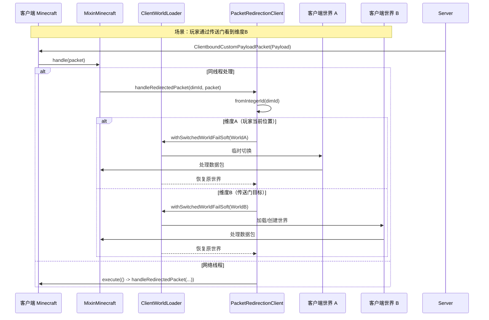
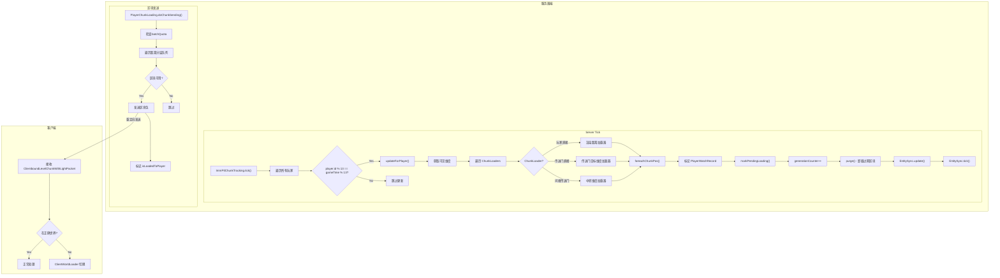
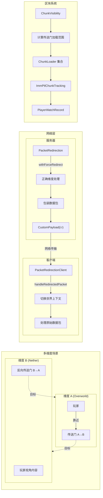

# Network Synchronization System

```yaml
---
title: Network Synchronization System
readingTime: 40
---
```

## Table of Contents

- [Overview](#overview)
- [Network Architecture](#network-architecture)
- [Packet Types and Structures](#packet-types-and-structures)
- [Packet Redirection Mechanism (Server)](#packet-redirection-mechanism-server)
- [Packet Redirection Mechanism (Client)](#packet-redirection-mechanism-client)
- [Entity Synchronization](#entity-synchronization)
- [Chunk Visibility System](#chunk-visibility-system)
- [Player Chunk Loading](#player-chunk-loading)
- [Data Flow Diagram](#data-flow-diagram)

---

## Overview

ImmersivePortalsMod 的网络同步系统是该模组最核心的子系统之一，它解决了跨维度传送（portal teleportation）场景下的网络通信难题。在原版 Minecraft 中，玩家只能同时存在于一个维度中，所有网络包都发送到该维度对应的世界。但对于跨维度传送门系统，玩家需要"同时"看到多个维度的内容，这对网络层提出了巨大挑战。

本系统的核心目标是：

1. **多维度同步**：让玩家能够同时感知多个维度的实体、方块更新和状态变化
2. **透明重定向**：将原本发送到单一维度的数据包重定向到正确的目标维度
3. **性能优化**：通过智能的区块加载和实体追踪机制，最小化网络流量和服务器负载

---

## Network Architecture

### 整体架构概览

ImmersivePortalsMod 的网络架构采用**客户端-服务器分离设计**，通过 Mixin 注入点拦截原版网络处理流程，实现维度的透明重定向。

```
┌─────────────────────────────────────────────────────────────────────┐
│                        SERVER SIDE                                   │
├─────────────────────────────────────────────────────────────────────┤
│                                                                     │
│  ┌─────────────────┐    ┌─────────────────┐    ┌────────────────┐  │
│  │ ServerLevel     │    │ PacketRedirect  │    │ EntitySync     │  │
│  │ (Dimension A)   │◄───│ ion.withForce   │◄───│ .update()      │  │
│  │                 │    │ Redirect()      │    │                │  │
│  └────────┬────────┘    └─────────────────┘    └────────────────┘  │
│           │                                                        │
│           │ packets                                                │
│           ▼                                                        │
│  ┌─────────────────────────────────────────────────────────────┐  │
│  │              MixinServerGamePacketListenerImpl               │  │
│  │         (Intercepts send() to wrap packets)                  │  │
│  └─────────────────────────────────────────────────────────────┘  │
│                              │                                     │
└──────────────────────────────│─────────────────────────────────────┘
                               │
                               ▼
                    ┌──────────────────────┐
                    │  Network Channel     │
                    │  (Custom Payload)    │
                    │  "imm_ptl:i:r"      │
                    └──────────────────────┘
                               │
                               │ redirected packets
                               ▼
┌──────────────────────────────────────────────────────────────────────┐
│                         CLIENT SIDE                                   │
├──────────────────────────────────────────────────────────────────────┤
│                                                                      │
│  ┌──────────────────────────────────────────────────────────────┐   │
│  │               MixinMinecraft_RedirectedPacket                 │   │
│  │          (Intercepts packet handling)                        │   │
│  └──────────────────────────────────────────────────────────────┘   │
│           │                                                        │
│           ▼                                                        │
│  ┌─────────────────┐    ┌─────────────────┐    ┌────────────────┐   │
│  │ ClientWorldLoader│    │ PacketRedirec   │    │ ClientLevel    │   │
│  │ .withSwitched   │◄───│ tionClient      │◄───│ (Dimension B) │   │
│  │ World()         │    │ .handleRedir... │    │                │   │
│  └─────────────────┘    └─────────────────┘    └────────────────┘   │
│                                                                      │
└──────────────────────────────────────────────────────────────────────┘
```

### 核心组件职责

| 组件 | 职责 | 位置 |
|------|------|------|
| `ImmPtlNetworking` | 定义自定义数据包类型和编解码器 | `network/` |
| `PacketRedirection` | 服务器端包重定向逻辑 | `network/` |
| `PacketRedirectionClient` | 客户端包重定向处理 | `network/` |
| `EntitySync` | 跨维度实体状态同步 | `chunk_loading/` |
| `ImmPtlChunkTracking` | 区块可见性追踪 | `chunk_loading/` |
| `ChunkVisibility` | 计算玩家可见的区块范围 | `chunk_loading/` |
| `PlayerChunkLoading` | 单个玩家的区块发送控制 | `chunk_loading/` |

---

## Packet Types and Structures

### 自定义数据包类型

ImmersivePortalsMod 定义了三种核心自定义数据包：

```java
45:90:assets\ImmersivePortalsMod-6.0.6-mc1.21.1\src\main\java\qouteall\imm_ptl\core\network\ImmPtlNetworking.java
```

```java
// 客户端 → 服务器：传送请求
public static record TeleportPacket(
    int dimensionId,          // 目标维度ID
    Vec3 eyePosBeforeTeleportation,  // 传送前玩家眼睛位置
    UUID portalId             // 所使用的传送门UUID
) implements CustomPacketPayload { ... }

// 服务器 → 客户端：全局传送门同步
public static record GlobalPortalSyncPacket(
    int dimensionId,          // 维度ID
    CompoundTag data          // NBT序列化的传送门数据
) implements CustomPacketPayload { ... }

// 服务器 → 客户端：传送门实体同步
public static record PortalSyncPacket(
    int id,                   // 实体网络ID
    UUID uuid,                // 实体UUID
    EntityType<?> entityType, // 实体类型
    int dimensionId,          // 所在维度
    double x, y, z,           // 位置
    CompoundTag extraData     // 额外传送门数据
) implements CustomPacketPayload { ... }
```

### 重定向数据包结构

当需要将数据包发送到玩家当前未"驻留"的维度时，使用重定向包装：

```java
246:289:assets\ImmersivePortalsMod-6.0.6-mc1.21.1\src\main\java\qouteall\imm_ptl\core\network\PacketRedirection.java
```

```java
/**
 * 维度重定向数据包
 * 包含维度ID和被包装的原始数据包
 */
public record Payload(
    int dimensionIntId,                           // 目标维度整数ID
    Packet<? extends ClientGamePacketListener> packet  // 被包装的原始数据包
) implements CustomPacketPayload {
    
    public static final ResourceLocation TYPE_ID = 
        McHelper.newResourceLocation("i:r");  // 简短ID减少包体积
    
    @Override
    public void handle(ClientGamePacketListener listener) {
        PacketRedirectionClient.handleRedirectedPacket(
            dimensionIntId, (Packet) packet, listener
        );
    }
}
```

### 数据包注册机制

```java
238:267:assets\ImmersivePortalsMod-6.0.6-mc1.21.1\src\main\java\qouteall\imm_ptl\core\network\ImmPtlNetworking.java
```

```java
public static void init() {
    // 注册客户端→服务器数据包
    PayloadTypeRegistry.playC2S().register(
        TeleportPacket.TYPE, TeleportPacket.CODEC
    );
    
    // 注册服务器→客户端数据包
    PayloadTypeRegistry.playS2C().register(
        GlobalPortalSyncPacket.TYPE, GlobalPortalSyncPacket.CODEC
    );
    PayloadTypeRegistry.playS2C().register(
        PortalSyncPacket.TYPE, PortalSyncPacket.CODEC
    );
    
    // 注册服务器端处理器
    ServerPlayNetworking.registerGlobalReceiver(
        TeleportPacket.TYPE,
        (packet, c) -> packet.handle(c.player())
    );
}

public static void initClient() {
    // 注册客户端处理器
    ClientPlayNetworking.registerGlobalReceiver(
        GlobalPortalSyncPacket.TYPE,
        (packet, c) -> packet.handle()
    );
    ClientPlayNetworking.registerGlobalReceiver(
        PortalSyncPacket.TYPE,
        (packet, c) -> packet.handle()
    );
}
```

---

## Packet Redirection Mechanism (Server)

### 服务器端重定向原理

服务器端重定向的核心思想是：在发送数据包时，动态修改数据包的目标维度。这通过 ThreadLocal 存储当前"强制重定向维度"实现。

```java
42:108:assets\ImmersivePortalsMod-6.0.6-mc1.21.1\src\main\java\qouteall\imm_ptl\core\network\PacketRedirection.java
```

```java
public class PacketRedirection {
    
    // 线程本地存储：当前强制重定向维度
    private static final ThreadLocal<ResourceKey<Level>> serverPacketRedirection =
        ThreadLocal.withInitial(() -> null);
    
    /**
     * 执行代码块时，强制所有发送的数据包使用指定维度
     * 用于服务器端处理多维度同步
     */
    public static <T> T withForceRedirectAndGet(ServerLevel world, Supplier<T> func) {
        // 线程安全检查
        if (((IEWorld) world).portal_getThread() != Thread.currentThread()) {
            LOGGER.error("Mod trying to handle packet in networking thread...");
        }
        
        ResourceKey<Level> redirectDim = world.dimension();
        ResourceKey<Level> oldRedirection = serverPacketRedirection.get();
        
        if (oldRedirection != redirectDim) {
            serverPacketRedirection.set(redirectDim);
        }
        
        try {
            return func.get();
        }
        finally {
            if (oldRedirection != redirectDim) {
                serverPacketRedirection.set(oldRedirection);
            }
        }
    }
    
    @Nullable
    public static ResourceKey<Level> getForceRedirectDimension() {
        return serverPacketRedirection.get();
    }
}
```

### 创建重定向数据包

```java
135:174:assets\ImmersivePortalsMod-6.0.6-mc1.21.1\src\main\java\qouteall\imm_ptl\core\network\PacketRedirection.java
```

```java
@SuppressWarnings({"unchecked", "rawtypes"})
public static Packet<ClientGamePacketListener> createRedirectedMessage(
    MinecraftServer server,
    ResourceKey<Level> dimension,
    Packet<ClientGamePacketListener> packet
) {
    // 避免重复包装
    if (isRedirectPacket(packet)) {
        return packet;
    }
    
    Validate.isTrue(!(packet instanceof BundleDelimiterPacket));
    
    // 处理 BundlePacket（数据包集）
    if (packet instanceof ClientboundBundlePacket bundlePacket) {
        List<Packet<ClientGamePacketListener>> newSubPackets = new ArrayList<>();
        for (var subPacket : bundlePacket.subPackets()) {
            newSubPackets.add(createRedirectedMessage(
                server, dimension, (Packet<ClientGamePacketListener>) subPacket
            ));
        }
        return new ClientboundBundlePacket(
            (List<Packet<? super ClientGamePacketListener>>) (List) newSubPackets
        );
    }
    else {
        // 普通数据包：包装到自定义Payload中
        int intDimId = PortalAPI.serverDimKeyToInt(server, dimension);
        Payload payload = new Payload(intDimId, packet);
        
        // 转换为通用自定义数据包
        return (Packet<ClientGamePacketListener>) (Packet)
            new ClientboundCustomPayloadPacket(payload);
    }
}
```

### Mixin 注入点

服务器端通过 Mixin 拦截 `ServerGamePacketListenerImpl.send()` 方法：

```java
111:128:assets\ImmersivePortalsMod-6.0.6-mc1.21.1\src\main\java\qouteall\imm_ptl\core\network\PacketRedirection.java
```

```java
// 发送重定向数据包的入口
public static void sendRedirectedPacket(
    ServerGamePacketListenerImpl serverPlayNetworkHandler,
    Packet<ClientGamePacketListener> packet,
    ResourceKey<Level> dimension
) {
    if (getForceRedirectDimension() == dimension) {
        // 已在正确维度，直接发送
        serverPlayNetworkHandler.send(packet);
    }
    else {
        // 需要包装重定向
        serverPlayNetworkHandler.send(
            createRedirectedMessage(
                serverPlayNetworkHandler.player.server,
                dimension,
                packet
            )
        );
    }
}

public static void sendRedirectedMessage(
    ServerPlayer player,
    ResourceKey<Level> dimension,
    Packet<ClientGamePacketListener> packet
) {
    player.connection.send(createRedirectedMessage(player.server, dimension, packet));
}
```

### Bundle 强制打包机制

```java
191:227:assets\ImmersivePortalsMod-6.0.6-mc1.21.1\src\main\java\qouteall\imm_ptl\core\network\PacketRedirection.java
```

```java
/**
 * 强制将多个数据包打包成 BundlePacket 发送
 * 用于某些需要批量发送的场景
 */
@SuppressWarnings({"unchecked", "ThreadLocalSetWithNull", "rawtypes"})
public static <R> R withForceBundle(Supplier<R> func) {
    ForceBundleCallback forceBundleCallback = getForceBundleCallback();
    if (forceBundleCallback != null) {
        // 已在 force-bundle 模式
        return func.get();
    }
    
    Map<ServerCommonPacketListenerImpl, List<Packet<ClientGamePacketListener>>>
        map = new HashMap<>();
    
    // 设置回调：收集所有需要打包的数据包
    forceBundle.set((listener, packet) -> {
        List<Packet<ClientGamePacketListener>> packetsToBundle =
            map.computeIfAbsent(listener, k -> new ArrayList<>());
        if (packet instanceof BundlePacket<?> bundlePacket) {
            for (Packet<?> subPacket : bundlePacket.subPackets()) {
                packetsToBundle.add((Packet<ClientGamePacketListener>) subPacket);
            }
        }
        else {
            packetsToBundle.add(packet);
        }
    });
    
    try {
        return func.get();
    }
    finally {
        forceBundle.set(null);
        // 发送打包后的数据包
        for (var e : map.entrySet()) {
            ServerCommonPacketListenerImpl listener = e.getKey();
            List<Packet<ClientGamePacketListener>> packets = e.getValue();
            listener.send(new ClientboundBundlePacket(
                (List<Packet<? super ClientGamePacketListener>>) (List) packets
            ));
        }
    }
}
```

---

## Packet Redirection Mechanism (Client)

### 客户端重定向处理

客户端通过 `PacketRedirectionClient` 处理接收到的重定向数据包，核心是切换到正确的世界处理数据包。

```java
21:77:assets\ImmersivePortalsMod-6.0.6-mc1.21.1\src\main\java\qouteall\imm_ptl\core\network\PacketRedirectionClient.java
```

```java
@Environment(EnvType.CLIENT)
public class PacketRedirectionClient {
    
    public static final Minecraft client = Minecraft.getInstance();
    
    // 客户端任务重定向：确保在正确的世界执行任务
    public static final ThreadLocal<ResourceKey<Level>> clientTaskRedirection =
        ThreadLocal.withInitial(() -> null);
    
    /**
     * 处理重定向数据包
     * 维度ID通过整数传递，因为在网络线程时维度映射可能不稳定
     */
    public static void handleRedirectedPacket(
        int dimensionIntId,
        Packet<ClientGamePacketListener> packet,
        ClientGamePacketListener handler
    ) {
        Minecraft minecraft = Minecraft.getInstance();
        
        if (minecraft.isSameThread()) {
            // 客户端主线程：直接处理
            ResourceKey<Level> dimension = DimensionIntId.getClientMap()
                .fromIntegerId(dimensionIntId);
            
            ResourceKey<Level> oldTaskRedirection = clientTaskRedirection.get();
            clientTaskRedirection.set(dimension);
            
            try {
                ClientWorldLoader.withSwitchedWorldFailSoft(
                    dimension,
                    () -> {
                        packet.handle(handler);
                    }
                );
            }
            finally {
                clientTaskRedirection.set(oldTaskRedirection);
            }
        }
        else {
            // 网络线程：调度到客户端主线程
            minecraft.execute(() -> {
                handleRedirectedPacket(dimensionIntId, packet, handler);
            });
        }
    }
}
```

### 世界切换机制

`ClientWorldLoader.withSwitchedWorldFailSoft()` 负责在处理数据包前切换到正确的客户端世界：

```java
45:68:assets\ImmersivePortalsMod-6.0.6-mc1.21.1\src\main\java\qouteall\imm_ptl\core\network\PacketRedirectionClient.java
```

关键流程：
1. 根据 `dimensionIntId` 查找对应的 `ResourceKey<Level>`
2. 调用 `ClientWorldLoader.withSwitchedWorldFailSoft()` 临时切换世界上下文
3. 在正确的世界上下文中执行数据包处理
4. 处理完成后恢复原世界上下文

---

## Entity Synchronization

### 实体追踪更新

`EntitySync` 负责跨维度的实体状态同步，它在每个 tick 更新所有维度的实体追踪状态。

```java
13:79:assets\ImmersivePortalsMod-6.0.6-mc1.21.1\src\main\java\qouteall\imm_ptl\core\chunk_loading\EntitySync.java
```

```java
public class EntitySync {
    
    public static void init() {
        DimensionAPI.SERVER_PRE_REMOVE_DIMENSION_EVENT.register(
            EntitySync::forceRemoveDimension
        );
    }
    
    /**
     * 替换 ChunkMap.tick()
     * 遍历所有维度的实体追踪器并更新
     */
    public static void update(MinecraftServer server) {
        server.getProfiler().push("ip_entity_tracking_update");
        
        for (ServerLevel world : server.getAllLevels()) {
            PacketRedirection.withForceRedirect(
                world,
                () -> {
                    ChunkMap chunkMap = world.getChunkSource().chunkMap;
                    Int2ObjectMap<ChunkMap.TrackedEntity> entityTrackerMap =
                        ((IEChunkMap) chunkMap).ip_getEntityTrackerMap();
                    
                    for (ChunkMap.TrackedEntity trackedEntity : entityTrackerMap.values()) {
                        IETrackedEntity ieTrackedEntity = (IETrackedEntity) trackedEntity;
                        ieTrackedEntity.ip_updateEntityTrackingStatus();
                    }
                }
            );
        }
        
        server.getProfiler().pop();
    }
    
    /**
     * 发送实体变更数据包
     * 在实体tick范围内时发送更新
     */
    public static void tick(MinecraftServer server) {
        server.getProfiler().push("ip_entity_tracking_tick");
        
        for (ServerLevel world : server.getAllLevels()) {
            PacketRedirection.withForceRedirect(
                world,
                () -> {
                    ChunkMap chunkMap = world.getChunkSource().chunkMap;
                    Int2ObjectMap<ChunkMap.TrackedEntity> entityTrackerMap =
                        ((IEChunkMap) chunkMap).ip_getEntityTrackerMap();
                    
                    for (ChunkMap.TrackedEntity trackedEntity : entityTrackerMap.values()) {
                        IETrackedEntity ieTrackedEntity = (IETrackedEntity) trackedEntity;
                        
                        long chunkPos = ieTrackedEntity.ip_getEntity()
                            .chunkPosition().toLong();
                        if (distanceManager.inEntityTickingRange(chunkPos)) {
                            ieTrackedEntity.ip_sendChanges();
                        }
                    }
                }
            );
        }
        
        server.getProfiler().pop();
    }
}
```

### 关键设计点

1. **维度遍历**：`update()` 和 `tick()` 遍历服务器的所有维度
2. **强制重定向**：使用 `withForceRedirect()` 确保在正确维度处理实体追踪
3. **性能分析**：使用 `server.getProfiler().push()` 进行性能监控

---

## Chunk Visibility System

### 区块可见性计算

`ChunkVisibility` 是计算玩家可见区块范围的核心类，它确定玩家需要加载哪些区块来"透过"传送门看到另一侧的世界。

```java
21:232:assets\ImmersivePortalsMod-6.0.6-mc1.21.1\src\main\java\qouteall\imm_ptl\core\chunk_loading\ChunkVisibility.java
```

```java
public class ChunkVisibility {
    
    // 主传送门加载范围（玩家周围48格）
    private static final int portalLoadingRange = 48;
    // 次级传送门加载范围
    public static final int secondaryPortalLoadingRange = 16;
    
    /**
     * 获取玩家直接加载器（基于渲染距离）
     */
    public static ChunkLoader playerDirectLoader(ServerPlayer player) {
        return new ChunkLoader(
            new DimensionalChunkPos(
                player.level().dimension(),
                player.chunkPosition()
            ),
            McHelper.getPlayerLoadDistance(player)
        );
    }
    
    /**
     * 根据距离调整加载范围
     */
    private static int getDirectLoadingDistance(
        int renderDistance, 
        double distanceToPortal
    ) {
        if (distanceToPortal < 5) {
            return renderDistance;        // 传送门附近：全范围
        }
        if (distanceToPortal < 15) {
            return (renderDistance * 2) / 3;  // 中距离：2/3
        }
        return renderDistance / 3;         // 远距离：1/3
    }
}
```

### 加载器类型

系统使用 `ChunkLoader` 记录表示区块加载区域：

```java
13:138:assets\ImmersivePortalsMod-6.0.6-mc1.21.1\src\main\java\qouteall\imm_ptl\core\chunk_loading\ChunkLoader.java
```

```java
public final record ChunkLoader(
    ResourceKey<Level> dimension,  // 目标维度
    int x,                        // 中心X坐标（区块单位）
    int z,                        // 中心Z坐标（区块单位）
    int radius                    // 加载半径（区块单位）
) {
    /**
     * 遍历加载区域内的所有区块
     */
    public void foreachChunkPos(ChunkPosConsumer func) {
        for (int dx = -radius; dx <= radius; dx++) {
            for (int dz = -radius; dz <= radius; dz++) {
                func.consume(
                    dimension,
                    x + dx,
                    z + dz,
                    Math.max(Math.abs(dx), Math.abs(dz))  // 到中心距离
                );
            }
        }
    }
}
```

### 基础加载器枚举

```java
182:226:assets\ImmersivePortalsMod-6.0.6-mc1.21.1\src\main\java\qouteall\imm_ptl\core\chunk_loading\ChunkVisibility.java
```

```java
/**
 * 遍历所有基础加载器
 * 包括：
 * 1. 玩家直接加载器（基于渲染距离）
 * 2. 直接可见传送门对应的目标维度加载器
 * 3. 间接可见传送门（通过其他传送门中转）对应的加载器
 */
public static void foreachBaseChunkLoaders(
    ServerPlayer player, 
    Consumer<ChunkLoader> func
) {
    PerformanceLevel perfLevel = ImmPtlChunkTracking.getPlayerInfo(player)
        .performanceLevel;
    int visiblePortalRangeChunks = PerformanceLevel.getVisiblePortalRangeChunks(perfLevel);
    int indirectVisiblePortalRangeChunks = PerformanceLevel.getIndirectVisiblePortalRangeChunks(perfLevel);
    
    // 1. 玩家直接加载器
    ChunkLoader playerDirectLoader = playerDirectLoader(player);
    func.accept(playerDirectLoader);
    
    // 2. 直接可见传送门
    List<Portal> nearbyPortals = getNearbyPortals(
        ((ServerLevel) player.level()),
        player.position(),
        portal -> portal.broadcastToPlayer(player),
        visiblePortalRangeChunks, 256  // 搜索范围
    );
    
    for (Portal portal : nearbyPortals) {
        Level destinationWorld = portal.getDestinationWorld();
        if (destinationWorld == null) {
            continue;
        }
        
        Vec3 transformedPlayerPos = portal.transformPoint(player.position());
        
        // 直接传送门加载器
        func.accept(getGeneralDirectPortalLoader(player, portal));
        
        // 3. 间接传送门（如果性能允许）
        if (!isShrinkLoading()) {
            List<Portal> indirectNearbyPortals = getNearbyPortals(
                ((ServerLevel) destinationWorld),
                transformedPlayerPos,
                p -> p.broadcastToPlayer(player),
                indirectVisiblePortalRangeChunks, 32
            );
            
            for (Portal innerPortal : indirectNearbyPortals) {
                func.accept(getGeneralPortalIndirectLoader(
                    player, transformedPlayerPos, innerPortal
                ));
            }
        }
    }
}
```

---

## Player Chunk Loading

### 单玩家区块加载管理

`PlayerChunkLoading` 管理单个玩家的区块加载状态和数据包发送节流。

```java
39:243:assets\ImmersivePortalsMod-6.0.6-mc1.21.1\src\main\java\qouteall\imm_ptl\core\chunk_loading\PlayerChunkLoading.java
```

```java
@SuppressWarnings({"JavadocReference", "DanglingJavadoc", "UnstableApiUsage"})
public class PlayerChunkLoading {
    
    // 玩家当前可见的维度集合
    public final Set<ResourceKey<Level>> visibleDimensions = new ObjectOpenHashSet<>();
    
    // 额外的区块加载器（API添加）
    public final ArrayList<ChunkLoader> additionalChunkLoaders = new ArrayList<>();
    
    // 待发送区块队列（按距离分层）
    public final ArrayList<ObjectArrayList<ImmPtlChunkTracking.PlayerWatchRecord>> 
        distanceToPendingChunks = new ArrayList<>();
    
    public int loadedChunks = 0;
    
    // 是否需要立即更新
    public boolean shouldUpdateImmediately = false;
    
    // 性能级别
    public PerformanceLevel performanceLevel = PerformanceLevel.bad;
    
    // 是否为内存连接（局域网等低延迟连接）
    public final boolean isMemoryConnection;
    
    public PlayerChunkLoading(boolean isMemoryConnection) {
        this.isMemoryConnection = isMemoryConnection;
    }
}
```

### 区块数据发送

```java
93:187:assets\ImmersivePortalsMod-6.0.6-mc1.21.1\src\main\java\qouteall\imm_ptl\core\chunk_loading\PlayerChunkLoading.java
```

```java
/**
 * 执行区块数据包发送
 * 类似于 PlayerChunkSender.sendNextChunks()
 * 但支持多维度和非近距离加载
 */
@IPVanillaCopy
public void doChunkSending(ServerPlayer serverPlayer) {
    // 检查未确认批次限制
    if (this.unacknowledgedBatches >= this.maxUnacknowledgedBatches) {
        return;
    }
    
    // 计算本tick可发送的区块配额
    if (isMemoryConnection) {
        this.batchQuota = 256;  // 内存连接：更高配额
    }
    else {
        this.batchQuota = Math.min(
            this.batchQuota + this.desiredChunksPerTick,
            Math.max(1.0F, this.desiredChunksPerTick)
        );
        
        if (this.batchQuota < 1.0F) {
            return;  // 配额不足，跳过
        }
    }
    
    int maxSendNum = (int) Math.floor(batchQuota);
    
    // 从近到远发送区块
    MutableInt sentNum = new MutableInt(0);
    for (var recs : distanceToPendingChunks) {
        if (recs == null || recs.isEmpty()) {
            continue;
        }
        
        if (sentNum.getValue() >= maxSendNum) {
            break;
        }
        
        Helper.removeIfWithEarlyExit(recs, (record, shouldStop) -> {
            if (!record.isValid || record.isLoadedToPlayer) {
                return true;  // 无效或已加载，跳过
            }
            
            // 获取区块并检查是否可用
            ServerLevel world = server.getLevel(record.dimension);
            ChunkHolder chunkHolder = ((IEChunkMap) chunkMap)
                .ip_getChunkHolder(record.chunkPos);
            
            if (chunkHolder == null) {
                return false;  // 区块未生成，跳过
            }
            
            LevelChunk tickingChunk = chunkHolder.getTickingChunk();
            if (tickingChunk == null) {
                return false;  // 区块未加载完成
            }
            
            record.isLoadedToPlayer = true;
            
            // 发送批次开始包
            if (sentNum.getValue() == 0) {
                ++this.unacknowledgedBatches;
                connection.send(ClientboundChunkBatchStartPacket.INSTANCE);
            }
            
            // 发送区块包
            sendChunkPacket(connection, world, tickingChunk);
            sentNum.increment();
            
            return true;
        });
    }
    
    // 发送批次完成包
    if (sentNum.getValue() != 0) {
        connection.send(new ClientboundChunkBatchFinishedPacket(sentNum.getValue()));
    }
}
```

### 区块追踪核心

`ImmPtlChunkTracking` 维护完整的区块追踪系统：

```java
37:136:assets\ImmersivePortalsMod-6.0.6-mc1.21.1\src\main\java\qouteall\imm_ptl\core\chunk_loading\ImmPtlChunkTracking.java
```

```java
public class ImmPtlChunkTracking {
    
    // 每13tick更新一次（分散负载）
    public static final int updateInterval = 13;
    
    // 默认延迟卸载代数
    public static final int defaultDelayUnloadGenerations = 4;
    
    // 区块观察记录表：维度 → (区块位置 → (玩家 → 记录))
    private static final Map<
        ResourceKey<Level>,
        Long2ObjectOpenHashMap<
            Object2ObjectOpenHashMap<ServerPlayer, PlayerWatchRecord>>> 
        chunkWatchRecords = new Object2ObjectOpenHashMap<>();
    
    public static class PlayerWatchRecord {
        public final ServerPlayer player;
        public final ResourceKey<Level> dimension;
        public final long chunkPos;
        public int lastWatchGeneration;    // 最后观察代数
        public int distanceToSource;       // 到加载源的距离
        public boolean isLoadedToPlayer;   // 是否已发送给客户端
        public boolean isValid;            // 是否有效
        public boolean isBoundary;          // 是否为可见性边界
    }
    
    /**
     * 更新单个玩家的区块追踪
     */
    public static void updateForPlayer(ServerPlayer player) {
        PlayerChunkLoading playerInfo = getPlayerInfo(player);
        playerInfo.visibleDimensions.clear();
        playerInfo.loadedChunks = 0;
        
        // 获取所有加载器
        ObjectOpenHashSet<ChunkLoader> chunkLoaders = new ObjectOpenHashSet<>();
        ChunkVisibility.foreachBaseChunkLoaders(player, chunkLoaders::add);
        chunkLoaders.addAll(playerInfo.additionalChunkLoaders);
        
        for (ChunkLoader chunkLoader : chunkLoaders) {
            // 遍历加载器覆盖的每个区块
            chunkLoader.foreachChunkPos((dim, x, z, distanceToSource) -> {
                long chunkPos = ChunkPos.asLong(x, z);
                
                // 标记需要加载
                ticketInfo.markForLoading(chunkPos, distanceToSource, generationCounter);
                
                // 更新或创建观察记录
                records.compute(player, (k, record) -> {
                    if (record == null) {
                        // 新区块
                        PlayerWatchRecord newRecord = new PlayerWatchRecord(...);
                        playerInfo.markPendingLoading(newRecord);
                        playerInfo.loadedChunks++;
                        return newRecord;
                    }
                    else {
                        // 已存在：更新距离
                        if (distanceToSource < record.distanceToSource) {
                            record.distanceToSource = distanceToSource;
                            playerInfo.markPendingLoading(record);
                        }
                        record.lastWatchGeneration = generationCounter;
                        return record;
                    }
                });
            });
        }
    }
}
```

### Tick 循环

```java
362:399:assets\ImmersivePortalsMod-6.0.6-mc1.21.1\src\main\java\qouteall\imm_ptl\core\chunk_loading\ImmPtlChunkTracking.java
```

```java
private static void tick(MinecraftServer server) {
    server.getProfiler().push("portal_chunk_tracking");
    
    boolean updates = false;
    long gameTime = server.overworld().getGameTime();
    
    // 为每个玩家更新区块追踪
    for (ServerPlayer player : server.getPlayerList().getPlayers()) {
        PlayerChunkLoading playerInfo = getPlayerInfo(player);
        
        // 分散更新负载：每13tick处理不同玩家
        if (playerInfo.shouldUpdateImmediately ||
            ((player.getId() % updateInterval) == (gameTime % updateInterval))
        ) {
            playerInfo.shouldUpdateImmediately = false;
            updateForPlayer(player);
            updates = true;
        }
    }
    
    // 定期清理和刷新
    if (gameTime % updateInterval == 0) {
        var additionalLoadedChunks = refreshAdditionalChunkLoaders(server);
        purge(server, additionalLoadedChunks);  // 卸载过期区块
        generationCounter++;                      // 代数递增
        updates = true;
    }
    
    // 区块ticket tick
    for (ServerLevel world : server.getAllLevels()) {
        ImmPtlChunkTickets dimTicketManager = ImmPtlChunkTickets.get(world);
        dimTicketManager.tick(world);
    }
    
    if (updates) {
        EntitySync.update(server);
    }
    
    EntitySync.tick(server);
}
```

---

## Data Flow Diagram

### 网络数据包流程图



### 区块加载/可见性系统流程图



### 维度重定向架构图



---

## Key Design Patterns

### 1. ThreadLocal 上下文存储

使用 `ThreadLocal` 在线程中存储当前"强制重定向维度"，避免显式传递：

```java
private static final ThreadLocal<ResourceKey<Level>> serverPacketRedirection =
    ThreadLocal.withInitial(() -> null);
```

### 2. RAII 风格的上下文管理

通过 `withForceRedirect()` 方法确保上下文正确恢复：

```java
public static <T> T withForceRedirectAndGet(ServerLevel world, Supplier<T> func) {
    ResourceKey<Level> oldRedirection = serverPacketRedirection.get();
    try {
        serverPacketRedirection.set(newDimension);
        return func.get();
    }
    finally {
        serverPacketRedirection.set(oldRedirection);
    }
}
```

### 3. 维度整数ID映射

在网络传输中使用整数ID而非字符串标识符，减少包体积：

```java
int intDimId = PortalAPI.serverDimKeyToInt(server, dimension);
Payload payload = new Payload(intDimId, packet);
```

### 4. 分层更新策略

通过 `updateInterval = 13` 分散更新负载：

```java
if ((player.getId() % updateInterval) == (gameTime % updateInterval)) {
    updateForPlayer(player);
}
```

### 5. 延迟卸载机制

根据玩家加载的区块数量动态调整卸载延迟：

```java
private static int getDelayUnloadGenerationForPlayer(ServerPlayer player) {
    int loadedChunks = playerInfo.loadedChunks;
    if (loadedChunks > 2000) return 1;      // 高负载：快速卸载
    if (loadedChunks > 1200) return 2;      // 中等：稍慢卸载
    return defaultDelayUnloadGenerations;    // 低负载：正常卸载
}
```

---

## Summary

ImmersivePortalsMod 的网络同步系统是一个精心设计的多维度通信解决方案：

| 子系统 | 核心功能 | 关键技术 |
|--------|----------|----------|
| **PacketRedirection** | 数据包重定向 | ThreadLocal + Mixin 注入 |
| **ImmPtlNetworking** | 自定义数据包 | Fabric API PayloadTypeRegistry |
| **EntitySync** | 跨维度实体同步 | 遍历所有维度的追踪器 |
| **ChunkVisibility** | 可见区块计算 | 传送门加载器链 |
| **ImmPtlChunkTracking** | 区块追踪管理 | 代数计数器 + 延迟卸载 |
| **PlayerChunkLoading** | 单玩家区块发送 | 批次配额 + 节流控制 |

这套系统的设计使得玩家可以"穿透"传送门看到另一维度的内容，同时保持了良好的性能和兼容性。
