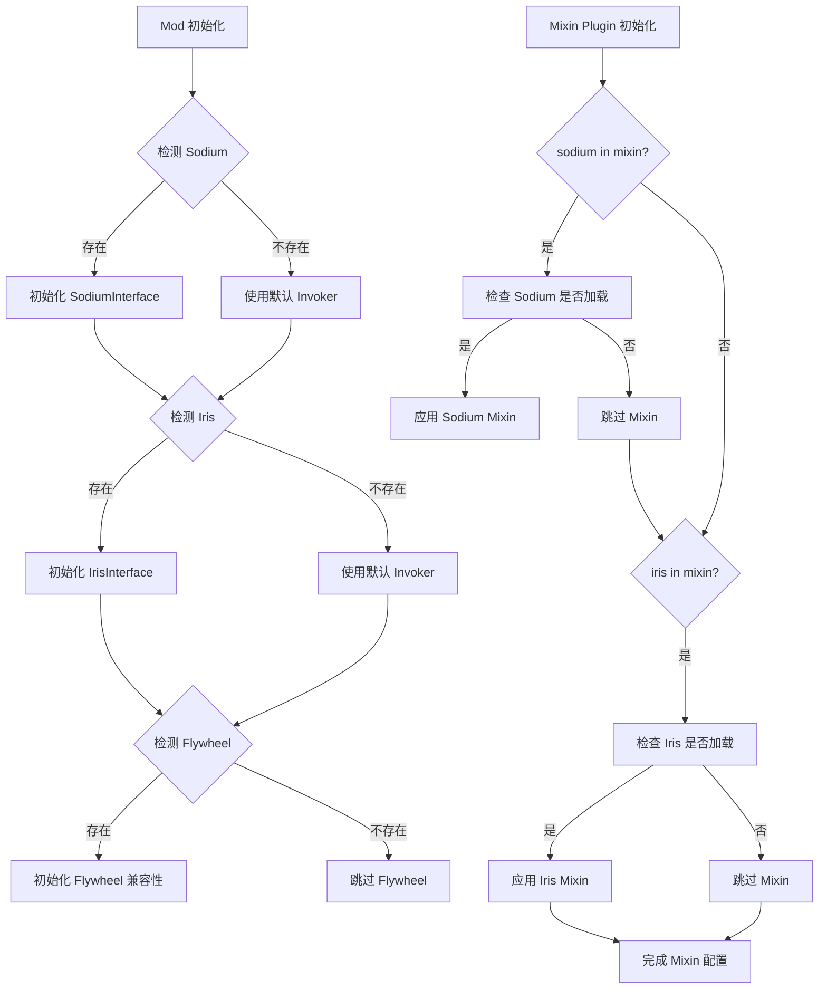
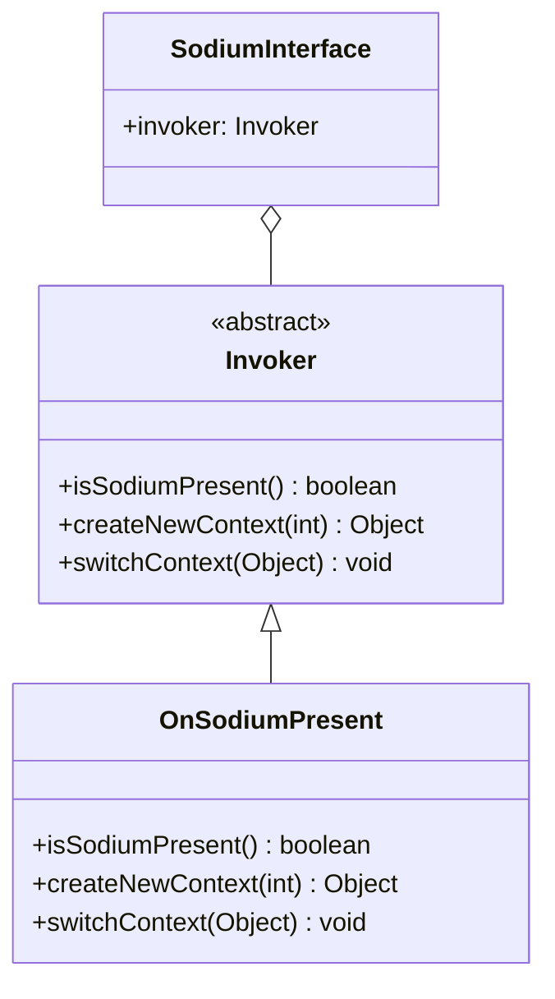

# ImmersivePortalsMod 兼容性系统分析

```yaml
---
title: Compatibility System
readingTime: 35
---
```

## 目录

- [概述](#概述)
- [Sodium 兼容性](#sodium-兼容性)
- [Iris 兼容性](#iris-兼容性)
- [Flywheel 兼容性](#flywheel-兼容性)
- [兼容性检测机制](#兼容性检测机制)
- [接口设计模式](#接口设计模式)
- [总结](#总结)

---

## 概述

ImmersivePortalsMod 作为 Minecraft 的维度传送门模组，需要与多个渲染优化模组协同工作。主要包括：

1. **Sodium** - 高性能渲染优化模组，提供自定义区块渲染系统
2. **Iris** - 着色器光影前置模组，提供着色器渲染管线
3. **Flywheel** - GPU 实例化渲染引擎，提供更高效的方块/实体渲染

这些模组的兼容性处理是 ImmersivePortalsMod 最为复杂的技术挑战之一，因为涉及到：

- **帧缓冲管理**：每个渲染层需要独立管理深度缓冲和模板缓冲
- **渲染上下文切换**：需要在不同维度/世界之间切换渲染状态
- **着色器管线集成**：需要正确注入 Iris 的着色器渲染流程
- **区块可见性计算**：Sodium 的遮挡剔除算法在传送门场景下会失效

以下 Mermaid 图展示了兼容性检测的整体流程：



---

## Sodium 兼容性

### 核心挑战

Sodium 替换了 Minecraft 原生的区块渲染系统，使用自定义的 `RenderSectionManager` 和 `SodiumWorldRenderer`。这带来以下挑战：

1. **Frustum Culler 替换**：Sodium 有自己的视锥体裁剪实现
2. **渲染上下文管理**：每个世界切换需要创建新的 `SortedRenderLists`
3. **区块可见性判断**：Sodium 的 `isSectionVisible()` 在传送门渲染时返回错误结果

### 接口设计

`SodiumInterface` 使用了**策略模式 + 空对象模式**的组合设计：

```18:50:assets/ImmersivePortalsMod-6.0.6-mc1.21.1/src/main/java/qouteall/imm_ptl/core/compat/sodium_compatibility/SodiumInterface.java
public class SodiumInterface {
    
    @Nullable
    public static FrustumCuller frustumCuller = null;
    
    public static class Invoker {
        public boolean isSodiumPresent() {
            return false;
        }
        
        public Object createNewContext(int renderDistance) {
            return null;
        }
        // ... 更多方法
    }
    
    public static Invoker invoker = new Invoker();
    
    public static class OnSodiumPresent extends Invoker {
        @Override
        public boolean isSodiumPresent() {
            return true;
        }
        // ... 实现细节
    }
}
```

**设计要点**：

1. `Invoker` 是默认的空实现，所有方法返回 `null` 或 `false`
2. `OnSodiumPresent` 是 Sodium 存在时的完整实现
3. `invoker` 静态变量在运行时被 Mixin 替换为 `OnSodiumPresent` 实例

### 渲染上下文切换

`SodiumRenderingContext` 存储了渲染所需的全部状态：

```1:14:assets/ImmersivePortalsMod-6.0.6-mc1.21.1/src/main/java/qouteall/imm_ptl/core/compat/sodium_compatibility/SodiumRenderingContext.java
public class SodiumRenderingContext {
    public SortedRenderLists renderLists;
    
    public int renderDistance;
    
    public SodiumRenderingContext(int renderDistance) {
        this.renderDistance = renderDistance;
        this.renderLists = SortedRenderLists.empty();
    }
}
```

当渲染传送门内容时，需要切换到目标世界的渲染上下文：

```59:76:assets/ImmersivePortalsMod-6.0.6-mc1.21.1/src/main/java/qouteall/imm_ptl/core/compat/sodium_compatibility/SodiumInterface.java
@Override
public void switchContextWithCurrentWorldRenderer(Object context) {
    SodiumWorldRenderer swr =
        ((LevelRendererExtension) Minecraft.getInstance().levelRenderer).sodium$getWorldRenderer();
    swr.scheduleTerrainUpdate();
    
    RenderSectionManager renderSectionManager =
        ((IESodiumWorldRenderer) swr).ip_getRenderSectionManager();
    
    ((IESodiumRenderSectionManager) renderSectionManager)
        .ip_swapContext(((SodiumRenderingContext) context));
    
    swr.scheduleTerrainUpdate();
}
```

### Mixin 注入点

`MixinSodiumWorldRenderer` 在 Sodium 的地形更新前更新 FrustumCuller：

```14:27:assets/ImmersivePortalsMod-6.0.6-mc1.21.1/src/main/java/qouteall/imm_ptl/core/compat/mixin/sodium/MixinSodiumWorldRenderer.java
@Mixin(value = SodiumWorldRenderer.class, remap = false)
public class MixinSodiumWorldRenderer {
    @Inject(
        method = "setupTerrain",
        at = @At("HEAD")
    )
    private void onUpdateChunks(
        Camera camera, Viewport viewport, boolean spectator, boolean updateChunksImmediately, CallbackInfo ci
    ) {
        SodiumInterface.frustumCuller = new FrustumCuller();
        Vec3 cameraPos = camera.getPosition();
        SodiumInterface.frustumCuller.update(cameraPos.x, cameraPos.y, cameraPos.z);
    }
}
```

### 区块可见性优化取消

`MixinSodiumRenderSectionManager` 取消了 Sodium 的区块可见性优化：

```47:52:assets/ImmersivePortalsMod-6.0.6-mc1.21.1/src/main/java/qouteall/imm_ptl/core/compat/mixin/sodium/MixinSodiumRenderSectionManager.java
/**
 * The section visibility information will be wrong if rendered a portal.
 * Just cancel this optimization.
 * isSectionVisible() is currently only used for culling entities.
 */
@Inject(method = "isSectionVisible", at = @At("HEAD"), cancellable = true)
private void onIsSectionVisible(int x, int y, int z, CallbackInfoReturnable<Boolean> cir) {
    if (RenderStates.portalsRenderedThisFrame != 0) {
        cir.setReturnValue(true);
    }
}
```

---

## Iris 兼容性

### 核心挑战

Iris 提供了着色器渲染管线，包含复杂的阴影渲染和多阶段渲染过程：

1. **Pipeline 管理**：需要正确获取和替换 Iris 的渲染管线
2. **阴影渲染同步**：传送门内的阴影需要正确计算
3. **Deferred 渲染**：Iris 使用延迟渲染，多个渲染阶段需要正确同步

### 双渲染器设计

ImmersivePortalsMod 为 Iris 设计了两套渲染器：

| 渲染器 | 适用场景 | 特点 |
|-------|---------|------|
| `IrisPortalRenderer` | Iris 启用光影时 | 使用 Deferred FrameBuffer 处理模板缓冲 |
| `ExperimentalIrisPortalRenderer` | 未来版本 | 直接使用主帧缓冲，更高效的模板缓冲处理 |

### IrisInterface 接口

```12:41:assets/ImmersivePortalsMod-6.0.6-mc1.21.1/src/main/java/qouteall/imm_ptl/core/compat/iris_compatibility/IrisInterface.java
public class IrisInterface {
    
    public static class Invoker {
        public boolean isIrisPresent() {
            return false;
        }
        
        public boolean isShaders() {
            return false;
        }
        
        public boolean isRenderingShadowMap() {
            return false;
        }
        
        public Object getPipeline(LevelRenderer worldRenderer) {
            return null;
        }
        
        public void setPipeline(LevelRenderer worldRenderer, Object pipeline) {
        
        }
        
        public void reloadPipelines() {}
    
        @Nullable
        public String getShaderpackName() {
            return null;
        }
    }
    
    public static class OnIrisPresent extends Invoker {
        private Field worldRendererPipelineField = Helper.noError(() -> {
            Field field = LevelRenderer.class.getDeclaredField("pipeline");
            field.setAccessible(true);
            return field;
        });
        
        @Override
        public boolean isIrisPresent() {
            return true;
        }
        
        @Override
        public boolean isShaders() {
            return Iris.getCurrentPack().isPresent();
        }
        
        @Override
        public boolean isRenderingShadowMap() {
            return ShadowRenderer.ACTIVE;
        }
        // ...
    }
    
    public static Invoker invoker = new Invoker();
}
```

### 模板缓冲层级管理

`IrisPortalRenderer` 使用多层 Deferred FrameBuffer 来处理传送门嵌套：

```46:55:assets/ImmersivePortalsMod-6.0.6-mc1.21.1/src/main/java/qouteall/imm_ptl/core/compat/iris_compatibility/IrisPortalRenderer.java
private SecondaryFrameBuffer[] deferredFbs = new SecondaryFrameBuffer[0];

private boolean portalRenderingNeeded = false;
private boolean nextFramePortalRenderingNeeded = false;

IrisPortalRenderer() {
    IPGlobal.PRE_GAME_RENDER_EVENT.register(() -> {
        updateNeedsPortalRendering();
    });
}
```

每层传送门使用递增的模板值（0, 1, 2...）来标识渲染区域：

```175:195:assets/ImmersivePortalsMod-6.0.6-mc1.21.1/src/main/java/qouteall/imm_ptl/core/compat/iris_compatibility/IrisPortalRenderer.java
private void initStencilForLayer(int portalLayer) {
    if (portalLayer == 0) {
        deferredFbs[portalLayer].fb.bindWrite(true);
        GlStateManager._clearStencil(0);
        GL11.glClear(GL11.GL_STENCIL_BUFFER_BIT);
    }
    else {
        CHelper.checkGlError();
        
        GL30.glBindFramebuffer(GL30.GL_READ_FRAMEBUFFER, deferredFbs[portalLayer - 1].fb.frameBufferId);
        GL30.glBindFramebuffer(GL30.GL_DRAW_FRAMEBUFFER, deferredFbs[portalLayer].fb.frameBufferId);
        
        GL30.glBlitFramebuffer(
            0, 0, deferredFbs[0].fb.viewWidth, deferredFbs[0].fb.viewHeight,
            0, 0, deferredFbs[0].fb.viewWidth, deferredFbs[0].fb.viewHeight,
            GL_STENCIL_BUFFER_BIT, GL_NEAREST
        );
        
        CHelper.checkGlError();
    }
}
```

### ExperimentalIrisPortalRenderer 高级特性

`ExperimentalIrisPortalRenderer` 是为未来 Iris 版本设计的高级渲染器，它：

1. 直接使用主帧缓冲的深度缓冲（不再需要 Deferred FB）
2. 在半透明渲染阶段执行传送门渲染
3. 正确处理 Iris 的 Deferred 复合渲染

```51:62:assets/ImmersivePortalsMod-6.0.6-mc1.21.1/src/main/java/qouteall/imm_ptl/core/compat/iris_compatibility/ExperimentalIrisPortalRenderer.java
@Override
public void onBeginIrisTranslucentRendering(Matrix4f modelView) {
    // Iris's buffers are deferred, changing a render layer won't cause it to draw
    client.renderBuffers().bufferSource().endBatch();
    
    doPortalRendering(modelView);
    
    // Resume Iris world rendering
    ((IEIrisNewWorldRenderingPipeline) (Object) Iris.getPipelineManager().getPipeline().get())
        .ip_setIsRenderingWorld(true);
}
```

### 模板值钳制机制

为了防止传送门嵌套超过模板缓冲范围，使用钳制机制：

```329:358:assets/ImmersivePortalsMod-6.0.6-mc1.21.1/src/main/java/qouteall/imm_ptl/core/compat/iris_compatibility/ExperimentalIrisPortalRenderer.java
public static void clampStencilValue(int maximumValue) {
    GlStateManager._depthMask(true);
    
    // NOTE GL_GREATER means ref > stencil
    // GL_LESS means ref < stencil
    
    // pass if the stencil value is greater than the maximum value
    GL11.glStencilFunc(GL_LESS, maximumValue, 0xFF);
    
    // if stencil test passed, encode the stencil value
    GL11.glStencilOp(GL_KEEP, GL_REPLACE, GL_REPLACE);
    
    // do not manipulate the depth buffer
    GL11.glDepthMask(false);
    
    // do not manipulate the color buffer
    GL11.glColorMask(false, false, false, false);
    
    GlStateManager._disableDepthTest();
    
    MyRenderHelper.renderScreenTriangle();
    
    GL11.glDepthMask(true);
    GL11.glColorMask(true, true, true, true);
    GlStateManager._enableDepthTest();
}
```

---

## Flywheel 兼容性

### 简单的兼容性检测

Flywheel 是一个 GPU 实例化渲染引擎，ImmersivePortalsMod 对其的支持相对简单：

```8:20:assets/ImmersivePortalsMod-6.0.6-mc1.21.1/src/main/java/qouteall/imm_ptl/core/compat/IPFlywheelCompat.java
@Environment(EnvType.CLIENT)
public class IPFlywheelCompat {
    
    public static boolean isFlywheelPresent = false;
    
    public static void init(){
        if (FabricLoader.getInstance().isModLoaded("flywheel")) {
            Helper.log("Flywheel is present");
        }
        
    }
    
}
```

### Mixin 注入

`MixinFlywheelProgramCompiler` 和 `MixinFlywheelQuadConverter` 处理 Flywheel 的着色器编译和四边形转换，确保传送门几何体正确传递给 Flywheel。

`MixinFlywheelCrumblingRenderer` 处理 Flywheel 的方块碎裂渲染效果在传送门内的行为。

---

## 兼容性检测机制

### Mixin 条件加载

`IPCompatMixinPlugin` 是 Mixin 配置插件，负责条件性地应用 Mixin：

```22:54:assets/ImmersivePortalsMod-6.0.6-mc1.21.1/src/main/java/qouteall/imm_ptl/core/compat/IPCompatMixinPlugin.java
@Override
public boolean shouldApplyMixin(String targetClassName, String mixinClassName) {
    
    FabricLoader fabricLoader = FabricLoader.getInstance();
    
    if (mixinClassName.contains("IrisSodium")) {
        boolean sodiumLoaded = fabricLoader.isModLoaded("sodium");
        boolean irisLoaded = fabricLoader.isModLoaded("iris");
        return sodiumLoaded && irisLoaded;
    }
    
    if (mixinClassName.contains("Iris")) {
        boolean irisLoaded = fabricLoader.isModLoaded("iris");
        return irisLoaded;
    }
    
    if (mixinClassName.contains("Sodium")) {
        boolean sodiumLoaded = fabricLoader.isModLoaded("sodium");
        return sodiumLoaded;
    }
    
    if (mixinClassName.contains("Flywheel")) {
        boolean flywheelLoaded = fabricLoader.isModLoaded("flywheel");
        return flywheelLoaded;
    }
    
    if (mixinClassName.contains("CardinalComp")) {
        boolean cardinalCompLoaded = fabricLoader.isModLoaded("cardinal-components-base");
        return cardinalCompLoaded;
    }
    
    return false;
}
```

这种设计确保了：

1. **零开销**：不存在的 Mod 不会增加任何类加载开销
2. **编译时验证**：Mixin 在编译时检查条件，但实际应用在运行时决定
3. **模块化**：每个兼容性模块完全独立

### 运行时 Invoker 切换

虽然 Mixin 插件在编译时决定是否应用 Mixin，但实际的 Invoker 切换可能需要在运行时通过反射或更巧妙的方式完成。

---

## 接口设计模式

### 策略模式 + 空对象模式

ImmersivePortalsMod 的兼容性系统大量使用了**策略模式 + 空对象模式**的组合：



**优势**：

1. **统一接口**：调用方无需关心 Mod 是否存在
2. **无 null 检查**：避免了繁琐的 null 检查
3. **易于扩展**：添加新 Mod 支持只需创建新的 `On*Present` 类

### Mixin 访问器模式

对于需要访问第三方 Mod 私有成员的场景，使用 Mixin 接口模式：

```1:12:assets/ImmersivePortalsMod-6.0.6-mc1.21.1/src/main/java/qouteall/imm_ptl/core/compat/mixin/sodium/IESodiumWorldRenderer.java
@Mixin(value = SodiumWorldRenderer.class, remap = false)
public interface IESodiumWorldRenderer {
    @Accessor("renderSectionManager")
    RenderSectionManager ip_getRenderSectionManager();
}
```

这种模式：

1. 避免了反射的性能开销
2. 在编译时验证字段存在性
3. 提供类型安全的访问

---

## 总结

ImmersivePortalsMod 的兼容性系统展示了复杂模组间协作的优雅解决方案：

| 设计模式 | 应用场景 | 优势 |
|---------|---------|------|
| 策略 + 空对象 | SodiumInterface, IrisInterface | 统一接口，无 null 检查 |
| Mixin 条件加载 | IPCompatMixinPlugin | 零开销编译时优化 |
| 访问器接口 | IESodiumWorldRenderer | 类型安全，性能高效 |
| 多层缓冲 | IrisPortalRenderer | 支持传送门嵌套渲染 |

### 关键技术要点

1. **帧缓冲管理**：每个传送门层需要独立的模板缓冲层级
2. **渲染上下文切换**：使用 `SortedRenderLists` 和 `renderDistance` 状态切换
3. **优化取消**：传送门渲染时必须禁用 Sodium 的区块可见性优化
4. **Pipeline 注入**：需要正确获取和操作 Iris 的渲染管线

### 源码路径

本分析涉及的源码文件位于：

```
assets/ImmersivePortalsMod-6.0.6-mc1.21.1/src/main/java/qouteall/imm_ptl/core/compat/
├── sodium_compatibility/
│   ├── SodiumInterface.java
│   ├── SodiumRenderingContext.java
│   └── IESodiumRenderSectionManager.java
├── iris_compatibility/
│   ├── IrisInterface.java
│   ├── IrisPortalRenderer.java
│   ├── ExperimentalIrisPortalRenderer.java
│   ├── ShadowMapSwapper.java
│   └── IEIrisShadowRenderTargets.java
├── mixin/
│   ├── sodium/
│   │   ├── MixinSodiumWorldRenderer.java
│   │   ├── MixinSodiumRenderSectionManager.java
│   │   └── IESodiumWorldRenderer.java
│   └── iris/
│       ├── MixinIrisIris.java
│       └── MixinIrisShadowRenderTargets.java
└── IPFlywheelCompat.java
```
