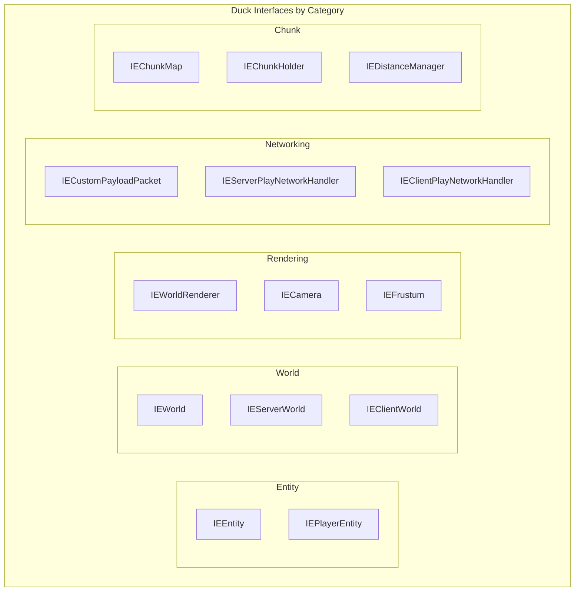

## Table of Contents

- [Overview](#overview)
- [Mixin Configuration Files](#mixin-configuration-files)
  - [Main Mixin Configuration (imm_ptl.mixins.json)](#main-mixin-configuration-imm_ptlmixinsjson)
  - [Compatibility Mixin Configuration (imm_ptl_compat.mixins.json)](#compatibility-mixin-configuration-imm_ptl_compatmixinsjson)
- [Mixin Plugin System](#mixin-plugin-system)
  - [IPMixinPlugin](#ipmixinplugin)
  - [IPCompatMixinPlugin](#ipcompatibilitymixinplugin)
- [Duck Interface Design](#duck-interface-design)
  - [Duck Interface Overview](#duck-interface-overview)
  - [Key Duck Interfaces](#key-duck-interfaces)
- [Key Mixin Implementations](#key-mixin-implementations)
  - [Entity Collision System](#entity-collision-system)
  - [Rendering System](#rendering-system)
  - [Networking and Packet Handling](#networking-and-packet-handling)
  - [Chunk Loading System](#chunk-loading-system)
  - [Position Synchronization](#position-synchronization)
- [Mixin Categories by System](#mixin-categories-by-system)
- [Mixin Directory Structure](#mixin-directory-structure)
- [Injection Techniques Summary](#injection-techniques-summary)

## Overview

ImmersivePortalsMod (IPMod) 是一个功能强大的 Minecraft 模组，它通过 Mixin 注入系统对游戏核心进行深度改造，实现跨维度传送、门户渲染、多世界加载等复杂功能。该模组的 Mixin 系统设计精良，采用了多种业界最佳实践：

- **双配置文件架构**：主配置负责核心功能，兼容性配置负责第三方模组集成
- **智能条件注入**：通过 Mixin Plugin 动态控制哪些 Mixin 需要应用
- **Duck 接口模式**：提供类型安全的扩展接口访问
- **多样化注入技术**：结合 `@Inject`、`@Redirect`、`@ModifyVariable`、`@Overwrite` 等注解

Mixin 是 SpongePowered 开发的一个轻量级字节码注入框架，允许模组在不修改原版源码的情况下，通过注入点（Injection Point）对目标类进行改造。

## Mixin Configuration Files

### Main Mixin Configuration (imm_ptl.mixins.json)

主配置文件定义了 ImmersivePortalsMod 的核心 Mixin 类，文件位于 `src/main/resources/imm_ptl.mixins.json`。

```json:1:147:D:\Minecraft-Learning\assets\ImmersivePortalsMod-6.0.6-mc1.21.1\src\main\resources\imm_ptl.mixins.json
{
  "required": true,
  "package": "qouteall.imm_ptl.core.mixin",
  "compatibilityLevel": "JAVA_17",
  "plugin": "qouteall.imm_ptl.core.IPMixinPlugin",
  "mixins": [
    "common.MixinClipContext",
    "common.MixinConnection_Debug",
    "common.MixinDedicatedServer",
    "common.MixinLevel",
    "common.MixinLivingEntity",
    "common.MixinMinecraftServer",
    "common.MixinServerChunkCache",
    "common.MixinServerLevel",
    // ... 共 80 个公共端 Mixin
  ],
  "client": [
    "client.MixinAbstractClientPlayer",
    "client.MixinClientConnection",
    "client.MixinClientLevel",
    // ... 共 60 个客户端 Mixin
  ],
  "injectors": {
    "defaultRequire": 1
  }
}
```

配置参数说明：

| 参数 | 说明 | 值 |
|------|------|-----|
| `required` | 是否强制要求该配置被加载 | `true` |
| `package` | Mixin 类的包名前缀 | `qouteall.imm_ptl.core.mixin` |
| `compatibilityLevel` | Java 兼容性级别 | `JAVA_17` |
| `plugin` | Mixin Plugin 类的全限定名 | `qouteall.imm_ptl.core.IPMixinPlugin` |
| `mixins` | 服务端和通用 Mixin 列表 | 80 个类 |
| `client` | 仅客户端加载的 Mixin 列表 | 60 个类 |
| `injectors.defaultRequire` | 默认的注入要求等级 | `1` |

### Compatibility Mixin Configuration (imm_ptl_compat.mixins.json)

兼容性配置文件专门用于与第三方模组的集成，位于 `src/main/resources/imm_ptl_compat.mixins.json`。

```json:1:31:D:\Minecraft-Learning\assets\ImmersivePortalsMod-6.0.6-mc1.21.1\src\main\resources\imm_ptl_compat.mixins.json
{
  "required": true,
  "package": "qouteall.imm_ptl.core.compat.mixin",
  "compatibilityLevel": "JAVA_17",
  "plugin": "qouteall.imm_ptl.core.compat.IPCompatMixinPlugin",
  "mixins": [
    "cardinal_comp.MixinCardinalCompComponentKey",
    "flywheel.MixinFlywheelCrumblingRenderer",
    "flywheel.MixinFlywheelProgramCompiler",
    "flywheel.MixinFlywheelQuadConverter",
    "iris.MixinIrisClearPass",
    "iris.MixinIrisFinalPassRenderer",
    "iris.MixinIrisIris",
    "iris.MixinIrisRenderingPipeline",
    "iris.MixinIrisShadowRenderTargets",
    "iris.MixinIrisSodiumShader",
    "iris.MixinIrisTransformPatcher",
    "sodium.MixinSodiumDefaultShaderInterface",
    "sodium.MixinSodiumFlawlessFrames",
    "sodium.MixinSodiumOcclusionCuller",
    "sodium.MixinSodiumRenderRegion",
    "sodium.MixinSodiumRenderSectionManager",
    "sodium.MixinSodiumShaderLoader",
    "sodium.MixinSodiumViewport",
    "sodium.MixinSodiumWorldRenderer"
  ],
  "injectors": {
    "defaultRequire": 1
  }
}
```

这个配置展示了 IPMod 对以下第三方模组的支持：

- **Iris**（着色器兼容性）
- **Sodium**（渲染优化兼容性）
- **Flywheel**（Flywheel 渲染引擎兼容性）
- **Cardinal Components**（实体组件系统兼容性）

## Mixin Plugin System

Mixin Plugin 是 Mixin 框架的核心扩展点，允许在注入过程中执行自定义逻辑。IPMod 实现了两个 Plugin 类：

### IPMixinPlugin

主 Plugin 负责核心 Mixin 的加载控制：

```java:11:51:D:\Minecraft-Learning\assets\ImmersivePortalsMod-6.0.6-mc1.21.1\src\main\java\qouteall\imm_ptl\core\IPMixinPlugin.java
package qouteall.imm_ptl.core;

import net.fabricmc.loader.api.FabricLoader;
import org.objectweb.asm.tree.ClassNode;
import org.spongepowered.asm.mixin.extensibility.IMixinConfigPlugin;
import org.spongepowered.asm.mixin.extensibility.IMixinInfo;

import java.util.List;
import java.util.Set;

public class IPMixinPlugin implements IMixinConfigPlugin {
    @Override
    public void onLoad(String mixinPackage) {
    
    }
    
    @Override
    public String getRefMapperConfig() {
        return null;
    }
    
    @Override
    public boolean shouldApplyMixin(String targetClassName, String mixinClassName) {
        if (FabricLoader.getInstance().isModLoaded("porting_lib")) {
            if (mixinClassName.contains("MixinRenderTarget") || mixinClassName.contains("MixinMainTarget")) {
                return false;
            }
        }
        return true;
    }
    
    @Override
    public void acceptTargets(Set<String> myTargets, Set<String> otherTargets) {
    
    }
    
    @Override
    public List<String> getMixins() {
        return null;
    }
    
    @Override
    public void preApply(String targetClassName, ClassNode targetClass, String mixinClassName, IMixinInfo mixinInfo) {
    
    }
    
    @Override
    public void postApply(String targetClassName, ClassNode targetClass, String mixinClassName, IMixinInfo mixinInfo) {
    
    }
}
```

**关键方法解析**：

- `shouldApplyMixin()`：动态判断是否应用某个 Mixin，当 PortingLib 模组存在时，跳过 `MixinRenderTarget` 和 `MixinMainTarget`，避免冲突

### IPCompatMixinPlugin

兼容性 Plugin 负责第三方模组的条件加载：

```java:11:75:D:\Minecraft-Learning\assets\ImmersivePortalsMod-6.0.6-mc1.21.1\src\main\java\qouteall\imm_ptl\core\compat\IPCompatMixinPlugin.java
package qouteall.imm_ptl.core.compat;

import net.fabricmc.loader.api.FabricLoader;
import org.objectweb.asm.tree.ClassNode;
import org.spongepowered.asm.mixin.extensibility.IMixinConfigPlugin;
import org.spongepowered.asm.mixin.extensibility.IMixinInfo;

import java.util.List;
import java.util.Set;

public class IPCompatMixinPlugin implements IMixinConfigPlugin {
    @Override
    public void onLoad(String mixinPackage) {
    
    }
    
    @Override
    public String getRefMapperConfig() {
        return null;
    }
    
    @Override
    public boolean shouldApplyMixin(String targetClassName, String mixinClassName) {
        
        
        FabricLoader fabricLoader = FabricLoader.getInstance();
        if (mixinClassName.contains("IrisSodium")) {
            boolean sodiumLoaded = fabricLoader.isModLoaded("sodium");
            boolean irisLoaded = fabricLoader.isModLoaded("iris");
            return sodiumLoaded && irisLoaded;
        }
        
        if (mixinClassName.contains("Iris")) {
            boolean irisLoaded = fabricLoader.isModLoaded("iris");
            return irisLoaded;
        }
        
        if (mixinClassName.contains("Sodium")) {
            boolean sodiumLoaded = fabricLoader.isModLoaded("sodium");
            return sodiumLoaded;
        }
        
        if (mixinClassName.contains("Flywheel")) {
            boolean flywheelLoaded = fabricLoader.isModLoaded("flywheel");
            return flywheelLoaded;
        }
        
        if (mixinClassName.contains("CardinalComp")) {
            boolean cardinalCompLoaded = fabricLoader.isModLoaded("cardinal-components-base");
            return cardinalCompLoaded;
        }
        
        return false;
    }
```

兼容性 Plugin 的条件加载逻辑：

| 模组名称 | Mixin 模式 | 加载条件 |
|----------|------------|----------|
| Iris + Sodium | `IrisSodium` | Sodium 和 Iris 都已加载 |
| Iris | `Iris` | Iris 已加载 |
| Sodium | `Sodium` | Sodium 已加载 |
| Flywheel | `Flywheel` | Flywheel 已加载 |
| Cardinal Components | `CardinalComp` | cardinal-components-base 已加载 |

## Duck Interface Design

Duck Interface（鸭式接口）是 Mixin 框架的核心概念，允许通过接口方法扩展目标类的功能。IPMod 定义了丰富的 Duck 接口。

### Duck Interface Overview

IPMod 的 Duck 接口按照功能模块分类：



### Key Duck Interfaces

#### IEEntity

`IEEntity` 是最重要的 Duck 接口之一，为所有实体添加了门户碰撞相关的功能：

```java:1:42:D:\Minecraft-Learning\assets\ImmersivePortalsMod-6.0.6-mc1.21.1\src\main\java\qouteall\imm_ptl\core\ducks\IEEntity.java
package qouteall.imm_ptl.core.ducks;

import net.minecraft.world.entity.Entity;
import net.minecraft.world.level.Level;
import net.minecraft.world.phys.AABB;
import net.minecraft.world.phys.Vec3;
import org.jetbrains.annotations.Nullable;
import qouteall.imm_ptl.core.collision.PortalCollisionHandler;
import qouteall.imm_ptl.core.portal.Portal;

public interface IEEntity {
    void ip_notifyCollidingWithPortal(Entity portal);
    
    @Nullable
    PortalCollisionHandler ip_getPortalCollisionHandler();
    
    PortalCollisionHandler ip_getOrCreatePortalCollisionHandler();
    
    void ip_setPortalCollisionHandler(@Nullable PortalCollisionHandler handler);
    
    @Nullable
    @Deprecated
    Portal ip_getCollidingPortal();
    
    void ip_tickCollidingPortal();
    
    boolean ip_isCollidingWithPortal();
    
    boolean ip_isRecentlyCollidingWithPortal();
    
    void ip_clearCollidingPortal();
    
    void ip_unsetRemoved();
    
    @Nullable AABB ip_getActiveCollisionBox(AABB originalBox);
    
    void ip_setPositionWithoutTriggeringCallback(Vec3 newPos);
    
    void ip_setWorld(Level world);
}
```

#### IEWorldRenderer

`IEWorldRenderer` 提供了对 `LevelRenderer` 的扩展访问：

```java:1:46:D:\Minecraft-Learning\assets\ImmersivePortalsMod-6.0.6-mc1.21.1\src\main\java\qouteall\imm_ptl\core\ducks\IEWorldRenderer.java
package qouteall.imm_ptl.core.ducks;

import com.mojang.blaze3d.vertex.PoseStack;
import it.unimi.dsi.fastutil.objects.ObjectArrayList;
import net.minecraft.client.renderer.MultiBufferSource;
import net.minecraft.client.renderer.PostChain;
import net.minecraft.client.renderer.RenderBuffers;
import net.minecraft.client.renderer.ViewArea;
import net.minecraft.client.renderer.chunk.SectionRenderDispatcher;
import net.minecraft.client.renderer.culling.Frustum;
import net.minecraft.client.renderer.entity.EntityRenderDispatcher;
import net.minecraft.world.entity.Entity;

public interface IEWorldRenderer {
    EntityRenderDispatcher ip_getEntityRenderDispatcher();
    
    ViewArea ip_getBuiltChunkStorage();
    
    void ip_myRenderEntity(
        Entity entity,
        double cameraX,
        double cameraY,
        double cameraZ,
        float partialTick,
        PoseStack matrixStack,
        MultiBufferSource vertexConsumerProvider
    );
    
    PostChain portal_getTransparencyShader();
    
    void portal_setTransparencyShader(PostChain arg);
    
    RenderBuffers ip_getRenderBuffers();
    
    void ip_setRenderBuffers(RenderBuffers arg);
    
    Frustum portal_getFrustum();
    
    void portal_setFrustum(Frustum arg);
    
    void portal_fullyDispose();
    
    void portal_setChunkInfoList(ObjectArrayList<SectionRenderDispatcher.RenderSection> arg);
    
    ObjectArrayList<SectionRenderDispatcher.RenderSection> portal_getChunkInfoList();
}
```

#### IEChunkMap_Accessor

用于访问 `ChunkMap` 的私有方法：

```java:1:12:D:\Minecraft-Learning\assets\ImmersivePortalsMod-6.0.6-mc1.21.1\src\main\java\qouteall\imm_ptl\core\mixin\common\chunk_sync\IEChunkMap_Accessor.java
package qouteall.imm_ptl.core.mixin.common.chunk_sync;

import net.minecraft.server.level.ChunkHolder;
import net.minecraft.server.level.ChunkMap;
import org.spongepowered.asm.mixin.Mixin;
import org.spongepowered.asm.mixin.gen.Invoker;

@Mixin(ChunkMap.class)
public interface IEChunkMap_Accessor {
    @Invoker("getChunks")
    Iterable<ChunkHolder> ip_getChunks();
}
```

## Key Mixin Implementations

### Entity Collision System

`MixinEntity` 是实体碰撞系统的核心 Mixin，它实现了跨门户碰撞检测和响应：

```java:37:138:D:\Minecraft-Learning\assets\ImmersivePortalsMod-6.0.6-mc1.21.1\src\main\java\qouteall\imm_ptl\core\mixin\common\collision\MixinEntity.java
package qouteall.imm_ptl.core.mixin.common.collision;

import net.minecraft.core.BlockPos;
import net.minecraft.core.SectionPos;
import net.minecraft.network.chat.Component;
import net.minecraft.util.Mth;
import net.minecraft.world.entity.Entity;
import net.minecraft.world.entity.player.Player;
import net.minecraft.world.level.ChunkPos;
import net.minecraft.world.level.Level;
import net.minecraft.world.level.block.state.BlockState;
import net.minecraft.world.phys.AABB;
import net.minecraft.world.phys.Vec3;
import org.jetbrains.annotations.Nullable;
import org.slf4j.Logger;
import org.spongepowered.asm.mixin.Final;
import org.spongepowered.asm.mixin.Mixin;
import org.spongepowered.asm.mixin.Shadow;
import org.spongepowered.asm.mixin.Unique;
import org.spongepowered.asm.mixin.injection.At;
import org.spongepowered.asm.mixin.injection.Inject;
import org.spongepowered.asm.mixin.injection.Redirect;
import org.spongepowered.asm.mixin.injection.callback.CallbackInfo;
import org.spongepowered.asm.mixin.injection.callback.CallbackInfoReturnable;
import org.spongepowered.asm.mixin.injection.callback.LocalCapture;
import qouteall.imm_ptl.core.IPGlobal;
import qouteall.imm_ptl.core.IPMcHelper;
import qouteall.imm_ptl.core.api.ImmPtlEntityExtension;
import qouteall.imm_ptl.core.collision.PortalCollisionHandler;
import qouteall.imm_ptl.core.ducks.IEEntity;
import qouteall.imm_ptl.core.miscellaneous.IPVanillaCopy;
import qouteall.imm_ptl.core.portal.EndPortalEntity;
import qouteall.imm_ptl.core.portal.Portal;
import qouteall.q_misc_util.Helper;
import qouteall.q_misc_util.my_util.CountDownInt;

@Mixin(Entity.class)
public abstract class MixinEntity implements IEEntity, ImmPtlEntityExtension {
    
    @Nullable
    @Unique
    private PortalCollisionHandler ip_portalCollisionHandler;
    
    // ... shadows ...
    
    @Redirect(
        method = "Lnet/minecraft/world/entity/Entity;move(Lnet/minecraft/world/entity/MoverType;Lnet/minecraft/world/phys/Vec3;)V",
        at = @At(
            value = "INVOKE",
            target = "Lnet/minecraft/world/entity/Entity;collide(Lnet/minecraft/world/phys/Vec3;)Lnet/minecraft/world/phys/Vec3;"
        )
    )
    private Vec3 redirectHandleCollisions(Entity entity, Vec3 attemptedMove) {
        if (!IPGlobal.enableServerCollision) {
            if (!entity.level().isClientSide()) {
                if (entity instanceof Player) {
                    return attemptedMove;
                }
                else {
                    return Vec3.ZERO;
                }
            }
        }
        
        if (attemptedMove.lengthSqr() > 60 * 60) {
            // avoid loading too many chunks in collision calculation and lag the server
            if (IMM_PTL_LOG_COUNTER.tryDecrement()) {
                LOGGER.error(
                    "[ImmPtl] Skipping collision calculation because entity moves too fast {} {} {}",
                    entity, attemptedMove, entity.level().getGameTime(),
                    new Throwable()
                );
            }
            
            return Vec3.ZERO;
        }
        
        if (!IPGlobal.crossPortalCollision
            || ip_portalCollisionHandler == null
            || !ip_portalCollisionHandler.hasCollisionEntry()
        ) {
            Vec3 normalCollisionResult = collide(attemptedMove);
            return normalCollisionResult;
        }
        
        Vec3 result = ip_portalCollisionHandler.handleCollision(
            (Entity) (Object) this, attemptedMove
        );
        
        if (result.lengthSqr() > 20 * 20) {
            if (IMM_PTL_LOG_COUNTER.tryDecrement()) {
                LOGGER.error(
                    "[ImmPtl] cross portal collision result too large {} {} {}",
                    this, attemptedMove, result
                );
            }
            return Vec3.ZERO;
        }
        
        return result;
    }
```

**碰撞系统 Mixin 的核心功能**：

1. **@Redirect 碰撞处理**：重定向 `Entity.move()` 方法中的 `collide()` 调用，实现跨门户碰撞
2. **@Inject 火抗性检查**：当实体在末地传送门中时，返回 `fireImmune = true`
3. **@Redirect 碰撞盒获取**：修改 `checkInsideBlocks()` 中的碰撞盒计算
4. **@Inject 穿墙检测**：修改 `isInWall()` 返回值，避免在门户碰撞时误判

#### MixinPlayer_Collision

玩家特有的碰撞逻辑使用 `@Overwrite` 注解完全替换方法：

```java:11:34:D:\Minecraft-Learning\assets\ImmersivePortalsMod-6.0.6-mc1.21.1\src\main\java\qouteall\imm_ptl\core\mixin\common\collision\MixinPlayer_Collision.java
package qouteall.imm_ptl.core.mixin.common.collision;

import net.minecraft.world.entity.LivingEntity;
import net.minecraft.world.entity.Pose;
import net.minecraft.world.entity.player.Player;
import net.minecraft.world.phys.AABB;
import org.spongepowered.asm.mixin.Mixin;
import org.spongepowered.asm.mixin.Overwrite;
import qouteall.imm_ptl.core.ducks.IEEntity;

@SuppressWarnings("resource")
@Mixin(Player.class)
public abstract class MixinPlayer_Collision {
    
    /**
     * @author qouteall
     * @reason mixin does not allow cancel in redirect
     */
    @Overwrite
    public boolean canPlayerFitWithinBlocksAndEntitiesWhen(Pose pose) {
        LivingEntity this_ = (LivingEntity) (Object) this;
        
        AABB box = this_.getDimensions(pose).makeBoundingBox(this_.position());
        AABB activeCollisionBox = ((IEEntity) this_).ip_getActiveCollisionBox(box);
        if (activeCollisionBox == null) {
            return true;
        }
        return this_.level().noCollision(
            this_, activeCollisionBox.deflate(1.0E-7)
        );
    }
}
```

### Rendering System

`MixinLevelRenderer` 是渲染系统的核心 Mixin，文件超过 670 行，处理跨门户渲染的所有细节：

```java:63:186:D:\Minecraft-Learning\assets\ImmersivePortalsMod-6.0.6-mc1.21.1\src\main\java\qouteall\imm_ptl\core\mixin\client\render\MixinLevelRenderer.java
package qouteall.imm_ptl.core.mixin.client.render;

import com.llamalad7.mixinextras.sugar.Local;
import com.mojang.blaze3d.pipeline.RenderTarget;
import com.mojang.blaze3d.platform.Lighting;
import com.mojang.blaze3d.systems.RenderSystem;
import com.mojang.blaze3d.vertex.PoseStack;
import com.mojang.blaze3d.vertex.VertexBuffer;
// ... imports ...

@Mixin(value = LevelRenderer.class)
public abstract class MixinLevelRenderer implements IEWorldRenderer {
    
    @Shadow
    private ClientLevel level;
    
    @Shadow
    @Final
    private EntityRenderDispatcher entityRenderDispatcher;
    
    @Shadow
    @Final
    private Minecraft minecraft;
    
    // ... more shadows ...
    
    @Inject(
        method = "renderLevel",
        at = @At(
            value = "INVOKE",
            target = "Lnet/minecraft/client/renderer/DimensionSpecialEffects;constantAmbientLight()Z"
        )
    )
    private void onAfterCutoutRendering(
        DeltaTracker deltaTracker, boolean bl, Camera camera, GameRenderer gameRenderer, LightTexture lightTexture, Matrix4f modelView, Matrix4f matrix4f2, CallbackInfo ci
    ) {
        CrossPortalEntityRenderer.onBeginRenderingEntitiesAndBlockEntities(modelView);
    }
    
    @Inject(
        method = "renderLevel",
        at = @At(
            value = "INVOKE",
            target = "Lnet/minecraft/client/renderer/Sheets;translucentCullBlockSheet()Lnet/minecraft/client/renderer/RenderType;"
        )
    )
    private void onMyBeforeTranslucentRendering(
        DeltaTracker deltaTracker, boolean bl, Camera camera, GameRenderer gameRenderer, LightTexture lightTexture, Matrix4f modelView, Matrix4f matrix4f2, CallbackInfo ci
    ) {
        IPCGlobal.renderer.onBeforeTranslucentRendering(modelView);
        
        MyGameRenderer.updateFogColor();
        MyGameRenderer.resetFogState();
        
        MyGameRenderer.resetDiffuseLighting();
        
        FrontClipping.disableClipping();
    }
    
    @IPVanillaCopy
    @Inject(
        method = "renderLevel",
        at = @At(
            value = "INVOKE",
            target = "Lnet/minecraft/client/renderer/MultiBufferSource$BufferSource;endLastBatch()V",
            ordinal = 1, // the second occurrence
            shift = At.Shift.AFTER
        )
    )
    private void onEndRenderingEntities(
        DeltaTracker deltaTracker, boolean bl, Camera camera, GameRenderer gameRenderer, LightTexture lightTexture, Matrix4f modelView, Matrix4f matrix4f, Callback4f2, CallbackInfo ci, @Local PoseStack poseStack
    ) {
        CrossPortalEntityRenderer.onEndRenderingEntitiesAndBlockEntities(poseStack);
    }
```

渲染系统 Mixin 的关键注入点：

| 注入点 | 触发时机 | 功能 |
|--------|----------|------|
| `constantAmbientLight()` | 切出渲染完成后 | 开始跨门户实体渲染 |
| `translucentCullBlockSheet()` | 半透明渲染前 | 准备渲染状态 |
| `endLastBatch()` (ordinal=1) | 实体渲染结束 | 结束跨门户渲染 |
| `RETURN` | 渲染完全结束 | 恢复渲染状态 |
| `renderSectionLayer()` | 每个区块层渲染前后 | 设置/取消裁剪平面 |

### Networking and Packet Handling

网络包处理 Mixin 负责跨维度通信：

```java:1:38:D:\Minecraft-Learning\assets\ImmersivePortalsMod-6.0.6-mc1.21.1\src\main\java\qouteall\imm_ptl\core\mixin\common\networking\MixinClientboundCustomPayloadPacket.java
package qouteall.imm_ptl.core.mixin.common.networking;

import net.minecraft.network.protocol.common.ClientCommonPacketListener;
import net.minecraft.network.protocol.common.ClientboundCustomPayloadPacket;
import net.minecraft.network.protocol.common.custom.CustomPacketPayload;
import net.minecraft.network.protocol.game.ClientGamePacketListener;
import org.spongepowered.asm.mixin.Final;
import org.spongepowered.asm.mixin.Mixin;
import org.spongepowered.asm.mixin.Shadow;
import org.spongepowered.asm.mixin.injection.At;
import org.spongepowered.asm.mixin.injection.Inject;
import org.spongepowered.asm.mixin.injection.callback.CallbackInfo;
import qouteall.imm_ptl.core.ducks.IECustomPayloadPacket;
import qouteall.imm_ptl.core.network.PacketRedirection;

@Mixin(ClientboundCustomPayloadPacket.class)
public class MixinClientboundCustomPayloadPacket implements IECustomPayloadPacket {
    
    @Shadow
    @Final
    private CustomPacketPayload payload;
    
    // this is run before Fabric API try to handle the packet
    @Inject(
        method = "handle(Lnet/minecraft/network/protocol/common/ClientCommonPacketListener;)V",
        at = @At("HEAD"),
        cancellable = true
    )
    private void onHandle(ClientCommonPacketListener clientCommonPacketListener, CallbackInfo ci) {
        if (payload instanceof PacketRedirection.Payload redirectPayload) {
            if (clientCommonPacketListener instanceof ClientGamePacketListener clientGamePacketListener) {
                redirectPayload.handle(clientGamePacketListener);
            }
            
            ci.cancel();
        }
    }
}
```

**网络包处理的独特设计**：

1. 使用 `@Inject` 在 `HEAD` 位置拦截 `handle()` 方法
2. 通过 `@Cancellable` 取消原始处理，防止 Fabric API 再次处理
3. 动态检查 `payload` 类型，转发到 `PacketRedirection.Payload` 的处理器

### Chunk Loading System

区块加载系统通过多个 Mixin 协调工作：

```java:1:61:D:\Minecraft-Learning\assets\ImmersivePortalsMod-6.0.6-mc1.21.1\src\main\java\qouteall\imm_ptl\core\mixin\common\chunk_sync\MixinDistanceManager.java
package qouteall.imm_ptl.core.mixin.common.chunk_sync;

import it.unimi.dsi.fastutil.longs.Long2ObjectMap;
import it.unimi.dsi.fastutil.objects.ObjectOpenHashSet;
import it.unimi.dsi.fastutil.objects.ObjectSet;
import net.minecraft.core.SectionPos;
import net.minecraft.server.level.ChunkMap;
import net.minecraft.server.level.DistanceManager;
import net.minecraft.server.level.ServerLevel;
import net.minecraft.server.level.ServerPlayer;
import net.minecraft.server.level.Ticket;
import net.minecraft.util.SortedArraySet;
import org.spongepowered.asm.mixin.Final;
import org.spongepowered.asm.mixin.Mixin;
import org.spongepowered.asm.mixin.Shadow;
import org.spongepowered.asm.mixin.injection.At;
import org.spongepowered.asm.mixin.injection.Inject;
import org.spongepowered.asm.mixin.injection.callback.CallbackInfo;
import org.spongepowered.asm.mixin.injection.callback.CallbackInfoReturnable;
import qouteall.imm_ptl.core.chunk_loading.ImmPtlChunkTickets;
import qouteall.imm_ptl.core.ducks.IEChunkMap;
import qouteall.imm_ptl.core.ducks.IEDistanceManager;
import qouteall.imm_ptl.core.platform_specific.IPConfig;

@Mixin(DistanceManager.class)
public abstract class MixinDistanceManager implements IEDistanceManager {
    
    @Shadow
    @Final
    private Long2ObjectMap<ObjectSet<ServerPlayer>> playersPerChunk;
    
    @Shadow
    protected abstract SortedArraySet<Ticket<?>> getTickets(long position);
    
    // avoid NPE
    @Inject(method = "Lnet/minecraft/server/level/DistanceManager;removePlayer(Lnet/minecraft/core/SectionPos;Lnet/minecraft/server/level/ServerPlayer;)V", at = @At("HEAD"))
    private void onHandleChunkLeave(
        SectionPos sectionPos,
        ServerPlayer serverPlayer,
        CallbackInfo ci
    ) {
        long chunkPos = sectionPos.chunk().toLong();
        playersPerChunk.computeIfAbsent(chunkPos, k -> new ObjectOpenHashSet<>());
    }
    
    @Inject(
        method = "runAllUpdates",
        at = @At("RETURN")
    )
    private void onRunAllUpdates(ChunkMap chunkManager, CallbackInfoReturnable<Boolean> cir) {
        if (IPConfig.getConfig().enableImmPtlChunkLoading) {
            ServerLevel world = ((IEChunkMap) chunkManager).ip_getWorld();
            ImmPtlChunkTickets.get(world).flushThrottling(world);
        }
    }
    
    @Override
    public SortedArraySet<Ticket<?>> portal_getTicketSet(long chunkPos) {
        return getTickets(chunkPos);
    }
}
```

### Position Synchronization

位置同步 Mixin 处理跨维度的玩家位置同步：

```java:114:173:D:\Minecraft-Learning\assets\ImmersivePortalsMod-6.0.6-mc1.21.1\src\main\java\qouteall\imm_ptl\core\mixin\common\position_sync\MixinServerGamePacketListenerImpl.java
package qouteall.imm_ptl.core.mixin.common.position_sync;

import net.minecraft.network.chat.Component;
import net.minecraft.network.protocol.game.ClientboundPlayerPositionPacket;
import net.minecraft.network.protocol.game.ServerboundAcceptTeleportationPacket;
import net.minecraft.network.protocol.game.ServerboundMovePlayerPacket;
import net.minecraft.network.protocol.game.ServerboundPlayerCommandPacket;
import net.minecraft.resources.ResourceKey;
import net.minecraft.server.level.ServerLevel;
import net.minecraft.server.level.ServerPlayer;
import net.minecraft.server.network.ServerGamePacketListenerImpl;
import net.minecraft.world.entity.Entity;
import net.minecraft.world.entity.RelativeMovement;
import net.minecraft.world.level.Level;
import net.minecraft.world.level.LevelReader;
import net.minecraft.world.phys.AABB;
import net.minecraft.world.phys.Vec3;
import net.minecraft.world.phys.shapes.BooleanOp;
import net.minecraft.world.phys.shapes.Shapes;
import net.minecraft.world.phys.shapes.VoxelShape;
import org.jetbrains.annotations.Nullable;
import org.objectweb.asm.Opcodes;
import org.slf4j.Logger;
import org.spongepowered.asm.mixin.Final;
import org.spongepowered.asm.mixin.Mixin;
import org.spongepowered.asm.mixin.Overwrite;
import org.spongepowered.asm.mixin.Shadow;
import org.spongepowered.asm.mixin.Unique;
import org.spongepowered.asm.mixin.injection.At;
import org.spongepowered.asm.mixin.injection.Inject;
import org.spongepowered.asm.mixin.injection.callback.CallbackInfo;
import org.spongepowered.asm.mixin.injection.callback.CallbackInfoReturnable;
import qouteall.imm_ptl.core.IPGlobal;
import qouteall.imm_ptl.core.ducks.IEEntity;
import qouteall.imm_ptl.core.ducks.IEPlayerMoveC2SPacket;
import qouteall.imm_ptl.core.ducks.IEPlayerPositionLookS2CPacket;
import qouteall.imm_ptl.core.ducks.IEServerPlayNetworkHandler;
import qouteall.imm_ptl.core.mc_utils.ServerTaskList;
import qouteall.imm_ptl.core.miscellaneous.IPVanillaCopy;
import qouteall.imm_ptl.core.platform_specific.IPConfig;
import qouteall.imm_ptl.core.teleportation.ServerTeleportationManager;
import qouteall.q_misc_util.my_util.CountDownInt;

import java.util.Set;

@Mixin(value = ServerGamePacketListenerImpl.class, priority = 900)
public abstract class MixinServerGamePacketListenerImpl implements IEServerPlayNetworkHandler {
    // ... shadows ...
    
    /**
     * Attach the dimension information to
     * {@link ServerGamePacketListenerImpl#awaitingPositionFromClient}
     *
     * The teleport system: when server wants to teleport a player,
     * the server will send the {@link ClientboundPlayerPositionPacket}, then
     * set {@link ServerGamePacketListenerImpl#awaitingPositionFromClient}
     * and {@link ServerGamePacketListenerImpl#awaitingTeleport} counter.
     *
     * Before the client sending {@link ServerboundAcceptTeleportationPacket},
     * the position packets are ignored, and some of the item using packets are ignored.
     *
     * Attach the dimension information to the position, to avoid messing up coordinates
     * of different dimensions.
     */
    @SuppressWarnings("JavadocReference")
    @Unique
    private @Nullable ResourceKey<Level> ip_dimOfAwaitingPosition;
    
    //do not process move packet when client dimension and server dimension are not synced
    @Inject(
        method = "Lnet/minecraft/server/network/ServerGamePacketListenerImpl;handleMovePlayer(Lnet/minecraft/network/protocol/game/ServerboundMovePlayerPacket;)V",
        at = @At(
            value = "INVOKE",
            shift = At.Shift.AFTER,
            target = "Lnet/minecraft/network/protocol/PacketUtils;ensureRunningOnSameThread(Lnet/minecraft/network/protocol/Packet;Lnet/minecraft/network/PacketListener;Lnet/minecraft/server/level/ServerLevel;)V"
        ),
        cancellable = true
    )
    private void onProcessMovePacket(ServerboundMovePlayerPacket packet, CallbackInfo ci) {
        ResourceKey<Level> packetDimension = ((IEPlayerMoveC2SPacket) packet).ip_getPlayerDimension();
        
        if (packetDimension == null) {
            LOGGER.error("Player move packet is missing dimension info. Maybe the player client doesn't install iPortal");
            ServerTaskList.of(player.server).addTask(() -> {
                player.connection.disconnect(Component.literal(
                    "The client does not have Immersive Portals mod"
                ));
                return true;
            });
            return;
        }
        
        if (player.level().dimension() != packetDimension) {
            if (LOG_LIMIT.tryDecrement()) {
                LOGGER.info(
                    "[ImmPtl] Ignoring player move packet. Player: {} Packet: {} {} {} {}",
                    player, packetDimension.location(),
                    packet.getX(player.getX()),
                    packet.getY(player.getY()),
                    packet.getZ(player.getZ())
                );
            }
            
            ip_wrongMovePacketCount += 1;
            
            if (ip_wrongMovePacketCount > 10) {
                LOGGER.info(
                    "[ImmPtl] Force move player {} {} {}",
                    player, player.level().dimension().location(), player.position()
                );
                ServerTeleportationManager.of(player.server).forceTeleportPlayer(
                    player, player.level().dimension(), player.position()
                );
                ip_wrongMovePacketCount = 0;
            }
            
            ci.cancel();
        }
        else {
            ip_wrongMovePacketCount = 0;
        }
    }
    
    /**
     * @reason make PlayerPositionLookS2CPacket contain dimension data and do some special handling
     * @author qouteall
     */
    @Overwrite
    @IPVanillaCopy
    public void teleport(
        double x, double y, double z, float yaw, float pitch,
        Set<RelativeMovement> relativeAttrs
    ) {
        // it may request teleport while this.player is marked removed during respawn
        
        if (player.getRemovalReason() != null) {
            LOGGER.error(
                "[ImmPtl] Tries to send player pos packet to a removed player {}",
                player, new Throwable()
            );
            return;
        }
        
        if (IPConfig.getConfig().serverTeleportLogging) {
            LOGGER.info(
                "Teleporting player {} to {} {} {} {}",
                player, player.level().dimension().location(), x, y, z
            );
        }
        
        // ... rest of teleport implementation ...
        
        ((IEPlayerPositionLookS2CPacket) lookPacket).ip_setPlayerDimension(player.level().dimension());
        
        this.player.connection.send(lookPacket);
    }
```

**位置同步系统的关键特性**：

1. **维度信息附加**：在位置同步包中添加维度信息
2. **包验证**：检查客户端和服务端的维度是否同步
3. **错误恢复**：当检测到位置同步异常时，强制传送玩家
4. **@Overwrite 完整替换**：使用 `@Overwrite` 完全替换 `teleport()` 方法以添加维度支持

## Mixin Categories by System

以下表格展示了 IPMod Mixin 按功能系统的分类：

| 系统分类 | Mixin 数量 | 主要功能 |
|----------|------------|----------|
| **碰撞系统 (collision)** | 12 | 跨门户碰撞检测、碰撞盒变换 |
| **区块同步 (chunk_sync)** | 10 | 跨维度区块加载、实体同步 |
| **实体同步 (entity_sync)** | 6 | 服务器实体同步管理 |
| **位置同步 (position_sync)** | 7 | 玩家位置同步、维度信息附加 |
| **网络通信 (networking)** | 1 | 自定义数据包处理 |
| **渲染系统 (render)** | 30+ | 跨门户渲染、裁剪平面管理 |
| **交互系统 (interaction)** | 5 | 桶、物品交互的门户感知 |
| **工具函数 (mc_util)** | 4 | 实体事件监听、位置更新 |
| **其他同步 (other_sync)** | 4 | 玩家姿态、数据存储同步 |
| **门户生成 (portal_generation)** | 4 | 物品、玩家列表的门户关联 |
| **杂项 (miscellaneous)** | 5 | 龙战、钓鱼钩、拴绳等特殊处理 |
| **调试 (debug)** | 10 | 调试信息和日志记录 |
| **兼容性 (compat)** | 18 | Iris、Sodium、Flywheel 兼容性 |

## Mixin Directory Structure

IPMod 的 Mixin 按照清晰的目录结构组织：

```
src/main/java/qouteall/imm_ptl/core/
├── mixin/
│   ├── common/                    # 通用 Mixin（服务端和客户端都加载）
│   │   ├── MixinClipContext.java
│   │   ├── MixinLevel.java
│   │   ├── MixinLivingEntity.java
│   │   ├── MixinServerLevel.java
│   │   ├── MixinMinecraftServer.java
│   │   ├── MixinDedicatedServer.java
│   │   │
│   │   ├── chunk_sync/           # 区块同步
│   │   │   ├── IEChunkMap_Accessor.java
│   │   │   ├── IEDistanceManager.java
│   │   │   ├── IEServerCommonPacketListenerImpl.java
│   │   │   ├── MixinChunkHolder.java
│   │   │   ├── MixinChunkMap_C.java
│   │   │   ├── MixinDistanceManager.java
│   │   │   ├── MixinPlayerChunkSender.java
│   │   │   ├── MixinPlayerTicketTracker.java
│   │   │   ├── MixinServerGamePacketListenerImpl_ChunkSync.java
│   │   │   └── IEChunkTaskPriorityQueueSorter.java
│   │   │
│   │   ├── collision/            # 碰撞系统
│   │   │   ├── IEEntity_Collision.java
│   │   │   ├── MixinEntity.java
│   │   │   ├── MixinPlayer_Collision.java
│   │   │   ├── MixinProjectile.java
│   │   │   ├── MixinAbstractArrow.java
│   │   │   ├── MixinAbstractMinecartEntity.java
│   │   │   ├── MixinThrowableProjectile.java
│   │   │   └── MixinThrownEnderPearl.java
│   │   │
│   │   ├── entity_sync/          # 实体同步
│   │   │   ├── MixinChunkMap_E.java
│   │   │   ├── MixinPersistentEntitySectionManager.java
│   │   │   ├── MixinServerEntity.java
│   │   │   ├── MixinServerGamePacketListenerImpl_Redirect.java
│   │   │   ├── MixinServerPlayer.java
│   │   │   └── MixinTrackedEntity.java
│   │   │
│   │   ├── networking/           # 网络通信
│   │   │   └── MixinClientboundCustomPayloadPacket.java
│   │   │
│   │   ├── position_sync/        # 位置同步
│   │   │   ├── MixinPlayerPositionLookS2CPacket.java
│   │   │   ├── MixinServerGamePacketListenerImpl.java
│   │   │   ├── MixinServerboundMovePlayerPacket_S.java
│   │   │   ├── MixinServerboundMovePlayerPacketPos.java
│   │   │   ├── MixinServerboundMovePlayerPacketPosRot.java
│   │   │   ├── MixinServerboundMovePlayerPacketRot.java
│   │   │   └── MixinServerboundMovePlayerPacketStatusOnly.java
│   │   │
│   │   ├── render/               # 渲染（客户端）
│   │   │   └── (see client/render/)
│   │   │
│   │   └── [其他子目录...]
│   │
│   └── client/                   # 客户端专用 Mixin
│       ├── MixinMinecraft.java
│       ├── MixinClientConnection.java
│       ├── MixinClientLevel.java
│       ├── MixinCamera.java
│       ├── MixinDebugScreenOverlay.java
│       ├── MixinGlDebug.java
│       │
│       ├── accessor/             # 访问器
│       │   ├── IEClientLevel_Accessor.java
│       │   └── IEClientLevelData.java
│       │
│       ├── collisions/           # 客户端碰撞
│       │   └── MixinLocalPlayer.java
│       │
│       ├── interaction/          # 客户端交互
│       │   ├── MixinGameRenderer_B.java
│       │   ├── MixinItem_Interaction_Client.java
│       │   ├── MixinMinecraft_B.java
│       │   └── MixinMultiPlayerGameMode.java
│       │
│       ├── multiworld_awareness/ # 多世界感知
│       │   ├── MixinBiomeAmbientSoundPlayer.java
│       │   └── MixinFogRenderer.java
│       │
│       ├── particle/             # 粒子
│       │   ├── IEParticle.java
│       │   └── MixinParticleEngine.java
│       │
│       ├── render/               # 渲染核心
│       │   ├── IERenderSystem.java
│       │   ├── IESectionRenderDispatcher.java
│       │   ├── MixinBlockEntityRenderDispatcher.java
│       │   ├── MixinCamera.java
│       │   ├── MixinEntityRenderDispatcher.java
│       │   ├── MixinFrustum_FixDeadLoop.java
│       │   ├── MixinGameRenderer.java
│       │   ├── MixinGlStateManager.java
│       │   ├── MixinLevelRenderer.java
│       │   ├── MixinLevelRenderer_BeforeIris.java
│       │   ├── MixinLevelRenderer_ForceMainThreadRebuild.java
│       │   ├── MixinLevelRenderer_Optional.java
│       │   ├── MixinMultiBufferSourceBufferSource.java
│       │   ├── MixinRenderSection.java
│       │   ├── MixinRenderSystem_Clipping.java
│       │   ├── MixinRenderSystem_Fog.java
│       │   ├── MixinScreenEffectRenderer.java
│       │   ├── MixinSectionRenderDispatcher.java
│       │   ├── MixinShaderInstanceForIris.java
│       │   │
│       │   ├── framebuffer/
│       │   │   ├── MixinMainTarget.java
│       │   │   └── MixinRenderTarget.java
│       │   │
│       │   ├── isometric/
│       │   │   └── MixinGameRenderer_Isometric.java
│       │   │
│       │   ├── optimization/
│       │   │   ├── IEChunkCompileTask.java
│       │   │   ├── MixinFrustum.java
│       │   │   ├── MixinLevelRenderer_Clouds.java
│       │   │   └── MixinSectionBufferBuilderPack.java
│       │   │
│       │   └── shader/
│       │       ├── MixinGameRenderer_Shaders.java
│       │       ├── MixinProgram.java
│       │       └── MixinShaderInstance.java
│       │
│       ├── sound/                # 声音
│       │   └── MixinClientLevel_Sound.java
│       │
│       └── sync/                 # 客户端同步
│           ├── IEBlockStatePredictionHandler.java
│           ├── MixinBlockStatePredictionHandler.java
│           ├── MixinClientboundPlayerPositionPacket.java
│           ├── MixinClientPacketListener.java
│           ├── MixinMinecraft_RedirectedPacket.java
│           ├── MixinReceivingLevelScreen.java
│           ├── MixinServerBoundMovePlayerPacket.java
│           ├── MixinServerboundMovePlayerPacketPos.java
│           ├── MixinServerBoundMovePlayerPacketPosRot.java
│           ├── MixinServerboundMovePlayerPacketRot.java
│           └── MixinServerboundMovePlayerPacketStatusOnly.java
│
└── compat/
    └── mixin/                    # 兼容性 Mixin
        ├── cardinal_comp/
        │   └── MixinCardinalCompComponentKey.java
        │
        ├── flywheel/
        │   ├── MixinFlywheelCrumblingRenderer.java
        │   ├── MixinFlywheelProgramCompiler.java
        │   └── MixinFlywheelQuadConverter.java
        │
        ├── iris/
        │   ├── MixinIrisClearPass.java
        │   ├── MixinIrisFinalPassRenderer.java
        │   ├── MixinIrisIris.java
        │   ├── MixinIrisRenderingPipeline.java
        │   ├── MixinIrisShadowRenderTargets.java
        │   ├── MixinIrisSodiumShader.java
        │   └── MixinIrisTransformPatcher.java
        │
        └── sodium/
            ├── IESodiumWorldRenderer.java
            ├── MixinSodiumDefaultShaderInterface.java
            ├── MixinSodiumFlawlessFrames.java
            ├── MixinSodiumOcclusionCuller.java
            ├── MixinSodiumRenderRegion.java
            ├── MixinSodiumRenderSectionManager.java
            ├── MixinSodiumShaderLoader.java
            ├── MixinSodiumViewport.java
            └── MixinSodiumWorldRenderer.java
```

## Injection Techniques Summary

IPMod 综合运用了多种 Mixin 注入技术：

| 技术 | 注解 | 使用场景 | 示例文件 |
|------|------|----------|----------|
| **方法注入** | `@Inject` | 在方法特定位置添加逻辑 | `MixinLevelRenderer.java` |
| **方法重定向** | `@Redirect` | 替换方法调用目标 | `MixinEntity.java` |
| **变量修改** | `@ModifyVariable` | 修改方法参数或返回值 | `MixinLevelRenderer.java` |
| **完全覆盖** | `@Overwrite` | 完全替换目标方法 | `MixinPlayer_Collision.java` |
| **访问器** | `@Accessor` / `@Invoker` | 访问私有字段或方法 | `IEChunkMap_Accessor.java` |
| **本地变量捕获** | `@Local` | 获取方法内的局部变量 | `MixinBucketItem.java` |
| **私有 Shadow** | `@Shadow` | 引用目标类的私有成员 | `MixinServerLevel.java` |

### 注入点定位模式

IPMod 使用多种精确定位注入点的方式：

```java
// 1. 方法调用定位
@At(value = "INVOKE", target = "Lnet/minecraft/world/entity/Entity;collide(Lnet/minecraft/world/phys/Vec3;)Lnet/minecraft/world/phys/Vec3;")

// 2. 字段访问定位
@At(value = "FIELD", target = "Lnet/minecraft/server/network/ServerGamePacketListenerImpl;awaitingPositionFromClient:Lnet/minecraft/world/phys/Vec3;", opcode = Opcodes.PUTFIELD)

// 3. 跳转标签定位
@At(value = "JUMP", opcode = Opcodes.IFEQ)

// 4. 构造器调用定位
@At(value = "INVOKE", target = "Lnet/minecraft/server/level/ServerLevel;<init>(...)V")

// 5. 静态方法定位
@At(value = "INVOKE", target = "Lnet/minecraft/client/Minecraft;currentStep()J")
```

### Mixin 执行优先级

Mixin 可以设置优先级来控制执行顺序：

- `priority = 900` 在 `MixinServerGamePacketListenerImpl` 中用于确保在 Fabric API 之前执行
- `defaultRequire = 1` 在配置文件中设置所有 Mixin 的默认最低要求等级

---

## Summary

ImmersivePortalsMod 的 Mixin 注入系统是一个精心设计的复杂工程：

1. **双配置架构**：核心功能与第三方兼容性分离管理
2. **智能条件加载**：通过 Plugin 动态控制 Mixin 应用
3. **丰富的 Duck 接口**：提供类型安全的扩展访问
4. **多样化注入技术**：根据不同需求选择最合适的注入方式
5. **清晰的目录结构**：按功能和平台分类组织
6. **完善的兼容性支持**：支持 Iris、Sodium、Flywheel 等主流优化模组

这套 Mixin 系统使得 IPMod 能够无缝集成到 Minecraft 的核心渲染、物理和网络系统中，同时保持与第三方模组的良好兼容性，是现代 Minecraft 模组开发的优秀范例。
