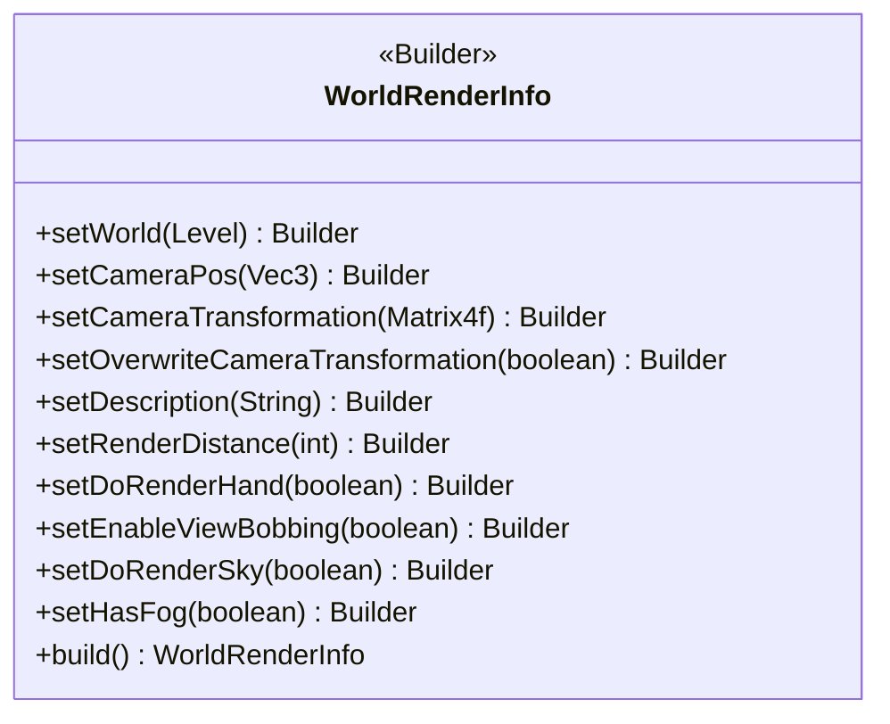
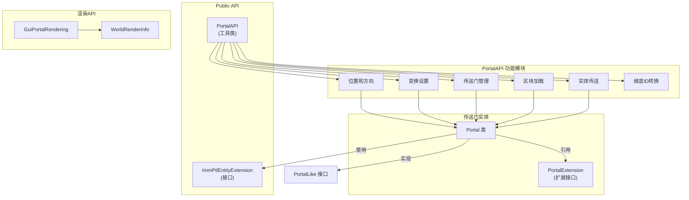

## Table of Contents

- [Overview](#overview)
- [PortalAPI Interface](#portalapi-interface)
- [ImmPtlEntityExtension Interface](#immtlentitityextension-interface)
- [Portal Creation API](#portal-creation-api)
- [Custom Portal Rendering API](#custom-portal-rendering-api)
- [Usage Example](#usage-example)

## Overview

ImmersivePortalsMod 提供了一套完整的公共 API，允许其他模组开发者在其基础上进行二次开发和扩展。这套 API 主要由两个核心接口组成：`PortalAPI` 和 `ImmPtlEntityExtension`。通过这些 API，开发者可以实现以下功能：

- 创建和管理传送门实体
- 自定义传送门的形状、方向和目标位置
- 控制实体的传送行为
- 实现自定义的 GUI 传送门渲染
- 管理区块加载和实体同步

本文档将深入分析这些 API 的设计理念、核心方法和实际使用方式。

## PortalAPI Interface

`PortalAPI` 是 ImmersivePortalsMod 最核心的工具类，提供了一系列静态方法用于传送门操作的各个方面。该类位于 `qouteall.imm_ptl.core.api` 包中，是其他模组与传送门系统交互的主要入口点。

### PortalAPI 的主要功能分类

#### 1. 传送门位置和方向设置

`PortalAPI` 提供了多种设置传送门位置和方向的方法，这些方法封装了底层的数学计算，对外提供了更友好的接口。

```java
32:46:assets/ImmersivePortalsMod-6.0.6-mc1.21.1/src/main/java/qouteall/imm_ptl/core/api/PortalAPI.java
public static void setPortalPositionOrientationAndSize(
    Portal portal,
    Vec3 position,
    DQuaternion orientation,
    double width, double height
) {
    portal.setOriginPos(position);
    portal.setOrientationAndSize(
        McHelper.getAxisWFromOrientation(orientation),
        McHelper.getAxisHFromOrientation(orientation),
        width, height
    );
}
```

这个方法使用四元数（`DQuaternion`）来设置传送门的方向，这在需要复杂旋转变换的场景下非常有用。四元数避免了欧拉角可能遇到的万向锁问题，可以平滑地表示任意三维旋转。

另一个便捷方法是 `setPortalOrthodoxShape`，它根据传统的 `Direction` 和 `AABB` 来设置传送门：

```java
48:61:assets/ImmersivePortalsMod-6.0.6-mc1.21.1/src/main/java/qouteall/imm_ptl/core/api/PortalAPI.java
public static void setPortalOrthodoxShape(Portal portal, Direction facing, AABB portalArea) {
    Tuple<Direction, Direction> directions = Helper.getPerpendicularDirections(facing);
    
    Vec3 areaSize = Helper.getBoxSize(portalArea);
    
    AABB boxSurface = Helper.getBoxSurface(portalArea, facing);
    Vec3 center = boxSurface.getCenter();
    portal.setPos(center.x, center.y, center.z);
    
    portal.setAxisW(Vec3.atLowerCornerOf(directions.getA().getNormal()));
    portal.setAxisH(Vec3.atLowerCornerOf(directions.getB().getNormal()));
    portal.setWidth(Helper.getCoordinate(areaSize, directions.getA().getAxis()));
    portal.setHeight(Helper.getCoordinate(areaSize, directions.getB().getAxis()));
}
```

这个方法会自动计算传送门的宽高和中心位置，开发者只需提供朝向和包围盒即可。

#### 2. 传送门变换设置

传送门的核心功能是空间变换，包括目标维度、目标位置、旋转变换和缩放。`setPortalTransformation` 方法一次性设置所有这些属性：

```java
63:74:assets/ImmersivePortalsMod-6.0.6-mc1.21.1/src/main/java/qouteall/imm_ptl/core/api/PortalAPI.java
public static void setPortalTransformation(
    Portal portal,
    ResourceKey<Level> destinationDimension,
    Vec3 destinationPosition,
    @Nullable DQuaternion rotation,
    double scale
) {
    portal.setDestinationDimension(destinationDimension);
    portal.setDestination(destinationPosition);
    portal.setRotation(rotation);
    portal.setScaleTransformation(scale);
}
```

这个方法中的参数含义如下：
- `destinationDimension`: 目标维度（世界）的资源键
- `destinationPosition`: 传送后的目标位置
- `rotation`: 旋转变换（四元数），可以为 null 表示无旋转
- `scale`: 缩放因子，1.0 表示正常大小

#### 3. 四元数方向操作

`PortalAPI` 提供了四元数与传送门轴向之间的转换方法：

```java
76:82:assets/ImmersivePortalsMod-6.0.6-mc1.21.1/src/main/java/qouteall/imm_ptl/core/api/PortalAPI.java
public static DQuaternion getPortalOrientationQuaternion(Portal portal) {
    return PortalManipulation.getPortalOrientationQuaternion(portal.getAxisW(), portal.getAxisH());
}

public static void setPortalOrientationQuaternion(Portal portal, DQuaternion quaternion) {
    PortalManipulation.setPortalOrientationQuaternion(portal, quaternion);
}
```

这些方法允许开发者使用四元数直接操作传送门的朝向，便于实现复杂的旋转动画。

#### 4. 传送门复制和镜像操作

`PortalAPI` 提供了创建传送门变体的便捷方法：

```java
92:106:assets/ImmersivePortalsMod-6.0.6-mc1.21.1/src/main/java/qouteall/imm_ptl/core/api/PortalAPI.java
public static <T extends Portal> T createReversePortal(T portal) {
    return (T) PortalManipulation.createReversePortal(
        portal, (EntityType<? extends Portal>) portal.getType()
    );
}

public static <T extends Portal> T createFlippedPortal(T portal) {
    return (T) PortalManipulation.createFlippedPortal(
        portal, (EntityType<? extends Portal>) portal.getType()
    );
}

public static <T extends Portal> T copyPortal(Portal portal, EntityType<T> entityType) {
    return (T) PortalManipulation.copyPortal(portal, (EntityType<Portal>) entityType);
}
```

- `createReversePortal`: 创建反向传送门，目标位置是原传送门的位置
- `createFlippedPortal`: 创建镜像传送门，保持相同的位置和目标
- `copyPortal`: 复制传送门，可以指定新的实体类型

#### 5. 全局传送门管理

全局传送门是一种特殊类型的传送门，它们不作为普通实体存在于世界中，而是被存储在专门的存储类中，全局加载且始终可见：

```java
108:120:assets/ImmersivePortalsMod-6.0.6-mc1.21.1/src/main/java/qouteall/imm_ptl/core/api/PortalAPI.java
public static void addGlobalPortal(
    ServerLevel world, Portal portal
) {
    McHelper.validateOnServerThread();
    GlobalPortalStorage.get(world).addPortal(portal);
}

public static void removeGlobalPortal(
    ServerLevel world, Portal portal
) {
    McHelper.validateOnServerThread();
    GlobalPortalStorage.get(world).removePortal(portal);
}
```

全局传送门适用于需要跨维度持续存在的传送点，如主世界到末地的固定入口。

#### 6. 区块加载管理

ImmersivePortalsMod 的核心功能之一是跨维度区块加载。`PortalAPI` 提供了细粒度的区块加载控制：

```java
122:144:assets/ImmersivePortalsMod-6.0.6-mc1.21.1/src/main/java/qouteall/imm_ptl/core/api/PortalAPI.java
public static void addChunkLoaderForPlayer(ServerPlayer player, ChunkLoader chunkLoader) {
    McHelper.validateOnServerThread();
    ImmPtlChunkTracking.addPerPlayerAdditionalChunkLoader(player, chunkLoader);
}

public static void removeChunkLoaderForPlayer(ServerPlayer player, ChunkLoader chunkLoader) {
    McHelper.validateOnServerThread();
    ImmPtlChunkTracking.removePerPlayerAdditionalChunkLoader(player, chunkLoader);
}

public static void addGlobalChunkLoader(MinecraftServer server, ChunkLoader chunkLoader) {
    ImmPtlChunkTracking.addGlobalAdditionalChunkLoader(server, chunkLoader);
}

public static void removeGlobalChunkLoader(MinecraftServer server, ChunkLoader chunkLoader) {
    ImmPtlChunkTracking.removeGlobalAdditionalChunkLoader(server, chunkLoader);
}
```

区块加载器有玩家级别和全局级别两种：
- 玩家级别：只影响特定玩家加载区块
- 全局级别：影响服务器上所有玩家

#### 7. 实体传送

`teleportEntity` 方法允许开发者程序化地传送实体，无需穿过传送门：

```java
147:152:assets/ImmersivePortalsMod-6.0.6-mc1.21.1/src/main/java/qouteall/imm_ptl/core/api/PortalAPI.java
public static Entity teleportEntity(Entity entity, ServerLevel targetWorld, Vec3 targetPos) {
    return ServerTeleportationManager.teleportEntityGeneral(entity, targetPos, targetWorld);
}
```

这个方法会跳过加载屏幕，直接传送实体。返回值是传送后的新实体（对于玩家来说还是同一个对象）。

#### 8. 维度 ID 转换

在网络通信中，维度通常被编码为整数 ID。`PortalAPI` 提供了双向转换方法：

```java
160:178:assets/ImmersivePortalsMod-6.0.6-mc1.21.1/src/main/java/qouteall/imm_ptl/core/api/PortalAPI.java
@Environment(EnvType.CLIENT)
public static int clientDimKeyToInt(ResourceKey<Level> dimension) {
    return DimensionIntId.getClientMap().toIntegerId(dimension);
}

@Environment(EnvType.CLIENT)
public static ResourceKey<Level> clientIntToDimKey(int integerId) {
    return DimensionIntId.getClientMap().fromIntegerId(integerId);
}

public static int serverDimKeyToInt(MinecraftServer server, ResourceKey<Level> dimension) {
    return DimensionIntId.getServerMap(server).toIntegerId(dimension);
}

public static ResourceKey<Level> serverIntToDimKey(MinecraftServer server, int integerId) {
    return DimensionIntId.getServerMap(server).fromIntegerId(integerId);
}
```

这些方法区分了客户端和服务器端，因为它们各自维护独立的维度 ID 映射表。

## ImmPtlEntityExtension Interface

`ImmPtlEntityExtension` 是一个简单但功能强大的接口，允许其他模组控制实体的传送行为。这个接口的设计遵循了 Minecraft 模组开发的最佳实践，使用 `Entity` 作为参数类型而不是 `Portal`，这样其他模组可以在不依赖 ImmersivePortalsMod 的情况下实现自己的传送逻辑。

```java
1:16:assets/ImmersivePortalsMod-6.0.6-mc1.21.1/src/main/java/qouteall/imm_ptl/core/api/ImmPtlEntityExtension.java
package qouteall.imm_ptl.core.api;

import net.minecraft.world.entity.Entity;

public interface ImmPtlEntityExtension {
    
    /**
     * Other mods should be able to overreide this without depending on ImmPtl.
     * @param portal the portal entity.
     *               use type Entity to make other mods to be able to override this without depending on ImmPtl.
     * @return whether the entity can teleport through the ImmPtl portal.
     */
    default boolean imm_ptl_canTeleportThroughPortal(Entity portal) {
        return true;
    }
}
```

### 核心方法

`imm_ptl_canTeleportThroughPortal(Entity portal)` 方法判断实体是否可以通过指定的传送门。该方法返回 `true` 表示允许传送，`false` 表示阻止传送。

默认实现返回 `true`，意味着任何实体默认都可以通过传送门。

### 使用方式

要使用这个接口，其他模组需要：

1. 让实体类实现 `ImmPtlEntityExtension` 接口
2. 可选地重写 `imm_ptl_canTeleportThroughPortal` 方法实现自定义逻辑

```java
// 示例：创建自定义实体，限制只能通过特定传送门传送
public class CustomEntity extends Entity implements ImmPtlEntityExtension {
    
    private String allowedPortalTag;
    
    @Override
    public boolean imm_ptl_canTeleportThroughPortal(Entity portal) {
        if (portal instanceof Portal ipPortal) {
            String tag = ipPortal.portalTag;
            return tag != null && tag.equals(allowedPortalTag);
        }
        return false;
    }
}
```

### 在 Portal 类中的调用

在 `Portal` 类的 `canTeleportEntity` 方法中，会调用此接口：

```java
697:726:assets/ImmersivePortalsMod-6.0.6-mc1.21.1/src/main/java/qouteall/imm_ptl/core/portal/Portal.java
public boolean canTeleportEntity(Entity entity) {
    if (!teleportable) {
        return false;
    }
    if (entity instanceof Portal) {
        return false;
    }
    if (entity instanceof Player) {
        if (specificPlayerId != null) {
            if (!entity.getUUID().equals(specificPlayerId)) {
                return false;
            }
        }
    }
    else {
        if (specificPlayerId != null) {
            if (!specificPlayerId.equals(Util.NIL_UUID)) {
                return false;
            }
        }
    }
    
    if (!O_O.allowTeleportingEntity(entity, this)) {
        return false;
    }
    
    return ((ImmPtlEntityExtension) entity).imm_ptl_canTeleportThroughPortal(this);
}
```

这个设计允许实体完全控制自己的传送行为，同时保持了与传送门系统的解耦。

## Portal Creation API

创建传送门涉及多个步骤，包括实体创建、属性设置和状态同步。ImmersivePortalsMod 提供了一个标准的创建流程。

### Portal 实体类型

`Portal` 类提供了创建传送门实体类型的工厂方法：

```java
87:108:assets/ImmersivePortalsMod-6.0.6-mc1.21.1/src/main/java/qouteall/imm_ptl/core/portal/Portal.java
public static final EntityType<Portal> ENTITY_TYPE = createPortalEntityType(Portal::new);

public static <T extends Portal> EntityType<T> createPortalEntityType(
    EntityType.EntityFactory<T> constructor
) {
    return FabricEntityTypeBuilder.create(
            MobCategory.MISC,
            constructor
        ).dimensions(
            // eye height should be 0
            EntityDimensions.fixed(0, 0)
        ).fireImmune()
        .trackRangeBlocks(96)
        .trackedUpdateRate(20)
        .forceTrackedVelocityUpdates(true)
        .build();
}
```

这个工厂方法使用 Fabric 的 `EntityTypeBuilder` 创建传送门实体类型，关键配置包括：
- `trackRangeBlocks(96)`: 追踪范围为 96 格
- `trackedUpdateRate(20)`: 每 20 tick（约 1 秒）同步一次数据

### 传送门状态同步

传送门修改后需要同步到客户端。使用 `reloadAndSyncToClient` 方法：

```java
519:529:assets/ImmersivePortalsMod-6.0.6-mc1.21.1/src/main/java/qouteall/imm_ptl/core/portal/Portal.java
public void reloadAndSyncToClient() {
    reloadAndSyncNextTick = false;
    
    Validate.isTrue(!isGlobalPortal, "global portal is not synced by this");
    Validate.isTrue(!level().isClientSide(), "must be used on server side");
    updateCache();
    
    var packet = createSyncPacket();
    
    McHelper.sendToTrackers(this, packet);
}
```

对于更复杂的场景，可以使用延迟同步或集群同步：

```java
531:546:assets/ImmersivePortalsMod-6.0.6-mc1.21.1/src/main/java/qouteall/imm_ptl/core/portal/Portal.java
public void reloadAndSyncToClientNextTick() {
    Validate.isTrue(!level().isClientSide(), "must be used on server side");
    reloadAndSyncNextTick = true;
}

public void reloadAndSyncClusterToClientNextTick() {
    PortalExtension.forClusterPortals(this, Portal::reloadAndSyncToClientNextTick);
}

public void reloadAndSyncToClientWithTickDelay(int tickDelay) {
    Validate.isTrue(!level().isClientSide(), "must be used on server side");
    ServerTaskList.of(getServer()).addTask(MyTaskList.withDelay(tickDelay, () -> {
        reloadAndSyncToClientNextTick();
        return true;
    }));
}
```

### 传送门生命周期事件

`Portal` 类定义了多个事件信号，允许其他模组在特定时刻执行自定义逻辑：

```java
208:219:assets/ImmersivePortalsMod-6.0.6-mc1.21.1/src/main/java/qouteall/imm_ptl/core/portal/Portal.java
public static final Event<Consumer<Portal>> CLIENT_PORTAL_TICK_SIGNAL =
    Helper.createConsumerEvent();
public static final Event<Consumer<Portal>> SERVER_PORTAL_TICK_SIGNAL =
    Helper.createConsumerEvent();

public static final Event<Consumer<Portal>> PORTAL_DISPOSE_SIGNAL =
    Helper.createConsumerEvent();

public static final Event<BiConsumer<Portal, CompoundTag>> READ_PORTAL_DATA_SIGNAL =
    Helper.createBiConsumerEvent();
public static final Event<BiConsumer<Portal, CompoundTag>> WRITE_PORTAL_DATA_SIGNAL =
    Helper.createBiConsumerEvent();
```

这些事件包括：
- `CLIENT_PORTAL_TICK_SIGNAL`: 客户端每 tick 触发
- `SERVER_PORTAL_TICK_SIGNAL`: 服务器端每 tick 触发
- `PORTAL_DISPOSE_SIGNAL`: 传送门被移除时触发
- `READ_PORTAL_DATA_SIGNAL`: 读取 NBT 数据时触发
- `WRITE_PORTAL_DATA_SIGNAL`: 写入 NBT 数据时触发

### 传送门验证

`isPortalValid` 方法检查传送门是否有效，无效的传送门会被自动移除：

```java
990:1021:assets/ImmersivePortalsMod-6.0.6-mc1.21.1/src/main/java/qouteall/imm_ptl/core/portal/Portal.java
public boolean isPortalValid() {
    boolean valid = dimensionTo != null &&
        width != 0 &&
        height != 0 &&
        axisW != null &&
        axisH != null &&
        getDestPos() != null &&
        axisW.lengthSqr() > 0.9 &&
        axisH.lengthSqr() > 0.9 &&
        getY() > (McHelper.getMinY(level()) - 100);
    if (valid) {
        if (level() instanceof ServerLevel serverLevel) {
            ServerLevel destWorld = serverLevel.getServer().getLevel(dimensionTo);
            if (destWorld == null) {
                LOGGER.error("Portal Dest Dimension Missing {}", dimensionTo.location());
                return false;
            }
            boolean inWorldBorder = destWorld.getWorldBorder().isWithinBounds(BlockPos.containing(getDestPos()));
            if (!inWorldBorder) {
                LOGGER.error("Destination out of World Border {}", this);
                return false;
            }
        }
        
        if (level().isClientSide()) {
            return isPortalValidClient();
        }
        
        return true;
    }
    return false;
}
```

验证内容包括：
- 目标维度存在
- 宽高大于零
- 轴向向量有效
- 目标位置有效
- 位置在有效范围内
- 目标位置在世界边界内

## Custom Portal Rendering API

ImmersivePortalsMod 提供了 GUI 传送门渲染 API，允许在屏幕上创建一个"传送门视图"，显示其他维度的内容。`ExampleGuiPortalRendering` 类是一个完整的示例，展示了如何使用这些 API。

### GUI 传送门渲染流程

```java
56:101:assets/ImmersivePortalsMod-6.0.6-mc1.21.1/src/main/java/qouteall/imm_ptl/core/api/example/ExampleGuiPortalRendering.java
public class ExampleGuiPortalRendering {
    
    private static RenderTarget frameBuffer;
    private static final WeakHashMap<ServerPlayer, ChunkLoader>
        chunkLoaderMap = new WeakHashMap<>();
    
    public static void onCommandExecuted(ServerPlayer player, ServerLevel world, Vec3 pos) {
        removeChunkLoaderFor(player);
        
        ChunkLoader chunkLoader = new ChunkLoader(
            new DimensionalChunkPos(
                world.dimension(), new ChunkPos(BlockPos.containing(pos))
            ),
            8
        );
        
        PortalAPI.addChunkLoaderForPlayer(player, chunkLoader);
        chunkLoaderMap.put(player, chunkLoader);
        
        McRemoteProcedureCall.tellClientToInvoke(
            player,
            "qouteall.imm_ptl.core.api.example.ExampleGuiPortalRendering.RemoteCallables.clientActivateExampleGuiPortal",
            world.dimension(),
            pos
        );
    }
```

这个流程包括：
1. 创建区块加载器，确保目标位置的区块被加载
2. 将区块加载器添加到玩家
3. 使用远程过程调用（RPC）通知客户端打开 GUI 传送门

### 客户端渲染

`GuiPortalScreen` 类实现了自定义的屏幕渲染：

```java
124:220:assets/ImmersivePortalsMod-6.0.6-mc1.21.1/src/main/java/qouteall/imm_ptl/core/api/example/ExampleGuiPortalRendering.java
@Environment(EnvType.CLIENT)
public static class GuiPortalScreen extends Screen {
    
    private final ResourceKey<Level> viewingDimension;
    private final Vec3 viewingPosition;
    
    public GuiPortalScreen(ResourceKey<Level> viewingDimension, Vec3 viewingPosition) {
        super(Component.literal("GUI Portal Example"));
        this.viewingDimension = viewingDimension;
        this.viewingPosition = viewingPosition;
    }
    
    @Override
    public void render(GuiGraphics guiGraphics, int mouseX, int mouseY, float delta) {
        super.render(guiGraphics, mouseX, mouseY, delta);
        
        double t1 = CHelper.getSmoothCycles(503);
        double t2 = CHelper.getSmoothCycles(197);
        
        Matrix4f cameraTransformation = new Matrix4f();
        cameraTransformation.identity();
        cameraTransformation.mul(
            DQuaternion.rotationByDegrees(
                new Vec3(1, 1, 1).normalize(),
                t1 * 360
            ).toMatrix()
        );
        
        Vec3 cameraPosition = this.viewingPosition.add(
            new Vec3(Math.cos(t2 * 2 * Math.PI), 0, Math.sin(t2 * 2 * Math.PI)).scale(30)
        );
        
        WorldRenderInfo worldRenderInfo = new WorldRenderInfo.Builder()
            .setWorld(ClientWorldLoader.getWorld(viewingDimension))
            .setCameraPos(cameraPosition)
            .setCameraTransformation(cameraTransformation)
            .setOverwriteCameraTransformation(true)
            .setDescription(null)
            .setRenderDistance(minecraft.options.getEffectiveRenderDistance())
            .setDoRenderHand(false)
            .setEnableViewBobbing(false)
            .setDoRenderSky(false)
            .setHasFog(false)
            .build();
        
        GuiPortalRendering.submitNextFrameRendering(worldRenderInfo, frameBuffer);
        
        int h = minecraft.getWindow().getHeight();
        int w = minecraft.getWindow().getWidth();
        MyRenderHelper.drawFramebufferWithBounds(
            frameBuffer,
            true, false,
            (int) (w * 0.2f), (int) (w * 0.8f),
            (int) (h * 0.2f), (int) (h * 0.8f)
        );
    }
```

关键组件说明：

1. **WorldRenderInfo.Builder**: 构建世界渲染信息
   - `setWorld`: 设置要渲染的世界
   - `setCameraPos`: 设置相机位置
   - `setCameraTransformation`: 设置相机变换矩阵
   - `setOverwriteCameraTransformation`: 是否覆盖现有变换
   - `setRenderDistance`: 渲染距离
   - `setDoRenderHand/setEnableViewBobbing`: 控制手部渲染和视角晃动
   - `setDoRenderSky/setHasFog`: 控制天空和雾效

2. **GuiPortalRendering.submitNextFrameRendering**: 提交下一帧的渲染任务

3. **MyRenderHelper.drawFramebufferWithBounds**: 将帧缓冲区绘制到屏幕指定区域

### 世界渲染信息

`WorldRenderInfo` 是一个复杂的构建器模式类，它定义了世界渲染的所有参数：



## Usage Example

下面是一个完整的示例，展示如何创建一个从主世界到末地的自定义传送门：

### 服务器端代码

```java
public class CustomPortalManager {
    
    public static Portal createEndPortal(ServerLevel overworld, Vec3 position) {
        // 创建传送门实体
        Portal portal = new Portal(Portal.ENTITY_TYPE, overworld);
        
        // 设置位置和大小
        portal.setOriginPos(position);
        portal.setWidth(4.0);
        portal.setHeight(5.0);
        
        // 设置朝向（朝向北）
        portal.setAxisW(new Vec3(0, 0, 1));
        portal.setAxisH(new Vec3(0, 1, 0));
        
        // 设置目标
        ServerLevel endWorld = overworld.getServer().getLevel(ResourceKey.create(
            Level_REGISTRY, new ResourceLocation("minecraft:the_end")
        ));
        
        if (endWorld != null) {
            portal.setDestinationDimension(endWorld.dimension());
            portal.setDestination(new Vec3(0, 65, 0));
        }
        
        // 设置额外属性
        portal.setTeleportable(true);
        portal.setIsVisible(true);
        portal.setInteractable(true);
        portal.setTeleportChangesGravity(false);
        
        // 生成传送门
        overworld.addFreshEntity(portal);
        
        // 创建反向传送门
        Portal reversePortal = PortalAPI.createReversePortal(portal);
        endWorld.addFreshEntity(reversePortal);
        
        return portal;
    }
    
    public static void createScalePortal(ServerLevel world, Vec3 position, double scale) {
        Portal portal = new Portal(Portal.ENTITY_TYPE, world);
        
        // 使用便捷方法设置
        DQuaternion orientation = DQuaternion.rotationByDegrees(new Vec3(0, 1, 0), 0);
        PortalAPI.setPortalPositionOrientationAndSize(portal, position, orientation, 3.0, 3.0);
        
        // 设置变换（缩放）
        ResourceKey<Level> targetDim = ResourceKey.create(
            Level_REGISTRY, new ResourceLocation("minecraft:the_end")
        );
        Vec3 targetPos = new Vec3(100, 65, 100);
        
        PortalAPI.setPortalTransformation(portal, targetDim, targetPos, null, scale);
        
        world.addFreshEntity(portal);
        portal.reloadAndSyncToClient();
    }
}
```

### 实体传送限制示例

```java
public class RestrictedEntity extends Entity implements ImmPtlEntityExtension {
    
    private final Set<String> allowedTags = new HashSet<>();
    
    public RestrictedEntity(EntityType<?> type, Level world) {
        super(type, world);
    }
    
    @Override
    public boolean imm_ptl_canTeleportThroughPortal(Entity portal) {
        if (portal instanceof Portal ipPortal) {
            String tag = ipPortal.portalTag;
            // 只有带有特定标签的传送门才能传送此实体
            return allowedTags.contains(tag);
        }
        return false;
    }
    
    public void addAllowedTag(String tag) {
        allowedTags.add(tag);
    }
}
```

### 客户端 GUI 传送门示例

```java
public class MyGuiPortalManager {
    
    public static void openDimensionPreview(ServerPlayer player, ResourceKey<Level> dim, Vec3 pos) {
        // 创建区块加载器
        ChunkLoader loader = new ChunkLoader(
            new DimensionalChunkPos(dim, new ChunkPos(BlockPos.containing(pos))),
            4
        );
        
        // 添加到玩家
        PortalAPI.addChunkLoaderForPlayer(player, loader);
        
        // 通知客户端打开GUI
        McRemoteProcedureCall.tellClientToInvoke(
            player,
            "com.example.mod.MyGuiPortal.openGui",
            dim, pos
        );
    }
}

@Environment(EnvType.CLIENT)
class MyGuiPortal {
    
    private static RenderTarget frameBuffer;
    
    public static void openGui(ResourceKey<Level> dim, Vec3 pos) {
        Minecraft mc = Minecraft.getInstance();
        mc.setScreen(new MyPortalScreen(dim, pos));
    }
    
    public static class MyPortalScreen extends Screen {
        private final ResourceKey<Level> dim;
        private final Vec3 pos;
        private RenderTarget fb;
        
        public MyPortalScreen(ResourceKey<Level> dim, Vec3 pos) {
            super(Component.literal("Dimension Preview"));
            this.dim = dim;
            this.pos = pos;
        }
        
        @Override
        public void render(GuiGraphics graphics, int mx, int my, float delta) {
            if (fb == null) {
                fb = new TextureTarget(2, 2, true, true);
            }
            
            // 相机围绕目标点旋转
            double angle = System.currentTimeMillis() / 1000.0;
            Vec3 cameraPos = pos.add(
                Math.cos(angle) * 10, 5, Math.sin(angle) * 10
            );
            
            WorldRenderInfo info = WorldRenderInfo.builder()
                .setWorld(ClientWorldLoader.getWorld(dim))
                .setCameraPos(cameraPos)
                .setCameraTransformation(new Matrix4f().identity())
                .setOverwriteCameraTransformation(true)
                .setRenderDistance(mc.options.getEffectiveRenderDistance())
                .setDoRenderHand(false)
                .setEnableViewBobbing(false)
                .setDoRenderSky(true)
                .setHasFog(true)
                .build();
            
            GuiPortalRendering.submitNextFrameRendering(info, fb);
            
            // 绘制到屏幕
            MyRenderHelper.drawFramebufferWithBounds(
                fb, true, false,
                0, width, 0, height
            );
            
            super.render(graphics, mx, my, delta);
        }
        
        @Override
        public boolean isPauseScreen() { return false; }
        
        @Override
        public void onClose() {
            // 通知服务器移除区块加载器
            McRemoteProcedureCall.tellServerToInvoke(
                "com.example.mod.MyGuiPortal.removeLoader"
            );
            super.onClose();
        }
    }
}
```

## API 结构总览



## 最佳实践

### 1. 传送门修改后的同步

修改传送门后必须调用 `reloadAndSyncToClient()` 同步到客户端：

```java
portal.setDestination(newPosition);
portal.reloadAndSyncToClient();
```

### 2. 服务器线程验证

许多 `PortalAPI` 方法需要在服务器线程执行，使用 `McHelper.validateOnServerThread()` 验证：

```java
public void createPortal() {
    McHelper.validateOnServerThread();
    // 传送门操作...
}
```

### 3. 传送门验证

创建传送门后检查其有效性，无效的传送门会被自动移除：

```java
if (!portal.isPortalValid()) {
    portal.remove(RemovalReason.KILLED);
    return null;
}
```

### 4. 区块加载器清理

使用 `WeakHashMap` 存储区块加载器引用，在玩家离开时自动清理：

```java
private static final WeakHashMap<ServerPlayer, ChunkLoader> loaders = new WeakHashMap<>();
```

### 5. 依赖解耦

使用 `ImmPtlEntityExtension` 接口时不直接依赖 ImmersivePortalsMod，保持模组独立性。

---

**参考源码文件：**

- `PortalAPI.java` - `assets/ImmersivePortalsMod-6.0.6-mc1.21.1/src/main/java/qouteall/imm_ptl/core/api/PortalAPI.java`
- `ImmPtlEntityExtension.java` - `assets/ImmersivePortalsMod-6.0.6-mc1.21.1/src/main/java/qouteall/imm_ptl/core/api/ImmPtlEntityExtension.java`
- `ExampleGuiPortalRendering.java` - `assets/ImmersivePortalsMod-6.0.6-mc1.21.1/src/main/java/qouteall/imm_ptl/core/api/example/ExampleGuiPortalRendering.java`
- `Portal.java` - `assets/ImmersivePortalsMod-6.0.6-mc1.21.1/src/main/java/qouteall/imm_ptl/core/portal/Portal.java`
