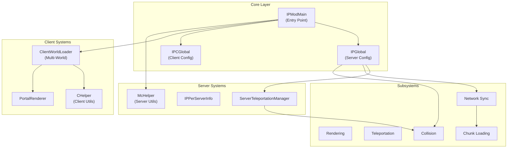
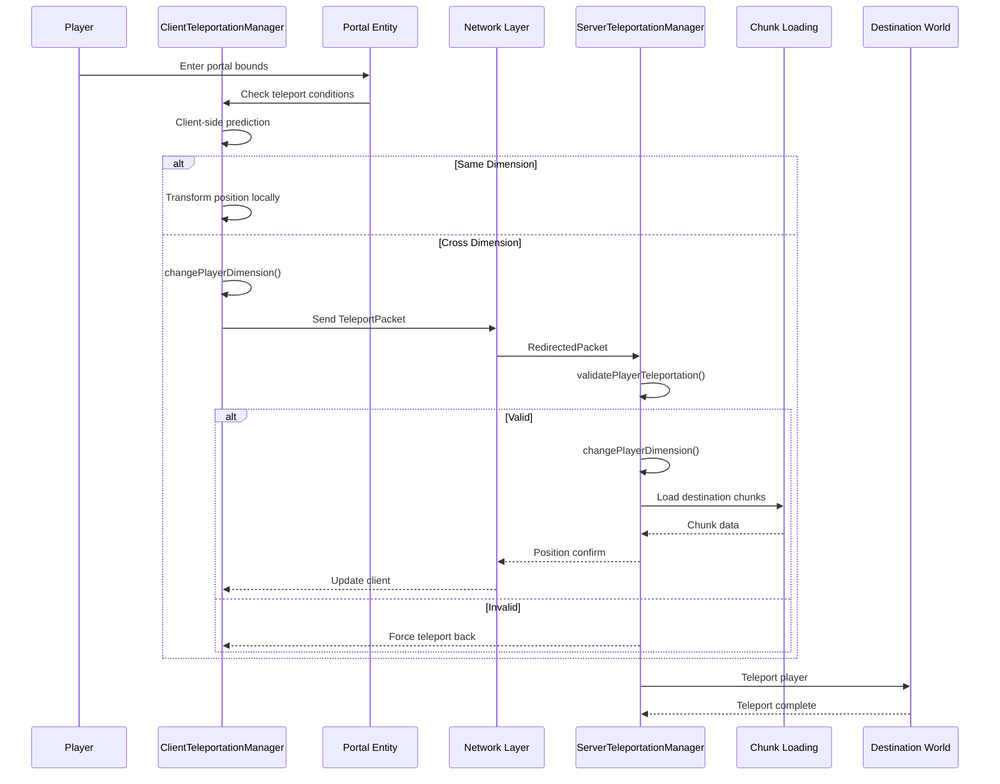
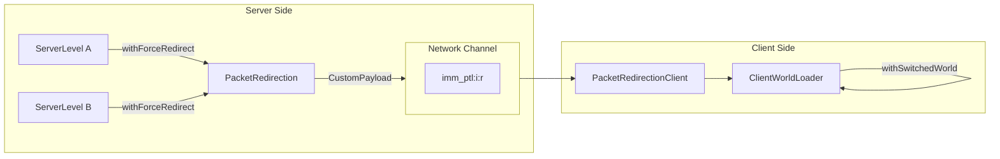
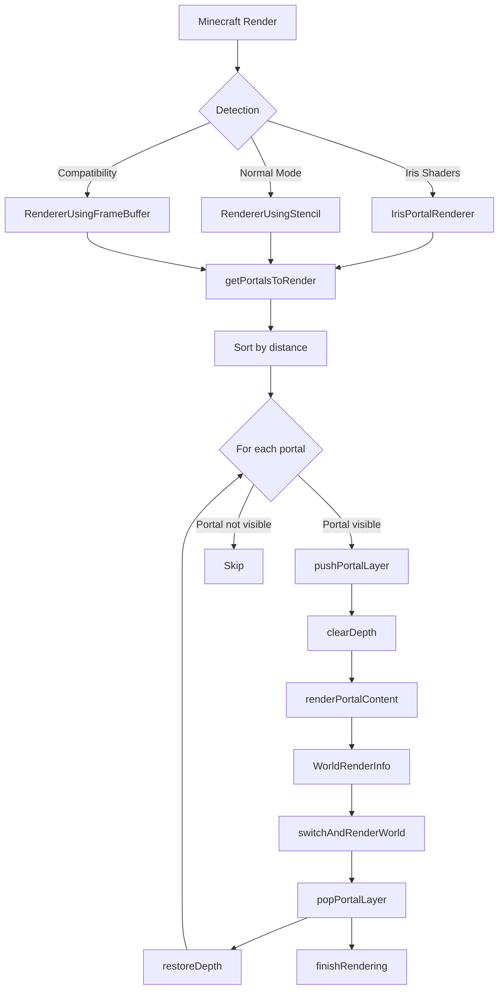

# ImmersivePortalsMod Architecture Summary

```yaml
---
title: Architecture Summary
readingTime: 20
---
```

## Table of Contents

- [Overview](#overview)
- [Architecture Overview](#architecture-overview)
- [Subsystem Summary](#subsystem-summary)
- [Key Design Patterns](#key-design-patterns)
- [Data Flow Architecture](#data-flow-architecture)
- [Extension Points](#extension-points)
- [Technology Stack](#technology-stack)
- [References](#references)

---

## Overview

ImmersivePortalsMod (IPCM) is a sophisticated Minecraft mod that enables seamless cross-dimensional portal experiences. Unlike vanilla portals that display loading screens during dimension transitions, this mod renders portal destinations in real-time and supports complex portal hierarchies (nested portals).

The mod consists of approximately **375+ Java files** organized into multiple subsystems, following a **client-server separation** pattern with shared core logic. It heavily leverages Fabric's event system and Mixin for bytecode injection.

**Core Features:**
- Seamless dimension transitions without loading screens
- Multi-layer nested portal rendering
- Cross-portal collision detection
- Multi-world client-side rendering
- Compatibility with Sodium, Iris, and Flywheel

---

## Architecture Overview

### System Architecture Diagram



### Package Structure

```
qouteall/imm_ptl/core/
├── IPModMain.java              # Main entry point
├── IPGlobal.java               # Server-side global state
├── IPCGlobal.java              # Client-side global state
├── McHelper.java               # Minecraft server utilities
├── CHelper.java                # Minecraft client utilities
├── IPMcHelper.java             # Cross-side portal utilities
├── ClientWorldLoader.java      # Multi-world management
├── IPPerServerInfo.java        # Per-server state storage
│
├── portal/                     # Portal entity definitions
├── teleportation/              # Teleport mechanics
├── render/                     # Rendering pipeline
├── network/                   # Packet handling
├── chunk_loading/              # Chunk management
├── collision/                  # Portal collision
├── compat/                     # Third-party mod compatibility
├── mixin/                      # Bytecode injection
│   ├── common/                 # Shared mixins
│   └── client/                 # Client-side mixins
└── api/                        # Public API
```

---

## Subsystem Summary

| Subsystem | Description | Key Classes | Document |
|-----------|-------------|-------------|----------|
| **Core Architecture** | Entry point, configuration, helper classes | `IPModMain`, `IPGlobal`, `IPCGlobal`, `McHelper`, `CHelper` | [01-core-architecture.md](01-core-architecture.md) |
| **Portal Entity** | Portal entity system with transformation math | `Portal`, `Mirror`, `PortalLike`, `GlobalPortalStorage` | [02-portal-entity.md](02-portal-entity.md) |
| **Teleportation** | Cross-dimension teleportation management | `ServerTeleportationManager`, `ClientTeleportationManager`, `PortalCollisionHandler` | [03-teleportation-system.md](03-teleportation-system.md) |
| **Rendering** | Cross-portal rendering with stencil/framebuffer | `PortalRenderer`, `RendererUsingStencil`, `PortalRendering` | [04-rendering-system.md](04-rendering-system.md) |
| **Network Sync** | Multi-dimension packet redirection | `PacketRedirection`, `ImmPtlNetworking`, `EntitySync` | [05-network-sync.md](05-network-sync.md) |
| **Compatibility** | Sodium, Iris, Flywheel integration | `SodiumInterface`, `IrisInterface`, `IPCompatMixinPlugin` | [06-compatibility.md](06-compatibility.md) |
| **Mixin System** | Bytecode injection architecture | `IPMixinPlugin`, Duck interfaces, 140+ Mixin classes | [07-mixin-system.md](07-mixin-system.md) |
| **Public API** | Extension interfaces for mod developers | `PortalAPI`, `ImmPtlEntityExtension` | [08-public-api.md](08-public-api.md) |

### Core Classes Responsibility Matrix

| Class | Responsibility | Side |
|-------|---------------|------|
| `IPModMain` | Mod initialization, registry | Common |
| `IPGlobal` | Configuration, server events | Server |
| `IPCGlobal` | Client renderer, client events | Client |
| `McHelper` | Server-side Minecraft utilities | Server |
| `CHelper` | Client-side Minecraft utilities | Client |
| `IPMcHelper` | Portal-aware operations | Common |
| `ClientWorldLoader` | Multi-world simulation | Client |
| `IPPerServerInfo` | Per-server-instance state | Server |

---

## Key Design Patterns

### 1. Singleton Global State Pattern

Both `IPGlobal` and `IPCGlobal` use static fields as lightweight singletons:

```java
IPGlobal.maxPortalLayer = 5;
IPCGlobal.rendererUsingStencil = new RendererUsingStencil();
```

### 2. Context Switching Pattern

Used extensively for multi-world operations on the client:

```java
T withSwitchedContext(Level world, Supplier<T> func) {
    ClientLevel original = CLIENT.level;
    try {
        CLIENT.level = (ClientLevel) world;
        return func.get();
    }
    finally {
        CLIENT.level = original;
    }
}
```

### 3. Event-Driven Task Processing

Tasks are queued and processed during specific game phases:

```java
ServerTaskList.of(server).addTask(() -> {
    if (condition) return true;
    return false;
});
```

### 4. Duck Typing via Mixin Interfaces

Custom interfaces expose internal Minecraft state:

```java
public interface IEWorld {
    LevelEntityGetter<Entity> portal_getEntityLookup();
}
```

### 5. Strategy + Null Object Pattern

Used extensively in the compatibility system:

```java
public static Invoker invoker = new Invoker();  // Default empty implementation

public static class OnSodiumPresent extends Invoker {
    // Full implementation when Sodium is present
}
```

### 6. Builder Pattern for World Rendering

`WorldRenderInfo` uses a builder pattern for complex rendering configuration:

```java
WorldRenderInfo worldRenderInfo = new WorldRenderInfo.Builder()
    .setWorld(ClientWorldLoader.getWorld(dimension))
    .setCameraPos(cameraPosition)
    .setCameraTransformation(matrix)
    .setOverwriteCameraTransformation(false)
    .build();
```

### 7. ThreadLocal Context Storage

Used for dimension-aware packet redirection:

```java
private static final ThreadLocal<ResourceKey<Level>> serverPacketRedirection =
    ThreadLocal.withInitial(() -> null);
```

### 8. Per-Server State Storage

`IPPerServerInfo` provides per-server-instance state without static pollution:

```java
public static IPPerServerInfo of(MinecraftServer server) {
    return ((IEMinecraftServer) server).ip_getPerServerInfo();
}
```

---

## Data Flow Architecture

### Teleportation Data Flow



### Multi-Dimension Network Flow



### Rendering Pipeline Flow



---

## Extension Points

### Public API Usage

ImmersivePortalsMod provides two main extension interfaces:

#### PortalAPI - Static Utility Methods

```java
// Create and configure a portal
Portal portal = new Portal(Portal.ENTITY_TYPE, world);
PortalAPI.setPortalPositionOrientationAndSize(portal, position, orientation, width, height);
PortalAPI.setPortalTransformation(portal, destDim, destPos, rotation, scale);
world.addFreshEntity(portal);
portal.reloadAndSyncToClient();

// Add chunk loaders
PortalAPI.addChunkLoaderForPlayer(player, chunkLoader);

// Teleport entities
PortalAPI.teleportEntity(entity, targetWorld, targetPos);
```

#### ImmPtlEntityExtension - Entity Behavior Control

```java
public class CustomEntity extends Entity implements ImmPtlEntityExtension {
    @Override
    public boolean imm_ptl_canTeleportThroughPortal(Entity portal) {
        // Custom logic to control teleport behavior
        return checkCustomCondition(portal);
    }
}
```

### Portal Events

```java
// Listen to portal lifecycle events
Portal.CLIENT_PORTAL_TICK_SIGNAL.register(portal -> { /* ... */ });
Portal.SERVER_PORTAL_TICK_SIGNAL.register(portal -> { /* ... */ });
Portal.PORTAL_DISPOSE_SIGNAL.register(portal -> { /* ... */ });
```

### Custom Portal Rendering

```java
WorldRenderInfo info = new WorldRenderInfo.Builder()
    .setWorld(ClientWorldLoader.getWorld(dimension))
    .setCameraPos(cameraPosition)
    .setCameraTransformation(matrix)
    .setOverwriteCameraTransformation(true)
    .setRenderDistance(renderDistance)
    .build();

GuiPortalRendering.submitNextFrameRendering(info, frameBuffer);
```

---

## Technology Stack

### Core Technologies

| Technology | Purpose | Version |
|------------|---------|---------|
| **Minecraft** | Game framework | 1.21.1 |
| **Fabric Loader** | Mod loading | Latest |
| **Fabric API** | Minecraft API wrappers | Latest |
| **Mixin** | Bytecode injection | 0.8+ |
| **Cloth Config** | Configuration GUI | Latest |

### Rendering Technologies

| Technology | Purpose |
|------------|---------|
| **OpenGL Stencil Buffer** | Portal area masking |
| **FrameBuffer Objects** | Secondary rendering targets |
| **Occlusion Queries** | Visibility prediction |
| **Custom Shaders** | Portal area rendering |

### Compatibility Stack

| Mod | Integration Type |
|-----|-----------------|
| **Sodium** | Render context switching, frustum culling override |
| **Iris** | Shader pipeline integration, deferred framebuffer |
| **Flywheel** | GPU instancing for portal geometry |
| **Cardinal Components** | Entity component system |

### Key Libraries

| Library | Purpose |
|---------|---------|
| **FastUtil** | High-performance collections |
| **Gson** | JSON serialization |
| **JOML** | Matrix/vector math |

---

## References

### Source Code Location

```
D:\Minecraft-Learning\assets\ImmersivePortalsMod-6.0.6-mc1.21.1\src\main\java\qouteall\imm_ptl\core\
```

### Analysis Documents

| Document | Description |
|----------|-------------|
| [01-core-architecture.md](01-core-architecture.md) | Core architecture, entry point, configuration, helpers |
| [02-portal-entity.md](02-portal-entity.md) | Portal entity system, transformation mathematics, mirror system |
| [03-teleportation-system.md](03-teleportation-system.md) | Teleportation management, collision detection |
| [04-rendering-system.md](04-rendering-system.md) | Cross-portal rendering, stencil/framebuffer renderers |
| [05-network-sync.md](05-network-sync.md) | Multi-dimension packet redirection, chunk loading |
| [06-compatibility.md](06-compatibility.md) | Sodium, Iris, Flywheel integration |
| [07-mixin-system.md](07-mixin-system.md) | 140+ Mixin classes, duck interfaces |
| [08-public-api.md](08-public-api.md) | Extension interfaces, usage examples |

### Key Source Files

| File | Purpose |
|------|---------|
| `IPModMain.java` | Main mod entry point |
| `Portal.java` | Core portal entity |
| `ServerTeleportationManager.java` | Server-side teleportation |
| `ClientTeleportationManager.java` | Client-side prediction |
| `RendererUsingStencil.java` | Primary portal renderer |
| `PacketRedirection.java` | Network packet redirection |
| `ClientWorldLoader.java` | Multi-world management |
| `PortalAPI.java` | Public extension API |

---

## Summary

ImmersivePortalsMod demonstrates sophisticated Minecraft modding architecture with:

- **Client-Server Separation**: Clean separation between client prediction and server validation
- **Mixin-Based Injection**: 140+ Mixin classes for deep core modifications
- **Multi-World Rendering**: Client can maintain and render multiple dimensions simultaneously
- **Advanced Rendering**: Stencil-based portal masking with nested layer support
- **Smart Compatibility**: Modular support for Sodium, Iris, and Flywheel
- **Clean Public API**: Well-designed extension points for mod developers

The architecture enables seamless portal experiences by maintaining synchronized state across dimensions on both client and server, with careful attention to thread safety and context management.

---

**Reading Time**: ~20 minutes  
**Last Updated**: 2026-03-24
