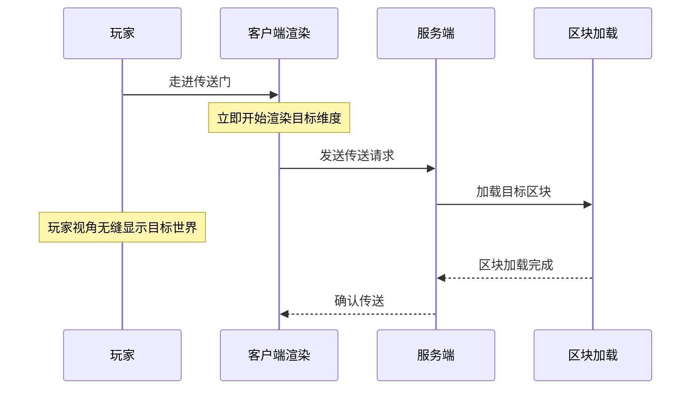
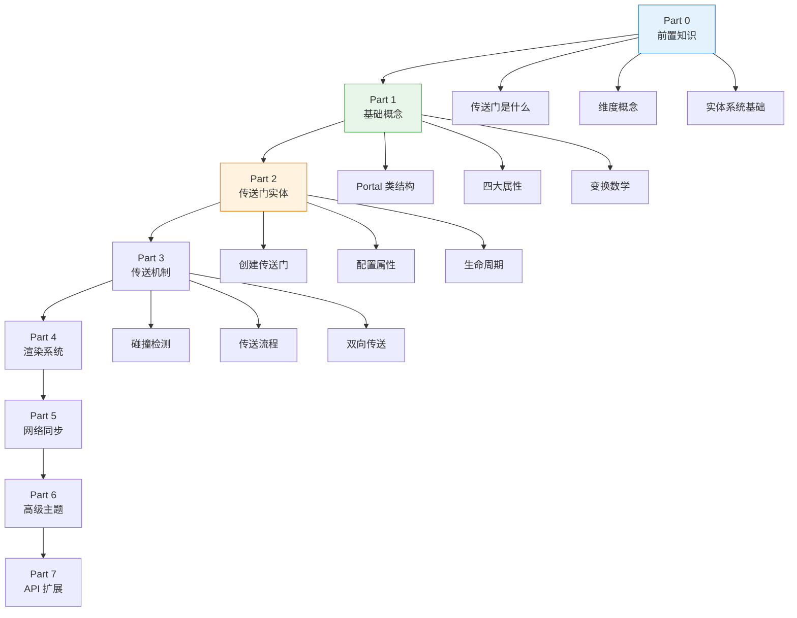

# 传送门基础概念入门

```yaml
---
title: 传送门基础概念入门
readingTime: 25
---
```

## 目录

- [什么是 ImmersivePortalsMod？](#什么是-immersiveportalsmod)
- [与原版传送门的对比](#与原版传送门的对比)
- [核心能力详解](#核心能力详解)
- [关键术语解释](#关键术语解释)
- [学习路线图](#学习路线图)
- [入门小实验：创建最简单的传送门](#入门小实验创建最简单的传送门)
- [课后自查](#课后自查)

---

## 什么是 ImmersivePortalsMod？

**ImmersivePortalsMod**（简称 IPCM 或 Immersive Portals）是一个让 Minecraft 传送门体验变得**无缝沉浸**的模组。传统的维度传送（如进入下界或末地）会显示黑屏加载画面，而这个模组让你可以直接"穿越"传送门，实时看到目标维度的画面，就像在现实世界中走进一扇门一样自然。

💡 **简单理解**：原版传送门是"坐车去新城市"（有加载等待），ImmersivePortalsMod 是"穿过一扇任意门"（无缝直达）。

### 主要特点

| 特点 | 说明 |
|------|------|
| **无缝传送** | 穿越传送门时没有黑屏加载 |
| **嵌套渲染** | 可以在传送门里看到另一个传送门 |
| **缩放传送** | 穿过传送门后身体变大或变小 |
| **旋转传送** | 穿过传送门后视角旋转 90°、180° 等 |
| **跨维度碰撞** | 在传送门这边能摸到那边的方块 |

---

## 与原版传送门的对比

让我们用 ASCII 图示对比一下两种传送门的行为差异：

### 原版下界传送门

```
┌─────────────────────────────────────────────────────────────┐
│  主世界玩家视角                                              │
│  ┌─────────┐                                                │
│  │ 传送门  │  ═══════════>  [黑屏 3-5 秒] ═══════════>  下界  │
│  └─────────┘                                                │
│                                                             │
│  玩家体验：                                                  │
│  - 走进传送门后屏幕变黑                                      │
│  - 等待区块加载（3-10秒不等）                                 │
│  - 突然出现在下界                                            │
│  - 无法在穿越过程中看到任何画面                               │
└─────────────────────────────────────────────────────────────┘
```

### ImmersivePortalsMod 传送门

```
┌─────────────────────────────────────────────────────────────┐
│  主世界玩家视角                                              │
│  ┌─────────┐                                                │
│  │ 传送门  │  ═══════════>  实时渲染下界画面  ═══════════>  下界│
│  └─────────┘                                                │
│       ↓                                                      │
│  玩家能透过传送门看到：                                       │
│  - 下界的灵魂沙、荧石、熔岩                                   │
│  - 正在下界行走的自己                                         │
│  - 甚至下界里的另一个传送门（嵌套）                            │
└─────────────────────────────────────────────────────────────┘
```

### 技术对比

| 维度 | 原版传送门 | ImmersivePortalsMod |
|------|-----------|---------------------|
| **加载方式** | 全屏阻塞加载 | 实时渲染目标维度 |
| **玩家体验** | 等待黑屏 | 无感知穿越 |
| **视觉效果** | 无 | 可看到目标维度 |
| **嵌套能力** | 不支持 | 支持多层嵌套 |
| **变换能力** | 仅维度切换 | 支持缩放、旋转 |

---

## 核心能力详解

### 1. 无加载屏幕传送

这是模组最核心的功能。当玩家穿越传送门时：

1. 客户端**立即开始渲染**目标维度的世界
2. 服务器在后台加载目标区块
3. 玩家视角**无缝过渡**，感觉像是穿过了一扇真实的门



### 2. 嵌套渲染（Nested Portal Rendering）

嵌套渲染允许传送门"嵌套"——即在传送门里看到另一个传送门的内容。这对于创造"镜子房间"、"无限走廊"等效果至关重要。

```
    外层传送门（看向主世界）
         │
         ▼
    ┌──────────────────┐
    │  ┌──────────┐    │  ◄── 内层传送门（看向下界）
    │  │  下界景象 │    │
    │  └──────────┘    │
    └──────────────────┘
```

💡 **应用场景**：
- 无限镜廊：在镜子房间中创建无限反射效果
- 多维度观察站：一个位置同时监控多个维度
- 创意建筑：利用嵌套创造视觉奇观

### 3. 缩放传送（Scaling Portal）

缩放传送允许传送门改变穿过者的尺寸：

| 缩放比例 | 效果描述 |
|----------|----------|
| 0.5x | 缩小 50%，可以进入小洞穴 |
| 2x | 放大 200%，可以查看微小细节 |
| 0.1x | 缩小到 10%，进入微观世界 |
| 10x | 放大到 1000%，变成巨人 |

### 4. 旋转传送

穿过传送门后，玩家的朝向可以发生旋转：

```
        北
         ↑
         │
    西 ←─┼─→ 东
         │
         ↓
        南

旋转 90° 后：东 → 北，西 → 南
```

---

## 关键术语解释

### Portal Entity（传送门实体）

传送门在 ImmersivePortalsMod 中是一个**实体（Entity）**，而不是方块。这意味着：
- 传送门有实体 ID
- 可以被命令操作（如 `/portal` 命令）
- 继承了 Minecraft 实体的所有特性
- 可以像管理其他实体一样被追踪和同步

### Destination（目的地）

传送门的目的地由三部分组成：
- **目标维度**（`dimensionTo`）：主世界、下界、末地或其他自定义维度
- **目标位置**（`destination`）：三维坐标 (x, y, z)
- **目标朝向**：玩家到达后的面向方向

### Transformation（变换）

变换决定了玩家穿过传送门时发生的变化：
- **旋转变换**：玩家的视角旋转
- **缩放变换**：玩家的身体变大或变小
- **镜像变换**：玩家被镜像反射（类似镜子效果）

### AxisW / AxisH（坐标轴）

传送门的方向由两个正交轴向量定义：
- `axisW`：水平轴，决定传送门的"宽度"方向
- `axisH`：垂直轴，决定传送门的"高度"方向
- 法向量 = `axisW × axisH`，决定传送门面向哪边

```
        axisH (↑)
          │
          │
          │
    ──────●────── axisW (→)
         /
        /
       /
    法向量 (指向屏幕外)
```

### Global Portal（全局传送门）

普通传送门在实体被移除（如超出加载范围）时会消失。全局传送门会**持久保存**，即使没有玩家在附近也能继续存在。

---

## 学习路线图

下面是 ImmersivePortalsMod 的学习路径：



### 各章节学习目标

| 章节 | 主题 | 完成后你将能够 |
|------|------|--------------|
| Part 0 | 前置知识 | 理解基本概念 |
| Part 1 | 基础概念 | 理解 Portal 类结构 |
| Part 2 | 传送门实体 | 创建和配置传送门 |
| Part 3 | 传送机制 | 理解传送触发和执行 |
| Part 4 | 渲染系统 | 实现嵌套渲染效果 |
| Part 5 | 网络同步 | 处理多维度网络 |
| Part 6 | 高级主题 | 缩放、旋转、镜像 |
| Part 7 | API 扩展 | 开发自定义传送门模组 |

---

## 入门小实验：创建最简单的传送门

现在让我们写一个简单的代码示例，创建一个最基本的传送门。

### 实验目标

创建一个将玩家从主世界传送到下界的水平传送门。

### 前置准备

确保你的模组项目：
1. 依赖了 ImmersivePortalsMod API
2. 可以在服务端初始化时运行代码
3. 有一个已加载的 Minecraft 世界

### 代码实现

```java
// 创建一个最简单的传送门
public static Portal createSimplePortal(
    ServerLevel world,           // 传送门所在的世界
    BlockPos position,           // 传送门中心位置
    Direction facing,            // 传送门朝向（北/南/东/西）
    double width,                // 传送门宽度
    double height                // 传送门高度
) {
    // 1. 创建传送门实体
    Portal portal = Portal.ENTITY_TYPE.create(world);

    // 2. 设置传送门位置
    Vec3 portalPos = Vec3.atCenterOf(position);
    portal.setPos(portalPos.x, portalPos.y, portalPos.z);

    // 3. 设置传送门朝向（基于朝向计算 axisW 和 axisH）
    Vec3 axisW = switch (facing) {
        case NORTH -> new Vec3(1, 0, 0);
        case SOUTH -> new Vec3(-1, 0, 0);
        case EAST  -> new Vec3(0, 0, 1);
        case WEST  -> new Vec3(0, 0, -1);
        default    -> new Vec3(1, 0, 0);
    };
    Vec3 axisH = new Vec3(0, 1, 0);
    portal.setAxisW(axisW);
    portal.setAxisH(axisH);

    // 4. 设置传送门尺寸
    portal.setWidth(width);
    portal.setHeight(height);

    // 5. 设置目的地为下界（overworld 的下方）
    portal.setDestDim(Level.NETHER);
    Vec3 destPos = new Vec3(
        position.getX() * 8.0,  // 下界坐标是主世界的 1/8
        position.getY(),
        position.getZ() * 8.0
    );
    portal.setDestination(destPos);

    // 6. 添加到世界
    world.addFreshEntity(portal);

    // 7. 同步到所有客户端
    portal.reloadAndSyncToClient();

    return portal;
}
```

### 简化版本（使用 PortalAPI）

如果你只想快速测试，可以使用 `PortalAPI` 提供的便捷方法：

```java
// 使用 PortalAPI 一行代码创建传送门
public static Portal createQuickPortal(
    ServerLevel world,
    BlockPos position,
    Direction facing,
    ResourceKey<Level> destDim,
    Vec3 destPos
) {
    Portal portal = new Portal(Portal.ENTITY_TYPE, world);

    // 使用 PortalAPI 设置传送门属性
    PortalAPI.setPortalPositionOrientationAndSize(
        portal,
        Vec3.atCenterOf(position),  // 位置
        facing,                     // 朝向
        4.0,                        // 宽度
        4.0                         // 高度
    );

    // 设置目的地
    PortalAPI.setPortalDestination(portal, destDim, destPos);

    world.addFreshEntity(portal);
    portal.reloadAndSyncToClient();

    return portal;
}
```

### 运行测试

1. 启动 Minecraft 服务器
2. 在聊天框或命令方块执行你的代码
3. 在指定位置会生成一个发光的紫色/蓝色传送门
4. 走进传送门，应该会传送到下界对应位置

✅ **成功标志**：走进传送门后，没有黑屏，直接出现在下界！

---

## 课后自查

完成本章学习后，请确认你能回答以下问题：

- [ ] **1. 理解差异**：ImmersivePortalsMod 和原版传送门的主要区别是什么？
- [ ] **2. 核心概念**：什么是 Portal Entity？它和方块有什么区别？
- [ ] **3. 三大属性**：传送门的目的地由哪三部分组成？
- [ ] **4. 坐标轴理解**：axisW 和 axisH 分别代表什么方向？
- [ ] **5. 术语掌握**：能解释"嵌套渲染"、"缩放传送"、"全局传送门"这三个概念吗？

---

## 下章预告

在下一章 [传送门实体初探](./02-portal-entity.md) 中，我们将深入了解：
- Portal 类的继承结构
- 传送门的四大核心属性详解
- 变换数学基础入门
- 如何用代码精确控制传送门

准备好了吗？让我们继续探索传送门的内部世界！
