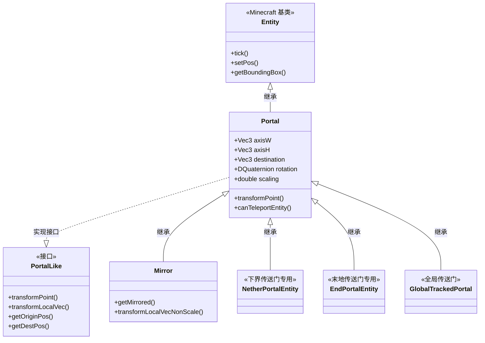
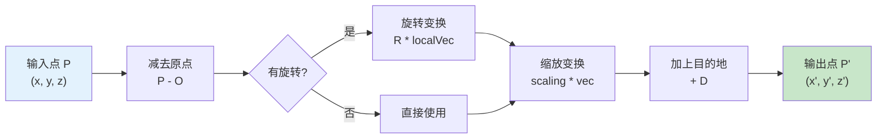

# 传送门实体初探

```yaml
---
title: 传送门实体初探
readingTime: 30
---
```

## 目录

- [本章目标](#本章目标)
- [Portal 类的继承结构](#portal-类的继承结构)
- [传送门的四大属性](#传送门的四大属性)
- [变换数学基础](#变换数学基础)
- [代码实战：配置传送门属性](#代码实战配置传送门属性)
- [课后自查](#课后自查)

---

## 本章目标

本章我们将深入了解 ImmersivePortalsMod 的核心——**Portal 实体类**。学完本章后，你将能够：

- ✅ 理解 Portal 类的继承层次结构
- ✅ 掌握传送门的四大核心属性（axisW、axisH、destination、rotation）
- ✅ 理解传送门变换的数学原理
- ✅ 使用代码创建和配置传送门

---

## Portal 类的继承结构

### 类层次图

Portal 实体并不是一个简单的类，它有精心设计的继承层次：



### 各类的职责

| 类名 | 职责 | 使用场景 |
|------|------|----------|
| `Portal` | 核心传送门逻辑 | 通用传送门 |
| `Mirror` | 镜像/反射效果 | 镜子房间 |
| `NetherPortalEntity` | 下界传送门逻辑 | 原版下界传送门兼容 |
| `EndPortalEntity` | 末地传送门逻辑 | 原版末地传送门兼容 |
| `GlobalTrackedPortal` | 全局传送门 | 持久保存的传送门 |

### 实体类型创建

传送门实体的类型创建使用了 Fabric 的构建器模式：

```java
public class Portal extends Entity implements PortalLike {
    public static final EntityType<Portal> ENTITY_TYPE = createPortalEntityType(Portal::new);

    private static <T extends Portal> EntityType<T> createPortalEntityType(
        EntityType.EntityFactory<T> constructor
    ) {
        return FabricEntityTypeBuilder.create(
                MobCategory.MISC,          // 分类为杂项
                constructor                 // 构造函数引用
            )
            .dimensions(EntityDimensions.fixed(0, 0))  // 尺寸为 0（平面）
            .fireImmune()                  // 火焰免疫
            .trackRangeBlocks(96)          // 追踪范围 96 格
            .trackedUpdateRate(20)         // 更新频率
            .forceTrackedVelocityUpdates(true)  // 强制追踪速度
            .build();
    }
}
```

💡 **为什么尺寸是 (0, 0)**？传送门是一个平面，不需要有体积。碰撞检测通过 `getBoundingBox()` 方法单独计算。

---

## 传送门的四大属性

传送门的核心状态由四个关键属性决定，理解它们就理解了传送门的一半。

### 属性一览表

| 属性 | 类型 | 说明 | 示例值 |
|------|------|------|--------|
| `axisW` | Vec3 | 水平轴向量，指向传送门的"右"方向 | (1, 0, 0) |
| `axisH` | Vec3 | 垂直轴向量，指向传送门的"上"方向 | (0, 1, 0) |
| `destination` | Vec3 | 传送目标位置（世界坐标） | (100, 64, 200) |
| `rotation` | DQuaternion | 旋转变换（四元数） | 绕 Y 轴旋转 90° |

### 1. axisW - 水平轴

`axisW` 定义了传送门水平方向的"宽度"向量。它指向传送门面朝方向的"右"边。

```
        axisH (0, 1, 0)
           ↑
           │
           │
    ───────●──────→ axisW (1, 0, 0)
           │
           │
           ↓
```

常见取值：

```java
// 面朝 +X 方向（东）
axisW = new Vec3(1, 0, 0);

// 面朝 -X 方向（西）
axisW = new Vec3(-1, 0, 0);

// 面朝 +Z 方向（南）
axisW = new Vec3(0, 0, 1);

// 面朝 -Z 方向（北）
axisW = new Vec3(0, 0, -1);
```

### 2. axisH - 垂直轴

`axisH` 定义了传送门垂直方向的"高度"向量，通常是 (0, 1, 0)，除非你想创建一个倾斜的传送门。

```java
// 垂直于地面
axisH = new Vec3(0, 1, 0);

// 倾斜 45 度（用于创意建筑）
axisH = new Vec3(0.707, 0.707, 0);
```

### 3. destination - 目标位置

`destination` 是玩家传送后的目标坐标。这是一个**三维向量**，包含 x、y、z 三个分量。

```java
// 传送到 (100, 64, 200) 位置
Vec3 destination = new Vec3(100, 64, 200);

// 传送到某个方块的上方（眼睛高度 +1.6）
Vec3 destination = new Vec3(x, y + 1.6, z);
```

### 4. rotation - 旋转变换

`rotation` 是一个四元数（Quaternion），用于在传送时旋转玩家的视角。这比欧拉角更稳定，可以避免万向锁问题。

```java
// 不旋转（默认）
rotation = null;

// 旋转 90 度（绕 Y 轴）
DQuaternion rotation = DQuaternion.fromAxisAngle(
    new Vec3(0, 1, 0),    // 旋转轴
    Math.PI / 2            // 旋转角度（弧度）
);

// 旋转 180 度
DQuaternion rotation = DQuaternion.fromAxisAngle(
    new Vec3(0, 1, 0),
    Math.PI
);
```

### 完整属性配置示例

```java
public static void configurePortal(Portal portal) {
    // 设置位置（在世界的某个地方）
    portal.setPos(100, 64, 200);

    // 设置方向（面朝 +Z 方向）
    portal.setAxisW(new Vec3(0, 0, 1));
    portal.setAxisH(new Vec3(0, 1, 0));

    // 设置尺寸（宽 4 格，高 4 格）
    portal.setWidth(4.0);
    portal.setHeight(4.0);

    // 设置目的地
    portal.setDestDim(Level.NETHER);              // 目标维度
    portal.setDestination(new Vec3(12.5, 64, 25)); // 目标位置

    // 设置旋转（可选）
    portal.setRotationTransformation(
        DQuaternion.fromAxisAngle(new Vec3(0, 1, 0), Math.PI / 2)
    );
}
```

---

## 变换数学基础

### 点变换原理

传送门的核心功能是**变换**：将原位置的一个点，变换到目标位置。公式如下：

```
P' = T(P) = R(S(P - O)) + D
```

其中：
- `O` = 传送门原点（origin）
- `D` = 目的地坐标（destination）
- `S` = 缩放因子（scaling）
- `R` = 旋转变换（rotation）
- `P` = 输入点
- `P'` = 输出点

### 变换流程图



### 代码实现

```java
/**
 * 变换一个点的位置
 * @param pos 原位置
 * @return 变换后的新位置
 */
public Vec3 transformPoint(Vec3 pos) {
    // 第一步：减去原点，得到相对于传送门的局部坐标
    Vec3 localPos = pos.subtract(getOriginPos());

    // 第二步：进行旋转变换（如果有）
    Vec3 rotated = transformLocalVecNonScale(localPos);

    // 第三步：进行缩放变换
    Vec3 scaled = rotated.scale(scaling);

    // 第四步：加上目的地坐标
    return scaled.add(getDestPos());
}

/**
 * 旋转变换（使用四元数）
 * @param localVec 局部坐标向量
 * @return 旋转变换后的向量
 */
public Vec3 transformLocalVecNonScale(Vec3 localVec) {
    if (rotation == null) {
        return localVec;  // 没有旋转，直接返回
    }
    return rotation.rotate(localVec);  // 四元数旋转
}
```

### 四元数入门

四元数是一种避免欧拉角万向锁问题的旋转表示方式。在 ImmersivePortalsMod 中，传送门使用四元数进行旋转变换。

```
普通旋转（欧拉角）：有万向锁风险
四元数旋转：任意旋转轴，任意角度，无万向锁
```

💡 **实用技巧**：如果你不熟悉四元数，可以记住以下常用转换：

```java
// 从角度创建旋转
public static DQuaternion fromAngleAxis(double angle, Vec3 axis) {
    double halfAngle = angle / 2;
    double sin = Math.sin(halfAngle);
    double cos = Math.cos(halfAngle);
    return new DQuaternion(
        axis.x * sin,  // x
        axis.y * sin,  // y
        axis.z * sin,  // z
        cos            // w
    );
}
```

---

## 代码实战：配置传送门属性

### 完整创建传送门的步骤

```java
import qouteall.imm_ptl.core.portal.Portal;
import qouteall.imm_ptl.core.portal.PortalAPI;
import qouteall.imm_ptl.core.McHelper;

// 创建一个完整的传送门
public Portal createPortal(
    ServerLevel world,
    BlockPos position,
    Direction facing,  // NORTH, SOUTH, EAST, WEST
    ResourceKey<Level> destDim,
    Vec3 destPos
) {
    // 1. 创建传送门实体
    Portal portal = Portal.ENTITY_TYPE.create(world);

    // 2. 计算轴向量
    Vec3 axisW = switch (facing) {
        case NORTH -> new Vec3(1, 0, 0);   // 朝北时，宽度沿 X 轴
        case SOUTH -> new Vec3(-1, 0, 0); // 朝南时，宽度沿 -X 轴
        case EAST  -> new Vec3(0, 0, 1);   // 朝东时，宽度沿 Z 轴
        case WEST  -> new Vec3(0, 0, -1);  // 朝西时，宽度沿 -Z 轴
        default    -> new Vec3(1, 0, 0);
    };
    Vec3 axisH = new Vec3(0, 1, 0);  // 垂直向上

    // 3. 使用 PortalAPI 设置属性（推荐方式）
    PortalAPI.setPortalPositionOrientationAndSize(
        portal,
        Vec3.atCenterOf(position),  // 传送门中心位置
        facing,                     // 朝向
        4.0,                        // 宽度
        4.0                         // 高度
    );

    // 4. 设置目的地
    PortalAPI.setPortalTransformation(
        portal,
        destDim,                    // 目标维度
        destPos,                    // 目标位置
        null,                       // 不旋转（设为四元数可旋转）
        1.0                         // 不缩放（设为其他数值可缩放）
    );

    // 5. 添加到世界
    world.addFreshEntity(portal);

    // 6. 同步到客户端
    portal.reloadAndSyncToClient();

    return portal;
}
```

### 创建带缩放的传送门

```java
// 创建一个"巨人"传送门（穿过的人变大 3 倍）
public Portal createGiantPortal(ServerLevel world, BlockPos pos) {
    Portal portal = Portal.ENTITY_TYPE.create(world);

    PortalAPI.setPortalPositionOrientationAndSize(
        portal,
        Vec3.atCenterOf(pos),
        Direction.SOUTH,
        5.0,   // 宽 5 格
        5.0    // 高 5 格
    );

    // 缩放设置为 3.0（穿过的人会变成原来的 3 倍大）
    PortalAPI.setPortalTransformation(
        portal,
        Level.NETHER,              // 去下界
        new Vec3(50, 64, 50),      // 下界位置
        null,                       // 不旋转
        3.0                         // 3 倍缩放！
    );

    world.addFreshEntity(portal);
    portal.reloadAndSyncToClient();

    return portal;
}
```

### 创建带旋转的传送门

```java
// 创建一个旋转 90 度的传送门
public Portal createRotatedPortal(ServerLevel world, BlockPos pos) {
    Portal portal = Portal.ENTITY_TYPE.create(world);

    PortalAPI.setPortalPositionOrientationAndSize(
        portal,
        Vec3.atCenterOf(pos),
        Direction.SOUTH,
        4.0,
        4.0
    );

    // 旋转 90 度（绕 Y 轴）
    DQuaternion rotation = DQuaternion.fromAxisAngle(
        new Vec3(0, 1, 0),      // Y 轴
        Math.PI / 2             // 90 度
    );

    PortalAPI.setPortalTransformation(
        portal,
        Level.NETHER,
        new Vec3(50, 64, 50),
        rotation,               // 添加旋转变换！
        1.0
    );

    world.addFreshEntity(portal);
    portal.reloadAndSyncToClient();

    return portal;
}
```

### 镜像传送门（Mirror）

```java
// 创建一个镜子
public Mirror createMirror(ServerLevel world, BlockPos pos, Direction facing) {
    Mirror mirror = Mirror.ENTITY_TYPE.create(world);

    // 设置镜子位置
    mirror.setPos(Vec3.atCenterOf(pos).x, Vec3.atCenterOf(pos).y, Vec3.atCenterOf(pos).z);

    // 设置方向
    Vec3 axisW = switch (facing) {
        case NORTH -> new Vec3(1, 0, 0);
        case SOUTH -> new Vec3(-1, 0, 0);
        case EAST  -> new Vec3(0, 0, 1);
        case WEST  -> new Vec3(0, 0, -1);
        default    -> new Vec3(1, 0, 0);
    };
    mirror.setAxisW(axisW);
    mirror.setAxisH(new Vec3(0, 1, 0));

    // 设置镜子尺寸
    mirror.setWidth(4.0);
    mirror.setHeight(4.0);

    world.addFreshEntity(mirror);
    mirror.reloadAndSyncToClient();

    return mirror;
}
```

💡 **镜子和普通传送门的区别**：镜子不传送实体，而是将穿过它的实体镜像反射到原位置。

---

## 课后自查

完成本章学习后，请确认你能回答以下问题：

- [ ] **1. 继承结构**：Portal 类的父类是什么？它实现了哪些接口？
- [ ] **2. 四大属性**：传送门的 axisW、axisH、destination、rotation 分别控制什么？
- [ ] **3. 轴向量理解**：如果传送门面朝北方（-Z），axisW 应该是什么值？
- [ ] **4. 四元数**：四元数比欧拉角的优点是什么？
- [ ] **5. API 使用**：使用 PortalAPI 创建传送门的标准流程是什么？

---

## 下章预告

在下一章 [传送机制基础](./03-teleportation-basics.md) 中，我们将学习：

- 玩家是如何被传送的
- 客户端预测传送 vs 服务端验证
- 碰撞检测如何触发传送
- 双向传送的原理

准备好深入了解传送的内部机制了吗？让我们继续！
