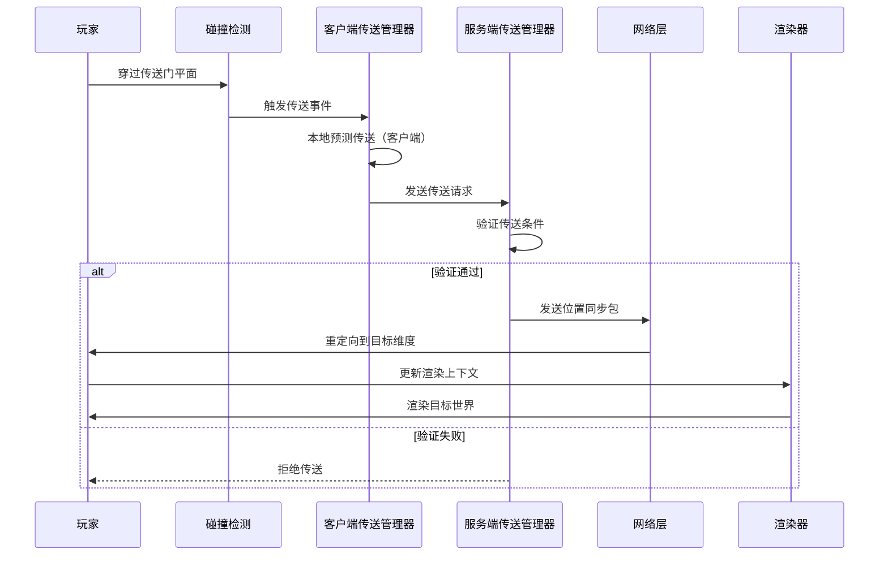

# 传送机制基础

> 本章目标：理解玩家如何通过传送门被传送到目标位置，掌握服务端和客户端传送管理器的协作方式。

---

## 目录

- [传送的基本概念](#传送的基本概念)
- [传送流程图](#传送流程图)
- [服务端传送管理器](#服务端传送管理器)
- [客户端传送管理器](#客户端传送管理器)
- [碰撞检测触发传送](#碰撞检测触发传送)
- [双向传送原理](#双向传送原理)
- [课后自查](#课后自查)

---

## 传送的基本概念

### 什么是传送？

**传送（Teleportation）** 是指玩家或其他实体从当前位置瞬间移动到另一个位置的过程。在 ImmersivePortalsMod 中，传送可以跨越维度（Dimension），让玩家体验无缝的跨维度冒险。

```
传送前                         传送后
                                 
┌─────────┐    ──────>    ┌─────────┐
│  主世界  │               │  下界   │
│   @     │               │    @    │
│  [入口] │               │  [出口] │
└─────────┘               └─────────┘
   0, 64, 0                  10, 64, 10
```

### 原版 vs ImmersivePortalsMod

| 特性 | 原版传送门 | ImmersivePortalsMod |
|------|-----------|---------------------|
| 加载屏幕 | 有（必须等待） | 无（实时渲染） |
| 维度切换 | 全屏切换 | 透过传送门可见 |
| 嵌套传送 | 不支持 | 支持最多6层 |
| 传送方向 | 固定 | 可任意旋转 |

---

## 传送流程图



### 流程说明

1. **碰撞检测**：玩家碰撞箱与传送门平面相交时触发
2. **客户端预测**：客户端先本地执行预测传送，提供即时反馈
3. **服务端验证**：服务器验证传送请求的合法性
4. **网络同步**：位置和维度变化通过网络同步
5. **渲染更新**：客户端更新渲染上下文，显示目标世界

---

## 服务端传送管理器

### ServerTeleportationManager 简介

**ServerTeleportationManager** 是服务端的核心传送管理类，负责：
- 验证传送请求的合法性
- 计算正确的目标位置
- 处理维度切换
- 同步实体状态

源码位置：
```
D:\Minecraft-Learning\assets\ImmersivePortalsMod-6.0.6-mc1.21.1\src\main\java\qouteall\imm_ptl\core\teleportation\ServerTeleportationManager.java
```

### 传送验证逻辑

```java
// 传送前的验证检查
public boolean validateTeleportation(PlayerEntity player, Portal portal) {
    // 1. 检查传送门是否有效
    if (!portal.isPortalActivable()) {
        return false;
    }
    
    // 2. 检查玩家状态（不能正在传送、不能死亡等）
    if (player.isDead() || player.isRemoved()) {
        return false;
    }
    
    // 3. 检查目标位置是否可到达
    if (!isDestinationReachable(portal.getDestination())) {
        return false;
    }
    
    // 4. 检查冷却时间（防止频繁传送）
    if (isOnCooldown(player)) {
        return false;
    }
    
    return true;
}
```

### 目标位置计算

传送的目标位置需要考虑多种因素：

```java
// 计算传送后的位置
public Vec3d calculateDestinationPosition(
    PlayerEntity player,
    Portal portal
) {
    // 1. 获取传送门的目标点
    Vec3d portalDestination = portal.getDestination();
    
    // 2. 计算玩家在传送门内的相对位置
    Vec3d relativePos = calculateRelativePosition(player, portal);
    
    // 3. 应用传送门的变换（旋转、缩放）
    Vec3d transformedPos = portal.transformPoint(relativePos);
    
    // 4. 加上目标位置偏移
    return transformedPos.add(portalDestination);
}
```

---

## 客户端传送管理器

### ClientTeleportationManager 简介

**ClientTeleportationManager** 的主要职责是：
- 提供即时反馈（客户端预测）
- 管理客户端世界切换
- 同步服务端状态

### 客户端预测机制

```
┌─────────────────────────────────────────────────────────┐
│                    客户端预测流程                        │
├─────────────────────────────────────────────────────────┤
│                                                         │
│  1. 玩家穿过传送门                                       │
│         │                                               │
│         ▼                                               │
│  2. 客户端立即计算目标位置                               │
│         │                                               │
│         ▼                                               │
│  3. 本地切换世界上下文（无等待）                         │
│         │                                               │
│         ▼                                               │
│  4. 开始渲染目标世界                                     │
│         │                                               │
│         ▼                                               │
│  5. 服务端验证后确认/修正位置                            │
│                                                         │
└─────────────────────────────────────────────────────────┘
```

### 为什么需要客户端预测？

💡 **用户体验优化**：如果等待服务端响应才执行传送，玩家会感受到明显的延迟。客户端预测让传送"即时"发生，然后再同步服务端状态。

### 预测与校正

```java
public class ClientTeleportationManager {
    
    // 执行预测传送
    public void performPredictedTeleport(Portal portal) {
        // 1. 计算目标位置
        Vec3d targetPos = portal.transformPoint(getPlayerPos());
        
        // 2. 切换世界上下文
        ClientWorldLoader.switchToDimension(portal.getDestinationDimension());
        
        // 3. 设置玩家位置
        clientPlayer.setPosition(targetPos);
        
        // 4. 记录预测状态
        predictedTeleport = true;
    }
    
    // 服务端确认后校正
    public void correctTeleport(Vec3d serverPos) {
        if (predictedTeleport) {
            // 如果预测位置与服务端不匹配，进行校正
            if (!clientPlayer.getPos().equals(serverPos)) {
                clientPlayer.setPosition(serverPos);
            }
            predictedTeleport = false;
        }
    }
}
```

---

## 碰撞检测触发传送

### 传送门碰撞器

传送门实体本身有一个特殊的碰撞检测器（**PortalCollisionHandler**），用于检测玩家是否穿过传送门平面。

```java
public class PortalCollisionHandler {
    
    // 检测玩家与传送门的碰撞
    public void checkPortalCollision(PlayerEntity player) {
        // 1. 获取玩家当前和上一帧的位置
        Vec3d currentPos = player.getPos();
        Vec3d prevPos = player.prevX, player.prevY, player.prevZ;
        
        // 2. 检查是否跨越了传送门平面
        if (crossedPortalPlane(prevPos, currentPos, portal)) {
            // 3. 计算穿越方向
            Vec3d direction = currentPos.subtract(prevPos);
            
            // 4. 判断是从正面还是背面穿越
            if (isApproachingFromFront(direction, portal)) {
                // 5. 触发传送
                initiateTeleport(player, portal);
            }
        }
    }
}
```

### 穿越方向判断

```
俯视图（传送门平面）：

        背面
    ┌──────────┐
    │          │
←───│   门     │  玩家从左向右移动
    │          │
    └──────────┘
       正面

判断逻辑：
- direction · portalNormal > 0 → 从背面进入
- direction · portalNormal < 0 → 从正面进入
```

---

## 双向传送原理

### 什么是双向传送？

**双向传送**是指两个传送门互为入口和出口，形成闭环。玩家可以从 A 传送到 B，也可以从 B 传送到 A。

```
┌─────────────────────────────────┐
│                                 │
│   ┌───────┐       ┌───────┐   │
│   │ Portal│ ──> ─>│ Portal│   │
│   │   A   │       │   B   │   │
│   └───┬───┘ <── <└───↓───┘   │
│       │           │           │
│       └───────────┘           │
│        双向传送闭环             │
│                                 │
└─────────────────────────────────┘
```

### 双向传送的实现

```java
// 创建两个互相关联的传送门
public void createTwoWayPortal(
    Vec3d posA, Direction facingA,
    Vec3d posB, Direction facingB,
    Level dimension
) {
    // 创建传送门 A（指向 B）
    Portal portalA = PortalAPI.createPortal(dimension, posA, facingA);
    PortalAPI.setPortalTransformation(
        portalA,
        dimension.getDimensionKey(),  // 同一维度
        posB,                          // 目标是 B 的位置
        null,                          // 无旋转
        1.0                            // 正常缩放
    );
    
    // 创建传送门 B（指向 A）
    Portal portalB = PortalAPI.createPortal(dimension, posB, facingB);
    PortalAPI.setPortalTransformation(
        portalB,
        dimension.getDimensionKey(),  // 同一维度
        posA,                         // 目标是 A 的位置
        null,                         // 无旋转
        1.0                           // 正常缩放
    );
}
```

### 传送门配对

传送门通过 **PortalLinkage** 机制进行配对：

```java
public class PortalLinkage {
    
    // 建立传送门配对
    public static void linkPortals(Portal portal1, Portal portal2) {
        // 设置传送门1的目标为传送门2
        portal1.setDestinationDimension(getDimension(portal2));
        portal1.setDestination(getPosition(portal2));
        
        // 设置传送门2的目标为传送门1
        portal2.setDestinationDimension(getDimension(portal1));
        portal2.setDestination(getPosition(portal1));
    }
}
```

---

## 课后自查

✅ **第1题**：服务端传送管理器和客户端传送管理器的主要区别是什么？

✅ **第2题**：为什么 ImmersivePortalsMod 需要客户端预测机制？它解决了什么问题？

✅ **第3题**：在碰撞检测中，如何判断玩家是从传送门的正面还是背面穿过？

✅ **第4题**：双向传送的实现需要哪些关键步骤？

✅ **第5题**：如果服务端验证传送请求失败，客户端预测的状态会如何处理？

---

## 下一步

- [第四章：传送门渲染原理](./Part-2-Rendering/04-portal-rendering.md) - 了解传送门如何渲染目标世界
- [第五章：嵌套传送门](./Part-3-Advanced/05-nested-portals.md) - 探索多层传送门的奥秘

---

*教程版本：ImmersivePortalsMod 6.0.6 / Minecraft 1.21.1*
