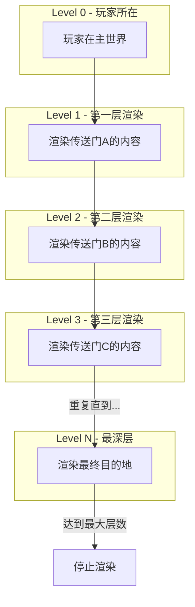
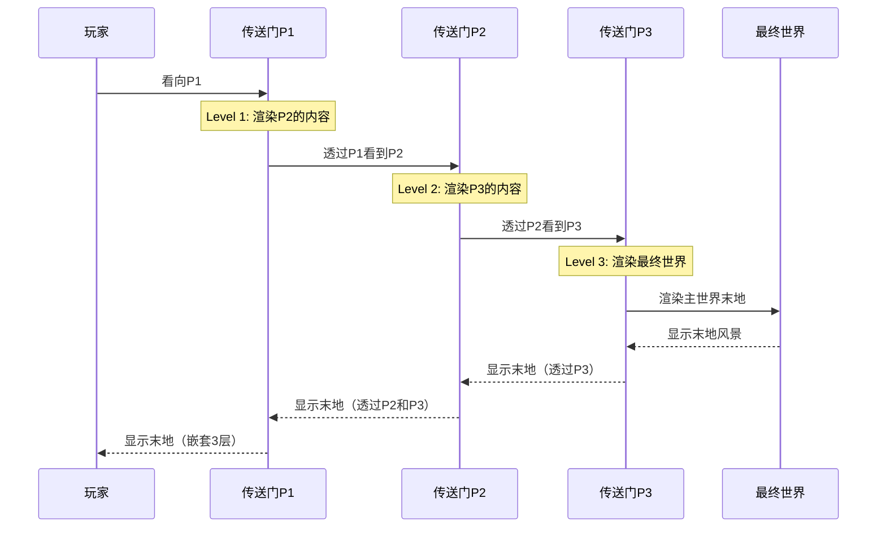

# 嵌套传送门

> 本章目标：理解多层传送门的递归渲染机制，掌握嵌套传送门的工作原理和应用场景。

---

## 目录

- [什么是嵌套传送门](#什么是嵌套传送门)
- [嵌套层数限制](#嵌套层数限制)
- [递归渲染机制](#递归渲染机制)
- [嵌套传送门示意图](#嵌套传送门示意图)
- [嵌套层级的实现](#嵌套层级的实现)
- [应用场景](#应用场景)
- [课后自查](#课后自查)

---

## 什么是嵌套传送门？

**嵌套传送门（Nested Portal）** 是指在一个传送门的渲染内容中，又包含另一个传送门的情况。这创造了一种"传送门中的传送门"的视觉效果。

💡 **核心特点**：玩家透过传送门 A 看到的是另一个传送门 B 的内容，而传送门 B 又显示着另一个维度的景象。

```
嵌套传送门示意图：

┌─────────────────────────────────────────────────────────┐
│                                                         │
│   玩家视角：                                             │
│                                                         │
│   ┌─────────────────────────┐                         │
│   │  ┌─────────────────┐    │  ← 第一层传送门（A）     │
│   │  │  ┌───────────┐  │    │                         │
│   │  │  │ 下界风景   │  │    │  ← 第二层传送门（B）     │
│   │  │  │ 包含传送门 │  │    │                         │
│   │  │  └───────────┘  │    │                         │
│   │  └─────────────────┘    │                         │
│   └─────────────────────────┘                         │
│                                                         │
└─────────────────────────────────────────────────────────┘
```

---

## 嵌套层数限制

### 为什么需要限制？

嵌套传送门会显著增加渲染负担，因为每一层都需要：
- 额外的帧缓冲区渲染
- 额外的坐标变换计算
- 额外的内存占用

ImmersivePortalsMod 将嵌套层数限制为 **最多 6 层**。

```java
// 嵌套层数常量
public class PortalRenderer {
    // 最大嵌套深度
    public static final int MAX_RENDERING_LAYERS = 6;
    
    // 当前渲染层数
    private int currentLayer = 0;
    
    // 检查是否还能继续嵌套渲染
    public boolean canRenderNextLayer() {
        return currentLayer < MAX_RENDERING_LAYERS;
    }
}
```

### 层级示意

```
层级示意图：

Level 0  ─┬─  主世界（玩家所在）
           │
Level 1  ─┼─  传送门 A → 下界
           │
Level 2  ─┼─  传送门 B → 主世界（远程位置）
           │
Level 3  ─┼─  传送门 C → 下界（另一个地方）
           │
Level 4  ─┼─  传送门 D → 末地
           │
Level 5  ─┴─  传送门 E → 主世界（最深处）
           │
Level 6  ──  ❌ 超过限制，不再渲染
```

---

## 递归渲染机制

### 渲染流程



### 递归渲染代码

```java
public class PortalRenderer {
    
    private int maxLayers = 6;
    private int currentLayer = 0;
    
    // 递归渲染每一层
    public void renderPortalContent(PortalRenderingContext context) {
        // 1. 检查是否超过最大层数
        if (currentLayer >= maxLayers) {
            // 渲染纯色或纹理作为最深层
            renderFallbackTexture(context);
            return;
        }
        
        // 2. 保存当前渲染状态
        saveRenderState();
        
        // 3. 增加层数计数
        currentLayer++;
        
        // 4. 切换到目标世界的渲染上下文
        switchToPortalWorld(context.getPortal());
        
        // 5. 渲染这一层的内容
        renderWorldContent(context);
        
        // 6. 恢复渲染状态
        restoreRenderState();
        
        // 7. 递减层数计数
        currentLayer--;
    }
    
    // 切换到传送门目标世界
    private void switchToPortalWorld(Portal portal) {
        // 绑定目标世界的帧缓冲区
        Framebuffer targetFb = portal.getDestinationWorld().getFramebuffer();
        targetFb.bindWrite(true);
        
        // 应用目标世界的视图矩阵
        applyWorldViewMatrix(portal.getDestinationWorld());
    }
}
```

### 栈式状态管理

```java
// 使用栈来管理渲染状态
public class RenderStateStack {
    private Stack<RenderState> stack = new Stack<>();
    
    public void push(RenderState state) {
        stack.push(state);
    }
    
    public RenderState pop() {
        if (stack.isEmpty()) {
            throw new IllegalStateException("Render state stack underflow");
        }
        return stack.pop();
    }
    
    public RenderState peek() {
        return stack.peek();
    }
    
    public boolean isEmpty() {
        return stack.isEmpty();
    }
}
```

---

## 嵌套传送门示意图

### 完整嵌套流程



### 坐标变换链

```
嵌套传送门的坐标变换：

玩家位置 P ──────> 变换 ──────> P1的目标点
                    │
                    │ 应用P1的变换
                    ▼
                ──────> P2的目标点
                            │
                            │ 应用P2的变换
                            ▼
                        ──────> P3的目标点
                                    │
                                    │ 应用P3的变换
                                    ▼
                                ──────> 最终位置

变换公式：
P_final = T(P, transforms[0], transforms[1], ..., transforms[n])
其中 transforms[i] = portal_i.transformPoint
```

---

## 嵌套层级的实现

### 层级检测

```java
public class NestedPortalDetector {
    
    // 检测玩家当前处于多少层嵌套中
    public int detectNestingLevel(PlayerEntity player) {
        int level = 0;
        Vec3d cameraPos = getCameraPosition(player);
        
        // 递归检测每一层
        Portal currentPortal = findPortalLookingAt(player, cameraPos);
        
        while (currentPortal != null && level < MAX_LAYERS) {
            level++;
            // 获取透过当前传送门看到的下一个传送门
            currentPortal = findNextPortalInPortal(currentPortal);
        }
        
        return level;
    }
    
    // 在传送门内部查找另一个传送门
    private Portal findNextPortalInPortal(Portal outerPortal) {
        // 计算透过外层传送门能看到的区域
        Box visibleArea = calculateVisibleArea(outerPortal);
        
        // 在该区域内查找传送门
        return findPortalInArea(visibleArea, outerPortal.getDestinationWorld());
    }
}
```

### 性能优化

💡 **优化策略**：

1. **提前剪枝**：如果某个区域的嵌套超过限制，直接渲染占位图
2. **LOD控制**：远距离嵌套传送门使用简化渲染
3. **缓存机制**：缓存已渲染的嵌套层级

```java
public class NestedPortalOptimizer {
    
    // 缓存已渲染的层级
    private Map<Long, RenderedLayer> layerCache = new ConcurrentHashMap<>();
    
    // 生成缓存键
    private long generateCacheKey(Portal[] portalChain) {
        long key = 0;
        for (Portal portal : portalChain) {
            key = key * 31 + portal.getId();
        }
        return key;
    }
    
    // 获取或渲染层级
    public RenderedLayer getOrRenderLayer(Portal[] portalChain) {
        long key = generateCacheKey(portalChain);
        
        return layerCache.computeIfAbsent(key, k -> {
            RenderedLayer layer = new RenderedLayer();
            renderPortalChain(layer, portalChain);
            return layer;
        });
    }
}
```

---

## 应用场景

### 场景1：空间折叠

通过嵌套传送门创造"空间折叠"效果：

```
正常空间：
A ────────────────────────────> B
距离：1000格

折叠空间：
A ─> 传送门 ─> B
距离：1格（通过嵌套传送门）

视觉效果：玩家走了1格，实际跨越了1000格的距离
```

### 场景2：观察哨

放置一个嵌套传送门用于观察危险区域：

```java
// 创建一个观察哨传送门
public void createObservationPostal(
    Level observerWorld,
    Level targetWorld,
    Vec3d observationPoint
) {
    // 外层传送门：主世界的观察哨
    Portal outerPortal = createPortal(observerWorld, getObserverPos());
    setPortalDestination(outerPortal, targetWorld, observationPoint);
    
    // 如果目标世界也有传送门，可以创建嵌套效果
    // 玩家可以在观察哨中看到目标世界的另一扇门
}
```

### 场景3：视觉迷宫

```
迷宫设计：

入口 ─> 传送门A ─┬─> 传送门B ─┬─> 传送门C
                  │           │
                  └─> 传送门D ─┘

每扇门都通向不同的嵌套层级，创造视觉迷宫效果
```

---

## 课后自查

✅ **第1题**：ImmersivePortalsMod 为什么将嵌套层数限制为6层？超过这个限制会发生什么？

✅ **第2题**：描述嵌套传送门的递归渲染流程，从玩家视角到最终渲染。

✅ **第3题**：在嵌套传送门中，坐标变换是如何累积的？

✅ **第4题**：嵌套传送门有哪些实际应用场景？请列举至少2个。

✅ **第5题**：如何优化嵌套传送门的渲染性能？

---

## 下一步

- [第六章：镜像系统](./06-mirror-system.md) - 了解反射变换的奥秘
- [第七章：缩放传送](./07-scaling-portals.md) - 探索大小可变的传送门

---

*教程版本：ImmersivePortalsMod 6.0.6 / Minecraft 1.21.1*
