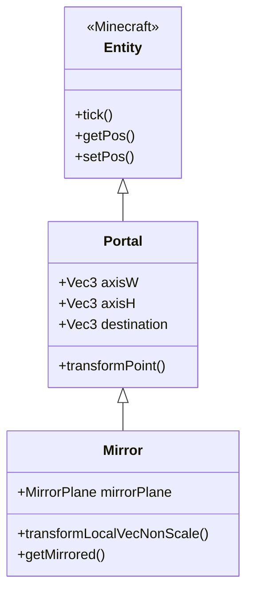

# 镜像系统

> 本章目标：理解 Mirror 实体如何实现反射变换，掌握镜像传送门的创建方法。

---

## 目录

- [什么是镜像传送门](#什么是镜像传送门)
- [Mirror 类继承结构](#mirror-类继承结构)
- [反射变换数学](#反射变换数学)
- [镜像与普通传送门的区别](#镜像与普通传送门的区别)
- [创建镜像传送门](#创建镜像传送门)
- [镜像应用示例](#镜像应用示例)
- [课后自查](#课后自查)

---

## 什么是镜像传送门？

**镜像（Mirror）** 是一种特殊的传送门，它不仅能传送玩家，还能将空间进行反射变换。玩家穿过镜像后会看到左右颠倒的世界。

💡 **核心特点**：
- 继承自 Portal 实体
- 包含额外的反射变换矩阵
- 渲染时应用镜像效果
- 传送时位置和视角都会反转

```
镜像效果示意图：

穿越前                         穿越后

   玩家                          玩家
    ↓                             ↓
┌─────────┐                    ┌─────────┐
│ A ←→ B │     ───────>       │ B ←→ A │
│ C ←→ D │                    │ D ←→ C │
│   ↑    │                    │   ↓    │
└─────────┘                    └─────────┘

位置映射：
A点(0,0) ───> ────> B点(2,0)
玩家看到B在右边，但实际位置计算后可能不同
```

---

## Mirror 类继承结构



### Mirror 实体创建

```java
// 在 Portal.java 中定义
public class Portal extends Entity implements PortalLike {
    // ... Portal 原有代码 ...
}

// Mirror 继承自 Portal
public class Mirror extends Portal {
    
    // 镜像平面类型
    public enum MirrorPlane {
        XZ_PLANE,  // 水平镜像（上下反转）
        XY_PLANE,  // 垂直镜像（左右反转）
        YZ_PLANE   // 深度镜像（前后反转）
    }
    
    // 镜像平面
    private MirrorPlane mirrorPlane = MirrorPlane.YZ_PLANE;
    
    public Mirror(World world) {
        super(world);
    }
    
    // 获取镜像变换后的向量
    public Vec3 transformLocalVecNonScale(Vec3 localVec) {
        return applyMirrorTransformation(localVec);
    }
}
```

---

## 反射变换数学

### 反射矩阵

在3D空间中，反射变换可以通过矩阵乘法实现。Mirror 使用以下反射矩阵：

```
关于 YZ 平面的反射（左右镜像）：
┌ -1  0  0 ┐
│  0  1  0 │
└  0  0  1 ┘

关于 XZ 平面的反射（上下镜像）：
┌  1  0  0 ┐
│  0 -1  0 │
└  0  0  1 ┘

关于 XY 平面的反射（前后镜像）：
┌  1  0  0 ┐
│  0  1  0 │
└  0  0 -1 ┘
```

### 反射变换实现

```java
public class MirrorMath {
    
    // 关于 YZ 平面（X轴）反射
    public static Vec3d reflectAboutYZ(Vec3d v) {
        return new Vec3d(-v.x, v.y, v.z);
    }
    
    // 关于 XZ 平面（Y轴）反射
    public static Vec3d reflectAboutXZ(Vec3d v) {
        return new Vec3d(v.x, -v.y, v.z);
    }
    
    // 关于 XY 平面（Z轴）反射
    public static Vec3d reflectAboutXY(Vec3d v) {
        return new Vec3d(v.x, v.y, -v.z);
    }
    
    // 根据镜像平面应用反射
    public static Vec3d applyMirror(Vec3d v, Mirror.MirrorPlane plane) {
        return switch (plane) {
            case YZ_PLANE -> reflectAboutYZ(v);
            case XZ_PLANE -> reflectAboutXZ(v);
            case XY_PLANE -> reflectAboutXY(v);
        };
    }
}
```

### 位置变换

```java
// 计算镜像后的目标位置
public Vec3d calculateMirroredDestination(Vec3d originalPos, MirrorPlane plane) {
    // 1. 获取镜像平面的中心点
    Vec3d mirrorCenter = this.getPos();
    
    // 2. 计算相对于中心的位置
    Vec3d relativePos = originalPos.subtract(mirrorCenter);
    
    // 3. 应用反射变换
    Vec3d reflectedRelative = MirrorMath.applyMirror(relativePos, plane);
    
    // 4. 加回中心点
    return mirrorCenter.add(reflectedRelative);
}
```

---

## 镜像与普通传送门的区别

### 功能对比

| 特性 | 普通传送门 | 镜像传送门 |
|------|-----------|-----------|
| 位置变换 | 平移 | 反射 + 平移 |
| 视角旋转 | 可选 | 自动反转 |
| 旋转类型 | 四元数旋转 | 轴向反射 |
| 渲染效果 | 正常渲染 | 镜像渲染 |
| 使用场景 | 跨维度传送 | 特殊效果/谜题 |

### 变换链对比

```
普通传送门变换：
输入位置 P ──> 应用旋转 R ──> 应用缩放 S ──> 加上偏移 D ──> 输出 P'

镜像传送门变换：
输入位置 P ──> 关于平面M反射 ──> 应用旋转 R ──> 加上偏移 D ──> 输出 P"
```

---

## 创建镜像传送门

### 基础创建方法

```java
// 使用 PortalAPI 创建镜像
public Mirror createMirror(
    Level world,
    Vec3d position,
    Mirror.MirrorPlane plane
) {
    // 1. 创建镜像实体
    Mirror mirror = new Mirror(world);
    
    // 2. 设置位置
    mirror.setPos(position.x, position.y, position.z);
    
    // 3. 设置镜像平面
    mirror.mirrorPlane = plane;
    
    // 4. 设置大小
    mirror.setWidth(2.0);  // 宽度
    mirror.setHeight(3.0); // 高度
    
    // 5. 设置变换轴
    mirror.setAxisW(new Vec3d(1, 0, 0));
    mirror.setAxisH(new Vec3d(0, 1, 0));
    
    // 6. 设置目的地（可以是同一个世界）
    mirror.setDestinationDimension(world.getDimensionKey());
    mirror.setDestination(position.add(10, 0, 0)); // 偏移10格
    
    // 7. 生成实体到世界
    world.spawnEntity(mirror);
    
    return mirror;
}
```

### 完整示例：创建对称空间

```java
public class SymmetricRoom {
    
    // 创建一个左右对称的房间
    public void createSymmetricRoom(Level world, Vec3d center) {
        // 创建左边的镜像（关于 XZ 平面反射 = 左右翻转）
        Mirror leftMirror = createMirror(
            world,
            center.add(-5, 0, 0),
            Mirror.MirrorPlane.XZ_PLANE
        );
        
        // 设置左镜像的目标：右边的对应位置
        leftMirror.setDestination(center.add(5, 0, 0));
        
        // 创建右边的镜像
        Mirror rightMirror = createMirror(
            world,
            center.add(5, 0, 0),
            Mirror.MirrorPlane.XZ_PLANE
        );
        
        // 设置右镜像的目标：左边的对应位置
        rightMirror.setDestination(center.add(-5, 0, 0));
    }
}
```

### 反射轴设置

```java
// 设置镜像的反射轴
public void configureMirrorAxes(Mirror mirror) {
    switch (mirror.mirrorPlane) {
        case YZ_PLANE:
            // 左右镜像：X轴反射
            mirror.setAxisW(new Vec3d(1, 0, 0)); // W轴决定左右
            mirror.setAxisH(new Vec3d(0, 1, 0));  // H轴决定上下
            break;
            
        case XZ_PLANE:
            // 上下镜像：Y轴反射
            mirror.setAxisW(new Vec3d(1, 0, 0));
            mirror.setAxisH(new Vec3d(0, 0, 1)); // 上下翻转时用Z轴
            break;
            
        case XY_PLANE:
            // 前后镜像：Z轴反射
            mirror.setAxisW(new Vec3d(0, 1, 0));
            mirror.setAxisH(new Vec3d(1, 0, 0));
            break;
    }
}
```

---

## 镜像应用示例

### 1. 对称走廊

```
俯视图：

        ┌────────────────────────┐
        │                        │
   ←────┤    ←  ←  ←  ←  ←      │
   │    │                        │
   │    │   走廊（镜像效果）      │
   │    │                        │
   └────┤    →  →  →  →  →  ────→
        │                        │
        └────────────────────────┘

玩家从左边进入，看到自己从右边走来
```

### 2. 迷宫谜题

```java
// 镜像迷宫
public class MirrorMaze {
    
    public void createMazePuzzle(Level world, Vec3d startPos) {
        // 创建一系列镜像，形成迷宫
        createMirrorPair(world, startPos.add(0, 0, 5),
                        startPos.add(0, 0, -5), Mirror.MirrorPlane.YZ_PLANE);
        
        createMirrorPair(world, startPos.add(5, 0, 0),
                        startPos.add(-5, 0, 0), Mirror.MirrorPlane.XZ_PLANE);
        
        // ... 更多镜像对
    }
    
    private void createMirrorPair(
        Level world,
        Vec3d pos1, Vec3d pos2,
        Mirror.MirrorPlane plane
    ) {
        Mirror m1 = createMirror(world, pos1, plane);
        Mirror m2 = createMirror(world, pos2, plane);
        
        // 设置互为目的地
        m1.setDestination(pos2);
        m2.setDestination(pos1);
    }
}
```

### 3. 艺术装置

```
镜像房间设计：

┌──────────────────────────────────┐
│                                  │
│   玩家 ←─────────────→ 玩家镜像  │
│                                  │
│   多个镜像互相反射，形成无限空间   │
│                                  │
└──────────────────────────────────┘

效果：无限镜像空间（类似两面镜子面对面放置）
```

---

## 课后自查

✅ **第1题**：Mirror 类继承自哪个类？它添加了哪些特有的属性？

✅ **第2题**：描述三种镜像平面的反射效果（YZ、XZ、XY）。

✅ **第3题**：镜像传送门和普通传送门在变换处理上有什么主要区别？

✅ **第4题**：使用代码创建一个关于 YZ 平面反射的镜像传送门。

✅ **第5题**：镜像系统有哪些实际应用场景？请列举。

---

## 下一步

- [第七章：缩放传送](./07-scaling-portals.md) - 探索大小可变的传送门
- [第八章：API 基础使用](./Part-4-Development/08-portal-api-basics.md) - 开始学习开发

---

*教程版本：ImmersivePortalsMod 6.0.6 / Minecraft 1.21.1*
