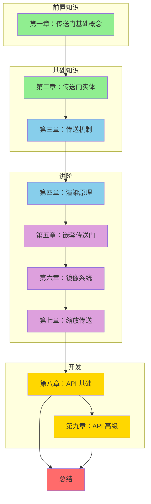

# ImmersivePortalsMod 教程系列

> 从入门到精通，手把手教你掌握跨维度传送门开发！

---

## 课程介绍

欢迎来到 **ImmersivePortalsMod 教程系列**！本系列教程将带你从零开始，深入理解并掌握 ImmersivePortalsMod 的开发技能。

### 你将学到什么？

| 能力 | 描述 |
|------|------|
| **传送门创建** | 使用 PortalAPI 动态创建和管理传送门 |
| **位置与方向控制** | 掌握四元数、轴向向量设置传送门朝向 |
| **维度变换** | 实现跨维度传送、缩放传送、旋转传送 |
| **嵌套传送门** | 理解多层传送门的递归渲染机制 |
| **镜像与缩放** | 掌握反射变换和大小缩放 |
| **实体行为控制** | 使用 ImmPtlEntityExtension 控制实体传送逻辑 |
| **模组集成** | 将传送门功能集成到你的 Mod 中 |

### 学习路线图



---

## 课程大纲

| 章节 | 标题 | 主要内容 | 难度 |
|------|------|----------|------|
| 第一章 | 传送门基础概念 | ImmersivePortalsMod 简介、与原版对比、核心能力 | ⭐ |
| 第二章 | 传送门实体 | Portal 类结构、四大属性、变换数学 | ⭐ |
| 第三章 | 传送机制 | 服务端/客户端传送管理器、碰撞检测、双向传送 | ⭐⭐ |
| 第四章 | 渲染原理 | PortalRenderer、Stencil、帧缓冲区、嵌套渲染 | ⭐⭐ |
| 第五章 | 嵌套传送门 | 递归渲染、层数限制、应用场景 | ⭐⭐ |
| 第六章 | 镜像系统 | Mirror 类、反射变换、应用示例 | ⭐⭐ |
| 第七章 | 缩放传送 | 巨型/微型传送门、缩放数学 | ⭐⭐ |
| 第八章 | API 基础 | PortalAPI、创建传送门、配置属性 | ⭐⭐⭐ |
| 第九章 | API 高级 | ImmPtlEntityExtension、自定义生成器、集成示例 | ⭐⭐⭐⭐ |

---

## 目录

### 第一部分：前置知识

- [第一章：传送门基础概念](./Part-0-Prerequisites/01-portal-intro.md)

### 第二部分：基础知识

- [第二章：传送门实体](./Part-1-Foundation/02-portal-entity.md)
- [第三章：传送机制](./Part-1-Foundation/03-teleportation-basics.md)

### 第三部分：进阶

- [第四章：渲染原理](./Part-2-Rendering/04-portal-rendering.md)
- [第五章：嵌套传送门](./Part-3-Advanced/05-nested-portals.md)
- [第六章：镜像系统](./Part-3-Advanced/06-mirror-system.md)
- [第七章：缩放传送](./Part-3-Advanced/07-scaling-portals.md)

### 第四部分：开发

- [第八章：API 基础](./Part-4-Development/08-portal-api-basics.md)
- [第九章：API 高级](./Part-4-Development/09-portal-api-advanced.md)

### 总结

- [教程总结](./SUMMARY.md)

---

## 第一章：传送门基础概念

> **学习目标**：理解 ImmersivePortalsMod 的核心能力，与原版传送门进行对比

**核心内容**：
- ImmersivePortalsMod 是什么
- 与原版传送门的对比（加载屏幕 vs 无缝）
- 核心能力：无加载屏幕、嵌套渲染、缩放传送
- 关键术语解释

**快速链接**：[01-portal-intro.md](./Part-0-Prerequisites/01-portal-intro.md)

---

## 第二章：传送门实体

> **学习目标**：理解传送门作为实体的运作方式，掌握 Portal 类的核心属性

**核心内容**：
- Portal 类继承结构
- 传送门的四大属性：axisW、axisH、destination、rotation
- 变换数学基础简介

**快速链接**：[02-portal-entity.md](./Part-1-Foundation/02-portal-entity.md)

---

## 第三章：传送机制

> **学习目标**：理解玩家如何被传送到目标位置

**核心内容**：
- 传送流程图（服务端/客户端协作）
- ServerTeleportationManager vs ClientTeleportationManager
- 碰撞检测触发传送
- 双向传送原理

**快速链接**：[03-teleportation-basics.md](./Part-1-Foundation/03-teleportation-basics.md)

---

## 第四章：渲染原理

> **学习目标**：理解传送门如何渲染目标世界

**核心内容**：
- PortalRenderer 架构
- Stencil 模板缓冲原理
- 帧缓冲区切换
- 嵌套渲染层简介

**快速链接**：[04-portal-rendering.md](./Part-2-Rendering/04-portal-rendering.md)

---

## 第五章：嵌套传送门

> **学习目标**：理解多层传送门的递归渲染机制

**核心内容**：
- 嵌套层数限制（最多 6 层）
- 递归渲染机制
- 嵌套传送门应用场景

**快速链接**：[05-nested-portals.md](./Part-3-Advanced/05-nested-portals.md)

---

## 第六章：镜像系统

> **学习目标**：理解镜像实体的反射变换

**核心内容**：
- Mirror 类继承自 Portal
- 反射变换数学
- 镜像创建示例

**快速链接**：[06-mirror-system.md](./Part-3-Advanced/06-mirror-system.md)

---

## 第七章：缩放传送

> **学习目标**：理解大小缩放传送门

**核心内容**：
- scaleTransformation 属性
- 巨型传送门（scale > 1）
- 微型传送门（scale < 1）

**快速链接**：[07-scaling-portals.md](./Part-3-Advanced/07-scaling-portals.md)

---

## 第八章：API 基础

> **学习目标**：学会使用 PortalAPI 创建传送门

**核心内容**：
- PortalAPI 主要方法
- 创建传送门完整示例
- 设置传送门位置和方向
- 开发者第一个实验

**快速链接**：[08-portal-api-basics.md](./Part-4-Development/08-portal-api-basics.md)

---

## 第九章：API 高级

> **学习目标**：使用 ImmPtlEntityExtension 控制实体行为

**核心内容**：
- ImmPtlEntityExtension 接口
- 自定义传送门生成器
- 完整模组集成示例

**快速链接**：[09-portal-api-advanced.md](./Part-4-Development/09-portal-api-advanced.md)

---

## 前置要求

在开始本系列教程之前，你需要具备以下知识：

| 要求 | 说明 | 资源 |
|------|------|------|
| **Java 基础** | 熟悉类、接口、继承等概念 | Minecraft 1.21 教程 |
| **Fabric Mod 开发** | 了解 Mod 结构、注册机制 | Fabric 教程系列 |
| **Minecraft 实体系统** | Entity、ServerLevel 等基础 | 实体系统教程 |
| **三维数学基础** | 了解向量、四元数的概念 | 可选补充 |

### 推荐学习顺序

```
1. Fabric 基础教程
2. Minecraft 实体系统
3. ImmersivePortalsMod 第一章 ~ 第三章（基础）
4. ImmersivePortalsMod 第四章 ~ 第七章（进阶）
5. ImmersivePortalsMod 第八章 ~ 第九章（开发）
```

---

## 常见问题

### Q1: 如何获取 PortalAPI？

**A**: PortalAPI 是一个工具类，直接使用其静态方法即可：

```java
import qouteall.imm_ptl.core.api.PortalAPI;
```

### Q2: 传送门创建后需要同步吗？

**A**: 是的！修改传送门属性后必须调用 `reloadAndSyncToClient()` 同步到客户端。

### Q3: 可以在客户端创建传送门吗？

**A**: `PortalAPI` 的大部分方法只能在服务器端调用。客户端可以使用 Mixin 或事件来间接创建。

### Q4: 如何调试传送门问题？

**A**:
1. 使用 `/portal_debug` 命令查看传送门状态
2. 检查 `isPortalValid()` 返回值
3. 确认目标维度和位置是否有效

---

## 相关资源

### 分析文档

| 文档 | 说明 |
|------|------|
| [08-public-api.md](../analysis/08-public-api.md) | 公共 API 详细分析 |
| [02-portal-entity.md](../analysis/02-portal-entity.md) | 传送门实体系统 |
| [03-teleportation-system.md](../analysis/03-teleportation-system.md) | 传送系统 |
| [04-rendering-system.md](../analysis/04-rendering-system.md) | 渲染系统 |

### 源码路径

```
D:\Minecraft-Learning\assets\ImmersivePortalsMod-6.0.6-mc1.21.1\src\main\java\qouteall\imm_ptl\core\
├── Portal.java                      # 核心传送门实体
├── api/
│   ├── PortalAPI.java               # 核心 API
│   └── ImmPtlEntityExtension.java   # 实体扩展接口
├── teleportation/
│   └── ServerTeleportationManager.java  # 传送管理
└── render/
    └── PortalRenderer.java          # 渲染器
```

---

## 下一步

准备好开始学习了吗？

- [第一章：传送门基础概念](./Part-0-Prerequisites/01-portal-intro.md) →
- [查看架构总结](../analysis/SUMMARY.md)

---

**提示**：建议按照教程顺序学习，每章都有配套的代码示例，可以直接在游戏中测试！
