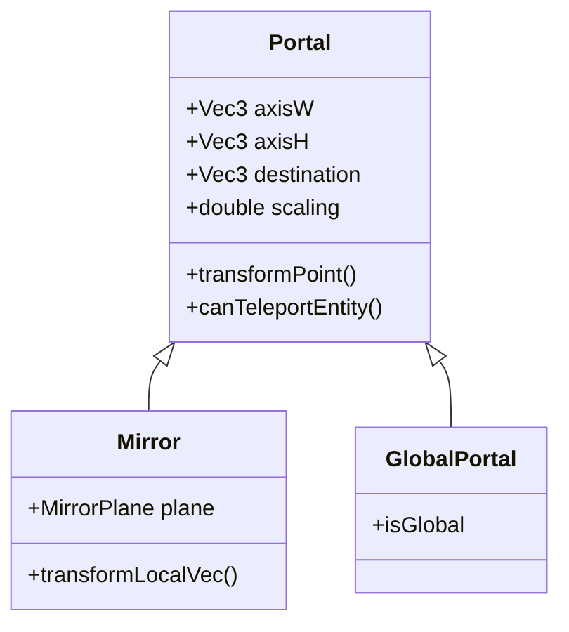
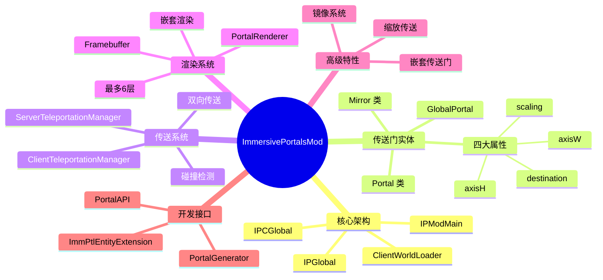

# ImmersivePortalsMod 教程总结

> 恭喜你完成了 ImmersivePortalsMod 教程系列的学习！本篇总结将帮助你回顾所有知识点，并指引下一步的学习方向。

---

## 目录

- [学习路径回顾](#学习路径回顾)
- [核心概念总结](#核心概念总结)
- [知识点思维导图](#知识点思维导图)
- [常见问题解答](#常见问题解答)
- [下一步学习建议](#下一步学习建议)

---

## 学习路径回顾

```
mermaid
flowchart LR
    subgraph 入门
        A[第一章：传送门基础] --> B[第二章：传送门实体]
    end

    subgraph 进阶
        B --> C[第三章：传送机制]
        C --> D[第四章：渲染原理]
    end

    subgraph 高级
        D --> E[第五章：嵌套传送门]
        E --> F[第六章：镜像系统]
        F --> G[第七章：缩放传送]
    end

    subgraph 开发
        G --> H[第八章：API基础]
        H --> I[第九章：API高级]
    end

    style A fill:#90EE90
    style I fill:#87CEEB
```

### 你学到了什么？

| 章节 | 主题 | 关键收获 |
|------|------|----------|
| 第0章 | 传送门基础 | 理解 ImmersivePortalsMod 的核心能力 |
| 第1章 | 传送门实体 | 掌握 Portal 类的结构和工作原理 |
| 第2章 | 传送机制 | 理解服务端/客户端传送管理 |
| 第3章 | 渲染原理 | 学习帧缓冲区和递归渲染 |
| 第4章 | 嵌套传送门 | 掌握多层嵌套的递归渲染 |
| 第5章 | 镜像系统 | 理解反射变换 |
| 第6章 | 缩放传送 | 掌握大小缩放变换 |
| 第7章 | API 基础 | 使用 PortalAPI 创建传送门 |
| 第8章 | API 高级 | 自定义传送门生成器 |

---

## 核心概念总结

### 1. Portal 实体



### 2. 传送流程

```
┌─────────────────────────────────────────────────────────┐
│                    完整传送流程                          │
├─────────────────────────────────────────────────────────┤
│                                                         │
│  1. 玩家穿过传送门平面                                    │
│         │                                               │
│         ▼                                               │
│  2. 客户端碰撞检测触发                                   │
│         │                                               │
│         ▼                                               │
│  3. 客户端预测传送（无等待）                             │
│         │                                               │
│         ▼                                               │
│  4. 发送传送请求到服务端                                 │
│         │                                               │
│         ▼                                               │
│  5. 服务端验证并同步状态                                 │
│         │                                               │
│         ▼                                               │
│  6. 客户端更新渲染上下文                                 │
│                                                         │
└─────────────────────────────────────────────────────────┘
```

### 3. 变换类型

| 变换类型 | 说明 | 代码设置 |
|----------|------|----------|
| **平移** | 位置移动 | `setDestination()` |
| **旋转** | 视角旋转 | `setRotation()` |
| **缩放** | 大小变化 | `setScaling()` |
| **反射** | 镜像翻转 | Mirror 类实现 |

---

## 知识点思维导图



---

## 常见问题解答

### Q1：为什么传送门最多支持6层嵌套？

**A**：每层嵌套都需要额外的帧缓冲区渲染和坐标变换计算。6层已经是性能和视觉效果之间的最佳平衡。超过6层会导致：
- 渲染性能急剧下降
- 内存占用大幅增加
- 可能出现视觉错误

### Q2：客户端预测传送是什么？

**A**：为了让传送感觉"即时"，客户端会在服务端确认之前就先执行传送。这提供了流畅的游戏体验，即使网络有延迟。

### Q3：Mirror 和普通 Portal 有什么区别？

**A**：主要区别在于变换类型：
- **普通 Portal**：使用四元数旋转
- **Mirror**：使用轴向反射（关于 YZ/XZ/XY 平面的镜像）

### Q4：缩放传送门有什么限制？

**A**：
- 最小缩放：`0.0625`（1/16）
- 最大缩放：`16.0`
- 超过限制可能导致碰撞检测问题

### Q5：如何调试传送门问题？

**A**：
1. 使用 `/portal_debug` 命令查看传送门状态
2. 检查服务端日志中的传送验证信息
3. 使用 F3 调试屏幕查看维度信息

---

## 下一步学习建议

### 1. 深入研究源码

```
D:\Minecraft-Learning\assets\ImmersivePortalsMod-6.0.6-mc1.21.1\src\main\java\qouteall\imm_ptl\core\
```

推荐阅读顺序：
1. `Portal.java` - 核心传送门实体
2. `teleportation/ServerTeleportationManager.java` - 传送逻辑
3. `render/PortalRenderer.java` - 渲染管线
4. `api/PortalAPI.java` - 公共 API

### 2. 扩展学习方向

| 方向 | 推荐学习内容 |
|------|--------------|
| **Shader 开发** | 学习 Iris 渲染器自定义 |
| **Mixin 深入** | 掌握字节码注入技术 |
| **网络同步** | 研究数据包处理机制 |
| **性能优化** | 学习帧缓冲区管理 |

### 3. 实践项目建议

```
初学者项目：
├── 回家传送门物品
├── 维度专属传送门
└── 传送门标记系统

进阶项目：
├── 自定义传送门生成器
├── 传送门谜题地图
├── 多维度基地系统
└── 传送门交通网络

高级项目：
├── 自定义渲染效果
├── 传送门 API 模组
├── 嵌套传送门迷宫生成器
└── 缩放传送门空间折叠系统
```

### 4. 相关资源

- **源码仓库**：[qouteall/ImmersivePortals](https://github.com/qouteall/ImmersivePortals)
- **Minecraft Wiki**：[Portal (Mechanism)](https://minecraft.fandom.com/wiki/Portal_(Mechanism))
- **Fabric 文档**：[Fabric Wiki](https://fabricmc.net/wiki/)

---

## 课后评估

完成以下目标来检验你的学习成果：

- [ ] 能够解释 Portal 实体的四大属性
- [ ] 理解服务端和客户端传送管理器的协作
- [ ] 掌握嵌套传送门的递归渲染机制
- [ ] 能够创建简单的镜像传送门
- [ ] 理解缩放传送的数学原理
- [ ] 能够使用 PortalAPI 创建自定义传送门
- [ ] 完成至少一个实践项目

---

## 恭喜毕业！

🎉 **恭喜你完成了 ImmersivePortalsMod 教程系列！**

你现在已经掌握了：
- 传送门系统的核心架构
- 传送机制的工作原理
- 渲染管线的实现细节
- 高级特性（嵌套、镜像、缩放）
- 开发 API 的使用方法

希望这些知识能帮助你在 Minecraft 模组开发的道路上走得更远！

---

*教程版本：ImmersivePortalsMod 6.0.6 / Minecraft 1.21.1*

*返回 [教程首页](./README.md)*
