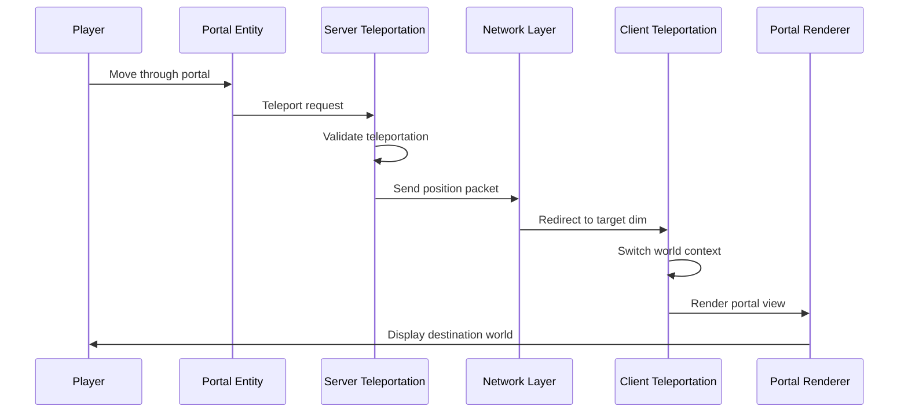

# ImmersivePortalsMod

ImmersivePortalsMod (qouteall) is a sophisticated Minecraft mod that provides cross-dimensional portal system with advanced features like nested portals, mirrors, scaling teleportation, and dynamic portals.

**Version**: 6.0.6-mc1.21.1
**Source**: [assets/ImmersivePortalsMod-6.0.6-mc1.21.1](https://github.com/qouteall/ImmersivePortals)

## Table of Contents

- [Overview](#overview)
- [Features](#features)
- [Documentation Structure](#documentation-structure)
- [Quick Links](#quick-links)
- [Key Concepts](#key-concepts)

## Overview

ImmersivePortalsMod extends Minecraft's vanilla portal system to enable seamless cross-dimensional travel without loading screens. The mod maintains synchronized client-side worlds and renders portal views in real-time.

## Features

| Feature | Description |
|---------|-------------|
| **Nested Portals** | Up to 6 layers of nested portals with recursive rendering |
| **Mirrors** | Reflective surfaces with configurable properties |
| **Scaling Teleportation** | Teleport entities at different scales (giant/mini portals) |
| **Global Portals** | Cross-dimensional persistent teleportation points |
| **Custom Portals** | Custom portal generation API for mod developers |
| **Animation Support** | Animated portal shapes and transformations |
| **World Wrapping** | Seamless world boundary teleportation |

## Documentation Structure

```
ImmersivePortalsMod/
├── analysis/                  # Architecture analysis documents
│   ├── 01-core-architecture.md      # Core classes and entry points
│   ├── 02-portal-entity.md         # Portal entity system
│   ├── 03-teleportation-system.md   # Teleportation mechanics
│   ├── 04-rendering-system.md       # Client-side rendering
│   ├── 05-network-sync.md          # Network synchronization
│   ├── 06-compatibility.md          # Sodium/Iris/Flywheel compatibility
│   ├── 07-mixin-system.md           # Mixin injection architecture
│   ├── 08-public-api.md             # Public API for developers
│   └── SUMMARY.md                   # Architecture summary
└── tutorials/                # (Coming soon)
```

## Quick Links

### Analysis Documents

| Document | Description | Reading Time |
|---------|-------------|-------------|
| [Architecture Summary](./analysis/SUMMARY.md) | High-level architecture overview | 20 min |
| [Core Architecture](./analysis/01-core-architecture.md) | Entry points, global state, helpers | 45 min |
| [Portal Entity System](./analysis/02-portal-entity.md) | Portal entity class and transformations | 40 min |
| [Teleportation System](./analysis/03-teleportation-system.md) | Server and client teleportation | 35 min |
| [Rendering System](./analysis/04-rendering-system.md) | Portal rendering pipeline | 40 min |
| [Network & Sync](./analysis/05-network-sync.md) | Multi-dimensional synchronization | 40 min |
| [Compatibility](./analysis/06-compatibility.md) | Third-party mod integration | 35 min |
| [Mixin System](./analysis/07-mixin-system.md) | Mixin injection architecture | 40 min |
| [Public API](./analysis/08-public-api.md) | API for mod developers | 30 min |

### Source Code Reference

```
D:\Minecraft-Learning\assets\ImmersivePortalsMod-6.0.6-mc1.21.1\src\main\java\qouteall\imm_ptl\core\
```

## Key Concepts

### Portal Architecture

```mermaid
flowchart LR
    subgraph Core["Core Systems"]
        IPModMain["IPModMain"]
        IPGlobal["IPGlobal"]
        IPCGlobal["IPCGlobal"]
    end

    subgraph Portal["Portal System"]
        Portal["Portal Entity"]
        Mirror["Mirror"]
        GlobalStorage["Global Portal Storage"]
    end

    subgraph Teleportation["Teleportation"]
        ServerTel["Server Teleportation"]
        ClientTel["Client Teleportation"]
        Collision["Collision Handler"]
    end

    subgraph Rendering["Rendering"]
        Renderer["Portal Renderer"]
        Layers["Portal Layers"]
        Context["Render Context"]
    end

    IPModMain --> IPGlobal
    IPModMain --> IPCGlobal
    Portal --> Teleportation
    Teleportation --> Rendering
    Core --> Portal
```

### Data Flow



## Core Classes

| Class | Purpose | Side |
|-------|---------|------|
| `IPModMain` | Mod initialization and registration | Common |
| `IPGlobal` | Server-side global state and events | Server |
| `IPCGlobal` | Client-side rendering state | Client |
| `ClientWorldLoader` | Multi-world management | Client |
| `Portal` | Core portal entity | Common |
| `ServerTeleportationManager` | Server-side teleportation logic | Server |
| `ClientTeleportationManager` | Client-side prediction | Client |
| `PortalRenderer` | Portal rendering orchestration | Client |

## Mod Compatibility

### Supported Mods

| Mod | Integration Type |
|-----|-----------------|
| **Sodium** | Chunk rendering context switching |
| **Iris** | Shader compatibility with secondary framebuffer |
| **Flywheel** | Instanced rendering compatibility |

### Compatibility Detection

The mod uses Mixin conditional loading to detect mod presence at compile time, avoiding runtime class loading issues.

## Extension Points

For mod developers:

1. **PortalAPI** - Create and manage portals programmatically
2. **ImmPtlEntityExtension** - Control entity teleportation behavior
3. **Custom Portal Generation** - Define custom portal shapes and triggers
4. **Portal Rendering Hooks** - Add custom rendering effects

See [Public API](./analysis/08-public-api.md) for details.

## License

This mod's source code is available under the LGPL-3.0 license in the assets folder.

## Contributing

For development questions, refer to the source code documentation or the game's official modding community.
