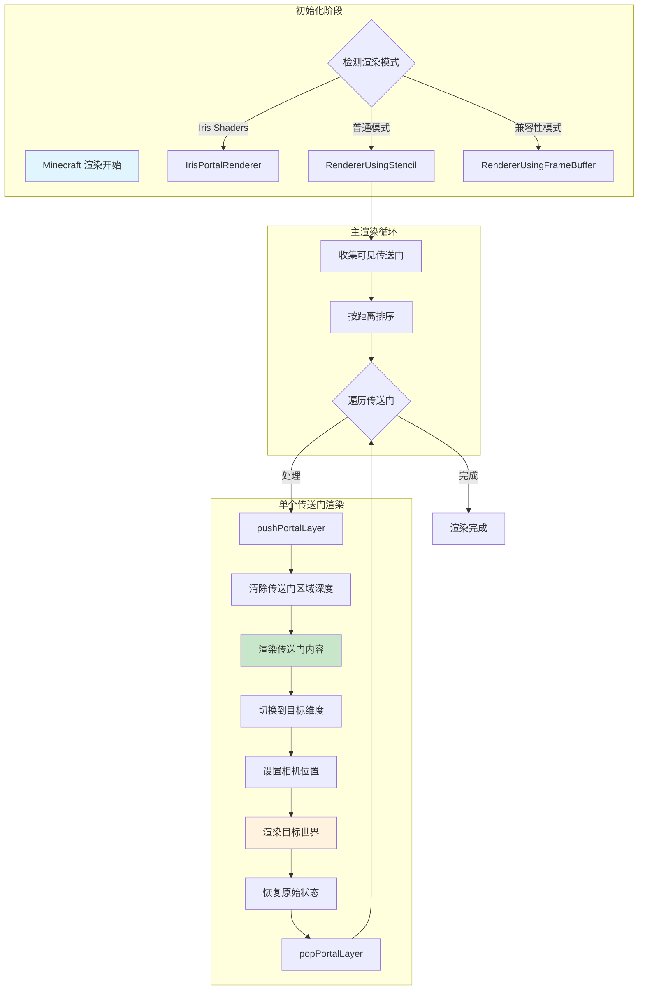
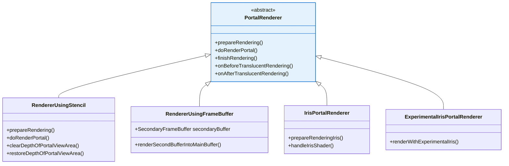
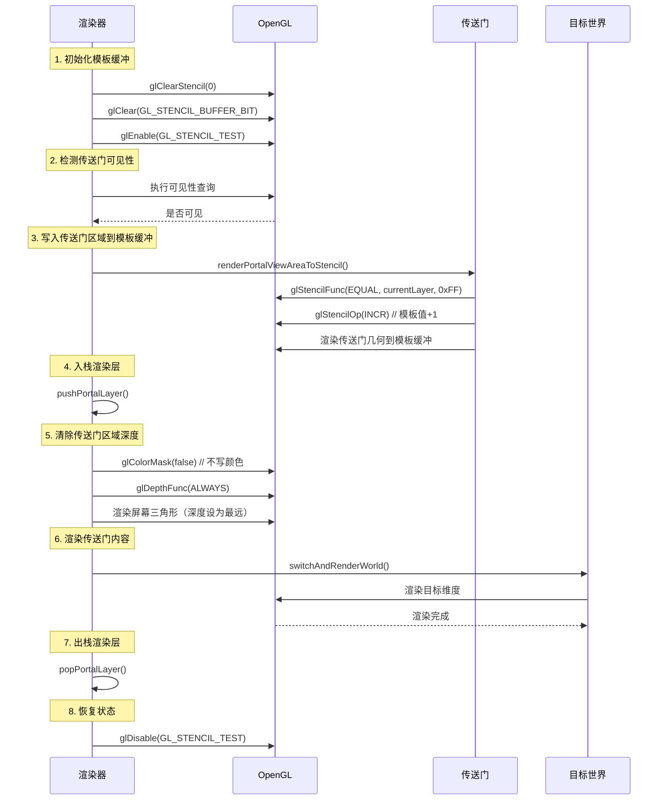
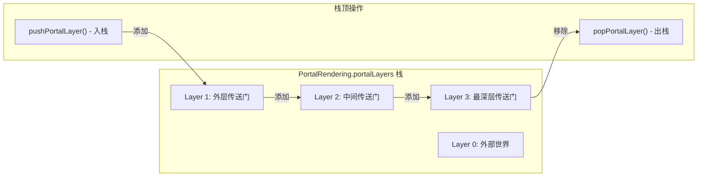

# 第四章：传送门渲染原理

> **本章目标**：深入理解 ImmersivePortalsMod 如何实现"透过传送门看世界"的视觉效果，掌握渲染管线的核心概念。

---

## 目录

- [目标](#目标)
- [前置知识](#前置知识)
- [传送门渲染的核心挑战](#传送门渲染的核心挑战)
- [渲染管线流程图](#渲染管线流程图)
- [PortalRenderer 架构](#portalrenderer-架构)
- [Stencil 渲染器原理](#stencil-渲染器原理)
- [帧缓冲区切换概念](#帧缓冲区切换概念)
- [嵌套渲染层简介](#嵌套渲染层简介)
- [简化渲染流程示例](#简化渲染流程示例)
- [课后自查](#课后自查)

---

## 目标

学完本章后，你将理解：

1. **传送门渲染的核心挑战** - 为什么普通的渲染方式无法实现传送门效果
2. **渲染管线流程** - 传送门内容是如何被渲染到屏幕上的
3. **Stencil 模板缓冲** - 如何用模板缓冲限制渲染区域
4. **PortalRenderer 架构** - 渲染器的组织结构
5. **嵌套渲染层** - 多层传送门如何递归渲染

---

## 前置知识

- 了解 Minecraft 基本的渲染流程
- 知道 GPU 的基本概念（显卡负责画图）
- 了解 Java 面向对象编程（类、继承、抽象类）
- 知道什么是 **OpenGL**（一种图形 API）

---

## 传送门渲染的核心挑战

### 什么是传送门渲染？

当你站在传送门前，往里看时，你看到的不是传送门本身的纹理，而是**另一个维度的世界**！

```
┌─────────────────────────────────────────────────────────────┐
│                      普通方块渲染                             │
├─────────────────────────────────────────────────────────────┤
│                                                               │
│   玩家视角                                                      │
│       ↓                                                        │
│   [屏幕像素] ← [渲染器] ← [方块数据]                            │
│                                                               │
│   💡 简单明了：输入是方块，输出是像素                            │
│                                                               │
└─────────────────────────────────────────────────────────────┘

┌─────────────────────────────────────────────────────────────┐
│                      传送门渲染                               │
├─────────────────────────────────────────────────────────────┤
│                                                               │
│   玩家视角                                                      │
│       ↓                                                        │
│   [屏幕像素] ← [渲染器] ← [传送门] ← [目标维度的世界]           │
│                                                               │
│   💡 复杂：需要渲染"另一个世界"的内容                           │
│                                                               │
└─────────────────────────────────────────────────────────────┘
```

### 核心挑战

| 挑战 | 描述 | 为什么困难 |
|------|------|-----------|
| **跨维度渲染** | 渲染完全不同的世界 | 需要切换世界上下文 |
| **正确的深度** | 传送门内容要与外部世界正确叠加 | 深度缓冲需要特殊处理 |
| **区域限制** | 只渲染传送门框内的内容 | 超出部分要"裁剪"掉 |
| **多层嵌套** | 传送门内再看向传送门 | 递归渲染 |

---

## 渲染管线流程图

### 完整渲染流程



### 渲染状态变化

```
┌─────────────────────────────────────────────────────────────┐
│                   单帧渲染的状态变化                           │
├─────────────────────────────────────────────────────────────┤
│                                                               │
│  帧开始                                                       │
│     ↓                                                         │
│  [当前维度: 主世界]  [相机: 玩家位置]                           │
│     ↓                                                         │
│  检测到传送门                                                   │
│     ↓                                                         │
│  pushPortalLayer()                                           │
│     ↓                                                         │
│  [当前维度: 主世界]  [相机: 玩家位置]  [层数: 1]                 │
│     ↓                                                         │
│  渲染传送门内容                                                 │
│     ↓                                                         │
│  switchWorld() → [当前维度: 下界]  [相机: 目标位置]             │
│     ↓                                                         │
│  渲染下界的世界...                                             │
│     ↓                                                         │
│  restoreWorld() → [当前维度: 主世界]  [相机: 玩家位置]          │
│     ↓                                                         │
│  popPortalLayer()                                            │
│     ↓                                                         │
│  [当前维度: 主世界]  [相机: 玩家位置]  [层数: 0]                 │
│     ↓                                                         │
│  帧结束 → 显示画面                                              │
│                                                               │
└─────────────────────────────────────────────────────────────┘
```

---

## PortalRenderer 架构

### 渲染器类层次结构



### 渲染器选择逻辑

ImmersivePortalsMod 会根据不同情况选择最合适的渲染器：

```java
// D:\Minecraft-Learning\assets\ImmersivePortalsMod-6.0.6-mc1.21.1\src\main\java\qouteall\imm_ptl\core\render\renderer\PortalRenderer.java
public static void switchToCorrectRenderer() {
    if (PortalRendering.isRendering()) {
        return;  // 已经在渲染中，跳过
    }

    // 根据配置选择渲染器
    if (IrisInterface.invoker.isIrisPresent()) {
        // Iris 光影 mod 存在
        if (IrisInterface.invoker.isShaders()) {
            if (IPCGlobal.experimentalIrisPortalRenderer) {
                switchRenderer(ExperimentalIrisPortalRenderer.instance);
            } else {
                switchRenderer(IrisPortalRenderer.instance);
            }
        }
    } else {
        // 没有 Iris，使用标准渲染器
        switch (IPGlobal.renderMode) {
            case normal -> switchRenderer(IPCGlobal.rendererUsingStencil);
            case compatibility -> switchRenderer(IPCGlobal.rendererUsingFrameBuffer);
        }
    }
}
```

### 三种渲染器对比

| 渲染器 | 原理 | 性能 | 嵌套支持 | 适用场景 |
|--------|------|------|----------|----------|
| **Stencil** | 使用模板缓冲限制区域 | ⭐⭐⭐⭐⭐ | 支持多层 | 默认首选 |
| **FrameBuffer** | 渲染到辅助缓冲区 | ⭐⭐⭐ | 仅单层 | 兼容性模式 |
| **Iris** | 集成 Iris 管线 | ⭐⭐⭐⭐ | 支持 | 使用光影时 |

---

## Stencil 渲染器原理

### 什么是模板缓冲（Stencil Buffer）？

**模板缓冲**是 OpenGL 提供的一种像素级蒙版机制，可以理解为一层"遮罩"：

```
┌─────────────────────────────────────────────────────────────┐
│                      模板缓冲原理                            │
├─────────────────────────────────────────────────────────────┤
│                                                               │
│  主缓冲区（颜色）  │  深度缓冲区  │  模板缓冲区                 │
│  ┌─────────────┐  │ ┌─────────┐ │ ┌─────────┐              │
│  │ RGB 颜色    │  │ │ 深度值  │ │ │ 0 或 1  │              │
│  └─────────────┘  │ └─────────┘ │ └─────────┘              │
│                                                               │
│  💡 模板缓冲 = 像素级别的"通行证"                              │
│     只有模板值为 1 的像素才会被渲染                            │
│                                                               │
└─────────────────────────────────────────────────────────────┘
```

### Stencil 渲染的核心步骤



### 模板值管理

模板值用于追踪传送门的嵌套层级：

```
┌─────────────────────────────────────────────────────────────┐
│                      模板值层级管理                          │
├─────────────────────────────────────────────────────────────┤
│                                                               │
│  Layer 0（最外层）：传送门区域模板值 = 1                       │
│     ↓                                                         │
│  Layer 1（嵌套层）：传送门区域模板值 = 2                       │
│     ↓                                                         │
│  Layer 2（更深层）：传送门区域模板值 = 3                       │
│                                                               │
│  💡 使用 glStencilOp(INCR) 每进入一层就 +1                      │
│                                                               │
└─────────────────────────────────────────────────────────────┘
```

```java
// 模板缓冲写入核心逻辑
private void renderPortalViewAreaToStencil(Portal portal) {
    int outerPortalStencilValue = PortalRendering.getPortalLayer();

    // 只渲染当前层级的像素（模板值等于当前层级）
    GL11.glStencilFunc(GL_EQUAL, outerPortalStencilValue, 0xFF);

    // 如果模板和深度测试都通过，增加模板值
    GL11.glStencilOp(GL_KEEP, GL_KEEP, GL_INCR);

    // 渲染传送门可视区域
    ViewAreaRenderer.renderPortalArea(portal, ...);
}
```

---

## 帧缓冲区切换概念

### 为什么需要帧缓冲区？

**帧缓冲区（Framebuffer）** 是 GPU 内存中的一块区域，用来存储渲染结果。

当你透过传送门看时，需要：
1. 在**辅助缓冲区**中渲染目标世界
2. 把辅助缓冲区的内容**绘制到主缓冲区**的传送门区域

```
┌─────────────────────────────────────────────────────────────┐
│                    帧缓冲区切换流程                           │
├─────────────────────────────────────────────────────────────┤
│                                                               │
│  主帧缓冲区（屏幕）                                           │
│  ┌─────────────────────────────┐                           │
│  │  普通世界内容                │                           │
│  │  ┌─────────┐                │                           │
│  │  │ 传送门   │ ← 需要填充这里 │                           │
│  │  │ 区域    │                │                           │
│  │  └─────────┘                │                           │
│  └─────────────────────────────┘                           │
│                                                               │
│       ↓ copyTexture()                                        │
│                                                               │
│  辅助帧缓冲区                                                 │
│  ┌─────────────────────────────┐                           │
│  │ 目标维度的内容               │                           │
│  │                             │                           │
│  │                             │                           │
│  └─────────────────────────────┘                           │
│                                                               │
└─────────────────────────────────────────────────────────────┘
```

### FrameBuffer 渲染器的限制

```java
// D:\Minecraft-Learning\assets\ImmersivePortalsMod-6.0.6-mc1.21.1\src\main\java\qouteall\imm_ptl\core\render\renderer\RendererUsingFrameBuffer.java
@Override
protected void doRenderPortal(Portal portal) {
    // FrameBuffer 渲染器不支持嵌套渲染！
    if (PortalRendering.isRendering()) {
        return;
    }

    // 1. 保存当前帧缓冲
    RenderTarget oldFrameBuffer = client.getMainRenderTarget();

    // 2. 切换到辅助帧缓冲
    secondaryFrameBuffer.fb.bindWrite(true);
    GlStateManager._clearColor(1, 0, 1, 1);  // 清除为洋红色
    GlStateManager._clearDepth(1);
    GlStateManager._clear(GL_COLOR_BUFFER_BIT | GL_DEPTH_BUFFER_BIT);

    // 3. 渲染传送门内容
    renderPortalContent(portal);

    // 4. 恢复主帧缓冲
    oldFrameBuffer.bindWrite(true);

    // 5. 将辅助帧缓冲绘制到主帧缓冲
    renderSecondBufferIntoMainBuffer(portal);
}
```

> **💡 为什么不用 FrameBuffer 实现嵌套？**
>
> 因为每层嵌套都需要一个新的辅助缓冲区，内存开销太大！
> Stencil 渲染器只需要一个模板值变量，就能追踪无限层级。

---

## 嵌套渲染层简介

### 什么是嵌套传送门？

**嵌套传送门**就是站在传送门内，再看向另一个传送门：

```
┌─────────────────────────────────────────────────────────────┐
│                      嵌套传送门示意                           │
├─────────────────────────────────────────────────────────────┤
│                                                               │
│  玩家站在传送门 A 内，看向传送门 B                             │
│                                                               │
│       玩家                                                    │
│         ↓                                                     │
│   ┌───────────────────┐                                      │
│   │   传送门 A        │                                      │
│   │  ┌───────────┐   │                                      │
│   │  │ 传送门 B  │   │                                      │
│   │  │           │   │                                      │
│   │  └───────────┘   │                                      │
│   └───────────────────┘                                      │
│                                                               │
│  A → 主世界                                                   │
│  B → 下界                                                     │
│                                                               │
│  玩家实际看到的是：下界通过传送门 B 的内容                      │
│                                                               │
└─────────────────────────────────────────────────────────────┘
```

### Portal Layer 栈



### 层数限制

为了性能和安全，传送门嵌套层数有限制：

```java
// D:\Minecraft-Learning\assets\ImmersivePortalsMod-6.0.6-mc1.21.1\src\main\java\qouteall\imm_ptl\core\render\context_management\PortalRendering.java
public static int getMaxPortalLayer() {
    if (RenderStates.isLaggy) {
        return 1;  // 卡顿时只允许单层
    }
    return IPGlobal.maxPortalLayer;  // 默认是 6
}
```

| 配置 | 最大层数 | 说明 |
|------|----------|------|
| 默认 | 6 | 性能与功能平衡 |
| 卡顿时 | 1 | 保障基本可用 |
| 可配置 | 1-16 | 通过配置文件调整 |

---

## 简化渲染流程示例

### 伪代码实现

以下是传送门渲染的简化实现，帮助你理解核心逻辑：

```java
/**
 * 传送门渲染简化伪代码
 */
public class SimplifiedPortalRenderer {

    public void renderPortal(Portal portal) {
        // 1. 检测传送门是否可见
        if (!isPortalVisible(portal)) {
            return;
        }

        // 2. 入栈渲染层
        PortalRendering.pushPortalLayer(portal);

        // 3. 清除传送门区域的深度值
        clearDepthInPortalArea(portal);

        // 4. 渲染传送门内容
        renderPortalContent(portal);

        // 5. 出栈渲染层
        PortalRendering.popPortalLayer();
    }

    private void renderPortalContent(Portal portal) {
        // 4a. 获取目标世界和位置
        ClientLevel destWorld = ClientWorldLoader.getWorld(portal.getDestDim());
        Vec3 cameraPos = portal.transformPoint(getCameraPos());

        // 4b. 创建世界渲染信息
        WorldRenderInfo info = new WorldRenderInfo.Builder()
            .setWorld(destWorld)
            .setCameraPos(cameraPos)
            .setCameraTransformation(portal.getAdditionalCameraTransformation())
            .build();

        // 4c. 切换世界并渲染
        switchAndRenderWorld(info);
    }

    private void switchAndRenderWorld(WorldRenderInfo info) {
        // 保存当前世界状态
        ClientLevel originalWorld = getCurrentWorld();

        try {
            // 切换到目标世界
            setCurrentWorld(info.world);

            // 设置相机
            setCameraPosition(info.cameraPos);
            applyCameraTransformation(info.cameraTransformation);

            // 渲染世界
            renderWorld(info.renderDistance);

        } finally {
            // 恢复原始世界
            setCurrentWorld(originalWorld);
        }
    }
}
```

### 相机变换

当渲染嵌套传送门时，相机位置需要经过多次变换：

```java
// 获取当前渲染相机位置（考虑所有嵌套传送门）
public static Vec3 getRenderingCameraPos() {
    Vec3 pos = RenderStates.originalCamera.getPosition();

    // 依次应用每个传送门的变换
    for (Portal portal : portalLayers) {
        pos = portal.transformPoint(pos);
    }

    return pos;
}
```

```
┌─────────────────────────────────────────────────────────────┐
│                    嵌套相机变换示意                           │
├─────────────────────────────────────────────────────────────┤
│                                                               │
│  Layer 0: 原始相机位置 P0                                    │
│     ↓ transformPoint(Portal1)                                 │
│  Layer 1: P1 = T1(P0)                                        │
│     ↓ transformPoint(Portal2)                                 │
│  Layer 2: P2 = T2(T1(P0))                                    │
│     ↓ transformPoint(Portal3)                                 │
│  Layer 3: P3 = T3(T2(T1(P0)))                               │
│                                                               │
│  💡 每一层的变换都会应用到下一层！                              │
│                                                               │
└─────────────────────────────────────────────────────────────┘
```

---

## 课后自查

完成本章节学习后，请确认你能回答以下问题：

- [ ] **Q1**: 传送门渲染的核心挑战是什么？为什么原版 Minecraft 无法实现"透过传送门看世界"？

- [ ] **Q2**: Stencil 渲染器的工作原理是什么？模板缓冲如何限制渲染区域？

- [ ] **Q3**: 为什么 FrameBuffer 渲染器不支持嵌套传送门？它的主要用途是什么？

- [ ] **Q4**: `pushPortalLayer()` 和 `popPortalLayer()` 的作用是什么？为什么需要配对使用？

- [ ] **Q5**: 传送门的最大嵌套层数是多少？如何配置？超过限制会怎样？

---

## 相关文档

| 文档 | 说明 |
|------|------|
| [02-portal-entity.md](../analysis/02-portal-entity.md) | 传送门实体系统详解 |
| [04-rendering-system.md](../analysis/04-rendering-system.md) | 完整渲染系统分析 |
| [SUMMARY.md](../analysis/SUMMARY.md) | 架构总结 |

---

## 附录：核心文件速查

| 功能 | 文件 |
|------|------|
| 渲染器基类 | `render/renderer/PortalRenderer.java` |
| Stencil 渲染器 | `render/renderer/RendererUsingStencil.java` |
| FrameBuffer 渲染器 | `render/renderer/RendererUsingFrameBuffer.java` |
| 渲染层管理 | `render/context_management/PortalRendering.java` |
| 世界渲染信息 | `render/context_management/WorldRenderInfo.java` |
| 可视区域渲染 | `render/ViewAreaRenderer.java` |
| 前向裁剪 | `render/FrontClipping.java` |

---

*文档版本：ImmersivePortalsMod 6.0.6, Minecraft 1.21.1*
*最后更新：2026-03-24*
