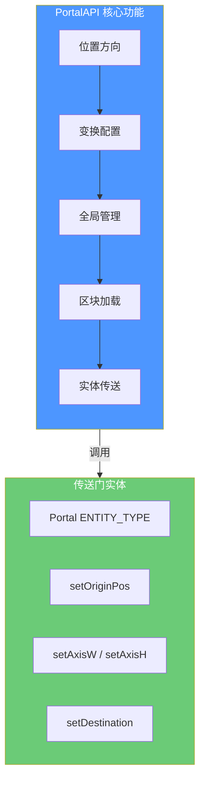

# 第 8 章：API 基础使用

> ⭐ **学习目标**：掌握 PortalAPI 的基本用法，能够创建和配置传送门

> ⚠️ **前置知识**：需要了解 Minecraft 实体系统、维度概念，以及基本的 Java 编程

---

## 目录

- [什么是 PortalAPI？](#什么是-portalapi)
- [导入与依赖配置](#导入与依赖配置)
- [创建第一个传送门](#创建第一个传送门)
- [设置位置与方向](#设置位置与方向)
- [设置目标维度与位置](#设置目标维度与位置)
- [开发者第一个实验](#开发者第一个实验)
- [课后自查](#课后自查)

---

## 什么是 PortalAPI？

**PortalAPI** 是 ImmersivePortalsMod 提供给其他模组开发者的核心工具类。它封装了传送门操作的各个方面，让开发者无需了解底层复杂的数学计算，就能轻松创建和管理传送门。

### PortalAPI 能做什么？

| 功能 | 方法 | 说明 |
|------|------|------|
| **位置方向** | `setPortalPositionOrientationAndSize` | 使用四元数设置传送门位置和朝向 |
| **传统形状** | `setPortalOrthodoxShape` | 使用 Direction 和 AABB 设置标准形状 |
| **变换配置** | `setPortalTransformation` | 设置目标维度、位置、旋转、缩放 |
| **辅助方法** | `createReversePortal` | 创建反向传送门 |
| **区块加载** | `addChunkLoaderForPlayer` | 为玩家添加区块加载器 |
| **实体传送** | `teleportEntity` | 直接传送实体 |

### 架构图



---

## 导入与依赖配置

### 添加依赖

首先，在你的 `build.gradle` 中添加 ImmersivePortalsMod 依赖：

```groovy
modImplementation "qouteall:ImmersivePortals:6.0.6-mc1.21.1"
```

### 导入 API 类

```java
import qouteall.imm_ptl.core.api.PortalAPI;
import qouteall.imm_ptl.core.portal.Portal;
import qouteall.q_misc_util.my_util.DQuaternion;
import net.minecraft.resources.ResourceKey;
import net.minecraft.resources.ResourceLocation;
import net.minecraft.world.level.Level;
import net.minecraft.world.level.LevelAccessor;
import net.minecraft.world.phys.Vec3;
import net.minecraft.core.Direction;
import net.minecraft.world.phys.AABB;
```

---

## 创建第一个传送门

### 完整流程概览

```
┌─────────────────────────────────────────────────────────────┐
│                    创建传送门流程                             │
├─────────────────────────────────────────────────────────────┤
│  1. 创建 Portal 实体                                        │
│     new Portal(Portal.ENTITY_TYPE, serverLevel)              │
│                                                             │
│  2. 设置位置和大小                                           │
│     portal.setOriginPos(position)                           │
│     portal.setWidth(4.0)                                    │
│     portal.setHeight(5.0)                                   │
│                                                             │
│  3. 设置朝向                                                 │
│     portal.setAxisW(Vec3.atLowerCornerOf(direction))        │
│     portal.setAxisH(Vec3.atLowerCornerOf(Direction.UP))     │
│                                                             │
│  4. 设置目标                                                 │
│     portal.setDestinationDimension(targetDim)               │
│     portal.setDestination(targetPos)                        │
│                                                             │
│  5. 生成传送门                                               │
│     serverLevel.addFreshEntity(portal)                      │
│                                                             │
│  6. 同步到客户端 ⭐                                          │
│     portal.reloadAndSyncToClient()                          │
└─────────────────────────────────────────────────────────────┘
```

### 基础示例代码

```java
public class PortalCreationExample {

    public static Portal createSimplePortal(
        ServerLevel world,
        Vec3 position,
        Direction facing
    ) {
        // 第一步：创建传送门实体
        Portal portal = new Portal(Portal.ENTITY_TYPE, world);

        // 第二步：设置位置
        // 使用 setPos 设置传送门的中心位置
        portal.setPos(position.x, position.y, position.z);

        // 第三步：设置大小
        portal.setWidth(4.0);   // 宽度 4 格
        portal.setHeight(5.0);  // 高度 5 格

        // 第四步：设置朝向
        // AxisW 是传送门的"宽度方向"，AxisH 是"高度方向"
        // facing.getNormal() 返回朝向的法向量
        portal.setAxisW(Vec3.atLowerCornerOf(facing.getNormal()));
        portal.setAxisH(new Vec3(0, 1, 0));  // 垂直向上

        // 第五步：设置目标维度（这里是末地）
        ResourceKey<Level> endDimension = ResourceKey.create(
            Level_REGISTRY,
            new ResourceLocation("minecraft:the_end")
        );
        portal.setDestinationDimension(endDimension);

        // 第六步：设置目标位置
        portal.setDestination(new Vec3(0, 65, 0));

        // 第七步：添加到世界（必须）
        world.addFreshEntity(portal);

        // 第八步：同步到客户端 ⭐ 重要！
        portal.reloadAndSyncToClient();

        return portal;
    }
}
```

💡 **提示**：`reloadAndSyncToClient()` 是必须的！如果不调用，客户端看不到传送门的变化。

---

## 设置位置与方向

PortalAPI 提供了两种设置传送门位置和方向的方法。

### 方法一：使用四元数（灵活但复杂）

**四元数（Quaternion）** 是一种表示三维旋转的数学工具，可以避免欧拉角的"万向锁"问题。

```java
public static void createPortalWithQuaternion(
    ServerLevel world,
    Vec3 position
) {
    Portal portal = new Portal(Portal.ENTITY_TYPE, world);

    // 创建四元数旋转：绕 Y 轴旋转 90 度
    // rotationByDegrees(轴, 角度)
    DQuaternion rotation = DQuaternion.rotationByDegrees(
        new Vec3(0, 1, 0),  // 绕 Y 轴
        90.0                // 旋转 90 度
    );

    // 使用 PortalAPI 设置位置、朝向和大小
    PortalAPI.setPortalPositionOrientationAndSize(
        portal,
        position,      // 传送门中心位置
        rotation,      // 四元数朝向
        3.0,           // 宽度
        4.0            // 高度
    );

    // 设置目标...
    portal.setDestinationDimension(ResourceKey.create(
        Level_REGISTRY,
        new ResourceLocation("minecraft:the_end")
    ));
    portal.setDestination(new Vec3(100, 65, 100));

    world.addFreshEntity(portal);
    portal.reloadAndSyncToClient();
}
```

### 方法二：使用传统参数（简单直观）

如果你只需要创建一个标准的轴对齐传送门，使用这个方法更简单：

```java
public static void createOrthodoxPortal(
    ServerLevel world,
    Vec3 centerPosition,
    Direction facing
) {
    Portal portal = new Portal(Portal.ENTITY_TYPE, world);

    // 定义传送门的包围盒（边界框）
    // 这个盒子会决定传送门的大小
    AABB portalArea = new AABB(
        centerPosition.x - 2, centerPosition.y, centerPosition.z - 0.5,
        centerPosition.x + 2, centerPosition.y + 5, centerPosition.z + 0.5
    );

    // 使用 PortalAPI 的便捷方法
    PortalAPI.setPortalOrthodoxShape(portal, facing, portalArea);

    // 设置目标...
    portal.setDestinationDimension(ResourceKey.create(
        Level_REGISTRY,
        new ResourceLocation("minecraft:the_end")
    ));
    portal.setDestination(new Vec3(0, 65, 0));

    world.addFreshEntity(portal);
    portal.reloadAndSyncToClient();
}
```

### 朝向示意图

```
        AxisH (高度方向)
            ▲
            │
            │
            │
            │
    ────────┼───────► AxisW (宽度方向)
           Portal
    
    传送门平面垂直于 facing 方向
```

---

## 设置目标维度与位置

### 维度变换核心方法

```java
public static void setPortalTransformation(
    Portal portal,
    ResourceKey<Level> destinationDimension,  // 目标维度
    Vec3 destinationPosition,                   // 目标位置
    @Nullable DQuaternion rotation,              // 旋转（可为 null）
    double scale                                // 缩放（1.0 = 正常）
) {
    portal.setDestinationDimension(destinationDimension);
    portal.setDestination(destinationPosition);
    portal.setRotation(rotation);              // 传送时的旋转
    portal.setScaleTransformation(scale);      // 传送时的缩放
}
```

### 使用示例

```java
public static Portal createEndPortal(ServerLevel overworld, Vec3 position) {
    Portal portal = new Portal(Portal.ENTITY_TYPE, overworld);

    // 设置位置和朝向
    portal.setPos(position.x, position.y, position.z);
    portal.setWidth(4.0);
    portal.setHeight(5.0);
    portal.setAxisW(new Vec3(0, 0, 1));  // 面向 Z 轴
    portal.setAxisH(new Vec3(0, 1, 0));  // 垂直向上

    // 设置目标维度：末地
    ResourceKey<Level> theEnd = ResourceKey.create(
        Level_REGISTRY,
        new ResourceLocation("minecraft:the_end")
    );

    // 设置变换：传送到末地的 (100, 65, 100) 位置，无旋转，1:1 缩放
    PortalAPI.setPortalTransformation(
        portal,
        theEnd,
        new Vec3(100, 65, 100),
        null,    // 无旋转
        1.0     // 正常大小
    );

    overworld.addFreshEntity(portal);
    portal.reloadAndSyncToClient();

    return portal;
}
```

### 常见维度 ID

| 维度 | ResourceLocation |
|------|-----------------|
| 主世界 | `minecraft:overworld` |
| 末地 | `minecraft:the_end` |
| 下界 | `minecraft:the_nether` |
| 自定义维度 | 你的 mod 注册的 ID |

### 缩放传送门

缩放因子允许你创建"变大"或"变小"的传送门：

```java
// 创建缩小传送门：进去后变成原来的一半
PortalAPI.setPortalTransformation(
    portal,
    targetDim,
    targetPos,
    null,
    0.5  // 缩放因子 0.5
);

// 创建放大传送门：进去后变成两倍
PortalAPI.setPortalTransformation(
    portal,
    targetDim,
    targetPos,
    null,
    2.0  // 缩放因子 2.0
);
```

---

## 开发者第一个实验

让我们创建一个完整的命令来测试！

### 实验目标

创建一个命令 `/createportal <x> <y> <z>`，在指定位置创建一个通向末地的传送门。

### 完整代码

```java
public class PortalCommands {

    public static void register(CommandDispatcher<CommandSource> dispatcher) {
        dispatcher.register(
            Commands.literal("createportal")
                .requires(source -> source.hasPermission(2))  // 需要管理员权限
                .then(Arguments.argument("pos", Vec3Argument.vec3())
                    .executes(context -> {
                        ServerLevel world = context.getSource().getLevel();
                        Vec3 pos = Vec3Argument.getVec3(context, "pos");

                        createEndPortal(world, pos);

                        context.getSource().sendSuccess(
                            () -> Component.literal("已创建传送到末地的传送门！"),
                            true
                        );

                        return 1;
                    })
                )
        );
    }

    private static void createEndPortal(ServerLevel world, Vec3 position) {
        // 创建传送门
        Portal portal = new Portal(Portal.ENTITY_TYPE, world);

        // 设置为面向南（-Z 方向）
        Direction facing = Direction.SOUTH;

        // 设置位置
        portal.setPos(position.x, position.y, position.z);
        portal.setWidth(3.0);
        portal.setHeight(4.0);
        portal.setAxisW(Vec3.atLowerCornerOf(facing.getNormal()));
        portal.setAxisH(new Vec3(0, 1, 0));

        // 设置目标
        ResourceKey<Level> theEnd = ResourceKey.create(
            Level_REGISTRY,
            new ResourceLocation("minecraft:the_end")
        );
        portal.setDestinationDimension(theEnd);
        portal.setDestination(new Vec3(0, 65, 0));

        // 添加到世界并同步
        world.addFreshEntity(portal);
        portal.reloadAndSyncToClient();

        // 创建反向传送门（从末地回来！）
        Portal reversePortal = PortalAPI.createReversePortal(portal);
        ServerLevel endWorld = world.getServer().getLevel(theEnd);
        if (endWorld != null) {
            endWorld.addFreshEntity(reversePortal);
            reversePortal.reloadAndSyncToClient();
        }
    }
}
```

### 测试步骤

1. **编译并运行游戏**
2. **进入游戏**，确保安装了 ImmersivePortalsMod
3. **打开聊天框**，输入 `/createportal 100 64 200`
4. **观察结果**：你应该能看到一个传送到末地的传送门
5. **走进传送门**：你应该被传送到末地
6. **从末地回来**：末地应该也有一个反向传送门

### 常见问题排查

| 问题 | 原因 | 解决方法 |
|------|------|----------|
| 传送门不显示 | 没有调用 `reloadAndSyncToClient()` | 添加同步调用 |
| 传送无效 | 目标维度不存在 | 检查维度 ID |
| 位置不对 | AxisW/AxisH 设置错误 | 确认法向量方向 |
| 游戏崩溃 | 在客户端调用了服务器方法 | 确保在服务器端执行 |

---

## 课后自查

- [ ] 能够在代码中导入 `PortalAPI` 和 `Portal`
- [ ] 理解传送门创建的 8 个步骤
- [ ] 知道 `reloadAndSyncToClient()` 的重要性
- [ ] 能够使用 `setPortalOrthodoxShape` 创建标准形状传送门
- [ ] 能够使用 `setPortalTransformation` 设置目标维度
- [ ] 理解 AxisW 和 AxisH 的作用
- [ ] 知道如何创建反向传送门

---

## 下一步

掌握了基础用法后，让我们继续学习更高级的应用！

👉 [第 9 章：API 高级应用](./09-portal-api-advanced.md)

---

**参考源码**：

- `PortalAPI.java` - `D:\Minecraft-Learning\assets\ImmersivePortalsMod-6.0.6-mc1.21.1\src\main\java\qouteall\imm_ptl\core\api\PortalAPI.java`
