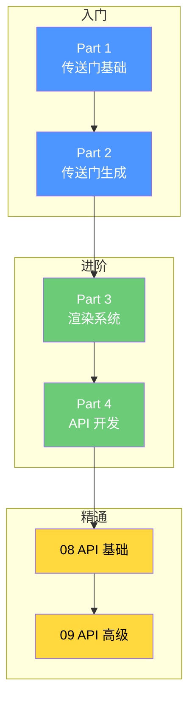

# ImmersivePortalsMod 教程系列

> 从入门到精通，手把手教你掌握跨维度传送门开发！

---

## 课程介绍

欢迎来到 **ImmersivePortalsMod 教程系列**！本系列教程将带你从零开始，深入理解并掌握 ImmersivePortalsMod 的开发技能。

### 你将学到什么？

| 能力 | 描述 |
|------|------|
| **传送门创建** | 使用 PortalAPI 动态创建和管理传送门 |
| **位置与方向控制** | 掌握四元数、轴向向量设置传送门朝向 |
| **维度变换** | 实现跨维度传送、缩放传送、旋转传送 |
| **实体行为控制** | 使用 ImmPtlEntityExtension 控制实体传送逻辑 |
| **模组集成** | 将传送门功能集成到你的 Mod 中 |

### 学习路线图



---

## 课程大纲

### Part 4：传送门 API 开发

| 章节 | 标题 | 主要内容 | 难度 |
|------|------|----------|------|
| 08 | API 基础使用 | PortalAPI、传送门创建、位置方向设置 | ⭐⭐ |
| 09 | API 高级应用 | ImmPtlEntityExtension、自定义生成器、完整集成 | ⭐⭐⭐ |

---

## 目录

- [Part 4：传送门 API 开发](#part-4传送门-api-开发)
  - [08 API 基础使用](#08-api-基础使用)
  - [09 API 高级应用](#09-api-高级应用)
- [前置要求](#前置要求)
- [常见问题](#常见问题)

---

## Part 4：传送门 API 开发

### 08 API 基础使用

> **学习目标**：掌握 PortalAPI 的基本用法，能够创建和配置传送门

**核心内容**：
- PortalAPI 概述与导入方法
- 创建传送门实体的完整流程
- 设置传送门位置、朝向和大小
- 配置目标维度和位置
- 开发者第一个实验

**快速链接**：[08-portal-api-basics.md](./Part-4-Development/08-portal-api-basics.md)

---

### 09 API 高级应用

> **学习目标**：使用 ImmPtlEntityExtension 控制实体行为，实现完整模组集成

**核心内容**：
- ImmPtlEntityExtension 接口详解
- 自定义传送门生成器开发
- 完整模组集成示例
- API 最佳实践与注意事项

**快速链接**：[09-portal-api-advanced.md](./Part-4-Development/09-portal-api-advanced.md)

---

## 前置要求

在开始本系列教程之前，你需要具备以下知识：

| 要求 | 说明 | 资源 |
|------|------|------|
| **Java 基础** | 熟悉类、接口、继承等概念 | Minecraft 1.21 教程 |
| **Fabric Mod 开发** | 了解 Mod 结构、注册机制 | Fabric 教程系列 |
| **Minecraft 实体系统** | Entity、ServerLevel 等基础 | 实体系统教程 |
| **三维数学基础** | 了解向量、四元数的概念 | 可选补充 |

### 推荐学习顺序

```
1. Fabric 基础教程
2. Minecraft 实体系统
3. ImmersivePortalsMod Part 1-3
4. ImmersivePortalsMod Part 4 (本系列)
```

---

## 常见问题

### Q1: 如何获取 PortalAPI？

**A**: PortalAPI 是一个工具类，直接使用其静态方法即可：

```java
import qouteall.imm_ptl.core.api.PortalAPI;
```

### Q2: 传送门创建后需要同步吗？

**A**: 是的！修改传送门属性后必须调用 `reloadAndSyncToClient()` 同步到客户端。

### Q3: 可以在客户端创建传送门吗？

**A**: `PortalAPI` 的大部分方法只能在服务器端调用。客户端可以使用 Mixin 或事件来间接创建。

### Q4: 如何调试传送门问题？

**A**: 
1. 使用 `/portal_debug` 命令查看传送门状态
2. 检查 `isPortalValid()` 返回值
3. 确认目标维度和位置是否有效

---

## 相关资源

### 分析文档

| 文档 | 说明 |
|------|------|
| [08-public-api.md](../analysis/08-public-api.md) | 公共 API 详细分析 |
| [02-portal-entity.md](../analysis/02-portal-entity.md) | 传送门实体系统 |
| [03-teleportation-system.md](../analysis/03-teleportation-system.md) | 传送系统 |

### 源码路径

```
D:\Minecraft-Learning\assets\ImmersivePortalsMod-6.0.6-mc1.21.1\src\main\java\qouteall\imm_ptl\core\api\
├── PortalAPI.java              # 核心 API
├── ImmPtlEntityExtension.java  # 实体扩展接口
└── example/
    └── ExampleGuiPortalRendering.java  # GUI 渲染示例
```

---

## 下一步

准备好开始学习了吗？

- [开始学习 API 基础](./Part-4-Development/08-portal-api-basics.md) →
- [查看架构总结](../analysis/SUMMARY.md)

---

**提示**：建议按照教程顺序学习，每章都有配套的代码示例，可以直接在游戏中测试！
