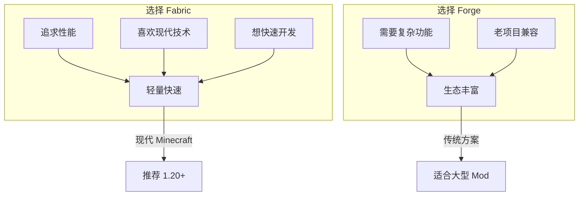
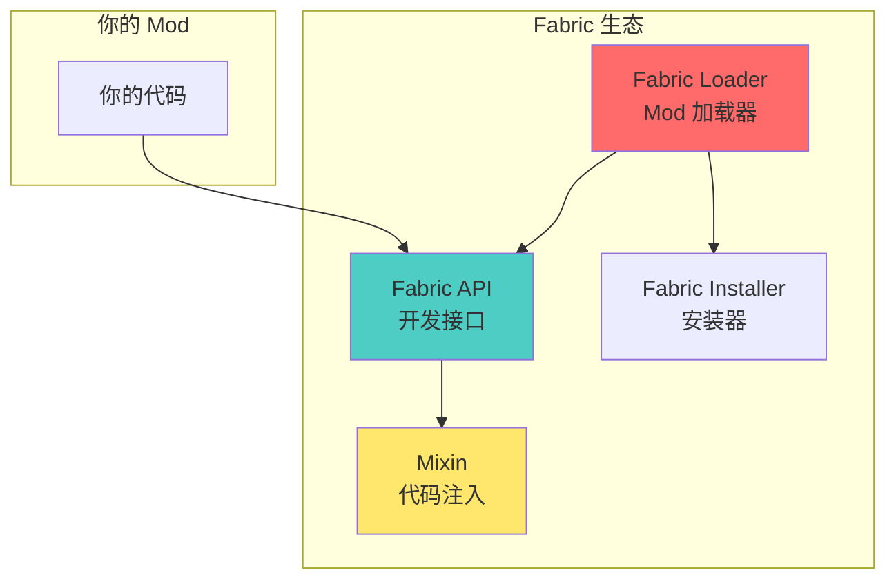
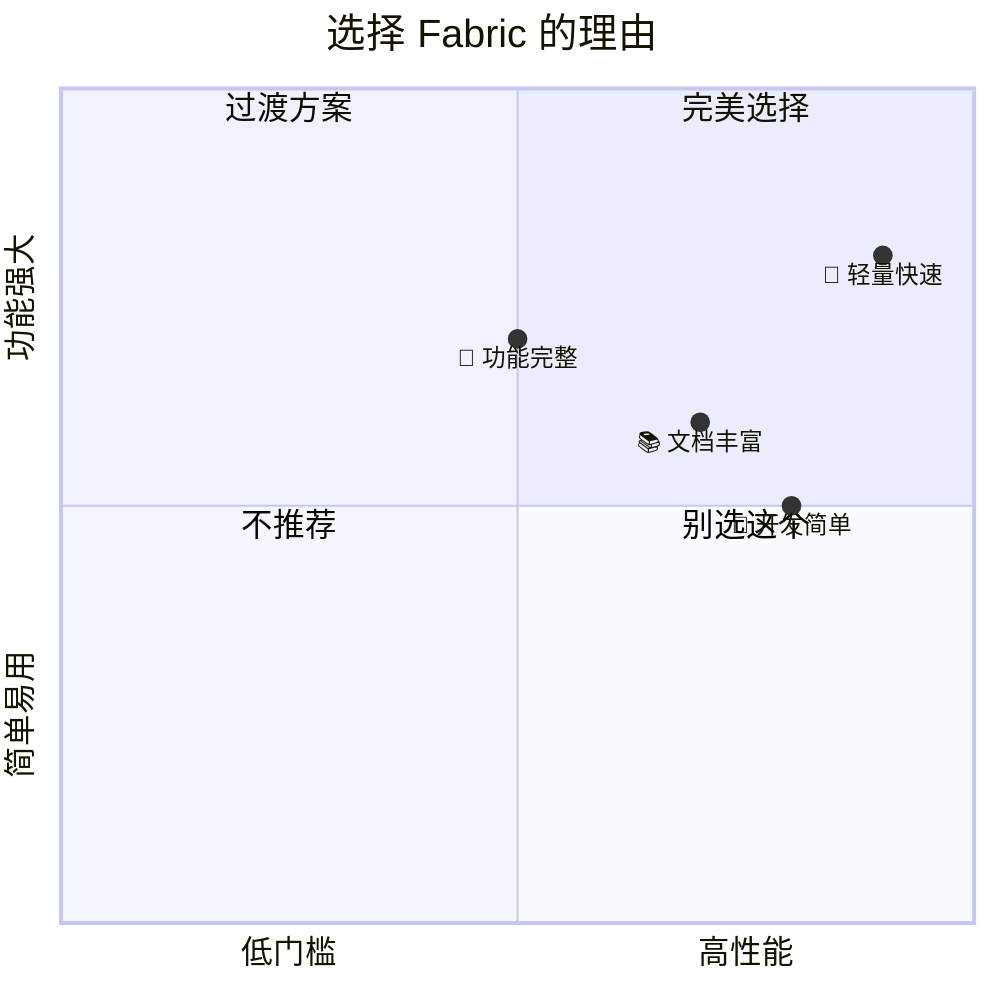
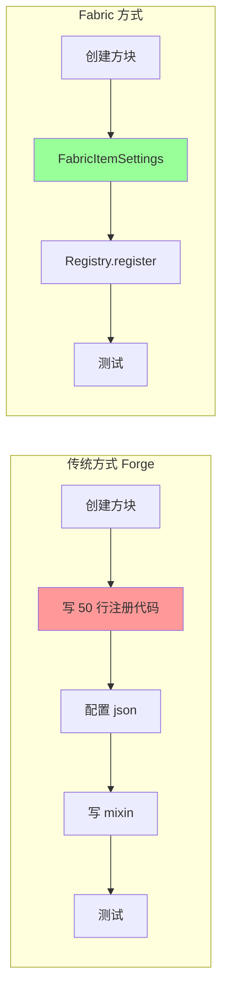
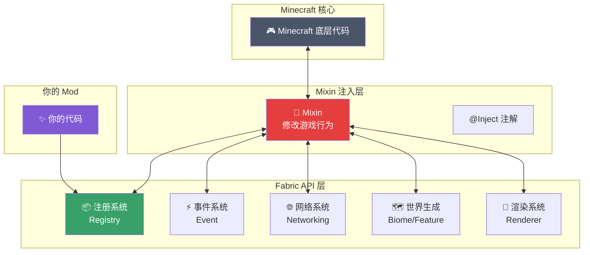
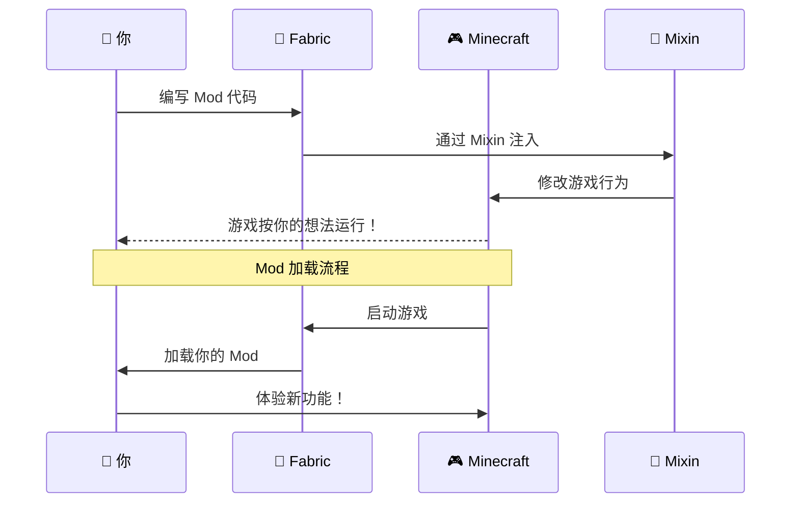
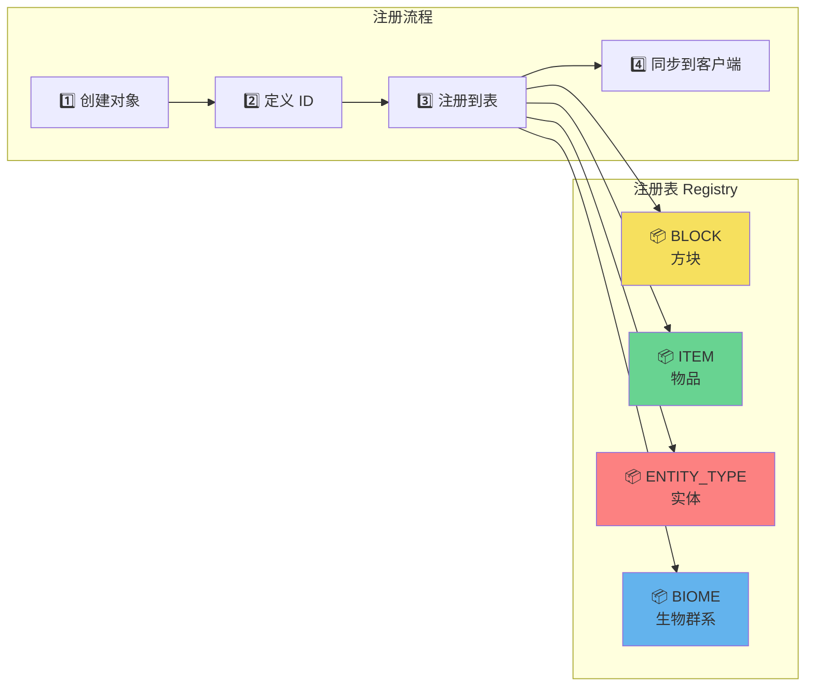
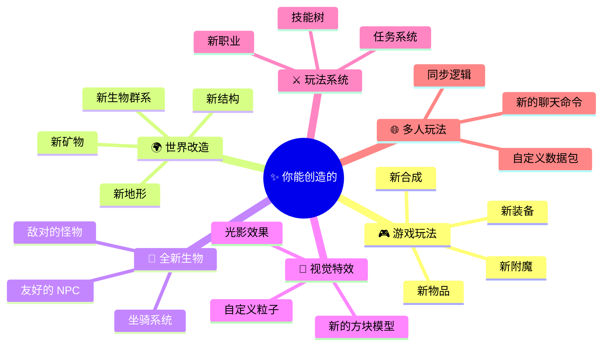
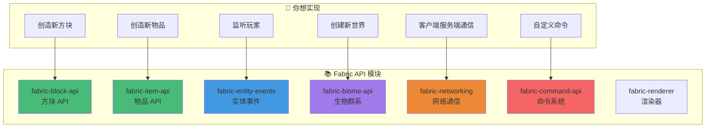
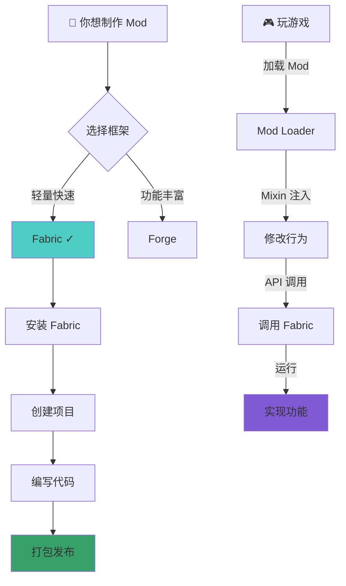

# 🎮 Fabric 是什么？—— 让你的 MC 听你的话！

> **TL;DR** 如果你想让 Minecraft 执行你的想法，Fabric 就是那把钥匙！

---

## 📖 目录

1. [🎯 Fabric 是什么？](#1-fabric-是什么)
2. [🔥 为什么选 Fabric？](#2-为什么选-fabric)
3. [🏗️ Fabric 的核心架构](#3-fabric-的核心架构)
4. [🧩 Fabric 能做什么？](#4-fabric-能做什么)
5. [🚀 快速开始](#5-快速开始)

---

## 1. Fabric 是什么？

### 1.1 一句话解释

```
🎮 Minecraft 就像一个精密的机器
🔧 Fabric 就是让你能改装这台机器的工具箱
```

**没有 Mod**：你只能玩别人设计好的游戏
**有 Fabric Mod**：你可以添加新物品、新世界、新玩法...一切皆有可能！

### 1.2 官方定义

> Fabric 是一个轻量级、模块化的 Mod 加载工具和 API 框架

翻译成人话就是：
- **轻量级**：不会让游戏变卡
- **模块化**：想要什么功能就加什么，不需要全部装
- **API 框架**：提供了大量现成的代码，直接调用就行

### 1.3 Fabric vs Forge 对比



### 1.4 Fabric 的组成



---

## 2. 为什么选 Fabric？

### 2.1 四大优势



| 优势 | 说明 | 比喻 |
|------|------|------|
| ⚡ **速度快** | 原生兼容，性能损失小 | 改装跑车不影响引擎 |
| 📖 **文档好** | 官方文档详细，社区活跃 | 有详细的改装说明书 |
| 🔧 **好上手** | 新手也能快速开发 | 乐高积木式的组装 |
| 🧩 **模块化** | 按需引入，不臃肿 | 需要什么加什么 |

### 2.2 开发体验对比



---

## 3. Fabric 的核心架构

### 3.1 整体架构图



### 3.2 工作流程



### 3.3 注册系统架构



---

## 4. Fabric 能做什么？

### 4.1 功能全景图



### 4.2 常用 API 一览



---

## 5. 快速开始

### 5.1 环境要求


### 5.2 下一步

现在你已经了解了 Fabric 的全貌！接下来：


---

## 🎯 总结



**记住**：
- Fabric = 轻量 + 快速 + 现代
- 一切从注册开始
- 事件系统是核心

---

## 下一步

- [🛠️ 环境搭建](../part-0-prerequisites/02-environment-setup.md) - 配置开发工具
- [📁 Mod 项目结构](./02-mod-structure.md) - 了解代码组织
- [⚡ 事件系统](./03-event-system.md) - 响应游戏事件

---

*有问题？加入 [Fabric Discord](https://discord.gg/fabricmc) 或在 GitHub 提问！*
