# ⚡ 事件系统 —— 让游戏"活"起来！

> **TL;DR** 事件系统让你响应游戏中的任何变化，就像在游戏中埋下"监听器"！

---

## 📖 目录

1. [🎯 什么是事件？](#1-什么是事件)
2. [🛠️ 如何使用事件？](#2-如何使用事件)
3. [📚 常用事件一览](#3-常用事件一览)
4. [💡 实战示例](#4-实战示例)
5. [🎯 事件优先级](#5-事件优先级)
6. [🚀 自定义事件](#6-自定义事件)

---

## 1. 什么是事件？

### 1.1 一句话解释

```
🎮 游戏 = 一个不断发生"事情"的世界
📡 事件 = 这些"事情"的通知
🧏 你 = 订阅这些通知的人
```

当你"订阅"了某个事件，游戏就会在那个事情发生时通知你！

### 1.2 现实类比

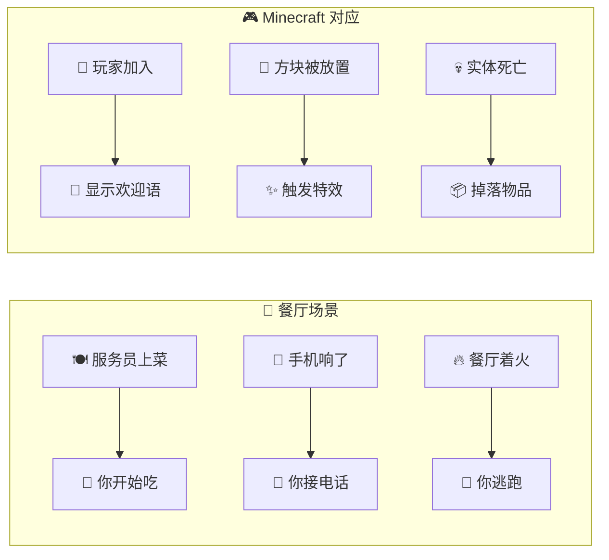

### 1.3 事件工作原理

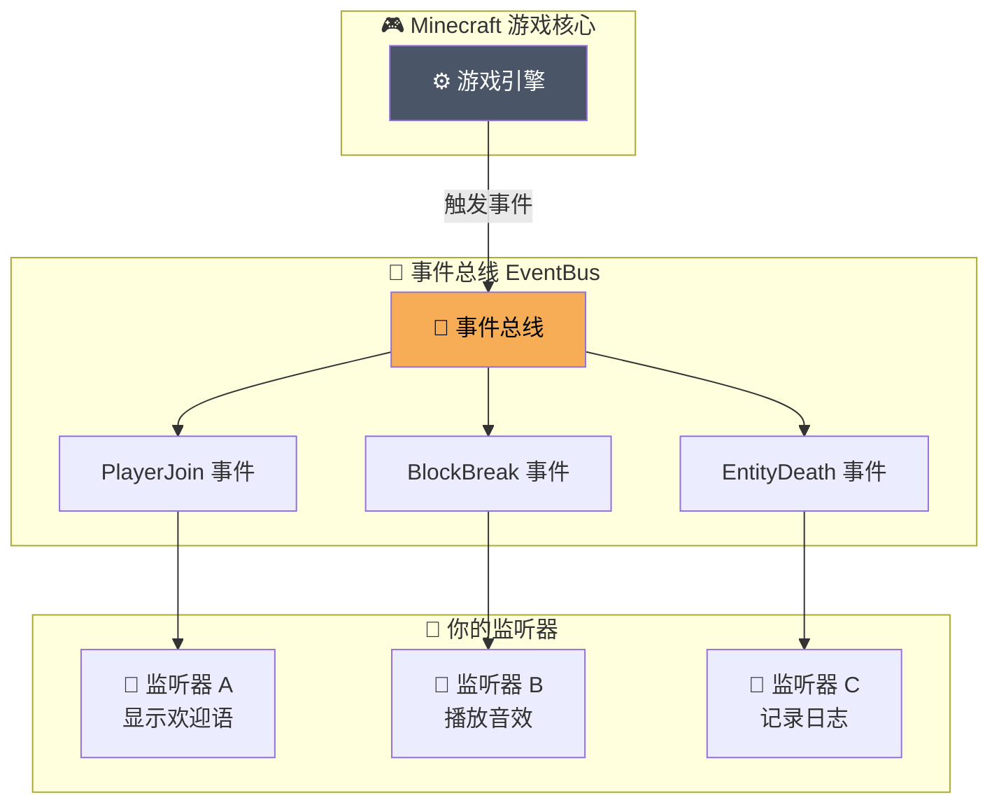

### 1.4 事件三要素

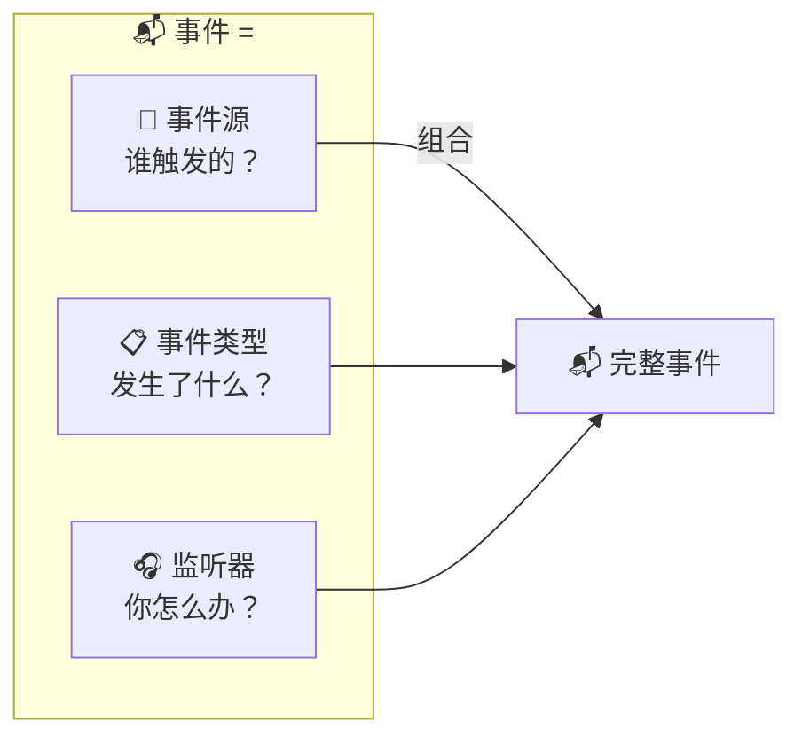

### 1.5 事件执行流程

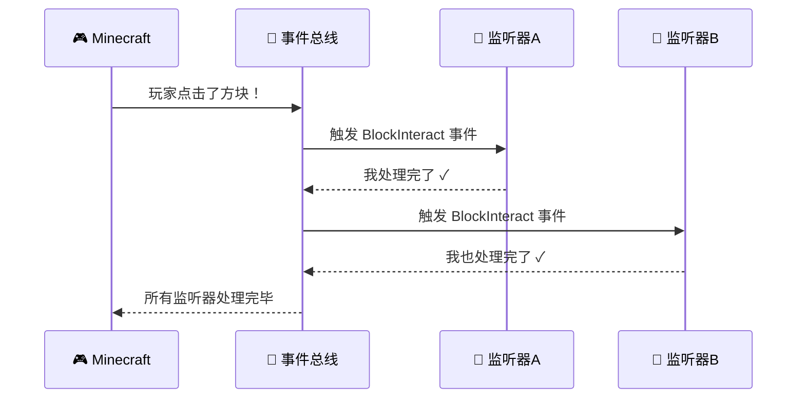

---

## 2. 如何使用事件？

### 2.1 三步走策略

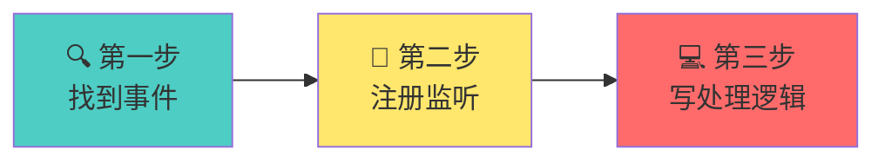

### 2.2 代码模板

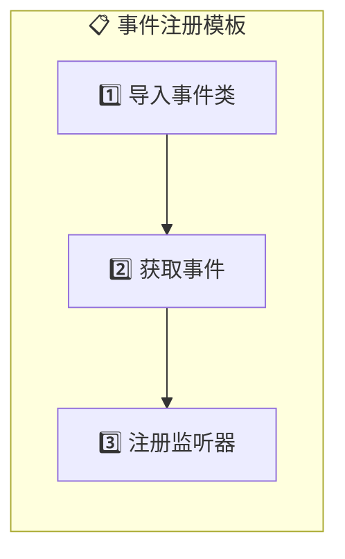

**实际代码**：

```java
// 1️⃣ 导入事件类
import net.fabricmc.fabric.api.entity.event.v1.ServerPlayerEvents;

// 2️⃣ 获取事件
ServerPlayerEvents.JOIN

// 3️⃣ 注册监听器（用 Lambda 简洁写法）
ServerPlayerEvents.JOIN.register(player -> {
    // 你的代码写在这里！
    player.sendMessage(Text.literal("欢迎回来！"));
});
```

### 2.3 对比：传统写法 vs Lambda

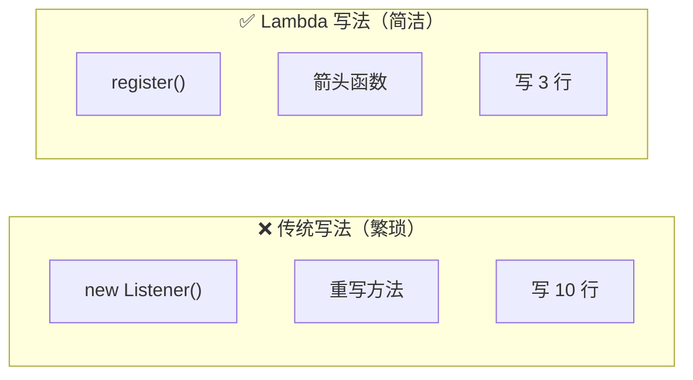

```java
// ❌ 传统写法 - 啰嗦
ServerPlayerEvents.JOIN.register(new ServerPlayerEvents.Join() {
    @Override
    public void onJoin(ServerPlayerEntity player) {
        player.sendMessage(Text.literal("欢迎！"));
    }
});

// ✅ Lambda 写法 - 简洁
ServerPlayerEvents.JOIN.register(player -> {
    player.sendMessage(Text.literal("欢迎！"));
});
```

### 2.4 注册时机

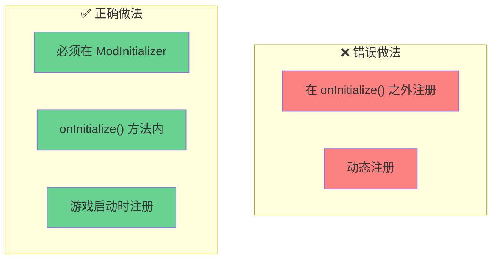

```java
public class MyMod implements ModInitializer {

    @Override
    public void onInitialize() {
        // ✅ 正确：在这里注册
        ServerPlayerEvents.JOIN.register(player -> {
            // ...
        });
    }

    // ❌ 错误：不要这样！
    // public void someMethod() {
    //     ServerPlayerEvents.JOIN.register(...); // 太晚了！
    // }
}
```

---

## 3. 常用事件一览

### 3.1 事件分类图

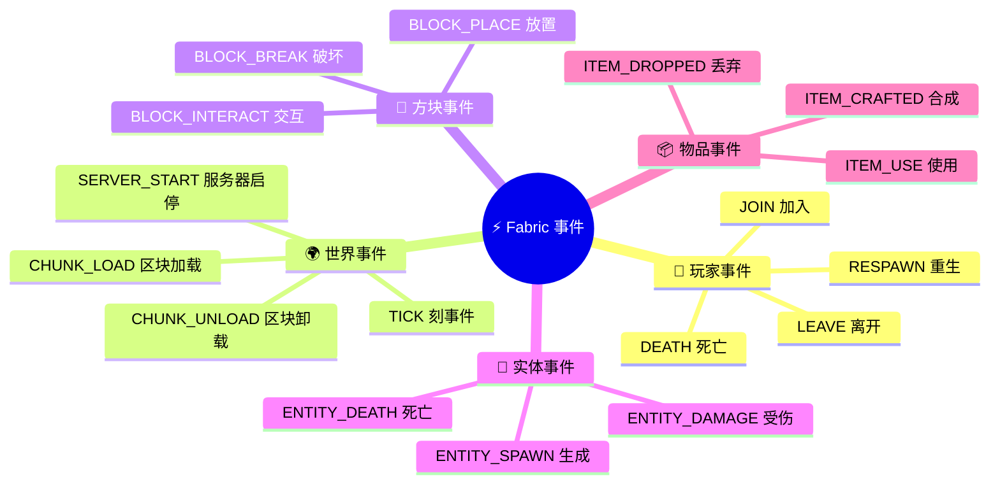

### 3.2 事件速查表

| 你想监听... | 使用这个事件 | 模块 |
|------------|------------|------|
| 玩家加入 | `ServerPlayerEvents.JOIN` | entity-events |
| 玩家离开 | `ServerPlayerEvents.LEAVE` | entity-events |
| 玩家死亡 | `ServerLivingEntityEvents.AFTER_DEATH` | entity-events |
| 服务器启动 | `ServerLifecycleEvents.SERVER_STARTED` | lifecycle |
| 方块放置 | `UseBlockCallback.EVENT` | interaction |
| 方块破坏 | `PlayerBlockBreakEvents.AFTER` | interaction |
| 实体生成 | `EntitySpawnCallback.EVENT` | entity |
| 每刻执行 | `ServerTickEvents.END_SERVER_TICK` | lifecycle |

### 3.3 事件来源模块

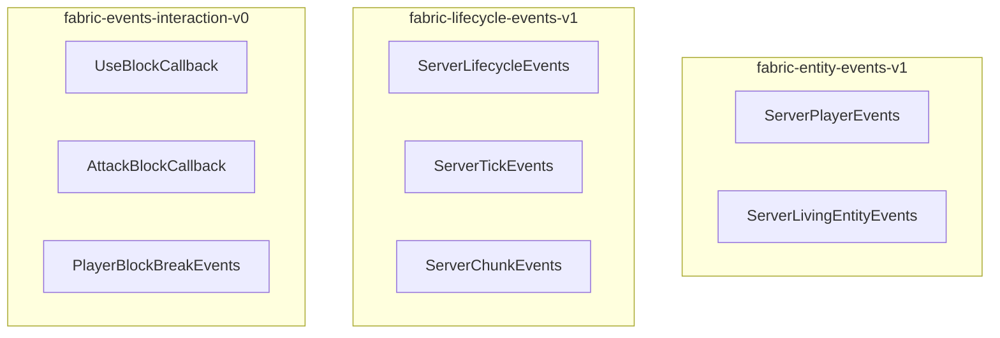

---

## 4. 实战示例

### 4.1 示例 1：欢迎玩家 🎉

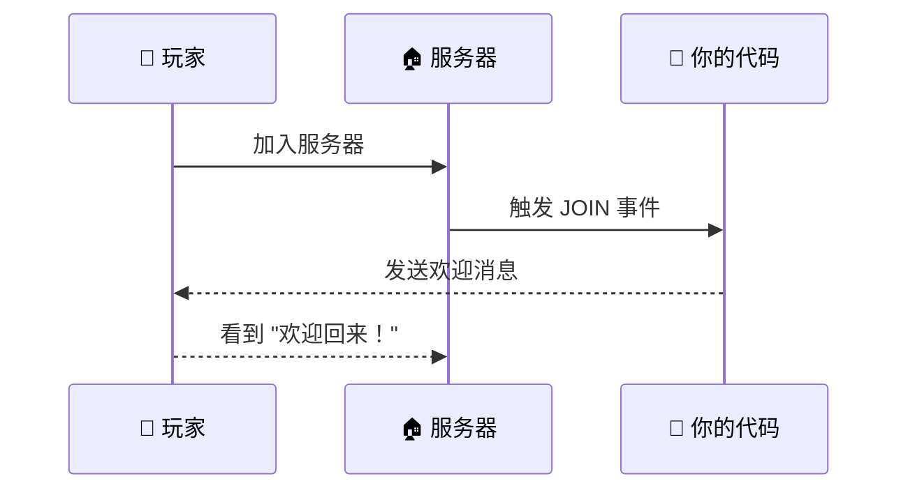

```java
ServerPlayerEvents.JOIN.register(player -> {
    player.sendMessage(
        Text.literal("欢迎回来，")
            .append(player.getName())
            .append("！")
    );
});
```

### 4.2 示例 2：死亡播报 💀

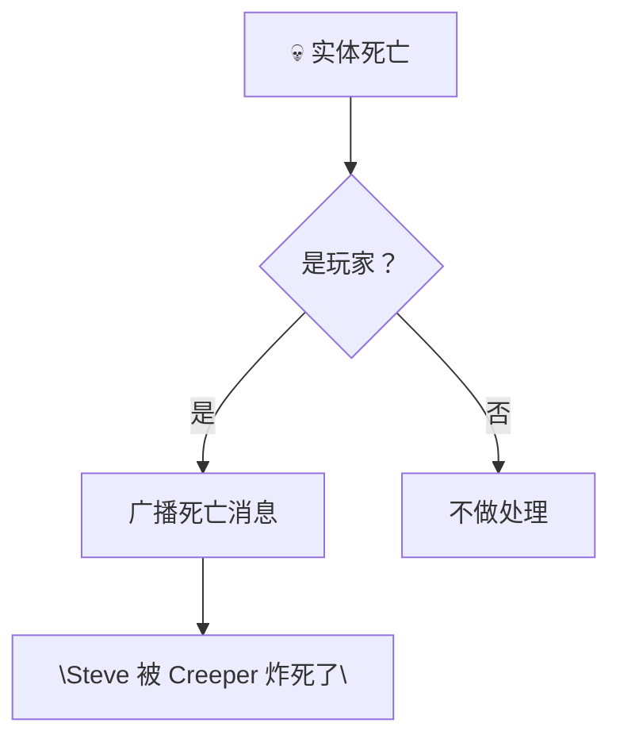

```java
ServerLivingEntityEvents.AFTER_DEATH.register((entity, source) -> {
    if (entity instanceof ServerPlayerEntity player) {
        String killer = source.getAttacker() != null
            ? source.getAttacker().getName().getString()
            : "意外";

        player.getServer().getPlayerManager().broadcast(
            Text.literal(player.getName().getString() + " 被 " + killer + " 杀死了！"),
            false
        );
    }
});
```

### 4.3 示例 3：每刻检查 ⏰

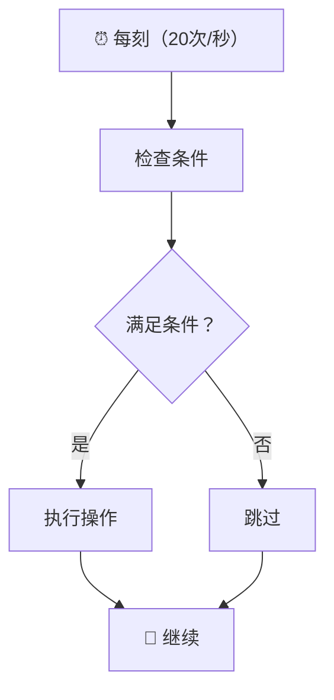

```java
ServerTickEvents.END_SERVER_TICK.register(server -> {
    // ⚠️ 注意：这个会频繁执行，不要写耗时操作！
    // 适合做：状态检查、定时任务
});
```

### 4.4 示例 4：自定义方块交互 🖱️

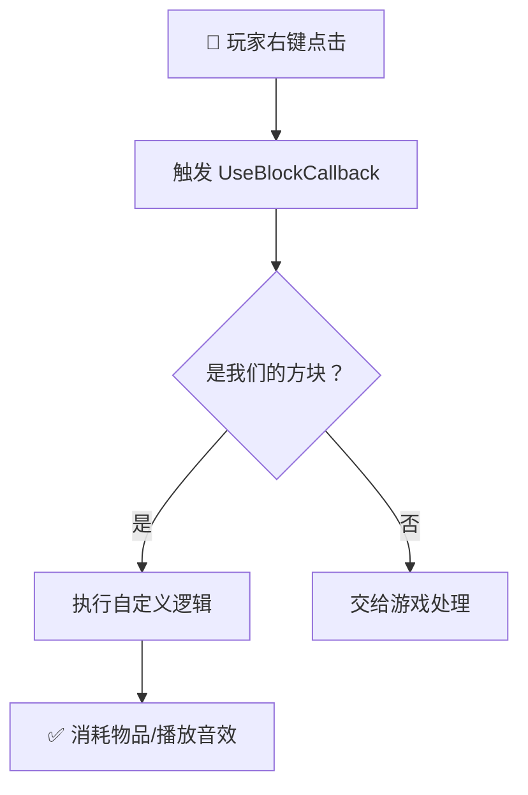

```java
UseBlockCallback.EVENT.register((player, world, hand, hitResult) -> {
    if (world.isClient) return ActionResult.PASS;

    BlockPos pos = hitResult.getBlockPos();
    BlockState state = world.getBlockState(pos);

    // 检查是否是我们的方块
    if (state.isOf(ModBlocks.MY_MAGIC_BLOCK)) {
        player.sendMessage(Text.literal("你点击了魔法方块！✨"));
        return ActionResult.SUCCESS; // 阻止默认行为
    }

    return ActionResult.PASS; // 交给游戏处理
});
```

---

## 5. 事件优先级

### 5.1 优先级概念

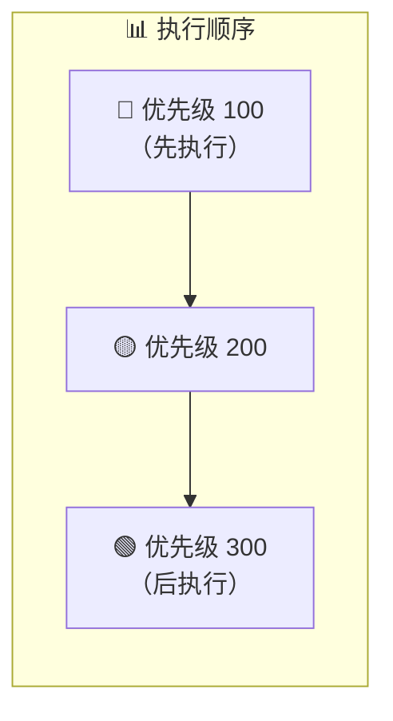

### 5.2 注册顺序

```java
// 先注册 → 先执行
ServerPlayerEvents.JOIN.register(player -> {
    LOGGER.info("第一个监听器"); // 先输出
});

ServerPlayerEvents.JOIN.register(player -> {
    LOGGER.info("第二个监听器"); // 后输出
});
```

### 5.3 实际应用场景

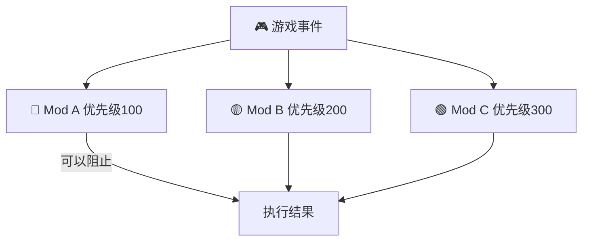

---

## 6. 自定义事件

### 6.1 为什么需要？

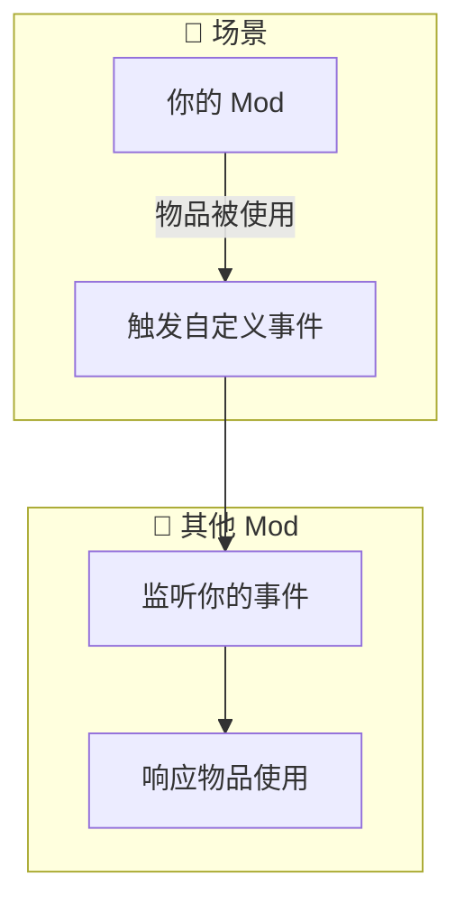

### 6.2 定义事件

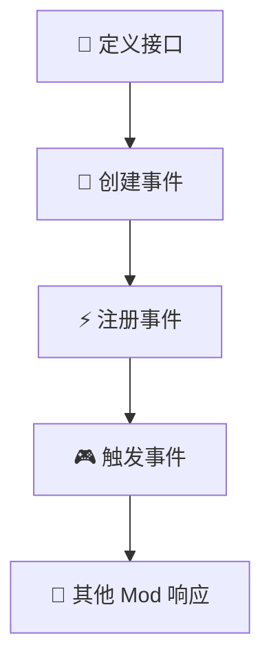

```java
public class MyEvents {
    // 定义事件
    public static final Event<MyItemUsed> MY_ITEM_USED = EventFactory.createArrayBacked(
        MyItemUsed.class,
        (listeners) -> (player, itemStack) -> {
            for (MyItemUsed listener : listeners) {
                listener.onItemUsed(player, itemStack);
            }
        }
    );

    // 定义监听器接口
    @FunctionalInterface
    public interface MyItemUsed {
        void onItemUsed(ServerPlayerEntity player, ItemStack itemStack);
    }
}
```

### 6.3 触发事件

```java
public class MagicItem implements Item {
    @Override
    public boolean use(World world, PlayerEntity player, Hand hand) {
        if (!world.isClient && player instanceof ServerPlayerEntity serverPlayer) {
            // ✨ 触发自定义事件！
            MyEvents.MY_ITEM_USED.invoker().onItemUsed(
                serverPlayer,
                player.getStackInHand(hand)
            );
        }
        return super.use(world, player, hand);
    }
}
```

---

## 🎯 总结

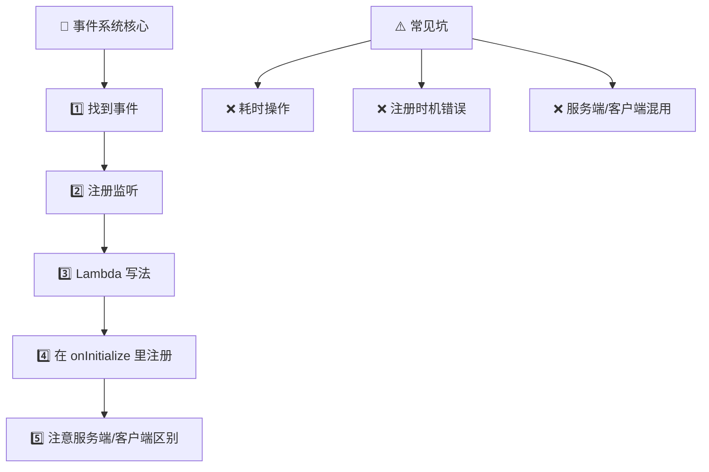

### 记住这三点：

1. **事件 = 游戏的通知**
2. **注册 = 订阅通知**
3. **Lambda = 简洁的订阅方式**

---

## 下一步

- [📦 注册系统](./04-registry-system.md) - 注册你的第一个游戏对象
- [🧱 创建方块](../part-2-blocks-items/01-creating-blocks.md) - 用事件响应方块交互

---

*💡 提示：事件是 Fabric 开发的核心，多练习就能掌握！*
