# 🔖 注册系统 —— 给你的 Mod 对象发"身份证"！

> **TL;DR** 注册 = 给方块/物品/实体分配唯一的 ID，没有注册 = 游戏不认识你！

---

## 📖 目录

1. [🎯 为什么要注册？](#1-为什么要注册)
2. [📚 注册表系统](#2-注册表系统)
3. [🧱 注册方块](#3-注册方块)
4. [📦 注册物品](#4-注册物品)
5. [👾 注册实体](#5-注册实体)
6. [💡 同时注册方块和物品](#6-同时注册方块和物品)
7. [❓ 常见问题](#7-常见问题)

---

## 1. 为什么要注册？

### 1.1 什么是注册？

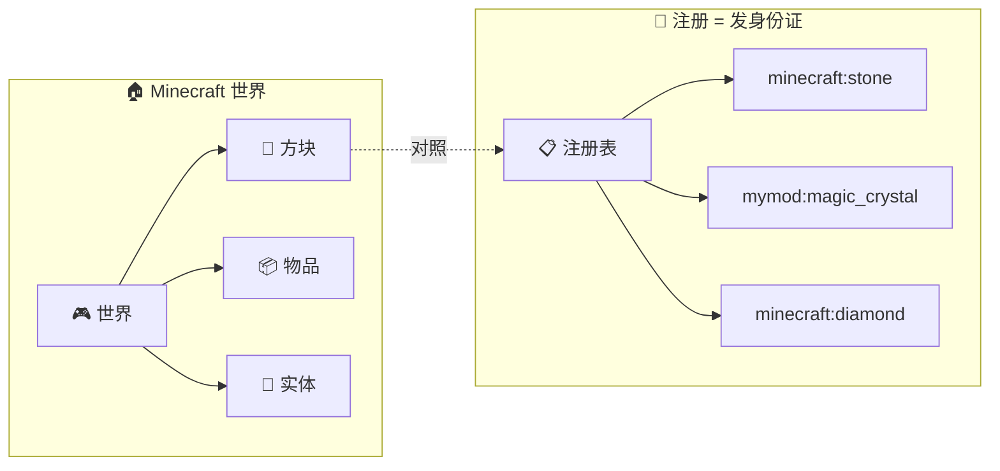

**注册 = 给游戏对象分配唯一的 Identifier（标识符）**

### 1.2 不注册会怎样？

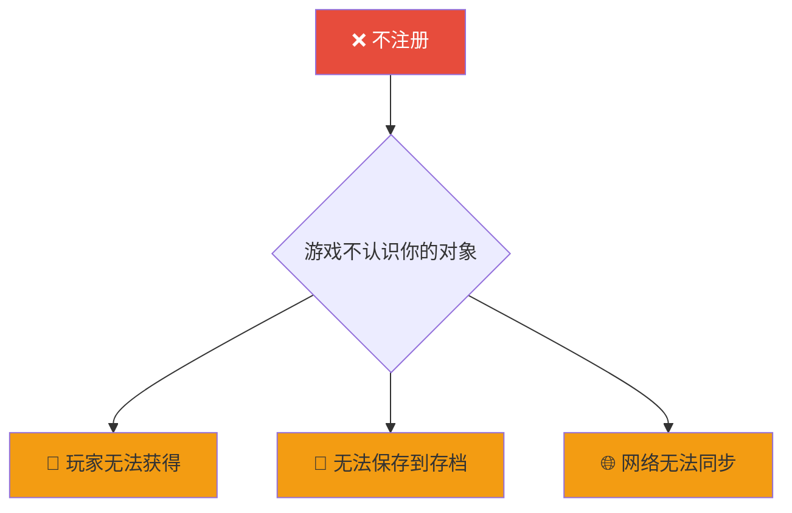

### 1.3 注册的好处

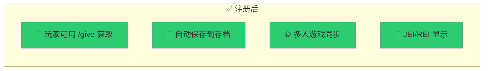

---

## 2. 注册表系统

### 2.1 注册表是什么？

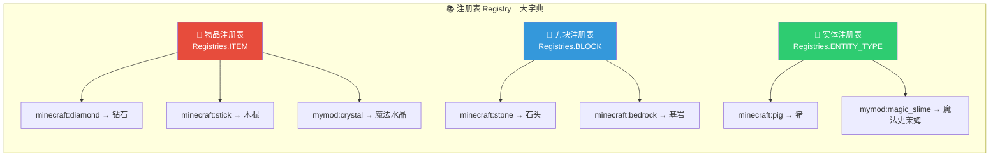

### 2.2 Identifier（标识符）= 门牌号

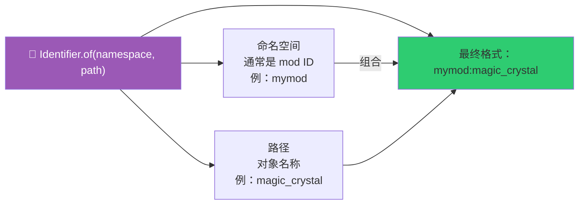

### 2.3 常用注册表速查

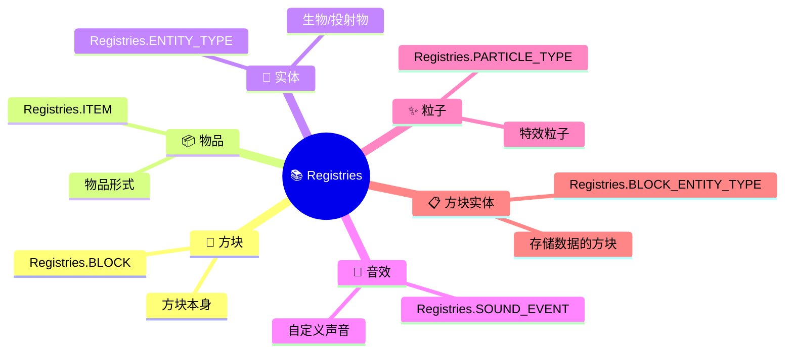

---

## 3. 注册方块

### 3.1 注册流程图

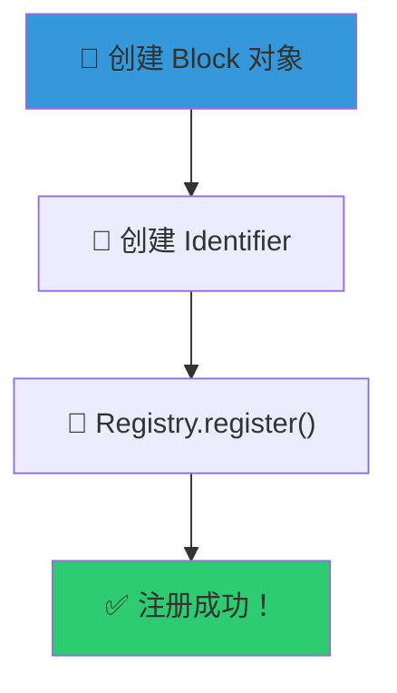

### 3.2 完整代码

```java
public class ModBlocks {

    // ========== 1️⃣ 创建方块 ==========
    public static final Block MAGIC_BLOCK = new Block(
        Block.Settings.create()
            .strength(3.0f)           // 硬度
            .luminance(state -> 10)   // 发光
    );

    // ========== 2️⃣ 注册方块 ==========
    public static void register() {
        registerBlock("magic_block", MAGIC_BLOCK);
    }

    private static void registerBlock(String name, Block block) {
        // 注册到方块注册表
        Registry.register(
            Registries.BLOCK,                           // 注册表
            Identifier.of(Mymod.MOD_ID, name),        // ID
            block                                        // 方块对象
        );

        // 同时注册物品形式
        Registry.register(
            Registries.ITEM,
            Identifier.of(Mymod.MOD_ID, name),
            new BlockItem(block, new FabricItemSettings())
        );
    }
}
```

### 3.3 方块属性对照表


---

## 4. 注册物品

### 4.1 物品类型

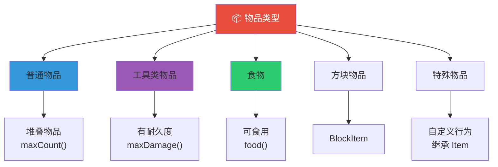

### 4.2 完整代码

```java
public class ModItems {

    // ========== 普通物品 ==========
    public static final Item MAGIC_CRYSTAL = new Item(
        new FabricItemSettings().maxCount(64)
    );

    // ========== 不可堆叠 ==========
    public static final Item TOOL = new Item(
        new FabricItemSettings().maxCount(1)
    );

    // ========== 有耐久度 ==========
    public static final Item DURABLE_ITEM = new Item(
        new FabricItemSettings().maxDamage(100)
    );

    // ========== 食物 ==========
    public static final Item MAGIC_FOOD = new Item(
        new FabricItemSettings()
            .maxCount(16)
            .food(new FoodComponent.Builder()
                .hunger(8)           // 恢复 8 点饥饿
                .saturationModifier(10f)
                .alwaysEdible()        // 空腹时也可吃
                .statusEffect(
                    new StatusEffectInstance(
                        StatusEffects.SPEED,
                        600,          // 30 秒
                        0             // 1 级
                    ),
                    1.0f            // 100% 概率
                )
                .build()
            )
    );

    public static void register() {
        registerItem("magic_crystal", MAGIC_CRYSTAL);
        registerItem("magic_tool", TOOL);
        registerItem("magic_food", MAGIC_FOOD);
    }

    private static void registerItem(String name, Item item) {
        Registry.register(
            Registries.ITEM,
            Identifier.of(Mymod.MOD_ID, name),
            item
        );
    }
}
```

### 4.3 物品设置速查

```mermaid
table
    | 设置 | 代码 | 说明 |
    |------|------|------|
    | 堆叠数 | .maxCount(64) | 最大 64 |
    | 不可堆叠 | .maxCount(1) | 单独占位 |
    | 耐久度 | .maxDamage(100) | 使用消耗 |
    | 配方剩余 | .recipeRemainder(Items.STICK) | 留下什么 |
    | 物品栏 | .group(ItemGroup.MISC) | 分类显示 |
    | 防火 | .fireproof() | 不怕岩浆 |
```

---

## 5. 注册实体

### 5.1 实体注册流程

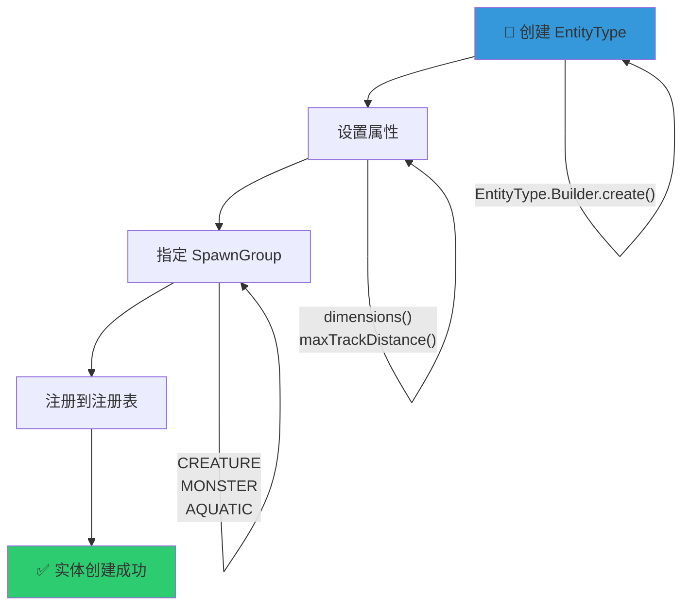

### 5.2 完整代码

```java
public class ModEntities {

    public static final EntityType<MagicSlime> MAGIC_SLIME = EntityType.Builder
        .create(MagicSlime::new, SpawnGroup.CREATURE)  // 实体工厂 + 生成组
        .dimensions(1.0f, 1.0f)                       // 碰撞箱大小
        .maxTrackDistance(10.0f)                       // 最大追踪距离
        .trackRangeBlocks(8)                           // 追踪范围
        .build("magic_slime");                         // ID

    public static void register() {
        registerEntity("magic_slime", MAGIC_SLIME);
    }

    private static <T extends Entity> void registerEntity(String name, EntityType<T> entity) {
        Registry.register(
            Registries.ENTITY_TYPE,
            Identifier.of(Mymod.MOD_ID, name),
            entity
        );
    }
}
```

### 5.3 SpawnGroup（生成组）

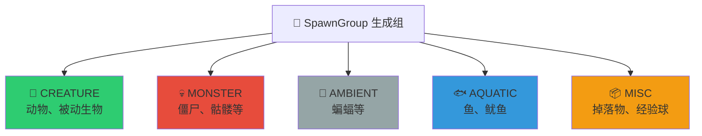

---

## 6. 同时注册方块和物品

### 6.1 为什么要同时注册？

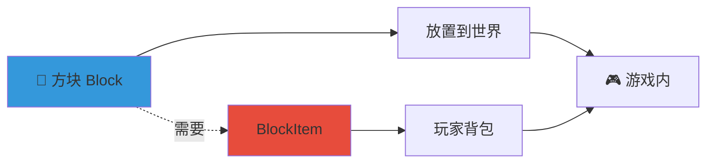

### 6.2 推荐模式

```java
private static void registerBlock(String name, Block block) {
    Identifier id = Identifier.of(Mymod.MOD_ID, name);

    // 1️⃣ 先注册方块
    Registry.register(Registries.BLOCK, id, block);

    // 2️⃣ 再注册物品（BlockItem = 方块的物品形式）
    Registry.register(
        Registries.ITEM, id,
        new BlockItem(block, new FabricItemSettings())
    );
}
```

### 6.3 注册顺序


---

## 7. 常见问题

### 7.1 错误排查流程

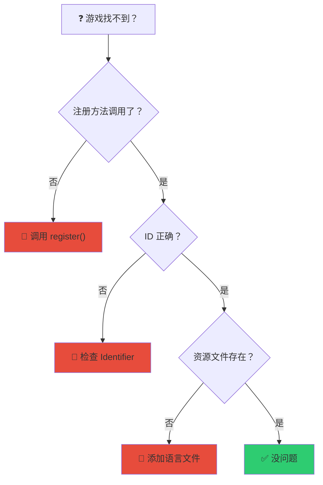

### 7.2 常见错误


### 7.3 快速检查清单

| 检查项 | ✅/❌ |
|--------|--------|
| 调用了 `register()` 方法？ | |
| ID 格式正确（modid:name）？ | |
| 命名空间用小写？ | |
| 添加了语言文件？ | |
| 重新构建了项目？ | |

---

## 🎯 总结

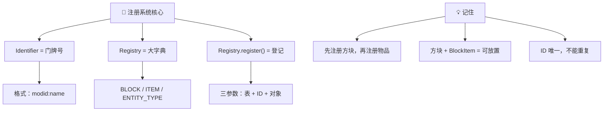

### 记住这三步：

1. **创建对象** `new Block(...)` / `new Item(...)`
2. **创建 ID** `Identifier.of(MOD_ID, name)`
3. **注册** `Registry.register(Registries.XXX, id, object)`

---

## 下一步

- [🧱 创建方块](./01-creating-blocks.md) - 实战创建你的第一个方块
- [📦 创建物品](./03-creating-items.md) - 创造更多物品类型

---

*💡 **提示**：注册是 Fabric 开发的基础，几乎每个 Mod 都要用到！*
