# 🧱 创建你的第一个方块！

> **TL;DR** 方块是 Minecraft 的灵魂！这一章教你从零创建一个会发光的方块！

---

## 📖 目录

1. [🎯 方块是什么？](#1-方块是什么)
2. [🛠️ 创建简单方块](#2-创建简单方块)
3. [🎨 添加纹理和模型](#3-添加纹理和模型)
4. [⚙️ 方块属性设置](#4-方块属性设置)
5. [🖱️ 方块交互](#5-方块交互)
6. [📦 完整示例](#6-完整示例)

---

## 1. 方块是什么？

### 1.1 Minecraft 的积木

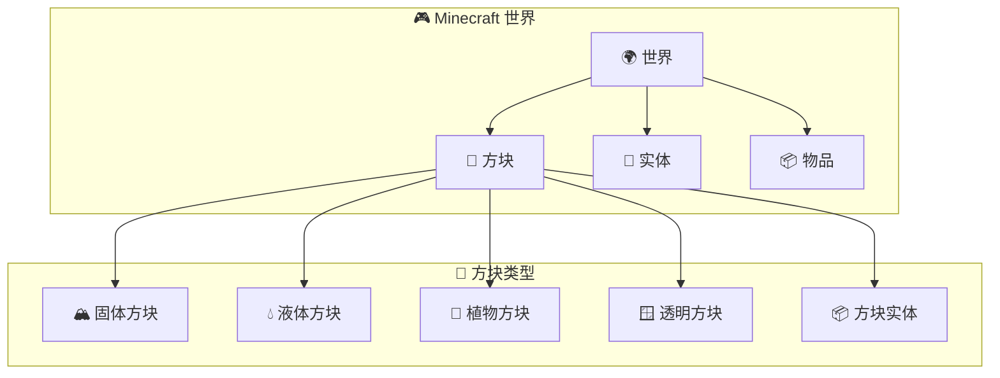

### 1.2 方块的组成

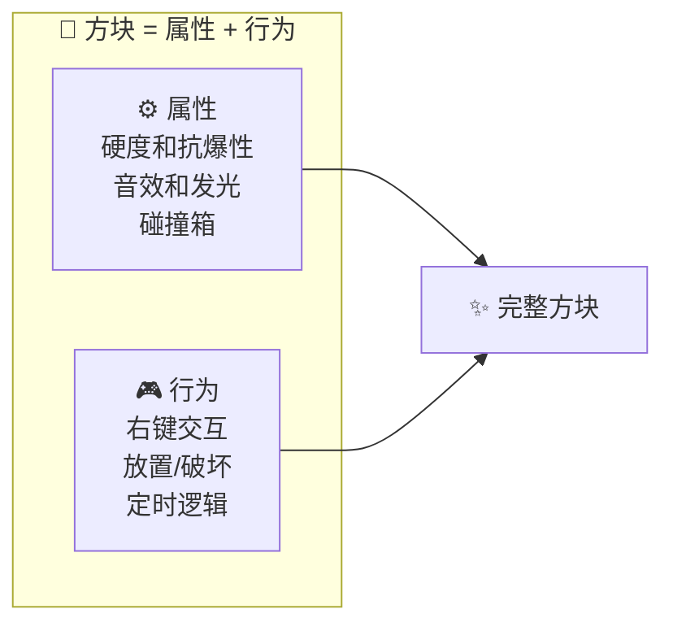

### 1.3 方块 vs 物品

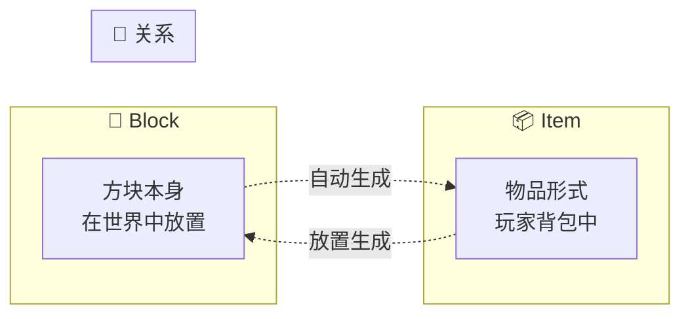

---

## 2. 创建简单方块

### 2.1 三步创建法

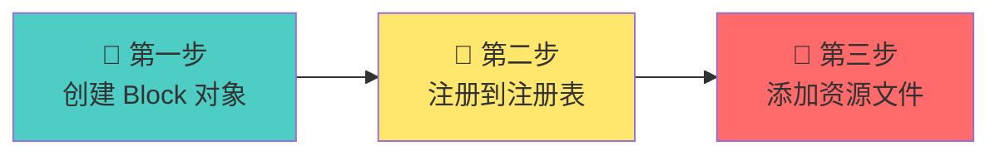

### 2.2 代码模板

```java
package net.example.mymod.init;

import net.example.mymod.Mymod;
import net.minecraft.registry.Registries;
import net.minecraft.registry.Registry;
import net.minecraft.util.Identifier;
import net.minecraft.block.Block;

public class ModBlocks {

    // ========== 1️⃣ 创建方块对象 ==========
    public static final Block MAGIC_STONE = new Block(
        Block.Settings.create()
            .strength(3.0f)   // 硬度
            .resistance(6.0f) // 抗爆性
    );

    // ========== 2️⃣ 注册方块 ==========
    public static void register() {
        registerBlock("magic_stone", MAGIC_STONE);
    }

    private static void registerBlock(String name, Block block) {
        // 注册方块本身
        Registry.register(
            Registries.BLOCK,
            Identifier.of(Mymod.MOD_ID, name),
            block
        );

        // 同时注册物品形式（这样玩家才能获得）
        Registry.register(
            Registries.ITEM,
            Identifier.of(Mymod.MOD_ID, name),
            new BlockItem(block, new FabricItemSettings())
        );
    }
}
```

### 2.3 在 Mod 入口注册

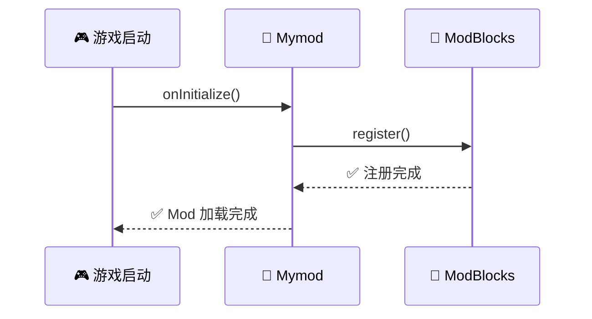

```java
public class Mymod implements ModInitializer {
    public static final String MOD_ID = "mymod";

    @Override
    public void onInitialize() {
        LOGGER.info("🚀 开始加载 {}", MOD_ID);

        // 注册方块！
        ModBlocks.register();

        LOGGER.info("✅ {} 加载完成！", MOD_ID);
    }
}
```

---

## 3. 添加纹理和模型

### 3.1 资源文件结构

```mermaid
filesystem
    .
    └── src/main/resources/
        └── assets/
            └── mymod/
                ├── textures/
                │   └── block/
                │       └── magic_stone.png  ← 你的纹理
                ├── models/
                │   ├── block/
                │   │   └── magic_stone.json  ← 方块模型
                │   └── item/
                │       └── magic_stone.json  ← 物品模型
                └── lang/
                    ├── en_us.json
                    └── zh_cn.json
```

### 3.2 模型类型选择

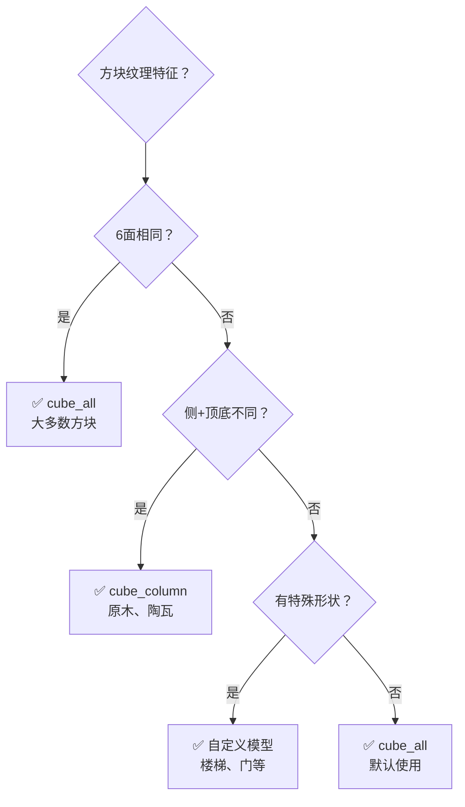

### 3.3 模型文件示例

```json
// 方块模型 - 6面相同纹理
{
    "parent": "minecraft:block/cube_all",
    "textures": {
        "all": "mymod:block/magic_stone"
    }
}
```

### 3.4 纹理文件

> 💡 **提示**：可以用在线工具生成简单纹理
> - [Craft Texturer](https://crafttexturer.com/)
> - [NovaSkin](https://minecraft.novaskin.me/editor)

---

## 4. 方块属性设置

### 4.1 属性速查表

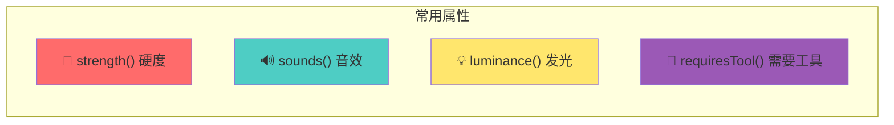

### 4.2 完整属性示例

```java
// 发光方块
public static final Block GLOWING_BLOCK = new Block(
    Block.Settings.create()
        .strength(2.0f)                    // 硬度
        .luminance(state -> 15)             // 💡 发光等级（0-15）
        .sounds(BlockSoundGroup.GLASS)      // 音效
);

// 透明方块
public static final Block GLASS_BLOCK = new Block(
    Block.Settings.create()
        .strength(1.5f)
        .sounds(BlockSoundGroup.GLASS)
        .nonOpaque()                        // 非不透明
);

// 金属方块
public static final Block METAL_BLOCK = new Block(
    Block.Settings.create()
        .strength(5.0f, 30.0f)             // 硬度和抗爆性
        .requiresTool()                    // 🔧 需要工具
        .sounds(BlockSoundGroup.METAL)
);
```

### 4.3 发光等级对比

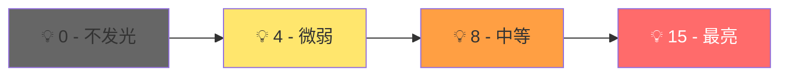

---

## 5. 方块交互

### 5.1 创建可交互方块

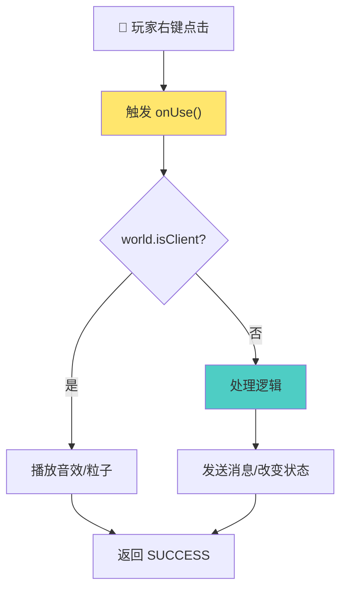

### 5.2 完整交互代码

```java
public class MagicStoneBlock extends Block {

    public MagicStoneBlock(Settings settings) {
        super(settings);
    }

    // 🖱️ 右键点击时调用
    @Override
    public ActionResult onUse(
            BlockState state,           // 当前状态
            World world,                // 所在世界
            BlockPos pos,               // 方块位置
            PlayerEntity player,        // 点击的玩家
            BlockHitResult hit         // 点击信息
    ) {
        // 客户端：只做视觉效果
        if (world.isClient) {
            return ActionResult.SUCCESS;
        }

        // 服务端：处理实际逻辑
        player.sendMessage(
            Text.literal("✨ 你点击了魔法石头！"),
            false
        );

        // 改变方块为钻石块（演示用）
        world.setBlockState(pos, Blocks.DIAMOND_BLOCK.getDefaultState());

        return ActionResult.SUCCESS;
    }
}
```

### 5.3 常用方法一览

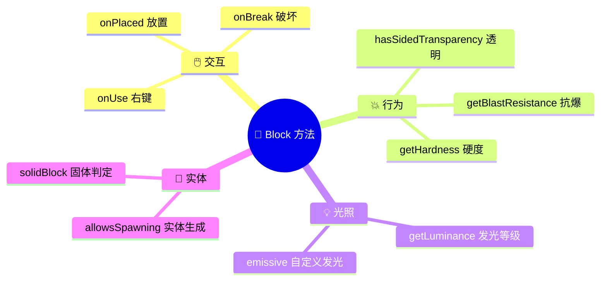

---

## 6. 完整示例

### 6.1 项目结构图

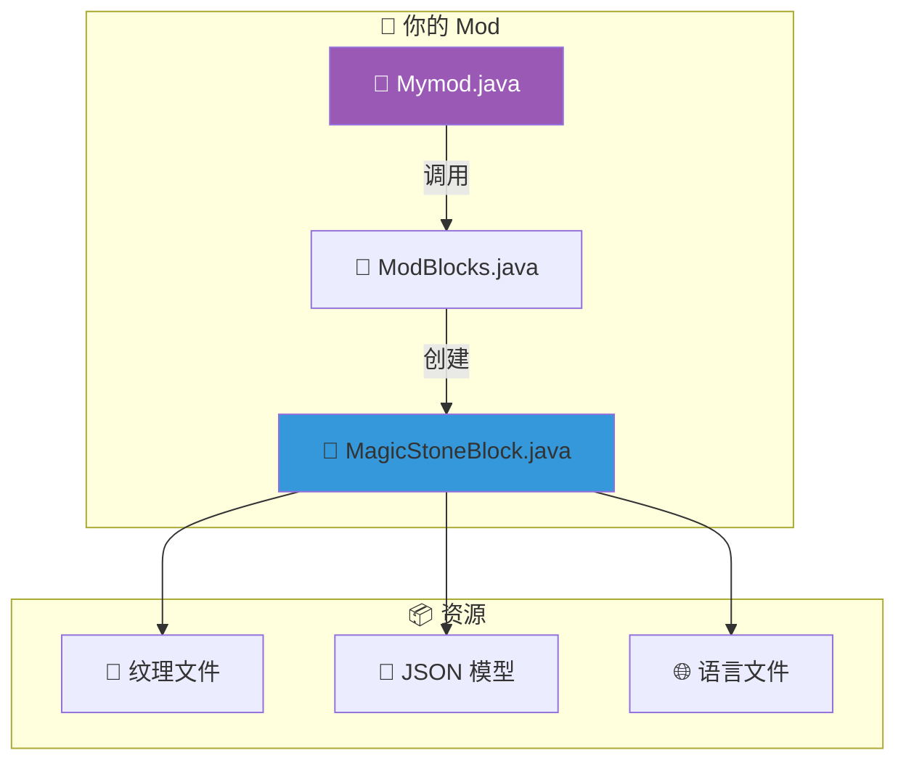

### 6.2 完整代码

```java
// ========== 方块类 ==========
package net.example.mymod.block;

public class MagicStoneBlock extends Block {

    public MagicStoneBlock(Settings settings) {
        super(settings);
    }

    @Override
    public ActionResult onUse(BlockState state, World world, BlockPos pos,
                              PlayerEntity player, Hand hand, BlockHitResult hit) {
        if (world.isClient) return ActionResult.SUCCESS;

        // 发送消息
        player.sendMessage(Text.literal("💎 魔法石头被点击了！"), false);
        return ActionResult.SUCCESS;
    }
}

// ========== 注册类 ==========
package net.example.mymod.init;

public class ModBlocks {

    public static final Block MAGIC_STONE = new MagicStoneBlock(
        Block.Settings.create()
            .strength(3.0f)
            .luminance(state -> 10)
            .sounds(BlockSoundGroup.STONE)
    );

    public static void register() {
        registerBlock("magic_stone", MAGIC_STONE);
    }

    private static void registerBlock(String name, Block block) {
        Identifier id = Identifier.of(Mymod.MOD_ID, name);

        // 注册方块
        Registry.register(Registries.BLOCK, id, block);

        // 注册物品
        Registry.register(
            Registries.ITEM, id,
            new BlockItem(block, new FabricItemSettings())
        );
    }
}
```

### 6.3 最终效果预览

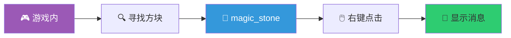

---

## 🎯 总结

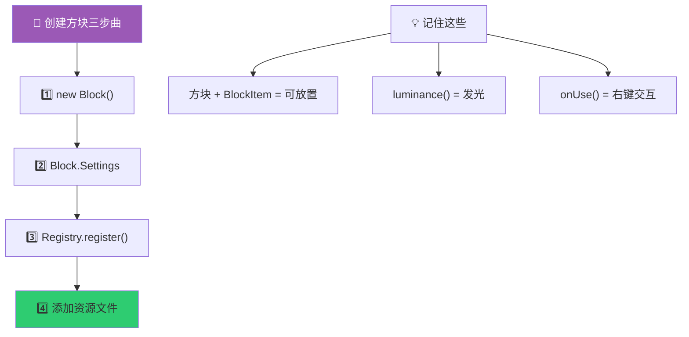

### 你学到了：

- ✅ 创建基础的方块对象
- ✅ 设置方块属性（硬度、音效、发光）
- ✅ 注册方块和物品
- ✅ 创建 JSON 模型文件
- ✅ 处理右键交互

---

## 下一步

- [📦 方块实体](./02-block-entity.md) - 存储数据的进阶方块
- [🪄 创建物品](./03-creating-items.md) - 创造更多物品类型

---

*💡 **挑战**：尝试创建一个会变换颜色的方块？提示：使用 `onScheduledTick()` 方法！*
