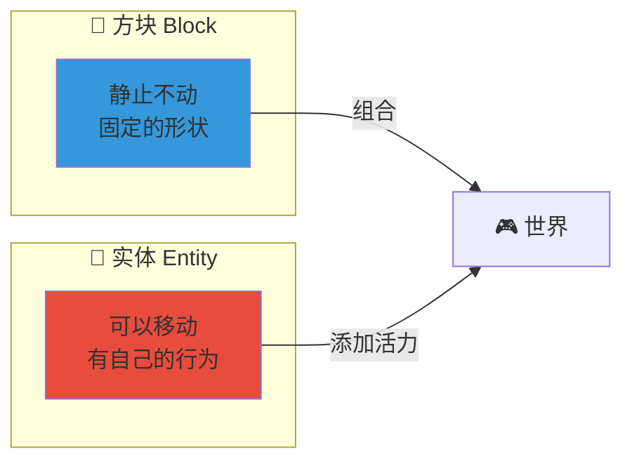
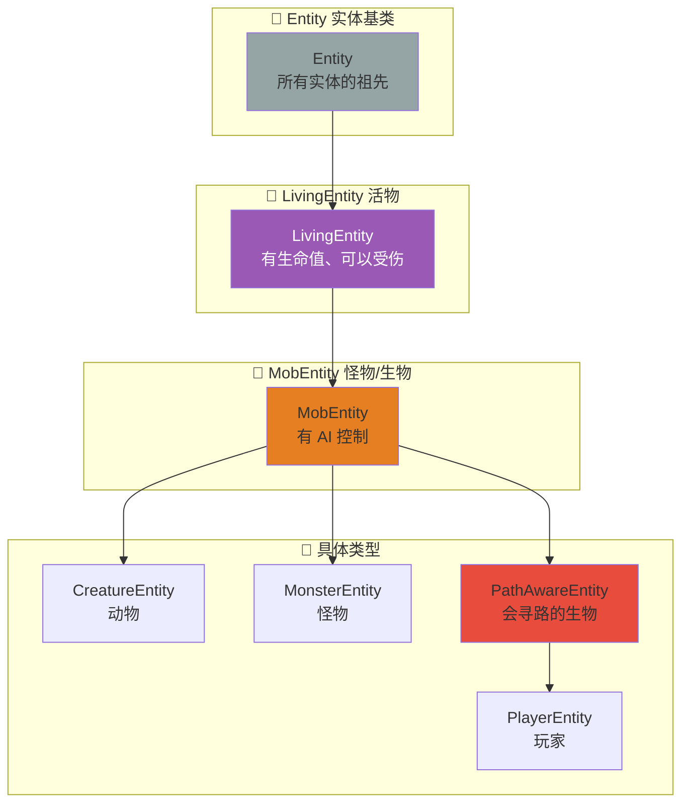
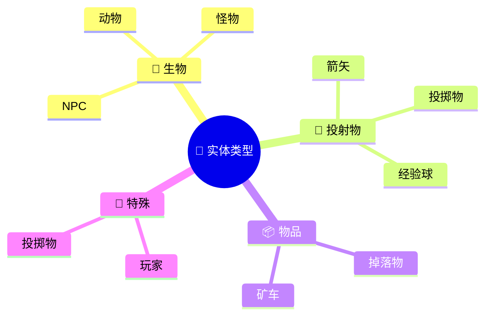
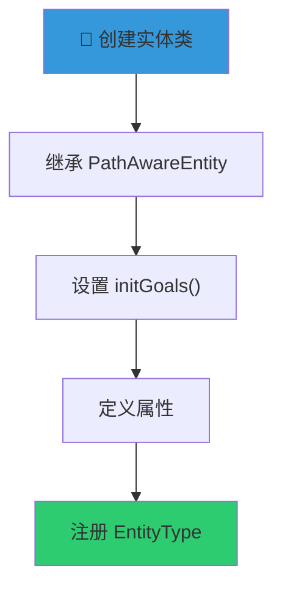
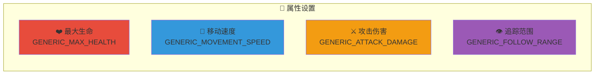
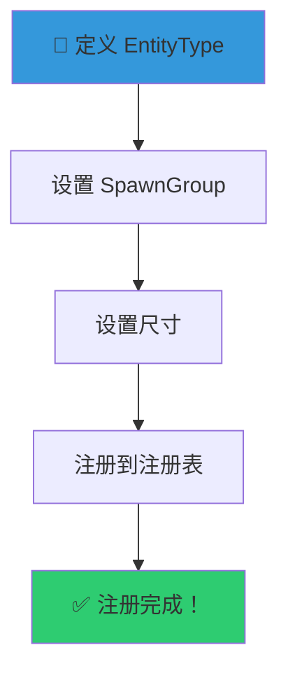
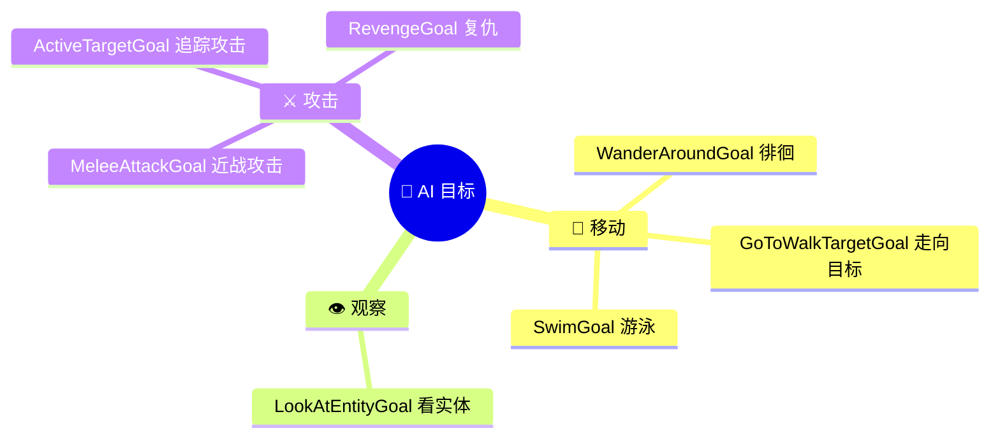
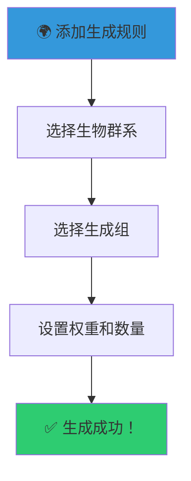
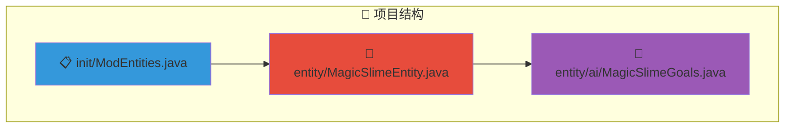
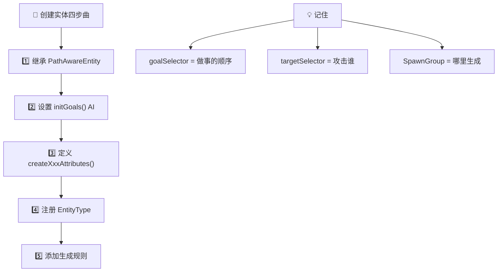

# 👾 创建你的第一个生物！

> **TL;DR** 实体是 Minecraft 中的"活物"——会动、会攻击、会 AI！这一章教你创建自定义实体！

---

## 📖 目录

1. [🎯 什么是实体？](#1-什么是实体)
2. [🛠️ 创建实体类](#2-创建实体类)
3. [🔖 注册实体](#3-注册实体)
4. [🤖 实体 AI 行为](#4-实体-ai-行为)
5. [🌍 实体生成](#5-实体生成)
6. [📦 完整示例](#6-完整示例)

---

## 1. 什么是实体？

### 1.1 实体 vs 方块



### 1.2 实体继承体系



### 1.3 实体类型一览



---

## 2. 创建实体类

### 2.1 创建流程图



### 2.2 基础实体类

```java
package net.example.mymod.entity;

public class MagicSlimeEntity extends PathAwareEntity {

    public MagicSlimeEntity(EntityType<?> type, World world) {
        super(type, world);
    }

    // 设置 AI 行为
    @Override
    protected void initGoals() {
        // 稍后填写
    }
}
```

### 2.3 实体属性



```java
public static DefaultAttributeContainer.Builder createSlimeAttributes() {
    return LivingEntity.createLivingAttributes()
        .add(GENERIC_MAX_HEALTH, 20.0)        // ❤️ 20 点生命
        .add(GENERIC_MOVEMENT_SPEED, 0.25)     // 🏃 移动速度
        .add(GENERIC_ATTACK_DAMAGE, 3.0)      // ⚔️ 攻击力
        .add(GENERIC_FOLLOW_RANGE, 16.0);      // 👁️ 追踪范围
}
```

---

## 3. 注册实体

### 3.1 注册流程



### 3.2 完整注册代码

```java
public static final EntityType<MagicSlimeEntity> MAGIC_SLIME = EntityType.Builder
    .create(MagicSlimeEntity::new, SpawnGroup.CREATURE)  // 工厂方法 + 生成组
    .dimensions(1.0f, 1.0f)           // 宽度, 高度
    .maxTrackDistance(16.0f)          // 最大追踪距离
    .trackRangeChunks(8)              // 追踪区块范围
    .build("magic_slime");           // ID

public static void register() {
    Registry.register(
        Registries.ENTITY_TYPE,
        Identifier.of(MOD_ID, "magic_slime"),
        MAGIC_SLIME
    );
}
```

### 3.3 SpawnGroup（生成组）对照

```mermaid
table
    | 组 | 说明 | 示例 |
    |------|------|------|
    | CREATURE | 🐄 被动生物 | 牛、猪 |
    | MONSTER | 💀 敌对生物 | 僵尸、骷髅 |
    | AMBIENT | 🦇 环境生物 | 蝙蝠 |
    | AQUATIC | 🐟 水生生物 | 鱼、鱿鱼 |
    | MISC | 📦 其他 | 掉落物 |

---

## 4. 实体 AI 行为

### 4.1 AI 系统架构

```mermaid
flowchart TB
    subgraph "🧠 AI 控制系统"
        G["🎯 goalSelector<br/>目标选择器<br/>做什么"]
        T["👁️ targetSelector<br/>目标选择器<br/>攻击谁"]
    end

    subgraph "⚙️ 常见 AI"
        G --> W["🏃 WanderGoal 徘徊"]
        G --> L["👀 LookAtGoal 看向"]
        G --> A["⚔️ MeleeAttackGoal 攻击"]

        T --> R["RevengeGoal 复仇"]
        T --> AT["ActiveTargetGoal 主动攻击"]
    end
```

### 4.2 设置 AI 目标

```java
@Override
protected void initGoals() {
    // ========== 目标选择器（做什么）==========
    this.goalSelector.add(0, new SwimGoal(this));           // 🏊 游泳
    this.goalSelector.add(1, new MeleeAttackGoal(this, 1.0, false));  // ⚔️ 近战攻击
    this.goalSelector.add(2, new WanderAroundGoal(this, 0.8));       // 🚶 徘徊
    this.goalSelector.add(3, new LookAtEntityGoal(this, PlayerEntity.class, 8.0f)); // 👀 看玩家

    // ========== 目标选择器（攻击谁）==========
    this.targetSelector.add(0, new RevengeGoal(this));                                    // 😠 复仇
    this.targetSelector.add(1, new ActiveTargetGoal<>(this, PlayerEntity.class, true)); // 🎯 主动攻击玩家
}
```

### 4.3 常用 AI 目标速查



---

## 5. 实体生成

### 5.1 生成到世界中



### 5.2 代码实现

```java
public void onInitialize() {
    // 在平原生物群系生成
    BiomeModifications.addSpawn(
        BiomeSelectors.includeByKey(BiomeKeys.PLAINS),  // 🌿 平原
        SpawnGroup.CREATURE,                           // 🐄 生成组
        ModEntities.MAGIC_SLIME,                      // 👾 实体
        10,     // 权重（越大越容易生成）
        1,      // 最小群数
        4       // 最大群数
    );
}
```

### 5.3 常用生物群系


---

## 6. 完整示例

### 6.1 项目结构



### 6.2 完整代码

```java
// ========== 实体类 ==========
public class MagicSlimeEntity extends PathAwareEntity {

    public MagicSlimeEntity(EntityType<?> type, World world) {
        super(type, world);
    }

    @Override
    protected void initGoals() {
        // AI 行为
        this.goalSelector.add(1, new MeleeAttackGoal(this, 1.0, false));
        this.goalSelector.add(2, new WanderAroundGoal(this, 0.8));
        this.goalSelector.add(3, new LookAtEntityGoal(this, PlayerEntity.class, 8.0f));

        // 攻击目标
        this.targetSelector.add(1, new ActiveTargetGoal<>(this, PlayerEntity.class, true));
    }
}

// ========== 属性 ==========
public static DefaultAttributeContainer.Builder createSlimeAttributes() {
    return LivingEntity.createLivingAttributes()
        .add(GENERIC_MAX_HEALTH, 20.0)
        .add(GENERIC_MOVEMENT_SPEED, 0.25)
        .add(GENERIC_ATTACK_DAMAGE, 3.0);
}

// ========== 注册 ==========
public static final EntityType<MagicSlimeEntity> MAGIC_SLIME = EntityType.Builder
    .create(MagicSlimeEntity::new, SpawnGroup.CREATURE)
    .dimensions(1.0f, 1.0f)
    .build("magic_slime");

// 在 onInitialize() 中调用
BiomeModifications.addSpawn(
    BiomeSelectors.includeByKey(BiomeKeys.PLAINS),
    SpawnGroup.CREATURE, MAGIC_SLIME, 10, 1, 4
);
```

### 6.3 最终效果


---

## 🎯 总结



### 你学到了：

- ✅ 创建实体类
- ✅ 设置实体属性
- ✅ 注册实体
- ✅ 添加 AI 行为
- ✅ 添加到世界生成

---

## 下一步

- [🪄 魔法棒](./03-magic-wand.md) - 创建发射魔法弹的武器
- [🧚 魔法生物](./04-magic-creature.md) - 创建可驯服的生物

---

*💡 **挑战**：尝试创建一个会飞行的生物？提示：使用 `FlyingEntity` 而不是 `PathAwareEntity`！*

```java
// 选择特定生物群系
BiomeSelectors.includeByKey(
    BiomeKeys.PLAINS,
    BiomeKeys.FOREST,
    BiomeKeys.BIRCH_FOREST
)

// 排除特定生物群系
BiomeSelectors.excludeByKey(
    BiomeKeys.DESERT,
    BiomeKeys.OCEAN
)

// 自定义选择器
BiomeSelectors.foundInOverworld()  // 主世界
BiomeSelectors.foundInTheNether()   // 下界
BiomeSelectors.foundInTheEnd()     // 末地
```

---

## 6. 完整示例

### 6.1 完整实体类

```java
package net.example.mymod.entity;

import net.minecraft.entity.EntityType;
import net.minecraft.entity.LivingEntity;
import net.minecraft.entity.ai.goal.ActiveTargetGoal;
import net.minecraft.entity.ai.goal.MeleeAttackGoal;
import net.minecraft.entity.ai.goal.WanderAroundGoal;
import net.minecraft.entity.attribute.DefaultAttributeContainer;
import net.minecraft.entity.attribute.EntityAttributes;
import net.minecraft.entity.mob.HostileEntity;
import net.minecraft.entity.mob.PathAwareEntity;
import net.minecraft.entity.player.PlayerEntity;
import net.minecraft.world.World;

public class MagicSlimeEntity extends PathAwareEntity {

    public MagicSlimeEntity(EntityType<? extends MagicSlimeEntity> entityType, World world) {
        super(entityType, world);
    }

    public static DefaultAttributeContainer.Builder createAttributes() {
        return LivingEntity.createLivingAttributes()
            .add(EntityAttributes.GENERIC_MAX_HEALTH, 30.0)
            .add(EntityAttributes.GENERIC_MOVEMENT_SPEED, 0.3)
            .add(EntityAttributes.GENERIC_KNOCKBACK_RESISTANCE, 0.5)
            .add(EntityAttributes.GENERIC_ATTACK_DAMAGE, 5.0)
            .add(EntityAttributes.GENERIC_FOLLOW_RANGE, 20.0);
    }

    @Override
    protected void initGoals() {
        // 攻击玩家
        this.goalSelector.add(1, new MeleeAttackGoal(this, 1.2, false));
        this.targetSelector.add(1, new ActiveTargetGoal<>(this, PlayerEntity.class, true));

        // 游荡
        this.goalSelector.add(2, new WanderAroundGoal(this, 0.8));
    }

    @Override
    public boolean isInvulnerableTo(net.minecraft.damage.DamageSource damageSource) {
        // 火焰免疫
        return damageSource.isFire() || super.isInvulnerableTo(damageSource);
    }
}
```

### 6.2 注册

```java
package net.example.mymod.init;

import net.example.mymod.Mymod;
import net.example.mymod.entity.MagicSlimeEntity;
import net.minecraft.entity.EntityType;
import net.minecraft.entity.SpawnGroup;
import net.minecraft.registry.Registries;
import net.minecraft.registry.Registry;
import net.minecraft.util.Identifier;
import net.minecraft.world.Heightmap;
import net.minecraft.world.biome.BiomeKeys;
import net.fabricmc.fabric.api.biome.v1.BiomeModifications;
import net.fabricmc.fabric.api.biome.v1.BiomeSelectors;

public class ModEntities {
    public static final EntityType<MagicSlimeEntity> MAGIC_SLIME = EntityType.Builder
        .create(MagicSlimeEntity::new, SpawnGroup.MONSTER)
        .dimensions(0.8f, 0.8f)
        .maxTrackDistance(16.0f)
        .trackRangeChunks(8)
        .build("magic_slime");

    public static void register() {
        Registry.register(Registries.ENTITY_TYPE,
            Identifier.of(Mymod.MOD_ID, "magic_slime"),
            MAGIC_SLIME
        );
    }

    public static void addSpawns() {
        // 添加到森林生物群系
        BiomeModifications.addSpawn(
            BiomeSelectors.includeByKey(BiomeKeys.FOREST, BiomeKeys.DARK_FOREST),
            SpawnGroup.MONSTER,
            MAGIC_SLIME,
            10,   // 权重
            1,    // 最小群数
            3     // 最大群数
        );
    }
}
```

---

## 下一步

现在你学会了创建实体！接下来可以学习：
- [实体属性](./02-entity-attributes.md) - 自定义实体属性
- [实体生成](./03-spawning.md) - 控制实体生成规则

---

*参考：[实体系统分析](../../analysis/05-entity-event-system.md)*
