# 🎮 实战项目：从零打造你的魔法世界！

> **"看百遍不如做一遍"** —— 这一章，我们要做点真正酷的东西！

---

## 📖 目录

1. [🚀 为什么做这个项目？](#1-为什么做这个项目)
2. [✨ 我们要做什么](#2-我们要做什么)
3. [🏗️ 项目架构](#3-项目架构)
4. [📚 技术要点](#4-技术要点)
5. [🎯 准备工作](#5-准备工作)

---

## 1. 为什么做这个项目？

### 1.1 学了那么多，该实战了！

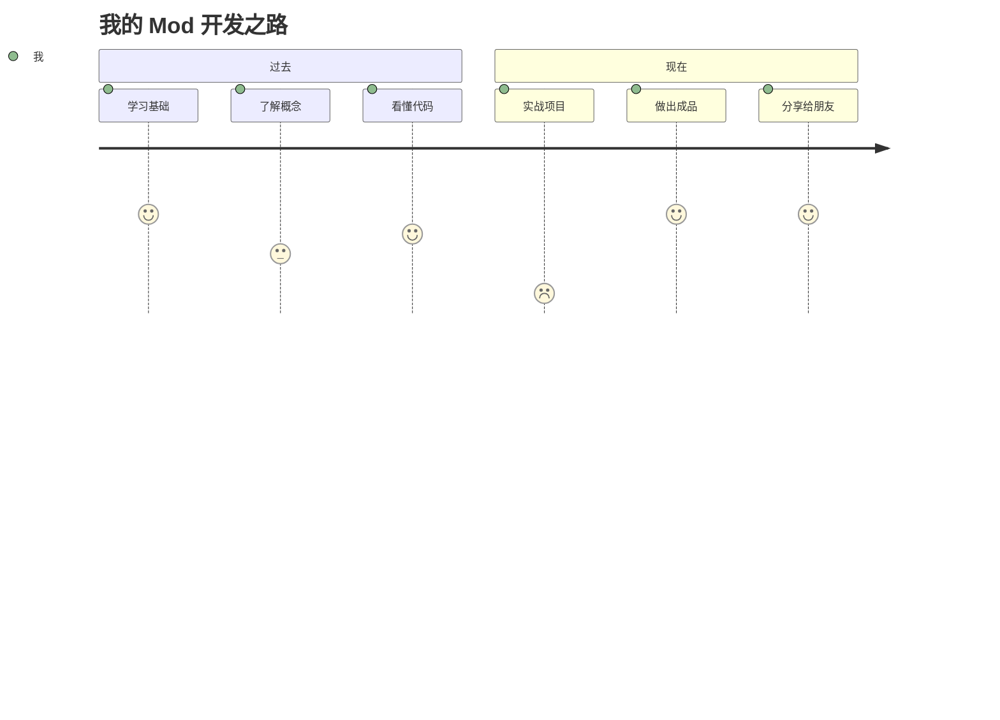

你学到的知识就像一把瑞士军刀，现在该用它来创造东西了！

### 1.2 这个项目能学到什么？

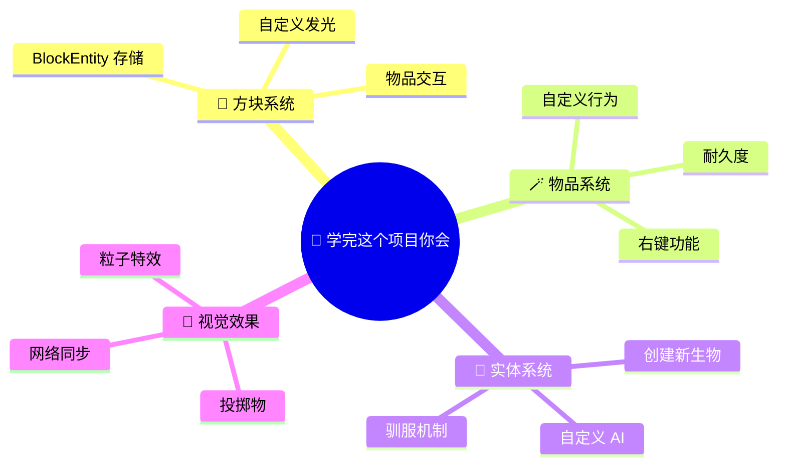

### 1.3 成就感来源

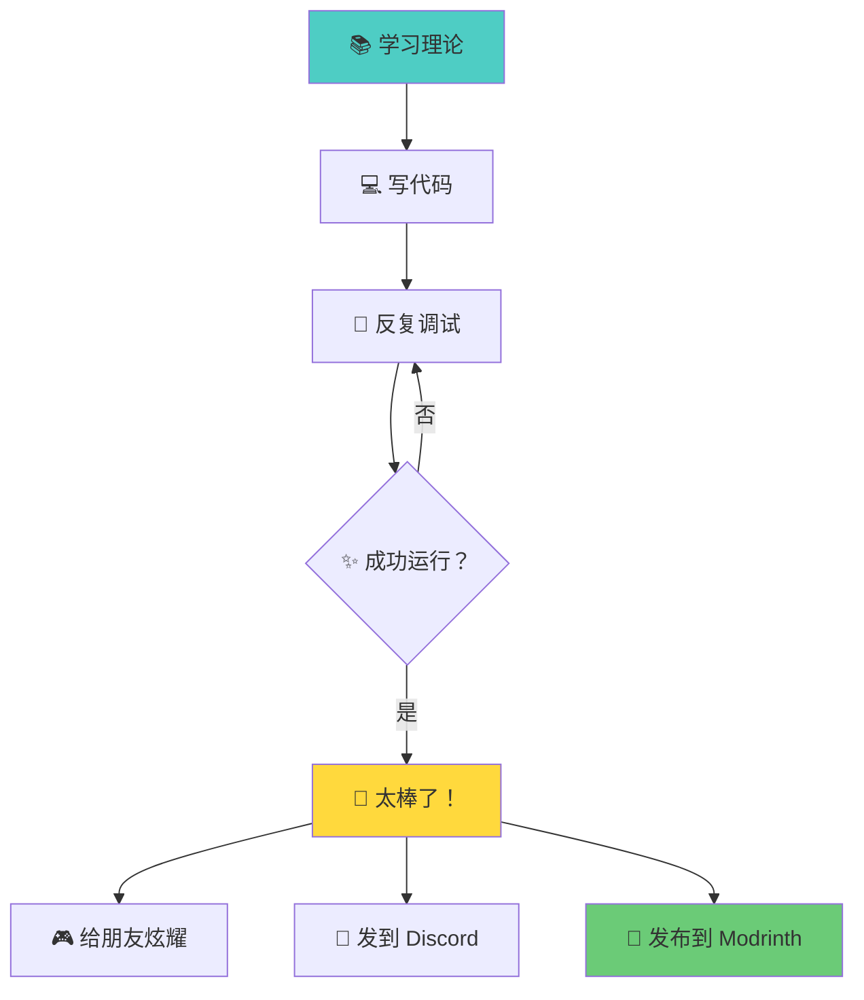

---

## 2. 我们要做什么

### 2.1 项目全景图

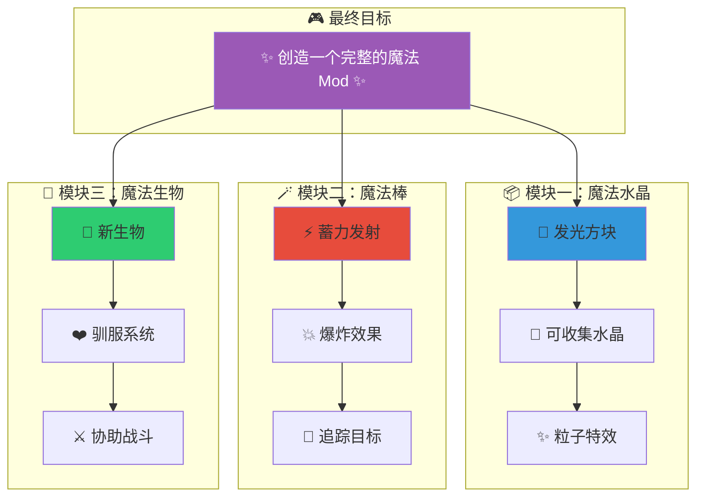

### 2.2 模块一：魔法水晶 💎

> 你的第一个作品 —— 会发光的魔法水晶！

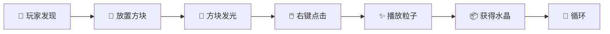

**功能清单**：
- ✅ 发着紫光的方块
- ✅ 右键收集水晶
- ✅ 粒子特效
- ✅ 耐久度系统

### 2.3 模块二：魔法棒 🪄

> 发射魔法弹，boom！

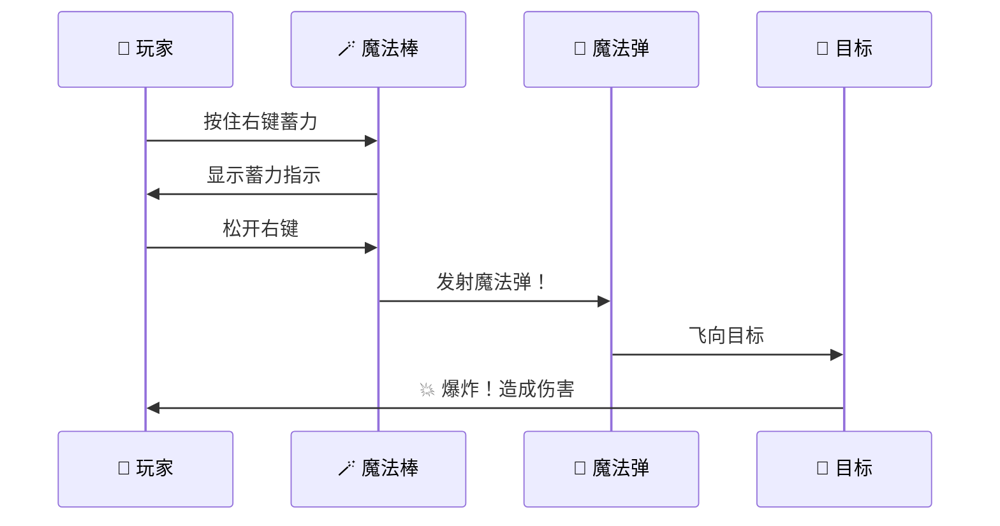

**功能清单**：
- ✅ 蓄力系统
- ✅ 发射魔法弹
- ✅ 爆炸效果
- ✅ 耐久度消耗

### 2.4 模块三：魔法生物 🧚

> 驯服你的魔法小伙伴！

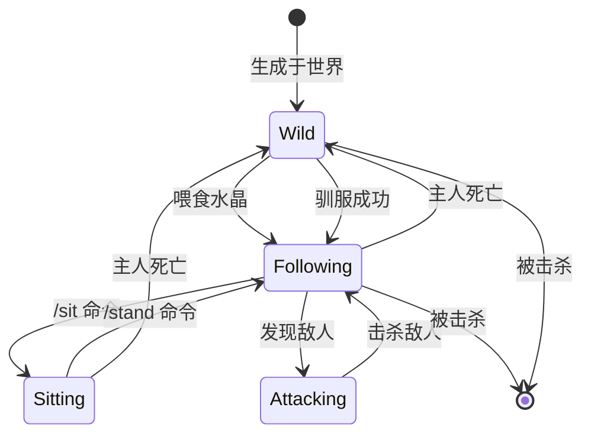

**功能清单**：
- ✅ 自然生成
- ✅ 用水晶驯服
- ✅ 跟随/坐下命令
- ✅ 协助攻击

---

## 3. 项目架构

### 3.1 目录结构

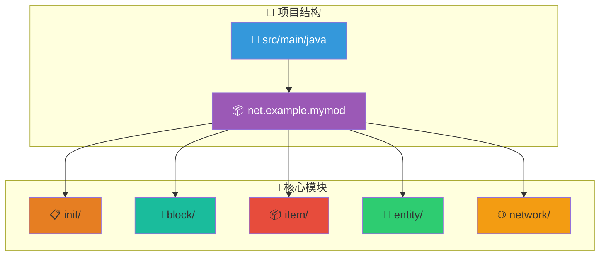

**详细文件**：

```mermaid
filesystem
    .
    ├── Mymod.java ────────────── "🎮 Mod 入口"
    ├── init/
    │   ├── ModBlocks.java ───── "🧱 方块注册"
    │   ├── ModItems.java ────── "📦 物品注册"
    │   └── ModEntities.java ──── "👾 实体注册"
    ├── block/
    │   └── MagicCrystalBlock.java "💎 魔法水晶方块"
    ├── item/
    │   ├── MagicCrystalItem.java "🧪 水晶物品"
    │   └── MagicWandItem.java ─ "🪄 魔法棒"
    ├── entity/
    │   ├── MagicCreature.java ── "🧚 魔法生物"
    │   └── MagicCreatureGoals.java "🤖 AI 行为"
    └── network/
        └── ModNetworking.java ─── "🌐 网络通信"
```

### 3.2 依赖关系图

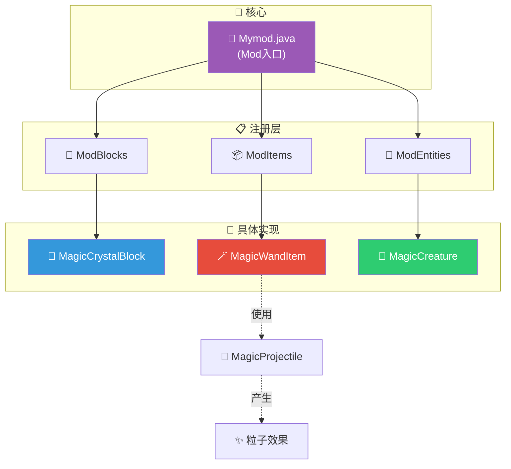

---

## 4. 技术要点

### 4.1 学习路径图

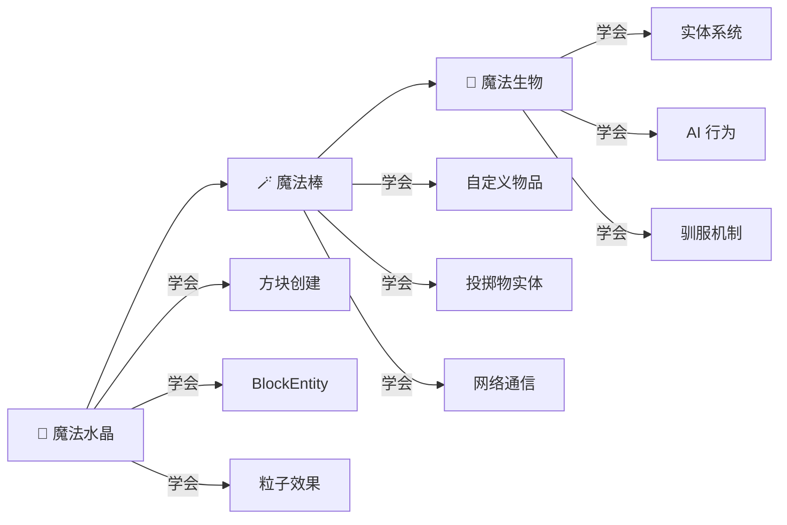

### 4.2 技术对照表

```mermaid
table
    | 模块 | 技术点 | 难度 |
    |------|--------|------|
    | 💎 魔法水晶 | BlockEntity 存储 | ⭐⭐ |
    | 💎 魔法水晶 | luminance() 发光 | ⭐ |
    | 💎 魔法水晶 | 粒子特效 | ⭐⭐ |
    | 🪄 魔法棒 | Item.use() 物品使用 | ⭐⭐ |
    | 🪄 魔法棒 | ProjectileEntity 投掷物 | ⭐⭐⭐ |
    | 🪄 魔法棒 | 网络同步 | ⭐⭐⭐ |
    | 🧚 魔法生物 | PathAwareEntity | ⭐⭐⭐ |
    | 🧚 魔法生物 | GoalSelector AI | ⭐⭐⭐⭐ |
    | 🧚 魔法生物 | Tameable 驯服 | ⭐⭐⭐ |
```

### 4.3 核心概念关联

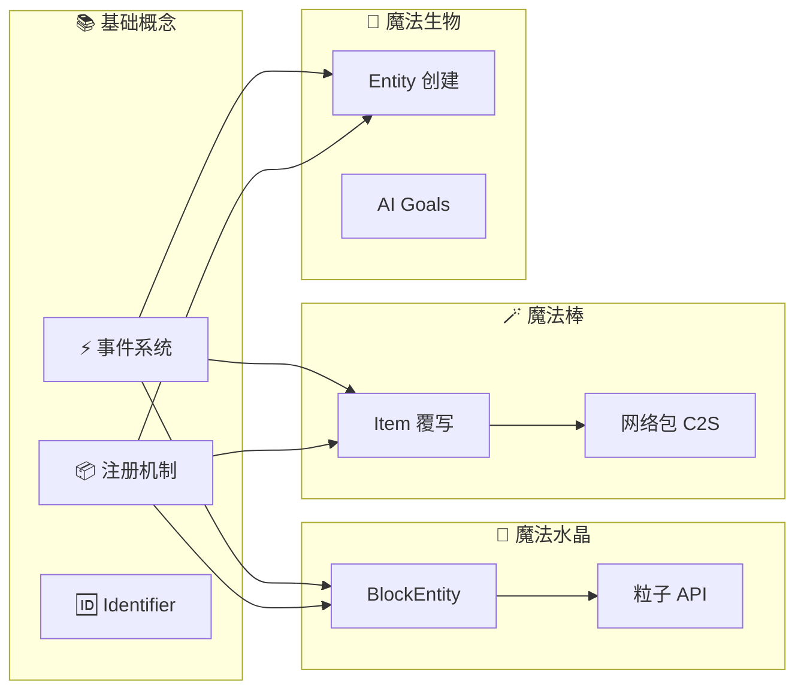

---

## 5. 准备工作

### 5.1 前置知识检查

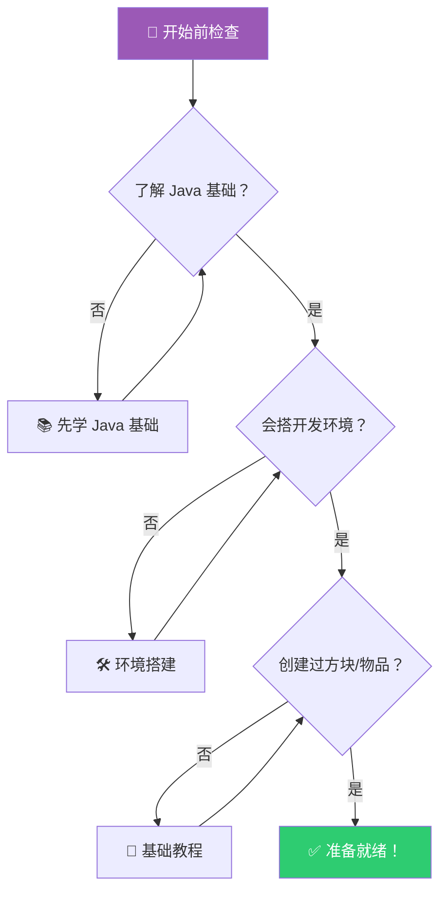

### 5.2 环境检查清单


### 5.3 开始前确认

> 运行以下命令确认环境：

```bash
# 检查 Java 版本
java -version
# 应该显示：java version "21.x.x"

# 检查 Gradle
./gradlew --version
# 应该正常运行
```

---

## 🎯 总结

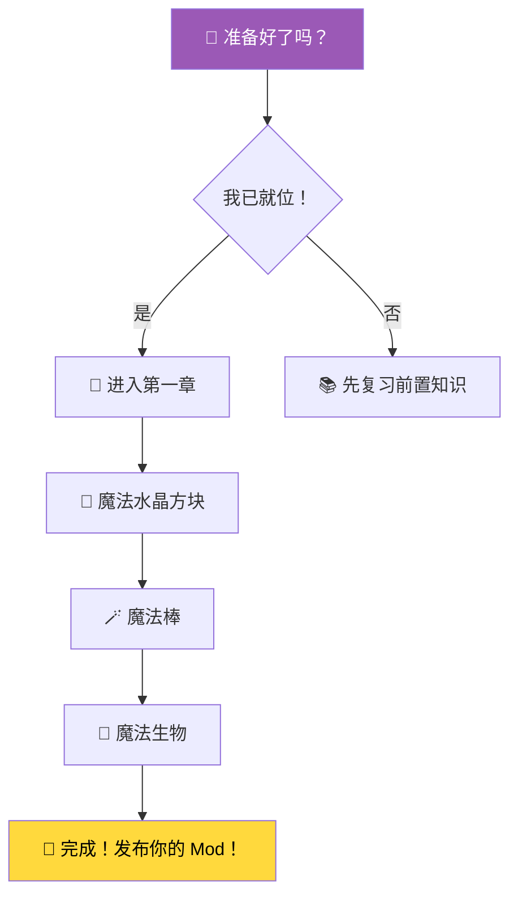

### 你将获得：

- ✅ 一个完整的 Mod 源码
- ✅ 3 个自定义方块/物品/实体
- ✅ 网络同步的实战经验
- ✅ 发布到 Modrinth 的能力
- ✅ 在朋友面前炫耀的资本 😎

---

## 下一步

准备好开始了吗？

- [💎 第一章：魔法水晶](./02-magic-crystal.md) - 创建会发光的方块
- [🪄 第二章：魔法棒](./03-magic-wand.md) - 发射魔法弹
- [🧚 第三章：魔法生物](./04-magic-creature.md) - 驯服你的伙伴

---

*🎮 "代码改变世界，Mod 改变 Minecraft！"*
