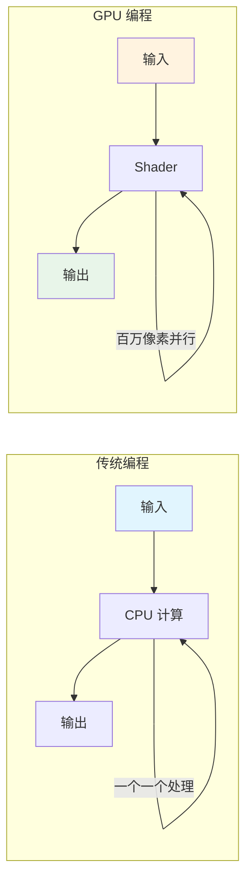
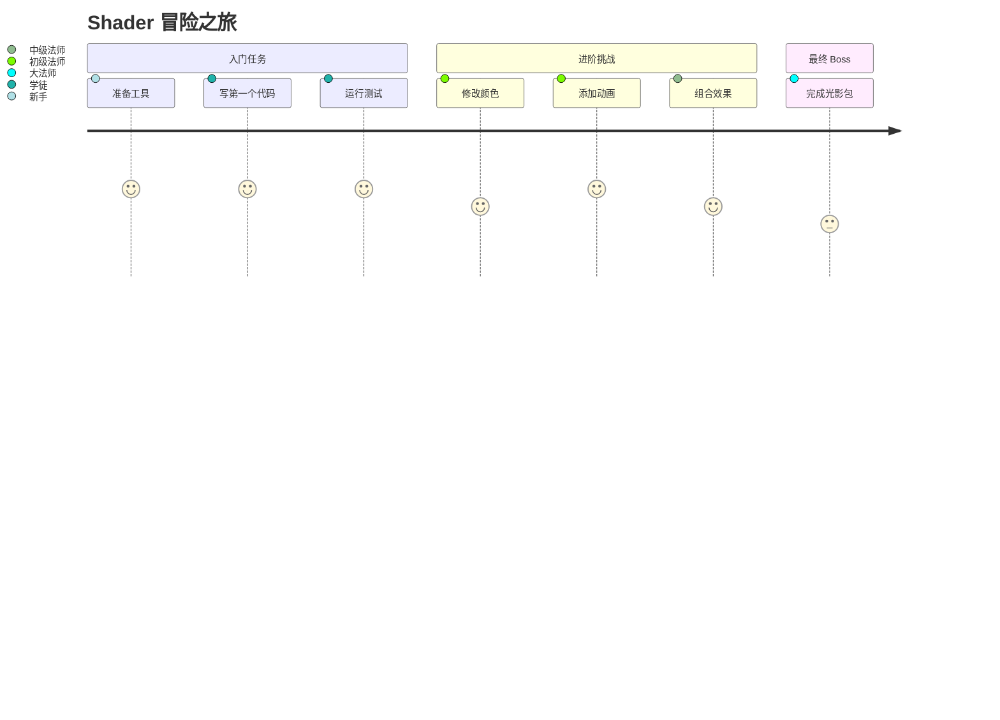

# 🎮 从零开始的 Shader 冒险！

> 欢迎来到 Iris 光影开发的世界！在这门教程中，你将学会如何创造酷炫的视觉效果。

---

## 📖 课程介绍

### 你会学到什么？

完成本课程后，你将能够创造这样的效果：

```
✨ 效果展示（学完课程后你能做到的）

┌─────────────────────────────────────────────────────────────┐
│                                                             │
│   🌈 彩虹呼吸效果      💡 动态光照      🌊 水面波纹      │
│                                                             │
│   🎨 颜色分级         🔮 赛博朋克风     🌅 动态天空      │
│                                                             │
│   ✨ 发光效果         🎭 卡通渲染       💎 宝石光泽      │
│                                                             │
└─────────────────────────────────────────────────────────────┘
```

### 学习路线图

```mermaid
flowchart TB
    subgraph 入门
        A[🚀 第一章：Shader 是什么？] --> B[⚙️ 第二章：开发环境]
        B --> C[🎨 第三章：第一个颜色]
    end

    subgraph 基础
        C --> D[🏗️ 第四章：ShaderPack 结构]
        D --> E[📦 第五章：Uniform 变量]
    end

    subgraph 进阶
        E --> F[✨ 第六章：让世界动起来]
        F --> G[🔮 第七章：后处理魔法]
        G --> H[🏆 第八章：创造你的光影包]
    end

    A -.-> |"边玩边学| A
    C -.-> |"动手实验| C
    F -.-> |"创意发挥| F
```

---

## 🎯 先来看看最终效果

在我们开始之前，先让你看看学完课程后能创造出什么：

### 效果 1：彩虹呼吸 🌈

```glsl
// 学完第一章就能做！
vec4 rainbowBreath = vec4(
    sin(time * 2.0),      // R 通道随时间变化
    sin(time * 2.0 + 2.0), // G 通道相位偏移
    sin(time * 2.0 + 4.0), // B 通道相位偏移
    1.0
);
```

效果展示：
```
时间 t=0          时间 t=1          时间 t=2          时间 t=3
   ▼                 ▼                 ▼                 ▼
███████         █████████         █████████         █████████
█赭█████       ████赭████       ███赭█████       ██赭██████
█赭█████  -->  ███赭█████  -->  ██赭██████  -->  █赭███████
██赭████       ██赭██████       █赭████████       赭████████
█████████       ██████████       ██████████       ██████████
 红色           橙红色           黄色              绿色
```

### 效果 2：脉冲发光

```glsl
// 方块像心跳一样发光
float pulse = 0.8 + 0.2 * sin(time * 3.0);
vec3 glowing = baseColor * pulse;
```

### 效果 3：赛博朋克风

```
┌────────────────────────────────────────────────────────────┐
│                                                            │
│   ████████████████  ████  ████  ████████████████         │
│   ██            ██  ████  ████  ██            ██         │
│   ██  ████████  ██  ██████████████  ██  ████████  ██     │
│   ██  ██      ██  ████████████████  ██  ██      ██  ██ │
│   ██  ██  ██  ██        ██████        ██  ██  ██  ██  ██ │
│   ██  ████████  ████████████████  ██  ██  ████████  ██  ██ │
│   ████████████████  ████  ████  ████████████████        │
│                                                            │
│              🔮 赛 博 朋 克 霓虹 城 市                     │
└────────────────────────────────────────────────────────────┘
```

---

## 📚 课程大纲

| 章节 | 标题 | 你会做什么 | 难度 |
|------|------|-----------|------|
| 01 | Shader 是什么？ | 理解原理，看到可能性 | ⭐ |
| 02 | 开发环境搭建 | 准备好你的工具 | ⭐ |
| 03 | 第一个颜色魔法 | 让世界变亮/变暗 | ⭐ |
| 04 | ShaderPack 结构 | 理解文件组织 | ⭐⭐ |
| 05 | Uniform 变量 | 让画面动起来 | ⭐⭐ |
| 06 | 实战：彩虹呼吸 | 创建多彩效果 | ⭐⭐⭐ |
| 07 | 后处理魔法 | 全屏特效 | ⭐⭐⭐ |
| 08 | 你的第一个光影包 | 综合实战 | ⭐⭐⭐⭐ |

---

## 🤔 为什么学 Shader？

### 传统编程 vs Shader 编程



| 对比 | CPU 程序 | Shader |
|------|---------|--------|
| 同时处理 | 1 个任务 | 百万像素 |
| 擅长 | 逻辑判断 | 图形计算 |
| 速度 | 慢 | 超快 |
| 用途 | 游戏逻辑 | 视觉效果 |

---

## 🎮 游戏般的学习体验



每完成一章，你就升级一次！

---

## 🚀 准备好了吗？

让我们开始 Shader 冒险之旅！

👉 [第一章：Shader 是什么？让我们一探究竟！](01-shader-basics.md)

---

## 💬 常见问题

**Q: 我需要会 Java 吗？**
A: 不需要！Shader 使用的是 GLSL 语言，和 Java 完全不一样。

**Q: 我需要懂数学吗？**
A: 基本的加减乘除就够了。我们会解释所有用到的数学。

**Q: 学完能找到工作吗？**
A: Shader 开发是游戏行业的热门技能，学会后可以做游戏、特效、AR/VR！

**Q: 需要什么配置的电脑？**
A: 任何能运行 Minecraft 的电脑都可以开发 Shader。

---

*准备好了吗？让我们开始吧！🚀*

*教程版本：Iris 1.7.x / Minecraft 1.21*
