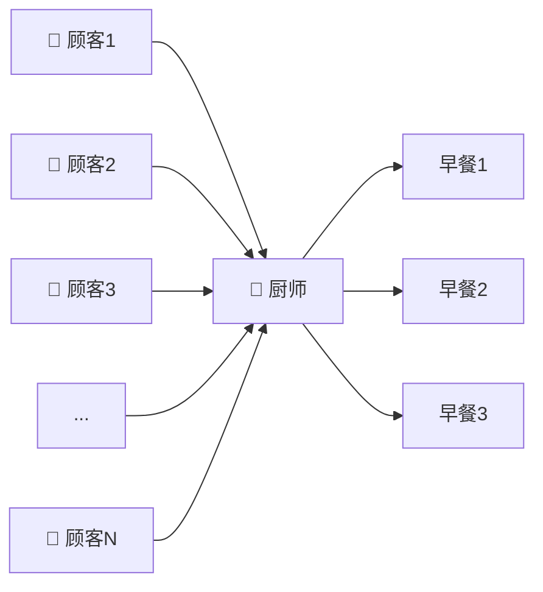
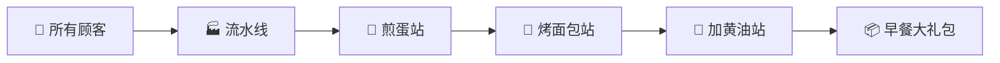
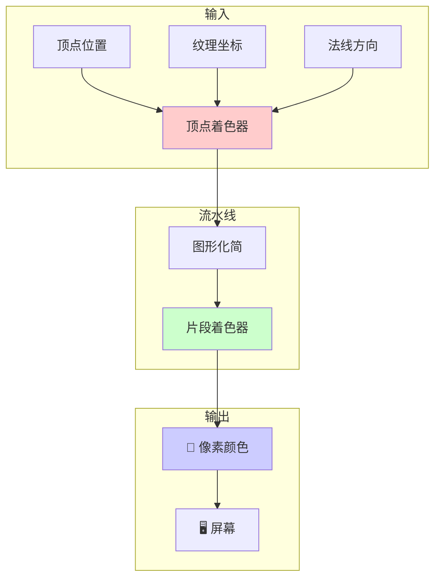
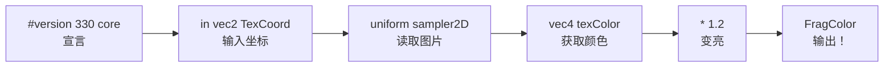
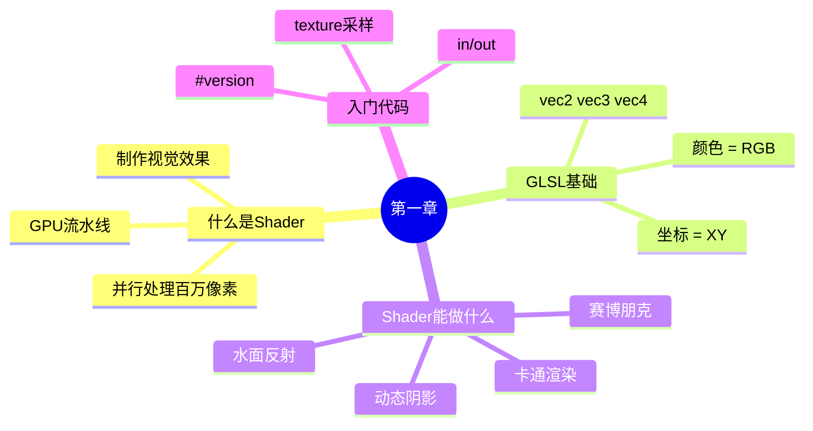

# 🚀 第一章：Shader 是什么？

> 🎮 *让我们一探究竟！*

---

## 🎯 本章目标

```
完成本章后，你将：
├── 💡 理解 Shader 是什么
├── 🎨 明白它和普通程序的区别
├── 🌈 看到 Shader 能做什么
└── 😎 准备好写你的第一行代码
```

---

## 🍳 先用一个比喻：厨师 vs 流水线工人

想象你要给 1000 个人做早餐：

### ❌ 普通程序 = 一个厨师



**问题**：一个厨师，顺序做饭，太慢了！

### ✅ Shader = 流水线厨房



**优势**：所有顾客同时收到早餐！

---

## 🖥️ Shader 在电脑里做什么？

**Shader 就是那个"流水线"——但它生产的是像素颜色！**



---

## 🎨 Minecraft 里的 Shader

当你加载一个 Shader 时，你在修改这个流水线：

```
原版 Minecraft                    加载 Shader 后
┌─────────────────┐              ┌─────────────────┐
│ 🌞 自然光照    │              │ 🌟 动态阴影    │
│ 🏞️ 基础颜色   │     ──▶     │ 🌈 颜色分级    │
│ 💧 普通水面    │              │ 🌊 反射波纹    │
│ ☁️ 简单云朵    │              │ ✨ 大气散射    │
└─────────────────┘              └─────────────────┘
```

### 举几个 Shader 能实现的例子：

| 效果 | 原版 | Shader 版本 |
|------|------|-------------|
| 光照 | 固定亮度 | 动态阳光追踪 |
| 阴影 | 无 | 实时软阴影 |
| 水面 | 纯色 | 反射+折射+波纹 |
| 天空 | 固定渐变 | 大气散射+云层 |

---

## 🔥 视觉冲击！看看这些 Shader 效果

### 1. 赛博朋克风格 🌃

```
原版                          赛博朋克 Shader
┌─────────────┐              ┌─────────────┐
│             │              │ ▓▒░▓▒░▓▒░▓▒│
│   🌄 日落   │    ──▶      │ ▒░▓▒░▓▒░▓▒░│
│             │              │ ▓▒░▓▒░ 霓虹 │    ← 霓虹灯光
│  自然颜色   │              │ ▒░▓▒░ 粉紫 │    ← 色调偏移
│             │              │ ▓▒░▓▒░▓▒░▓▒│
└─────────────┘              └─────────────┘
```

### 2. 卡通渲染 🎭

```
原版                          卡通 Shader
┌─────────────┐              ┌─────────────┐
│             │              │ ▓▓▓▓▓▓▓▓▓▓│
│   渐变阴影  │    ──▶      │ ░░▓▓▓▓▓▓▓▓│    ← 只有2-3个色阶
│             │              │ ░░░░▓▓▓▓▓▓│
│             │              │ ▓▓▓▓ 描边  │    ← 边缘线
└─────────────┘              └─────────────┘
```

### 3. 水面反射 🌊

```
原版                          水面 Shader
┌─────────────┐              ┌─────────────┐
│             │              │   ☁️ 天空    │
│   蓝色平面   │    ──▶      │  ～～～～～ │
│             │              │ ▒▒▒▒▒▒▒▒▒▒│    ← 水面
│   静态      │              │  波浪动画    │
└─────────────┘              │  反射+波纹  │
                              └─────────────┘
```

---

## 📝 什么是 GLSL？

**GLSL = OpenGL Shading Language**

它是写 Shader 的语言，就像 HTML 是写网页的语言一样。

### 和普通编程语言对比

| 特性 | GLSL | Java/Python |
|------|------|-------------|
| 运行位置 | GPU（显卡） | CPU（处理器） |
| 并行能力 | 百万线程 | 几个线程 |
| 擅长 | 图形计算 | 逻辑判断 |
| 数据类型 | vec2, vec3, vec4 | int, float, list |

---

## 🎮 GLSL 入门：变量类型

### 1. 标量（Scalar）- 单一数值

```glsl
float brightness = 1.5;    // 小数
int count = 42;             // 整数
bool isDay = true;          // 真/假
```

### 2. 向量（Vector）- 一组数 🔥

**这是 GLSL 最常用的类型！**

```glsl
// vec2 = 2个数（用于坐标、UV）
vec2 uv = vec2(0.5, 1.0);    // uv.x = 0.5, uv.y = 1.0

// vec3 = 3个数（用于颜色、位置）
vec3 color = vec3(1.0, 0.0, 0.0);  // RGB = 红
vec3 position = vec3(10.0, 20.0, 30.0);

// vec4 = 4个数（用于带透明度的颜色）
vec4 pixel = vec4(1.0, 0.5, 0.0, 1.0);  // RGBA
```

### 3. 向量的骚操作 🔥

```glsl
vec3 red = vec3(1.0, 0.0, 0.0);
vec3 green = vec3(0.0, 1.0, 0.0);
vec3 blue = vec3(0.0, 0.0, 1.0);

// 加法 = 混合颜色
vec3 yellow = red + green;  // 红色 + 绿色 = 黄色 ✓

// 数乘 = 调整亮度
vec3 darkRed = red * 0.5;  // 暗红色
vec3 brightRed = red * 2.0;  // 亮红色
```

### 4. 颜色可视化 🎨

```glsl
// 所有颜色都是 RGB 的组合
vec3 black  = vec3(0.0, 0.0, 0.0);  // 无光 = 黑
vec3 white  = vec3(1.0, 1.0, 1.0);  // 全光 = 白
vec3 red    = vec3(1.0, 0.0, 0.0);  // 红色通道最大
vec3 cyan   = vec3(0.0, 1.0, 1.0);  // 绿+蓝 = 青

// 🎯 试试猜猜这个颜色
vec3 orange = vec3(1.0, 0.5, 0.0);  // 提示：红色多，绿色少，蓝色没有
```

---

## 🧪 第一个实验：Hello Shader！

### 代码长什么样？

```glsl
#version 330 core    // 告诉显卡我们用的是 GLSL 3.3

in vec2 TexCoord;    // 输入：这张图的位置（0-1之间）
uniform sampler2D Texture;  // 输入：图片纹理

out vec4 FragColor;  // 输出：最终颜色

void main() {        // 每个像素都会执行这个函数！
    vec4 texColor = texture(Texture, TexCoord);  // 读取图片颜色
    FragColor = texColor * 1.2;  // 输出：原色但亮20%
}
```

### 一行一行解释



---

## 🎯 小测验时间！

### 问题 1：这是什么颜色？

```glsl
vec3 color = vec3(1.0, 1.0, 0.0);
```

<details>
<summary>👆 点击查看答案</summary>

**黄色！** 因为 R=1（最大）, G=1（最大）, B=0（没有）

</details>

### 问题 2：如何让颜色变暗一半？

<details>
<summary>👆 点击查看答案</summary>

```glsl
vec3 darkColor = originalColor * 0.5;
```

</details>

### 问题 3：如何让红色变成粉色？

<details>
<summary>👆 点击查看答案</summary>

```glsl
vec3 pink = vec3(1.0, 0.8, 0.8);  // 白色 * 红色
// 或者
vec3 pink = vec3(1.0, 0.5, 0.5);  // 更深一点的粉
```

</details>

---

## 📊 本章总结



### 记住这三件事：

| 概念 | 说明 | 类比 |
|------|------|------|
| **GPU 并行** | 同时处理所有像素 | 流水线工厂 |
| **GLSL 向量** | vec3 = RGB 颜色 | 调色盘 |
| **Shader 输入输出** | in = 坐标, out = 颜色 | 配方 |

---

## 🚀 下一步

👉 [⚙️ 第二章：开发环境搭建 - 准备好你的工具！](02-iris-setup.md)

---

## 🎮 课外探索

想看更多炫酷效果？

- 🔮 [Sildurs Vibrant Shaders](https://www.curseforge.com/minecraft/customization/sildurs-vibrant-shaders) - 真实感光影
- 🌙 [BSL Shaders](https://bitslablab.com/bslshaders/) - 电影感色调
- 🎭 [Chocapic Shaders](https://www.chocapic13.com/) - 卡通+写实混合

---

*🎉 恭喜你完成第一章！你已经知道了 Shader 的基本原理！*

*下一章我们将搭建开发环境，然后写真正的代码！*
