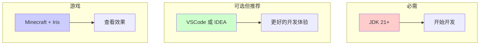
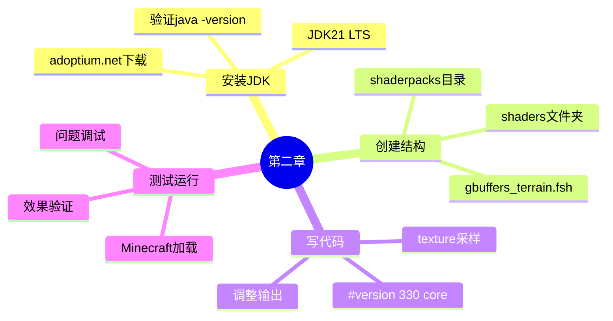

# ⚙️ 第二章：开发环境搭建

> 🎮 *准备好你的工具！*

---

## 🎯 本章目标

```
完成本章后，你将：
├── 💻 安装 JDK（Java 开发工具包）
├── 📁 创建你的第一个 ShaderPack
├── 🎮 在 Minecraft 中测试效果
└── 🐛 学会调试常见问题
```

---

## 🤔 你需要什么？

### 工具清单



| 工具 | 必须？ | 用途 |
|------|--------|------|
| JDK 21+ | ✅ 是 | 运行 Minecraft |
| 代码编辑器 | 推荐 | 写代码更方便 |
| Minecraft + Iris | ✅ 是 | 看效果 |

---

## 💻 第一步：安装 JDK

### 什么是 JDK？

```
JDK = Java Development Kit
     Java 开发工具包

┌─────────────────────────────────────┐
│                                     │
│   你写的代码 (.java)               │
│           ↓                         │
│   JDK 编译器 (javac)               │
│           ↓                         │
│   字节码 (.class)                  │
│           ↓                         │
│   JVM 虚拟机运行                    │
│                                     │
└─────────────────────────────────────┘
```

### 下载 JDK

1. 打开浏览器访问：[Adoptium.net](https://adoptium.net/)
2. 点击 "Download"
3. 选择 "JDK 21"（LTS 版本）
4. 下载 Windows x64 安装包

### 安装步骤

```
📦 安装向导

1️⃣ 欢迎界面 ──▶ 点击 "Next"
       │
       ▼
2️⃣ 安装路径 ──▶ 建议：C:\Program Files\Eclipse Adoptium\jdk-21
       │
       ▼
3️⃣ 完成 ──▶ 点击 "Close"
```

### 验证安装

打开 PowerShell，输入：

```powershell
java -version
```

应该看到类似输出：

```
openjdk version "21.0.x" ...
```

---

## 📁 第二步：创建 ShaderPack 骨架

### 你的第一个 ShaderPack

```
📁 shaderpacks/                          ← 放到 Minecraft 目录
 └── 📁 my-awesome-shaders/            ← 你给光影包起的名字
      └── 📁 shaders/                   ← 固定名字！
           └── 📄 gbuffers_terrain.fsh  ← 关键文件！
```

### 创建步骤

```
🎮 Windows 操作

1️⃣ 打开文件资源管理器
       │
       ▼
2️⃣ 导航到：C:\Users\你的用户名\AppData\Roaming\.minecraft
       │     （如果看不到 AppData，勾选"显示隐藏文件"）
       │
       ▼
3️⃣ 创建 shaderpacks 文件夹（如果没有）
       │
       ▼
4️⃣ 在 shaderpacks 里创建你的文件夹
       │
       ▼
5️⃣ 在里面创建 shaders 文件夹
       │
       ▼
6️⃣ 在 shaders 里创建 gbuffers_terrain.fsh
```

### 快速命令（PowerShell）

```powershell
# 一条命令搞定！
mkdir "$env:APPDATA\.minecraft\shaderpacks\my-awesome-shaders\shaders"
cd "$env:APPDATA\.minecraft\shaderpacks\my-awesome-shaders\shaders"

# 创建文件
New-Item -Name "gbuffers_terrain.fsh" -ItemType File
```

---

## ✍️ 第三步：写第一行代码

### 用记事本打开文件

```powershell
# 用记事本打开
notepad "$env:APPDATA\.minecraft\shaderpacks\my-awesome-shaders\shaders\gbuffers_terrain.fsh"
```

### 输入这个代码

```glsl
#version 330 core

in vec2 TexCoord;
uniform sampler2D DiffuseSampler;

out vec4 fragColor;

void main() {
    vec4 texColor = texture(DiffuseSampler, TexCoord);
    fragColor = texColor * 1.5;
}
```

### 保存文件

```
Ctrl + S  ──▶  保存
```

---

## 🎮 第四步：在游戏中测试

### 启动 Minecraft

1. 打开 Minecraft Launcher
2. 确保使用 Fabric 1.21 版本
3. 进入游戏

### 加载 ShaderPack

```
🎮 操作步骤

主菜单
  │
  ▼
选项 (Options)
  │
  ▼
视频设置 (Video Settings)
  │
  ▼
着色器 (Shaders)
  │
  ▼
🎨 我的着色器列表
  │
  ▼
选择 "my-awesome-shaders"
  │
  ▼
点击 "完成" (Done)
```

### 查看效果

```
✅ 成功指标

┌─────────────────────────────┐
│                             │
│   世界变亮了！              │
│   (亮度增加 50%)           │
│                             │
│   草更绿，天更蓝          │
│   整体更明亮              │
│                             │
└─────────────────────────────┘

❌ 失败标志

- 世界全黑 → 检查代码是否写错
- 世界全白 → 检查 * 1.5 是否太大
- 报错信息 → 查看下面的常见问题
```

---

## 🐛 第五步：常见问题排解

### 问题 1：找不到 AppData 文件夹

```
📂 显示隐藏文件

Windows 11:
资源管理器 → 查看 → 显示 → ☑ 隐藏的项目

Windows 10:
资源管理器 → 查看 → 选项 → 查看 → ☑ 显示隐藏文件
```

### 问题 2：世界全黑/全白

```diff
# 如果全黑，检查是否乘了 0
- fragColor = texColor * 0.0;  // ❌ 乘以0 = 全黑

# 如果全白，检查是否乘得太大
- fragColor = texColor * 100.0;  // ❌ 太大 = 全白

# 正确的做法
+ fragColor = texColor * 1.5;  // ✅ 1.5 = 亮50%
+ fragColor = texColor;  // ✅ 1.0 = 原色
+ fragColor = texColor * 0.5;  // ✅ 0.5 = 暗一半
```

### 问题 3：ShaderPack 不在列表里

```
检查清单：

☐ 文件夹在正确位置？(shaderpacks/)
☐ shaders 文件夹存在？
☐ gbuffers_terrain.fsh 存在？
☐ 扩展名是 .fsh 不是 .txt？
☐ 名称拼写正确？
```

### 问题 4：游戏崩溃

```diff
# 最简单的测试代码
+ #version 330 core
+
+ in vec2 TexCoord;
+ uniform sampler2D DiffuseSampler;
+
+ out vec4 fragColor;
+
+ void main() {
+     fragColor = vec4(1.0, 0.0, 0.0, 1.0);
+ }
# 这会显示纯红色，如果能显示说明基本功能正常
```

---

## 🛠️ 推荐：安装代码编辑器

### 为什么用代码编辑器？

| 功能 | 记事本 | VSCode |
|------|--------|--------|
| 语法高亮 | ❌ | ✅ |
| 括号匹配 | ❌ | ✅ |
| 自动补全 | ❌ | ✅ |
| 代码折叠 | ❌ | ✅ |
| 错误提示 | ❌ | ✅ |

### 安装 VSCode

1. 访问 [code.visualstudio.com](https://code.visualstudio.com/)
2. 下载 Windows 版本
3. 安装（默认设置即可）

### 安装 GLSL 插件

```
1️⃣ 打开 VSCode
       │
       ▼
2️⃣ 点击左侧扩展图标（或 Ctrl+Shift+X）
       │
       ▼
3️⃣ 搜索 "GLSL"
       │
       ▼
4️⃣ 安装 "GLSL Linter" 或类似插件
```

---

## 📊 环境检查清单

```
✅ 完成清单

☐ JDK 21 已安装
☐ java -version 能显示版本
☐ shaderpacks 文件夹已创建
☐ my-awesome-shaders 已创建
☐ shaders 文件夹已创建
☐ gbuffers_terrain.fsh 已创建
☐ 第一行代码已写入
☐ Minecraft + Fabric 已安装
☐ Iris Mod 已安装
☐ ShaderPack 已加载
☐ 效果已显示
```

---

## 🎯 小挑战

### 挑战 1：变暗

修改代码，让世界变暗而不是变亮。

<details>
<summary>👆 答案</summary>

```glsl
fragColor = texColor * 0.5;  // 0.5 = 暗一半
```

</details>

### 挑战 2：反向颜色

让颜色反相（红色变青色等）

<details>
<summary>👆 提示</summary>

```glsl
# 1.0 - 原色 = 反相
fragColor = vec4(1.0 - texColor.rgb, texColor.a);
```

</details>

---

## 📊 本章总结



---

## 🚀 下一步

👉 [🎨 第三章：第一个颜色魔法 - 让世界变亮/变暗/变色！](03-first-color.md)

---

*🎉 恭喜你完成环境搭建！*

*下一章我们将学习如何调整颜色！*
