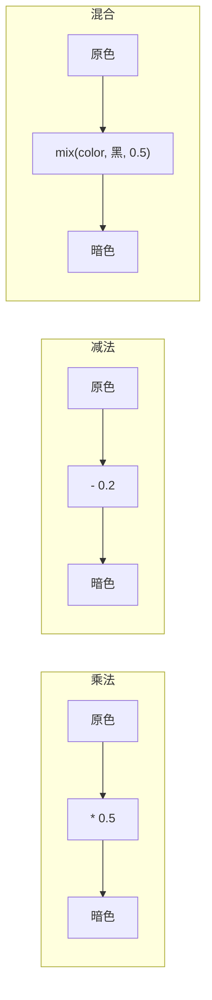
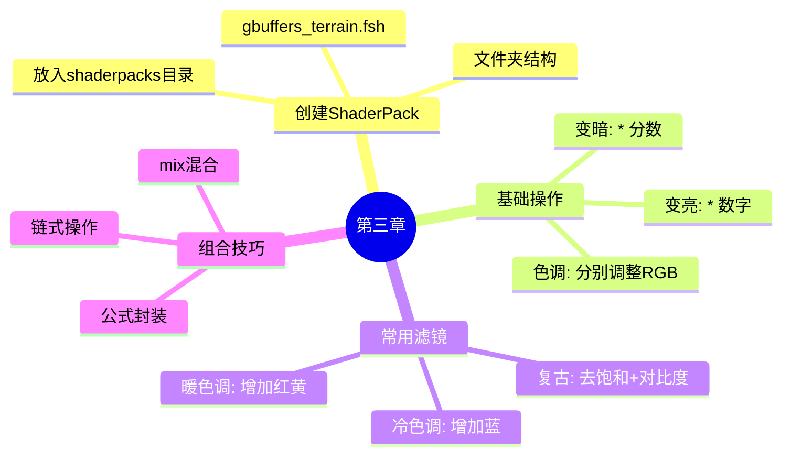

# 🎨 第三章：第一个颜色魔法

> ✨ *让 Minecraft 世界变亮、变暗、变色！*

---

## 🎯 本章目标

```
完成本章后，你将能够：
├── 🎨 让方块变亮或变暗
├── 🌈 调整颜色饱和度
├── 🔴🔵 改变世界的色调
└── 🏗️ 创建你的第一个 ShaderPack
```

---

## 🏗️ 创建你的第一个 ShaderPack

### 第一步：创建文件夹结构

```
📁 shaderpacks/                    ← 放到 Minecraft 目录
 └── 📁 my-awesome-shaders/       ← 你的光影包名字（随便取！）
      └── 📁 shaders/             ← 固定名字，不能改！
           └── 📄 gbuffers_terrain.fsh   ← 这是关键文件！
```

### 第二步：写代码！

打开 `gbuffers_terrain.fsh`，输入：

```glsl
#version 330 core

in vec2 TexCoord;
uniform sampler2D DiffuseSampler;

out vec4 fragColor;

void main() {
    // 读取原版纹理颜色
    vec4 texColor = texture(DiffuseSampler, TexCoord);

    // 输出原色（不做任何修改）
    fragColor = texColor;
}
```

### 第三步：放入游戏测试

```
📁 C:\Users\你的用户名\AppData\Roaming\.minecraft\shaderpacks\
    └── 📁 my-awesome-shaders/
         └── 📁 shaders/
              └── 📄 gbuffers_terrain.fsh
```

### 第四步：启动游戏

1. 进入游戏
2. `选项` → `视频设置` → `着色器`
3. 选择 `my-awesome-shaders`
4. 进入世界看看！

> 🎉 如果世界正常显示，说明你成功了！

---

## 🎮 实验 1：让世界变亮！

### 修改代码

```glsl
#version 330 core

in vec2 TexCoord;
uniform sampler2D DiffuseSampler;

out vec4 fragColor;

void main() {
    vec4 texColor = texture(DiffuseSampler, TexCoord);

    // ✨ 乘以 1.5 = 亮度增加 50%
    fragColor = texColor * 1.5;
}
```

### 结果对比

```
原版                          变亮后
┌─────────────────┐         ┌─────────────────┐
│                 │         │                 │
│    🟫 泥土色   │   ──▶   │    🟧 亮泥土   │
│                 │         │                 │
│    🟩 草地色   │         │    🟩 亮草色   │
│                 │         │                 │
└─────────────────┘         └─────────────────┘
亮度: 100%                   亮度: 150%
```

### 不同倍数的效果

| 代码 | 效果 | 感觉 |
|------|------|------|
| `* 0.5` | 变暗 | 夜晚？ |
| `* 1.0` | 原版 | 无变化 |
| `* 1.5` | 变亮 | 阳光明媚 |
| `* 2.0` | 很亮 | HDR 效果 |

---

## 🎮 实验 2：让世界变暗！

### 变暗的不同方法

```glsl
// 方法 1：乘法（简单粗暴）
fragColor = texColor * 0.5;          // 整体暗一半

// 方法 2：减法（保留色调）
fragColor = texColor - vec4(0.2);   // 减去固定亮度

// 方法 3：混合黑色
fragColor = mix(texColor, vec4(0.0), 0.5);  // 50% 黑色混合
```

### 可视化理解



### 效果对比

```
乘法 (* 0.5)        减法 (- 0.2)         混合
┌───────────┐     ┌───────────┐     ┌───────────┐
│ ████████  │     │ ████████  │     │ ████████  │
│ ██  ██ ██ │     │ ██ ██ ██ │     │ ██ ██ ██ │
│ ██  ██ ██ │     │ █  ██ █  │     │ ██ ██ ██ │
│ ████████  │     │ ████████ │     │ █████████ │
│           │     │           │     │           │
│ 整体缩放   │     │ 整体平移   │     │ 颜色混合   │
└───────────┘     └───────────┘     └───────────┘
```

---

## 🎮 实验 3：给世界加滤镜！

### 效果 1：复古电影感

```glsl
#version 330 core

in vec2 TexCoord;
uniform sampler2D DiffuseSampler;

out vec4 fragColor;

void main() {
    vec4 texColor = texture(DiffuseSampler, TexCoord);

    // 降低饱和度 + 增加对比度 = 复古感
    vec3 color = texColor.rgb;

    // 去饱和
    float gray = dot(color, vec3(0.299, 0.587, 0.114));
    color = mix(vec3(gray), color, 0.6);  // 60% 饱和度

    // 增加对比度
    color = (color - 0.5) * 1.3 + 0.5;

    fragColor = vec4(color, texColor.a);
}
```

### 效果 2：暖色调（日落感）

```glsl
#version 330 core

in vec2 TexCoord;
uniform sampler2D DiffuseSampler;

out vec4 fragColor;

void main() {
    vec4 texColor = texture(DiffuseSampler, TexCoord);

    // 增加红/黄，减少蓝 = 暖色调
    vec3 warm = texColor.rgb;
    warm.r = warm.r * 1.2;  // 红色更多
    warm.g = warm.g * 1.1;  // 绿色适中
    warm.b = warm.b * 0.8;  // 蓝色更少

    fragColor = vec4(warm, texColor.a);
}
```

### 效果对比

```
原版                 复古电影              暖色调（日落）
┌─────────────┐     ┌─────────────┐     ┌─────────────┐
│             │     │             │     │             │
│   自然色彩  │     │   褪色灰调  │     │   橙黄暖色  │
│             │     │             │     │             │
│  ████  ████│     │  ███  ███ │     │  ████  ████│
│             │     │             │     │             │
└─────────────┘     └─────────────┘     └─────────────┘
```

### 效果 3：冷色调（夜景）

```glsl
#version 330 core

in vec2 TexCoord;
uniform sampler2D DiffuseSampler;

out vec4 fragColor;

void main() {
    vec4 texColor = texture(DiffoseSampler, TexCoord);

    // 增加蓝，减少红/黄 = 冷色调
    vec3 cold = texColor.rgb;
    cold.r = cold.r * 0.8;  // 红色更少
    cold.g = cold.g * 0.9;  // 绿色适中
    cold.b = cold.b * 1.3;   // 蓝色更多

    fragColor = vec4(cold, texColor.a);
}
```

---

## 🎮 实验 4：混合多种效果！

### 组合代码

```glsl
#version 330 core

in vec2 TexCoord;
uniform sampler2D DiffuseSampler;

out vec4 fragColor;

void main() {
    vec4 texColor = texture(DiffuseSampler, TexCoord);
    vec3 color = texColor.rgb;

    // 1️⃣ 第一步：变亮
    color = color * 1.3;

    // 2️⃣ 第二步：加暖色调
    color.r = color.r * 1.2;
    color.b = color.b * 0.8;

    // 3️⃣ 第三步：轻微复古
    float gray = dot(color, vec3(0.299, 0.587, 0.114));
    color = mix(vec3(gray), color, 0.85);

    fragColor = vec4(color, texColor.a);
}
```

---

## 🎨 常用颜色调整公式

### 饱和度调整

```glsl
// 降低饱和度
vec3 desaturate(vec3 color, float amount) {
    float gray = dot(color, vec3(0.299, 0.587, 0.114));
    return mix(vec3(gray), color, 1.0 - amount);
}

// 增加饱和度
vec3 saturate(vec3 color, float amount) {
    float gray = dot(color, vec3(0.299, 0.587, 0.114));
    return mix(vec3(gray), color, 1.0 + amount);
}
```

### 对比度调整

```glsl
vec3 adjustContrast(vec3 color, float contrast) {
    return (color - 0.5) * contrast + 0.5;
}
```

### 亮度调整

```glsl
vec3 adjustBrightness(vec3 color, float brightness) {
    return color * brightness;
}
```

---

## 🎯 小测验

### 挑战 1：创建"日落模式"
让世界呈现橙红色的日落效果

<details>
<summary>👆 答案提示</summary>

```glsl
// 增加红，减少蓝
color.r *= 1.5;
color.b *= 0.5;
```

</details>

### 挑战 2：创建"忧郁蓝调"
让世界呈现蓝色忧郁的感觉

<details>
<summary>👆 答案提示</summary>

```glsl
// 增加蓝，减少红
color.b *= 1.5;
color.r *= 0.7;
```

</details>

### 挑战 3：创建"高饱和度"效果
让颜色更加鲜艳

<details>
<summary>👆 答案提示</summary>

```glsl
float gray = dot(color, vec3(0.299, 0.587, 0.114));
color = mix(vec3(gray), color, 1.5);  // 超过 100% 饱和度
```

</details>

---

## 🐛 常见问题

### 问题 1：世界变成全黑/全白

```diff
- fragColor = texColor * 0.0;  // ❌ 乘以 0 = 全黑
+ fragColor = texColor * 1.0;  // ✅ 乘以 1 = 原色
```

### 问题 2：颜色看起来很奇怪

```diff
- fragColor = texColor.rgb * 2.0;  // ❌ 忘记加 vec4 包装
+ fragColor = vec4(texColor.rgb * 2.0, texColor.a);  // ✅
```

### 问题 3：只有部分方块变色

```
这是正常的！gbuffers_terrain 只影响地形方块。
其他物体需要其他着色器文件。
```

---

## 📊 本章总结



### 记住这三个操作：

| 操作 | 代码 | 效果 |
|------|------|------|
| 变亮 | `* 1.5` | 整体乘以倍数 |
| 变暗 | `* 0.5` | 整体除以倍数 |
| 改色 | `* vec3(1, 0.8, 0.6)` | 分别调整 RGB |

---

## 🚀 下一步

👉 [🏗️ 第四章：ShaderPack 结构 - 理解完整的文件组织！](04-shaderpack-structure.md)

---

## 🎮 课外挑战

### 挑战任务：创造你的专属滤镜

创建以下效果之一：

1. 🌑 **黑夜模式** - 让世界变暗加蓝
2. 🌅 **黄金时段** - 温暖的橙黄色调
3. 🌿 **赛博朋克** - 高对比度+霓虹色调
4. 📺 **老电视** - 扫描线+复古色

完成后截图分享给你的朋友！

---

*🎉 恭喜你完成第三章！你已经会调整颜色了！*

*下一章我们将学习完整的 ShaderPack 结构！*
