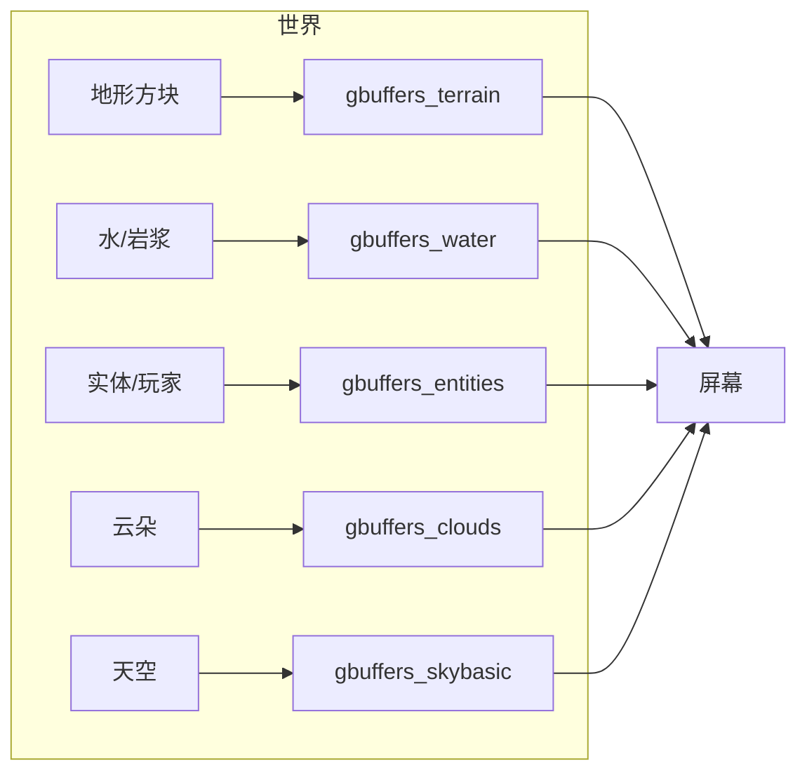
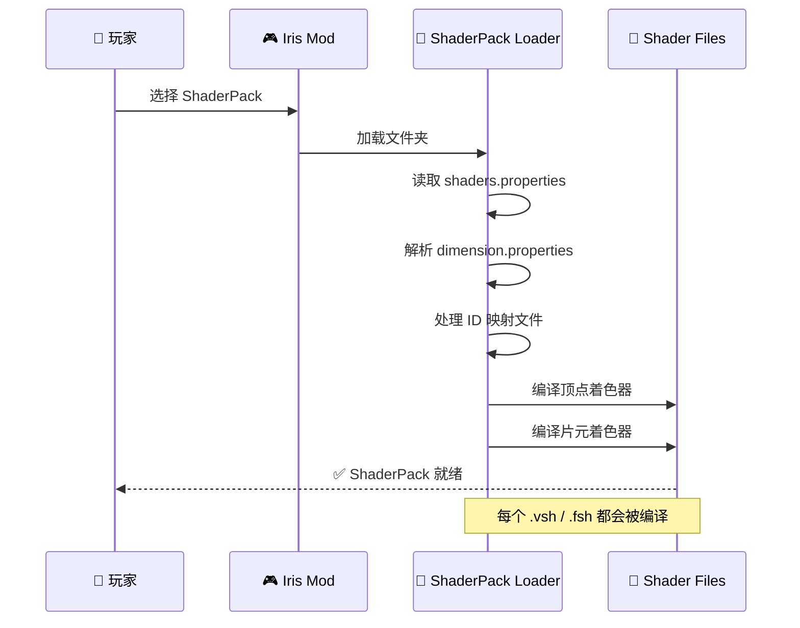
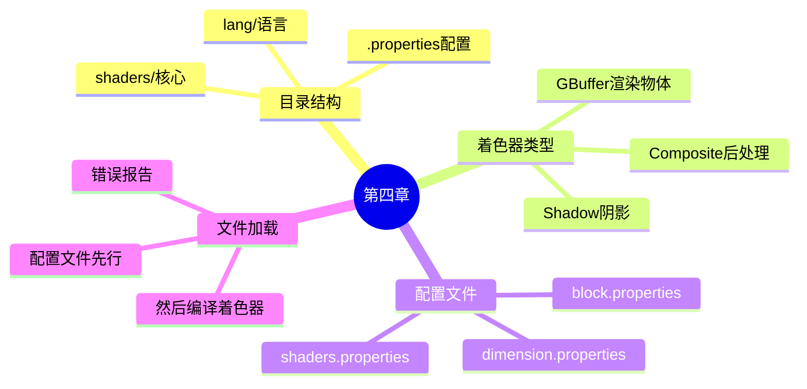

# 🏗️ 第四章：ShaderPack 结构 - 理解完整文件组织

> 📁 *Shader 大楼的蓝图！*

---

## 🎯 本章目标

```
完成本章后，你将能够：
├── 📂 理解完整的 ShaderPack 目录结构
├── 📝 知道 shaders.properties 的作用
├── 🎨 理解不同着色器的用途
└── 🔧 创建完整的配置
```

---

## 🤔 ShaderPack 是什么？

### 打个比方：乐高城市 🏙️

```
ShaderPack 就像一个乐高城市套件！

┌─────────────────────────────────────────────────────────────┐
│                                                             │
│    📁 ShaderPack = 整个套件盒子                            │
│                                                             │
│    ┌─────────┐  ┌─────────┐  ┌─────────┐                 │
│    │ shaders/ │  │  lang/  │  │ .props  │                 │
│    │          │  │         │  │         │                 │
│    │ ┌─────┐ │  │ ┌─────┐ │  │ 配置说明 │                 │
│    │ │ 地形 │ │  │ │ 中文 │ │  │         │                 │
│    │ ├─────┤ │  │ ├─────┤ │  │ 阴影    │                 │
│    │ │ 水   │ │  │ │ 英文 │ │  │ 分辨率  │                 │
│    │ ├─────┤ │  │ └─────┘ │  │         │                 │
│    │ │ 实体 │ │  │         │  │ 云朵    │                 │
│    │ └─────┘ │  └─────────┘  │ 等等... │                 │
│    └─────────┘                 └─────────┘                 │
│                                                             │
└─────────────────────────────────────────────────────────────┘
```

---

## 📁 完整目录结构

### 典型的 ShaderPack 结构

```
Sildurs-Vibrant/
│
├── 📄 shaders.properties          # ⚙️ 核心配置文件
├── 📄 dimension.properties         # 🌍 维度特殊配置
├── 📄 block.properties            # 🧱 方块属性映射
├── 📄 entity.properties           # 🐄 实体 ID 映射
├── 📄 PART.png                   # 🖼️ 预览图
├── 📄 LICENSE                   # 📜 许可证
│
├── 📁 shaders/                   # 🎨 核心着色器目录
│   │
│   ├── ┌─────────────┐
│   │ │ GBuffer 着色器 │  ← 渲染实际物体
│   │ ├─────────────┤
│   │ │ gbuffers_terrain.* │    方块
│   │ │ gbuffers_water.*     │    水
│   │ │ gbuffers_entities.* │    生物/玩家
│   │ │ gbuffers_clouds.*   │    云
│   │ │ gbuffers_skybasic.* │    天空
│   │ │ gbuffers_particles.* │  粒子
│   │ └─────────────┘
│   │
│   ├── ┌─────────────┐
│   │ │ Composite 着色器 │  ← 后处理
│   │ ├─────────────┤
│   │ │ composite1.*     │    后处理 1
│   │ │ composite2.*     │    后处理 2
│   │ │ final.*          │    最终输出
│   │ └─────────────┘
│   │
│   └── ┌─────────────┐
│       │ Shadow 着色器 │  ← 阴影渲染
│       ├─────────────┤
│       │ shadow.vsh      │
│       │ shadow.fsh      │
│       └─────────────┘
│
└── 📁 lang/                     # 🌍 多语言文件
    ├── en_us.json             # 英文
    ├── zh_cn.json             # 中文
    └── ja_jp.json             # 日文
```

---

## 🎨 着色器文件类型

### GBuffer 着色器（渲染物体）



| 文件 | 影响范围 | 常用效果 |
|------|---------|---------|
| `gbuffers_terrain.*` | 所有方块 | 颜色修改、光照 |
| `gbuffers_water.*` | 水/岩浆 | 反射、波纹 |
| `gbuffers_entities.*` | 实体、玩家 | 卡通渲染 |
| `gbuffers_clouds.*` | 云 | 云朵特效 |
| `gbuffers_skybasic.*` | 天空 | 天空颜色 |
| `gbuffers_particles.*` | 粒子 | 粒子特效 |
| `gbuffers_textured_lit.*` | 发光方块 | 萤石等 |

### Composite 着色器（后处理）

```
场景渲染 ──▶ composite1 ──▶ composite2 ──▶ ... ──▶ final ──▶ 屏幕

┌─────────────────────────────────────────────────────────────┐
│                                                             │
│  composite1: 模糊效果                                      │
│       ↓                                                    │
│  composite2: 泛光/发光                                    │
│       ↓                                                    │
│  composite3: 色调调整                                     │
│       ↓                                                    │
│  final: 晕影 + 伽马校正                                   │
│                                                             │
└─────────────────────────────────────────────────────────────┘
```

| 文件 | 用途 |
|------|------|
| `composite1-99.*` | 后处理 Pass |
| `final.*` | 最终输出 |

### Shadow 着色器（阴影渲染）

```
主视角渲染                    阴影视角渲染
┌────────────────┐         ┌────────────────┐
│                │         │                │
│    世界场景    │         │   简化场景     │
│                │         │   (只画阴影)  │
│                │         │                │
└────────────────┘         └────────────────┘
        ↓                            ↓
   存储颜色                    存储深度
        ↓                            ↓
        └────────────┬───────────────┘
                     ↓
              shadowtex 纹理
              (阴影计算用)
```

---

## ⚙️ shaders.properties 配置详解

### 这是 ShaderPack 的"设置面板"

```properties
# ═══════════════════════════════════════════════════
#                    阴影配置
# ═══════════════════════════════════════════════════

shadowMapResolution=2048      # 阴影分辨率 (256-8192)
shadowDistance=160            # 阴影距离 (16-1024方块)
shadowDistanceRenderMul=1.0   # 阴影渲染距离倍率

# ═══════════════════════════════════════════════════
#                    云朵配置
# ═══════════════════════════════════════════════════

clouds=0                      # 0=原版 1=开启 2=关闭
cloudHeight=128.0            # 云朵高度

# ═══════════════════════════════════════════════════
#                    光照配置
# ═══════════════════════════════════════════════════

oldLighting=0.0               # 旧版光照强度 (0.0-1.0)
sunPathRotation=0.0          # 太阳旋转角度 (-180 到 180)

# ═══════════════════════════════════════════════════
#                    其他配置
# ═══════════════════════════════════════════════════

weatherSpeedTweak=1.0        # 天气速度调整
```

### 配置项速查表

| 配置项 | 值范围 | 默认值 | 说明 |
|--------|--------|--------|------|
| `shadowMapResolution` | 256-8192 | 1024 | 阴影贴图大小 |
| `shadowDistance` | 16-1024 | 160 | 阴影渲染距离 |
| `clouds` | 0/1/2 | 0 | 0=原版 1=开 2=关 |
| `oldLighting` | 0.0-1.0 | 0.0 | 0=新光照 1=旧光照 |
| `sunPathRotation` | -180~180 | 0 | 太阳旋转角度 |

---

## 🌍 维度配置 (dimension.properties)

### 为不同世界设置不同参数

```properties
# ═══════════════════════════════════════════════════
#                    主世界
# ═══════════════════════════════════════════════════

dimension.Overworld.ambientLight=1.0
dimension.Overworld.clouds=true

# ═══════════════════════════════════════════════════
#                    下界
# ═══════════════════════════════════════════════════

dimension.TheNether.ambientLight=0.2
dimension.TheNether.fogDensity=0.1
dimension.TheNether.fogColor=1.0 0.2 0.1

# ═══════════════════════════════════════════════════
#                    末地
# ═══════════════════════════════════════════════════

dimension.TheEnd.ambientLight=0.1
dimension.TheEnd.skyColor=0x000008
```

---

## 🧱 ID 映射文件

### block.properties - 方块属性

```properties
# 方块ID = 属性
# 属性：smooth(平滑), rough(粗糙), special(特殊)

# 发光方块 = special + 亮度值
minecraft:glowstone=special:1.0
minecraft:sea_lantern=special:1.0
minecraft:shroomlight=special:1.0

# 透明方块
minecraft:glass=smooth
minecraft:ice=smooth
minecraft:grass_block=rough
```

### entity.properties - 实体 ID

```properties
# 用于着色器中的 entityColor

minecraft:pig=0
minecraft:cow=1
minecraft:sheep=2
minecraft:creeper=3
minecraft:skeleton=4
minecraft:zombie=5
minecraft:player=100
```

---

## 📂 最小 ShaderPack vs 完整 ShaderPack

### 最小结构（也能工作！）

```
minimal-pack/
└── shaders/
    └── gbuffers_terrain.fsh     # 只需要一个文件！
```

### 完整结构（专业光影包）

```
professional-pack/
├── shaders.properties              # 配置文件
├── dimension.properties           # 维度配置
├── block.properties               # 方块映射
├── PART.png                      # 预览图
│
├── shaders/
│   ├── gbuffers_terrain.vsh
│   ├── gbuffers_terrain.fsh
│   ├── gbuffers_water.vsh
│   ├── gbuffers_water.fsh
│   ├── gbuffers_entities.vsh
│   ├── gbuffers_entities.fsh
│   ├── gbuffers_skybasic.vsh
│   ├── gbuffers_skybasic.fsh
│   ├── gbuffers_clouds.vsh
│   ├── gbuffers_clouds.fsh
│   ├── gbuffers_particles.vsh
│   ├── gbuffers_particles.fsh
│   │
│   ├── composite1.vsh
│   ├── composite1.fsh
│   ├── composite2.vsh
│   ├── composite2.fsh
│   ├── composite3.vsh
│   ├── composite3.fsh
│   │
│   ├── final.vsh
│   ├── final.fsh
│   │
│   └── shadow.vsh
│   └── shadow.fsh
│
└── lang/
    ├── en_us.json
    └── zh_cn.json
```

---

## 🔄 文件加载流程



---

## 🎯 小挑战

### 挑战 1：创建你自己的配置

创建 `shaders.properties`，设置：
- 阴影分辨率：2048
- 阴影距离：200
- 关闭云朵

<details>
<summary>👆 答案</summary>

```properties
shadowMapResolution=2048
shadowDistance=200
clouds=2
```

</details>

### 挑战 2：识别文件用途

以下文件分别影响什么？

1. `gbuffers_water.fsh`
2. `composite1.fsh`
3. `shadow.vsh`

<details>
<summary>👆 答案</summary>

1. **gbuffers_water.fsh** → 水和岩浆的外观
2. **composite1.fsh** → 后处理效果（模糊、泛光等）
3. **shadow.vsh** → 阴影渲染的顶点着色器

</details>

---

## 📊 本章总结



---

## 🚀 下一步

👉 [✨ 第五章：Uniform 变量 - 让世界动起来！](05-uniform-animation.md)

---

*🎉 恭喜你完成第四章！你已经理解完整的 ShaderPack 结构了！*

*下一章我们将学习 Uniform 变量，让画面动起来！*
