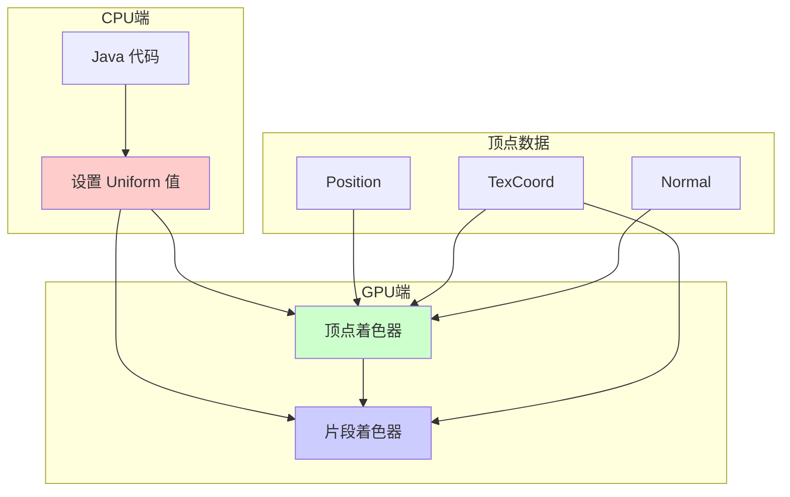
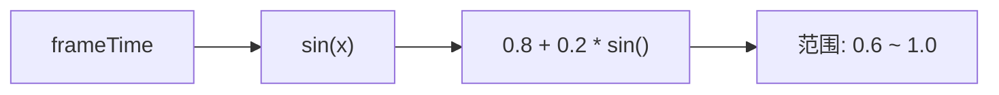
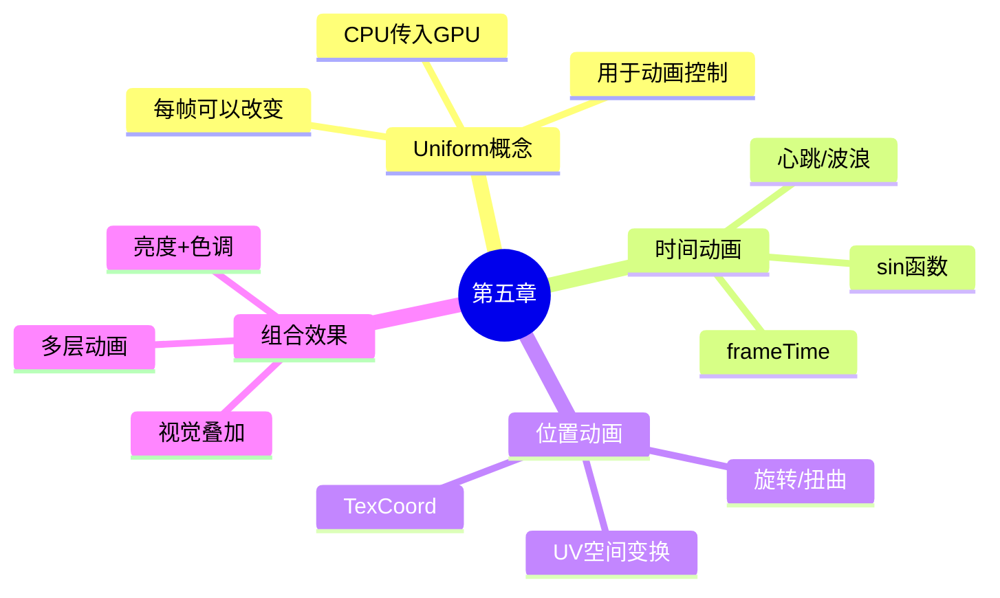

# ✨ 第五章：Uniform 变量 - 让世界动起来！

> ⚡ *赋予画面生命力！*

---

## 🎯 本章目标

```
完成本章后，你将能够：
├── ⏰ 让画面随时间变化
├── 🌊 创建流动的波纹效果
├── 💓 实现呼吸灯效果
└── 🎮 组合多个动画效果
```

---

## 🤔 什么是 Uniform？

还记得我们之前学的 `attribute` 和 `varying` 吗？



| 类型 | 变化 | 用途 |
|------|------|------|
| `attribute` | 每顶点不同 | 位置、UV |
| `varying` | 自动插值 | 顶点→片段 |
| `uniform` | 整帧相同 | 时间、光照、天气 |

---

## ⏰ 时间 Uniform - 让画面跳动！

### 核心 Uniform

```glsl
uniform float frameTime;      // ⏰ 当前时间（秒）
uniform int frameCounter;      // 🔢 帧计数器
uniform float frameRate;        // 📊 预估帧率
```

### 第一个动画：闪烁效果

```glsl
#version 330 core

in vec2 TexCoord;
uniform sampler2D DiffuseSampler;
uniform float frameTime;  // ⬅️ 重要！

out vec4 fragColor;

void main() {
    vec4 texColor = texture(DiffuseSampler, TexCoord);

    // sin(frameTime) 产生 -1 到 1 的波动
    // 0.8 + 0.2 * sin() 变成 0.6 到 1.0
    float flicker = 0.8 + 0.2 * sin(frameTime * 5.0);

    fragColor = texColor * flicker;
}
```

### 可视化效果

```
frameTime = 0       frameTime = 0.5     frameTime = 1.0     frameTime = 1.5
    │
    ▼              ▼                 ▼                 ▼
███████████    ███████████       ███████████       ███████████
███████████    ████  █████      ███████████      ████  █████
███████████    ███████████  ──▶ ███████████  ──▶ ███████████
███████████    ███████████       ███████████       ███████████

  最暗          中等             最亮             中等
  0.6           0.8              1.0              0.8
```

### 🎯 sin() 函数可视化



---

## 🌊 实验 1：彩虹呼吸效果

### 完整代码

```glsl
#version 330 core

in vec2 TexCoord;
uniform sampler2D DiffuseSampler;
uniform float frameTime;

out vec4 fragColor;

void main() {
    vec4 texColor = texture(DiffuseSampler, TexCoord);

    // 🌈 RGB 分别用不同相位的 sin
    vec3 rainbow = vec3(
        sin(frameTime * 2.0) * 0.3 + 0.7,           // R: 0.4 ~ 1.0
        sin(frameTime * 2.0 + 2.09) * 0.3 + 0.7,  // G: 0.4 ~ 1.0 (偏移120°)
        sin(frameTime * 2.0 + 4.18) * 0.3 + 0.7   // B: 0.4 ~ 1.0 (偏移240°)
    );

    fragColor = texColor * vec4(rainbow, 1.0);
}
```

### 颜色变化效果

```
t=0               t=1               t=2               t=3
  ▼                 ▼                 ▼                 ▼
███████         █████████         █████████         █████████
█红█████       ██绿█████       ███蓝█████       ██红██████
█红█████  ──▶ ██绿█████  ──▶ ███蓝█████  ──▶ ██红██████
██红████       ███绿████       ████蓝████       ███红████
█████████       ██████████       ██████████       ██████████

 红色主导        绿色主导         蓝色主导          又回到红色
```

---

## 💓 实验 2：心跳效果

### 原理：多个 sin 叠加

```glsl
#version 330 core

in vec2 TexCoord;
uniform sampler2D DiffuseSampler;
uniform float frameTime;

out vec4 fragColor;

void main() {
    vec4 texColor = texture(DiffuseSampler, TexCoord);

    // 💓 心跳函数：快速上升，缓慢下降
    float beat = abs(sin(frameTime * 3.0));
    beat = pow(beat, 0.5);  // 让下降更平滑

    // 亮度在 0.8 ~ 1.2 之间变化
    float brightness = 0.8 + beat * 0.4;

    fragColor = texColor * brightness;
}
```

### 可视化

```
正常                  心跳效果
━━━━━━━━━━━━━━━━━━━━━━━━━━━━━━━━━━━━━━━━━━━
|                    │
|    ████████████    |    ███
|    ████████████    |   ██ ██
|    ████████████    |  ██   ██
|    ████████████    | ██     ██
|                    |██       ██
└────────────────────┘           └── 缓慢下降
                    ↑
              快速上升
```

---

## 🌊 实验 3：波浪效果

### 使用 UV 坐标 + 时间

```glsl
#version 330 core

in vec2 TexCoord;
uniform sampler2D DiffuseSampler;
uniform float frameTime;

out vec4 fragColor;

void main() {
    vec4 texColor = texture(DiffuseSampler, TexCoord);

    // 🌊 波浪 = sin(位置 + 时间)
    float wave = sin(TexCoord.x * 10.0 + frameTime * 2.0) * 0.1;

    // 用波浪来调整亮度
    vec3 color = texColor.rgb + wave;

    fragColor = vec4(color, texColor.a);
}
```

### 效果可视化

```
静态                    波浪效果
━━━━━━━━━━━━━━━━━━━━━━━━━━━━━━━━━━━━━━━━━━━━━━━━━
│██████████████│        │▓▒░▓▒░▓▒░▓▒░│
│██████████████│        │░▓▒░▓▒░▓▒░▓▒░│
│██████████████│  ───▶  │▒░▒░▒░▒░▒░▒░▒░│
│██████████████│        │░▓▒░▓▒░▓▒░▓▒░│
│██████████████│        │▓▒░▓▒░▓▒░▓▒░▓│
                              ↑
                        颜色随波浪变化
```

---

## 🎨 实验 4：位置相关动画

### 颜色渐变 + 时间

```glsl
#version 330 core

in vec2 TexCoord;
uniform sampler2D DiffuseSampler;
uniform float frameTime;

out vec4 fragColor;

void main() {
    vec4 texColor = texture(DiffuseSampler, TexCoord);

    // 根据 X 坐标产生颜色变化
    float x = TexCoord.x;
    vec3 colorShift = vec3(
        sin(x * 3.14 + frameTime) * 0.3,
        sin(x * 3.14 + frameTime + 2.0) * 0.3,
        sin(x * 3.14 + frameTime + 4.0) * 0.3
    );

    fragColor = texColor + vec4(colorShift, 0.0);
}
```

### 效果

```
从左到右的颜色流动
━━━━━━━━━━━━━━━━━━━━━━━━━━━━━━━━━━━━━━━━━━━

t=0        ████████████████░░░░░░░░░░░░░░░
t=1        ░░░░░░███████████████░░░░░░░░░░░
t=2        ░░░░░░░░░░░███████████████░░░░░
t=3        ░░░░░░░░░░░░░░░░░███████████████

           ←─────────────────────────────────→
                        颜色向左流动
```

---

## 🌀 实验 5：旋转效果

### 中心旋转

```glsl
#version 330 core

in vec2 TexCoord;
uniform sampler2D DiffuseSampler;
uniform float frameTime;

out vec4 fragColor;

void main() {
    // 计算到中心距离
    vec2 center = vec2(0.5);
    vec2 toCenter = TexCoord - center;
    float dist = length(toCenter);

    // 根据距离旋转（中心不转，边缘转得多）
    float angle = dist * 3.14 + frameTime;
    float c = cos(angle);
    float s = sin(angle);
    mat2 rotation = mat2(c, -s, s, c);

    // 旋转 UV
    vec2 rotated = center + rotation * toCenter;

    fragColor = texture(DiffuseSampler, rotated);
}
```

### 效果可视化

```
旋转前                旋转后
━━━━━━━━━━━━━━━━━━━━━━━━━━━━━━━━━━━━━━━━━━━
│████████████│        │  ████████│
│████████████│        │ ████████ │
│████████████│  ───▶  │█████████ │
│████████████│        │█████████ │
│████████████│        │██████████│
      ↑                    ↑
   静态                 螺旋旋转
```

---

## 🎮 综合实验：动感滤镜

### 代码

```glsl
#version 330 core

in vec2 TexCoord;
uniform sampler2D DiffuseSampler;
uniform float frameTime;

out vec4 fragColor;

void main() {
    vec4 texColor = texture(DiffuseSampler, TexCoord);
    vec3 color = texColor.rgb;

    // 1️⃣ 亮度脉动
    float pulse = 0.8 + 0.2 * sin(frameTime * 2.0);

    // 2️⃣ 暖色调随时间变化
    float warmth = sin(frameTime) * 0.2;
    color.r *= 1.0 + warmth;
    color.b *= 1.0 - warmth;

    // 3️⃣ 根据位置的波浪
    float wave = sin(TexCoord.x * 20.0 + frameTime * 3.0) * 0.05;
    color += wave;

    fragColor = vec4(color * pulse, texColor.a);
}
```

### 组合效果示意


---

## 📋 常用 Uniform 速查表

| Uniform | 类型 | 说明 | 常用值 |
|---------|------|------|--------|
| `frameTime` | float | 帧时间（秒） | 用于动画 |
| `frameCounter` | int | 帧数 | 循环计数 |
| `frameRate` | float | 预估 FPS | 性能检测 |
| `viewSize` | vec2 | 视图大小 | 坐标转换 |

---

## 🎯 小测验

### 挑战 1：创建"闪烁霓虹灯"
让颜色快速闪烁，像霓虹灯一样

<details>
<summary>👆 提示</summary>

```glsl
// 使用快速变化的 sin
float flash = step(0.5, sin(frameTime * 10.0));
color = mix(color * 0.5, color * 1.5, flash);
```

</details>

### 挑战 2：创建"颜色追逐"
R、G、B 三个通道依次达到最亮

<details>
<summary>👆 提示</summary>

```glsl
// 不同相位偏移
color.r = 0.5 + 0.5 * sin(frameTime);
color.g = 0.5 + 0.5 * sin(frameTime + 2.09);
color.b = 0.5 + 0.5 * sin(frameTime + 4.18);
```

</details>

---

## 🐛 常见问题

### 问题 1：动画不工作

```diff
// ❌ 忘记声明 uniform
- fragColor = texColor * sin(frameTime);

// ✅ 正确声明
+ uniform float frameTime;
+ fragColor = texColor * sin(frameTime);
```

### 问题 2：动画太快/太慢

```diff
// ❌ 太快
- float wave = sin(frameTime * 100.0);

// ✅ 调慢（除以系数）
+ float wave = sin(frameTime * 2.0);
```

---

## 📊 本章总结



### 记住这三个动画公式：

| 效果 | 代码 |
|------|------|
| 脉动 | `sin(frameTime)` |
| 波浪 | `sin(TexCoord.x * n + frameTime)` |
| 旋转 | `mat2(cos(angle), -sin(angle), ...) * uv` |

---

## 🚀 下一步

👉 [🔮 第六章：后处理魔法 - 创建全屏特效！](06-postprocessing-basics.md)

---

*🎉 恭喜你完成第五章！你已经能让世界动起来了！*

*下一章我们将学习后处理，创建更酷的全屏特效！*
