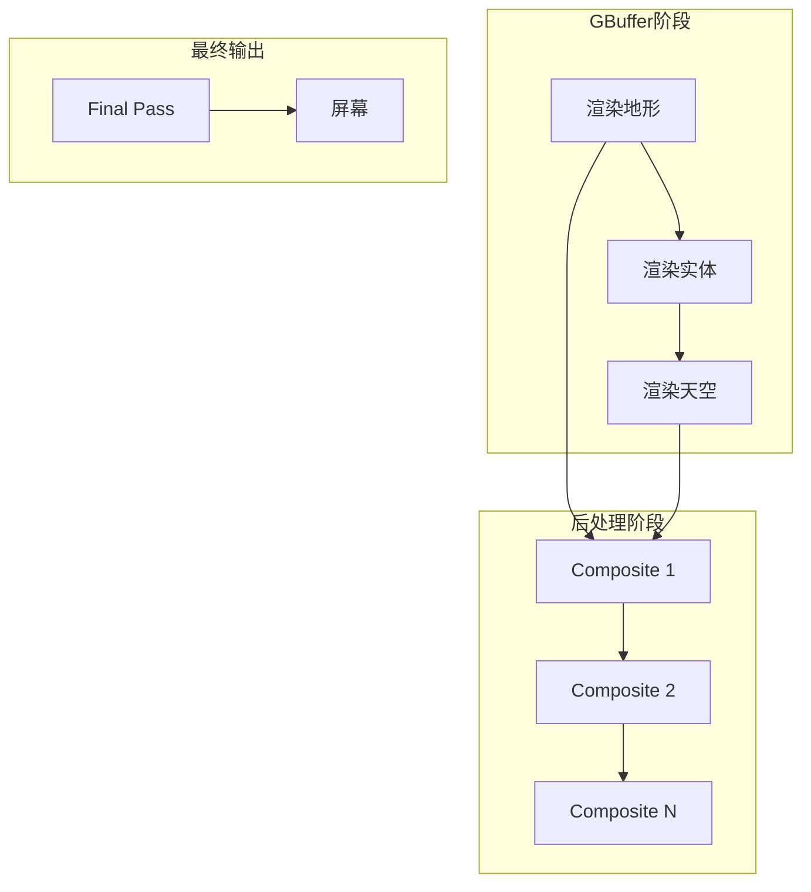
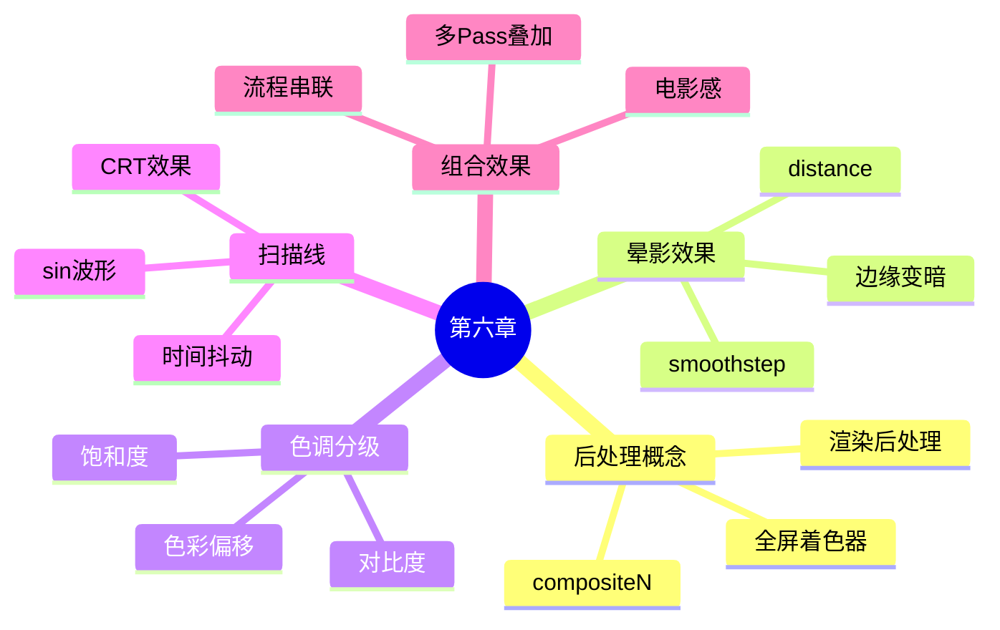

# 🔮 第六章：后处理魔法 - 全屏特效！

> ✨ *给整个世界加特效！*

---

## 🎯 本章目标

```
完成本章后，你将能够：
├── 🎨 理解什么是后处理
├── 🌫️ 创建晕影效果
├── 🌈 实现颜色分级
├── 📺 添加扫描线效果
└── 🔮 组合多种后处理效果
```

---

## 🤔 什么是后处理？

### 渲染管线回顾



### 打个比方

```
原版 Minecraft = 拍一张 RAW 照片
后处理 = Lightroom/Lightroom 调色

RAW照片 ──▶ 调整曝光 ──▶ 调整色温 ──▶ 添加滤镜 ──▶ 最终照片
   │           │            │            │            │
   │           ▼            ▼            ▼            ▼
游戏渲染    composite1   composite2   composite3    final
```

---

## 📁 Composite 着色器文件

### 文件命名规则

```
shaders/
├── gbuffers_terrain.fsh     ← 地形着色器
├── gbuffers_entities.fsh    ← 实体着色器
│
├── composite1.vsh            ← 后处理 1 顶点
├── composite1.fsh            ← 后处理 1 片段 ⭐
├── composite2.vsh            ← 后处理 2 顶点
├── composite2.fsh            ← 后处理 2 片段 ⭐
│
├── final.vsh                ← 最终 顶点
└── final.fsh                ← 最终 片段
```

### 一个完整的 ShaderPack 结构

```
my-shaderpack/
└── shaders/
    ├── gbuffers_terrain.fsh       ← 地形（必须）
    ├── composite1.vsh              ← 后处理顶点
    ├── composite1.fsh              ← 后处理片段
    ├── composite2.vsh              ← 第二个后处理
    ├── composite2.fsh
    └── final.vsh                  ← 最终着色器
```

---

## 🎨 可用的纹理

### GBuffer 纹理

```glsl
uniform sampler2D colortex0;   // 🖼️ 主颜色（原始场景）
uniform sampler2D colortex1;   // 📐 法线/NRM
uniform sampler2D colortex2;   // ✨ 高光/Specular
uniform sampler2D colortex3;   // 🔧 自定义缓冲区

uniform sampler2D depthtex0;   // 📏 主深度
uniform sampler2D depthtex1;   // 📏 不含半透明深度

uniform vec2 viewSize;         // 📐 视图大小（屏幕分辨率）
```

---

## 🌫️ 实验 1：晕影效果（Vignette）

### 什么是晕影？

```
效果示意：
┌───────────────────────────────┐
│ ▓▓▓▓▓▓▓▓▓▓▓▓▓▓▓▓▓▓▓▓▓▓▓▓│
│ ▓▓▓▓▓▓▓▓▓▓▓▓▓▓▓▓▓▓▓▓▓▓▓▓│
│ ▓▓▓▓▓▓▓███▓▓▓▓▓▓▓▓▓▓▓▓▓▓▓│
│ ▓▓▓▓▓▓▓███      ███▓▓▓▓▓▓▓▓│
│ ▓▓▓▓▓▓▓███ 中心  ███▓▓▓▓▓▓▓▓│
│ ▓▓▓▓▓▓▓███ 明亮  ███▓▓▓▓▓▓▓▓│
│ ▓▓▓▓▓▓▓▓▓████████▓▓▓▓▓▓▓▓▓▓│
│ ▓▓▓▓▓▓▓▓▓▓▓▓▓▓▓▓▓▓▓▓▓▓▓▓▓▓▓│
│ ▓▓▓▓▓▓▓▓▓▓▓▓▓▓▓▓▓▓▓▓▓▓▓▓▓▓▓│
        边缘变暗，形成聚焦效果
```

### 代码实现

```glsl
#version 330 core

uniform sampler2D colortex0;  // 场景颜色
uniform vec2 viewSize;        // 屏幕大小

in vec2 texCoord;             // 0-1 的坐标
out vec4 fragColor;

void main() {
    // 采样场景
    vec4 color = texture(colortex0, texCoord);

    // 计算到中心的距离
    vec2 center = vec2(0.5);
    float dist = distance(texCoord, center);

    // 创建晕影
    float vignette = smoothstep(0.8, 0.4, dist);

    // 应用晕影
    color.rgb *= vignette;

    fragColor = color;
}
```

---

## 🌈 实验 2：颜色分级（Color Grading）

### 赛博朋克风格

```glsl
#version 330 core

uniform sampler2D colortex0;
uniform float frameTime;

in vec2 texCoord;
out vec4 fragColor;

void main() {
    vec4 color = texture(colortex0, texCoord);

    // 🎮 赛博朋克调色
    vec3 cyberpunk = color.rgb;

    // 提高对比度
    cyberpunk = (cyberpunk - 0.5) * 1.5 + 0.5;

    // 增加饱和度
    float gray = dot(cyberpunk, vec3(0.299, 0.587, 0.114));
    cyberpunk = mix(vec3(gray), cyberpunk, 1.5);

    // 色调偏移（青色/品红）
    cyberpunk.b = cyberpunk.b * 1.3;
    cyberpunk.g = cyberpunk.g * 1.1;

    fragColor = vec4(cyberpunk, color.a);
}
```

### 色调偏移可视化

```
原版调色                    赛博朋克
━━━━━━━━━━━━━━━━━━━━━━━━━━━━━━━━━━━━━━━━━━━

│██████████████│        │▓▒░▓▒░▓▒░▓▒│
│██████████████│        │▒░▓▒░▓▒░▓▒░│
│██████████████│  ───▶ │▓▒░▓▒░ 霓虹│
│██████████████│        │▒░▓▒░ 粉紫│
│██████████████│        │▓▒░▓▒░▓▒░▓▒│

  自然色彩              高对比+霓虹色调
```

---

## 📺 实验 3：扫描线效果

### 老电视风格

```glsl
#version 330 core

uniform sampler2D colortex0;
uniform vec2 viewSize;
uniform float frameTime;

in vec2 texCoord;
out vec4 fragColor;

void main() {
    vec4 color = texture(colortex0, texCoord);

    // 📺 扫描线
    float scanline = sin(texCoord.y * viewSize.y * 2.0) * 0.5 + 0.5;

    // 让扫描线更明显
    scanline = mix(1.0, scanline, 0.3);

    // 应用扫描线
    color.rgb *= scanline;

    // 🔲 边缘轻微变暗（CRT 效果）
    float edge = 0.95 + 0.05 * sin(texCoord.x * 3.14159);
    color.rgb *= edge;

    fragColor = color;
}
```

### 效果可视化

```
原始画面                扫描线效果
━━━━━━━━━━━━━━━━━━━━━━━━━━━━━━━━━━━━━━━━━━━

███████████████    ░░██████████████░░
███████████████    ░░▒▒██████████▒▒░░
███████████████    ▒▒░░██████████░░▒▒
███████████████    ▒▒░░▒▒████████▒▒░░
███████████████    ▒▒░░▒▒████████▒▒░░
███████████████    ▒▒░░▒▒████████▒▒░░
███████████████    ░░▒▒██████████▒▒░░
                    ↑
              明暗交替的横线
```

---

## 🌀 实验 4：波纹效果

### 水波纹

```glsl
#version 330 core

uniform sampler2D colortex0;
uniform vec2 viewSize;
uniform float frameTime;

in vec2 texCoord;
out vec4 fragColor;

void main() {
    vec2 uv = texCoord;

    // 从中心向外扩散的波纹
    vec2 center = vec2(0.5);
    float dist = distance(uv, center);

    // 波纹强度
    float wave = sin(dist * 50.0 - frameTime * 3.0) * 0.01;

    // 计算波纹偏移
    vec2 offset = normalize(uv - center) * wave;

    // 采样（带偏移）
    vec4 color = texture(colortex0, uv + offset);

    fragColor = color;
}
```

### 波纹传播示意

```
t=0          t=1          t=2          t=3
  │            │            │            │
  ▼            ▼            ▼            ▼
○○●○○○      ○○○●○○      ○○○○●○      ○○○○○●○
波峰        波峰外扩      波峰再外扩      波峰更远
```

---

## 🔮 实验 5：色差效果（Chromatic Aberration）

### 摄影镜头色差

```glsl
#version 330 core

uniform sampler2D colortex0;
uniform vec2 viewSize;
uniform float frameTime;

in vec2 texCoord;
out vec4 fragColor;

void main() {
    // 从中心向外偏移
    vec2 center = vec2(0.5);
    vec2 offset = texCoord - center;
    float dist = length(offset);

    // 色差强度（边缘更强）
    float aberration = dist * 0.01;

    // R 通道向外偏移，G 通道不变，B 通道向内偏移
    float r = texture(colortex0, texCoord + offset * aberration).r;
    float g = texture(colortex0, texCoord).g;
    float b = texture(colortex0, texCoord - offset * aberration).b;

    fragColor = vec4(r, g, b, 1.0);
}
```

### 效果

```
原图                    色差效果
━━━━━━━━━━━━━━━━━━━━━━━━━━━━━━━━━━━━━━━━━━━

████████████████        ███▓▓░░████████
████████████████  ──▶  ██▓▓░░████████
████████████████        ██▓▓░░████████
████████████████        ███▓▓░░████████

                       ↑   ↑   ↑
                       R   G   B
                    分开的颜色通道
```

---

## 🎨 综合实验：电影感调色

### 代码

```glsl
#version 330 core

uniform sampler2D colortex0;
uniform sampler2D depthtex0;
uniform vec2 viewSize;
uniform float frameTime;

in vec2 texCoord;
out vec4 fragColor;

void main() {
    vec4 color = texture(colortex0, texCoord);

    // 1️⃣ 晕影
    float vignette = smoothstep(0.85, 0.4, distance(texCoord, vec2(0.5)));
    color.rgb *= vignette;

    // 2️⃣ 色调分级
    vec3 graded = color.rgb;

    // 提高对比度
    graded = (graded - 0.45) * 1.3 + 0.45;

    // 冷色调偏移
    graded.b = graded.b * 1.15;
    graded.r = graded.r * 0.95;

    // 3️⃣ 轻微胶片颗粒
    float grain = fract(sin(dot(texCoord * viewSize, vec2(12.9898, 78.233))) * 43758.5453);
    graded += (grain - 0.5) * 0.03;

    // 4️⃣ 胶片拉伸（轻微桶形畸变）
    vec2 centered = texCoord - 0.5;
    float dist = length(centered);
    vec2 warped = centered * (1.0 + dist * dist * 0.02);
    vec2 finalUV = warped + 0.5;

    // 重新采样（如果超出边界则用原色）
    if (finalUV.x < 0.0 || finalUV.x > 1.0 || finalUV.y < 0.0 || finalUV.y > 1.0) {
        fragColor = color;
    } else {
        fragColor = vec4(graded, 1.0);
    }
}
```

### 组合效果流程


---

## 📋 Composite 常用 Uniform

| Uniform | 类型 | 说明 |
|---------|------|------|
| `colortex0-15` | sampler2D | 颜色缓冲区 |
| `depthtex0-2` | sampler2D | 深度缓冲区 |
| `viewSize` | vec2 | 视图大小 |
| `frameTime` | float | 帧时间 |

---

## 🎯 小测验

### 挑战：创建"复古 VHS"效果

结合以下效果：
1. 扫描线
2. 颜色偏移
3. 噪点
4. 轻微抖动

<details>
<summary>👆 提示</summary>

```glsl
// 扫描线 + 色差 + 噪点
float scan = sin(texCoord.y * 300.0) * 0.1;
vec2 jitter = vec2(sin(frameTime * 10.0), cos(frameTime * 10.0)) * 0.002;
float noise = fract(sin(dot(texCoord + jitter, ...)) * 43758.5453);
color.rgb += noise * 0.1;
color.rgb *= (1.0 - scan);
```

</details>

---

## 📊 本章总结



---

## 🚀 下一步

👉 [🏆 第七章：创造你的第一个完整光影包！](07-create-shaderpack.md)

---

*🎉 恭喜你完成第六章！你已经掌握了后处理魔法！*

*下一章我们将综合所有知识，创造你的第一个完整光影包！*
