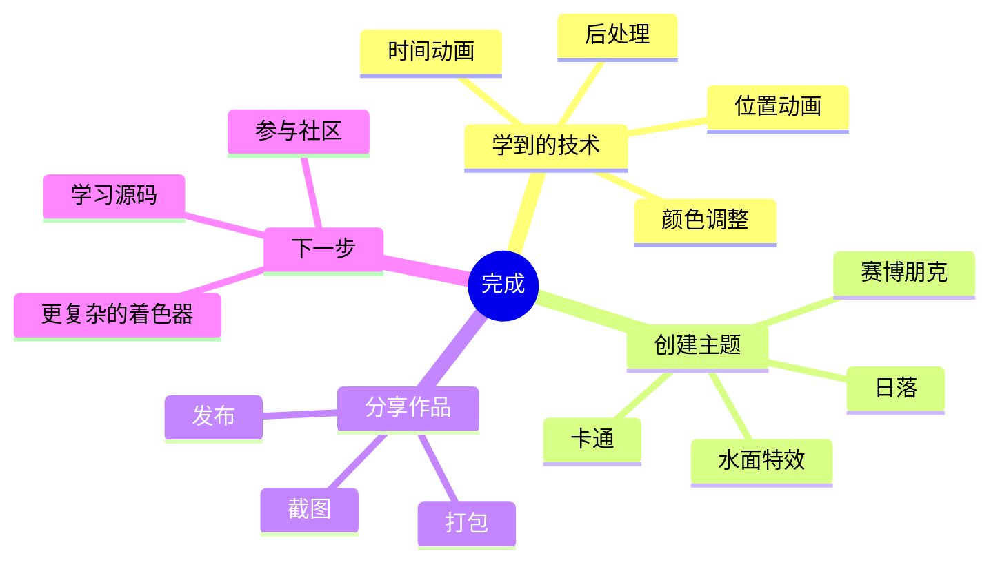
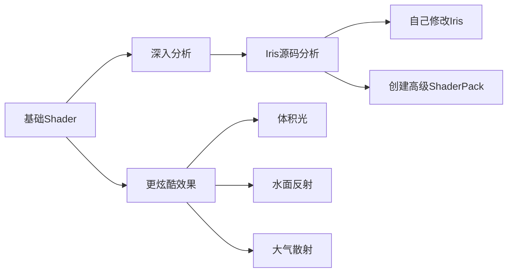

# 🏆 最终章：创造你的第一个光影包！

> 🎨 *综合所有知识，创造独一无二的效果！*

---

## 🎯 本章目标

```
完成本章后，你将能够：
├── 🎨 综合运用所有学过的技术
├── 🌈 创建一个有主题的光影包
├── 📦 完成一个可分享的 ShaderPack
└── 🎮 向朋友展示你的作品！
```

---

## 🎮 你的光影包主题

### 选择一个主题

```
┌─────────────────────────────────────────────────────────────┐
│                                                             │
│   🌅 主题选择                                               │
│                                                             │
│   ┌─────────┐  ┌─────────┐  ┌─────────┐  ┌─────────┐   │
│   │         │  │         │  │         │  │         │   │
│   │ 🌅 日落 │  │ 🌙 夜景 │  │ 🎮 赛博 │  │ 🎭 卡通 │   │
│   │  暖色调 │  │  冷色调 │  │  朋克风 │  │  渲染风 │   │
│   │         │  │         │  │         │  │         │   │
│   └─────────┘  └─────────┘  └─────────┘  └─────────┘   │
│                                                             │
└─────────────────────────────────────────────────────────────┘
```

| 主题 | 特点 | 适合玩家 |
|------|------|---------|
| 🌅 日落 | 暖色调、橙黄色、高对比度 | 喜欢浪漫氛围 |
| 🌙 夜景 | 冷色调、蓝色、高饱和星空 | 喜欢神秘感 |
| 🎮 赛博朋克 | 霓虹色、高对比、发光效果 | 喜欢科技感 |
| 🎭 卡通渲染 | 色阶分离、描边、扁平化 | 喜欢可爱风格 |
| 🌿 自然清新 | 低饱和度、高亮度、绿意盎然 | 喜欢清新感 |
| 📺 复古风格 | 扫描线、噪点、褪色 | 喜欢怀旧感 |

---

## 📦 完整项目结构

### 创建你的光影包

```
my-shaderpack/
│
├── 📄 shaders.properties       # 配置文件
├── 📄 PART.png               # 预览图（可选）
│
└── 📁 shaders/
    ├── 📄 gbuffers_terrain.fsh    # 地形
    ├── 📄 gbuffers_water.fsh       # 水
    ├── 📄 gbuffers_entities.fsh    # 实体
    ├── 📄 gbuffers_skybasic.fsh    # 天空
    ├── 📄 gbuffers_clouds.fsh      # 云
    │
    ├── 📄 composite1.vsh           # 后处理 1
    ├── 📄 composite1.fsh
    ├── 📄 composite2.vsh           # 后处理 2
    ├── 📄 composite2.fsh
    │
    └── 📄 final.vsh                # 最终着色器
    └── 📄 final.fsh
```

---

## 🎨 示例 1：日落主题

### shaders.properties

```properties
# ═══════════════════════════════════════════════════
#                    我的日落光影包
# ═══════════════════════════════════════════════════

shadowMapResolution=2048
shadowDistance=160
clouds=0
oldLighting=0.0
```

### gbuffers_terrain.fsh - 地形着色器

```glsl
#version 330 core

in vec2 TexCoord;
in vec3 Color;
uniform sampler2D DiffuseSampler;
uniform float frameTime;  // 时间动画

out vec4 fragColor;

void main() {
    vec4 texColor = texture(DiffuseSampler, TexCoord);
    vec3 color = texColor.rgb * Color.rgb;

    // 1️⃣ 增加暖色调
    color.r *= 1.2;  // 红色加强
    color.g *= 1.1;  // 绿色适中
    color.b *= 0.8;  // 蓝色减弱

    // 2️⃣ 提高对比度
    color = (color - 0.45) * 1.2 + 0.45;

    // 3️⃣ 轻微脉动效果
    float pulse = 0.95 + 0.05 * sin(frameTime * 0.5);
    color *= pulse;

    fragColor = vec4(color, texColor.a);
}
```

### final.fsh - 最终后处理

```glsl
#version 330 core

uniform sampler2D colortex0;
uniform vec2 viewSize;

in vec2 texCoord;
out vec4 fragColor;

void main() {
    vec4 color = texture(colortex0, texCoord);

    // 🌅 晕影效果
    float dist = distance(texCoord, vec2(0.5));
    float vignette = smoothstep(0.9, 0.4, dist);
    color.rgb *= vignette;

    // 🌅 轻微色调
    color.r *= 1.05;
    color.b *= 0.95;

    fragColor = color;
}
```

### 效果预览

```
原版                          日落主题
━━━━━━━━━━━━━━━━━━━━━━━━━━━━━━━━━━━━━━━━━━━

████████████████████████      ████████████████████████
████████  ████████████      ████  ██████████████
████████  ████████████  ──▶  ████  ██████████████
████████  ████████████      ████  ██████████████
████████████████████████      ████████████████████████

  自然色彩                  橙黄暖调 + 晕影
```

---

## 🎮 示例 2：赛博朋克主题

### shaders.properties

```properties
shadowMapResolution=2048
shadowDistance=128
clouds=2  # 关闭云朵，突出主体
```

### gbuffers_terrain.fsh - 地形着色器

```glsl
#version 330 core

in vec2 TexCoord;
in vec3 Color;
uniform sampler2D DiffuseSampler;
uniform float frameTime;

out vec4 fragColor;

void main() {
    vec4 texColor = texture(DiffuseSampler, TexCoord);
    vec3 color = texColor.rgb * Color.rgb;

    // 1️⃣ 高对比度
    color = (color - 0.5) * 1.8 + 0.5;

    // 2️⃣ 饱和度提升
    float gray = dot(color, vec3(0.299, 0.587, 0.114));
    color = mix(vec3(gray), color, 1.5);

    // 3️⃣ 霓虹色调偏移
    float noise = fract(sin(dot(TexCoord + frameTime * 0.1, vec2(12.9898, 78.233))) * 43758.5453);
    color.r = color.r * 1.3 + noise * 0.05;
    color.b = color.b * 1.4;

    // 4️⃣ 边缘发光效果（基于亮度）
    float luma = dot(color, vec3(0.299, 0.587, 0.114));
    if (luma > 0.7) {
        color += vec3(0.1, 0.05, 0.15);  // 霓虹紫光
    }

    fragColor = vec4(color, texColor.a);
}
```

### composite1.fsh - 扫描线效果

```glsl
#version 330 core

uniform sampler2D colortex0;
uniform vec2 viewSize;
uniform float frameTime;

in vec2 texCoord;
out vec4 fragColor;

void main() {
    vec4 color = texture(colortex0, texCoord);

    // 📺 CRT 扫描线
    float scanline = sin(texCoord.y * viewSize.y * 1.5) * 0.5 + 0.5;
    scanline = pow(scanline, 1.5);
    color.rgb *= mix(0.7, 1.0, scanline);

    // 📺 轻微 RGB 分离
    float offset = 0.002;
    color.r = texture(colortex0, texCoord + vec2(offset, 0.0)).r;
    color.b = texture(colortex0, texCoord - vec2(offset, 0.0)).b;

    // 📺 噪点
    float noise = fract(sin(dot(texCoord * viewSize + frameTime, vec2(12.9898, 78.233))) * 43758.5453);
    color.rgb += (noise - 0.5) * 0.05;

    fragColor = color;
}
```

### 效果预览

```
原版                          赛博朋克
━━━━━━━━━━━━━━━━━━━━━━━━━━━━━━━━━━━━━━━━━━━

████████████████████████      ▓▒░▓▒░▓▒░▓▒░
████████  ████████████      ▒░▓▒░▓▒░▓▒░▓▒
████████  ████████████  ──▶  ░▓▒░▓▒░▓▒ 霓虹
████████  ████████████      ▒░▓▒░▓▒░▓▒░▓▒
████████████████████████      ░▓▒░▓▒░▓▒░▓▒░

  自然色彩                  霓虹 + 扫描线 + 噪点
```

---

## 🌊 示例 3：水面波纹主题

### gbuffers_water.fsh - 水面着色器

```glsl
#version 330 core

in vec2 TexCoord;
in vec3 Color;
uniform sampler2D DiffuseSampler;
uniform float frameTime;

out vec4 fragColor;

void main() {
    vec4 texColor = texture(DiffuseSampler, TexCoord);
    vec3 color = texColor.rgb * Color.rgb;

    // 🌊 水波动画
    float wave = sin(TexCoord.x * 20.0 + frameTime * 2.0) * 0.5 +
                  cos(TexCoord.y * 15.0 + frameTime * 1.5) * 0.5;
    wave = wave * 0.1 + 0.95;

    // 🌊 颜色调整
    color.r *= 0.8;  // 减少红色
    color.g *= 1.2;  // 增加绿色
    color.b *= 1.3;  // 增加蓝色

    // 🌊 应用波纹
    color *= wave;

    fragColor = vec4(color, texColor.a);
}
```

---

## 🎭 综合示例：卡通渲染主题

### gbuffers_terrain.fsh

```glsl
#version 330 core

in vec2 TexCoord;
in vec3 Color;
in vec3 Normal;
uniform sampler2D DiffuseSampler;

out vec4 fragColor;

void main() {
    vec4 texColor = texture(DiffuseSampler, TexCoord);
    vec3 color = texColor.rgb * Color.rgb;

    // 🎭 降低色阶（只有几个固定颜色）
    color = floor(color * 4.0) / 4.0;

    // 🎭 简化阴影（只有亮和暗）
    float light = dot(Normal, vec3(0.5, 1.0, 0.3));
    if (light > 0.5) {
        color *= 1.1;
    } else {
        color *= 0.7;
    }

    fragColor = vec4(color, texColor.a);
}
```

### 效果对比

```
原版                          卡通渲染
━━━━━━━━━━━━━━━━━━━━━━━━━━━━━━━━━━━━━━━━━━━

████████████████████████      ████████████████
████████████▒▒▒████████      ████░░░░████████
████████████▒▒▒████████  ──▶ ████░░░░████████
████████████▒▒▒████████      ████████████████
████████████████████████      ████████████████

  渐变色阶                  只有 4 个色阶
```

---

## 📦 打包你的光影包

### 1. 整理文件

```
my-shaderpack/
├── shaders.properties
├── PART.png          # 建议 256x256
└── shaders/
    └── *.fsh
```

### 2. 创建 ZIP（可选）

如果想分享给别人：

```
Windows:
右键文件夹 → 发送到 → 压缩(zipped)文件夹

my-shaderpack.zip  ← 这样可以分享
```

### 3. 安装测试

```
📂 安装位置

Windows:
C:\Users\你的用户名\AppData\Roaming\.minecraft\shaderpacks\

macOS:
~/Library/Application Support/minecraft/shaderpacks/

Linux:
~/.minecraft/shaderpacks/
```

---

## 🎮 测试清单

```
✅ 功能检查

☐ 游戏能正常启动
☐ ShaderPack 在列表中可见
☐ 世界能正常加载
☐ 地形颜色改变
☐ 水面效果正常（如果有）
☐ 后处理效果正常（如果有）
☐ 没有报错信息
☐ 性能可以接受
```

---

## 🐛 常见问题

### 问题 1：水面没变化

```
原因：gbuffers_water.fsh 可能没被加载

检查：
☐ 文件名拼写正确？
☐ 放在 shaders/ 目录下？
☐ 水面着色器需要特殊设置吗？
```

### 问题 2：效果太夸张

```diff
# 降低效果强度

- color.r *= 2.0;  // ❌ 太夸张
+ color.r *= 1.1;  // ✅ 温和调整
```

### 问题 3：性能问题

```
优化建议：

1. 减少动画频率
2. 简化计算
3. 减少后处理 Pass
4. 使用低分辨率测试
```

---

## 🎉 分享你的作品

### 截图技巧

1. 使用 `F2` 截图
2. 使用 `F2 + Ctrl` 隐藏 UI
3. 选择有代表性的场景

### 分享平台

| 平台 | 说明 |
|------|------|
| CurseForge | Minecraft 最大 mod 平台 |
| Planet Minecraft | 专门的 ShaderPack 分享 |
| GitHub | 开源分享 |
| 社交媒体 | Twitter, Reddit 等 |

---

## 📊 完成总结



---

## 🚀 下一步：继续学习

恭喜你完成了本系列教程！

### 进阶学习路径



### 推荐资源

| 资源 | 说明 |
|------|------|
| [Iris 源码分析](/iris/analysis/) | 深入理解内部机制 |
| [GLSL 参考文档](https://registry.khronos.org/OpenGL/specs/gl/GLSLangSpec.4.60.pdf) | 官方 GLSL 文档 |
| [ShaderToy](https://www.shadertoy.com/) | 灵感来源 |
| [The Book of Shaders](https://thebookofshaders.com/) | 进阶学习 |

---

## 🎊 恭喜完成！

```
┌─────────────────────────────────────────────────────────────┐
│                                                             │
│                    🎉 恭喜你！🎉                           │
│                                                             │
│              你已经学会了 Shader 开发的基础！                 │
│                                                             │
│                    从今天开始，你就是                        │
│                                                             │
│                    ┌─────────────────┐                      │
│                    │                 │                      │
│                    │   Shader 法师   │                      │
│                    │                 │                      │
│                    └─────────────────┘                      │
│                                                             │
│                    继续探索，继续创造！                      │
│                                                             │
└─────────────────────────────────────────────────────────────┘
```

---

*🎉 恭喜完成整个教程系列！*

*现在你有了创造炫酷视觉效果的能力！去创造你的专属光影包吧！*
