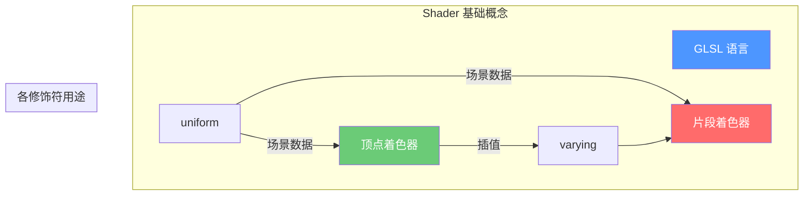

# 第一章：Shader 基础入门

> 学习 GLSL 语法与 Shader 基本概念

---

## 目标

学完本章后，你将理解：
1. **什么是 Shader（着色器）**
2. **GLSL 语言基础语法**
3. **顶点着色器 vs 片段着色器**
4. **uniform、varying、attribute 的作用**

---

## 什么是 Shader？
Shader（着色器）是一种运行在 GPU 上的特殊程序，用于控制如何绘制像素。
### 为什么需要 Shader？
```
CPU（串行） vs GPU（并行）

CPU:  指令1 → 指令2 → 指令3 →...
      （一次处理一个任务）

GPU:  像素1 → 像素2 → 像素3 →...
      像素4 → 像素5 → 像素6 →...
      (同时处理数百万个像素)
```

### Minecraft 中的 Shader

在 Minecraft 中，Shader 用于实现：
- 光影效果（阴影、高光、反射）
- 水面波动
- 天空渐变
- 后期处理效果

---

## GLSL 基础语法

### 1. 数据类型

```glsl
// 基本类型
float a = 1.0;      // 浮点数
int b = 10;          // 整数
bool c = true;       // 布尔值
// 向量类型（重要！）
vec2 uv = vec2(0.5, 0.5);       // 2维向量
vec3 color = vec3(1.0, 0.0, 0.0); // RGB 颜色
vec4 position = vec4(0.0, 1.0, 0.0, 1.0); // 带透明度的位置

// 矩阵类型
mat3 rotation;       // 3x3 矩阵
mat4 projection;     // 4x4 矩阵
```

### 2. 向量分量访问

```glsl
vec3 color = vec3(1.0, 0.5, 0.2);

// 方式1：用 x,y,z,w 访问
float r = color.x;

// 方式2：用 r,g,b,a 访问（颜色用这个更直观）
float red = color.r;

// 方式3：用 s,t,p,q 访问（纹理坐标用这个）
float s = color.s;

// 也可以组合
vec2 rg = color.rg;  // vec2(1.0, 0.5)
vec3 rgb = color.rgb; // vec3(1.0, 0.5, 0.2)
```

### 3. 内置函数

```glsl
// 数学函数
float sinValue = sin(angle);
float cosValue = cos(angle);
float length = length(vector);

// 插值
float mixed = mix(a, b, t);  // t 在 0-1 之间时，返回 a 到 b 的插值
// 颜色操作
vec3 darkened = color * 0.5;  // 变暗
vec3 saturated = clamp(color, 0.0, 1.0);  // 限制在 0-1 范围

// 条件判断
if (depth > 0.5) {
    // 远处更暗
}
```

---

## 顶点着色器 vs 片段着色器

```
┌─────────────────────────────────────────────────────────────┐
│                      渲染管线流程                              │
├─────────────────────────────────────────────────────────────┤
│                                                             │
│  顶点着色器 (Vertex Shader)                                 │
│  ├── 处理每个顶点                                           │
│  ├── 变换位置（模型 → 世界 → 视图 → 投影）                  │
│  └── 输出顶点的各种属性                                     │
│                          ↓                                  │
│                   图元装配                                  │
│                   (三角形、线段等)                          │
│                          ↓                                  │
│  片段着色器 (Fragment Shader)                               │
│  ├── 处理每个像素                                           │
│  ├── 计算最终颜色                                           │
│  └── 输出到帧缓冲                                           │
│                                                             │
└─────────────────────────────────────────────────────────────┘
```

### 顶点着色器示例

```glsl
#version 120

attribute vec3 position;      // 顶点位置
attribute vec2 texCoord;      // 纹理坐标
attribute vec3 normal;        // 法线

varying vec2 uv;              // 传递给片段着色器
varying vec3 normal;           // 法线

uniform mat4 modelViewProjection;  // MVP 矩阵

void main() {
    // 传递纹理坐标给片段着色器
    uv = texCoord;

    // 传递法线（用于光照计算）
    normal = normal;

    // 顶点位置变换
    gl_Position = modelViewProjection * vec4(position, 1.0);
}
```

### 片段着色器示例

```glsl
#version 120

varying vec2 uv;          // 从顶点着色器接收
varying vec3 normal;      // 从顶点着色器接收

uniform sampler2D texture; // 采样器
uniform vec3 lightDir;     // 光照方向

void main() {
    // 采样纹理颜色
    vec4 texColor = texture2D(texture, uv);

    // 简单光照计算
    float diffuse = max(dot(normal, lightDir), 0.0);

    // 最终颜色
    gl_FragColor = texColor * diffuse;
}
```

---

## 修饰符详解
### uniform（全局变量）
```glsl
uniform mat4 modelMatrix;      // 模型矩阵
uniform mat4 viewMatrix;       // 视图矩阵
uniform vec3 cameraPosition;   // 相机位置

// uniform 在同一个 draw call 中所有顶点/像素都相同
// 用于传递场景级别的数据
```

### attribute（顶点属性）

```glsl
attribute vec3 position;   // 顶点位置
attribute vec2 uv;         // 纹理坐标
attribute vec3 normal;     // 法线

// attribute 每个顶点都不同
// 在顶点着色器中使用
```

### varying（插值变量）

```glsl
varying vec2 uv;      // 顶点着色器写入
varying vec3 normal;  // 片段着色器读取

// varying 在顶点着色器和片段着色器之间传递数据
// 值会自动在像素间进行插值
```

---

## 实战：创建第一个简单 Shader

### 1. 创建一个红色渐变
```glsl
varying vec2 uv;

void main() {
    // 使用 UV 的 R 分量作为红色通道
    float red = uv.x;

    // 输出红色渐变
    gl_FragColor = vec4(red, 0.0, 0.0, 1.0);
}
```

效果：
```
黑████████████████
红████████████████
红████████████████
红████████████████
  ←───────────────→   黑             红
```

### 2. 创建棋盘格纹理
```glsl
varying vec2 uv;

void main() {
    // 将 UV 放大 10 倍  
    vec2 grid = floor(uv * 10.0);

    // 奇偶性判断
    float checker = mod(grid.x + grid.y, 2.0);

    // 黑白色棋盘格
    vec3 color = mix(
        vec3(0.0),          // 黑色
        vec3(1.0),          // 白色
        checker
    );

    gl_FragColor = vec4(color, 1.0);
}
```

### 3. 创建噪声效果

```glsl
varying vec2 uv;

// 简单的伪随机函数
float random(vec2 st) {
    return fract(sin(dot(st.xy, vec2(12.9898, 78.233))) * 43758.5453123);
}

void main() {
    // 创建噪点
    float noise = random(uv * 10.0);

    // 灰度颜色
    gl_FragColor = vec4(vec3(noise), 1.0);
}
```

---

## 小结



### 关键要点

1. **Shader 是 GPU 程序** - 并行处理，效率极高
2. **GLSL 是 Shader 语言** - 类似 C 的语法
3. **顶点着色器处理顶点** - 位置变换、属性传递
4. **片段着色器处理像素** - 颜色计算、光照
5. **uniform/varying** - 数据传递桥梁
---

## 练习

### 练习 1：创建渐变
尝试修改上面的红色渐变 shader，创建从左到右的绿色渐变。
### 练习 2：创建环状渐变
创建从中心向外扩散的圆形渐变效果。
### 练习 3：理解插值
修改顶点着色器添加一个 varying float，设为 0.0 或 1.0，观察片段着色器中的插值效果。
---

## 相关链接

- 下一章：[Iris 开发环境搭建](02-iris-setup.html) - 配置开发环境
- [GLSL 官方文档](https://www.khronos.org/opengl/wiki/Core_Language_%28GLSL%29)
- [GLSL 教程](https://learnopengl.com/Getting-started/Shaders)

---

> 💡 **提示**：理解 Shader 基础是学习 Iris 的关键。多动手实验，观察不同代码产生的效果变化。
---

*文档版本：Iris 1.7.x / Minecraft 1.21*
*最后更新：2026-03-21*
