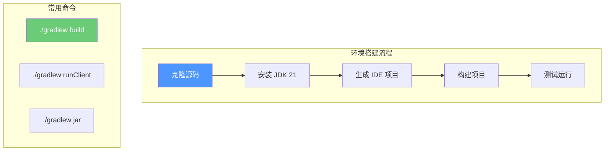

# 第二章：Iris 开发环境搭建

> 配置 Iris 开发环境与调试工具

---

## 目标

学完本章后，你将能够：

1. **搭建 Iris 开发环境**
2. **编译并运行 Iris Mod**
3. **配置开发工具进行调试**
4. **了解项目结构**

---

## 前置准备

### 必需软件

| 软件 | 版本 | 用途 |
|------|------|------|
| JDK | 21+ | Java 开发环境 |
| Git | 最新 | 版本控制 |
| IDEA / VSCode | 最新 | 代码编辑器 |
| Minecraft | 1.21 | 游戏客户端 |

### 可选软件

| 软件 | 用途 |
|------|------|
| GitHub Desktop | 可视化 Git 操作 |
| HMC | Minecraft 启动器 |

---

## 获取源码

### 1. 克隆仓库

```bash
# 使用 Git 克隆 Iris 仓库
git clone https://github.com/IrisShaders/Iris.git

# 进入项目目录
cd Iris

# 查看分支
git branch -a
```

### 2. 选择版本

```bash
# 查看可用的版本标签
git tag

# 切换到特定版本（例如 1.7.3）
git checkout v1.7.3
```

### 3. 项目结构

```
Iris/
├── src/
│   └── main/
│       ├── java/net/irisshaders/iris/
│       │   ├── pipeline/        # 渲染管线
│       │   ├── shaderpack/      # 着色器包系统
│       │   ├── shadows/         # 阴影系统
│       │   ├── targets/         # 帧缓冲
│       │   ├── uniforms/        # Uniform 管理
│       │   ├── gl/              # OpenGL 封装
│       │   └── mixin/           # Mixin 注入
│       └── resources/
│           └── assets/iris/     # 资源文件
├── build.gradle                 # Gradle 构建配置
├── gradle.properties           # Gradle 属性
└── settings.gradle             # 项目设置
```

---

## 环境配置

### 1. 安装 JDK 21

Iris 需要 JDK 21 或更高版本。

```bash
# 检查 Java 版本
java -version

# 如果版本不对，设置 JAVA_HOME
# Windows:
set JAVA_HOME=C:\Program Files\Java\jdk-21

# Linux/Mac:
export JAVA_HOME=/usr/lib/jvm/jdk-21
```

### 2. Gradle 包装器

Iris 使用 Gradle 进行构建管理：

```bash
# Windows
./gradlew.bat

# Linux/Mac
./gradlew

# 首次运行会下载 Gradle（约 100MB）
```

### 3. 生成 IDE 项目

```bash
# 为 IntelliJ IDEA 生成项目
./gradlew idea

# 为 VSCode 生成项目
./gradlew vscode

# 为 Eclipse 生成项目
./gradlew eclipse
```

---

## 构建项目

### 基本构建命令

```bash
# 构建所有模块
./gradlew build

# 只构建主模块（跳过测试）
./gradlew assemble

# 清理后重新构建
./gradlew clean build
```

### 运行测试

```bash
# 运行所有测试
./gradlew test

# 运行特定测试
./gradlew test --tests "net.irisshaders.iris.*"
```

### 生成 JAR 文件

```bash
# 在 build/libs/ 目录生成 jar 文件
./gradlew jar

# 包含所有依赖的 fat jar
./gradlew shadowJar
```

---

## 在游戏中测试

### 方法 1：直接运行

```bash
# 启动 Minecraft 并加载 Iris Mod
./gradlew runClient
```

### 方法 2：手动安装

1. 找到生成的 JAR 文件：
   ```
   build/libs/iris-1.7.3.jar
   ```

2. 复制到游戏的 mods 文件夹：
   ```
   .minecraft/mods/1.21/iris-1.7.3.jar
   ```

3. 确保已安装 Sodium 和 Fabric Loader

### 方法 3：开发客户端

```bash
# 启动带调试的开发客户端
./gradlew runDevClient
```

---

## IDE 配置

### IntelliJ IDEA

1. **打开项目**
   - File → Open → 选择 Iris 目录
   - 选择 "Import as Gradle project"

2. **配置 JDK**
   - File → Project Structure → Project
   - 设置 Project SDK 为 JDK 21

3. **运行配置**
   - Run → Edit Configurations
   - 添加 Gradle 配置：
   ```
   Tasks: runClient
   ```

### VSCode

1. **安装插件**
   - Java Extension Pack
   - Language Support for Java(TM) by Red Hat

2. **配置 Java Home**
   - Ctrl + Shift + P → Java: Configure Java Runtime
   - 选择 JDK 21

---

## 调试技巧

### 1. 查看日志

Iris 的日志位于：
```
.minecraft/logs/iris.log
```

### 2. 启用调试模式

在 `gradle.properties` 中：

```properties
# 启用详细日志
org.gradle.logging=debug

# 启用 Mixin 调试
mixin.env.remapRefMap=true
mixin.env.transformCacheSize=2048
```

### 3. 使用 Debugger

在 IDE 中设置断点：

```java
// 在关键位置设置断点
public void onShaderLoaded(ShaderPack pack) {
    // 断点可以设在这里
    LOGGER.info("Loading shader: " + pack.getName());
}
```

---

## 常见问题

### Q1：Gradle 构建失败

```bash
# 清理缓存
./gradlew clean --refresh-dependencies

# 重新下载依赖
./gradlew --refresh-dependencies
```

### Q2：找不到 Minecraft 源码

确保已安装 Fabric 和 Minecraft 依赖：

```bash
./gradlew fetchMinecraft
```

### Q3：Java 版本不兼容

```bash
# 检查 Gradle 使用的 Java 版本
./gradlew -version

# 如果版本不对，设置 JAVA_HOME 后重试
```

---

## 小结



---

## 相关链接

- 下一章：[创建第一个 Shader](./03-create-simple-shader.md) - 开始编写代码
- [Iris GitHub](https://github.com/IrisShaders/Iris) - 官方仓库
- [Mixin 文档](https://github.com/SpongePowered/Mixin) - 字节码注入框架

---

> 💡 **提示**：遇到问题先查看日志文件，大部分构建问题都可以通过清理缓存解决。

---

*文档版本：Iris 1.7.x / Minecraft 1.21*
*最后更新：2026-03-21*
