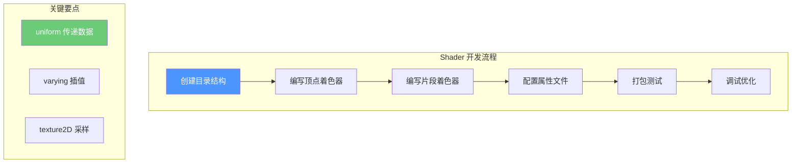

# 第三章：创建第一个 Shader

> 编写简单的 GLSL 着色器代码

---

## 目标

学完本章后，你将能够：

1. **理解 ShaderPack 的基本结构**
2. **创建简单的 GLSL 着色器文件**
3. **使用内置 Uniform 实现动态效果**
4. **测试和调试你的 Shader**

---

## ShaderPack 基本结构

### 目录结构

```
MyShaderPack/
├── pack.mcmeta              # 包的元信息
├── shaders/
│   ├── shaders.properties   # 着色器配置
│   ├── gbuffers_terrain.vsh  # 地形顶点着色器
│   ├── gbuffers_terrain.fsh  # 地形片段着色器
│   ├── gbuffers_water.vsh     # 水面顶点着色器
│   ├── gbuffers_water.fsh     # 水面片段着色器
│   ├── composite.vsh         # 合成阶段顶点着色器
│   ├── composite.fsh         # 合成阶段片段着色器
│   └── final.vsh             # 最终输出顶点着色器
└── Textures/
    └── noise.png            # 噪声纹理（可选）
```

### pack.mcmeta

```json
{
    "pack": {
        "pack_format": 34,
        "description": "我的第一个 ShaderPack"
    },
    "irispack": {
        "version": 1,
        "shaders": [
            "gbuffers_terrain",
            "gbuffers_water",
            "composite"
        ]
    }
}
```

### shaders.properties

```properties
# 阴影设置
shadowMapResolution=2048
shadowDistance=64.0
shadowDistanceRenderMul=1.0

# 光照设置
oldLighting=true
oldReflections=true

# 天空设置
waterOpacity=1.0

# 抗锯齿
antialiasingLevel=0

# 天空颜色
fogEnable=true
fogDensity=0.0
```

---

## 第一个 Shader：地形着色器

### 顶点着色器 (gbuffers_terrain.vsh)

```glsl
#version 120

varying vec4 color;           // 顶点颜色
varying vec2 texCoord;         // 纹理坐标
varying vec3 normal;           // 法线
varying vec3 tangent;          // 切线
varying vec4 mcPos;            // Minecraft 位置
varying float blockType;       // 方块类型

uniform mat4 modelViewMatrix;   // 模型视图矩阵
uniform mat4 projectionMatrix;  // 投影矩阵
uniform vec3 cameraPosition;    // 相机位置

// 切线空间矩阵
attribute vec4 at_tangent;

void main() {
    // 传递颜色和纹理坐标
    color = gl_Color;
    texCoord = (gl_TextureMatrix[0] * gl_MultiTexCoord0).xy;

    // 计算法线和切线
    normal = gl_NormalMatrix * gl_Normal;
    tangent = normalize(gl_NormalMatrix * at_tangent.xyz);

    // Minecraft 位置
    mcPos = gl_MultiTexCoord0;

    // 方块类型（用于区分不同方块）
    blockType = float(gl_MultiTexCoord0.z);

    // 顶点位置
    gl_Position = ftransform();

    // 传递位置给片段着色器
    color = gl_Color;
}
```

### 片段着色器 (gbuffers_terrain.fsh)

```glsl
#version 120

varying vec4 color;           // 顶点颜色
varying vec2 texCoord;         // 纹理坐标
varying vec3 normal;           // 法线
varying vec3 tangent;          // 切线
varying vec4 mcPos;            // Minecraft 位置

uniform sampler2D texture;     // 主纹理
uniform vec3 cameraPosition;    // 相机位置

// 光照相关
uniform struct {
    vec3 direction;           // 光照方向
    vec3 color;                // 光照颜色
    float strength;            // 光照强度
} light;

// 时间相关（用于动画）
uniform float frameTimeCounter;

// 调试模式
uniform vec3 fogColor;

void main() {
    // 采样主纹理
    vec4 texColor = texture2D(texture, texCoord);

    // 计算基础光照
    float diffuse = max(dot(normal, light.direction), 0.0);

    // 应用光照
    vec3 litColor = texColor.rgb * color.rgb * light.color * light.strength * diffuse;

    // 添加环境光
    litColor += texColor.rgb * color.rgb * 0.2;

    // 基础雾效
    float dist = distance(cameraPosition, gl_FragCoord.xyz);
    float fogFactor = clamp(dist / 64.0, 0.0, 1.0);
    litColor = mix(litColor, fogColor, fogFactor);

    gl_FragColor = vec4(litColor, texColor.a * color.a);
}
```

---

## 添加动态效果

### 1. 脉冲光效

```glsl
// 在片段着色器中添加
uniform float frameTimeCounter;

void main() {
    // 创建脉冲效果
    float pulse = sin(frameTimeCounter * 2.0) * 0.5 + 0.5;
    vec3 pulseColor = vec3(1.0, 0.5, 0.2) * pulse * 0.3;

    // 添加到最终颜色
    litColor += pulseColor;
}
```

### 2. 距离雾效

```glsl
void main() {
    // 获取世界坐标
    vec3 worldPos = cameraPosition + gl_FragCoord.xyz;

    // 计算雾的浓度
    float fogDensity = 0.02;
    float dist = length(worldPos - cameraPosition);
    float fogFactor = 1.0 - exp(-fogDensity * dist);

    // 雾效颜色
    vec3 fogColor = vec3(0.5, 0.6, 0.8);

    // 混合颜色
    litColor = mix(litColor, fogColor, fogFactor);
}
```

### 3. 噪声扰动

```glsl
// 简单的噪声函数
float noise(vec2 p) {
    return fract(sin(dot(p, vec2(12.9898, 78.233))) * 43758.5453);
}

void main() {
    // 扰动纹理坐标
    vec2 offset = vec2(
        noise(texCoord * 10.0 + frameTimeCounter),
        noise(texCoord * 10.0 + 100.0)
    ) * 0.02;

    // 使用扰动后的坐标采样
    vec4 texColor = texture2D(texture, texCoord + offset);
}
```

---

## 水面着色器

### 顶点着色器 (gbuffers_water.vsh)

```glsl
#version 120

varying vec4 color;
varying vec2 texCoord;
varying vec3 normal;
varying vec4 mcPos;
varying float isAbove;

uniform float frameTimeCounter;

void main() {
    // 传递基础数据
    color = gl_Color;
    texCoord = (gl_TextureMatrix[0] * gl_MultiTexCoord0).xy;
    normal = gl_NormalMatrix * gl_Normal;
    mcPos = gl_MultiTexCoord0;

    // 添加波浪动画
    vec3 pos = gl_Vertex.xyz;
    float wave = sin(pos.x * 0.1 + frameTimeCounter) * 0.1;
    wave += sin(pos.z * 0.1 + frameTimeCounter * 1.5) * 0.1;
    pos.y += wave;

    gl_Position = ftransform();

    // 判断是否在水面之上
    isAbove = gl_Vertex.y > 0.0 ? 1.0 : 0.0;

    color = gl_Color;
}
```

### 片段着色器 (gbuffers_water.fsh)

```glsl
#version 120

varying vec4 color;
varying vec2 texCoord;
varying vec3 normal;
varying vec4 mcPos;
varying float isAbove;

uniform sampler2D texture;
uniform vec3 cameraPosition;
uniform float frameTimeCounter;

uniform struct {
    vec3 direction;
    vec3 color;
    float strength;
} light;

void main() {
    // 基础纹理
    vec4 texColor = texture2D(texture, texCoord);

    // 水的颜色
    vec3 waterColor = vec3(0.1, 0.3, 0.5);
    vec3 deepColor = vec3(0.0, 0.1, 0.2);

    // 深度混合
    float depth = clamp((cameraPosition.y - mcPos.y) / 10.0, 0.0, 1.0);
    vec3 finalColor = mix(waterColor, deepColor, depth);

    // 光照
    float diffuse = max(dot(normal, light.direction), 0.0);
    finalColor *= diffuse * 0.8 + 0.3;

    // 反射高光
    vec3 viewDir = normalize(cameraPosition - gl_FragCoord.xyz);
    vec3 halfDir = normalize(light.direction + viewDir);
    float specular = pow(max(dot(normal, halfDir), 0.0), 32.0);
    finalColor += vec3(1.0) * specular * 0.5;

    // 焦散效果
    float caustic = sin(texCoord.x * 20.0 + frameTimeCounter) *
                   sin(texCoord.y * 20.0 + frameTimeCounter * 1.3);
    caustic = caustic * 0.5 + 0.5;
    finalColor += vec3(0.2, 0.3, 0.3) * caustic * 0.2;

    gl_FragColor = vec4(finalColor * color.rgb, 0.7);
}
```

---

## 测试你的 Shader

### 1. 打包 ShaderPack

```
1. 创建 zip 压缩包
2. 命名为 MyShader.zip
3. 放入 .minecraft/shaderpacks/ 目录
4. 在游戏内 Shader 设置中选择
```

### 2. 调试技巧

```glsl
// 添加调试输出
void main() {
    // 将法线显示为颜色
    vec3 debugColor = normal * 0.5 + 0.5;
    gl_FragColor = vec4(debugColor, 1.0);
}
```

### 3. 常见错误

| 错误 | 原因 | 解决方法 |
|------|------|----------|
| 黑色画面 | 顶点着色器输出错误 | 检查 gl_Position 计算 |
| 编译失败 | 语法错误 | 检查 uniform/varying 声明 |
| 纹理错位 | texCoord 计算错误 | 检查 gl_TextureMatrix |

---

## 小结



### 关键要点

1. **ShaderPack 结构** - 包含 shaders 目录和配置文件
2. **顶点着色器** - 处理顶点位置、传递数据
3. **片段着色器** - 计算每个像素的最终颜色
4. **uniform** - 从游戏传递数据到 Shader
5. **测试循环** - 编写 → 打包 → 测试 → 调试

---

## 练习

### 练习 1：创建彩色方块

修改 terrain 着色器，让所有方块显示为红色。

### 练习 2：添加日夜变化

使用 frameTimeCounter 让光照强度随时间变化。

### 练习 3：创建透明效果

修改 water 着色器，让水面显示背景纹理。

---

## 相关链接

- 下一章：[ShaderPack 结构](./04-shaderpack-structure.md) - 深入理解文件结构
- [Iris 分析文档](../analysis/03-shaderpack-system.md) - 源码分析
- [GLSL 参考](https://www.khronos.org/opengl/wiki/Core_Language_(GLSL))

---

> 💡 **提示**：从简单的效果开始，逐步添加复杂功能。多看 Iris 的内置 Shader 示例。

---

*文档版本：Iris 1.7.x / Minecraft 1.21*
*最后更新：2026-03-21*
