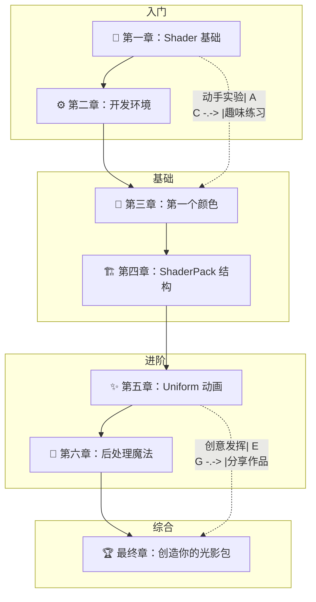
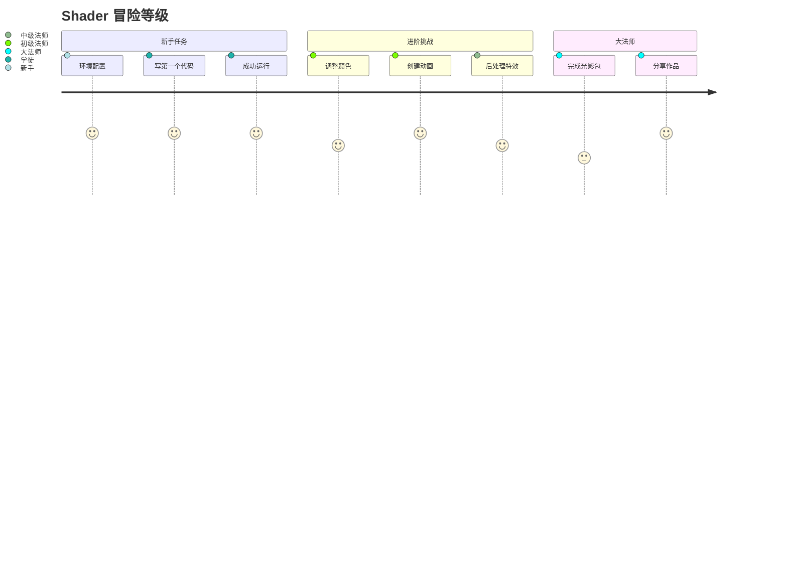

# 🎮 Iris 光影开发教程

> ✨ 从零开始学习 Iris 着色器开发 —— 游戏化、图表化、实践导向！

---

## 🎯 什么是 Shader？

Shader（着色器）是运行在显卡上的特殊程序，可以创造出令人惊叹的视觉效果！

```
原版 Minecraft                          加载 Shader 后
┌─────────────────────────┐            ┌─────────────────────────┐
│                         │            │                         │
│    🌞 自然光照         │    ──▶    │    🌟 动态软阴影       │
│    💧 普通水面         │            │    🌊 反射+波纹       │
│    🌄 固定天空         │            │    🌅 大气散射        │
│                         │            │    ✨ 体积光照        │
└─────────────────────────┘            └─────────────────────────┘
```

---

## 📚 课程大纲

### 学习路线图



### 章节列表

| 章节 | 标题 | 你会做什么 | 难度 | 预计时间 |
|------|------|-----------|------|----------|
| 00 | [课程介绍](00-introduction.md) | 了解课程大纲和学习目标 | ⭐ | 10分钟 |
| 01 | [Shader 基础](01-shader-basics.md) | 理解 GPU 编程和 GLSL 语法 | ⭐ | 45分钟 |
| 02 | [开发环境](02-iris-setup.md) | 搭建开发环境 | ⭐ | 30分钟 |
| 03 | [第一个颜色](03-first-color.md) | 让世界变亮/变暗/变色 | ⭐⭐ | 60分钟 |
| 04 | [ShaderPack 结构](04-shaderpack-structure.md) | 理解完整文件组织 | ⭐⭐ | 45分钟 |
| 05 | [Uniform 动画](05-uniform-animation.md) | 让画面动起来 | ⭐⭐ | 75分钟 |
| 06 | [后处理魔法](06-postprocessing.md) | 全屏特效 | ⭐⭐⭐ | 90分钟 |

---

## 🎮 学习特色

### 1. 游戏化进度



### 2. 丰富的图表

教程包含大量 Mermaid 图表，帮助理解抽象概念：

- 流程图：渲染管线
- 架构图：文件结构
- 对比图：效果展示
- 时序图：动画过程

### 3. 可运行的趣味示例

每个章节都包含可以直接运行的代码示例：

```
✨ 你会做出的效果

┌─────────────────────────────────────────────────────────────┐
│                                                             │
│   🌈 彩虹呼吸效果         💓 心跳脉动         🌊 水波纹 │
│                                                             │
│   📺 复古电视扫描线       🎨 赛博朋克调色      🔮 色差   │
│                                                             │
└─────────────────────────────────────────────────────────────┘
```

---

## 🚀 快速开始

### 第一步：准备好工具

👉 [开发环境搭建](02-iris-setup.md) - 配置你的电脑

### 第二步：理解基础

👉 [Shader 基础](01-shader-basics.md) - 了解什么是 GPU 编程

### 第三步：动手实践

👉 [第一个颜色](03-first-color.md) - 写你的第一行 Shader 代码！

---

## 💡 学习建议

1. **循序渐进**：按顺序学习，不要跳着看
2. **动手实验**：每个例子都亲自运行试试
3. **多做练习**：章节末尾的挑战题要尝试完成
4. **分享作品**：完成后可以截图分享给朋友！

---

## 🔗 相关资源

| 资源 | 链接 |
|------|------|
| 📖 [Iris 源码分析](/iris/analysis/) | 深入理解 Iris 内部架构 |
| 🎮 [Iris 官网](https://irisshaders.net/) | 下载 Iris Mod |
| 🎨 [Shader 示例库](https://github.com/) | 更多参考代码 |

---

## 💬 常见问题

**Q: 我需要会 Java 吗？**
A: 不需要！Shader 使用的是 GLSL 语言。

**Q: 我需要懂数学吗？**
A: 基本的加减乘除就够了。我们会解释所有用到的数学。

**Q: 电脑配置要求高吗？**
A: 任何能运行 Minecraft 的电脑都可以开发 Shader。

---

*🎉 准备好了吗？让我们开始 Shader 冒险之旅！*

*教程版本：Iris 1.7.x / Minecraft 1.21*
