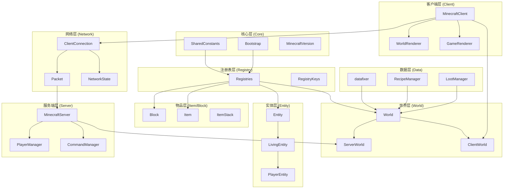
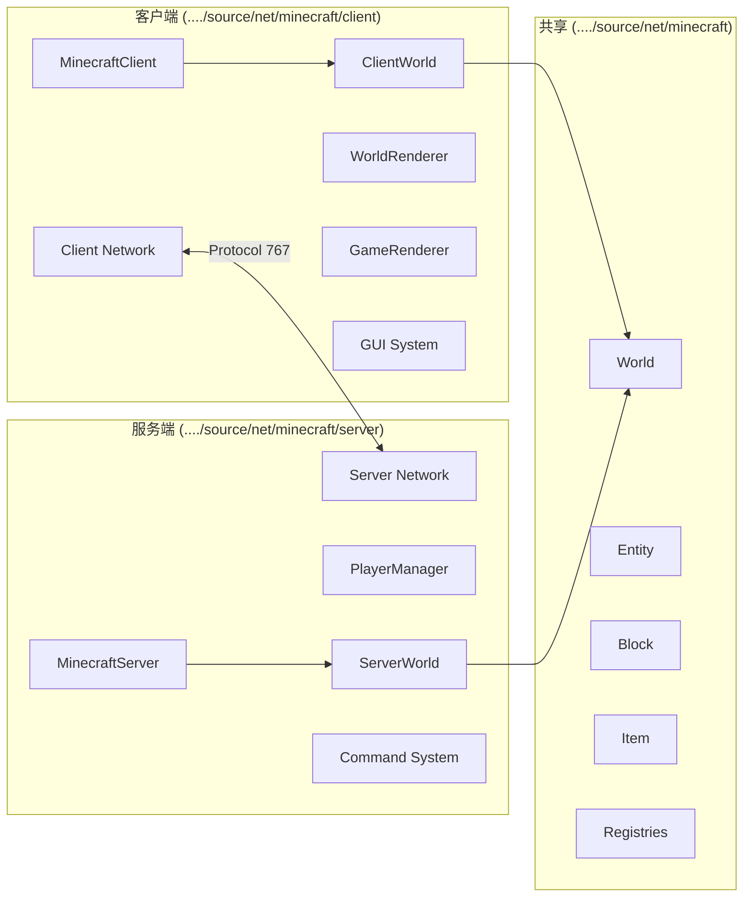

# Minecraft 1.21 架构总览

> 分析基于 Minecraft 1.21 反编译源代码 (CFR 0.2.2)
> 版本信息: Protocol 767, World Version 3953
> 文件总数: 5364 个 Java 文件

---

## 1. 概述

Minecraft 是一个典型的沙盒式开放世界游戏，其源代码架构体现了高度模块化设计和客户端-服务端分离原则。游戏采用 Java 语言开发，使用 Netty 作为网络通信框架，Brigadier 作为命令解析库。

### 1.1 核心版本常量

```37:44:source/net/minecraft/MinecraftVersion.java
private MinecraftVersion() {
    this.id = UUID.randomUUID().toString().replaceAll("-", "");
    this.name = "1.21";
    this.stable = true;
    this.saveVersion = new SaveVersion(3953, "main");
    this.protocolVersion = SharedConstants.getProtocolVersion();
    this.resourcePackVersion = 34;
    this.dataPackVersion = 48;
    this.buildTime = new Date();
}
```

---

## 2. 架构设计模式

### 2.1 客户端-服务端分离架构

Minecraft 1.21 采用逻辑上分离的客户端-服务端架构，核心设计原则：

1. **逻辑权威性**: 服务端是游戏逻辑的绝对权威
2. **状态同步**: 客户端通过数据包 (Packet) 接收服务端的游戏状态
3. **环境区分**: 使用 `World.isClient` 标志位区分运行环境

```123:126:source/net/minecraft/world/World.java
public final boolean isClient;
private final WorldBorder border;
private final BiomeAccess biomeAccess;
private final RegistryKey<World> registryKey;
```

#### 世界类的客户端-服务端实现

| 类 | 包 | 职责 |
|---|---|---|
| `World` | `net.minecraft.world` | 抽象基类，定义通用接口 |
| `ServerWorld` | `net.minecraft.server.world` | 服务端世界实现，处理 tick 和实体更新 |
| `ClientWorld` | `net.minecraft.client.world` | 客户端世界实现，接收并渲染服务端数据 |

### 2.2 核心设计模式

#### 2.2.1 注册表模式 (Registry Pattern)

Minecraft 使用统一的注册表系统管理所有游戏内容：

```134:150:source/net/minecraft/registry/Registries.java
public class Registries {
    private static final Map<Identifier, Supplier<?>> DEFAULT_ENTRIES = Maps.newLinkedHashMap();
    private static final MutableRegistry<MutableRegistry<?>> ROOT = new SimpleRegistry(RegistryKey.ofRegistry(RegistryKeys.ROOT), Lifecycle.stable());
    public static final DefaultedRegistry<GameEvent> GAME_EVENT = Registries.create(RegistryKeys.GAME_EVENT, "step", GameEvent::registerAndGetDefault);
    public static final Registry<SoundEvent> SOUND_EVENT = Registries.create(RegistryKeys.SOUND_EVENT, registry -> SoundEvents.ENTITY_ITEM_PICKUP);
    public static final DefaultedRegistry<Fluid> FLUID = Registries.createIntrusive(RegistryKeys.FLUID, "empty", registry -> Fluids.EMPTY);
    public static final Registry<StatusEffect> STATUS_EFFECT = Registries.create(RegistryKeys.STATUS_EFFECT, StatusEffects::registerAndGetDefault);
    public static final DefaultedRegistry<Block> BLOCK = Registries.createIntrusive(RegistryKeys.BLOCK, "air", registry -> Blocks.AIR);
    public static final DefaultedRegistry<EntityType<?>> ENTITY_TYPE = Registries.createIntrusive(RegistryKeys.ENTITY_TYPE, "pig", registry -> EntityType.PIG);
    public static final DefaultedRegistry<Item> ITEM = Registries.createIntrusive(RegistryKeys.ITEM, "air", registry -> Items.AIR);
    // ... 更多注册表
}
```

#### 2.2.2 观察者模式 (Observer Pattern)

事件系统使用观察者模式，例如游戏事件 (`GameEvent`) 和实体伤害系统：

```84:85:source/net/minecraft/world/World.java
private final DamageSources damageSources;
```

#### 2.2.3 组件模式 (Component Pattern)

物品和实体使用组件化设计：

```18:19:source/net/minecraft/item/Item.java
public class Item implements ToggleableFeature, ItemConvertible, FabricItem {
    private final ComponentMap components;
```

#### 2.2.4 策略模式 (Strategy Pattern)

方块状态使用策略模式处理不同的渲染和交互行为：

```98:101:source/net/minecraft/block/Block.java
public class Block extends AbstractBlock implements ItemConvertible, FabricBlock {
    public static final MapCodec<Block> CODEC = Block.createCodec(Block::new);
    private final RegistryEntry.Reference<Block> registryEntry = Registries.BLOCK.createEntry(this);
    public static final IdList<BlockState> STATE_IDS = new IdList();
```

### 2.3 启动引导流程

```42:63:source/net/minecraft/Bootstrap.java
public static void initialize() {
    if (initialized) {
        return;
    }
    initialized = true;
    Instant instant = Instant.now();
    if (Registries.REGISTRIES.getIds().isEmpty()) {
        throw new IllegalStateException("Unable to load registries");
    }
    FireBlock.registerDefaultFlammables();
    ComposterBlock.registerDefaultCompostableItems();
    if (EntityType.getId(EntityType.PLAYER) == null) {
        throw new IllegalStateException("Failed loading EntityTypes");
    }
    EntitySelectorOptions.register();
    DispenserBehavior.registerDefaults();
    CauldronBehavior.registerBehavior();
    Registries.bootstrap();
    ItemGroups.collect();
    Bootstrap.setOutputStreams();
    LOAD_TIME.set(Duration.between(instant, Instant.now()).toMillis());
}
```

---

## 3. 包结构详解

### 3.1 包目录概览

```
net.minecraft/
├── advancement/          # 进度/成就系统
├── block/               # 方块系统
├── client/              # 客户端专用代码
├── command/              # 命令系统
├── component/            # 数据组件系统
├── data/                 # 数据生成器
├── datafixer/            # 数据修复/迁移
├── enchantment/          # 附魔系统
├── entity/               # 实体系统
├── fluid/                # 流体系统
├── inventory/            # 物品栏系统
├── item/                 # 物品系统
├── loot/                 #战利品系统
├── nbt/                  # NBT数据格式
├── network/              # 网络通信
├── particle/             # 粒子系统
├── potion/               # 药水系统
├── predicate/            # 条件谓词
├── recipe/               # 合成配方
├── registry/             # 注册表系统
├── resource/             # 资源管理
├── scoreboard/           # 记分板系统
├── screen/               # UI屏幕系统
├── server/               # 服务端专用代码
├── sound/                # 声音系统
├── stat/                 # 统计系统
├── state/                # 状态管理系统
├── structure/            # 结构系统
├── text/                 # 文本渲染
├── util/                 # 工具类
├── village/              # 村庄系统
└── world/                # 世界系统
```

### 3.2 核心包详解

#### 3.2.1 `world` 包 - 世界系统

世界系统是 Minecraft 最核心的子系统，包含：

| 子包/类 | 功能描述 |
|---------|----------|
| `World.java` | 抽象世界类，定义方块操作、实体管理接口 |
| `Chunk.java` | 区块数据存储 |
| `biome/` | 生物群系系统 |
| `gen/` | 世界生成系统 |
| `chuck/` | 区块加载和管理 |

**World 类关键方法**：

```183:185:source/net/minecraft/world/World.java
public boolean isInBuildLimit(BlockPos pos) {
    return !this.isOutOfHeightLimit(pos) && World.isValidHorizontally(pos);
}
```

#### 3.2.2 `entity` 包 - 实体系统

实体系统管理所有游戏中的活动对象：

| 子包 | 功能描述 |
|------|----------|
| `ai/` | AI 行为系统 (brain, pathfinding) |
| `attribute/` | 属性系统 (生命值、速度等) |
| `damage/` | 伤害系统 |
| `effect/` | 状态效果 |
| `passive/` | 被动生物 |
| `mob/` | 敌对生物 |
| `player/` | 玩家实体 |
| `projectile/` | 投射物 |

**Entity 类结构** (约 5000+ 行):

```150:155:source/net/minecraft/entity/Entity.java
public abstract class Entity implements EntityLike, Nameable, CraftingResultProvider {
    private static final Logger LOGGER = LogUtils.getLogger();
    public static final int MAX_ENTITY_TAG_LENGTH = 65535;
    public static final int MAX_BROADCAST_PHASE_DISTANCE = 256;
    public static final int MIN_RIDEABLE_SUFFIX_LENGTH = 16;
    private static final byte MISSING_ID = 0;
    public final List<Entity> commandingEntity = new ObjectArrayList<>();
```

#### 3.2.3 `block` 包 - 方块系统

方块系统管理所有静态世界元素：

| 类 | 功能描述 |
|----|----------|
| `Block.java` | 方块基类 |
| `BlockState.java` | 方块状态 |
| `AbstractBlock.java` | 抽象方块实现 |
| `BlockEntity.java` | 方块实体 (TED) |

**Block 类关键常量**：

```121:145:source/net/minecraft/block/Block.java
public static final int NOTIFY_NEIGHBORS = 1;      // 通知邻居方块
public static final int NOTIFY_LISTENERS = 2;       // 通知监听器
public static final int NO_REDRAW = 4;             // 跳过渲染
public static final int REDRAW_ON_MAIN_THREAD = 8; // 主线程重绘
public static final int FORCE_STATE = 16;          // 强制状态
public static final int SKIP_DROPS = 32;           // 跳过掉落
public static final int MOVED = 64;                // 被移动（活塞）
public static final int NOTIFY_ALL = 3;            // 默认更新行为
```

#### 3.2.4 `item` 包 - 物品系统

```96:113:source/net/minecraft/item/Item.java
public class Item implements ToggleableFeature, ItemConvertible, FabricItem {
    private static final Logger LOGGER = LogUtils.getLogger();
    public static final Map<Block, Item> BLOCK_ITEMS = Maps.newHashMap();
    public static final Identifier BASE_ATTACK_DAMAGE_MODIFIER_ID = Identifier.ofVanilla("base_attack_damage");
    public static final Identifier BASE_ATTACK_SPEED_MODIFIER_ID = Identifier.ofVanilla("base_attack_speed");
    public static final int DEFAULT_MAX_COUNT = 64;
    public static final int MAX_MAX_COUNT = 99;
    public static final int ITEM_BAR_STEPS = 13;
    private final RegistryEntry.Reference<Item> registryEntry = Registries.ITEM.createEntry(this);
    private final ComponentMap components;
```

#### 3.2.5 `network` 包 - 网络通信

网络系统基于 Netty 框架，实现客户端-服务端通信：

```102:104:source/net/minecraft/network/ClientConnection.java
public class ClientConnection extends SimpleChannelInboundHandler<Packet<?>> {
    private static final float CURRENT_PACKET_COUNTER_WEIGHT = 0.75f;
    private static final Logger LOGGER = LogUtils.getLogger();
```

**数据包结构**：

```13:16:source/net/minecraft/network/packet/Packet.java
public interface Packet<T extends PacketListener> {
    public PacketType<? extends Packet<T>> getPacketId();
    public void apply(T var1);
```

**网络状态机**：

```18:26:source/net/minecraft/network/NetworkState.java
public interface NetworkState<T extends PacketListener> {
    public NetworkPhase id();
    public NetworkSide side();
    public PacketCodec<ByteBuf, Packet<? super T>> codec();
    @Nullable
    public PacketBundleHandler bundleHandler();
}
```

#### 3.2.6 `client` 包 - 客户端系统

客户端包包含仅在客户端运行的代码，使用 `@Environment(EnvType.CLIENT)` 注解标记：

| 子包 | 功能描述 |
|------|----------|
| `gui/` | GUI系统 (screen, widget) |
| `render/` | 渲染系统 |
| `network/` | 客户端网络处理 |
| `sound/` | 客户端音频 |
| `texture/` | 纹理管理 |
| `particle/` | 粒子渲染 |

**MinecraftClient 入口类** (约 2700 行):

```202:205:source/net/minecraft/client/MinecraftClient.java
@Environment(value=EnvType.CLIENT)
public class MinecraftClient extends BarnChoreProcessor implements AutoCloseable, WorldAccess {
    public static final MinecraftClient INSTANCE = new MinecraftClient();
```

#### 3.2.7 `server` 包 - 服务端系统

服务端包包含仅在服务端运行的代码：

| 子包/类 | 功能描述 |
|---------|----------|
| `MinecraftServer.java` | 服务端主类 |
| `PlayerManager.java` | 玩家管理 |
| `command/` | 服务端命令实现 |
| `dedicated/` | 专用服务器 |
| `network/` | 服务端网络处理 |
| `world/` | 服务端世界管理 |

**MinecraftServer 类注释**：

```193:202:source/net/minecraft/server/MinecraftServer.java
/**
 * Represents a logical Minecraft server.
 * 
 * <p>Since Minecraft uses a Client-Server architecture for the game, the server processes all logical game functions.
 * A few of the actions a Minecraft server will handle includes processing player actions, handling damage to entities, advancing the world time and executing commands.
 * 
 * <p>There are two primary implementations for a Minecraft server: a dedicated and an integrated server.
 */
```

#### 3.2.8 `command` 包 - 命令系统

命令系统使用 Brigadier 库实现命令解析：

```147:155:source/net/minecraft/server/command/CommandManager.java
public class CommandManager {
    private static final ThreadLocal<CommandExecutionContext<ServerCommandSource>> CURRENT_CONTEXT = new ThreadLocal();
    private static final Logger LOGGER = LogUtils.getLogger();
    private final CommandDispatcher<ServerCommandSource> dispatcher = new CommandDispatcher();
```

**命令注册流程**：

```157:254:source/net/minecraft/server/command/CommandManager.java
public CommandManager(RegistrationEnvironment environment, CommandRegistryAccess commandRegistryAccess) {
    AdvancementCommand.register(this.dispatcher);
    AttributeCommand.register(this.dispatcher, commandRegistryAccess);
    ExecuteCommand.register(this.dispatcher, commandRegistryAccess);
    BossBarCommand.register(this.dispatcher, commandRegistryAccess);
    // ... 60+ 命令注册
}
```

#### 3.2.9 `advancement` 包 - 进度系统

进度系统使用 Criteria 模式实现各种成就条件：

```39:45:source/net/minecraft/advancement/Advancement.java
public record Advancement(
    Optional<Identifier> parent, 
    Optional<AdvancementDisplay> display, 
    AdvancementRewards rewards, 
    Map<String, AdvancementCriterion<?>> criteria, 
    AdvancementRequirements requirements, 
    boolean sendsTelemetryEvent, 
    Optional<Text> name
) {
    private static final Codec<Map<String, AdvancementCriterion<?>>> CRITERIA_CODEC = ...
    public static final Codec<Advancement> CODEC = RecordCodecBuilder.create(instance -> ...
}
```

#### 3.2.10 `registry` 包 - 注册表系统

注册表系统是 Minecraft 资源管理的核心：

**核心注册表类型**：

- `SimpleRegistry`: 简单注册表
- `SimpleDefaultedRegistry`: 带默认值的注册表
- `SimpleRegistry`: 可变注册表

**注册表键 (RegistryKeys)**：

```source/net/minecraft/registry/RegistryKeys.java
public static final RegistryKey<Registry<World>> WORLD = of("world");
public static final RegistryKey<Registry<Biome>> BIOME = of("biome");
public static final RegistryKey<Registry<EntityType<?>>> ENTITY_TYPE = of("entity_type");
public static final RegistryKey<Registry<Block>> BLOCK = of("block");
public static final RegistryKey<Registry<Item>> ITEM = of("item");
// ... 更多
```

#### 3.2.11 `datafixer` 包 - 数据修复系统

数据修复系统用于处理世界存档的版本迁移：

| 类 | 功能描述 |
|----|----------|
| `Schemas.java` | 版本架构管理 |
| `fix/` | 各种数据修复器 |
| `schema/` | 版本特定的架构定义 |

#### 3.2.12 `state` 包 - 状态管理系统

状态管理系统用于方块状态和属性的定义：

```32:36:source/net/minecraft/state/StateManager.java
public class StateManager<O, S extends State<O, S>> {
    static final Pattern VALID_NAME_PATTERN = Pattern.compile("^[a-z0-9_]+$");
    private final O owner;
    private final ImmutableSortedMap<String, Property<?>> properties;
    private final ImmutableList<S> states;
```

#### 3.2.13 `resource` 包 - 资源管理系统

资源管理系统负责加载和管理游戏资源：

```20:37:source/net/minecraft/resource/ResourceManager.java
public interface ResourceManager extends ResourceFactory {
    public Set<String> getAllNamespaces();
    public List<Resource> getAllResources(Identifier var1);
    public Map<Identifier, Resource> findResources(String var1, Predicate<Identifier> var2);
    public Map<Identifier, List<Resource>> findAllResources(String var1, Predicate<Identifier> var2);
    public Stream<ResourcePack> streamResourcePacks();
}
```

#### 3.2.14 `village` 包 - 村庄系统

村庄系统包含村民交易、袭击等功能：

| 子类 | 功能描述 |
|------|----------|
| `VillagerData.java` | 村民数据结构 |
| `TradeOffers.java` | 交易报价 |
| `VillagerProfession.java` | 村民职业 |
| `raid/` | 袭击系统 |

---

## 4. 核心系统分析

### 4.1 SharedConstants - 全局常量定义

```15:137:source/net/minecraft/SharedConstants.java
public class SharedConstants {
    public static final int WORLD_VERSION = 3953;
    public static final String CURRENT_SERIES = "main";
    public static final String VERSION_NAME = "1.21";
    public static final int RELEASE_TARGET_PROTOCOL_VERSION = 767;
    public static final int RESOURCE_PACK_VERSION = 34;
    public static final int DATA_PACK_VERSION = 48;
    public static final int DEFAULT_PORT = 25565;
    public static final int CHUNK_WIDTH = 16;
    public static final int DEFAULT_WORLD_HEIGHT = 256;
    public static final int COMMAND_MAX_LENGTH = 32500;
    public static final int EXPANDED_MACRO_COMMAND_MAX_LENGTH = 2000000;
    public static final int TICKS_PER_SECOND = 20;
    public static final int TICKS_PER_MINUTE = 1200;
    public static final int TICKS_PER_IN_GAME_DAY = 24000;
}
```

### 4.2 Bootstrap - 启动初始化

Bootstrap 类负责游戏启动时的初始化工作：

```88:98:source/net/minecraft/Bootstrap.java
public static Set<String> getMissingTranslations() {
    TreeSet<String> set = new TreeSet<String>();
    Bootstrap.collectMissingTranslations(Registries.ATTRIBUTE, EntityAttribute::getTranslationKey, set);
    Bootstrap.collectMissingTranslations(Registries.ENTITY_TYPE, EntityType::getTranslationKey, set);
    Bootstrap.collectMissingTranslations(Registries.STATUS_EFFECT, StatusEffect::getTranslationKey, set);
    Bootstrap.collectMissingTranslations(Registries.ITEM, Item::getTranslationKey, set);
    Bootstrap.collectMissingTranslations(Registries.BLOCK, Block::getTranslationKey, set);
    Bootstrap.collectMissingTranslations(Registries.CUSTOM_STAT, stat -> "stat." + stat.toString().replace(':', '.'), set);
    Bootstrap.collectMissingGameRuleTranslations(set);
    return set;
}
```

### 4.3 MinecraftServer - 服务端核心

```1854:1893:source/net/minecraft/server/MinecraftServer.java
/**
 * Represents a logical Minecraft server.
 * 
 * <p>Since Minecraft uses a Client-Server architecture for the game, the server processes all logical game functions.
 * A few of the actions a Minecraft server will handle includes processing player actions, handling damage to entities, advancing the world time and executing commands.
 * 
 * <p>There are two primary implementations for a Minecraft server: a dedicated and an integrated server.
 */
public abstract class MinecraftServer extends Thread
    implements RegistryAttributeProvider,
        CommandSource,
        SystemDetailA,
        AutoCloseable {
    // 服务端实现
}
```

### 4.4 MinecraftClient - 客户端核心

```180:200:source/net/minecraft/client/MinecraftClient.java
@Environment(value=EnvType.CLIENT)
public class MinecraftClient extends BarnChoreProcessor implements AutoCloseable, WorldAccess {
    public static final MinecraftClient INSTANCE = new MinecraftClient();
    private static final Logger LOGGER = LogUtils.getLogger();
    public static final GameOptions OPTIONS = new GameOptions(null, null);
    private static final long THREAD_SLEEP_TIME_NS = TimeUnit.MILLISECONDS.toNanos(1L);
    private final Path runDirectory;
    private final PropertyMap properties;
    private final VersionInfo versionInfo;
```

---

## 5. 模块依赖关系

### 5.1 模块依赖图



### 5.2 客户端-服务端分离



---

## 6. 关键技术点

### 6.1 区块系统 (Chunk System)

区块是 Minecraft 世界存储和渲染的基本单位：

- **大小**: 16 x 256 x 16 方块
- **存储**: 使用压缩的方块状态数组
- **加载**: 按需加载，附近区块优先

### 6.2 数据包序列化

Minecraft 使用自定义的二进制协议进行通信：

```source/net/minecraft/network/packet/Packet.java
public interface Packet<T extends PacketListener> {
    public PacketType<? extends Packet<T>> getPacketId();
    public void apply(T var1);
    default public boolean isWritingErrorSkippable() { return false; }
    default public boolean transitionsNetworkState() { return false; }
}
```

### 6.3 数据修复 (DataFixing)

用于将旧版本的世界数据迁移到新版本：

```source/net/minecraft/datafixer/Schemas.java
public class Schemas {
    private static final Map<Integer, Schema> schemas = new HashMap<>();
    public static Schema getSchema(int version) { ... }
}
```

### 6.4 命令解析 (Brigadier)

命令系统使用 Brigadier 库进行解析：

```155:156:source/net/minecraft/server/command/CommandManager.java
private final CommandDispatcher<ServerCommandSource> dispatcher = new CommandDispatcher();
```

### 6.5 资源打包 (Resource Pack)

资源系统支持动态加载资源包：

```source/net/minecraft/resource/ResourcePack.java
public interface ResourcePack extends Closeable {
    String getId();
    ResourcePackMeta getMetadata() throws IOException;
    InputStream open(String namespace, String path);
    Collection<Identifier> findResources(String namespace, String path);
}
```

---

## 7. 版本特性 (1.21)

根据 `SharedConstants.java` 中的版本信息：

| 特性 | 值 | 说明 |
|------|-----|------|
| Protocol Version | 767 | 网络协议版本 |
| World Version | 3953 | 世界格式版本 |
| Resource Pack | 34 | 资源包版本 |
| Data Pack | 48 | 数据包版本 |
| Series | main | 版本系列 |
| Stability | stable | 稳定版本 |

---

## 8. 文件统计

| 包名 | 文件数 (约) | 主要功能 |
|------|-------------|----------|
| `net.minecraft.client` | ~1200 | 客户端代码 |
| `net.minecraft.server` | ~500 | 服务端代码 |
| `net.minecraft.world` | ~400 | 世界系统 |
| `net.minecraft.entity` | ~600 | 实体系统 |
| `net.minecraft.block` | ~500 | 方块系统 |
| `net.minecraft.item` | ~300 | 物品系统 |
| `net.minecraft.network` | ~400 | 网络通信 |
| `net.minecraft.command` | ~200 | 命令系统 |
| `net.minecraft.datafixer` | ~300 | 数据修复 |
| 其他 | ~1000 | 其他模块 |
| **总计** | **~5364** | - |

---

## 9. 总结

Minecraft 1.21 的架构设计体现了以下核心原则：

1. **模块化设计**: 各系统（世界、实体、物品、网络）高度独立
2. **客户端-服务端分离**: 清晰的逻辑分离，通过网络协议通信
3. **注册表驱动**: 统一的内容注册系统
4. **事件驱动**: 通过事件系统解耦游戏逻辑
5. **版本兼容**: 完善的数据修复系统确保旧世界可加载

这套架构使得 Minecraft 能够：
- 支持模组 (Mod) 扩展
- 维护多个版本的世界兼容性
- 在不同平台上运行 (Java Edition, Bedrock Edition)
