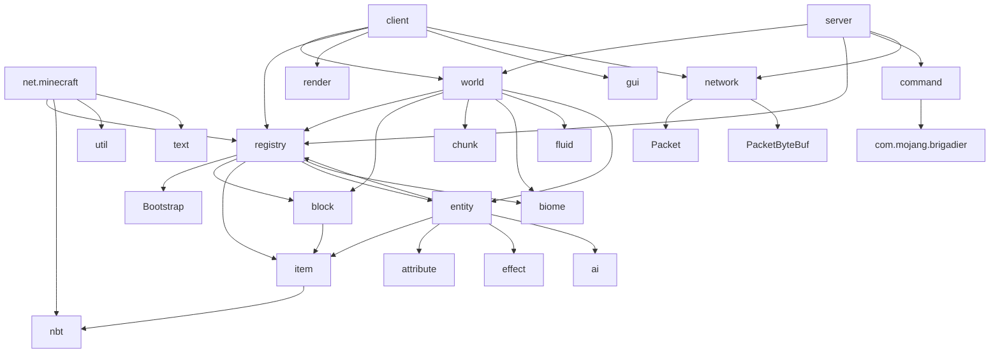

# Minecraft 1.21 包结构详解

> 基于 5364 个 Java 文件的完整包结构分析

---

## 顶级包结构

```
source/
├── net.minecraft/          # Minecraft 主命名空间 (约 5200 文件)
├── com/                    # 第三方依赖 (约 100 文件)
└── META-INF/              # JAR 元数据
```

---

## 1. net.minecraft 包

### 1.1 根级别类

| 文件 | 用途 |
|------|------|
| `Bootstrap.java` | 注册表初始化引导程序 |
| `MinecraftVersion.java` | 版本信息 (1.21, Protocol 767) |
| `SharedConstants.java` | 全局常量定义 |
| `GameVersion.java` | 版本接口 |

### 1.2 advancement - 进度系统

```
advancement/
├── Advancement.java        # 进度条目
├── AdvancementProgress.java # 进度状态
├── AdvancementRewards.java # 进度奖励
├── DisplayInfo.java       # 显示信息
├── AdvancementTree.java   # 进度树
└── AdvancementRewards.java
```

**职责**: 管理玩家进度成就系统

### 1.3 block - 方块系统

```
block/
├── AbstractBlock.java     # 方块抽象基类
├── Block.java             # 方块主类
├── BlockState.java        # 方块状态
├── BlockEntity.java       # 方块实体
├── BlockBehavior.java     # 方块行为接口
├── BlockSettings.java     # 方块设置
├── HorizontalFacingBlock.java
├── StainedBlock.java
├── LeavesBlock.java
├── SaplingGenerator.java
├── PatternProvider.java
├── sign/
│   ├── SignBlock.java
│   ├── Sign.java
│   └── AbstractSignBlock.java
├── portal/
│   ├── Portal.java
│   └── PortalUtil.java
└── [其他专用方块]
```

**职责**: 所有方块类型的定义和交互

### 1.4 client - 客户端专用

详见 [02-client-module.md](02-client-module.md)

```
client/
├── MinecraftClient.java   # 主客户端类
├── ClientBrandRetriever.java
├── Keyboard.java
├── Mouse.java
├── QuickPlay.java
├── WindowEventHandler.java
├── WindowSettings.java
├── RunArgs.java
├── color/                 # 颜色系统
├── font/                  # 字体渲染
├── gl/                    # OpenGL 封装
├── gui/                   # GUI 系统
│   ├── screen/            # 各种屏幕
│   ├── hud/               # HUD 组件
│   ├── widget/            # UI 组件
│   └── navigation/        # 导航
├── input/                 # 输入处理
├── main/                  # 启动
├── model/                 # 实体模型
├── network/               # 客户端网络
├── option/                # 设置
├── particle/              # 粒子
├── realms/                # Realms
├── recipebook/            # 配方书
├── render/                # 渲染引擎
├── resource/              # 资源管理
├── search/                # 搜索
├── session/               # 会话
├── sound/                 # 声音
├── texture/               # 纹理
├── toast/                 # 通知
├── tutorial/              # 教程
├── util/                  # 工具类
└── world/                 # 客户端世界
```

### 1.5 command - 命令系统

```
command/
├── ArgumentBuilder.java
├── CommandSource.java     # 命令源
├── CommandManager.java    # 命令管理器
├── CommandDispatcher.java
├── CommandRegistry.java
├── CommandContext.java
├── CommandSuggestionProvider.java
├── TranslatableBuiltInExceptions.java
└── [其他命令相关]
```

**职责**: 命令解析和执行 (集成 Brigadier)

### 1.6 component - 组件系统 (1.21 新增)

```
component/
├── ComponentMap.java      # 组件映射
├── ComponentMapImpl.java
├── Component.java         # 组件接口
├── ComponentTypes.java    # 组件类型
└── [其他组件类型]
```

**职责**: 1.21 引入的组件化数据系统

### 1.7 data - 数据处理

```
data/
├── DataCommand.java
├── DataComponents.java
├── DataResult.java
└── [数据命令相关]
```

### 1.8 datafixer - 数据修复系统

```
datafixer/
├── DataFixerUpper.java    # 上层修复接口
├── DataFixers.java        # 修复器入口
├── Schemas.java           # Schema 管理
├── DataFix.java           # 修复基类
├── Fixes.java             # 预定义修复
├── Walkers.java           # NBT 遍历器
└── Flattener.java         # 数据展平
```

**职责**: 世界数据版本迁移

### 1.9 enchantment - 附魔系统

```
enchantment/
├── Enchantment.java       # 附魔类型
├── EnchantmentHelper.java # 附魔工具
├── EnchantmentTarget.java
├── EnchantmentLevelBasedEffect.java
├── Trinity.java
└── [其他附魔相关]
```

### 1.10 entity - 实体系统

```
entity/
├── Entity.java            # 实体基类
├── LivingEntity.java      # 有生命实体
├── MobEntity.java         # 生物基类
├── EntityType.java        # 实体类型
├── EntityDimensions.java   # 实体尺寸
├── EntityPose.java        # 实体姿态
├── EntityData.java        # 实体数据
├── EntityAttachments.java
├── EntityStatuses.java    # 实体状态
├── SpawnGroup.java        # 生成组
├── SpawnReason.java       # 生成原因
├── SpawnLocation.java     # 生成位置
├── SpawnRestriction.java
├── ai/                    # AI 系统
│   ├── brain/             # 大脑系统
│   │   ├── Brain.java     # AI 大脑
│   │   ├── MemoryModule.java
│   │   └── Task.java
│   ├── pathing/           # 路径查找
│   ├── sensing/            # 感知系统
│   └── goal/               # 目标系统 (旧版)
├── attribute/              # 属性系统
│   ├── Attribute.java
│   ├── AttributeInstance.java
│   ├── EntityAttributes.java
│   └── Modifiable.java
├── damage/                 # 伤害系统
├── data/                  # 数据同步
├── decoration/             # 装饰实体
├── effect/                # 药水效果
├── mob/                   # 生物实体
├── passive/               # 被动生物
├── player/                # 玩家实体
├── projectile/            # 投射物
├── raid/                  # 袭击
├── vehicle/               # 载具
└── boss/                  # Boss
```

### 1.11 fluid - 流体系统

```
fluid/
├── Fluid.java             # 流体基类
├── FluidState.java        # 流体状态
├── Fluids.java            # 流体注册
├── WaterFluid.java
├── LavaFluid.java
├── FlowableFluid.java
└── EmptyFluid.java
```

### 1.12 inventory - 物品栏系统

```
inventory/
├── Inventory.java         # 物品栏接口
├── SimpleInventory.java   # 简单实现
├── BasicInventory.java
├── InventoryChangedCriterion.java
├── HopperInventory.java
└── [容器相关]
```

### 1.13 item - 物品系统

```
item/
├── Item.java              # 物品基类
├── ItemStack.java         # 物品堆叠
├── ItemConvertible.java   # 物品转换接口
├── ItemUsageListener.java
├── EquipmentSlot.java     # 装备槽位
├── ItemGroup.java         # 创造模式物品栏
├── SpawnEggItem.java      # 刷怪蛋
├── BlockItem.java         # 方块物品
├── BucketItem.java        # 桶
├── FoodComponent.java     # 食物组件
├── PotionItem.java        # 药水
├── EnchantedBookItem.java # 附魔书
└── [其他物品类型]
```

### 1.14 loot -战利品系统

```
loot/
├── LootTables.java        # 战利品表
├── LootPool.java          # 战利品池
├── LootEntry.java         # 条目
├── LootItemFunction.java  # 函数
├── LootCondition.java    # 条件
├── LootManager.java      # 管理器
├── provider/             # 数据提供者
└── modifier/            # 修改器
```

### 1.15 nbt - NBT 数据

```
nbt/
├── NbtCompound.java      # NBT 复合标签
├── NbtElement.java       # NBT 元素
├── NbtList.java          # NBT 列表
├── NbtInt.java
├── NbtString.java
├── NbtDouble.java
├── NbtByte.java
├── NbtLong.java
├── NbtFloat.java
└── [其他 NBT 类型]
```

### 1.16 network - 网络协议

```
network/
├── ClientConnection.java  # 客户端连接
├── NetworkState.java      # 协议状态
├── Packet.java           # 数据包接口
├── PacketByteBuf.java    # 数据包缓冲区
├── PacketListener.java   # 数据包监听器
├── ClientBoundPacketType.java   # 客户端数据包
├── ServerBoundPacketType.java   # 服务端数据包
├── PacketCallbacks.java
├── PacketCompressor.java
├── PacketDecompressor.java
├── VarInt.java           # VarInt 编码
└── ip/
    └── [IP 相关]
```

### 1.17 registry - 注册表系统

```
registry/
├── Registry.java         # 注册表接口
├── RegistryKey.java      # 注册键
├── Registries.java       # 内置注册表
├── RegistryEntry.java    # 注册条目
├── RegistryEntryHolder.java
├── RegistryOps.java      # NBT 操作
├── MutableRegistry.java  # 可变注册表
├── SimpleRegistry.java   # 简单实现
├── DefaultedRegistry.java # 默认值注册表
├── RegistryKeys.java     # 标准注册键
├── RegistrySynchronizer.java
├── RegistrySyncTracker.java
└── tag/
    ├── Tag.java
    ├── TagGroup.java
    └── TagKey.java
```

### 1.18 resource - 资源管理

```
resource/
├── ResourceManager.java   # 资源管理器
├── ResourceType.java     # 资源类型
├── Pack.java            # 资源包
├── PackOutput.java
├── Resource.java        # 资源接口
├── InputSupplier.java
├── LiteralResourceImpl.java
├── NamespaceResourceManager.java
├── MultiPackResourceManager.java
├── ReloadableResourceManagerImpl.java
├── SinglePreparationHandler.java
├── ResourceNotFoundException.java
└── [其他资源相关]
```

### 1.19 server - 服务端专用

详见 [03-server-module.md](03-server-module.md)

```
server/
├── MinecraftServer.java   # 主服务器类
├── Main.java            # 启动入口
├── PlayerManager.java   # 玩家管理
├── SaveLoader.java      # 存档加载
├── SaveLoading.java
├── WorldGenerationProgress*.java # 生成进度
├── ServerNetworkIo.java # 网络 IO
├── ServerTickManager.java
├── ServerAdvancementLoader.java
├── ServerConfigHandler.java
├── ServerMetadata.java
├── ServerLinks.java
├── chase/
├── command/
├── dedicated/            # 独立服务器
│   ├── MinecraftDedicatedServer.java
│   ├── DedicatedServer.java
│   ├── DedicatedPlayerManager.java
│   └── DedicatedServerProperties.java
├── filter/
├── function/              # 数据包函数
├── integrated/            # 整合服务器
│   ├── IntegratedServer.java
│   ├── IntegratedPlayerManager.java
│   └── IntegratedServerReleaser.java
├── network/              # 服务端网络
│   ├── ServerLoginNetworkHandler.java
│   ├── ServerPlayNetworkHandler.java
│   └── ServerHandshakeNetworkHandler.java
├── rcon/                 # RCON 远程控制
└── world/
    ├── ServerWorld.java  # 服务端世界
    └── [服务端世界相关]
```

### 1.20 sound - 声音系统

```
sound/
├── SoundEvent.java      # 声音事件
├── SoundCategory.java   # 声音类别
├── SoundManager.java    # 声音管理器
├── SoundEngine.java
├── Sound.java
├── SoundManager/
└── [其他声音相关]
```

### 1.21 state - 方块状态

```
state/
├── BlockState.java      # 方块状态
├── BlockStateStrategy.java
├── StateManager.java    # 状态管理器
├── StateArgument.java
└── property/
    ├── Property.java    # 属性接口
    ├── IntProperty.java
    ├── EnumProperty.java
    ├── BooleanProperty.java
    └── [其他属性类型]
```

### 1.22 structure - 结构系统

```
structure/
├── Structure.java       # 结构定义
├── StructurePiece.java # 结构部件
├── StructureStart.java # 结构起点
├── StructureManager.java # 结构管理器
├── StructureType.java
├── StructurePlacement.java
├── StructurePool.java
├── JigsawManager.java
└── processor/
    └── StructureProcessor.java
```

### 1.23 text - 文本系统

```
text/
├── Text.java           # 文本接口
├── LiteralText.java    # 字面文本
├── TranslatableText.java # 可翻译文本
├── ScoreText.java
├── SelectorText.java
├── TextVisitFactory.java
├── TextProcessor.java
├── ClickEvent.java     # 点击事件
├── HoverEvent.java     # 悬停事件
├── Style.java          # 样式
└── [其他文本相关]
```

### 1.24 village - 村庄系统

```
village/
├── VillagerData.java   # 村民数据
├── VillagerType.java   # 村民类型
├── VillagerProfession.java # 职业
├── VillagerGossips.java # 闲聊
├── TradeOffer.java     # 交易
├── TradeOffers.java    # 交易工厂
├── Merchant.java       # 商人接口
├── SimpleMerchant.java
├── ZombieSiegeManager.java
├── MerchantInventory.java
├── raid/
│   ├── Raid.java       # 袭击
│   └── RaidManager.java # 袭击管理
└── poi/
    ├── PointOfInterest.java # 兴趣点
    └── PointOfInterestType.java
```

### 1.25 world - 世界系统

详见 [04-world-system.md](04-world-system.md)

```
world/
├── World.java          # 世界基类
├── WorldProperties.java # 世界属性
├── WorldAccess.java   # 世界访问接口
├── WorldView.java
├── WorldEvents.java   # 世界事件
├── BlockView.java    # 方块视图
├── EntityView.java   # 实体视图
├── GameRules.java    # 游戏规则
├── Difficulty.java   # 难度
├── Heightmap.java    # 高度图
├── biome/            # 生物群系
│   ├── Biome.java
│   ├── BiomeKeys.java
│   ├── BiomeParticleConfig.java
│   └── [生物群系相关]
├── block/
├── border/
│   └── WorldBorder.java
├── chunk/
│   ├── ChunkProvider.java
│   ├── WorldChunk.java
│   ├── ChunkSection.java
│   ├── ChunkPos.java
│   └── ChunkStatus.java
├── dimension/
│   ├── DimensionType.java
│   └── DimensionTypes.java
├── explosion/
│   ├── Explosion.java
│   └── ExplosionBehavior.java
├── gen/
│   ├── ChunkGenerator.java
│   ├── GeneratorOptions.java
│   ├── NoiseGeneratorSettings.java
│   └── [生成相关]
├── level/
│   └── LevelProperties.java
├── poi/
├── spawner/
│   ├── MobSpawner.java
│   └── MobSpawnerEntry.java
├── storage/
│   ├── PersistentState.java
│   └── PersistentStateManager.java
├── tick/
│   ├── ServerTickManager.java
│   ├── ScheduledTick.java
│   └── TickSlice.java
└── timer/
    └── WorldEmbeddedDriver.java
```

### 1.26 recipe - 配方系统

```
recipe/
├── Recipe.java         # 配方接口
├── RecipeType.java    # 配方类型
├── RecipeSerializer.java # 序列化
├── RecipeManager.java # 配方管理器
├── ShapedRecipe.java  # 有形配方
├── ShapelessRecipe.java # 无形配方
├── SmithingRecipe.java # 锻造配方
├── CookingRecipe.java # 烧炼配方
├── BrewingRecipe.java # 酿造配方
├── MerchantRecipe.java # 交易配方
└── [其他配方类型]
```

### 1.27 predicate - 条件谓词

```
predicate/
├── AdvancementPredicate.java
├── BlockPredicate.java # 方块条件
├── EntityPredicate.java # 实体条件
├── ItemPredicate.java  # 物品条件
├── FluidPredicate.java # 流体条件
├── DamageSourcePredicate.java
└── builder/
    └── [谓词构建器]
```

### 1.28 scoreboard - 记分板

```
scoreboard/
├── Scoreboard.java    # 记分板
├── ScoreboardObjective.java # 目标
├── ScoreboardDisplaySlot.java
├── Team.java          # 队伍
└── ScoreAccess.java
```

### 1.29 screen - 界面系统 (服务端)

```
screen/
├── Screen.java       # 界面基类
├── ScreenHandler.java # 界面处理器
├── ScreenHandlerType.java
├── HandledScreen.java
├── PlayerScreenHandler.java
├── GenericContainerScreen.java
└── [其他界面类型]
```

### 1.30 stat - 统计系统

```
stat/
├── StatType.java     # 统计类型
├── Stat.java         # 统计
├── StatHandler.java
├── StatFormatter.java
└── [各类型统计]
```

### 1.31 particle - 粒子系统

```
particle/
├── Particle.java     # 粒子基类
├── ParticleTextureSheet.java
├── ParticleEffect.java
├── ParticleGroup.java
├── ParticleManager.java
└── [各种粒子类型]
```

### 1.32 potion - 药水系统

```
potion/
├── StatusEffect.java # 状态效果
├── Potion.java       # 药水
├── PotionUtil.java
├── MobEffect.java    # 1.20+ 替代
└── MobEffectInstance.java
```

### 1.33 network - 网络 (重名)

```
network/
├── ServerPacketListener.java
├── ClientPacketListener.java
├── Packet.java
├── PacketFlusher.java
├── PacketHandler.java
└── [网络相关]
```

### 1.34 util - 工具类

```
util/
├── Identifier.java    # 资源标识符
├── MathHelper.java    # 数学工具
├── HitResult.java     # 碰撞结果
├── BlockPos.java      # 方块坐标
├── Vec3d.java         # 3D 向量
├── Rotation.java      # 旋转
├── Direction.java     # 方向
├── ShapeContext.java
├── WorldSavePath.java
└── [其他工具类]
```

### 1.35 test - 测试系统

```
test/
├── TestRegion.java
├── TestCommand.java
└── [测试相关]
```

### 1.36 unused - 未使用类

```
unused/
└── packageinfo/      # 占位包信息
    ├── PackageInfo*.java
    └── [其他占位类]
```

---

## 2. com 包 (第三方依赖)

```
com/
├── google/
│   └── gson/         # JSON 库
├── mojang/
│   ├── logging/      # 日志 (Log4j 封装)
│   └── brigadier/    # 命令解析库
│       ├── CommandDispatcher.java
│       ├── ArgumentBuilder.java
│       ├── StringReader.java
│       └── [其他 Brigadier 类]
└── [其他第三方库]
```

---

## 3. META-INF

```
META-INF/
└── [JAR 元数据文件]
```

---

## 包依赖关系图



---

## 关键类快速索引

| 类名 | 包 | 职责 |
|------|-----|------|
| MinecraftServer | server | 主服务器类 |
| MinecraftClient | client | 主客户端类 |
| World | world | 世界基类 |
| ServerWorld | server.world | 服务端世界 |
| ClientWorld | client.world | 客户端世界 |
| Entity | entity | 实体基类 |
| LivingEntity | entity | 有生命实体 |
| Block | block | 方块基类 |
| Item | item | 物品基类 |
| ItemStack | item | 物品堆叠 |
| BlockEntity | block | 方块实体 |
| Registry | registry | 注册表接口 |
| ClientConnection | network | 网络连接 |

---

*文档生成时间: 2026-03-19*
