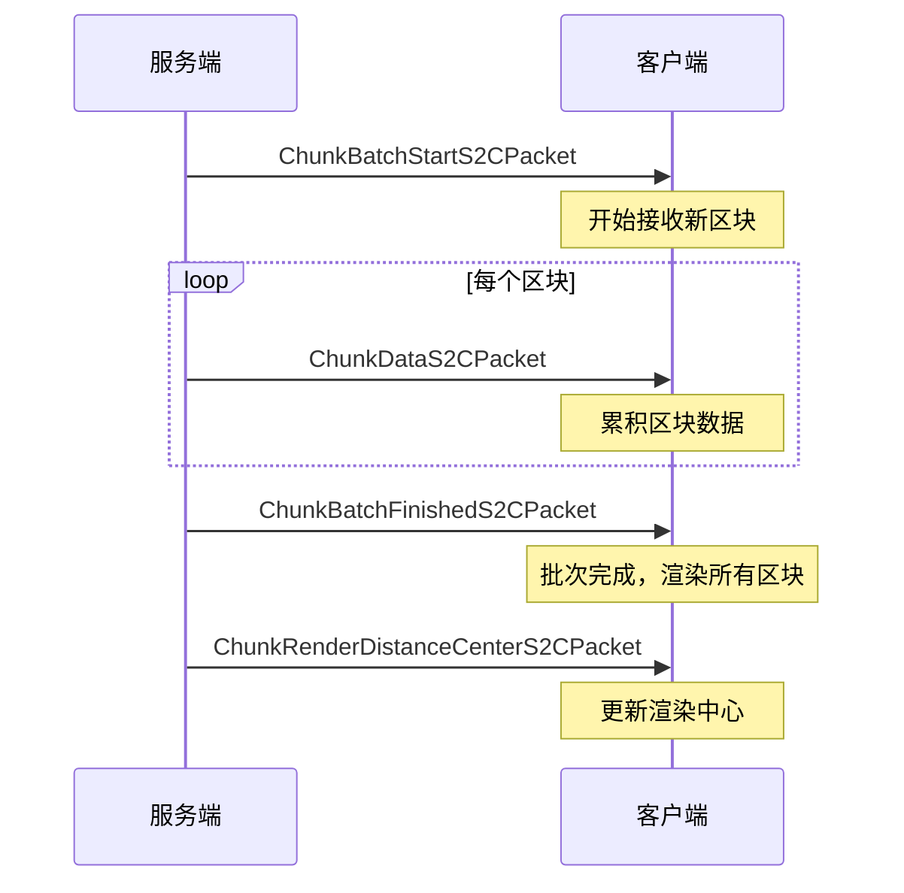

# Minecraft 1.21 网络协议分析

## 目录
1. [概述](#概述)
2. [协议架构](#协议架构)
3. [数据包（Packet）系统](#数据包packet系统)
4. [网络状态（NetworkState）](#网络状态networkstate)
5. [数据包字节缓冲（PacketByteBuf）](#数据包字节缓冲packetbytebuf)
6. [数据包类型定义](#数据包类型定义)
7. [客户端数据包（Clientbound）](#客户端数据包clientbound)
8. [服务端数据包（Serverbound）](#服务端数据包serverbound)
9. [序列化机制](#序列化机制)
10. [连接握手流程](#连接握手流程)
11. [关键代码引用](#关键代码引用)

---

## 概述

Minecraft 1.21 使用基于 Netty 的网络协议进行客户端与服务端之间的通信。协议采用状态机模式组织，支持版本协商、加密、登录和游戏数据传输。

**协议特点：**
- 基于 TCP 协议
- 使用 VarInt 变长整数编码节省带宽
- 支持协议版本协商
- 状态机驱动的连接流程
- 数据包编解码器（PacketCodec）系统

---

## 协议架构

### 1.1 协议层次结构

```
┌─────────────────────────────────────────────────────────────┐
│                    Minecraft Protocol                        │
├─────────────────────────────────────────────────────────────┤
│  连接层 (Connection Layer)                                  │
│  ├── ClientConnection (Netty ChannelHandler)              │
│  ├── PacketEncoder / PacketDecoder                        │
│  └── Encryption (可选)                                     │
├─────────────────────────────────────────────────────────────┤
│  协议状态机 (Protocol State Machine)                        │
│  ├── HANDSHAKING                                          │
│  ├── STATUS                                               │
│  ├── LOGIN                                                │
│  ├── CONFIGURATION                                        │
│  └── PLAY                                                 │
├─────────────────────────────────────────────────────────────┤
│  数据包层 (Packet Layer)                                  │
│  ├── Packet<T extends PacketListener>                     │
│  ├── PacketType<T>                                        │
│  └── PacketCodec<B, T>                                    │
└─────────────────────────────────────────────────────────────┘
```

### 1.2 协议状态定义

**核心文件：** `..../source/net/minecraft/network/NetworkPhase.java`

| 状态 | 描述 | 方向 |
|------|------|------|
| HANDSHAKING | 握手阶段，协议版本协商 | 双向 |
| STATUS | 服务器状态查询（ping） | 双向 |
| LOGIN | 登录认证阶段 | 双向 |
| CONFIGURATION | 配置阶段，资源包同步 | 双向 |
| PLAY | 游戏play阶段 | 双向 |

### 1.3 握手流程

```
Client                              Server
  │                                    │
  │ ──── Handshake ──────────────────> │  (协议版本、意图)
  │                                    │
  │ [根据意图进入对应状态]              │
  │                                    │
  ├─ 意图 = STATUS ────────────────────┤
  │                                    │
  │ <──── Status Response ──────────── │  (服务器信息)
  │ ──── Ping Request ───────────────> │
  │ <──── Ping Response ───────────── │  (延迟测试)
  │                                    │
  ├─ 意图 = LOGIN ─────────────────────┤
  │                                    │
  │ ──── Login Hello ─────────────────> │  (玩家名、UUID)
  │ <──── Login Success ────────────── │  (认证成功)
  │                                    │
  ├─ 进入 CONFIGURATION ───────────────┤
  │                                    │
  │ <──── Registry Data ────────────── │  (注册表同步)
  │ <──── Resource Pack Info ───────── │  (资源包信息)
  │ ──── Resource Pack Response ─────> │
  │ ... (可能多次交换) ...              │
  │                                    │
  │ <──── Finish Configuration ─────── │
  │                                    │
  ├─ 进入 PLAY ────────────────────────┤
  │                                    │
  │ <==== 游戏数据包交换 ====>          │
  │                                    │
```

---

## 数据包（Packet）系统

### 2.1 Packet 接口

**核心文件：** `..../source/net/minecraft/network/packet/Packet.java`

```java
13:39:..../source/net/minecraft/network/packet/Packet.java
public interface Packet<T extends PacketListener> {
    
    // 获取数据包类型
    public PacketType<? extends Packet<T>> getPacketId();
    
    // 应用数据包到监听器
    public void apply(T var1);
    
    // 是否允许跳过写入错误
    default public boolean isWritingErrorSkippable() {
        return false;
    }
    
    // 是否触发网络状态转换
    default public boolean transitionsNetworkState() {
        return false;
    }
}
```

### 2.2 PacketType 定义

```java
// 数据包类型定义了数据包的ID和编解码器
public interface PacketType<T extends Packet<?>> {
    
    // 数据包ID (状态内唯一)
    int getId();
    
    // 方向 (客户端bound 或 服务端bound)
    NetworkSide getNetworkSide();
    
    // 数据包编解码器
    PacketCodec<ByteBuf, T> getCodec();
}
```

### 2.3 数据包分类

```
Packet<T>
├── C2S (Client to Server)
│   ├── HandshakeC2SPacket
│   ├── LoginHelloC2SPacket
│   ├── PlayC2SPacket
│   └── ...
│
└── S2C (Server to Client)
    ├── LoginSuccessS2CPacket
    ├── PlayS2CPacket
    └── ...
```

---

## 网络状态（NetworkState）

### 3.1 NetworkState 接口

**核心文件：** `..../source/net/minecraft/network/NetworkState.java`

```java
18:43:..../source/net/minecraft/network/NetworkState.java
public interface NetworkState<T extends PacketListener> {
    
    // 获取协议阶段
    public NetworkPhase id();
    
    // 获取网络方向
    public NetworkSide side();
    
    // 获取编解码器
    public PacketCodec<ByteBuf, Packet<? super T>> codec();
    
    // 获取包处理器
    @Nullable
    public PacketBundleHandler bundleHandler();
}
```

### 3.2 NetworkPhase 枚举

```java
public enum NetworkPhase {
    HANDSHAKING,
    PLAY,
    STATUS,
    LOGIN,
    CONFIGURATION;
    
    // 转换为数据包类型集合
    public PacketTypeHandler handler() { ... }
}
```

---

## 数据包字节缓冲（PacketByteBuf）

### 4.1 概述

PacketByteBuf 是 Minecraft 对 Netty ByteBuf 的扩展，提供游戏特定的序列化/反序列化方法。

**核心文件：** `..../source/net/minecraft/network/PacketByteBuf.java`

```java
192:1373:..../source/net/minecraft/network/PacketByteBuf.java
public class PacketByteBuf
extends ByteBuf {
    
    private final ByteBuf parent;
    
    // 最大NBT读取大小
    public static final int MAX_READ_NBT_SIZE = 0x200000; // 2MB
    
    // 最大字符串长度
    public static final short DEFAULT_MAX_STRING_LENGTH = Short.MAX_VALUE;
    
    // 最大文本长度
    public static final int MAX_TEXT_LENGTH = 262144; // 256KB
}
```

### 4.2 常用读写方法

| 类型 | 读方法 | 写方法 |
|------|--------|--------|
| VarInt | `readVarInt()` | `writeVarInt(int)` |
| VarLong | `readVarLong()` | `writeVarLong(long)` |
| String | `readString()` | `writeString(String)` |
| Identifier | `readIdentifier()` | `writeIdentifier(Identifier)` |
| UUID | `readUuid()` | `writeUuid(UUID)` |
| BlockPos | `readBlockPos()` | `writeBlockPos(BlockPos)` |
| NBT | `readNbt()` | `writeNbt(NbtCompound)` |
| Enum | `readEnumConstant(Class)` | `writeEnumConstant(Enum)` |
| Optional | `readOptional(Reader)` | `writeOptional(Optional, Writer)` |
| Collection | `readCollection(factory, reader)` | `writeCollection(Collection, writer)` |
| Map | `readMap(...)` | `writeMap(...)` |

### 4.3 Registry 相关方法

```java
// 读取注册表引用
RegistryEntry.Reference<T> readRegistryEntry(RegistryKey<Registry<T>> registry);

// 写入注册表引用
void writeRegistryEntry(RegistryEntry.Reference<T> entry);

// 读取注册表键
RegistryKey<T> readRegistryKey(RegistryKey<Registry<T>> registry);

// 写入注册表键
void writeRegistryKey(RegistryKey<T> key);
```

### 4.4 VarInt 编码

Minecraft 使用 VarInt（可变长度整数）来节省带宽：

```java
// VarInt 编码规则
// - 值 0-127: 1 字节
// - 值 128-16383: 2 字节
// - 值 16384-2097151: 3 字节
// - 值 2097152-268435455: 4 字节

public int readVarInt() {
    int value = 0;
    int position = 0;
    byte b;
    while ((b = readByte()) >= 0) {
        value |= (b & 0x7F) << position;
        if (position >= 21) {
            throw new RuntimeException("VarInt too large");
        }
        position += 7;
        if ((b & 0x80) == 0) break;
    }
    return value;
}
```

---

## 数据包类型定义

### 5.1 Play 阶段数据包（游戏阶段）

**C2S (客户端到服务端) - Play 阶段：**

| 数据包 | ID | 描述 |
|--------|-----|------|
| TeleportConfirmC2SPacket | 0x00 | 传送确认 |
| QueryTileEntityNbtC2SPacket | 0x06 | 查询方块实体NBT |
| SetPlayerPositionC2SPacket | 0x11 | 设置玩家位置 |
| SetPlayerPositionAndRotationC2SPacket | 0x12 | 设置位置和旋转 |
| PlayerSessionC2SPacket | 0x19 | 玩家会话 |
| PlayerAbilitiesC2SPacket | 0x1B | 玩家能力 |
| ChatMessageC2SPacket | 0x07 | 聊天消息 |
| ChatCommandSignedC2SPacket | 0x08 | 签名的聊天命令 |
| HandSwingC2SPacket | 0x2D | 手挥动 |
| UseItemOnC2SPacket | 0x2E | 使用物品在方块上 |
| UseItemC2SPacket | 0x2F | 使用物品 |
| AcknowledgeBlockChangesC2SPacket | 0x39 | 确认方块变化 |

**S2C (服务端到客户端) - Play 阶段：**

| 数据包 | ID | 描述 |
|--------|-----|------|
| SpawnEntityS2CPacket | 0x00 | 生成实体 |
| SpawnEntityS2CPacket | 0x01 | 玩家列表 |
| BlockEntityUpdateS2CPacket | 0x09 | 方块实体更新 |
| BlockChangedS2CPacket | 0x0B | 方块变化 |
| ChunkBatchFinishedS2CPacket | 0x25 | 区块批次完成 |
| ChunkBatchStartS2CPacket | 0x24 | 区块批次开始 |
| ChunkRenderDistanceCenterS2CPacket | 0x49 | 区块渲染距离中心 |
| GameEventS2CPacket | 0x1F | 游戏事件 |
| LevelParticlesS2CPacket | 0x22 | 等级粒子 |
| EntityEventS2CPacket | 0x1E | 实体事件 |
| ExplosionS2CPacket | 0x1C | 爆炸 |
| WorldEventS2CPacket | 0x23 | 世界事件 |
| WorldParticlesS2CPacket | 0x26 | 世界粒子 |

#### 5.1.1 数据包批次机制 (Chunk Batch)

Minecraft 1.19+ 引入数据包批次机制优化区块同步：

```java
// ChunkBatchStartS2CPacket - 开始区块批次
public class ChunkBatchStartS2CPacket implements Packet<ClientPlayPacketListener> {
    private final int chunkX;
    private final int chunkZ;
    private final int chunkCount;  // 预期区块数量

    public ChunkBatchStartS2CPacket(int chunkX, int chunkZ, int chunkCount) {
        this.chunkX = chunkX;
        this.chunkZ = chunkZ;
        this.chunkCount = chunkCount;
    }
}

// ChunkBatchFinishedS2CPacket - 完成区块批次
public class ChunkBatchFinishedS2CPacket implements Packet<ClientPlayPacketListener> {
    private final int chunkX;
    private final int chunkZ;
    private final int chunksLoaded;  // 实际加载的区块数

    public ChunkBatchFinishedS2CPacket(int chunkX, int chunkZ, int chunksLoaded) {
        this.chunkX = chunkX;
        this.chunkZ = chunkZ;
        this.chunksLoaded = chunksLoaded;
    }
}
```

**批次机制工作流程：**



**优化效果：**

| 优化项 | 传统模式 | 批次模式 |
|--------|---------|---------|
| 网络往返 | 每区块一次 | 多区块一批 |
| 渲染触发 | 每区块一次 | 批次完成后一次 |
| CPU 开销 | 高（频繁状态切换） | 低（批量处理） |
| 适用场景 | 小范围区块变化 | 大范围区块加载 |

### 5.2 数据包注册

```java
// PlayPackets.java 中的数据包注册
public final class PlayPackets {
    
    // 客户端bound数据包
    public static final PacketType<SpawnEntityS2CPacket> SPAWN_ENTITY = 
        PacketType.create(
            "minecraft:spawn_entity",
            0x00,
            SpawnEntityS2CPacket::new
        );
    
    public static final PacketType<PlayerListS2CPacket> PLAYER_LIST = 
        PacketType.create(
            "minecraft:player_list",
            0x01,
            PlayerListS2CPacket::new
        );
    
    // ... 更多数据包
}
```

### 5.3 自定义数据包示例

```java
// 定义数据包
public class MyCustomPacketS2C implements Packet<ClientPlayPacketListener> {
    
    private final String message;
    
    public MyCustomPacketS2C(String message) {
        this.message = message;
    }
    
    @Override
    public PacketType<? extends Packet<ClientPlayPacketListener>> getPacketId() {
        return MyPacketTypes.CUSTOM_PACKET;
    }
    
    @Override
    public void apply(ClientPlayPacketListener listener) {
        listener.onCustomPacket(this);
    }
    
    // 序列化
    public static class Codec implements PacketCodec<PacketByteBuf, MyCustomPacketS2C> {
        @Override
        public MyCustomPacketS2C decode(PacketByteBuf buf) {
            String message = buf.readString();
            return new MyCustomPacketS2C(message);
        }
        
        @Override
        public void encode(PacketByteBuf buf, MyCustomPacketS2C packet) {
            buf.writeString(packet.message);
        }
    }
}
```

---

## 序列化机制

### 6.1 PacketCodec 系统

```java
// PacketCodec 接口
public interface PacketCodec<B, T> {
    
    // 解码
    T decode(B buf);
    
    // 编码
    void encode(B buf, T value);
}

// 组合多个编解码器
public static <B, T> PacketCodec<B, T> of(
    ValueFirstEncoder<B, T> encoder,
    PacketDecoder<B, T> decoder
) { ... }

// 收集器用于列表
public static <B, T> PacketCodec<B, Collection<T>> collect(
    PacketCodec<B, T> codec
) { ... }
```

### 6.2 ItemStack 序列化

```java
// ItemStack 的网络编解码器
public static final PacketCodec<RegistryByteBuf, ItemStack> OPTIONAL_PACKET_CODEC = 
    new PacketCodec<RegistryByteBuf, ItemStack>() {
        
        @Override
        public ItemStack decode(RegistryByteBuf buf) {
            int count = buf.readVarInt();
            if (count <= 0) {
                return ItemStack.EMPTY;
            }
            RegistryEntry<Item> entry = PacketCodecs.registryEntry(RegistryKeys.ITEM)
                .decode(buf);
            ComponentChanges changes = ComponentChanges.PACKET_CODEC.decode(buf);
            return new ItemStack(entry, count, changes);
        }
        
        @Override
        public void encode(RegistryByteBuf buf, ItemStack stack) {
            if (stack.isEmpty()) {
                buf.writeVarInt(0);
                return;
            }
            buf.writeVarInt(stack.getCount());
            PacketCodecs.registryEntry(RegistryKeys.ITEM)
                .encode(buf, stack.getRegistryEntry());
            ComponentChanges.PACKET_CODEC.encode(buf, stack.getComponents().getChanges());
        }
    };
```

### 6.3 RegistryByteBuf

RegistryByteBuf 是支持注册表感知的数据包缓冲区：

```java
// RegistryByteBuf 继承 PacketByteBuf 并添加注册表功能
public class RegistryByteBuf extends PacketByteBuf {
    
    // 获取注册表管理器
    public RegistryWrapper.Impl<?> getRegistryManager();
    
    // 注册表感知的编解码操作
    public <T> void writeRegistryEntry(RegistryEntry.Reference<T> entry);
    public <T> RegistryEntry.Reference<T> readRegistryEntry(RegistryKey<Registry<T>> key);
}
```

---

## 连接握手流程

### 7.1 完整连接流程

```
┌────────────────────────────────────────────────────────────────┐
│                      连接建立流程                                 │
└────────────────────────────────────────────────────────────────┘

1. HANDSHAKING 阶段
   ┌──────────────────────────────────────┐
   │ HandshakeC2SPacket                    │
   │ ├── protocolVersion: int              │
   │ ├── serverAddress: String             │
   │ ├── serverPort: int                  │
   │ └── nextState: NetworkState (1=STATUS, 2=LOGIN)
   └──────────────────────────────────────┘
   │
   ▼
   
2a. STATUS 流程（ping）
   │
   ├─> ServerInfoS2CPacket (服务器信息)
   │     ├── description: Component (MOTD)
   │     ├── players: Players (玩家数/最大)
   │     ├── version: Version
   │     └── favicon: String (Base64 PNG)
   │
   ├─> StatusPingS2CPacket (ping测试)
   │     └── time: long
   │
   └─ 结束

2b. LOGIN 流程（加入游戏）
   │
   ├─> LoginHelloC2SPacket
   │     ├── name: String (玩家名)
   │     ├── profile: PlayerProfile (可选)
   │     └── key: PublicKey (加密用, 1.19+)
   │
   ├─ 服务端验证
   │     ├── 检查白名单
   │     ├── 验证玩家UUID
   │     └── 生成加密密钥
   │
   ├─< LoginSuccessS2CPacket
   │     ├── uuid: UUID
   │     └── name: String
   │
   ▼
   
3. CONFIGURATION 阶段
   │
   ├─< RegistryDataS2CPacket
   │     └── DynamicRegistryManager.C2S
   │
   ├─< CookieRequestS2CPacket
   │     └── key: Identifier
   │
   ├─< ResourcePackS2CPacket
   │     ├── url: String
   │     ├── hash: String
   │     ├── forced: boolean
   │     └── prompt: Component (可选)
   │
   ├─> ResourcePackS2CPacket
   │     └── status: Status (SUCCESS/DECLINED/DOWNLOADED/etc)
   │
   ├─> KnownPacksS2CPacket
   │     └── packs: List<NamespacedId>
   │
   ├─> FinishConfigurationS2CPacket
   │
   ▼
   
4. PLAY 阶段
   │
   ├─< LoginPlayS2CPacket
   │     ├── entityId: int
   │     ├── gameMode: GameMode
   │     ├── dimension: RegistryKey<World>
   │     └── ...
   │
   └─= 游戏数据包交换 = = = = = = = =
```

### 7.2 客户端登录流程

```java
// ClientLoginNetworkHandler 中的流程
public void onHello(LoginHelloC2SPacket packet) {
    // 1. 验证服务器
    // 2. 准备加密 (如果需要)
    // 3. 发送登录开始包
}

public void onGameProfile(LoginSuccessS2CPacket packet) {
    // 1. 设置游戏配置文件
    // 2. 进入 CONFIGURATION 状态
    // 3. 请求资源包
}

public void onFinished(FinishConfigurationS2CPacket packet) {
    // 1. 完成配置
    // 2. 进入 PLAY 状态
    // 3. 处理登录数据包
}
```

---

## 关键代码引用

### 8.1 创建数据包

```java
// 创建数据包实例
SpawnEntityS2CPacket packet = new SpawnEntityS2CPacket(
    entity,
    0, // yaw
    EntitySpawnS2CPacket data
);

// 发送数据包
serverPlayer.networkHandler.sendPacket(packet);
```

### 8.2 处理数据包

```java
// 服务端监听器
public class ServerPlayPacketListenerImpl implements ServerPlayPacketListener {
    
    @Override
    public void onPlayerMove(PlayerMoveC2SPacket packet) {
        PlayerEntity player = this.player;
        
        if (packet.hasPositionChanged()) {
            double x = packet.getX(world.getSpawnPos().getX());
            double y = packet.getY(world.getSpawnPos().getY());
            double z = packet.getZ(world.getSpawnPos().getZ());
            player.setPosition(x, y, z);
        }
        
        // 处理旋转
        if (packet.hasRotationChanged()) {
            float yaw = packet.getYaw();
            float pitch = packet.getPitch();
            player.setRotation(yaw, pitch);
        }
    }
}
```

### 8.3 网络状态切换

```java
// 切换到 PLAY 状态
public void switchToPlay() {
    this.connection.transitionTo(NetworkState.PLAY);
    
    // 发送登录数据包
    this.connection.send(new LoginPlayS2CPacket(...));
}
```

### 8.4 数据包ID映射

```java
// 获取数据包ID
int packetId = PlayPackets.SPAWN_ENTITY.getId();

// 发送原始数据包
connection.send(packetId, buf -> {
    buf.writeVarInt(entityId);
    buf.writeUuid(entityUuid);
    // ...
});
```

---

## 协议版本管理

### 9.1 版本常量

```java
// SharedConstants.java
public class SharedConstants {
    public static final int PROTOCOL_VERSION = 765; // 1.21
    
    // 版本历史
    // 1.20.4: 762
    // 1.20.5: 763
    // 1.20.6: 764
    // 1.21: 765
}
```

### 9.2 版本兼容性检查

```java
// 握手时版本检查
public void onHandshake(HandshakeC2SPacket packet) {
    int protocolVersion = packet.getProtocolVersion();
    
    if (protocolVersion != SharedConstants.PROTOCOL_VERSION) {
        // 发送错误或重定向
        throw new IllegalStateException(
            "Incompatible protocol: expected " + 
            SharedConstants.PROTOCOL_VERSION + 
            " got " + protocolVersion
        );
    }
}
```

---

## 架构图

```
┌─────────────────────────────────────────────────────────────────────┐
│                         Netty 框架层                                   │
├─────────────────────────────────────────────────────────────────────┤
│  NioSocketChannel                                                  │
│  ├── Pipeline                                                      │
│  │   ├── ByteToMessageDecoder (数据包解码)                          │
│  │   ├── MessageToByteEncoder (数据包编码)                          │
│  │   └── [自定义处理器...]                                          │
│  └── EventLoop                                                     │
└─────────────────────────────────────────────────────────────────────┘
                              │
                              ▼
┌─────────────────────────────────────────────────────────────────────┐
│                         Minecraft 网络层                              │
├─────────────────────────────────────────────────────────────────────┤
│  ClientConnection                                                  │
│  ├── 网络状态管理                                                    │
│  │   ├── HANDSHAKING                                                │
│  │   ├── STATUS                                                     │
│  │   ├── LOGIN                                                      │
│  │   ├── CONFIGURATION                                              │
│  │   └── PLAY                                                       │
│  │                                                                  │
│  ├── 加密管理 (1.19+)                                              │
│  │   ├── PacketEncryptor                                            │
│  │   └── PacketDecryptor                                           │
│  │                                                                  │
│  └── 数据包处理                                                     │
│      ├── PacketEncoder                                              │
│      └── PacketDecoder                                             │
└─────────────────────────────────────────────────────────────────────┘
                              │
                              ▼
┌─────────────────────────────────────────────────────────────────────┐
│                      Minecraft 数据包层                               │
├─────────────────────────────────────────────────────────────────────┤
│  Packet<T extends PacketListener>                                   │
│  ├── getPacketId(): PacketType<T>                                   │
│  └── apply(listener: T)                                             │
│                                                                       │
│  PacketType<T>                                                      │
│  ├── ID: int                                                       │
│  ├── 方向: NetworkSide                                              │
│  └── Codec: PacketCodec<ByteBuf, T>                                 │
│                                                                       │
│  PacketCodec<B, T>                                                  │
│  ├── decode(buf: B): T                                             │
│  └── encode(buf: B, value: T)                                      │
└─────────────────────────────────────────────────────────────────────┘
                              │
                              ▼
┌─────────────────────────────────────────────────────────────────────┐
│                      Minecraft 协议状态                              │
├─────────────────────────────────────────────────────────────────────┤
│  PLAY 阶段                                                         │
│  ├── 客户端 Bound (S2C)                                            │
│  │   ├── SpawnEntityS2CPacket                                      │
│  │   ├── ChunkDataS2CPacket                                        │
│  │   ├── BlockUpdateS2CPacket                                      │
│  │   └── [100+ 数据包...]                                          │
│  │                                                                  │
│  └── 服务端 Bound (C2S)                                            │
│      ├── PlayerMoveC2SPacket                                       │
│      ├── ChatMessageC2SPacket                                      │
│      ├── UseItemOnC2SPacket                                        │
│      └── [100+ 数据包...]                                          │
└─────────────────────────────────────────────────────────────────────┘
```

---

## 总结

Minecraft 1.21 的网络协议系统展现了几个关键设计：

1. **状态机驱动**：通过 NetworkState 管理连接的不同阶段
2. **编解码分离**：PacketCodec 提供灵活的序列化策略
3. **类型安全**：泛型系统确保数据包与监听器的正确匹配
4. **高效编码**：VarInt 和数据压缩减少带宽占用
5. **向后兼容**：版本号机制支持增量升级

这套系统为多人游戏提供了可靠的基础，同时也为 Mod 开发提供了扩展数据包类型的接口。
