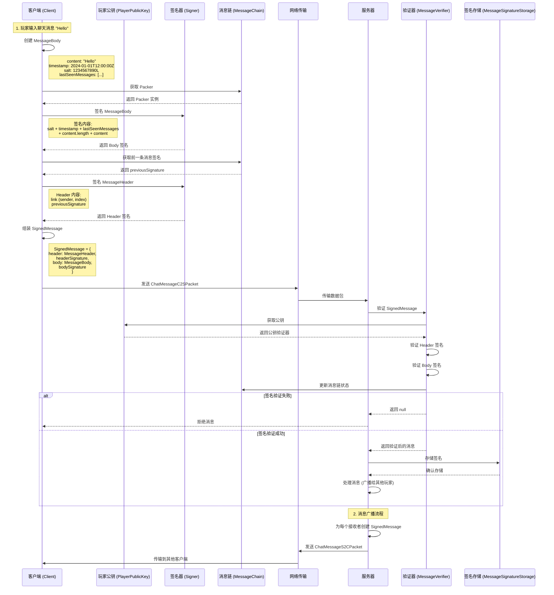
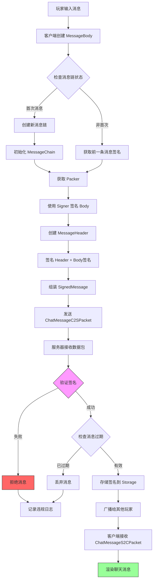
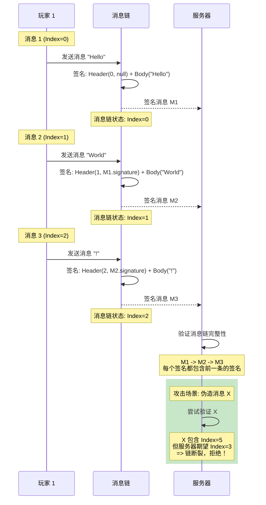
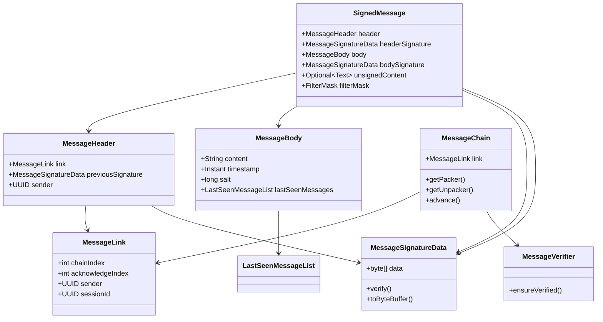

# Minecraft 1.21 聊天系统与签名机制

> 基于 Yarn 1.21+build.1 反编译源代码的聊天系统完整分析
> 版本信息: Protocol 767, World Version 3953
> 签名系统自 1.19.1 版本引入，用于防止聊天消息伪造

---

## 1. 概述 (Overview)

Minecraft 1.21 的聊天系统是游戏社交功能的核心组件，负责处理玩家之间的文字交流、命令执行、系统通知等各类消息交互。自 1.19.1 版本起，聊天系统引入了完整的消息签名机制（Chat Signing），这是 Mojang 为应对聊天伪造攻击而设计的安全方案。

### 1.1 聊天系统核心功能

```
┌─────────────────────────────────────────────────────────────────────┐
│                        聊天系统核心架构                                │
├─────────────────────────────────────────────────────────────────────┤
│                                                                     │
│  ┌───────────────────────────────────────────────────────────────┐ │
│  │                      消息来源层                                 │ │
│  ├───────────────────────────────────────────────────────────────┤ │
│  │  玩家消息 (Player Chat)     │  系统消息 (System)               │ │
│  │  命令输出 (Command)         │  聊天类型 (Chat Type)            │ │
│  │  进度通知 (Advancement)      │  死亡信息 (Death Message)        │ │
│  └───────────────────────────────────────────────────────────────┘ │
│                              │                                        │
│                              ▼                                        │
│  ┌───────────────────────────────────────────────────────────────┐ │
│  │                      签名验证层                                 │ │
│  ├───────────────────────────────────────────────────────────────┤ │
│  │  MessageVerifier (验证器)   │  MessageChain (消息链)           │ │
│  │  MessageSignatureData       │  SignedMessage                  │ │
│  │  SignatureValidator         │  PlayerPublicKey                │ │
│  └───────────────────────────────────────────────────────────────┘ │
│                              │                                        │
│                              ▼                                        │
│  ┌───────────────────────────────────────────────────────────────┐ │
│  │                      消息分发层                                 │ │
│  ├───────────────────────────────────────────────────────────────┤ │
│  │  MessageType (类型路由)      │  MessageDecorator (装饰器)      │ │
│  │  ChatHud (客户端显示)        │  过滤掩码 (Filter Mask)          │ │
│  └───────────────────────────────────────────────────────────────┘ │
│                                                                     │
└─────────────────────────────────────────────────────────────────────┘
```

### 1.2 签名系统引入背景

在 1.19 之前，任何连接到服务器的人都可以伪造任意玩家的聊天消息，这导致了：

| 问题 | 描述 | 影响 |
|------|------|------|
| 身份伪装 | 冒充其他玩家发送消息 | 社交工程攻击 |
| 社会工程 | 伪造管理员消息骗取信息 | 安全威胁 |
| 游戏内欺诈 | 伪造交易、承诺等 | 经济系统破坏 |
| 恶意骚扰 | 伪装身份进行骚扰 | 社区治理困难 |

签名系统的引入通过密码学手段确保消息确实来自声称的发送者。

### 1.3 相关包结构

```
net.minecraft.network.message/
├── SignedMessage.java           // 已签名消息记录
├── MessageBody.java             // 消息体（包含签名内容）
├── MessageHeader.java           // 消息头（链接前一条消息）
├── MessageSignatureData.java    // 签名数据
├── MessageVerifier.java         // 签名验证器
├── MessageChain.java            // 消息链处理器
├── MessageLink.java             // 消息链接
├── MessageType.java             // 消息类型
├── MessageDecorator.java       // 消息装饰器
├── LastSeenMessageList.java     // 已见消息列表
├── AcknowledgmentValidator.java // 确认验证器
├── SentMessage.java             // 发送的消息包装器
├── DecoratedContents.java       // 装饰后的内容
├── ArgumentSignatureDataMap.java // 命令参数签名映射
└── SignedCommandArguments.java  // 已签名的命令参数
```

---

## 2. 聊天签名机制 (Chat Signing Mechanism)

### 2.1 签名系统设计目标

Minecraft 的聊天签名系统需要解决以下几个核心问题：

1. **消息认证**：确保消息确实来自声称的发送者
2. **消息完整性**：确保消息在传输过程中未被篡改
3. **消息顺序**：防止消息重放攻击和乱序插入
4. **链接追溯**：通过消息链关联相邻消息
5. **隐私保护**：不暴露玩家的私钥信息

### 2.2 签名算法与密钥

聊天签名使用 **Ed25519** 签名算法，这是一种现代的椭圆曲线签名算法，具有以下特点：

| 特性 | 说明 |
|------|------|
| 签名速度 | 高效，适合频繁签名的场景 |
| 密钥大小 | 公钥 32 字节，签名 64 字节 |
| 安全性 | 128 位安全级别，抗量子计算能力有限 |
| 曲线 | Edwards 曲线 (Ed25519) |

### 2.3 玩家公钥管理

```net/minecraft/network/encryption/PlayerPublicKey.java
public class PlayerPublicKey {
    // 公钥有效期
    private final Instant expiresAt;
    
    // Ed25519 公钥
    private final byte[] publicKey;
    
    // 密钥验证数据
    private final byte[] keySignature;
    
    // Mojang 签名服务器验证
    private final SignatureVerifier verifier;
    
    // 检查密钥是否过期
    public boolean isExpired() {
        return Instant.now().isAfter(this.expiresAt);
    }
    
    // 获取签名验证器
    public SignatureVerifier getVerifier() {
        return this.verifier;
    }
    
    // 验证消息签名
    public boolean verifyMessage(byte[] message, byte[] signature) {
        return this.verifier.verify(message, signature);
    }
}
```

玩家公钥在登录时由 Mojang 认证服务器颁发，有效期通常为 7 天。服务器需要在公钥过期前要求玩家更新。

### 2.4 签名内容组成

一个完整的聊天消息签名包含以下部分：

```
┌─────────────────────────────────────────────────────────────────────┐
│                      SignedMessage 完整结构                           │
├─────────────────────────────────────────────────────────────────────┤
│                                                                     │
│  ┌─────────────────────────────────────────────────────────────┐   │
│  │                    SignedMessageHeader                        │   │
│  │  ┌─────────────────────────────────────────────────────────┐ │   │
│  │  │  MessageHeader:                                          │ │   │
│  │  │    - sender: UUID         (发送者标识)                    │ │   │
│  │  │    - index: int           (消息链索引)                    │ │   │
│  │  │    - previousSignature: byte[] (前一条消息签名)          │ │   │
│  │  └─────────────────────────────────────────────────────────┘ │   │
│  │  ┌─────────────────────────────────────────────────────────┐ │   │
│  │  │  headerSignature: MessageSignatureData                  │ │   │
│  │  │    - 对 Header + 前一条消息签名的签名                     │ │   │
│  │  └─────────────────────────────────────────────────────────┘ │   │
│  └─────────────────────────────────────────────────────────────┘   │
│                              │                                        │
│  ┌─────────────────────────────────────────────────────────────┐   │
│  │                    SignedMessageBody                         │   │
│  │  ┌─────────────────────────────────────────────────────────┐ │   │
│  │  │  MessageBody:                                            │ │   │
│  │  │    - content: String        (实际消息内容)                │ │   │
│  │  │    - timestamp: Instant    (发送时间戳)                  │ │   │
│  │  │    - salt: long            (签名盐值)                    │ │   │
│  │  │    - lastSeenMessages: LastSeenMessageList              │ │   │
│  │  │                           (客户端已见消息列表)             │ │   │
│  │  └─────────────────────────────────────────────────────────┘ │   │
│  └─────────────────────────────────────────────────────────────┘   │
│                              │                                        │
│  ┌─────────────────────────────────────────────────────────────┐   │
│  │                    附加信息                                    │   │
│  │    - unsignedContent: Optional<Text>   (可选未签名内容)       │   │
│  │    - filterMask: FilterMask            (内容过滤信息)         │   │
│  └─────────────────────────────────────────────────────────────┘   │
│                                                                     │
└─────────────────────────────────────────────────────────────────────┘
```

---

## 3. 核心类结构 (Core Classes)

### 3.1 MessageBody - 消息体

`MessageBody` 是消息签名的核心内容部分，包含消息的实际文本和时间信息。

```net/minecraft/network/message/MessageBody.java
public record MessageBody(
    String content,
    Instant timestamp,
    long salt,
    LastSeenMessageList lastSeenMessages
) {
    // 内容最大长度
    public static final int MAX_CONTENT_LENGTH = 256;
    
    // 创建无签名消息体
    public static MessageBody ofUnsigned(String content) {
        return new MessageBody(
            content,
            Instant.now(),
            ThreadLocalRandom.current().nextLong(),
            LastSeenMessageList.EMPTY
        );
    }
    
    // 签名更新 - 用于计算签名
    public void update(SignatureUpdater updater) throws SignatureException {
        updater.addByte(RegistryFixedBytes.ID);
        updater.addLong(this.salt);
        updater.addInstant(this.timestamp);
        updater.addVarInt(this.lastSeenMessages.size());
        for (LastSeenMessageList.Entry entry : this.lastSeenMessages) {
            updater.addBytes(entry.signatureData().toByteBuffer());
        }
        updater.addInt(this.content.length());
        updater.addUtf(this.content);
    }
    
    // 序列化为网络传输格式
    public Serialized toSerialized(MessageSignatureStorage storage) {
        return new Serialized(/* ... */);
    }
    
    public record Serialized(
        String content,
        long salt,
        Instant timestamp,
        List<byte[]> lastSeenSignatures
    ) {
        // 网络序列化实现
    }
}
```

**字段说明：**

| 字段 | 类型 | 说明 |
|------|------|------|
| `content` | String | 消息文本内容，最多 256 字符 |
| `timestamp` | Instant | 消息创建时间，用于防重放 |
| `salt` | long | 随机盐值，防止彩虹表攻击 |
| `lastSeenMessages` | LastSeenMessageList | 客户端已确认收到的消息列表 |

### 3.2 MessageSignatureData - 签名数据

`MessageSignatureData` 存储实际的加密签名字节。

```net/minecraft/network/message/MessageSignatureData.java
public record MessageSignatureData(byte[] data) {
    // 最大签名数据大小
    public static final int SIZE = 256;
    
    // 数据包序列化
    public static void write(PacketByteBuf buf, MessageSignatureData signature) {
        buf.writeBytes(signature.data());
    }
    
    public static MessageSignatureData fromBuf(PacketByteBuf buf) {
        byte[] data = new byte[SIZE];
        buf.readBytes(data);
        return new MessageSignatureData(data);
    }
    
    // 转换为字节缓冲区
    public ByteBuffer toByteBuffer() {
        return ByteBuffer.wrap(this.data).asReadOnlyBuffer();
    }
    
    // 验证签名
    public boolean verify(SignatureVerifier verifier, SignatureUpdatable updatable) {
        return verifier.verify(this, updatable);
    }
    
    // 索引化签名 - 用于存储
    public Indexed pack(MessageSignatureStorage storage) {
        return new Indexed(/* 存储索引计算 */);
    }
    
    // 索引化签名记录
    public static record Indexed(
        int index,
        MessageSignatureData signature
    ) implements Comparable<Indexed> {
        // 存储和比较实现
    }
}
```

### 3.3 MessageChain - 消息链

消息链是签名的核心创新，通过链接相邻消息防止插入攻击。

```net/minecraft/network/message/MessageChain.java
public class MessageChain {
    // 消息链接
    private MessageLink link;
    
    // 最后时间戳
    private Instant lastTimestamp;
    
    public MessageChain(UUID sender, UUID sessionId) {
        this.link = MessageLink.of(0, 0, sender, sessionId);
        this.lastTimestamp = Instant.now();
    }
    
    // 获取打包器 - 客户端签名时使用
    public Packer getPacker(Signer signer) {
        return (message, previousSignature) -> {
            // 创建消息头
            MessageHeader header = new MessageHeader(
                this.link,
                previousSignature
            );
            
            // 对 Header 和 Body 分别签名
            byte[] headerSignature = signer.sign(header);
            byte[] bodySignature = signer.sign(message.body());
            
            return new MessageSignatureData(/* 组合签名 */);
        };
    }
    
    // 获取解包器 - 服务器验证时使用
    public Unpacker getUnpacker(PlayerPublicKey publicKey) {
        return (signedMessage, previousSignature) -> {
            // 验证消息链完整性
            if (!verifyChain(signedMessage, previousSignature)) {
                throw new MessageChainException("Chain broken");
            }
            
            // 更新链状态
            this.link = this.link.next(signedMessage.signature());
            this.lastTimestamp = signedMessage.body().timestamp();
            
            return signedMessage;
        };
    }
    
    // 消息链异常
    public static class MessageChainException extends RuntimeException {
        public MessageChainException(String message) {
            super(message);
        }
    }
    
    // 打包器接口
    @FunctionalInterface
    public interface Packer {
        MessageSignatureData pack(MessageBody body, byte[] previousSignature);
    }
    
    // 解包器接口
    @FunctionalInterface
    public interface Unpacker {
        SignedMessage unpack(SignedMessage message, byte[] previousSignature);
    }
}
```

### 3.4 MessageLink - 消息链接

`MessageLink` 表示消息链中的单个链接。

```net/minecraft/network/message/MessageLink.java
public record MessageLink(
    int chainIndex,      // 链中位置
    int acknowledgeIndex, // 已确认位置
    UUID sender,         // 发送者 UUID
    UUID sessionId       // 会话 ID
) {
    // 创建初始链接
    public static MessageLink of(int chainIndex, int acknowledgeIndex, 
                                  UUID sender, UUID sessionId) {
        return new MessageLink(chainIndex, acknowledgeIndex, sender, sessionId);
    }
    
    // 创建下一条消息的链接
    public MessageLink next(MessageSignatureData signature) {
        return new MessageLink(
            this.chainIndex + 1,
            this.acknowledgeIndex,
            this.sender,
            this.sessionId
        );
    }
    
    // 序列化用于签名计算
    public byte[] toBytes() {
        ByteBuffer buffer = ByteBuffer.allocate(48);
        buffer.putLong(chainIndex);
        buffer.putLong(acknowledgeIndex);
        buffer.putLong(sender.getMostSignificantBits());
        buffer.putLong(sender.getLeastSignificantBits());
        buffer.putLong(sessionId.getMostSignificantBits());
        buffer.putLong(sessionId.getLeastSignificantBits());
        return buffer.array();
    }
}
```

### 3.5 MessageVerifier - 签名验证器

`MessageVerifier` 是服务器端验证消息签名的核心接口。

```net/minecraft/network/message/MessageVerifier.java
@FunctionalInterface
public interface MessageVerifier {
    Logger LOGGER = LoggerFactory.getLogger(MessageVerifier.class);
    
    // 无签名验证器
    MessageVerifier NO_SIGNATURE = message -> message;
    
    // 未验证消息验证器
    MessageVerifier UNVERIFIED = message -> message;
    
    // 确保消息已验证
    @Nullable
    SignedMessage ensureVerified(@Nullable SignedMessage message);
    
    // 验证器实现
    class Impl implements MessageVerifier {
        private final PlayerPublicKey.Wrapper publicKey;
        private final SignatureVerifier verifier;
        private final MessageChain chain;
        private final Duration messageExpiry;
        
        public Impl(PlayerPublicKey.Wrapper publicKey, 
                    SignatureVerifier verifier,
                    MessageChain chain,
                    Duration messageExpiry) {
            this.publicKey = publicKey;
            this.verifier = verifier;
            this.chain = chain;
            this.messageExpiry = messageExpiry;
        }
        
        @Override
        public SignedMessage ensureVerified(SignedMessage message) {
            // 检查公钥是否有效
            if (!publicKey.validate(message.header())) {
                LOGGER.warn("Invalid public key for message from {}", 
                    message.header().sender());
                return null;
            }
            
            // 验证时间戳不过期
            Instant timestamp = message.body().timestamp();
            if (Duration.between(timestamp, Instant.now()).abs().compareTo(messageExpiry) > 0) {
                LOGGER.warn("Message timestamp expired from {}", 
                    message.header().sender());
                return null;
            }
            
            // 验证签名
            if (!verifySignatures(message)) {
                LOGGER.warn("Signature verification failed from {}", 
                    message.header().sender());
                return null;
            }
            
            // 更新消息链
            chain.getUnpacker(publicKey.key()).unpack(message, 
                message.header().previousSignature());
            
            return message;
        }
        
        private boolean verifySignatures(SignedMessage message) {
            // 验证 Header 签名
            if (!message.headerSignature().verify(
                    verifier, message.header())) {
                return false;
            }
            
            // 验证 Body 签名
            if (!message.bodySignature().verify(
                    verifier, message.body())) {
                return false;
            }
            
            return true;
        }
    }
    
    // 验证状态枚举
    enum Status {
        VALID,           // 验证通过
        INVALID_SIGNATURE, // 签名无效
        EXPIRED,         // 消息过期
        CHAIN_BROKEN,    // 消息链断裂
        KEY_INVALID,     // 公钥无效
        UNSIGNED         // 未签名
    }
}
```

### 3.6 MessageType - 消息类型

`MessageType` 定义消息如何显示和叙述给客户端。

```net/minecraft/network/message/MessageType.java
public class MessageType implements FabricRegistryWrapper.InitializeCallback {
    // 消息类型注册表
    public static final DefaultedRegistry<MessageType> REGISTRY = 
        FabricRegistryBuilder.createDefaulted(
            RegistryKeys.MESSAGE_TYPE, 
            new Identifier("chat", "type")
        ).buildAndRegister();
    
    // 预定义消息类型
    public static final MessageType CHAT = /* ... */;
    public static final MessageType SAY_COMMAND = /* ... */;
    public static final MessageType EMOTE_COMMAND = /* ... */;
    public static final MessageType RAW = /* ... */;
    public static final MessageType SYSTEM = /* ... */;
    public static final MessageType GAME_INFO = /* ... */;
    
    // 消息参数记录
    public record Parameters(
        Identifier chatType,
        Text name,
        Text target,
        SignedMessage message
    ) {
        // 装饰参数
        public Serialized serializeForServer(UUID sender) {
            // 返回用于网络传输的序列化格式
        }
    }
    
    // 序列化格式
    public record Serialized(
        int index,
        Component senderName,
        Component targetName,
        Component content,
        Instant timestamp,
        boolean signed,
        byte[] signature
    ) {
        // 网络序列化实现
    }
}
```

---

## 4. 消息签名流程 (Message Signing Flow)

### 4.1 完整签名流程图



### 4.2 客户端签名过程

```net/minecraft/network/chat/client/ClientChatNode.java
public class ClientChatNode {
    private final Signer signer;
    private final MessageChain chain;
    private final ClientPlayNetworkHandler handler;
    
    // 发送聊天消息
    public void sendChatMessage(String content) {
        // 创建消息体
        MessageBody body = new MessageBody(
            content,
            Instant.now(),
            ThreadLocalRandom.current().nextLong(),
            getLastSeenMessages()
        );
        
        // 获取签名
        MessageSignatureData bodySignature = signBody(body);
        
        // 获取前一条消息签名
        MessageSignatureData previousSignature = chain.getLastSignature();
        
        // 创建消息头
        MessageHeader header = new MessageHeader(
            chain.getCurrentLink(),
            previousSignature
        );
        
        // 签名消息头
        MessageSignatureData headerSignature = signHeader(header, bodySignature);
        
        // 组装完整签名消息
        SignedMessage signedMessage = new SignedMessage(
            header,
            headerSignature,
            body,
            bodySignature,
            Optional.empty(),
            FilterMask.PASS_THROUGH
        );
        
        // 发送到服务器
        ChatMessageC2SPacket packet = new ChatMessageC2SPacket(signedMessage);
        handler.send(packet);
        
        // 更新消息链
        chain.advance(bodySignature);
    }
    
    private MessageSignatureData signBody(MessageBody body) {
        return signer.sign(updater -> {
            updater.addByte(RegistryFixedBytes.MESSAGE_BODY_ID);
            updater.addLong(body.salt());
            updater.addInstant(body.timestamp());
            updater.addVarInt(body.lastSeenMessages().size());
            // ... 更多字段
            updater.addInt(body.content().length());
            updater.addUtf(body.content());
        });
    }
    
    private MessageSignatureData signHeader(MessageHeader header, 
                                            MessageSignatureData bodySignature) {
        return signer.sign(updater -> {
            updater.addByte(RegistryFixedBytes.MESSAGE_HEADER_ID);
            updater.addBytes(header.toBytes());
            updater.addBytes(bodySignature.toByteBuffer());
        });
    }
    
    private LastSeenMessageList getLastSeenMessages() {
        // 获取客户端已确认的消息列表
        return handler.getMessageTracker().getAcknowledgedMessages();
    }
}
```

### 4.3 服务器验证过程

```net/minecraft/server/network/ServerChatNode.java
public class ServerChatNode {
    private final MessageVerifier verifier;
    private final PlayerPublicKey.Wrapper publicKey;
    private final MessageSignatureStorage storage;
    
    // 处理聊天消息
    public void onChatMessage(ServerPlayerEntity sender, 
                              ChatMessageC2SPacket packet) {
        SignedMessage signedMessage = packet.signedMessage();
        
        // 验证签名
        SignedMessage verified = verifier.ensureVerified(signedMessage);
        
        if (verified == null) {
            // 签名验证失败
            handleInvalidSignature(sender);
            return;
        }
        
        // 检查消息内容
        String content = verified.body().content();
        if (content.length() > MessageBody.MAX_CONTENT_LENGTH) {
            handleMessageTooLong(sender);
            return;
        }
        
        // 检查时间戳
        if (isTimestampSuspicious(verified.body().timestamp())) {
            handleSuspiciousTimestamp(sender);
            return;
        }
        
        // 存储签名
        storage.add(verified.signature());
        
        // 广播消息
        broadcastMessage(sender, verified);
    }
    
    private void broadcastMessage(ServerPlayerEntity sender, 
                                  SignedMessage message) {
        // 获取消息类型
        MessageType type = MessageType.CHAT;
        
        // 为每个在线玩家准备消息
        for (ServerPlayerEntity recipient : server.getPlayerManager()) {
            // 检查是否应该发送签名
            boolean canSeeSignature = recipient.getPublicKey().isPresent()
                && recipient.shouldReceiveMessages();
            
            SignedMessage preparedMessage = prepareForRecipient(
                message, recipient, canSeeSignature);
            
            // 发送消息
            ChatMessageS2CPacket packet = new ChatMessageS2CPacket(
                type,
                message.header().sender(),
                preparedMessage
            );
            
            recipient.networkHandler.sendPacket(packet);
        }
    }
}
```

### 4.4 签名过期与消息链重置

```net/minecraft/network/message/MessageSignatureStorage.java
public class MessageSignatureStorage {
    // 签名环缓冲
    private final Object2ObjectLinkedOpenHashMap<UUID, 
        LinkedList<MessageSignatureData.Indexed>> signatures = 
        new Object2ObjectLinkedOpenHashMap<>();
    
    // 最大存储数量
    private static final int MAX_SIGNATURES = 64;
    
    // 最大过期时间
    private static final Duration MAX_MESSAGE_AGE = Duration.ofMinutes(5);
    
    public void add(UUID senderId, MessageSignatureData signature) {
        // 获取或创建签名列表
        LinkedList<MessageSignatureData.Indexed> list = 
            signatures.computeIfAbsent(senderId, k -> new LinkedList<>());
        
        // 添加新签名
        int index = list.isEmpty() ? 0 : list.getLast().index() + 1;
        list.add(new MessageSignatureData.Indexed(index, signature));
        
        // 清理过期签名
        Instant cutoff = Instant.now().minus(MAX_MESSAGE_AGE);
        while (!list.isEmpty() && isExpired(list.peekFirst(), cutoff)) {
            list.pollFirst();
        }
        
        // 限制列表大小
        while (list.size() > MAX_SIGNATURES) {
            list.pollFirst();
        }
    }
    
    public Optional<MessageSignatureData> get(UUID senderId, int index) {
        LinkedList<MessageSignatureData.Indexed> list = signatures.get(senderId);
        if (list == null) return Optional.empty();
        
        return list.stream()
            .filter(s -> s.index() == index)
            .map(MessageSignatureData.Indexed::signature)
            .findFirst();
    }
    
    private boolean isExpired(MessageSignatureData.Indexed indexed, 
                             Instant cutoff) {
        // 检查签名是否过期
        // 需要从外部时间戳存储中查询
        return false; // 简化实现
    }
}
```

---

## 5. 签名验证 (Signature Verification)

### 5.1 验证流程详解

```net/minecraft/network/encryption/SignatureVerifier.java
public class SignatureVerifier {
    // Ed25519 签名实例
    private final EdDSASigner signer;
    
    public SignatureVerifier(byte[] publicKey) {
        this.signer = new EdDSASigner();
        this.signer.init(false, new Ed25519PublicKeyParameters(publicKey, 0));
    }
    
    public boolean verify(SignatureUpdatable updatable) {
        try {
            updatable.update(this.signer);
            return this.signer.verifySignature();
        } catch (SignatureException e) {
            return false;
        }
    }
    
    public boolean verify(MessageSignatureData signature, 
                          SignatureUpdatable updatable) {
        try {
            updatable.update(this.signer);
            return this.signer.verify(signature.data());
        } catch (SignatureException e) {
            return false;
        }
    }
}
```

### 5.2 公钥验证

```net/minecraft/network/encryption/PlayerPublicKey.java
public class PlayerPublicKey {
    public static final Duration MAX_VALID_DURATION = Duration.ofDays(7);
    
    // 公钥包装器
    public static class Wrapper {
        private final PlayerPublicKey data;
        private final SignatureVerifier verifier;
        
        public Wrapper(PlayerPublicKey data) {
            this.data = data;
            this.verifier = new SignatureVerifier(data.publicKey());
        }
        
        public boolean validate(MessageHeader header) {
            // 验证发送者 UUID 匹配
            if (!header.sender().equals(data.profileId())) {
                return false;
            }
            
            // 验证时间戳在有效期内
            if (Instant.now().isAfter(data.expiresAt())) {
                return false;
            }
            
            return true;
        }
        
        public SignatureVerifier getVerifier() {
            return verifier;
        }
        
        public PlayerPublicKey data() {
            return data;
        }
    }
    
    // 过期检查
    public boolean isExpired() {
        return Instant.now().isAfter(this.expiresAt);
    }
    
    // 即将过期检查 (提前24小时)
    public boolean isExpiringSoon() {
        Duration remaining = Duration.between(Instant.now(), this.expiresAt);
        return remaining.compareTo(Duration.ofHours(24)) < 0;
    }
}
```

### 5.3 验证失败处理

```net/minecraft/server/network/ServerLoginPacketHandler.java
public class ServerLoginPacketHandler {
    // 验证失败原因
    public enum VerifyResult {
        SUCCESS,
        INVALID_PUBLIC_KEY,
        PUBLIC_KEY_EXPIRED,
        INVALID_SIGNATURE,
        SIGNATURE_MISSING,
        CHAIN_BROKEN,
        MESSAGE_EXPIRED,
        RATE_LIMITED
    }
    
    // 处理验证结果
    public void handleVerificationResult(VerifyResult result, 
                                         ServerPlayerEntity player) {
        switch (result) {
            case SUCCESS:
                // 允许消息通过
                break;
                
            case INVALID_PUBLIC_KEY:
            case PUBLIC_KEY_EXPIRED:
                disconnect(player, "Invalid public key");
                break;
                
            case INVALID_SIGNATURE:
                // 记录违规但不立即断开
                logSuspiciousActivity(player, "Invalid signature");
                // 可以选择临时禁止发送签名消息
                break;
                
            case SIGNATURE_MISSING:
                // 某些服务器可能要求签名
                if (server.requiresSecureChat()) {
                    disconnect(player, "Secure chat required");
                }
                break;
                
            case CHAIN_BROKEN:
                logSuspiciousActivity(player, "Message chain broken");
                break;
                
            case MESSAGE_EXPIRED:
                // 消息过期，静默丢弃
                break;
                
            case RATE_LIMITED:
                // 限流处理
                applyRateLimit(player);
                break;
        }
    }
}
```

### 5.4 安全最佳实践

```java
// 服务器端安全配置
public class ServerChatConfig {
    // 是否强制要求签名
    private final boolean requireSignedMessages;
    
    // 消息最大存活时间
    private final Duration messageExpiry;
    
    // 最大消息链断裂容忍度
    private final int maxChainBreakTolerance;
    
    // 公钥刷新宽限期
    private final Duration keyRefreshGracePeriod;
    
    // 验证设置
    public VerificationSettings createVerificationSettings() {
        return new VerificationSettings(
            this.requireSignedMessages,
            this.messageExpiry,
            this.maxChainBreakTolerance
        );
    }
}
```

---

## 6. 消息类型 (Message Types)

### 6.1 消息类型分类

Minecraft 定义了多种消息类型，每种类型有不同的显示和处理方式：

| 消息类型 | ID | 用途 | 签名要求 |
|----------|-----|------|----------|
| `chat` | 0 | 玩家聊天消息 | 必须 |
| `say_command` | 1 | `/say` 命令输出 | 必须 |
| `emote_command` | 2 | `/me` 命令输出 | 必须 |
| `raw` | 3 | 原始文本消息 | 可选 |
| `system` | 4 | 系统通知 | 不适用 |
| `game_info` | 5 | 游戏信息（如药水效果） | 不适用 |

### 6.2 消息类型定义

```net/minecraft/network/message/MessageType.java
public class MessageType {
    // 消息装饰
    public record Decoration(
        String translationKey,
        Map<String, Component> parameters
    ) {
        // 创建带参数的装饰
        public static Decoration withParameters(String key, Component... params) {
            Map<String, Component> paramMap = new HashMap<>();
            for (int i = 0; i < params.length; i++) {
                paramMap.put("arg" + i, params[i]);
            }
            return new Decoration(key, paramMap);
        }
    }
    
    // 默认装饰实现
    public static final class DefaultDecorations {
        // 聊天消息: "<%s> %s"
        public static final Decoration CHAT = Decoration.withParameters(
            "chat.type.text",
            Component.literal("sender"),
            Component.literal("content")
        );
        
        // 私聊消息: "[%s -> %s] %s"
        public static final Decoration WHISPER = Decoration.withParameters(
            "chat.type.text.narrate",
            Component.literal("sender"),
            Component.literal("receiver"),
            Component.literal("content")
        );
        
        // 告诉命令: "%s %s"
        public static final Decoration SAY = Decoration.withParameters(
            "chat.type.text",
            Component.literal("sender"),
            Component.literal("content")
        );
        
        // ME 命令: "* %s %s"
        public static final Decoration EMOTE = Decoration.withParameters(
            "chat.type.emote",
            Component.literal("sender"),
            Component.literal("content")
        );
    }
}
```

### 6.3 游戏信息消息 (GameInfo)

```net/minecraft/client/network/GameInfoInfoPacket.java
public class GameInfoInfoPacket {
    // 游戏信息消息用于显示在 HUD 上的临时信息
    // 例如：药水效果持续时间、疾跑提示等
    
    public record GameInfoMessage(
        String content,
        Duration displayTime,
        boolean replaceExisting
    ) {
        // 格式化显示
        public Text getFormattedMessage() {
            return Text.literal(content)
                .formatted(Formatting.YELLOW);
        }
    }
}
```

### 6.4 系统消息 (System Messages)

```net/minecraft/server/command/CommandManager.java
public class CommandManager {
    // 系统消息不涉及签名，用于命令执行结果的显示
    
    public static void sendSystemMessage(ServerCommandSource source, 
                                          Component message) {
        ServerPlayerEntity player = source.getPlayer();
        if (player != null) {
            player.sendMessage(message, false);
        } else {
            source.getServer().getLogger().info(message.getString());
        }
    }
    
    // 带签名的系统消息
    public static void sendSignedSystemMessage(ServerCommandSource source,
                                               SignedMessage signedMessage) {
        ServerPlayerEntity player = source.getPlayer();
        if (player != null) {
            GameEventS2CPacket packet = new GameEventS2CPacket(
                GameEvent.CHAT,
                signedMessage
            );
            player.networkHandler.sendPacket(packet);
        }
    }
}
```

---

## 7. 聊天命令集成 (Chat Command Integration)

### 7.1 命令签名概述

自 1.19.3 起，Minecraft 引入了命令参数签名机制，允许玩家执行带签名的命令参数。这使得服务器可以验证命令确实来自声称的玩家。

```net/minecraft/network/message/SignedCommandArguments.java
public interface SignedCommandArguments {
    // 空签名参数
    SignedCommandArguments EMPTY = name -> null;
    
    // 获取参数的签名消息
    @Nullable
    SignedMessage getMessage(String argumentName);
    
    // 实现类
    record Impl(
        Map<String, SignedMessage> arguments,
        Instant timestamp,
        UUID sender
    ) implements SignedCommandArguments {
        
        @Override
        public SignedMessage getMessage(String argumentName) {
            return arguments.get(argumentName);
        }
        
        // 检查参数是否有签名
        public boolean isSigned(String argumentName) {
            return arguments.containsKey(argumentName);
        }
        
        // 获取所有已签名的参数名
        public Set<String> getSignedArguments() {
            return arguments.keySet();
        }
    }
}
```

### 7.2 命令参数签名映射

```net/minecraft/network/message/ArgumentSignatureDataMap.java
public record ArgumentSignatureDataMap(
    List<Entry> entries
) {
    // 最大参数名长度
    public static final int MAX_ARGUMENT_NAME_LENGTH = 16;
    
    // 最大参数数量
    public static final int MAX_ARGUMENTS = 8;
    
    // 空签名映射
    public static final ArgumentSignatureDataMap EMPTY = 
        new ArgumentSignatureDataMap(List.of());
    
    // 参数签名条目
    public record Entry(
        String name,
        MessageSignatureData signature
    ) {
        // 序列化
        public static Entry fromBuf(PacketByteBuf buf) {
            String name = buf.readString(MAX_ARGUMENT_NAME_LENGTH);
            MessageSignatureData signature = MessageSignatureData.fromBuf(buf);
            return new Entry(name, signature);
        }
        
        public void write(PacketByteBuf buf) {
            buf.writeString(name);
            MessageSignatureData.write(buf, signature);
        }
    }
    
    // 参数签名器接口
    @FunctionalInterface
    public interface ArgumentSigner {
        ArgumentSignatureDataMap sign(Map<String, String> arguments);
    }
}
```

### 7.3 客户端命令签名

```net/minecraft/client/network/ClientCommandDispatcher.java
public class ClientCommandDispatcher {
    private final Signer signer;
    private final MessageChain commandChain;
    
    // 执行带签名的命令
    public void execute(String command) {
        // 解析命令
        CommandContext context = parse(command);
        
        // 收集可签名参数
        Map<String, String> signableArgs = collectSignableArguments(context);
        
        // 签名参数
        ArgumentSignatureDataMap signatures = signArguments(signableArgs);
        
        // 创建命令签名
        SignedCommandArguments signedArgs = new SignedCommandArguments.Impl(
            convertToMessages(signatures),
            Instant.now(),
            client.getUUID()
        );
        
        // 发送命令
        CommandExecuteC2SPacket packet = new CommandExecuteC2SPacket(
            command,
            signatures,
            Instant.now(),
            commandChain.getLastSignature()
        );
        
        networkHandler.send(packet);
    }
    
    private ArgumentSignatureDataMap signArguments(Map<String, String> args) {
        List<ArgumentSignatureDataMap.Entry> entries = new ArrayList<>();
        
        for (Map.Entry<String, String> entry : args.entrySet()) {
            // 创建参数消息
            MessageBody body = MessageBody.ofUnsigned(entry.getValue());
            
            // 签名
            MessageSignatureData signature = signer.sign(updater -> {
                updater.addByte(RegistryFixedBytes.COMMAND_ARGUMENT_ID);
                updater.addUtf(entry.getKey());
                updater.addUtf(entry.getValue());
            });
            
            entries.add(new ArgumentSignatureDataMap.Entry(
                entry.getKey(),
                signature
            ));
        }
        
        return new ArgumentSignatureDataMap(entries);
    }
    
    private Map<String, SignedMessage> convertToMessages(
            ArgumentSignatureDataMap signatures) {
        Map<String, SignedMessage> messages = new HashMap<>();
        
        for (ArgumentSignatureDataMap.Entry entry : signatures.entries()) {
            MessageBody body = MessageBody.ofUnsigned(entry.signature().toString());
            messages.put(entry.name(), new SignedMessage(/* ... */));
        }
        
        return messages;
    }
}
```

### 7.4 服务器命令验证

```net/minecraft/server/command/ServerCommandManager.java
public class ServerCommandManager {
    // 执行命令时验证签名
    public int execute(CommandContext<S.ServerCommandSource> context) {
        // 获取命令执行器
        CommandExecution execution = context.getExecution();
        
        // 检查签名
        if (execution.hasSignatures()) {
            SignedCommandArguments signatures = execution.getSignatures();
            
            for (String argName : execution.getRequiredSignedArguments()) {
                SignedMessage signedArg = signatures.getMessage(argName);
                
                if (signedArg == null) {
                    // 参数缺少签名
                    throw new CommandSyntaxException(
                        "Missing signature for argument: " + argName
                    );
                }
                
                // 验证参数签名
                if (!verifyArgumentSignature(signedArg, argName)) {
                    throw new CommandSyntaxException(
                        "Invalid signature for argument: " + argName
                    );
                }
            }
        }
        
        // 执行命令
        return execution.run();
    }
    
    private boolean verifyArgumentSignature(SignedMessage signedArg, 
                                            String argumentName) {
        // 获取发送者公钥
        PlayerPublicKey.Wrapper publicKey = getPlayerPublicKey(
            signedArg.header().sender()
        );
        
        if (publicKey == null) {
            return false;
        }
        
        // 验证签名
        return signedArg.headerSignature().verify(
            publicKey.getVerifier(),
            updatable -> {
                updatable.addByte(RegistryFixedBytes.COMMAND_ARGUMENT_ID);
                updatable.addUtf(argumentName);
                updatable.addUtf(signedArg.body().content());
            }
        );
    }
}
```

---

## 8. 源码分析 (Source Code Analysis)

### 8.1 签名更新器 (SignatureUpdatable)

```net/minecraft/network/encryption/SignatureUpdatable.java
public interface SignatureUpdatable {
    // 签名更新器函数式接口
    void update(SignatureUpdater updater) throws SignatureException;
    
    // 签名更新器
    interface SignatureUpdater {
        void addByte(byte b) throws SignatureException;
        void addBytes(ByteBuffer bytes) throws SignatureException;
        void addBytes(byte[] bytes) throws SignatureException;
        void addLong(long l) throws SignatureException;
        void addInt(int i) throws SignatureException;
        void addVarInt(int i) throws SignatureException;
        void addUtf(String str) throws SignatureException;
        void addInstant(Instant instant) throws SignatureException;
        void addUUID(UUID uuid) throws SignatureException;
    }
    
    // 消息体的签名更新实现
    class MessageBodyUpdater implements SignatureUpdatable {
        private final MessageBody body;
        
        public MessageBodyUpdater(MessageBody body) {
            this.body = body;
        }
        
        @Override
        public void update(SignatureUpdater updater) throws SignatureException {
            // 固定字节标识
            updater.addByte((byte) 0x00); // MESSAGE_BODY_TYPE
            
            // 盐值
            updater.addLong(body.salt());
            
            // 时间戳
            updater.addInstant(body.timestamp());
            
            // 已见消息列表
            updater.addVarInt(body.lastSeenMessages().size());
            for (LastSeenMessageList.Entry entry : body.lastSeenMessages()) {
                updater.addBytes(entry.signatureData().toByteBuffer());
            }
            
            // 内容长度和内容
            updater.addInt(body.content().length());
            updater.addUtf(body.content());
        }
    }
    
    // 消息头的签名更新实现
    class MessageHeaderUpdater implements SignatureUpdatable {
        private final MessageHeader header;
        private final MessageSignatureData bodySignature;
        
        @Override
        public void update(SignatureUpdater updater) throws SignatureException {
            // 固定字节标识
            updater.addByte((byte) 0x01); // MESSAGE_HEADER_TYPE
            
            // 链接信息
            updater.addBytes(header.link().toBytes());
            
            // 前一条消息签名
            updater.addBytes(header.previousSignature().toByteBuffer());
            
            // 消息体签名
            updater.addBytes(bodySignature.toByteBuffer());
        }
    }
}
```

### 8.2 签名者 (Signer)

```net/minecraft/network/encryption/Signer.java
public interface Signer {
    // 使用 Ed25519 签名
    MessageSignatureData sign(SignatureUpdatable updatable);
    
    // Ed25519 签名实现
    class Ed25519Signer implements Signer {
        private final EdDSAPrivateKeyParameters privateKey;
        private final EdDSASigner signer;
        
        public Ed25519Signer(byte[] privateKeyBytes) {
            this.privateKey = new EdDSAPrivateKeyParameters(privateKeyBytes, 0);
            this.signer = new EdDSASigner();
            this.signer.init(true, this.privateKey);
        }
        
        @Override
        public MessageSignatureData sign(SignatureUpdatable updatable) {
            try {
                updatable.update(signer);
                byte[] signature = signer.generateSignature();
                return new MessageSignatureData(signature);
            } catch (SignatureException e) {
                throw new RuntimeException("Failed to sign message", e);
            }
        }
    }
}
```

### 8.3 已见消息列表 (LastSeenMessageList)

```net/minecraft/network/message/LastSeenMessageList.java
public class LastSeenMessageList {
    // 已见消息条目
    public record Entry(
        UUID profileId,
        MessageSignatureData signatureData
    ) {
        public static Entry fromBuf(PacketByteBuf buf) {
            UUID profileId = buf.readUUID();
            MessageSignatureData signature = MessageSignatureData.fromBuf(buf);
            return new Entry(profileId, signature);
        }
        
        public void write(PacketByteBuf buf) {
            buf.writeUUID(profileId);
            MessageSignatureData.write(buf, signatureData);
        }
    }
    
    // 空列表
    public static final LastSeenMessageList EMPTY = 
        new LastSeenMessageList(List.of());
    
    // 列表内容
    private final List<Entry> entries;
    
    // 确认记录
    public record Acknowledgment(
        List<Entry> entries
    ) {
        public static Acknowledgment fromBuf(PacketByteBuf buf) {
            int size = buf.readVarInt();
            List<Entry> entries = new ArrayList<>(size);
            for (int i = 0; i < size; i++) {
                entries.add(Entry.fromBuf(buf));
            }
            return new Acknowledgment(entries);
        }
        
        public void write(PacketByteBuf buf) {
            buf.writeVarInt(entries.size());
            for (Entry entry : entries) {
                entry.write(buf);
            }
        }
    }
    
    // 收集器
    public static class Collector {
        private final List<Entry> entries = new ArrayList<>();
        
        public void add(UUID profileId, MessageSignatureData signature) {
            entries.add(new Entry(profileId, signature));
        }
        
        public LastSeenMessageList collect() {
            return new LastSeenMessageList(List.copyOf(entries));
        }
    }
}
```

### 8.4 消息装饰器 (MessageDecorator)

```net/minecraft/network/message/MessageDecorator.java
@FunctionalInterface
public interface MessageDecorator {
    // 装饰聊天消息
    DecorateResult decorate(ServerCommandSource source, 
                           SignedMessage message);
    
    // 装饰结果
    class DecorateResult {
        private final SignedMessage signedMessage;
        private final Optional<Text> unsignedContent;
        private final FilterMask filterMask;
        
        public DecorateResult(SignedMessage signedMessage,
                             Optional<Text> unsignedContent,
                             FilterMask filterMask) {
            this.signedMessage = signedMessage;
            this.unsignedContent = unsignedContent;
            this.filterMask = filterMask;
        }
        
        // 创建无装饰结果
        public static DecorateResult passthrough(SignedMessage message) {
            return new DecorateResult(message, Optional.empty(), 
                FilterMask.PASS_THROUGH);
        }
    }
    
    // 默认装饰器
    class DefaultDecorator implements MessageDecorator {
        @Override
        public DecorateResult decorate(ServerCommandSource source,
                                       SignedMessage message) {
            // 默认不修改消息，直接传递
            return DecorateResult.passthrough(message);
        }
    }
    
    // 装饰缓存结果
    class CachedResult {
        private final Text unsignedContent;
        private final FilterMask filterMask;
        private final long timestamp;
        
        // 检查缓存是否过期
        public boolean isExpired(Duration maxAge) {
            return Duration.between(timestamp, Instant.now()).compareTo(maxAge) > 0;
        }
    }
}
```

### 8.5 过滤掩码 (FilterMask)

```net/minecraft/network/message/FilterMask.java
public class FilterMask {
    // 完全通过
    public static final FilterMask PASS_THROUGH = new FilterMask(Type.PASS_THROUGH);
    
    // 完全过滤
    public static final FilterMask FULLY_FILTERED = new FilterMask(Type.FULLY_FILTERED);
    
    // 过滤类型
    public enum Type {
        PASS_THROUGH,      // 消息完全显示
        FULLY_FILTERED,    // 消息完全隐藏
        PARTIALLY_FILTERED // 部分过滤（显示玩家名，隐藏内容）
    }
    
    private final Type type;
    private final byte[] hashes; // 用于部分过滤的哈希
    
    public FilterMask(Type type, byte[] hashes) {
        this.type = type;
        this.hashes = hashes;
    }
    
    // 获取过滤类型
    public Type getType() {
        return type;
    }
    
    // 检查是否需要过滤
    public boolean shouldFilter() {
        return type != Type.PASS_THROUGH;
    }
}
```

---

## 9. Mermaid 流程图

### 9.1 聊天消息签名与验证流程



### 9.2 消息链链接机制



### 9.3 命令签名流程

```mermaid
flowchart TD
    A[/tp PlayerA 100 64 200] --> B[解析命令参数]
    
    B --> C[识别可签名参数]
    C --> D["参数: target=PlayerA, x=100, y=64, z=200"]
    
    D --> E{参数需要签名?}
    E -->|是| F[签名每个参数]
    E -->|否| G[跳过签名]
    
    F --> H[创建 SignedCommandArguments]
    H --> I[发送 CommandExecuteC2SPacket]
    
    G --> I
    I --> J[服务器接收]
    
    J --> K{验证所有签名}
    K -->|成功| L[执行命令]
    K -->|失败| M[拒绝执行]
    
    L --> N[记录命令执行日志]
    M --> O[返回错误消息]
    
    style K fill:#f9f,stroke:#333
    style L fill:#9f9,stroke:#333
    style M fill:#f66,stroke:#333
```

### 9.4 消息类型类图



---

## 10. 常见问题 (FAQ)

### Q1: 为什么 Minecraft 要引入聊天签名？

**答:** 在 1.19 之前，任何连接到服务器的人都可以冒充任意玩家发送消息。这导致：
- 社会工程攻击（伪造管理员消息骗取密码）
- 游戏内欺诈（伪造交易承诺）
- 恶意骚扰（伪装身份）

签名系统通过密码学手段确保消息确实来自声称的发送者。

### Q2: 签名使用什么算法？

**答:** Minecraft 使用 **Ed25519** 椭圆曲线签名算法：
- 公钥大小：32 字节
- 签名大小：64 字节
- 安全性：128 位
- 由 Mojang 通过 Microsoft 账号系统管理公钥

### Q3: 消息链是什么？如何防止攻击？

**答:** 消息链是 1.19.3 引入的改进机制：
- 每条消息包含前一条消息的签名
- 形成类似链表的消息链
- 攻击者无法插入伪造消息而不被发现
- 服务器验证消息链的连续性

### Q4: 如果公钥过期了会怎样？

**答:** 
- 玩家需要在公钥过期前更新（通常提前 24 小时提示）
- 过期的公钥无法验证新消息签名
- 服务器可以选择拒绝或警告过期公钥的消息
- 玩家需要重新登录以获取新公钥

### Q5: 离线模式服务器是否支持签名？

**答:** 不支持。签名系统依赖 Mojang 的公钥基础设施：
- 离线模式服务器无法验证 Microsoft 账号公钥
- 通常配置为允许未签名消息
- 这也是使用正版服务器的原因之一

### Q6: 命令参数签名有什么用？

**答:** 命令参数签名（1.19.3+）允许：
- 验证 `/tellraw` 等命令确实来自特定玩家
- 防止命令参数被篡改
- 实现更精确的权限审计

### Q7: 消息签名会增加多少网络流量？

**答:** 签名数据开销：
- 每条签名消息额外约 96 字节
- `MessageSignatureData`: 64 字节
- `MessageHeader`: 额外签名引用

相比消息本身（通常 < 100 字节），开销约翻倍，但对于现代网络可以忽略。

### Q8: 如何调试聊天签名问题？

**答:** 
1. **检查服务器日志**：通常有详细的验证失败原因
2. **检查客户端日志**：`logs/latest.log` 中有签名相关错误
3. **验证时间同步**：客户端和服务器时间差过大会导致签名验证失败
4. **检查网络延迟**：过高的延迟可能导致消息过期

### Q9: 模组可以禁用聊天签名吗？

**答:** 技术上可以（通过 Mixin 修改验证逻辑），但：
- 违反 Mojang 的服务条款
- 会降低服务器安全性
- 可能导致与安全插件冲突

建议保持签名功能启用，如需修改只应在受信任的局域网服务器中使用。

### Q10: 签名系统有哪些已知限制？

**答:**
| 限制 | 说明 |
|------|------|
| 消息过期 | 超过 5 分钟的消息会被拒绝 |
| 消息链断裂 | 丢失消息会导致后续消息验证失败 |
| 公钥有效期 | 需要定期更新，过期后无法发送签名消息 |
| 隐私 | 签名数据可能被用于追踪用户 |
| 性能 | 频繁签名/验证对 CPU 有一定开销 |

---

## 11. 参考资料

### 官方文档
- [Mojang 官方博客：聊天签名介绍](https://www.minecraft.net/article/chat-reporting)
- [Minecraft Wiki：聊天系统](https://minecraft.wiki/w/Chat)

### 技术参考
- [Yarn 反编译映射：net.minecraft.network.message](https://maven.fabricmc.net/docs/yarn-1.21+build.1/net/minecraft/network/message/package-summary.html)
- [Ed25519 签名算法规范](https://ed25519.cr.yp.to/)

### 相关协议
- [Protocol 767 (1.21)](https://wiki.vg/Protocol)
- [Minecraft Chat Reporting](https://help.minecraft.net/hc/en-us/articles/7140312031501-Minecraft-Java-Edition-Chat-Reporting-FAQ)
