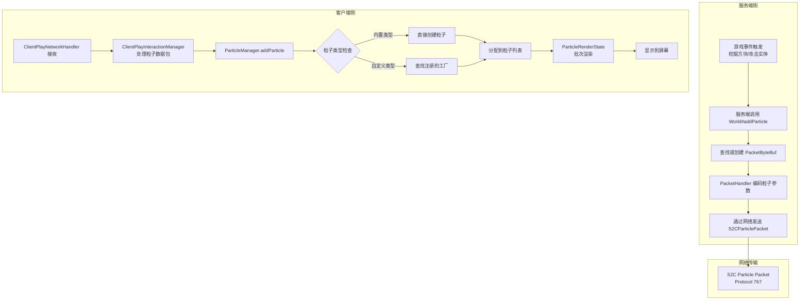
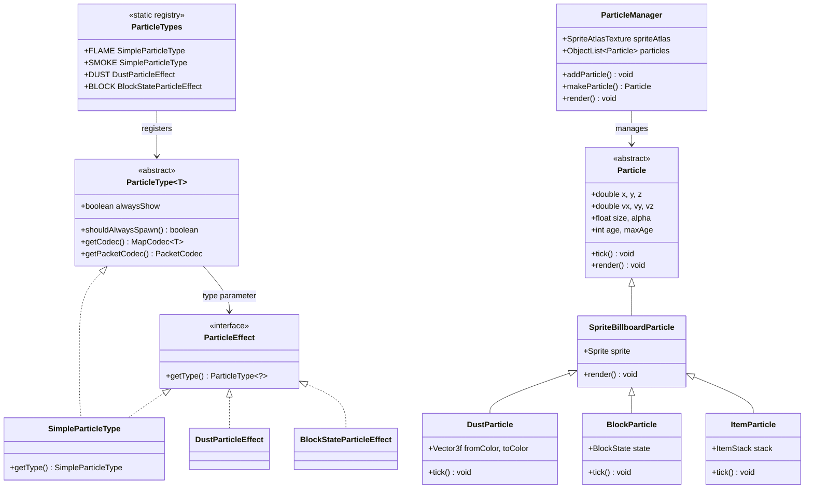

# Minecraft 1.21 粒子系统

> 基于 CFR 0.2.2 反编译源代码的粒子系统完整分析
> 版本信息: Protocol 767, World Version 3953

---

## 1. 概述

粒子系统是 Minecraft 中视觉效果的核心组件，负责实现火焰、烟雾、气泡、爆炸、尘土等数百种视觉特效。1.21 版本对粒子系统进行了多项优化，包括更高效的精灵图加载和粒子批次渲染。

### 1.1 粒子系统架构

```
┌─────────────────────────────────────────────────────────────┐
│                    粒子系统核心架构                            │
├─────────────────────────────────────────────────────────────┤
│                                                             │
│  ┌──────────────────┐   ┌──────────────────────────────┐   │
│  │  ParticleType    │   │     ParticleEffect          │   │
│  │  (类型定义)        │◄──│     (效果参数)               │   │
│  └────────┬─────────┘   └──────────────┬─────────────┘   │
│           │                              │                  │
│           │         ┌────────────────────┘                  │
│           ▼         ▼                                       │
│  ┌──────────────────────────┐                              │
│  │      Particle             │                              │
│  │  (实际显示的粒子实例)       │                              │
│  └────────────┬─────────────┘                              │
│               │                                             │
│               ▼                                             │
│  ┌──────────────────────────┐                              │
│  │   ParticleManager         │                              │
│  │   (粒子管理器 - 客户端)    │                              │
│  └──────────────────────────┘                              │
│                                                             │
└─────────────────────────────────────────────────────────────┘
```

---

## 2. 核心类详解

### 2.1 ParticleType - 粒子类型基类

粒子类型是所有粒子的定义基类，类似于注册表中的键，决定了粒子的基本行为。

```net/minecraft/particle/ParticleType.java
public abstract class ParticleType<T extends ParticleEffect> {
    private final boolean alwaysShow;

    protected ParticleType(boolean alwaysShow) {
        this.alwaysShow = alwaysShow;
    }

    // 某些粒子（如爆炸）不受距离限制，总是显示
    public boolean shouldAlwaysSpawn() {
        return this.alwaysShow;
    }

    // 用于数据包序列化
    public abstract MapCodec<T> getCodec();
    // 用于网络包传输
    public abstract PacketCodec<? super RegistryByteBuf, T> getPacketCodec();
}
```

**关键设计**：`alwaysShow` 标志用于区分局部粒子（如火焰，只有靠近才能看到）和全局粒子（如大爆炸，在任意距离都能看到）。

### 2.2 SimpleParticleType - 简单粒子类型

不需要额外参数的粒子使用 `SimpleParticleType`，它同时实现了 `ParticleEffect` 接口。

```net/minecraft/particle/SimpleParticleType.java
public class SimpleParticleType extends ParticleType<SimpleParticleType>
                                implements ParticleEffect {
    protected SimpleParticleType(boolean alwaysShow) {
        super(alwaysShow);
    }

    // 简单粒子直接返回自身作为类型标识
    public SimpleParticleType getType() {
        return this;
    }
}
```

### 2.3 ParticleEffect - 粒子效果接口

`ParticleEffect` 是粒子的"配方单"，包含了生成粒子所需的所有参数。

```net/minecraft/particle/ParticleEffect.java
public interface ParticleEffect {
    // 返回粒子类型
    ParticleType<?> getType();
}
```

### 2.4 Particle - 粒子实例基类

实际的粒子对象，存储位置、速度、生命周期等运行时状态。

```net/minecraft/particle/Particle.java
public abstract class Particle {
    protected final MinecraftClient client;
    protected double x;
    protected double y;
    protected double z;
    protected double vx;
    protected double vy;
    protected double vz;
    protected float size;
    protected float r;
    protected float g;
    protected float b;
    protected float alpha;
    protected int age;
    protected int maxAge;
    protected boolean dead;

    // 每 tick 更新粒子状态
    public abstract void tick();

    // 渲染粒子到屏幕
    public abstract void render(ParticleRenderState renderer, MatrixStack matrices,
                                 float delta);

    // 获取精灵图索引（用于动画粒子）
    protected int getWideDustSprite(float delta, SpriteSet sprites) {
        float f = MathHelper.clamp((this.size - delta * this.size) / 8.0F, 0.0F, 1.0F);
        int i = this.age * sprites.size() / this.maxAge;
        return i;
    }
}
```

---

## 3. 内置粒子类型注册表

`ParticleTypes` 静态类注册了所有内置粒子类型：

```net/minecraft/particle/ParticleTypes.java
public class ParticleTypes {
    // ===== 基础粒子 =====
    public static final SimpleParticleType AMBIENT_ENTITY_EFFECT = register("ambient_entity_effect", false);
    public static final SimpleParticleType ANGRY_VILLAGER = register("angry_villager", false);
    public static final SimpleParticleType BLOCK = register("block", false);
    public static final SimpleParticleType BUBBLE = register("bubble", false);
    public static final SimpleParticleType CLOUD = register("cloud", false);
    public static final SimpleParticleType CRIT = register("crit", false);
    public static final SimpleParticleType CURRENT_DOWN = register("current_down", false);
    public static final SimpleParticleType DAME_MAGIC = register("dame_magic", false);
    public static final SimpleParticleType DOLPHIN = register("dolphin", false);
    public static final SimpleParticleType DRAGON_BREATH = register("dragon_breath", false);
    public static final SimpleParticleType DRIPPING_LAVA = register("dripping_lava", false);
    public static final SimpleParticleType END_ROD = register("end_rod", false);
    public static final SimpleParticleType EXPLOSION = register("explosion", true);
    public static final SimpleParticleType EXPLOSION_EMITTER = register("explosion_emitter", true);
    public static final SimpleParticleType FALLING_DUST = register("falling_dust", false);
    public static final SimpleParticleType FIREWORK = register("firework", false);
    public static final SimpleParticleType FLAME = register("flame", false);
    public static final SimpleParticleType FLASH = register("flash", false);
    public static final SimpleParticleType HAPPY_VILLAGER = register("happy_villager", false);
    public static final SimpleParticleType HEART = register("heart", false);
    public static final SimpleParticleType INSTA = register("insta", false);
    public static final SimpleParticleType ITEM = register("item", false);
    public static final SimpleParticleType LAVA = register("lava", false);
    public static final SimpleParticleType MYCELIUM = register("mycelium", false);
    public static final SimpleParticleType NOTE = register("note", false);
    public static final SimpleParticleType POOF = register("poof", false);
    public static final SimpleParticleType PORTAL = register("portal", false);
    public static final SimpleParticleType RAIN = register("rain", false);
    public static final SimpleParticleType SMOKE = register("smoke", false);
    public static final SimpleParticleType SNEEZE = register("sneeze", false);
    public static final SimpleParticleType SOUL = register("soul", false);
    public static final SimpleParticleType SPIT = register("spit", false);
    public static final SimpleParticleType SQUID_INK = register("squid_ink", false);
    public static final SimpleParticleType SWEEP_ATTACK = register("sweep_attack", false);
    public static final SimpleParticleType TOTEM_OF_UNDYING = register("totem_of_undying", false);
    public static final SimpleParticleType WARPED_SPORE = register("warped_spore", false);
    public static final SimpleParticleType WHITE_ASH = register("white_ash", false);
    public static final SimpleParticleType ASH = register("ash", false);

    // ===== 带参数的粒子类型 =====
    public static final ParticleType<DustColorTransitionParticleEffect> DUST_COLOR_TRANSITION =
        register("dust_color_transition", false, ...);

    public static final ParticleType<DustParticleEffect> DUST =
        register("dust", false, DustParticleEffect::createCodec, DustParticleEffect.PACKET_CODEC);

    public static final ParticleType<BlockStateParticleEffect> BLOCK =
        register("block", false, BlockStateParticleEffect::createCodec, ...);

    public static final ParticleType<ItemStackParticleEffect> ITEM =
        register("item", false, ItemStackParticleEffect::createCodec, ...);

    public static final ParticleType<SculkSoulParticleEffect> SCULK_SOUL =
        register("sculk_soul", false, ...);

    public static final ParticleType<ShriekParticleEffect> SHRIEK =
        register("shriek", false, ...);

    public static final ParticleType<SpawnerChildParticleEffect> SPAWNER =
        register("spawner", false, ...);

    public static final ParticleType<VibrationParticleEffect> VIBRATION =
        register("vibration", false, ...);
}
```

---

## 4. 带参数的粒子效果类

### 4.1 DustParticleEffect - 彩色灰尘粒子

用于红石粉、滑石粉等彩色粒子效果。

```net/minecraft/particle/DustParticleEffect.java
public class DustParticleEffect extends AbstractDustParticleEffect {
    public static final Vector3f RED = Vec3d.unpackRgb(0xFF0000).toVector3f();
    public static final Vector3f GREEN = Vec3d.unpackRgb(0x00FF00).toVector3f();
    public static final Vector3f BLUE = Vec3d.unpackRgb(0x0000FF).toVector3f();

    public static final DustParticleEffect DEFAULT = new DustParticleEffect(RED, 1.0F);

    private final Vector3f color;

    protected DustParticleEffect(Vector3f color, float scale) {
        super(scale);
        this.color = color;
    }

    public ParticleType<DustParticleEffect> getType() {
        return ParticleTypes.DUST;
    }

    public Vector3f getColor() {
        return this.color;
    }

    // 序列化 Codec（用于 JSON 解析）
    public static MapCodec<DustParticleEffect> createCodec() {
        return RecordCodecBuilder.mapCodec(instance ->
            instance.group(
                Vector3f.CODEC.fieldOf("color").forGetter(DustParticleEffect::getColor),
                Codec.FLOAT.fieldOf("scale").forGetter(AbstractDustParticleEffect::getScale)
            ).apply(instance, DustParticleEffect::new)
        );
    }

    // PacketCodec（用于网络传输）
    public static final PacketCodec<RegistryByteBuf, DustParticleEffect> PACKET_CODEC =
        PacketCodec.tuple(
            PacketCodec.of((buf, effect) -> {
                buf.writeFloat(effect.color.getX());
                buf.writeFloat(effect.color.getY());
                buf.writeFloat(effect.color.getZ());
            }, buf -> new Vector3f(buf.readFloat(), buf.readFloat(), buf.readFloat())),
            PacketCodec.FLOAT,
            DustParticleEffect::new
        );
}
```

### 4.2 BlockStateParticleEffect - 方块状态粒子

显示方块碎片的粒子效果，用于挖掘方块时的视觉反馈。

```net/minecraft/particle/BlockStateParticleEffect.java
public class BlockStateParticleEffect implements ParticleEffect {
    private final ParticleType<BlockStateParticleEffect> type;
    private final BlockState state;

    public BlockStateParticleEffect(ParticleType<BlockStateParticleEffect> type, BlockState state) {
        this.type = type;
        this.state = state;
    }

    public BlockState getState() {
        return this.state;
    }

    public ParticleType<BlockStateParticleEffect> getType() {
        return this.type;
    }
}
```

### 4.3 DustColorTransitionParticleEffect - 颜色过渡粒子

1.19+ 引入的渐变颜色粒子效果。

```net/minecraft/particle/DustColorTransitionParticleEffect.java
public class DustColorTransitionParticleEffect extends AbstractDustParticleEffect {
    private final Vector3f toColor;

    public DustColorTransitionParticleEffect(Vector3f fromColor, Vector3f toColor, float scale) {
        super(scale);
        this.toColor = toColor;
    }

    // 渐变目标颜色
    public Vector3f getToColor() {
        return this.toColor;
    }
}
```

---

## 5. 粒子生成流程

### 5.1 世界级生成方法

`World` 类提供了多种粒子生成方法：

```net/minecraft/world/World.java
// 无参数全局粒子（所有客户端都能看到）
public void addParticle(ParticleEffect effect, double x, double y, double z,
                        double velocityX, double velocityY, double velocityZ) {
    if (this.isClient) {
        this.particleManager.addParticle(effect, x, y, z, velocityX, velocityY, velocityZ);
    }
}

// 仅指定玩家能看到的粒子
public void addParticle(ParticleEffect effect, boolean alwaysShow, double x, double y, double z,
                        double velocityX, double velocityY, double velocityZ) {
    if (this.isClient) {
        this.particleManager.addParticle(effect, alwaysShow, x, y, z, velocityX, velocityY, velocityZ);
    }
}

// 同步全局粒子事件
public void syncGlobalEvent(int eventId, Vec3d pos, int data) {
    if (this.isClient) {
        ClientPacketListenerUtil.handleGlobalEvent(this, eventId, pos, data);
    } else {
        ServerPacketListenerUtil.handleGlobalEvent(this, eventId, pos, data);
    }
}
```

### 5.2 粒子生成流程图



---

## 6. 粒子管理器

`ParticleManager` 是客户端粒子系统的核心，负责加载、调度和渲染所有粒子。

```net/minecraft/client/particle/ParticleManager.java
public class ParticleManager implements ResourceReloader, AutoCloseable {
    // 粒子纹理图集
    private final SpriteAtlasTexture spriteAtlas;

    // 所有活跃粒子的列表
    private final ObjectList<Particle> particles = new ObjectArrayList<>(16384);

    // 待移除粒子索引
    private final IntArray pendingParticles = new IntArray(1024);

    // 精灵图池
    private final Map<ParticleType<?>, SpriteSet> spriteSets;

    // 纹理加载器
    private final DynamicTextureManager textureManager;

    // 最大粒子数量限制
    private static final int MAX_PARTICLES = 16384;

    // 添加粒子到世界
    public <T extends ParticleEffect> void addParticle(T effect, double x, double y, double z,
                                                        double velocityX, double velocityY, double velocityZ) {
        this.addParticle(effect, false, x, y, z, velocityX, velocityY, velocityZ);
    }

    // 添加带距离限制的粒子
    public <T extends ParticleEffect> void addParticle(T effect, boolean alwaysShow,
                                                         double x, double y, double z,
                                                         double velocityX, double velocityY, double velocityZ) {
        Particle particle = this.makeParticle(effect, x, y, z, velocityX, velocityY, velocityZ);
        if (particle != null) {
            this.particles.add(particle);
            if (this.particles.size() > MAX_PARTICLES) {
                this.particles.remove(this.particles.size() - 1);
            }
        }
    }

    // 创建粒子实例（通过工厂）
    private <T extends ParticleEffect> Particle makeParticle(T effect, double x, double y, double z,
                                                                double velocityX, double velocityY, double velocityZ) {
        ParticleFactory<T> factory = this.factoryMap.get(effect.getType());
        if (factory != null) {
            return factory.create(effect, this.clientWorld, this.spriteSets.get(effect.getType()),
                                   x, y, z, velocityX, velocityY, velocityZ);
        }
        return null;
    }

    // 每帧渲染
    public void render(LayeredRenderLayers<ParticleRenderingContext> layers,
                       Camera camera, float delta) {
        // 使用分层渲染器渲染粒子
    }
}
```

---

## 7. 粒子工厂注册系统

### 7.1 ParticleFactoryRegistry

Fabric API 提供的工厂注册系统允许 Mod 添加自定义粒子：

```net/fabricmc/fabric/api/particle/v1/ParticleFactoryRegistry.java
@Environment(EnvType.CLIENT)
public interface ParticleFactoryRegistry {
    // 注册简单粒子的工厂
    <T extends SimpleParticleType> void register(T type, ParticleFactory<T> factory);

    // 注册带参数粒子的工厂
    <T extends ParticleEffect> void register(ParticleType<T> type, ParticleFactory<T> factory);

    // 注册延迟加载精灵图的工厂（推荐）
    <T extends ParticleEffect> void register(ParticleType<T> type, SpriteAwareFactory<T> factory);
}
```

### 7.2 工厂实现示例

```java
// 基础工厂
public interface ParticleFactory<T extends ParticleEffect> {
    Particle create(T parameters, ClientWorld world, SpriteSet sprites,
                    double x, double y, double z,
                    double vx, double vy, double vz);
}

// 延迟加载精灵图的工厂
public interface SpriteAwareFactory<T extends ParticleEffect> {
    Particle create(T parameters, ClientWorld world, SpriteSet sprites,
                    double x, double y, double z,
                    double vx, double vy, double vz);
}
```

### 7.3 内置粒子工厂示例

```net/minecraft/client/particle/DustParticle.java
public class DustParticle extends SpriteBillboardParticle {
    private final Vector3f fromColor;
    private Vector3f toColor;

    public DustParticle(ClientWorld world, double x, double y, double z,
                        double vx, double vy, double vz,
                        Vector3f fromColor, Vector3f toColor, float scale) {
        super(world, x, y, z, vx, vy, vz);
        this.fromColor = fromColor;
        this.toColor = toColor;
        this.size = scale;
        // ...
    }

    @Override
    public void tick() {
        super.tick();
        // 颜色插值
        float ratio = (float) this.age / this.maxAge;
        this.colorRed = fromColor.getX() + (toColor.getX() - fromColor.getX()) * ratio;
        this.colorGreen = fromColor.getY() + (toColor.getY() - fromColor.getY()) * ratio;
        this.colorBlue = fromColor.getZ() + (toColor.getZ() - fromColor.getZ()) * ratio;
    }
}
```

---

## 8. 常见粒子类型速查表

| ID | 类 | 说明 | 常用场景 |
|----|----|------|----------|
| `flame` | SimpleParticleType | 火焰 | 熔炉、火把、岩浆块 |
| `smoke` | SimpleParticleType | 烟雾 | 营火、烟熏炉 |
| `bubble` | SimpleParticleType | 气泡 | 水下、喷泉 |
| `heart` | SimpleParticleType | 爱心 | 繁殖、治疗 |
| `crit` | SimpleParticleType | 暴击 | 暴击伤害数字 |
| `enchant` | SimpleParticleType | 附魔 | 附魔台、书架 |
| `explosion` | SimpleParticleType | 爆炸碎片 | TNT、恶魂火球 |
| `dust` | DustParticleEffect | 彩色灰尘 | 红石粉、滑石粉 |
| `block` | BlockStateParticleEffect | 方块碎片 | 挖掘方块 |
| `item` | ItemStackParticleEffect | 物品图标 | 消耗物品动画 |
| `note` | SimpleParticleType | 音符 | 音符盒 |
| `dust_color_transition` | DustColorTransitionParticleEffect | 颜色渐变 | 末影珍珠落地 |
| `shriek` | ShriekParticleEffect | 尖叫声 | 循声守望者 |
| `sculk_soul` | SculkSoulParticleEffect | 幽魂 | 下界反应核 |
| `vibration` | VibrationParticleEffect | 振动 | 音符盒、手柄 |
| `soul` | SimpleParticleType | 灵魂 | 灵魂营火 |
| `ash` | SimpleParticleType | 灰烬 | 下界生物死亡 |
| `white_ash` | SimpleParticleType | 白灰 | 远古守卫者死亡 |

---

## 9. 粒子系统类图



---

## 10. 数据包格式

### 10.1 S2C Particle Packet

粒子通过 `S2CParticlePacket` 在网络上传输：

```
| 字段 | 类型 | 说明 |
|------|------|------|
| Particle ID | VarInt | 粒子类型的数字 ID |
| Keep Long | Boolean | 是否保留长坐标（相对于玩家的偏移） |
| Position | Double[3] 或 Float[3] | 根据 Keep Long 决定 |
| Velocity | Byte[3] | 速度向量（归一化到 -127 ~ 127） |
| Data | Variable | 粒子特定参数（通过 PacketCodec 解码） |

```

### 10.2 Velocity 编码

速度使用 1 个字节表示每个分量，范围 [-127, 127]，实际速度通过以下公式计算：

```java
public static double decodeVelocity(byte b) {
    return (double) b / 4096.0;  // 归一化到 [-0.031, 0.031]
}
```

---

## 11. 性能优化

### 11.1 粒子数量限制

- 客户端最大活跃粒子数：`MAX_PARTICLES = 16384`
- 超出限制时移除最旧的粒子
- 可通过游戏设置中的"粒子"选项调整可见距离

### 11.2 精灵图批处理

粒子使用 `SpriteAtlasTexture` 进行批处理渲染：
- 所有粒子精灵打包到单一纹理图集中
- 减少纹理绑定次数
- 支持精灵动画（通过帧索引切换）

### 11.3 距离剔除

- 非 `alwaysShow` 粒子在超过一定距离后不再渲染
- 渲染前通过相机视锥体剔除

---

## 12. 总结

| 组件 | 职责 | 关键类 |
|------|------|--------|
| `ParticleType` | 粒子类型定义 | 决定粒子的基本行为 |
| `ParticleEffect` | 粒子效果配方 | 包含生成粒子所需的所有参数 |
| `SimpleParticleType` | 无参数粒子 | 火焰、烟雾等简单粒子 |
| `Particle` | 粒子实例 | 存储运行时状态（位置、速度等） |
| `SpriteBillboardParticle` | 精灵图粒子 | 渲染带纹理/动画的粒子 |
| `ParticleManager` | 粒子管理器 | 加载、调度、渲染粒子 |
| `ParticleFactory` | 工厂接口 | 创建粒子实例 |

粒子系统遵循 **类型注册 → 效果创建 → 实例生成 → 批次渲染** 的数据流，通过 PacketCodec 实现高效的客户端-服务端通信。
