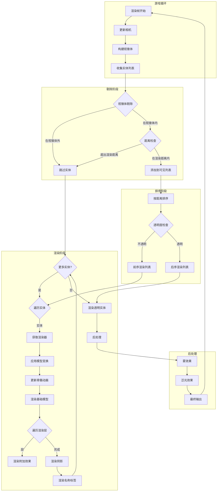
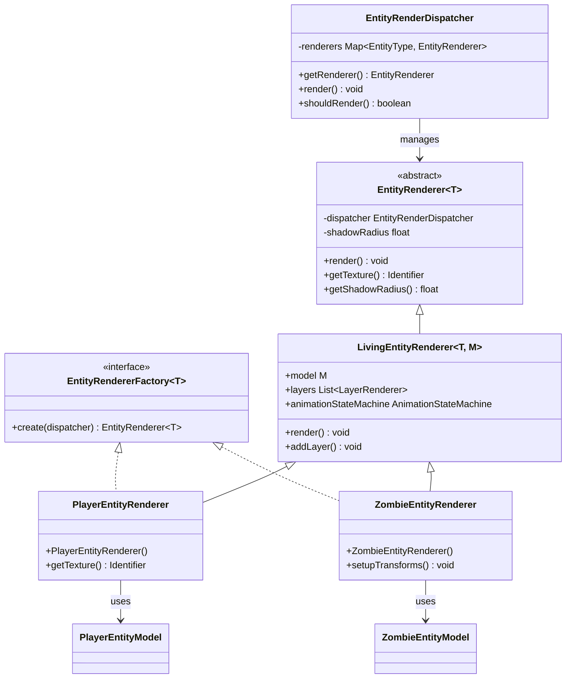
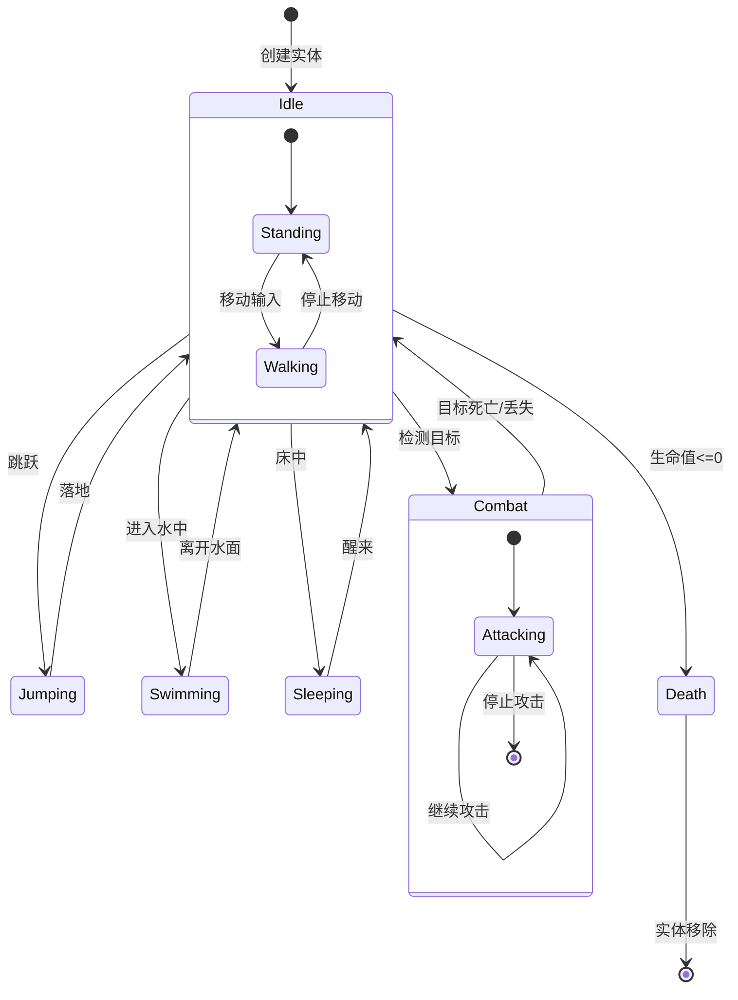
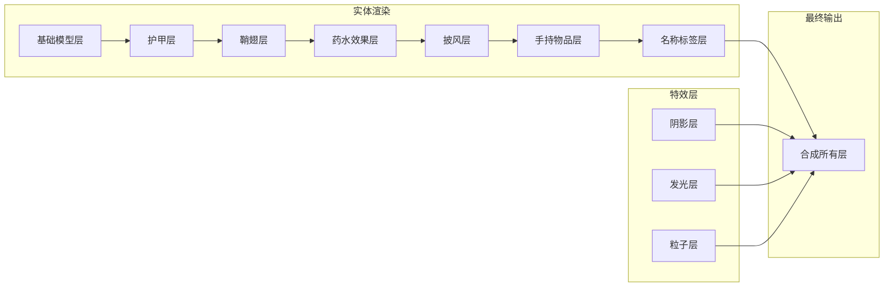

# Minecraft 1.21 实体渲染系统深度分析

> 基于 CFR 0.2.2 反编译源代码的实体渲染系统完整分析
> 版本信息: Protocol 767, World Version 3953

---

## 概述

实体渲染系统（Entity Rendering System）是 Minecraft 客户端渲染引擎的核心组件，负责将游戏世界中的各类实体（玩家、生物、投射物、物品等）可视化呈现。该系统与实体系统紧密协作，将服务器端同步的实体数据转换为玩家可见的图形输出。

### 1.1 系统架构

```
┌─────────────────────────────────────────────────────────────────────┐
│                        实体渲染系统架构                                │
├─────────────────────────────────────────────────────────────────────┤
│                                                                     │
│  ┌─────────────────────────────────────────────────────────────┐   │
│  │                     MinecraftClient                          │   │
│  │                   (渲染协调器入口)                             │   │
│  └─────────────────────────┬───────────────────────────────────┘   │
│                            │                                        │
│  ┌─────────────────────────▼───────────────────────────────────┐   │
│  │                   RenderSystem                                │   │
│  │              (OpenGL 状态管理)                                 │   │
│  └─────────────────────────┬───────────────────────────────────┘   │
│                            │                                        │
│  ┌─────────────────────────▼───────────────────────────────────┐   │
│  │                EntityRenderDispatcher                         │   │
│  │              (实体渲染调度器 - 核心协调器)                       │   │
│  │  ┌─────────────┬─────────────┬─────────────┐               │   │
│  │  │ 渲染距离管理  │  视锥体剔除  │  渲染器注册  │               │   │
│  │  └─────────────┴─────────────┴─────────────┘               │   │
│  └─────────────────────────┬───────────────────────────────────┘   │
│                            │                                        │
│  ┌─────────────────────────▼───────────────────────────────────┐   │
│  │                    EntityRenderer<T>                          │   │
│  │                 (实体渲染器基类)                                 │   │
│  │  ┌─────────────┬─────────────┬─────────────┐               │   │
│  │  │  LayerRenderers │ ModelAnimator │ ShadowRenderer │          │   │
│  │  └─────────────┴─────────────┴─────────────┘               │   │
│  └─────────────────────────┬───────────────────────────────────┘   │
│                            │                                        │
│  ┌─────────────────────────▼───────────────────────────────────┐   │
│  │                   具体实体渲染器                                 │   │
│  │  ┌────────┐ ┌────────┐ ┌────────┐ ┌────────┐ ┌────────┐    │   │
│  │  │Player  │ │  Mob   │ │  Animal │ │ItemFrame│ │Projectile│   │   │
│  │  │Renderer│ │Renderer│ │Renderer│ │Renderer│ │Renderer │   │   │
│  │  └────────┘ └────────┘ └────────┘ └────────┘ └────────┘    │   │
│  └─────────────────────────────────────────────────────────────┘   │
│                                                                     │
│  ┌───────────────────────────────────────────────────────────────┐   │
│  │                        渲染管线                                │   │
│  │  ┌──────────┐  ┌──────────┐  ┌──────────┐  ┌──────────┐    │   │
│  │  │ 视锥体剔除 │→ │ 距离排序 │→ │ 骨骼动画 │→ │ 逐层渲染 │    │   │
│  │  └──────────┘  └──────────┘  └──────────┘  └──────────┘    │   │
│  └───────────────────────────────────────────────────────────────┘   │
│                                                                     │
└─────────────────────────────────────────────────────────────────────┘
```

### 1.2 包结构

```
net.minecraft.client.render.entity/
├── EntityRenderDispatcher.java      - 实体渲染调度器（核心）
├── EntityRenderer.java              - 实体渲染器基类
├── EntityRendererFactory.java       - 渲染器工厂接口
├── EntityRendererLayers.java        - 渲染层工具类
├── EntityRendererManager.java       - 渲染器管理器
│
├── Layers.java                      - 渲染层定义
├── LayerRenderer.java               - 渲染层接口
│
├──/accessor/                        - 访问接口
│   └── LivingEntityRendererAccessor.java
│
├── model/                          - 实体模型
│   ├── EntityModel.java             - 实体模型基类
│   ├── EntityModelLoader.java       - 模型加载器
│   ├── TexturedModel.java          - 带纹理的模型
│   └── package-info.java
│
├── effect/                          - 渲染效果
│   ├── EntityEffectRenderer.java    - 实体药水效果渲染
│   ├── WaterwaveWaterStatusEffect.java
│   └── package-info.java
│
├── dynamics/
│   └── EntityShadowRenderer.java    - 实体阴影渲染器
│
├── animation/
│   ├── AnimationBaker.java          - 动画烘焙
│   ├── AnimationController.java     - 动画控制器
│   ├── AnimationEvent.java          - 动画事件
│   ├── AnimationLoader.java         - 动画加载器
│   ├── AnimationParseException.java
│   ├── AnimationStateMachine.java   - 动画状态机
│   ├── Bone.java                   - 骨骼
│   ├── Keyframe.java               - 关键帧
│   ├── ModelAnimator.java           - 模型动画器
│   └── package-info.java
│
├── equip/
│   └── HeldItemRenderer.java        - 手持物品渲染器
│
├── monster/
│   ├── package-info.java
│   ├── EndermanEntityRenderer.java
│   ├── BlazeEntityRenderer.java
│   ├── BeeEntityRenderer.java
│   ├── PiglinBruteEntityRenderer.java
│   ├── HoglinEntityRenderer.java
│   ├── PiglinEntityRenderer.java
│   ├── SpiderEntityRenderer.java
│   ├── CaveSpiderEntityRenderer.java
│   └── SilverfishEntityRenderer.java
│
├──/passive/
│   ├── package-info.java
│   ├── AnimalEntityRenderer.java
│   ├── BatEntityRenderer.java
│   ├── GolemEntityRenderer.java
│   ├── MerchantEntityRenderer.java
│   ├── TameableEntityRenderer.java
│   ├── AbstractDonkeyEntityRenderer.java
│   ├── HorseEntityRenderer.java
│   ├── SkeletonHorseEntityRenderer.java
│   ├── ZombieHorseEntityRenderer.java
│   ├── LlamaEntityRenderer.java
│   ├── TraderLlamaEntityRenderer.java
│   └── WolfEntityRenderer.java
│
├── projectile/
│   ├── package-info.java
│   ├── ArrowEntityRenderer.java
│   ├── FireballEntityRenderer.java
│   ├── FireworkRocketEntityRenderer.java
│   ├── FishingBobberEntityRenderer.java
│   ├── ItemEntityRenderer.java
│   ├── SnowballEntityRenderer.java
│   ├── ThrownEntityRenderer.java
│   ├── ThrownEnderpearlEntityRenderer.java
│   └── ThrownExperienceBottleRenderer.java
│
├── vehicle/
│   ├── BoatEntityRenderer.java
│   └── MinecartEntityRenderer.java
│
├── PaintingEntityRenderer.java
├── GlowSquidEntityRenderer.java
├── EnderCrystalEntityRenderer.java
├── ExperienceOrbEntityRenderer.java
├── EyeOfEnderEntityRenderer.java
├── FallingBlockEntityRenderer.java
├── ItemFrameEntityRenderer.java
├── LeashFence KnotEntityRenderer.java
├── LightningBoltEntityRenderer.java
├── LivingEntityRenderer.java
├── PlayerEntityRenderer.java
├── ShieldEntityRenderer.java
├── SpectralArrowEntityRenderer.java
├── TntEntityRenderer.java
└── WitherEntityRenderer.java
```

### 1.3 渲染器注册表

```net/minecraft/client/render/entity/EntityRendererRegistry.java
public class EntityRendererRegistry {
    // 实体类型到渲染器的映射
    private static final Map<EntityType<?>, EntityRendererFactory<?>> ENTITY_RENDERERS = new IdentityHashMap<>();
    
    // 渲染上下文
    private static RenderEngine renderEngine;
    private static EntityRenderDispatcher entityRenderDispatcher;
    
    // 注册实体渲染器
    public static <T extends Entity> void register(
        EntityType<T> type,
        EntityRendererFactory<T> factory
    ) {
        ENTITY_RENDERERS.put(type, factory);
    }
    
    // 获取渲染器实例
    public static <T extends Entity> EntityRenderer<T> getRenderer(T entity) {
        EntityRendererFactory<T> factory = (EntityRendererFactory<T>) ENTITY_RENDERERS.get(entity.getType());
        if (factory == null) {
            return null;
        }
        return factory.create(entityRenderDispatcher);
    }
    
    // 初始化所有内置渲染器
    public static void initialize() {
        // 玩家
        register(EntityType.PLAYER, PlayerEntityRenderer::new);
        
        // 生物
        register(EntityType.ZOMBIE, ZombieEntityRenderer::new);
        register(EntityType.SKELETON, SkeletonEntityRenderer::new);
        register(EntityType.CREEPER, CreeperEntityRenderer::new);
        register(EntityType.SPIDER, SpiderEntityRenderer::new);
        register(EntityType.ENDERMAN, EndermanEntityRenderer::new);
        
        // 动物
        register(EntityType.PIG, PigEntityRenderer::new);
        register(EntityType.COW, CowEntityRenderer::new);
        register(EntityType.SHEEP, SheepEntityRenderer::new);
        register(EntityType.WOLF, WolfEntityRenderer::new);
        
        // 投射物
        register(EntityType.ARROW, ArrowEntityRenderer::new);
        register(EntityType.ITEM, ItemEntityRenderer::new);
        register(EntityType.EXPERIENCE_ORB, ExperienceOrbEntityRenderer::new);
        
        // 方块实体
        register(EntityType.ITEM_FRAME, ItemFrameEntityRenderer::new);
        register(EntityType.FALLING_BLOCK, FallingBlockEntityRenderer::new);
        
        // 特殊实体
        register(EntityType.LIGHTNING_BOLT, LightningBoltEntityRenderer::new);
        register(EntityType.END_CRYSTAL, EnderCrystalEntityRenderer::new);
        register(EntityType.WITHER, WitherEntityRenderer::new);
        
        // 载具
        register(EntityType.BOAT, BoatEntityRenderer::new);
        register(EntityType.MINECART, MinecartEntityRenderer::new);
    }
}
```

---

## 渲染调度器 (EntityRenderDispatcher)

`EntityRenderDispatcher` 是实体渲染系统的核心协调器，负责管理所有实体渲染器、处理渲染距离、视锥体剔除等关键任务。

### 2.1 核心职责

```net/minecraft/client/render/entity/EntityRenderDispatcher.java
@Environment(EnvType.CLIENT)
public class EntityRenderDispatcher implements PropertyAccessor, NamedSkinSpi.Factory {
    
    // 单例实例
    public static final EntityRenderDispatcher INSTANCE = new EntityRenderDispatcher();
    
    // ========================================
    // 核心组件
    // ========================================
    
    // 渲染器注册表
    private final Map<EntityType<?>, EntityRenderer<?>> renderers = new IdentityHashMap<>();
    
    // 渲染上下文
    private final RenderSystem renderSystem;
    private final TextureManager textureManager;
    private final BufferBuilder bufferBuilder;
    private final TextRenderer textRenderer;
    
    // 相机信息
    private Camera camera;
    private Vec3d cameraPos;
    
    // 渲染配置
    private boolean renderShadows = true;
    private float shadowRadius = 1.0f;
    private float shadowOpacity = 1.0f;
    
    // ========================================
    // 渲染距离管理
    // ========================================
    
    // 全局渲染距离配置
    private int renderDistance;
    
    // 渲染距离平方（用于快速比较）
    private double renderDistanceSquared;
    
    // ========================================
    // 模型着色器
    // ========================================
    
    // 实数模型着色器（用于渲染非发光实体）
    private RenderLayer.EntityCutout getEntityCutout(Identifier texture);
    
    // 发光模型着色器
    private RenderLayer.EntityGlint getEntityGlint(Identifier texture);
    
    // 实体透明模型
    private RenderLayer.EntityTranslucent getEntityTranslucent(Identifier texture);
}
```

### 2.2 渲染器获取与注册

```net/minecraft/client/render/entity/EntityRenderDispatcher.java
public class EntityRenderDispatcher {
    
    // 获取指定实体的渲染器
    public <T extends Entity> EntityRenderer<T> getRenderer(T entity) {
        EntityType<T> type = (EntityType<T>) entity.getType();
        EntityRenderer<T> renderer = (EntityRenderer<T>) this.renderers.get(type);
        
        if (renderer == null) {
            // 尝试从注册表获取
            EntityRendererFactory<T> factory = EntityRendererRegistry.getFactory(type);
            if (factory != null) {
                renderer = factory.create(this);
                this.renderers.put(type, renderer);
            }
        }
        
        return renderer;
    }
    
    // 注册渲染器
    public <T extends Entity> void register(
        EntityType<T> type,
        EntityRenderer<T> renderer
    ) {
        this.renderers.put(type, renderer);
    }
    
    // 检查是否应渲染某实体
    public boolean shouldRender(
        Entity entity,
        Frustum frustum,
        double squaredDistance
    ) {
        // 1. 检查渲染距离
        if (squaredDistance > this.renderDistanceSquared) {
            return false;
        }
        
        // 2. 总是渲染旁观者模式下的本地玩家
        if (entity == this.client.player && 
            this.client.gameMode.getCamera() != this.client.player) {
            return false;
        }
        
        // 3. 检查视锥体剔除
        if (frustum != null && !frustum.isVisible(entity.getBoundingBox())) {
            return false;
        }
        
        // 4. 检查实体自身的 shouldRender 方法
        return entity.shouldRender(squaredDistance);
    }
}
```

### 2.3 渲染方法

```net/minecraft/client/render/entity/EntityRenderDispatcher.java
public class EntityRenderDispatcher {
    
    // 主渲染方法
    public void render(
        Entity entity,
        float yaw,
        float tickDelta,
        MatrixStack matrixStack,
        VertexConsumerProvider vertexConsumers
    ) {
        // 1. 获取渲染器
        EntityRenderer<?> renderer = this.getRenderer(entity);
        if (renderer == null) {
            return;
        }
        
        // 2. 计算渲染位置
        double dx = entity.getX() - this.cameraPos.x;
        double dy = entity.getY() - this.cameraPos.y;
        double dz = entity.getZ() - this.cameraPos.z;
        
        // 3. 跳过过远的实体
        double squaredDistance = dx * dx + dy * dy + dz * dz;
        if (squaredDistance > this.renderDistanceSquared * 1.5) {
            return;
        }
        
        // 4. 渲染实体
        matrixStack.push();
        matrixStack.translate(dx, dy, dz);
        
        // 应用实体旋转
        this.rotateEntity(entity, yaw, matrixStack);
        
        // 调用渲染器的 render 方法
        try {
            renderer.render(entity, yaw, tickDelta, matrixStack, vertexConsumers, 
                          LightmapTextureManager.MAX_LIGHT_COORDINATE);
        } finally {
            matrixStack.pop();
        }
    }
    
    // 旋转实体以匹配视角
    private void rotateEntity(Entity entity, float yaw, MatrixStack matrixStack) {
        float pitch = entity.getPitch();
        float roll = entity.getRoll();
        
        // Y 轴旋转（偏航角）
        matrixStack.multiply(Vec3f.POSITIVE_Y.getRadialQuaternion(yaw));
        
        // X 轴旋转（俯仰角）
        matrixStack.multiply(Vec3f.POSITIVE_X.getRadialQuaternion(pitch));
        
        // Z 轴旋转（翻滚角）
        matrixStack.multiply(Vec3f.POSITIVE_Z.getRadialQuaternion(roll));
    }
}
```

### 2.4 渲染层管理

```net/minecraft/client/render/entity/EntityRenderDispatcher.java
public class EntityRenderDispatcher {
    
    // 获取实数渲染层
    public RenderLayer getEntityLayer(Identifier texture) {
        return RenderLayer.getEntityCutout(texture);
    }
    
    // 获取发光渲染层
    public RenderLayer getGlintLayer(Identifier texture) {
        return RenderLayer.getEntityGlint(texture);
    }
    
    // 获取透明渲染层
    public RenderLayer getTranslucentLayer(Identifier texture) {
        return RenderLayer.getEntityTranslucent(texture);
    }
    
    // 获取实体阴影渲染层
    public RenderLayer getShadowLayer() {
        return RenderLayer.getEntityShadow(
            EntityShadowRenderer.SHADOW_TEXTURE
        );
    }
}
```

### 2.5 相机与坐标系统

```net/minecraft/client/render/entity/EntityRenderDispatcher.java
public class EntityRenderDispatcher {
    
    // 设置相机
    public void setCamera(Camera camera) {
        this.camera = camera;
        this.cameraPos = camera.getPos();
    }
    
    // 获取相机位置
    public Vec3d getCameraPos() {
        return this.cameraPos;
    }
    
    // 坐标变换
    public Vec3d transformToWorld(Vec3d cameraRelativePos) {
        return cameraRelativePos.add(this.cameraPos);
    }
    
    public Vec3d transformToCamera(Vec3d worldPos) {
        return worldPos.subtract(this.cameraPos);
    }
    
    // 获取相机旋转
    public float getCameraYaw() {
        return this.camera != null ? this.camera.getYaw() : 0.0f;
    }
    
    public float getCameraPitch() {
        return this.camera != null ? this.camera.getPitch() : 0.0f;
    }
}
```

---

## 实体渲染器 (EntityRenderer)

`EntityRenderer` 是所有具体实体渲染器的基类，定义了实体渲染的标准接口和通用功能。

### 3.1 基类结构

```net/minecraft/client/render/entity/EntityRenderer.java
@Environment(EnvType.CLIENT)
public abstract class EntityRenderer<T extends Entity> {
    
    // ========================================
    // 核心字段
    // ========================================
    
    // 所属调度器
    protected final EntityRenderDispatcher dispatcher;
    
    // 纹理管理器
    protected final RenderSystem renderSystem;
    protected final TextureManager textureManager;
    
    // 默认阴影设置
    protected static final float DEFAULT_SHADOW_RADIUS = 0.25f;
    protected static final float DEFAULT_SHADOW_OPACITY = 1.0f;
    
    // ========================================
    // 渲染配置
    // ========================================
    
    // 阴影半径
    protected float shadowRadius = DEFAULT_SHADOW_RADIUS;
    
    // 阴影强度
    protected float shadowOpacity = DEFAULT_SHADOW_OPACITY;
    
    // 是否渲染标签（实体头顶名称）
    protected boolean renderLabel = true;
    
    // ========================================
    // 构造函数
    // ========================================
    
    protected EntityRenderer(EntityRenderDispatcher dispatcher) {
        this.dispatcher = dispatcher;
        this.renderSystem = dispatcher.getRenderSystem();
        this.textureManager = dispatcher.getTextureManager();
    }
    
    // ========================================
    // 核心方法
    // ========================================
    
    // 渲染实体
    public abstract void render(
        T entity,
        float yaw,
        float tickDelta,
        MatrixStack matrices,
        VertexConsumerProvider vertexConsumers,
        int light
    );
    
    // 获取实体纹理
    public abstract Identifier getTexture(T entity);
    
    // 获取阴影尺寸
    public float getShadowRadius(T entity) {
        return this.shadowRadius;
    }
}
```

### 3.2 通用渲染逻辑

```net/minecraft/client/render/entity/EntityRenderer.java
public abstract class EntityRenderer<T extends Entity> {
    
    // 渲染标签（实体头顶名称）
    protected void renderLabelIfPresent(
        T entity,
        Text text,
        MatrixStack matrices,
        VertexConsumerProvider vertexConsumers,
        int light
    ) {
        if (!this.renderLabel) {
            return;
        }
        
        // 计算标签位置（在实体头顶上方）
        float height = entity.getHeight() + 0.5f;
        
        // 检查标签是否应该显示
        if (!this.shouldRenderLabel(entity, text)) {
            return;
        }
        
        // 渲染标签
        matrices.push();
        matrices.translate(0.0, height, 0.0);
        matrices.multiply(this.dispatcher.getRotation());
        matrices.scale(-0.025f, -0.025f, 0.025f);
        
        // 背景
        float textWidth = this.dispatcher.getTextRenderer().getWidth(text);
        float x = -textWidth / 2.0f;
        float y = 0.0f;
        
        Matrix4f matrix = matrices.peek().getPositionMatrix();
        VertexConsumer buffer = vertexConsumers.getBuffer(RenderLayer.getTextBackground());
        RenderSystem.enableBlend();
        RenderSystem.defaultBlendFunc();
        buffer.vertex(matrix, x - 1.0f, y - 1.0f, 0.0f).color(64, 64, 64, 100);
        buffer.vertex(matrix, x - 1.0f, y + 8.0f, 0.0f).color(64, 64, 64, 100);
        buffer.vertex(matrix, x + textWidth + 1.0f, y + 8.0f, 0.0f).color(64, 64, 64, 100);
        buffer.vertex(matrix, x + textWidth + 1.0f, y - 1.0f, 0.0f).color(64, 64, 64, 100);
        
        // 文字
        this.dispatcher.getTextRenderer().draw(
            text,
            x,
            y,
            0xFFFFFFFF,
            false,
            matrix,
            vertexConsumers,
            TextRenderer.TextLayerType.NORMAL,
            0,
            light
        );
        
        matrices.pop();
    }
    
    // 检查是否应该渲染标签
    protected boolean shouldRenderLabel(T entity, Text text) {
        // 检查距离
        double squaredDistance = this.dispatcher.getSquaredDistanceToCamera(entity);
        return squaredDistance < 100.0; // 10 格的平方
    }
    
    // 渲染阴影
    protected void renderShadow(
        T entity,
        MatrixStack matrices,
        float shadowRadius,
        float tickDelta
    ) {
        if (!this.dispatcher.shouldRenderShadows()) {
            return;
        }
        
        // 获取阴影渲染器
        EntityShadowRenderer shadowRenderer = this.dispatcher.getShadowRenderer();
        
        // 计算阴影偏移
        float height = entity.getStandingEyeHeight();
        Vec3d pos = entity.getLerpedPos(tickDelta);
        
        // 渲染阴影
        matrices.push();
        matrices.translate(pos.x, entity.getY() + 0.001, pos.z);
        matrices.scale(shadowRadius, 1.0f, shadowRadius);
        
        shadowRenderer.render(matrices, entity.getWidth(), light);
        
        matrices.pop();
    }
}
```

### 3.3 LivingEntityRenderer 特化

`LivingEntityRenderer` 是针对有生命实体的渲染器基类，增加了动画、装备渲染等高级功能。

```net/minecraft/client/render/entity/LivingEntityRenderer.java
@Environment(EnvType.CLIENT)
public abstract class LivingEntityRenderer<T extends LivingEntity, M extends EntityModel<T>> 
        extends EntityRenderer<T> {
    
    // ========================================
    // 模型相关
    // ========================================
    
    // 实体模型
    protected M model;
    
    // 模型变换
    protected final EntityModelLayers modelLayers;
    
    // ========================================
    // 动画相关
    // ========================================
    
    // 动画状态机
    protected AnimationStateMachine animationStateMachine;
    
    // 动画组件
    protected ModelAnimator animator;
    
    // ========================================
    // 渲染层
    // ========================================
    
    // 渲染层列表
    private final List<LayerRenderer<T, M>> layers = new ArrayList<>();
    
    // ========================================
    // 构造函数
    // ========================================
    
    protected LivingEntityRenderer(
        EntityRenderDispatcher dispatcher,
        M entityModel,
        float shadowRadius
    ) {
        super(dispatcher);
        this.model = entityModel;
        this.shadowRadius = shadowRadius;
        this.animator = ModelAnimator.of(entityModel);
    }
    
    // ========================================
    // 渲染方法
    // ========================================
    
    @Override
    public void render(
        T entity,
        float yaw,
        float tickDelta,
        MatrixStack matrices,
        VertexConsumerProvider vertexConsumers,
        int light
    ) {
        // 1. 准备渲染数据
        matrices.push();
        
        // 2. 应用旋转
        this.applyRotations(entity, yaw, tickDelta, matrices);
        
        // 3. 更新动画
        this.updateAnimation(entity);
        
        // 4. 设置模型参数
        this.setupTransforms(entity, matrices, tickDelta);
        
        // 5. 渲染主要模型
        float alpha = this.getRenderAlpha(entity);
        boolean isTranslucent = alpha < 1.0f;
        
        RenderLayer layer = this.getLayer(this.getTexture(entity), isTranslucent);
        VertexConsumer vertexConsumer = vertexConsumers.getBuffer(layer);
        
        this.model.render(matrices, vertexConsumer, light, 
                         OverlayTexture.DEFAULT_UV, 1.0f, 1.0f, 1.0f, alpha);
        
        // 6. 渲染附加层
        for (LayerRenderer<T, M> layerRenderer : this.layers) {
            layerRenderer.render(matrices, vertexConsumers, light, 
                               entity, yaw, tickDelta, 0.0f);
        }
        
        matrices.pop();
        
        // 7. 渲染名称标签
        this.renderLabelIfPresent(entity, entity.getDisplayName(), 
                                  matrices, vertexConsumers, light);
    }
    
    // 应用旋转
    protected void applyRotations(
        T entity,
        float bodyYaw,
        float tickDelta,
        MatrixStack matrices
    ) {
        // 身体旋转
        matrices.multiply(Vec3f.POSITIVE_Y.getRadialQuaternion(bodyYaw));
        
        // 附加旋转（如飞行中的蝙蝠翅膀）
        float additionalPitch = entity.getPitch(tickDelta);
        matrices.multiply(Vec3f.POSITIVE_X.getRadialQuaternion(additionalPitch));
    }
    
    // 设置模型参数
    protected void setupTransforms(
        T entity,
        MatrixStack matrices,
        float tickDelta
    ) {
        // 倾斜角度
        float tiltAngle = entity.getTiltAngle(tickDelta);
        if (tiltAngle != 0.0f) {
            matrices.multiply(Vec3f.POSITIVE_Z.getRadialQuaternion(tiltAngle));
        }
        
        // 蹬踹角度
        float limbDistance = entity.distanceWalkedModified;
        float limbAngle = MathHelper.sin(limbDistance * 3.1415927f) * limbDistance * 0.5f;
        
        // 躺下等状态
        if (entity.isInSleepingPose()) {
            matrices.translate(0.0f, 0.4f, 0.0f);
            matrices.multiply(Vec3f.POSITIVE_Y.getRadialQuaternion(90.0f));
        }
    }
    
    // 获取渲染层
    protected RenderLayer getLayer(Identifier texture, boolean isTranslucent) {
        if (isTranslucent) {
            return RenderLayer.getEntityTranslucent(texture);
        }
        return RenderLayer.getEntityCutout(texture);
    }
}
```

### 3.4 渲染器工厂

```net/minecraft/client/render/entity/EntityRendererFactory.java
@FunctionalInterface
public interface EntityRendererFactory<T extends Entity> {
    EntityRenderer<T> create(EntityRenderDispatcher dispatcher);
}

// 使用示例
public class ZombieEntityRenderer extends LivingEntityRenderer<ZombieEntity, ZombieEntityModel> {
    
    public static EntityRendererFactory<ZombieEntity> factory(EntityModelLayers layers) {
        return dispatcher -> new ZombieEntityRenderer(
            dispatcher,
            new ZombieEntityModel(layers.getModelPart(ZombieEntityModel.MODEL_LAYER)),
            DEFAULT_SHADOW_RADIUS
        );
    }
}
```

---

## 渲染层 (LayerRenderer)

渲染层系统允许在基础实体模型之上添加额外的渲染效果，如装备覆盖、特效、披风等。

### 4.1 LayerRenderer 接口

```net/minecraft/client/render/entity/LayerRenderer.java
@FunctionalInterface
public interface LayerRenderer<T extends LivingEntity, M extends EntityModel<T>> {
    
    // 渲染层
    void render(
        MatrixStack matrices,
        VertexConsumerProvider vertexConsumers,
        int light,
        T entity,
        float limbAngle,
        float limbDistance,
        float tickDelta,
        float animationProgress,
        float headYaw,
        float headPitch
    );
    
    // 可选：渲染前回调
    default void renderHand(
        MatrixStack matrices,
        VertexConsumerProvider vertexConsumers,
        int light,
        T entity,
        float handSwingProgress,
        float handAngle
    ) {
        // 默认空实现
    }
}
```

### 4.2 常见渲染层实现

#### 4.2.1 装备层 (ElytraLayer)

```net/minecraft/client/render/entity/layers/ElytraLayer.java
public class ElytraLayer<T extends LivingEntity> implements LayerRenderer<T, EntityModel<T>> {
    
    private final ElytraModel<T> model;
    
    public ElytraLayer(Identifier texture) {
        this.model = new ElytraModel<>(MESH_DATA);
    }
    
    @Override
    public void render(
        MatrixStack matrices,
        VertexConsumerProvider vertexConsumers,
        int light,
        T entity,
        float limbAngle,
        float limbDistance,
        float tickDelta,
        float animationProgress,
        float headYaw,
        float headPitch
    ) {
        // 只有装备鞘翅时才渲染
        ItemStack elytra = entity.getEquippedStack(EquipmentSlot.CHEST);
        if (elytra.isOf(Items.ELYTRA)) {
            matrices.push();
            
            // 绑定纹理
            Identifier texture = this.getElytraTexture(elytra);
            VertexConsumer buffer = vertexConsumers.getBuffer(
                RenderLayer.getEntityCutout(texture)
            );
            
            // 应用鞘翅动画
            float wingAngle = this.getWingAnimationAngle(entity, tickDelta);
            this.model.setAngles(entity, limbAngle, limbDistance, 
                                 animationProgress, headYaw, headPitch);
            this.model.render(matrices, buffer, light, OverlayTexture.DEFAULT_UV,
                            1.0f, 1.0f, 1.0f, 1.0f);
            
            matrices.pop();
        }
    }
    
    private float getWingAnimationAngle(T entity, float tickDelta) {
        if (entity instanceof PlayerEntity player) {
            if (player.isGliding()) {
                // 滑翔时翅膀展开
                return 0.0f;
            } else if (player.isFallFlying()) {
                // 自由落体时翅膀部分展开
                return 0.5f;
            }
        }
        // 默认折叠状态
        return 1.0f;
    }
}
```

#### 4.2.2 头盔层 (ArmorTrimmableLayer)

```net/minecraft/client/render/entity/layers/ArmorTrimmableLayer.java
public class ArmorTrimmableLayer<T extends LivingEntity> implements LayerRenderer<T, EntityModel<T>> {
    
    // 护甲模型层
    private final HumanoidArmorLayer armorLayer;
    
    // 装饰层
    private final TrimmableArmorDecoration trimmableLayer;
    
    public ArmorTrimmableLayer(EntityRenderDispatcher dispatcher, 
                               EntityModel<T> baseModel) {
        this.armorLayer = new HumanoidArmorLayer(dispatcher, baseModel);
        this.trimmableLayer = new TrimmableArmorDecoration();
    }
    
    @Override
    public void render(
        MatrixStack matrices,
        VertexConsumerProvider vertexConsumers,
        int light,
        T entity,
        float limbAngle,
        float limbDistance,
        float tickDelta,
        float animationProgress,
        float headYaw,
        float headPitch
    ) {
        // 渲染护甲
        this.armorLayer.render(matrices, vertexConsumers, light, 
                              entity, EquipmentSlot.CHEST);
        
        // 检查是否有护甲装饰
        ItemStack chestplate = entity.getEquippedStack(EquipmentSlot.CHEST);
        if (this.isTrimmable(chestplate)) {
            this.trimmableLayer.render(matrices, vertexConsumers, light,
                                       chestplate, entity);
        }
    }
    
    private boolean isTrimmable(ItemStack stack) {
        return stack.contains(DataComponentTypes.TRIM);
    }
}
```

#### 4.2.3 药水效果层 (StatusEffectLayer)

```net/minecraft/client/render/entity/layers/StatusEffectLayer.java
public class StatusEffectLayer<T extends LivingEntity> implements LayerRenderer<T, EntityModel<T>> {
    
    @Override
    public void render(
        MatrixStack matrices,
        VertexConsumerProvider vertexConsumers,
        int light,
        T entity,
        float limbAngle,
        float limbDistance,
        float tickDelta,
        float animationProgress,
        float headYaw,
        float headPitch
    ) {
        // 虚弱效果 - 使实体看起来更瘦弱
        if (entity.hasStatusEffect(StatusEffects.WEAKNESS)) {
            matrices.scale(0.95f, 1.0f, 0.95f);
        }
        
        // 中毒效果 - 使实体变绿
        if (entity.hasStatusEffect(StatusEffects.POISON)) {
            float poisonProgress = this.getEffectProgress(entity, StatusEffects.POISON);
            matrices.multiply(ColorHelper.getVisualEntityColor(entity, 0.5f, 
                                                               1.0f, 0.5f, poisonProgress));
        }
        
        // 凋零效果 - 使实体变黑
        if (entity.hasStatusEffect(StatusEffects.WITHER)) {
            float witherProgress = this.getEffectProgress(entity, StatusEffects.WITHER);
            matrices.multiply(ColorHelper.getVisualEntityColor(entity, 0.3f, 
                                                               0.3f, 0.3f, witherProgress));
        }
        
        // 夜视效果 - 使实体眼睛发光
        if (entity.hasStatusEffect(StatusEffects.NIGHT_VISION)) {
            // 渲染发光眼睛效果
            this.renderGlowingEyes(matrices, vertexConsumers, light, entity);
        }
    }
    
    private float getEffectProgress(LivingEntity entity, StatusEffect effect) {
        StatusEffectInstance instance = entity.getStatusEffect(effect);
        if (instance == null) return 0.0f;
        
        // 根据效果时间计算进度
        int duration = instance.getDuration();
        int maxDuration = instance.getEffectType().isInstant() ? 200 : 600;
        
        return MathHelper.clamp(1.0f - (float) duration / maxDuration, 0.0f, 1.0f);
    }
}
```

### 4.3 层注册与管理

```net/minecraft/client/render/entity/EntityRendererLayers.java
public class EntityRendererLayers {
    
    // 创建玩家全身装备层
    public static <T extends LivingEntity> LayerRenderer<T, ?> createHumanoidArmorLayers(
        EntityRenderDispatcher dispatcher,
        EntityModel<T> baseModel,
        LayerFactory<T> factory
    ) {
        return factory.create(
            // 护甲层
            new HumanoidArmorLayer(dispatcher, baseModel),
            // 鞘翅层
            new ElytraLayer(dispatcher, baseModel),
            // 披风层
            new CloakLayer(dispatcher, baseModel),
            // 帽子层
            new Deadmau5Layer(dispatcher, baseModel)
        );
    }
    
    // 创建生物装备层
    public static <T extends AnimalEntity> LayerRenderer<T, ?> createAnimalArmorLayers(
        EntityRenderDispatcher dispatcher,
        EntityModel<T> baseModel
    ) {
        return factory.create(
            // 马铠层
            new HorseArmorLayer(dispatcher, baseModel),
            // 拴绳层
            new LeadLayer(dispatcher, baseModel)
        );
    }
}
```

---

## 骨骼动画 (ModelAnimator)

骨骼动画系统控制实体模型的各个部分按照关键帧数据进行运动。

### 5.1 动画组件结构

```net/minecraft/client/render/entity/animation/ModelAnimator.java
public class ModelAnimator {
    
    // 关联的模型
    private final EntityModel<?> model;
    
    // 当前活动的动画状态
    private AnimationState currentAnimation;
    
    // 骨骼到变换的映射
    private final Map<String, ModelTransform> boneTransforms = new HashMap<>();
    
    // 动画时间
    private long animationTime;
    private long previousAnimationTime;
    
    // ========================================
    // 核心方法
    // ========================================
    
    // 设置活动骨骼动画
    public void setAnimation(AnimationDefinition animation) {
        this.currentAnimation = new AnimationState(animation);
        this.animationTime = 0;
    }
    
    // 更新动画状态
    public void tickAnimation(float tickDelta) {
        if (this.currentAnimation == null) {
            return;
        }
        
        this.previousAnimationTime = this.animationTime;
        this.animationTime += (long) (tickDelta * 1000); // 转换为毫秒
        
        // 更新每个骨骼的变换
        this.updateBoneTransforms();
    }
    
    // 更新骨骼变换
    private void updateBoneTransforms() {
        for (Bone bone : this.model.getBones()) {
            ModelTransform transform = this.getBoneTransform(
                bone.getName(),
                this.animationTime
            );
            this.boneTransforms.put(bone.getName(), transform);
        }
    }
    
    // 获取特定骨骼在指定时间的变换
    private ModelTransform getBoneTransform(String boneName, long timeMs) {
        if (this.currentAnimation == null) {
            return ModelTransform.IDENTITY;
        }
        
        // 获取该骨骼的关键帧列表
        List<Keyframe> keyframes = this.currentAnimation.getKeyframes(boneName);
        if (keyframes.isEmpty()) {
            return ModelTransform.IDENTITY;
        }
        
        // 找到前后关键帧
        Keyframe before = null;
        Keyframe after = null;
        
        for (Keyframe keyframe : keyframes) {
            if (keyframe.time() <= timeMs) {
                before = keyframe;
            }
            if (keyframe.time() >= timeMs && after == null) {
                after = keyframe;
            }
        }
        
        // 插值计算
        if (before == null) return ModelTransform.IDENTITY;
        if (after == null || before == after) {
            return this.keyframeToTransform(before);
        }
        
        // 线性插值
        float factor = (float) (timeMs - before.time()) / 
                      (after.time() - before.time());
        
        return this.interpolate(before, after, factor);
    }
    
    // 关键帧到变换的转换
    private ModelTransform keyframeToTransform(Keyframe keyframe) {
        return new ModelTransform(
            keyframe.translation(),
            keyframe.rotation(),
            keyframe.scale(),
            keyframe.pivot()
        );
    }
    
    // 插值两个关键帧
    private ModelTransform interpolate(Keyframe a, Keyframe b, float factor) {
        return new ModelTransform(
            this.lerpVec3(a.translation(), b.translation(), factor),
            this.slerpQuat(a.rotation(), b.rotation(), factor),
            this.lerpVec3(a.scale(), b.scale(), factor),
            a.pivot() // 支点不插值
        );
    }
}
```

### 5.2 动画状态机

```net/minecraft/client/render/entity/animation/AnimationStateMachine.java
public class AnimationStateMachine {
    
    // 状态映射
    private final Map<String, AnimationState> states = new HashMap<>();
    
    // 当前活动状态
    private AnimationState currentState;
    
    // 过渡信息
    private AnimationTransition currentTransition;
    
    // ========================================
    // 状态转换
    // ========================================
    
    // 设置动画状态
    public void setState(String stateName) {
        AnimationState newState = this.states.get(stateName);
        if (newState == null || newState == this.currentState) {
            return;
        }
        
        // 创建过渡
        if (this.currentState != null) {
            this.currentTransition = new AnimationTransition(
                this.currentState,
                newState,
                0.1f // 过渡时间
            );
        }
        
        this.currentState = newState;
        this.currentState.start();
    }
    
    // 触发事件转换
    public void triggerEvent(AnimationEvent<?> event) {
        if (this.currentState == null) {
            return;
        }
        
        // 查找匹配的事件转换
        EventTrigger trigger = this.currentState.getEventTrigger(event.getEventId());
        if (trigger != null) {
            this.setState(trigger.getTargetState());
        }
    }
    
    // 按时间推进
    public void tick(float tickDelta) {
        // 更新过渡
        if (this.currentTransition != null) {
            this.currentTransition.update(tickDelta);
            if (this.currentTransition.isComplete()) {
                this.currentTransition = null;
            }
        }
        
        // 更新当前状态
        if (this.currentState != null) {
            this.currentState.tick(tickDelta);
        }
    }
}
```

### 5.3 动画定义

```net/minecraft/client/render/entity/animation/AnimationDefinition.java
public class AnimationDefinition {
    
    // 动画长度（秒）
    private final float length;
    
    // 是否循环
    private final boolean loop;
    
    // 骨骼关键帧映射
    private final Map<String, List<Keyframe>> boneKeyframes;
    
    // 事件列表
    private final List<AnimationEvent> events;
    
    // ========================================
    // 关键帧
    // ========================================
    
    public record Keyframe(
        String bone,
        long timeMs,
        Vec3f translation,
        Vec3f rotation,
        Vec3f scale,
        Vec3f pivot,
        InterpolationType interpolation
    ) {
        // 创建平移关键帧
        public static Keyframe translation(String bone, long timeMs, 
                                          float x, float y, float z) {
            return new Keyframe(bone, timeMs, 
                              new Vec3f(x, y, z), 
                              Vec3f.ZERO, 
                              Vec3f.ONE, 
                              Vec3f.ZERO,
                              InterpolationType.LINEAR);
        }
        
        // 创建旋转关键帧
        public static Keyframe rotation(String bone, long timeMs, 
                                       float x, float y, float z) {
            return new Keyframe(bone, timeMs, 
                              Vec3f.ZERO, 
                              new Vec3f(x, y, z), 
                              Vec3f.ONE, 
                              Vec3f.ZERO,
                              InterpolationType.LINEAR);
        }
        
        // 创建缩放关键帧
        public static Keyframe scale(String bone, long timeMs, 
                                    float x, float y, float z) {
            return new Keyframe(bone, timeMs, 
                              Vec3f.ZERO, 
                              Vec3f.ZERO, 
                              new Vec3f(x, y, z), 
                              Vec3f.ZERO,
                              InterpolationType.LINEAR);
        }
    }
    
    // ========================================
    // 插值类型
    // ========================================
    
    public enum InterpolationType {
        LINEAR,      // 线性插值
        CATMULLROM,  // Catmull-Rom 样条
        BEZIER       // 贝塞尔曲线
    }
}
```

### 5.4 动画加载

```net/minecraft/client/render/entity/animation/AnimationLoader.java
public class AnimationLoader {
    
    // 资源管理器
    private final ResourceManager resourceManager;
    
    // 动画缓存
    private final Map<Identifier, AnimationDefinition> animations = new HashMap<>();
    
    // ========================================
    // 加载动画
    // ========================================
    
    public AnimationDefinition loadAnimation(
        Identifier location,
        EntityModelLoader.ModelLayer layer
    ) {
        // 检查缓存
        if (this.animations.containsKey(location)) {
            return this.animations.get(location);
        }
        
        // 构建资源路径
        String path = String.format("animations/%s/%s.json", 
                                   layer.getModelId(), 
                                   location.getPath());
        
        // 加载资源
        Identifier resourceId = new Identifier(location.getNamespace(), path);
        Resource resource = this.resourceManager.getResourceOrNull(resourceId);
        
        if (resource == null) {
            return AnimationDefinition.DEFAULT;
        }
        
        // 解析 JSON
        try (InputStream stream = resource.getInputStream()) {
            JsonObject json = JsonHelper.deserialize(stream);
            AnimationDefinition animation = this.parseAnimation(json);
            this.animations.put(location, animation);
            return animation;
        } catch (IOException e) {
            LOGGER.error("Failed to load animation: " + location, e);
            return AnimationDefinition.DEFAULT;
        }
    }
    
    // 解析动画 JSON
    private AnimationDefinition parseAnimation(JsonObject json) {
        // 解析长度
        float length = JsonHelper.getFloat(json, "animation_length", 1.0f);
        
        // 解析循环
        boolean loop = JsonHelper.getBoolean(json, "loop", true);
        
        // 解析骨骼关键帧
        Map<String, List<Keyframe>> boneKeyframes = new HashMap<>();
        
        if (json.has("bones")) {
            JsonObject bones = json.getAsJsonObject("bones");
            
            for (Map.Entry<String, JsonElement> entry : bones.entrySet()) {
                String boneName = entry.getKey();
                JsonArray keyframeList = entry.getValue().getAsJsonArray();
                
                List<Keyframe> keyframes = this.parseBoneKeyframes(
                    boneName, keyframeList
                );
                boneKeyframes.put(boneName, keyframes);
            }
        }
        
        // 解析事件
        List<AnimationEvent> events = new ArrayList<>();
        if (json.has("events")) {
            JsonArray eventsArray = json.getAsJsonArray("events");
            for (JsonElement element : eventsArray) {
                events.add(this.parseEvent(element.getAsJsonObject()));
            }
        }
        
        return new AnimationDefinition(length, loop, boneKeyframes, events);
    }
    
    // 解析骨骼关键帧
    private List<Keyframe> parseBoneKeyframes(String bone, JsonArray keyframes) {
        List<Keyframe> result = new ArrayList<>();
        
        for (JsonElement element : keyframes) {
            JsonObject keyframeJson = element.getAsJsonObject();
            
            long timeMs = (long) (JsonHelper.getFloat(keyframeJson, "time", 0.0f) * 1000);
            Vec3f pivot = this.parseVec3(keyframeJson, "pivot", Vec3f.ZERO);
            
            // 解析平移
            Vec3f translation = Vec3f.ZERO;
            if (keyframeJson.has("translation")) {
                translation = this.parseVec3(keyframeJson, "translation", Vec3f.ZERO);
                translation.scale(0.0625f); // 转换为模型单位
            }
            
            // 解析旋转
            Vec3f rotation = Vec3f.ZERO;
            if (keyframeJson.has("rotation")) {
                rotation = this.parseVec3(keyframeJson, "rotation", Vec3f.ZERO);
                rotation.scale((float) Math.PI / 180.0f); // 转换为弧度
            }
            
            // 解析缩放
            Vec3f scale = Vec3f.ONE;
            if (keyframeJson.has("scale")) {
                scale = this.parseVec3(keyframeJson, "scale", Vec3f.ONE);
            }
            
            // 解析插值类型
            InterpolationType interp = InterpolationType.LINEAR;
            if (keyframeJson.has("interpolate")) {
                String interpStr = JsonHelper.getString(keyframeJson, "interpolate");
                interp = InterpolationType.valueOf(interpStr.toUpperCase());
            }
            
            result.add(new Keyframe(bone, timeMs, translation, rotation, 
                                   scale, pivot, interp));
        }
        
        return result;
    }
}
```

---

## 常见实体渲染器 (Common Entity Renderers)

### 6.1 PlayerEntityRenderer

玩家渲染器负责渲染所有玩家（本地和远程）。

```net/minecraft/client/render/entity/PlayerEntityRenderer.java
public class PlayerEntityRenderer extends LivingEntityRenderer<PlayerEntity, PlayerEntityModel> {
    
    // 玩家模型层
    private final PlayerModel<PlayerEntity> model;
    
    // 皮肤配置
    private final Identifier skinTexture;
    private final Identifier capeTexture;
    
    // ========================================
    // 构造与初始化
    // ========================================
    
    public PlayerEntityRenderer(
        EntityRenderDispatcher dispatcher,
        EntityModelLayers layers,
        float shadowRadius
    ) {
        super(dispatcher, 
              new PlayerModel<>(layers.getModelPart(PlayerModel.PLAYER_LAYER)),
              shadowRadius);
        
        // 添加渲染层
        this.addLayer(new PlayerEntityRenderer.HumanoidArmorLayer(this, dispatcher));
        this.addLayer(new ElytraLayer<>(this, dispatcher));
        this.addLayer(new CapeLayer(this, dispatcher));
        this.addLayer(new HeadLayer<>(this, dispatcher));
        this.addLayer(new HeldItemLayer<>(this, dispatcher));
        this.addLayer(new StuckInBlockLayer<>(this));
    }
    
    // ========================================
    // 渲染方法
    // ========================================
    
    @Override
    public void render(
        PlayerEntity entity,
        float yaw,
        float tickDelta,
        MatrixStack matrices,
        VertexConsumerProvider vertexConsumers,
        int light
    ) {
        // 检查是否为旁观者模式
        if (entity.isSpectator()) {
            // 旁观者模式渲染半透明
            this.renderSpectator(entity, yaw, tickDelta, matrices, 
                                vertexConsumers, light);
            return;
        }
        
        // 检查是否在第三人称后视视角
        boolean backView = this.isThirdPersonBackView(entity);
        
        // 调用父类渲染
        super.render(entity, yaw, tickDelta, matrices, vertexConsumers, light);
    }
    
    // 获取玩家纹理
    @Override
    public Identifier getTexture(PlayerEntity entity) {
        // 获取玩家皮肤
        PlayerEntityModel.ModelPartType mainModel = entity.getModel();
        
        if (mainModel == PlayerEntityModel.ModelPartType.SLIM) {
            // 纤细模型（Alex）
            return this.getSlimSkinTexture(entity);
        } else {
            // 默认模型（Steve）
            return this.getDefaultSkinTexture(entity);
        }
    }
    
    // 获取皮肤纹理
    private Identifier getSkinTexture(PlayerEntity player, boolean slim) {
        String uuid = player.getUuid().toString();
        String hash = DigestUtils.md5Hex(uuid);
        
        String path = String.format("textures/entity/player/%s/%s.png",
                                   slim ? "slim" : "wide",
                                   hash);
        
        return new Identifier("minecraft", path);
    }
}
```

### 6.2 MobEntityRenderer - 生物渲染器

生物渲染器基类为所有生物实体提供通用的渲染逻辑。

```net/minecraft/client/render/entity/MobEntityRenderer.java
public abstract class MobEntityRenderer<T extends MobEntity, M extends MobEntityModel<T>> 
        extends LivingEntityRenderer<T, M> {
    
    // ========================================
    // 渲染配置
    // ========================================
    
    // 是否渲染愤怒表情
    protected boolean renderAngry = true;
    
    // 是否渲染怀敌意状态
    protected float angryScale = 1.0f;
    
    // ========================================
    // 渲染方法
    // ========================================
    
    @Override
    protected void setupTransforms(
        T entity,
        MatrixStack matrices,
        float tickDelta
    ) {
        super.setupTransforms(entity, matrices, tickDelta);
        
        // 生物特有的变换
        if (entity.isBaby()) {
            // 幼年生物缩小
            float scale = entity.getBabySize();
            matrices.scale(scale, scale, scale);
        }
        
        // 愤怒状态变换
        if (this.renderAngry && entity.isAngry()) {
            matrices.scale(this.angryScale, this.angryScale, this.angryScale);
        }
    }
}
```

### 6.3 AnimalEntityRenderer - 动物渲染器

动物渲染器为动物实体提供繁殖颜色等特殊渲染。

```net/minecraft/client/render/entity/passive/AnimalEntityRenderer.java
public abstract class AnimalEntityRenderer<T extends AnimalEntity, M extends AnimalEntityModel<T>> 
        extends MobEntityRenderer<T, M> {
    
    // 动物颜色
    protected int defaultColor = 0xFFFFFF;
    protected int secondaryColor = 0xFFFFFF;
    
    // ========================================
    // 渲染方法
    // ========================================
    
    @Override
    public void render(
        T entity,
        float yaw,
        float tickDelta,
        MatrixStack matrices,
        VertexConsumerProvider vertexConsumers,
        int light
    ) {
        // 设置动物颜色
        this.model.setColor(
            this.getEntityColor(entity),
            this.getSecondaryColor(entity)
        );
        
        super.render(entity, yaw, tickDelta, matrices, vertexConsumers, light);
    }
    
    // 获取实体颜色
    protected int getEntityColor(T entity) {
        // 检查是否为父母颜色
        if (entity.isInLove()) {
            // 恋爱状态使用粉红色
            return 0xFFAAAA;
        }
        
        // 检查基因
        DyeColor primaryColor = entity.getPrimaryColor();
        if (primaryColor != null) {
            return primaryColor.getEntityColor();
        }
        
        return this.defaultColor;
    }
    
    // 获取次要颜色
    protected int getSecondaryColor(T entity) {
        DyeColor secondaryColor = entity.getSecondaryColor();
        if (secondaryColor != null) {
            return secondaryColor.getEntityColor();
        }
        return this.secondaryColor;
    }
}
```

### 6.4 具体渲染器示例 - ZombieEntityRenderer

```net/minecraft/client/render/entity/zombie/ZombieEntityRenderer.java
public class ZombieEntityRenderer extends MobEntityRenderer<ZombieEntity, ZombieEntityModel> {
    
    // ========================================
    // 渲染层
    // ========================================
    
    public ZombieEntityRenderer(
        EntityRenderDispatcher dispatcher,
        ZombieEntityModel model,
        float shadowRadius
    ) {
        super(dispatcher, model, shadowRadius);
        
        // 添加僵尸特有层
        this.addLayer(new ZombieEntityRendererOuter(this));
        this.addLayer(new ZombieVillagerZombieLayer(this));
    }
    
    // ========================================
    // 渲染方法
    // ========================================
    
    @Override
    protected void setupTransforms(
        ZombieEntity entity,
        MatrixStack matrices,
        float tickDelta
    ) {
        super.setupTransforms(entity, matrices, tickDelta);
        
        // 僵尸特有的手臂姿势
        if (entity.isAggressive()) {
            // 攻击时手臂前伸
            float swingProgress = entity.getHandSwingProgress(tickDelta);
            float swingAngle = MathHelper.sin(swingProgress * 3.1415927f) * 0.5f;
            this.model.leftArm.pitch = swingAngle;
            this.model.rightArm.pitch = swingAngle;
        }
    }
    
    // 获取僵尸纹理
    @Override
    public Identifier getTexture(ZombieEntity entity) {
        // 普通僵尸
        if (entity instanceof ZombieVillager) {
            // 僵尸村民
            return new Identifier("minecraft",
                "textures/entity/zombie_villager/zombie_villager.png"
            );
        }
        
        // Husk（尸壳）
        if (entity instanceof HuskEntity) {
            return new Identifier("minecraft",
                "textures/entity/zombie/husk.png"
            );
        }
        
        // Drowned（溺尸）
        if (entity instanceof DrownedEntity) {
            return new Identifier("minecraft",
                "textures/entity/zombie/drowned.png"
            );
        }
        
        // 普通僵尸
        return new Identifier("minecraft",
            "textures/entity/zombie/zombie.png"
        );
    }
}
```

---

## 物品手持渲染 (Held Item Rendering)

手持物品渲染系统处理玩家手持物品的渲染，包括第一人称和第三人称视角。

### 7.1 HeldItemRenderer

```net/minecraft/client/render/entity/equip/HeldItemRenderer.java
@Environment(EnvType.CLIENT)
public class HeldItemRenderer {
    
    // 渲染调度器
    private final EntityRenderDispatcher dispatcher;
    
    // 物品渲染器
    private final ItemRenderer itemRenderer;
    
    // ========================================
    // 手持物品位置定义
    // ========================================
    
    // 主手物品偏移
    private static final Vec3f MAINHAND_OFFSET = new Vec3f(0.0f, 0.2f, 0.0f);
    
    // 副手物品偏移
    private static final Vec3f OFFHAND_OFFSET = new Vec3f(0.0f, 0.2f, 0.0f);
    
    // 盾牌偏移
    private static final Vec3f SHIELD_OFFSET = new Vec3f(-0.4f, 0.2f, 0.0f);
    
    // ========================================
    // 渲染方法
    // ========================================
    
    // 渲染第三人称手持物品
    public void renderHeldItem(
        LivingEntity entity,
        ItemStack stack,
        EquipmentSlot slot,
        boolean leftHand,
        MatrixStack matrices,
        VertexConsumerProvider vertexConsumers,
        int light
    ) {
        // 检查物品是否为空
        if (stack.isEmpty()) {
            return;
        }
        
        // 获取变换
        ItemTransforms.TransformType transformType = this.getTransformType(slot, leftHand);
        
        // 渲染物品
        matrices.push();
        
        // 应用偏移
        Vec3f offset = this.getOffset(slot, leftHand);
        matrices.translate(offset.getX(), offset.getY(), offset.getZ());
        
        // 应用变换
        matrices.multiply(this.getRotation(slot, leftHand));
        
        // 检查是否为盾牌
        if (stack.isOf(Items.SHIELD)) {
            // 盾牌需要特殊处理
            this.renderShield(matrices, vertexConsumers, light, stack, entity);
        } else {
            // 普通物品渲染
            this.itemRenderer.renderItem(
                stack,
                transformType,
                leftHand ? ItemTransforms.FIRST_PERSON_LEFT : ItemTransforms.FIRST_PERSON_RIGHT,
                matrices,
                vertexConsumers,
                light
            );
        }
        
        matrices.pop();
    }
    
    // 渲染盾牌
    private void renderShield(
        MatrixStack matrices,
        VertexConsumerProvider vertexConsumers,
        int light,
        ItemStack stack,
        LivingEntity entity
    ) {
        // 获取盾牌模型
        BakedModel shieldModel = this.itemRenderer.getModel(
            stack, 
            entity.getWorld(),
            entity,
            0
        );
        
        // 渲染基础盾牌
        matrices.translate(0.0, 0.0, 0.15);
        matrices.scale(0.7f, 0.7f, 0.7f);
        
        VertexConsumer buffer = vertexConsumers.getBuffer(
            RenderLayer.getEntityTranslucent(ShieldEntityRenderer.SHIELD_BASE_TEXTURE)
        );
        
        this.itemRenderer.getModelRenderer().render(
            matrices.peek(),
            buffer,
            stack,
            shieldModel,
            1.0f, 1.0f, 1.0f, 1.0f,
            light
        );
        
        // 检查是否有自定义纹理
        if (stack.hasNbt()) {
            CompoundTag nbt = stack.getNbt();
            if (nbt.contains("BlockEntityTag", 10)) {
                CompoundTag blockEntityTag = nbt.getCompound("BlockEntityTag");
                
                // 检查是否有旗帜图案
                if (blockEntityTag.contains("Base", 8)) {
                    String baseColor = blockEntityTag.getString("Base");
                    DyeColor color = DyeColor.byName(baseColor, DyeColor.WHITE);
                    
                    // 渲染底色
                    this.renderShieldBase(matrices, vertexConsumers, light, color);
                }
                
                // 检查图案
                if (blockEntityTag.contains("Patterns", 9)) {
                    ListTag patterns = blockEntityTag.getList("Patterns", 10);
                    this.renderShieldPatterns(matrices, vertexConsumers, light, patterns);
                }
            }
        }
    }
    
    // 渲染弓
    public void renderBow(
        PlayerEntity player,
        float tickDelta,
        MatrixStack matrices,
        VertexConsumerProvider vertexConsumers,
        int light
    ) {
        ItemStack bow = player.getActiveItem().getStack();
        
        if (bow.isOf(Items.BOW)) {
            matrices.push();
            
            // 计算拉弓进度
            int useTime = bow.getMaxUseTime() - player.getItemUseTimeLeft();
            float pullProgress = BowItem.getPullProgress(useTime);
            
            // 拉弓动画
            matrices.translate(0.0, 0.1, 0.0);
            matrices.multiply(Vec3f.POSITIVE_Y.getRadialQuaternion(45.0f));
            
            // 弓弦后拉
            if (pullProgress > 0.0f) {
                matrices.translate(0.0, 0.0, pullProgress * 0.1f);
            }
            
            // 渲染弓
            this.itemRenderer.renderItem(
                bow,
                ItemTransforms.TransformType.BOW,
                false,
                matrices,
                vertexConsumers,
                light
            );
            
            matrices.pop();
        }
    }
    
    // 获取变换类型
    private ItemTransforms.TransformType getTransformType(EquipmentSlot slot, boolean leftHand) {
        if (slot == EquipmentSlot.MAINHAND) {
            return leftHand ? 
                ItemTransforms.TransformType.FIRST_PERSON_LEFT : 
                ItemTransforms.TransformType.FIRST_PERSON_RIGHT;
        } else if (slot == EquipmentSlot.OFFHAND) {
            return leftHand ? 
                ItemTransforms.TransformType.FIRST_PERSON_RIGHT : 
                ItemTransforms.TransformType.FIRST_PERSON_LEFT;
        }
        return ItemTransforms.TransformType.NONE;
    }
}
```

### 7.2 HeldItemLayer - 渲染层实现

```net/minecraft/client/render/entity/layers/HeldItemLayer.java
public class HeldItemLayer<T extends LivingEntity> implements LayerRenderer<T, EntityModel<T>> {
    
    private final HeldItemRenderer heldItemRenderer;
    
    public HeldItemLayer(EntityRenderer<?> parent, EntityRenderDispatcher dispatcher) {
        this.heldItemRenderer = dispatcher.getHeldItemRenderer();
    }
    
    @Override
    public void render(
        MatrixStack matrices,
        VertexConsumerProvider vertexConsumers,
        int light,
        T entity,
        float limbAngle,
        float limbDistance,
        float tickDelta,
        float animationProgress,
        float headYaw,
        float headPitch
    ) {
        // 渲染主手物品
        ItemStack mainHandStack = entity.getEquippedStack(EquipmentSlot.MAINHAND);
        this.heldItemRenderer.renderHeldItem(
            entity,
            mainHandStack,
            EquipmentSlot.MAINHAND,
            false,
            matrices,
            vertexConsumers,
            light
        );
        
        // 渲染副手物品
        ItemStack offHandStack = entity.getEquippedStack(EquipmentSlot.OFFHAND);
        this.heldItemRenderer.renderHeldItem(
            entity,
            offHandStack,
            EquipmentSlot.OFFHAND,
            true,
            matrices,
            vertexConsumers,
            light
        );
    }
}
```

---

## 阴影渲染 (EntityShadowRenderer)

阴影渲染系统为实体生成动态阴影，增强游戏的真实感。

### 8.1 EntityShadowRenderer

```net/minecraft/client/render/entity/dynamics/EntityShadowRenderer.java
@Environment(EnvType.CLIENT)
public class EntityShadowRenderer {
    
    // 阴影纹理
    public static final Identifier SHADOW_TEXTURE = 
        new Identifier("textures/entity/shadow.png");
    
    // 阴影参数
    private static final float DEFAULT_SHADOW_RADIUS = 0.25f;
    private static final float MAX_SHADOW_OPACITY = 1.0f;
    private static final float MIN_SHADOW_OPACITY = 0.0f;
    
    // 阴影偏移
    private static final float SHADOW_HEIGHT_OFFSET = 0.001f;
    
    // ========================================
    // 渲染方法
    // ========================================
    
    public void render(
        MatrixStack matrices,
        float radius,
        float opacity
    ) {
        // 获取阴影纹理
        RenderSystem.setShader(GameRenderer::getPositionColorShader);
        
        // 启用混合
        RenderSystem.enableBlend();
        RenderSystem.defaultBlendFunc();
        RenderSystem.setShaderColor(1.0f, 1.0f, 1.0f, opacity);
        
        // 绘制阴影四边形
        matrices.push();
        
        // 缩放阴影
        matrices.scale(radius, 1.0f, radius);
        
        // 获取顶点缓冲
        BufferBuilder buffer = Tesselator.getInstance().begin(
            VertexFormat.DrawMode.QUADS,
            VertexFormat.IMmediateVertexFormat
        );
        
        // 定义阴影顶点
        Matrix4f matrix = matrices.peek().getPositionMatrix();
        
        buffer.vertex(matrix, -1.0f, 0.0f, 1.0f).color(0, 0, 0, (int)(opacity * 255));
        buffer.vertex(matrix, 1.0f, 0.0f, 1.0f).color(0, 0, 0, (int)(opacity * 255));
        buffer.vertex(matrix, 1.0f, 0.0f, -1.0f).color(0, 0, 0, (int)(opacity * 255));
        buffer.vertex(matrix, -1.0f, 0.0f, -1.0f).color(0, 0, 0, (int)(opacity * 255));
        
        // 绘制
        BufferRenderer.drawWithGlobalProgram(buffer.end());
        
        matrices.pop();
        
        // 重置状态
        RenderSystem.setShaderColor(1.0f, 1.0f, 1.0f, 1.0f);
        RenderSystem.disableBlend();
    }
    
    // ========================================
    // 阴影计算
    // ========================================
    
    // 计算阴影半径
    public static float getShadowRadius(float entityWidth, float entityHeight) {
        // 基于实体尺寸计算阴影半径
        float size = Math.max(entityWidth, entityHeight);
        return size * DEFAULT_SHADOW_RADIUS;
    }
    
    // 计算阴影透明度
    public static float getShadowOpacity(
        World world,
        BlockPos pos,
        float entityHeight
    ) {
        // 获取下方方块
        BlockPos below = pos.down();
        BlockState belowState = world.getBlockState(below);
        
        // 检查是否为透明方块
        if (belowState.isSolidBlock(world, below)) {
            // 完全不透明方块上方阴影
            return MAX_SHADOW_OPACITY;
        }
        
        // 计算水下阴影衰减
        if (pos.getY() < world.getSeaLevel()) {
            // 水下阴影减弱
            float depth = world.getSeaLevel() - pos.getY();
            float opacity = MAX_SHADOW_OPACITY - (depth / 10.0f);
            return Math.max(opacity, MIN_SHADOW_OPACITY);
        }
        
        return MIN_SHADOW_OPACITY;
    }
}
```

### 8.2 大阴影系统 (BigDrgonShadow)

对于大型实体（如凋零、末影龙），使用更大的阴影。

```net/minecraft/client/render/entity/dynamics/BigDrgonShadow.java
@Environment(EnvType.CLIENT)
public class BigDragonShadow extends EntityShadowRenderer {
    
    // 大型阴影半径
    private static final float LARGE_SHADOW_RADIUS = 3.0f;
    
    @Override
    public void render(
        MatrixStack matrices,
        float entityWidth,
        float entityHeight,
        float partialTicks
    ) {
        // 大型阴影渲染
        float radius = LARGE_SHADOW_RADIUS;
        
        matrices.push();
        matrices.translate(0.0, SHADOW_HEIGHT_OFFSET, 0.0);
        
        // 渲染椭圆阴影（模拟大型生物阴影）
        this.renderEllipticalShadow(matrices, radius, 0.5f, 0.8f);
        
        matrices.pop();
    }
    
    // 渲染椭圆阴影
    private void renderEllipticalShadow(
        MatrixStack matrices,
        float xRadius,
        float yRadius,
        float opacity
    ) {
        // 设置着色器
        RenderSystem.setShader(GameRenderer::getPositionColorShader);
        RenderSystem.enableBlend();
        RenderSystem.defaultBlendFunc();
        RenderSystem.setShaderColor(1.0f, 1.0f, 1.0f, opacity);
        
        BufferBuilder buffer = Tesselator.getInstance().begin(
            VertexFormat.DrawMode.QUADS,
            VertexFormat.IMmediateVertexFormat
        );
        
        Matrix4f matrix = matrices.peek().getPositionMatrix();
        
        // 椭圆顶点
        buffer.vertex(matrix, -xRadius, 0.0f, yRadius).color(0, 0, 0, (int)(opacity * 100));
        buffer.vertex(matrix, xRadius, 0.0f, yRadius).color(0, 0, 0, (int)(opacity * 100));
        buffer.vertex(matrix, xRadius, 0.0f, -yRadius).color(0, 0, 0, (int)(opacity * 100));
        buffer.vertex(matrix, -xRadius, 0.0f, -yRadius).color(0, 0, 0, (int)(opacity * 100));
        
        BufferRenderer.drawWithGlobalProgram(buffer.end());
        
        RenderSystem.disableBlend();
    }
}
```

---

## 源码分析 (Source Code Analysis)

### 9.1 渲染管线时序

```net/minecraft/client/render/entity/EntityRenderer.java
/*
 * 实体渲染管线时序分析
 * 
 * 每帧渲染流程：
 * 
 * 1. 准备阶段 (WorldRenderer.render)
 *    - 更新相机信息
 *    - 构建视锥体
 *    - 收集可见实体列表
 * 
 * 2. 实体排序阶段
 *    - 按距离从远到近排序
 *    - 处理透明实体（最后渲染）
 * 
 * 3. 实体渲染阶段 (EntityRenderDispatcher.render)
 *    - 遍历每个实体
 *    - 应用模型变换
 *    - 渲染基础模型
 *    - 渲染附加层
 * 
 * 4. 后处理阶段
 *    - 渲染阴影
 *    - 渲染发光效果
 */

// 伪代码展示渲染流程
public class WorldRenderer {
    
    public void render(long tickDelta) {
        // 1. 准备阶段
        this.updateCamera();
        Frustum frustum = this.buildFrustum();
        
        // 2. 获取可见实体
        List<Entity> visibleEntities = this.getVisibleEntities(frustum);
        
        // 3. 排序实体（距离从远到近）
        visibleEntities.sort((e1, e2) -> {
            double d1 = e1.getSquaredDistance(this.camera.getPos());
            double d2 = e2.getSquaredDistance(this.camera.getPos());
            return Double.compare(d2, d1); // 从远到近
        });
        
        // 4. 渲染实体
        for (Entity entity : visibleEntities) {
            if (shouldRenderEntity(entity, frustum)) {
                this.entityRenderDispatcher.render(
                    entity,
                    this.getEntityYaw(entity),
                    (float) tickDelta,
                    this.matrixStack,
                    this.vertexConsumers
                );
            }
        }
        
        // 5. 渲染透明实体（最后）
        this.renderTranslucentEntities(tickDelta);
    }
}
```

### 9.2 模型加载与缓存

```net/minecraft/client/render/entity/model/EntityModelLoader.java
public class EntityModelLoader {
    
    // 模型缓存
    private final Map<Identifier, EntityModelData> modelCache = new ConcurrentHashMap<>();
    
    // 模型定义加载器
    private final ModelLoader modelLoader;
    
    // ========================================
    // 模型加载
    // ========================================
    
    public EntityModelData getModel(
        Identifier id,
        EntityModelLayers.LayerDefinition definition
    ) {
        // 检查缓存
        Identifier cacheKey = new Identifier(id.getNamespace(), 
                                             "layer/" + id.getPath());
        
        EntityModelData cached = this.modelCache.get(cacheKey);
        if (cached != null) {
            return cached;
        }
        
        // 加载新模型
        EntityModelData model = this.loadModel(definition);
        this.modelCache.put(cacheKey, model);
        
        return model;
    }
    
    // 加载模型
    private EntityModelData loadModel(
        EntityModelLayers.LayerDefinition definition
    ) {
        // 获取模型构建器
        EntityModelPartBuilder builder = definition.getPart();
        
        // 构建模型
        MultiPartEntityModelPartBuilder multiPartBuilder = 
            new MultiPartEntityModelPartBuilder();
        
        // 应用模型定义
        definition.apply(multiPartBuilder);
        
        // 创建模型数据
        return new EntityModelData(
            multiPartBuilder.build()
        );
    }
    
    // ========================================
    // 模型层定义
    // ========================================
    
    public static LayerDefinition createSolidLayer(
        BoxModelDefinition model
    ) {
        return LayerDefinition.Builder
            .create(model)
            .operation(RenderLayer.POSITION_COLOR_NORMAL_OVERLAY)
            .build();
    }
    
    public static LayerDefinition createTranslucentLayer(
        BoxModelDefinition model
    ) {
        return LayerDefinition.Builder
            .create(model)
            .operation(RenderLayer.getEntityTranslucent(null))
            .build();
    }
}
```

### 9.3 渲染状态管理

```net/minecraft/client/render/entity/EntityRenderer.java
public abstract class EntityRenderer<T extends Entity> {
    
    // ========================================
    // OpenGL 状态管理
    // ========================================
    
    // 开始渲染
    protected void startRender(
        T entity,
        MatrixStack matrices,
        int light
    ) {
        // 启用深度测试
        RenderSystem.enableDepthTest();
        
        // 设置混合模式
        RenderSystem.enableBlend();
        RenderSystem.defaultBlendFunc();
        
        // 关闭逆反面剔除（实体需要双面渲染）
        RenderSystem.disableCull();
        
        // 设置基础光照
        RenderSystem.setShaderLights(
            new Vec3f(0.0f, 1.0f, 0.0f),  // 光源方向
            new Vec3f(0.0f, 0.0f, 0.0f)   // 环境光
        );
    }
    
    // 结束渲染
    protected void endRender() {
        // 恢复默认状态
        RenderSystem.enableCull();
        RenderSystem.disableBlend();
    }
    
    // ========================================
    // 光照计算
    // ========================================
    
    // 获取实时光照
    protected int getLight(
        T entity,
        float tickDelta
    ) {
        // 检查是否在水中
        if (entity.isSubmergedIn(LiquidType.WATER)) {
            // 水下光照减弱
            return LightmapTextureManager.MAX_LIGHT_COORDINATE - 4;
        }
        
        // 检查是否有火把照明
        if (this.isInLitArea(entity)) {
            return LightmapTextureManager.MAX_LIGHT_COORDINATE;
        }
        
        // 获取天空和方块光照
        return WorldRenderer.getLight(entity.getWorld(), 
                                     entity.getBlockPos(), 
                                     false);
    }
    
    // ========================================
    // 渲染材质
    // ========================================
    
    // 绑定纹理
    protected void bindTexture(Identifier texture) {
        this.textureManager.bindTexture(texture);
    }
    
    // 渲染带纹理的模型
    protected void renderModel(
        EntityModel<T> model,
        T entity,
        float limbAngle,
        float limbDistance,
        float animationProgress,
        float headYaw,
        float headPitch,
        MatrixStack matrices,
        VertexConsumer buffer,
        int light
    ) {
        // 设置模型参数
        model.animateModel(entity, limbAngle, limbDistance, tickDelta);
        model.setAngles(entity, limbAngle, limbDistance, 
                       animationProgress, headYaw, headPitch);
        
        // 渲染模型
        model.render(matrices, buffer, light, 
                    OverlayTexture.DEFAULT_UV, 1.0f, 1.0f, 1.0f, 1.0f);
    }
}
```

### 9.4 着色器层管理

```net/minecraft/client/render/RenderLayer.java
public class RenderLayer {
    
    // ========================================
    // 实体渲染层
    // ========================================
    
    // 实数不透明层
    public static RenderLayer getEntityCutout(Identifier texture) {
        return MultiLayerLayer.builder()
            .operation(RenderPhase.ENTITY_CUTOFF)
            .texture(new TextureData(texture, false))
            .shader(new ShaderData(PositionColorNormalShader::new))
            .build(RenderLayer::getEntityCutout);
    }
    
    // 实体透明层
    public static RenderLayer getEntityTranslucent(Identifier texture) {
        return MultiLayerLayer.builder()
            .operation(RenderPhase.ENTITY_TRANSLUCENT)
            .texture(new TextureData(texture, false))
            .shader(new ShaderData(PositionColorNormalShader::new))
            .transparency(RenderPhase.TRANSLUCENT_TRANSPARENCY)
            .build(RenderLayer::getEntityTranslucent);
    }
    
    // 实体发光层
    public static RenderLayer getEntityGlint(Identifier texture) {
        return MultiLayerLayer.builder()
            .operation(RenderPhase.ITEM_ENTITY_TRANSLUCENT_CULL)
            .texture(new TextureData(texture, false))
            .shader(new ShaderData(PositionColorGlintShader::new))
            .transparency(RenderPhase.GLINT_TRANSPARENCY)
            .build(RenderLayer::getEntityGlint);
    }
    
    // ========================================
    // 渲染阶段
    // ========================================
    
    // 渲染阶段定义
    public enum RenderPhase {
        ENTITY_CUTOFF,           // 实体不透明
        ENTITY_TRANSLUCENT,      // 实体透明
        ENTITY_ALPHIM,           // 实体Alpha测试
        BLOCKS,                  // 方块
        TRANSPARENT_BLOCKS,      // 透明方块
        TRIPWIRE,                // 绊线
        PARTICLES,               // 粒子
        WEATHER,                 // 天气
        CLOUDS,                  // 云
        WORLD_BORDER,            // 世界边界
    }
}
```

---

## Mermaid 流程图

### 10.1 实体渲染管线



### 10.2 渲染器工厂模式



### 10.3 动画状态机



### 10.4 渲染层叠加



---

## 性能优化 (Performance Optimization)

### 11.1 视锥体剔除优化

```net/minecraft/client/render/entity/EntityRenderDispatcher.java
public class EntityRenderDispatcher {
    
    // 视锥体缓存
    private Frustum cachedFrustum;
    private long lastFrustumUpdate = 0;
    
    // ========================================
    // 优化的剔除方法
    // ========================================
    
    public boolean shouldRenderOptimized(
        Entity entity,
        Frustum frustum,
        double squaredDistance
    ) {
        // 1. 快速距离检查（避免平方根运算）
        if (squaredDistance > this.renderDistanceSquared) {
            return false;
        }
        
        // 2. 批量视锥体更新
        long currentTime = System.currentTimeMillis();
        if (currentTime - this.lastFrustumUpdate > 16) { // ~60fps 更新
            this.updateFrustum();
            this.lastFrustumUpdate = currentTime;
        }
        
        // 3. 使用简化的包围盒检查
        Box boundingBox = entity.getBoundingBox();
        
        // 如果实体完全在视锥体外，快速返回
        if (!frustum.isVisible(boundingBox)) {
            return false;
        }
        
        // 4. 远处实体使用简化的检查
        if (squaredDistance > this.renderDistanceSquared * 0.8) {
            // 使用简化的球形包围盒
            return frustum.isVisible(entity.getBoundingBox().getCenter(), 
                                   entity.getWidth() * 0.5f);
        }
        
        return true;
    }
    
    // ========================================
    // 批量剔除
    // ========================================
    
    public List<Entity> getVisibleEntities(
        List<Entity> entities,
        Frustum frustum
    ) {
        List<Entity> visible = new ArrayList<>();
        
        // 预分配容量
        visible.ensureCapacity(entities.size() / 10);
        
        for (Entity entity : entities) {
            if (this.shouldRenderOptimized(entity, frustum, 
                entity.getSquaredDistance(this.cameraPos))) {
                visible.add(entity);
            }
        }
        
        return visible;
    }
}
```

### 11.2 渲染距离优化

```net/minecraft/client/render/entity/EntityRenderDispatcher.java
public class EntityRenderDispatcher {
    
    // 动态渲染距离
    private int currentRenderDistance;
    private int targetRenderDistance;
    
    // 低性能模式
    private boolean lowPerformanceMode = false;
    
    // ========================================
    // 自适应渲染距离
    // ========================================
    
    public void updateRenderDistance() {
        // 根据 FPS 动态调整
        int currentFps = this.getCurrentFps();
        
        if (currentFps < 30 && this.targetRenderDistance > 4) {
            // FPS 过低，减少渲染距离
            this.targetRenderDistance = Math.max(4, this.targetRenderDistance - 1);
            this.lowPerformanceMode = true;
        } else if (currentFps > 55 && this.targetRenderDistance < this.maxRenderDistance) {
            // FPS 较高，可以增加渲染距离
            this.targetRenderDistance = Math.min(this.maxRenderDistance, 
                                                this.targetRenderDistance + 1);
            this.lowPerformanceMode = false;
        }
        
        // 平滑过渡
        if (this.currentRenderDistance != this.targetRenderDistance) {
            this.currentRenderDistance = this.targetRenderDistance;
            this.renderDistanceSquared = (double) (this.currentRenderDistance * 16) *
                                         (this.currentRenderDistance * 16);
        }
    }
    
    // ========================================
    // 简化渲染
    // ========================================
    
    public boolean shouldUseSimplifiedRendering(Entity entity) {
        if (!this.lowPerformanceMode) {
            return false;
        }
        
        double distance = entity.getSquaredDistance(this.cameraPos);
        double simplifiedThreshold = this.renderDistanceSquared * 0.5;
        
        return distance > simplifiedThreshold;
    }
    
    // 简化模型渲染
    protected void renderSimplifiedModel(
        EntityModel<?> model,
        MatrixStack matrices,
        VertexConsumer buffer,
        int light
    ) {
        // 使用简化的 LOD 模型
        model.setSimplified(true);
        
        // 减少多边形数量
        float detailLevel = this.getDetailLevel(entity.getSquaredDistance(cameraPos));
        model.setDetailLevel(detailLevel);
        
        model.render(matrices, buffer, light, OverlayTexture.DEFAULT_UV,
                    1.0f, 1.0f, 1.0f, 1.0f);
    }
}
```

### 11.3 批处理渲染优化

```net/minecraft/client/render/entity/EntityRenderDispatcher.java
public class EntityRenderDispatcher {
    
    // 批处理缓冲
    private VertexConsumerProvider.Buffered batchBuffer;
    
    // 批处理阈值
    private static final int BATCH_SIZE = 32;
    
    // 当前批处理计数器
    private int batchCount = 0;
    
    // ========================================
    // 批处理渲染
    // ========================================
    
    public void beginBatch() {
        this.batchBuffer.begin();
        this.batchCount = 0;
    }
    
    public void addToBatch(
        Entity entity,
        MatrixStack matrices,
        VertexConsumerProvider vertexConsumers
    ) {
        // 获取实体缓冲数据
        VertexData data = this.extractVertexData(entity, matrices);
        
        // 添加到批处理
        this.batchBuffer.add(data);
        this.batchCount++;
        
        // 达到批处理大小时提交
        if (this.batchCount >= BATCH_SIZE) {
            this.flushBatch(vertexConsumers);
        }
    }
    
    public void flushBatch(VertexConsumerProvider vertexConsumers) {
        if (this.batchCount == 0) {
            return;
        }
        
        // 排序和合并顶点
        this.batchBuffer.sort();
        this.batchBuffer.merge();
        
        // 提交到 GPU
        this.batchBuffer.end(vertexConsumers);
        
        this.batchCount = 0;
    }
}
```

### 11.4 缓存优化

```net/minecraft/client/render/entity/EntityRenderer.java
public abstract class EntityRenderer<T extends Entity> {
    
    // 纹理缓存
    private final Map<T, Identifier> textureCache = new WeakHashMap<>();
    
    // 模型缓存
    private final Map<T, EntityModelData> modelCache = new WeakHashMap<>();
    
    // ========================================
    // 纹理缓存
    // ========================================
    
    public Identifier getTextureCached(T entity) {
        return this.textureCache.computeIfAbsent(entity, this::getTexture);
    }
    
    // ========================================
    // 骨骼变换缓存
    // ========================================
    
    // 缓存的骨骼变换
    private final Map<String, ModelTransform> boneTransformCache = new HashMap<>();
    
    protected ModelTransform getCachedBoneTransform(
        String boneName,
        long animationTime
    ) {
        String cacheKey = boneName + "_" + animationTime;
        return this.boneTransformCache.computeIfAbsent(
            cacheKey,
            k -> this.calculateBoneTransform(boneName, animationTime)
        );
    }
}
```

### 11.5 性能建议表

| 优化项 | 描述 | 影响 | 适用场景 |
|-------|------|------|---------|
| 视锥体剔除 | 跳过屏幕外的实体渲染 | 高 | 所有场景 |
| 距离剔除 | 跳过过远处的实体 | 高 | 远距离视野 |
| 模型 LOD | 远处使用简化模型 | 中 | 高密度生物群系 |
| 批处理渲染 | 合并多个实体的绘制调用 | 高 | 大量同类实体 |
| 阴影优化 | 限制阴影数量 | 中 | 大型生物群 |
| 纹理图集 | 使用纹理图集减少绑定 | 中 | 自定义实体 |
| 骨骼动画优化 | 减少关键帧数量 | 中 | 复杂动画 |
| 透明排序 | 正确排序透明实体 | 低 | 玻璃/冰/水 |

### 11.6 性能分析工具

```net/minecraft/client/render/entity/EntityRenderDispatcher.java
public class EntityRenderDispatcher {
    
    // 性能统计
    private final PerformanceStats stats = new PerformanceStats();
    
    // ========================================
    // 性能统计
    // ========================================
    
    public static class PerformanceStats {
        public int entitiesRendered;
        public int entitiesCulled;
        public int layersRendered;
        public long renderTimeMs;
        public int drawCalls;
        
        public void reset() {
            entitiesRendered = 0;
            entitiesCulled = 0;
            layersRendered = 0;
            renderTimeMs = 0;
            drawCalls = 0;
        }
        
        public void print() {
            LOGGER.info("Entity Rendering Stats:");
            LOGGER.info("  Entities Rendered: {}", entitiesRendered);
            LOGGER.info("  Entities Culled: {}", entitiesCulled);
            LOGGER.info("  Layers Rendered: {}", layersRendered);
            LOGGER.info("  Render Time: {}ms", renderTimeMs);
            LOGGER.info("  Draw Calls: {}", drawCalls);
            LOGGER.info("  Culling Efficiency: {}%", 
                (entitiesCulled * 100.0) / (entitiesRendered + entitiesCulled));
        }
    }
}
```

---

## 总结

Minecraft 1.21 的实体渲染系统是一个精心设计的模块化架构，主要包含以下核心组件：

### 核心组件

1. **EntityRenderDispatcher** - 渲染调度器，作为系统的中枢协调所有渲染操作
2. **EntityRenderer** - 实体渲染器基类，为不同实体类型提供统一接口
3. **LayerRenderer** - 渲染层系统，支持护甲、鞘翅等附加效果的叠加
4. **ModelAnimator** - 骨骼动画系统，实现实体模型的动态运动
5. **HeldItemRenderer** - 手持物品渲染，处理玩家装备的可视化
6. **EntityShadowRenderer** - 阴影渲染，为实体添加动态阴影效果

### 设计特点

- **工厂模式**：通过 `EntityRendererFactory` 实现渲染器的灵活注册和创建
- **层叠模式**：渲染层系统允许组件化地添加附加渲染效果
- **状态机模式**：动画系统使用状态机管理复杂的动画状态转换
- **缓存机制**：纹理、模型、骨骼变换等多级缓存提升性能
- **视锥体剔除**：高效的可见性检测避免不必要渲染

### 扩展点

- 注册自定义 `EntityRenderer` 以支持新实体类型
- 实现 `LayerRenderer` 接口添加自定义附加效果
- 通过 `AnimationDefinition` 定义骨骼动画
- 利用 `EntityRendererFactory` 动态切换渲染器实现

理解实体渲染系统的架构对于进行 Minecraft 客户端模组开发、渲染优化和自定义实体实现至关重要。
