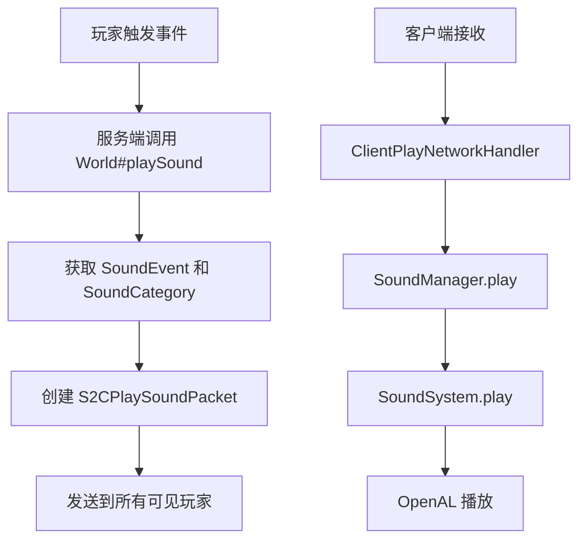
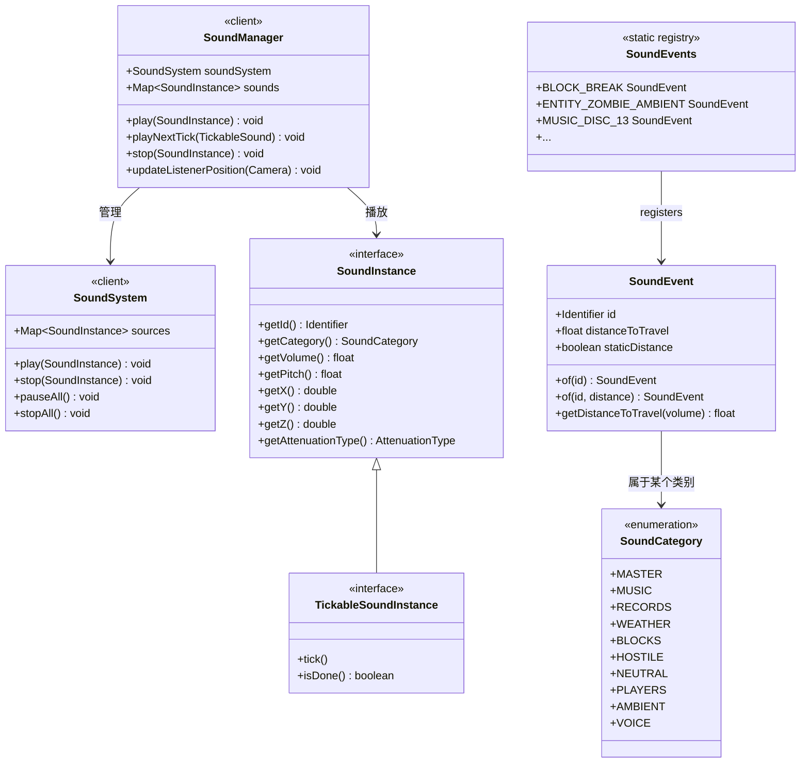

# Minecraft 1.21 声音系统

> 基于 CFR 0.2.2 反编译源代码的声音系统完整分析
> 版本信息: Protocol 767, World Version 3953

---

## 1. 概述

声音系统是 Minecraft 沉浸式体验的核心，涵盖方块交互音、生物叫声、环境音乐、天气音效等全部音频反馈。1.21 版本保持了完整的声音引擎架构，并引入了新的声音事件和更好的空间化处理。

### 1.1 声音系统架构

```
┌─────────────────────────────────────────────────────────────┐
│                    声音系统核心架构                            │
├─────────────────────────────────────────────────────────────┤
│                                                             │
│  ┌──────────────────┐   ┌──────────────────────────────┐   │
│  │   SoundEvent      │   │     SoundCategory           │   │
│  │   (声音事件)        │   │     (音量通道)              │   │
│  └────────┬─────────┘   └──────────────┬─────────────┘   │
│           │                              │                  │
│           │         ┌────────────────────┘                  │
│           │         ▼                                       │
│  ┌──────────────────────────┐                              │
│  │    SoundInstance          │                              │
│  │  (声音实例 - 接口)        │                              │
│  └────────────┬─────────────┘                              │
│               │                                             │
│    ┌──────────┼──────────┐                                   │
│    ▼          ▼          ▼                                   │
│ ┌──────┐ ┌─────────┐ ┌───────────┐                          │
│ │Moving │ │Tickable │ │Ambient    │                          │
│ │Sound  │ │Sound    │ │Sound      │                          │
│ └──────┘ └─────────┘ └───────────┘                          │
│                                                             │
│  ┌──────────────────────────┐                              │
│  │   SoundManager           │                              │
│  │   (客户端管理器)          │                              │
│  └──────────────────────────┘                              │
│                                                             │
└─────────────────────────────────────────────────────────────┘
```

---

## 2. 核心类详解

### 2.1 SoundEvent - 声音事件

`SoundEvent` 是声音资源的核心标识，类似于资源定位符，包含 ID、传播距离等信息。

```net/minecraft/sound/SoundEvent.java
public class SoundEvent {
    private final Identifier id;
    private final float distanceToTravel;
    private final boolean staticDistance;

    // 创建一个默认声音事件（传播距离 16 格）
    public static SoundEvent of(Identifier id) {
        return new SoundEvent(id, 16.0f, false);
    }

    // 创建一个自定义传播距离的声音事件
    public static SoundEvent of(Identifier id, float distanceToTravel) {
        return new SoundEvent(id, distanceToTravel, true);
    }

    // 根据音量计算实际传播距离
    public float getDistanceToTravel(float volume) {
        if (this.staticDistance) {
            return this.distanceToTravel;
        }
        return volume > 1.0f ? 16.0f * volume : 16.0f;
    }
}
```

**关键设计**：
- `id`: 声音资源的唯一标识符（如 `minecraft:block.stone.break`）
- `distanceToTravel`: 声音可传播的最大距离（默认 16 格）
- `staticDistance`: 标志是否使用固定距离，若否则按音量动态计算

### 2.2 SoundCategory - 声音类别

`SoundCategory` 是音量通道枚举，对应游戏设置中的独立音量滑块。

```net/minecraft/sound/SoundCategory.java
public enum SoundCategory {
    MASTER("master"),      // 总音量（所有声音的总开关）
    MUSIC("music"),        // 背景音乐
    RECORDS("record"),     // 唱片机音乐
    WEATHER("weather"),    // 天气声音（雨声、雷声）
    BLOCKS("block"),       // 方块声音（挖掘、放置）
    HOSTILE("hostile"),    // 敌对生物声音
    NEUTRAL("neutral"),    // 中立生物声音
    PLAYERS("player"),     // 玩家声音
    AMBIENT("ambient"),    // 环境声音（洞穴背景音）
    VOICE("voice");        // 语音/生物叫声

    private final String name;
}
```

### 2.3 SoundInstance - 声音实例接口

`SoundInstance` 是播放中的声音实例的通用接口：

```net/minecraft/sound/SoundInstance.java
public interface SoundInstance extends Identifiable {
    // 获取声音资源标识符
    Identifier getId();

    // 获取音量通道
    SoundCategory getCategory();

    // 获取音量（0.0 - 无限）
    float getVolume();

    // 获取音调（0.5 - 2.0）
    float getPitch();

    // 获取 3D 位置
    double getX();
    double getY();
    double getZ();

    // 获取衰减类型
    AttenuationType getAttenuationType();

    // 获取参考距离
    float getReferenceDistance();

    // 获取半衰减距离
    float getSemiDecayDistance();
}
```

### 2.4 TickableSoundInstance - 可 tick 的声音

用于需要持续更新的声音，如唱片机播放：

```net/minecraft/sound/TickableSoundInstance.java
public interface TickableSoundInstance extends SoundInstance {
    // 每 tick 更新
    void tick();

    // 是否播放完成
    boolean isDone();
}
```

### 2.5 AmbientSoundLoops - 环境音循环

客户端环境音播放器：

```net/minecraft/client/world/ClientWorld.java
// 在 ClientWorld 初始化时创建
this.tickables.add(new AmbientSoundLoops(this, client.getSoundManager()));
this.tickables.add(new BubbleColumnSoundPlayer(this));
this.tickables.add(new BiomeEffectSoundPlayer(this, client.getSoundManager()));
```

---

## 3. 内置声音事件注册表

`SoundEvents` 静态类注册了所有内置声音事件：

```net/minecraft/sound/SoundEvents.java
public class SoundEvents {
    // ===== 方块声音 =====
    public static final SoundEvent BLOCK_BREAK = register("block.stone.break", 1.0f);
    public static final SoundEvent BLOCK_PLACE = register("block.stone.hit", 1.0f);
    public static final SoundEvent BLOCK_BELL_HIT = register("block.bell.hit");
    public static final SoundEvent BLOCK_BELL_USE = register("block.bell.use");
    public static final SoundEvent UI_STONECUTTER_TAKE_RESULT = register("ui.stonecutter.take_result");
    public static final SoundEvent UI_CARTOGRAPHY_TABLE_TAKE_RESULT = register("ui.cartography_table.take_result");
    public static final SoundEvent UI_LOOM_TAKE_RESULT = register("ui.loom.take_result");
    public static final SoundEvent UI_STONECUTTER_SELECT_RECIPE = register("ui.stonecutter.select_recipe");
    public static final SoundEvent UI_CARTOGRAPHY_TABLE_SELECT_RECIPE = register("ui.cartography_table.select_recipe");
    public static final SoundEvent UI_LOOM_SELECT_RECIPE = register("ui.loom.select_recipe");

    // ===== 生物声音 =====
    public static final SoundEvent ENTITY_GENERIC_EXPLODE = register("entity.generic.explode");
    public static final SoundEvent ENTITY_ZOMBIE_AMBIENT = register("entity.zombie.ambient");
    public static final SoundEvent ENTITY_ZOMBIE_HURT = register("entity.zombie.hurt");
    public static final SoundEvent ENTITY_ZOMBIE_DEATH = register("entity.zombie.death");
    public static final SoundEvent ENTITY_ZOMBIE_VILLAGER_AMBIENT = register("entity.zombie_villager.ambient");
    public static final SoundEvent ENTITY_ZOMBIE_VILLAGER_CURE = register("entity.zombie_villager.cure");
    public static final SoundEvent ENTITY_ENDER_DRAGON_AMBIENT = register("entity.ender_dragon.ambient");
    public static final SoundEvent ENTITY_ENDER_DRAGON_DEATH = register("entity.ender_dragon.death");
    public static final SoundEvent ENTITY_ENDER_DRAGON_FLAP = register("entity.ender_dragon.flap");
    public static final SoundEvent ENTITY_ENDER_DRAGON_GROWL = register("entity.ender_dragon.growl");
    public static final SoundEvent ENTITY_ENDER_DRAGON_HURT = register("entity.ender_dragon.hurt");
    public static final SoundEvent ENTITY_ENDER_DRAGON_SHOOT = register("entity.ender_dragon.shoot");
    public static final SoundEvent ENTITY_ENDERMAN_AMBIENT = register("entity.enderman.ambient");
    public static final SoundEvent ENTITY_ENDERMAN_DEATH = register("entity.enderman.death");
    public static final SoundEvent ENTITY_ENDERMAN_HURT = register("entity.enderman.hurt");
    public static final SoundEvent ENTITY_ENDERMAN_TELEPORT = register("entity.enderman.teleport");
    public static final SoundEvent ENTITY_ENDERMAN_PICKUP_ANGRY = register("entity.enderman.pickup_angry");
    public static final SoundEvent ENTITY_ENDERMAN_PICKUP_NEUTRAL = register("entity.enderman.pickup_neutral");

    // ===== 天气声音 =====
    public static final SoundEvent WEATHER_RAIN = register("weather.rain");
    public static final SoundEvent WEATHER_RAIN_ABOVE = register("weather.rain.above");

    // ===== 音乐唱片 =====
    public static final SoundEvent MUSIC_DISC_13 = register("music_disc.13");
    public static final SoundEvent MUSIC_DISC_CAT = register("music_disc.cat");
    public static final SoundEvent MUSIC_DISC_BLOCKS = register("music_disc.blocks");
    public static final SoundEvent MUSIC_DISC_CHIRP = register("music_disc.chirp");
    public static final SoundEvent MUSIC_DISC_FAR = register("music_disc.far");
    public static final SoundEvent MUSIC_DISC_MALL = register("music_disc.mall");
    public static final SoundEvent MUSIC_DISC_MELLOHI = register("music_disc.mellohi");
    public static final SoundEvent MUSIC_DISC_STAL = register("music_disc.stal");
    public static final SoundEvent MUSIC_DISC_STRAD = register("music_disc.strad");
    public static final SoundEvent MUSIC_DISC_WARD = register("music_disc.ward");
    public static final SoundEvent MUSIC_DISC_11 = register("music_disc.11");
    public static final SoundEvent MUSIC_DISC_WAIT = register("music_disc.wait");
    public static final SoundEvent MUSIC_DISC_OTHERSIDE = register("music_disc.otherside");
    public static final SoundEvent MUSIC_DISC_PIGSTEP = register("music_disc.pigstep");

    // ===== UI 声音 =====
    public static final SoundEvent UI_BUTTON_CLICK = register("ui.button.click");
    public static final SoundEvent UI_TOAST_CHALLENGE_COMPLETE = register("ui.toast.challenge_complete");
    public static final SoundEvent UI_TOAST_VICTORY = register("ui.toast.victory");
    public static final SoundEvent UI_TOAST_ADVANCEMENT = register("ui.toast.advancement");
}
```

---

## 4. 声音管理器

### 4.1 SoundManager 类

客户端声音管理器，继承自资源重载器：

```net/minecraft/client/sound/SoundManager.java
@Environment(value=EnvType.CLIENT)
public class SoundManager extends SinglePreparationResourceReloader<SoundList> {
    // SoundSystem 实例
    private final SoundSystem soundSystem;

    // 活跃声音实例映射
    private final Map<SoundInstance, Integer> sounds = new HashMap<>();

    // Tickable 声音列表
    private final Collection<TickableSoundInstance> tickableSounds = new ObjectArraySet<>();

    // 监听器位置（相机位置）
    private Vec3d listenerPosition = Vec3d.ZERO;
    private Vec3d listenerVelocity = Vec3d.ZERO;

    // 播放声音
    public void play(SoundInstance sound) {
        this.soundSystem.play(sound);
    }

    // 播放可 tick 的声音（下一帧）
    public void playNextTick(TickableSoundInstance sound) {
        this.soundSystem.playNextTick(sound);
    }

    // 播放带延时的声音
    public <T extends SoundInstance> int play(T sound, Function<T, Integer> idFactory) {
        int id = idFactory.apply(sound);
        this.sounds.put(sound, id);
        return id;
    }

    // 停止指定声音
    public void stop(SoundInstance sound) {
        this.soundSystem.stop(sound);
    }

    // 更新监听器位置
    public void updateListenerPosition(Camera camera) {
        this.listenerPosition = camera.getPos();
        this.soundSystem.updateListenerPosition(camera);
    }

    // 暂停所有声音
    public void pauseAll() {
        this.soundSystem.pauseAll();
    }

    // 停止所有声音
    public void stopAll() {
        this.sounds.clear();
        this.soundSystem.stopAll();
    }

    // 加载声音资源
    public void loadSoundSystem(RegistryWrapper<SoundEvent> soundEventRegistry) {
        // 初始化 SoundSystem
    }

    // 添加 Tickable 声音
    public void addTickableSound(TickableSoundInstance sound) {
        this.tickableSounds.add(sound);
    }
}
```

### 4.2 SoundSystem 类

底层的 OpenAL 包装器，处理实际的音频播放：

```net/minecraft/client/sound/SoundSystem.java
@Environment(value=EnvType.CLIENT)
public class SoundSystem implements AutoCloseable {
    // OpenAL Source 池
    private final Map<SoundInstance, Integer> sources = new HashMap<>();

    // 暂停状态
    private boolean paused = false;

    // 播放声音
    public void play(SoundInstance sound) {
        int source = this.acquireSource(sound);
        // 配置源参数
        this.setSourceParams(source, sound);
        // 开始播放
        alSourcei(source, AL_SOURCE_STATE, AL_PLAYING);
    }

    // 下一 tick 播放（用于 tick 内触发的声音）
    public void playNextTick(SoundInstance sound) {
        this.pendingSounds.add(sound);
    }

    // 停止声音
    public void stop(SoundInstance sound) {
        Integer source = this.sources.remove(sound);
        if (source != null) {
            alSourceStop(source);
            this.releaseSource(source);
        }
    }

    // 停止所有声音
    public void stopAll() {
        for (Integer source : this.sources.values()) {
            alSourceStop(source);
            this.releaseSource(source);
        }
        this.sources.clear();
    }

    // 暂停所有
    public void pauseAll() {
        this.paused = true;
        for (Integer source : this.sources.values()) {
            alSourcePause(source);
        }
    }

    // 恢复所有
    public void resumeAll() {
        this.paused = false;
        for (Integer source : this.sources.values()) {
            alSourcePlay(source);
        }
    }

    // 更新监听器位置和方向
    public void updateListenerPosition(Camera camera) {
        // 更新 OpenAL listener 位置
        alListener3f(AL_POSITION, (float) camera.getPos().x, ...);
        // 更新方向
        // ...
    }
}
```

---

## 5. 声音播放流程

### 5.1 服务端播放（网络同步）



### 5.2 服务端声音播放方法

```net/minecraft/world/World.java
// 在指定位置播放声音（所有能听到的玩家都能听到）
public void playSound(PlayerEntity player, double x, double y, double z,
                      SoundEvent sound, SoundCategory category,
                      float volume, float pitch, long seed) {
    if (this.isClient) {
        // 客户端：直接播放
        this.client.getSoundManager().play(...)
    } else {
        // 服务端：发送到所有客户端
        ServerPlayNetworking.send(...) // 通过数据包同步
    }
}

// 在服务端播放给指定玩家
public void playSoundToPlayer(PlayerEntity player, SoundEvent sound,
                               SoundCategory category,
                               double x, double y, double z,
                               float volume, float pitch, long seed) {
    ((ServerPlayerEntity) player).networkHandler.sendPacket(
        new S2CPlaySoundPacket(...)
    );
}

// 播放无声事件（仅触发服务端逻辑）
public void playNeutralSound(PlayerEntity player, SoundEvent sound, float volume, float pitch) {
    // 用于不需同步的纯客户端效果
}
```

---

## 6. 衰减与距离管理

### 6.1 声音衰减类型

```net/minecraft/sound/SoundInstance.java
public enum AttenuationType {
    NONE,     // 无衰减（全局声音）
    LINEAR    // 线性衰减（3D 声音）
}
```

### 6.2 距离计算

```java
// 线性衰减公式
public float getGainAtDistance(float distance) {
    float referenceDistance = this.getReferenceDistance();  // 通常 16 格
    float halfDecayDistance = this.getSemiDecayDistance();  // 半衰减距离

    if (distance <= referenceDistance) {
        return 1.0f;
    }
    return Math.max(0.0f, 1.0f - (distance - referenceDistance) / halfDecayDistance);
}
```

### 6.3 实际衰减计算

```java
// 在 SoundSystem 中应用衰减
public void setSourceParams(int source, SoundInstance sound) {
    // 位置
    alSource3f(source, AL_POSITION, (float) sound.getX(), (float) sound.getY(), (float) sound.getZ());

    // 速度（用于多普勒效应）
    alSource3f(source, AL_VELOCITY, ...);

    // 音量 = 用户音量 × 类别音量 × 距离衰减
    float volume = sound.getVolume();
    if (sound.getAttenuationType() == AttenuationType.LINEAR) {
        float distance = calculateDistance(sound);
        volume *= getGainAtDistance(distance);
    }
    alSourcef(source, AL_GAIN, volume);

    // 音调
    alSourcef(source, AL_PITCH, sound.getPitch());

    // 距离模型
    alDistanceModel(AL_LINEAR_DISTANCE_CLAMPED);
    alSourcef(source, AL_REFERENCE_DISTANCE, sound.getReferenceDistance());
    alSourcef(source, AL_MAX_DISTANCE, sound.getDistanceToTravel());
}
```

---

## 7. 唱片机音乐系统

### 7.1 JukeboxManager

```net/minecraft/block/entity/JukeboxBlockEntity.java
public class JukeboxBlockEntity extends BlockEntity implements Tickable {
    // 当前播放的唱片
    private ItemStack record = ItemStack.EMPTY;

    // 播放时长计数
    private int songPosition = 0;

    // 是否正在播放
    private boolean isPlaying = false;

    // 播放唱片
    public void playRecord(ItemStack record) {
        this.record = record;
        this.isPlaying = true;
        // 播放音乐唱片声音
        SoundEvent sound = getMusicDiscSound(record);
        this.world.playSound(null, this.getPos(), sound,
            SoundCategory.RECORDS, 1.0f, 1.0f);
    }

    // 停止播放
    public void stopRecord() {
        this.isPlaying = false;
        // 停止声音
        // ...
    }

    @Override
    public void tick() {
        if (this.isPlaying) {
            this.songPosition++;
            if (this.songPosition >= getSongDuration(this.record)) {
                // 检查是否循环
                if (this.getComparatorOutput() > 0) {
                    this.songPosition = 0; // 循环
                } else {
                    this.stopRecord();
                }
            }
        }
    }
}
```

### 7.2 唱片机唱片映射

```java
// 获取唱片对应的音乐声音事件
private static final Map<Item, SoundEvent> DISC_SOUNDS = Map.of(
    Items.MUSIC_DISC_13, SoundEvents.MUSIC_DISC_13,
    Items.MUSIC_DISC_CAT, SoundEvents.MUSIC_DISC_CAT,
    Items.MUSIC_DISC_BLOCKS, SoundEvents.MUSIC_DISC_BLOCKS,
    Items.MUSIC_DISC_CHIRP, SoundEvents.MUSIC_DISC_CHIRP,
    Items.MUSIC_DISC_FAR, SoundEvents.MUSIC_DISC_FAR,
    Items.MUSIC_DISC_MALL, SoundEvents.MUSIC_DISC_MALL,
    Items.MUSIC_DISC_MELLOHI, SoundEvents.MUSIC_DISC_MELLOHI,
    Items.MUSIC_DISC_STAL, SoundEvents.MUSIC_DISC_STAL,
    Items.MUSIC_DISC_STRAD, SoundEvents.MUSIC_DISC_STRAD,
    Items.MUSIC_DISC_WARD, SoundEvents.MUSIC_DISC_WARD,
    Items.MUSIC_DISC_11, SoundEvents.MUSIC_DISC_11,
    Items.MUSIC_DISC_WAIT, SoundEvents.MUSIC_DISC_WAIT,
    Items.MUSIC_DISC_OTHERSIDE, SoundEvents.MUSIC_DISC_OTHERSIDE,
    Items.MUSIC_DISC_PIGSTEP, SoundEvents.MUSIC_DISC_PIGSTEP
);
```

---

## 8. 声音资源格式

### 8.1 JSON 定义格式

```json
{
  "sound_event_id": {
    "sounds": [
      {
        "name": "path/to/sound",
        "pitch": 1.0,
        "volume": 1.0,
        "weight": 1
      },
      {
        "name": "path/to/alternate_sound",
        "pitch": 0.8,
        "volume": 0.5
      }
    ],
    "subtitle": "translation.key"
  }
}
```

### 8.2 资源包结构

```
assets/
└── minecraft/
    └── sounds/
        ├── music/
        │   ├── game/
        │   │   ├── nether/
        │   │   └── end/
        │   └── disc/
        ├── mob/
        │   ├── zombie/
        │   ├── enderman/
        │   └── ...
        ├── note/
        │   ├── harp.ogg
        │   ├── bass.ogg
        │   └── ...
        └── random/
            ├── click.ogg
            ├── pop.ogg
            └── ...
```

---

## 9. Fabric API 扩展

### 9.1 声音事件注册

```java
// 使用 Fabric Sound API 注册自定义声音
SoundEventRegistry.register(Identifier id, float distanceToTravel);
```

### 9.2 自定义声音播放

```java
// 在服务端播放声音
world.playSound(null, x, y, z,
    MyModSounds.CUSTOM_SOUND,  // 自定义 SoundEvent
    SoundCategory.PLAYERS,
    1.0f,  // 音量
    1.0f   // 音调
);

// 播放带随机偏移的声音
world.playSound(null, x, y, z,
    MyModSounds.CUSTOM_SOUND,
    SoundCategory.PLAYERS,
    1.0f,
    random.nextFloat() * 0.5f + 0.75f  // 随机音调
);
```

---

## 10. 类图总结



---

## 11. 常见声音速查表

| 类别 | 声音 ID 示例 | 用途 |
|------|-------------|------|
| 方块 | `block.stone.break` | 挖掘石头 |
| 方块 | `block.bell.hit` | 钟被敲击 |
| 天气 | `weather.rain` | 下雨声 |
| 天气 | `weather.rain.above` | 从上方听到的雨声 |
| 生物 | `entity.zombie.ambient` | 僵尸ambient叫声 |
| 生物 | `entity.ender_dragon.death` | 末影龙死亡 |
| 唱片 | `music_disc.13` | 唱片 #13 |
| UI | `ui.button.click` | 按钮点击 |
| 音乐 | `music.game.nether` | 下界背景音乐 |
| 环境 | `ambient.cave` | 洞穴环境音 |

---

## 12. 总结

| 组件 | 职责 | 关键类 |
|------|------|--------|
| `SoundEvent` | 声音的标识和传播距离 | 核心标识符 |
| `SoundCategory` | 音量通道 | 对应设置中的音量滑块 |
| `SoundInstance` | 播放中的声音实例 | 包含位置、音量、音调 |
| `TickableSoundInstance` | 需每 tick 更新的声音 | 唱片机、音乐 |
| `SoundManager` | 客户端管理器 | 资源加载和播放调度 |
| `SoundSystem` | OpenAL 包装器 | 实际的音频播放 |
| `AttenuationType` | 衰减类型 | 控制距离衰减方式 |

声音播放遵循 **SoundEvent + SoundCategory + Volume + Pitch + Position = 完整声音播放请求**，系统根据类别音量计算最终输出音量并应用距离衰减。
