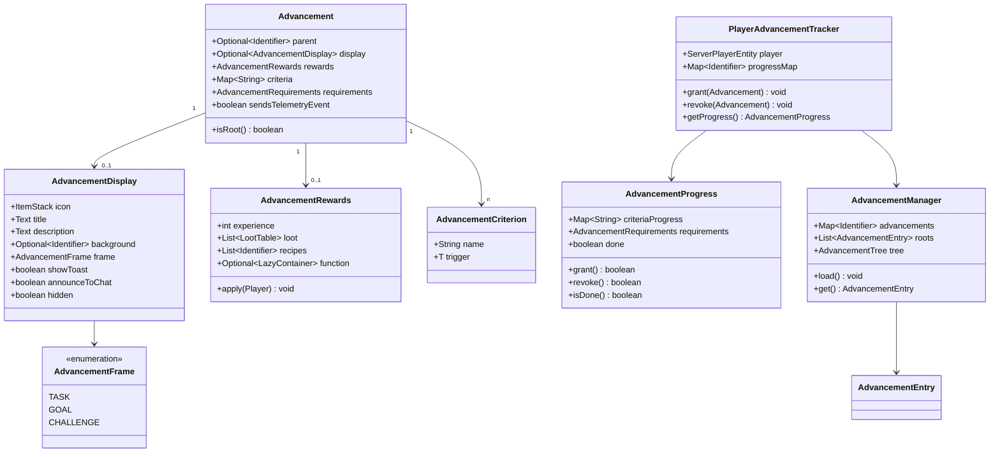

# Minecraft 1.21 进度系统

> 基于 CFR 0.2.2 反编译源代码的进度/成就系统完整分析
> 版本信息: Protocol 767, World Version 3953

---

## 1. 概述

进度系统（Advancement System）是 Minecraft 的成就/任务系统，允许玩家在完成特定条件后获得奖励、解锁配方、展示成就提示。系统采用树形结构组织，支持复杂的条件逻辑和丰富的奖励机制。

### 1.1 进度系统架构

```
┌─────────────────────────────────────────────────────────────┐
│                    进度系统核心架构                            │
├─────────────────────────────────────────────────────────────┤
│                                                             │
│  ┌──────────────────┐   ┌──────────────────────────────┐   │
│  │   Advancement     │   │     AdvancementDisplay       │   │
│  │   (进度条目)       │◄──│     (显示信息)               │   │
│  └────────┬─────────┘   └──────────────┬─────────────┘   │
│           │                              │                  │
│           │         ┌────────────────────┘                  │
│           ▼         ▼                                       │
│  ┌──────────────────────────┐                              │
│  │  Map~String~ Criteria     │                              │
│  │  (条件映射)               │                              │
│  └────────────┬─────────────┘                              │
│               │                                             │
│               ▼                                             │
│  ┌──────────────────────────┐                              │
│  │  AdvancementRewards      │                              │
│  │  (奖励)                   │                              │
│  └──────────────────────────┘                              │
│                                                             │
│  ┌──────────────────────────┐                              │
│  │  AdvancementManager      │                              │
│  │  (服务端管理器)            │                              │
│  └──────────────────────────┘                              │
│                                                             │
└─────────────────────────────────────────────────────────────┘
```

---

## 2. 核心类详解

### 2.1 Advancement - 进度条目

```net/minecraft/advancement/Advancement.java
public record Advancement(
    Optional<Identifier> parent,                    // 父进度
    Optional<AdvancementDisplay> display,           // 显示信息
    AdvancementRewards rewards,                      // 奖励
    Map<String, AdvancementCriterion<?>> criteria,  // 条件列表
    AdvancementRequirements requirements,            // 条件要求
    boolean sendsTelemetryEvent                      // 是否发送遥测
) {
    // 检查是否是根进度
    public boolean isRoot() {
        return this.parent.isEmpty();
    }

    // 获取所有条件
    public String[] getRequirements() {
        return this.requirements.getRequirementNames();
    }

    // 获取条件数量
    public int getRequirementCount() {
        return this.requirements.size();
    }
}
```

### 2.2 AdvancementEntry - 进度入口

```net/minecraft/advancement/AdvancementEntry.java
public record AdvancementEntry(
    Identifier id,      // 进度的完整 ID
    Advancement value   // 进度数据
) {}
```

### 2.3 AdvancementDisplay - 显示信息

```net/minecraft/advancement/DisplayInfo.java
public class DisplayInfo {
    private final ItemStack icon;              // 显示图标
    private final Text title;                  // 标题
    private final Text description;            // 描述
    private final Optional<Identifier> background;  // 背景纹理
    private final AdvancementFrame frame;      // 框架类型
    private final float toastX;                // Toast X 偏移
    private final float toastY;                // Toast Y 偏移
    private final float chatX;                // 聊天 X 偏移
    private final float chatY;                // 聊天 Y 偏移
    private final boolean showToast;           // 显示弹窗
    private final boolean announceToChat;       // 发送到聊天
    private final boolean hidden;              // 是否隐藏

    // 框架类型
    private final AdvancementFrame frame;
}
```

### 2.4 AdvancementFrame - 框架类型枚举

```net/minecraft/advancement/AdvancementFrame.java
public enum AdvancementFrame {
    TASK("task", false),     // 任务（绿色对勾）- 普通难度
    GOAL("goal", false),     // 目标（绿色旗帜）- 中等难度
    CHALLENGE("challenge", true); // 挑战（红色感叹号）- 高难度

    private final String name;
    private final boolean isChallenge;

    public String getName() {
        return this.name;
    }

    public boolean isChallenge() {
        return this.isChallenge;
    }
}
```

### 2.5 AdvancementRewards - 奖励

```net/minecraft/advancement/AdvancementRewards.java
public record AdvancementRewards(
    int experience,                           // 经验值
    List<RegistryKey<LootTable>> loot,        // 战利品表列表
    List<Identifier> recipes,                 // 配方列表
    Optional<LazyContainer> function          // 函数容器
) {
    // 无奖励的静态实例
    public static final AdvancementRewards EMPTY = new AdvancementRewards(
        0, List.of(), List.of(), Optional.empty()
    );

    // 应用奖励到玩家
    public void apply(ServerPlayerEntity player) {
        // 给予经验
        if (this.experience > 0) {
            player.addExperience(this.experience);
        }

        // 生成战利品
        for (RegistryKey<LootTable> lootTable : this.loot) {
            LootTable table = player.getServer().getLootManager().getLootTable(lootTable);
            LootContext context = LootContext.createVillageTradeContext(player, player.getRandom());
            table.generateLoot(context, stack -> {
                player.getInventory().offerOrDrop(stack);
            });
        }

        // 解锁配方
        for (Identifier recipeId : this.recipes) {
            player.unlockRecipes(player.getServer().getRecipeManager()
                .getAllMatches(recipeId, player));
        }

        // 执行函数
        this.function.ifPresent(func -> {
            ServerCommandSource source = player.getCommandSource()
                .withLevel(2)
                .withPosition(player.getPos());
            func.run(source);
        });
    }

    // Builder 模式构建器
    public static Builder builder() {
        return new Builder();
    }

    public static class Builder {
        private int experience = 0;
        private final List<RegistryKey<LootTable>> loot = new ArrayList<>();
        private final List<Identifier> recipes = new ArrayList<>();
        private Optional<LazyContainer> function = Optional.empty();

        public Builder experience(int amount) {
            this.experience = amount;
            return this;
        }

        public Builder addLoot(RegistryKey<LootTable> lootTable) {
            this.loot.add(lootTable);
            return this;
        }

        public Builder addRecipe(Identifier recipeId) {
            this.recipes.add(recipeId);
            return this;
        }

        public Builder赢() {
            this.function = Optional.of(LazyContainer.of(() -> {
                // 构建函数
            }));
            return this;
        }

        public AdvancementRewards build() {
            return new AdvancementRewards(experience, loot, recipes, function);
        }
    }
}
```

### 2.6 AdvancementCriterion - 单个条件

```net/minecraft/advancement/criterion/AdvancementCriterion.java
public class AdvancementCriterion<T extends LootConditionAwareBuilder> {
    private final String name;                    // 条件名称
    private final T trigger;                       // 触发器
    private final Optional<PlayerAdvancementTracker.Formatted> formatted;  // 格式化

    public String getName() {
        return this.name;
    }

    public T getTrigger() {
        return this.trigger;
    }
}
```

---

## 3. 触发器系统

### 3.1 Criteria 类 - 触发器注册表

```net/minecraft/advancement/criterion/Criteria.java
public class Criteria {
    // 预定义的触发器
    public static final Criteria INVENTORY_CHANGED =
        new Criteria("inventory_changed");

    public static final Criteria PLAYER_KILLED_ENTITY =
        new Criteria("player_killed_entity");

    public static final Criteria ENTITY_KILLED_PLAYER =
        new Criteria("entity_killed_player");

    public static final Criteria ENTER_BLOCK =
        new Criteria("enter_block");

    public static final Criteria EXIT_BLOCK =
        new Criteria("exit_block");

    public static final Criteria EFFECTS_CHANGED =
        new Criteria("effects_changed");

    public static final Criteria RECIPE_UNLOCKED =
        new Criteria("recipe_unlocked");

    public static final Criteria TICK =
        new Criteria("tick");

    public static final Criteria LOCATION =
        new Criteria("location");

    public static final Criteria BRED_ANIMALS =
        new Criteria("bred_animals");

    public static final Criteria NETHER_TRAVEL =
        new Criteria("nether_travel");

    public static final Criteria BEE_GROW_CROP =
        new Criteria("bee_grow_crop");

    public static final Criteria VOLUNTARY_EXILE =
        new Criteria("voluntary_exile");

    public static final Criteria HUSK_CONVERTED =
        new Criteria("husk_converted");

    public static final Criteria AVOID_VEX =
        new Criteria("avoid_vex");

    public static final Criteria FALL_FROM_HEIGHT =
        new Criteria("fall_from_height");

    public static final Criteria LEVITATE =
        new Criteria("levitate");

    public static final Criteria THROWN_ITEM_PICKED_UP_BY_ENTITY =
        new Criteria("thrown_item_picked_up_by_entity");

    public static final Criteria FILLED_BUCKET =
        new Criteria("filled_bucket");

    public static final Criteria PLACED_BLOCK =
        new Criteria("placed_block");

    public static final Criteria CONSUME_ITEM =
        new Criteria("consume_item");

    public static final Criteria CRITically_HIT_ENTITY =
        new Criteria("critically_hit_entity");

    public static final Criteria KILLED_BY_EXPLOSION =
        new Criteria("killed_by_explosion");

    public static final Criteria CROSSBOW_HIT_ENTITY =
        new Criteria("crossbow_hit_entity");

    public static final Criteria AMBIENT_MUSIC_DISK =
        new Criteria("ambient_music_disk");

    public static final Criteria READ_USING_COMPASS =
        new Criteria("read_using_compass");

    public static final Criteria GOAT_MILK =
        new Criteria("goat_milk");

    public static final Criteria CLEAN_BANNER =
        new Criteria("clean_banner");

    public static final Criteria CAULDRON_FILLED =
        new Criteria("cauldron_filled");

    public static final Criteria CAULDRON_USED =
        new Criteria("cauldron_used");

    public static final Criteria BOMB_LANDED_NEAR_PLAYER =
        new Criteria("bomb_landed_near_player");

    public static final Criteria CUT_AIRCRAFT =
        new Criteria("cut_airdhip");

    public static final Criteria SHOOT_ARROW =
        new Criteria("shoot_arrow");

    public static final Criteria KILLED_BY_RANGED_PROJECTILE =
        new Criteria("killed_by_ranged_projectile");
}
```

### 3.2 常用触发器详解

#### 3.2.1 inventory_changed - 背包变化

```json
{
    "trigger": "minecraft:inventory_changed",
    "conditions": {
        "items": [
            {
                "items": ["minecraft:diamond"],
                "count": {"min": 10}
            }
        ]
    }
}
```

#### 3.2.2 player_killed_entity - 击杀实体

```json
{
    "trigger": "minecraft:player_killed_entity",
    "conditions": {
        "entity": {
            "type": "minecraft:creeper",
            "nbt": "{powered: true}"
        }
    }
}
```

#### 3.2.3 enter_block - 进入方块

```json
{
    "trigger": "minecraft:enter_block",
    "conditions": {
        "block": "minecraft:beehive",
        "state": {
            "honey_level": 5
        }
    }
}
```

#### 3.2.4 location - 位置检查

```json
{
    "trigger": "minecraft:location",
    "conditions": {
        "biome": "minecraft:desert",
        "dimension": "minecraft:overworld"
    }
}
```

---

## 4. 进度管理器

### 4.1 AdvancementManager

```net/minecraft/advancement/AdvancementManager.java
public class AdvancementManager extends JsonDataLoader {
    // 所有已加载的进度
    private Map<Identifier, AdvancementEntry> advancements = new HashMap<>();

    // 根进度列表
    private List<AdvancementEntry> roots = new ArrayList<>();

    // 进度树
    private AdvancementTree tree = new AdvancementTree();

    // 加载进度
    public void load(RegistryWrapper<Advancement> registry, Path path) {
        this.loadAdvancementTree(registry, path);
        this.tree.rebuild();
    }

    // 获取进度
    public AdvancementEntry get(Identifier id) {
        return this.advancements.get(id);
    }

    // 获取所有进度
    public Collection<AdvancementEntry> getAll() {
        return this.advancements.values();
    }

    // 序列化到 JSON
    public void serializeToJson(Advancement advancement, JsonObject json) {
        // 序列化逻辑
    }
}
```

### 4.2 PlayerAdvancementTracker

```net/minecraft/advancement/PlayerAdvancementTracker.java
public class PlayerAdvancementTracker {
    // 玩家引用
    private final ServerPlayerEntity player;

    // 进度状态映射
    private final Map<Identifier, AdvancementProgress> progressMap = new HashMap<>();

    // 刷新的进度（需要同步到客户端）
    private final Set<Identifier> refreshed = new HashSet<>();

    // 进度发布（给所有监听器）
    public void grant(AdvancementEntry advancement) {
        // 授予进度
        AdvancementProgress progress = this.getProgress(advancement);
        if (progress.grant()) {  // 如果进度完成
            // 发送奖励
            advancement.getValue().rewards().apply(this.player);
            // 通知监听器
            thisListeners.forEach(listener ->
                listener.onAdvancementGranted(this.player, advancement));
            // 标记为已刷新
            this.refreshed.add(advancement.getId());
        }
    }

    // 撤销进度
    public void revoke(AdvancementEntry advancement) {
        AdvancementProgress progress = this.getProgress(advancement);
        if (progress.revoke()) {
            thisListeners.forEach(listener ->
                listener.onAdvancementRevoked(this.player, advancement));
            this.refreshed.add(advancement.getId());
        }
    }

    // 发送刷新到客户端
    public void sendRefreshedPackets() {
        if (!this.refreshed.isEmpty()) {
            this.player.networkHandler.sendPacket(
                new S2CAdvancementUpdatePacket(this.refreshed, this.progressMap));
            this.refreshed.clear();
        }
    }

    // 获取或创建进度
    public AdvancementProgress getProgress(AdvancementEntry advancement) {
        return this.progressMap.computeIfAbsent(
            advancement.getId(),
            id -> new AdvancementProgress(
                advancement.getValue().criteria(),
                advancement.getValue().requirements()
            )
        );
    }
}
```

### 4.3 AdvancementProgress - 进度状态

```net/minecraft/advancement/AdvancementProgress.java
public class AdvancementProgress {
    // 条件状态映射
    private final Map<String, CriterionProgress> criteriaProgress;

    // 要求（条件组合）
    private final AdvancementRequirements requirements;

    // 是否完成
    private volatile boolean done;

    // 尝试授予进度
    public boolean grant() {
        if (!this.done && this.requirements.test(this.criteriaProgress)) {
            this.done = true;
            return true;
        }
        return false;
    }

    // 尝试撤销进度
    public boolean revoke() {
        if (this.done) {
            this.done = false;
            return true;
        }
        return false;
    }

    // 是否完成
    public boolean isDone() {
        return this.done;
    }

    // 获取条件进度
    public CriterionProgress getCriterionProgress(String criterion) {
        return this.criteriaProgress.get(criterion);
    }
}
```

---

## 5. 进度树结构

### 5.1 AdvancementTree 类

```net/minecraft/advancement/AdvancementTree.java
public class AdvancementTree {
    // 树节点
    private final Map<AdvancementEntry, Set<AdvancementEntry>> children = new HashMap<>();
    private final Map<AdvancementEntry, AdvancementEntry> parents = new HashMap<>();

    // 重建树结构
    public void rebuild() {
        this.children.clear();
        this.parents.clear();

        for (AdvancementEntry advancement : this.manager.getAll()) {
            // 建立父子关系
            Advancement value = advancement.getValue();
            value.parent().ifPresentOrElse(
                parentId -> {
                    AdvancementEntry parent = this.manager.get(parentId);
                    if (parent != null) {
                        this.parents.put(advancement, parent);
                        this.children.computeIfAbsent(parent, k -> new HashSet<>())
                            .add(advancement);
                    }
                },
                () -> {
                    // 根进度
                    this.children.put(advancement, new HashSet<>());
                }
            );
        }
    }

    // 获取子进度
    public Set<AdvancementEntry> getChildren(AdvancementEntry parent) {
        return this.children.getOrDefault(parent, Set.of());
    }

    // 获取父进度
    public AdvancementEntry getParent(AdvancementEntry advancement) {
        return this.parents.get(advancement);
    }
}
```

### 5.2 进度树结构图

```
                         [根进度]
                             │
            ┌────────────────┼────────────────┐
            ▼                ▼                ▼
        [冒险开始]        [畜牧]          [矿井]
            │                │                │
            ▼                ▼                ▼
        [钻石!]          [羊羊得意]       [铁器时代]
            │                │                │
            ▼                ▼                ▼
        [钻石装备]        [养牛]           [钻石!]
```

---

## 6. 网络同步

### 6.1 S2CAdvancementUpdatePacket

```net/minecraft/network/packet/s2c/AdvancementUpdateS2CPacket.java
public class AdvancementUpdateS2CPacket implements Packet<ClientPlayPacketListener> {
    // 要刷新的进度
    private final List<AdvancementEntry> advancementsToUpdate;
    private final List<Identifier> advancementsToRemove;
    private final Map<Identifier, AdvancementProgress> progressUpdates;
    private final boolean immediately;

    // 构造函数
    public AdvancementUpdateS2CPacket(
            List<AdvancementEntry> advancementsToUpdate,
            List<Identifier> advancementsToRemove,
            Map<Identifier, AdvancementProgress> progressUpdates,
            boolean immediately) {
        this.immediately = immediately;
    }

    // 解码
    public static AdvancementUpdateS2CPacket read(PacketByteBuf buf) {
        // 从数据包读取进度更新
    }

    // 应用到客户端
    public void apply(ClientPlayPacketListener clientPlayPacketListener) {
        clientPlayPacketListener.onAdvancementUpdate(this);
    }
}
```

---

## 7. JSON 格式完整示例

```json
{
    "display": {
        "icon": {
            "item": "minecraft:diamond"
        },
        "title": "取得钻石！",
        "description": "获得你的第一颗钻石",
        "frame": "task",
        "background": "minecraft:textures/gui/advancements/backgrounds/stone.png",
        "show_toast": true,
        "announce_to_chat": true,
        "hidden": false
    },
    "parent": "minecraft:story/mine_stone",
    "criteria": {
        "diamond": {
            "trigger": "minecraft:inventory_changed",
            "conditions": {
                "items": [
                    {
                        "items": ["minecraft:diamond"]
                    }
                ]
            }
        }
    },
    "requirements": [["diamond"]],
    "rewards": {
        "experience": 100,
        "loot": ["minecraft:gameplay/happy_hero_of_the_village"],
        "recipes": ["minecraft:diamond_pickaxe"]
    },
    "sends_telemetry_event": true
}
```

---

## 8. Requirements 条件组合

### 8.1 默认 AND 逻辑

```json
"criteria": {
    "diamond": {...},
    "emerald": {...}
},
"requirements": [["diamond"], ["emerald"]]
// 必须同时满足 diamond 和 emerald
```

### 8.2 OR 逻辑

```json
"criteria": {
    "diamond": {...},
    "emerald": {...}
},
"requirements": [["diamond", "emerald"]]
// 满足 diamond 或 emerald 任意一个即可
```

### 8.3 复杂组合

```json
"criteria": {
    "diamond": {...},
    "emerald": {...},
    "gold": {...}
},
"requirements": [["diamond", "emerald"], ["gold"]]
// (diamond OR emerald) AND gold
```

---

## 9. 类图总结



---

## 10. 数据保存

进度数据保存在世界目录的 `advancements/` 子目录中：

```
📁 world/
├── 📁 playerdata/
│   └── xxxxxxxx-xxxx-xxxx-xxxx-xxxxxxxxxxxx.dat  # 玩家数据
├── 📁 stats/              # 统计信息
└── 📁 advancements/        # 进度数据
    └── xxxxxxxx-xxxx-xxxx-xxxx-xxxxxxxxxxxx.json  # 每个玩家的进度
```

---

## 11. 总结

| 组件 | 职责 | 关键字段 |
|------|------|----------|
| `Advancement` | 进度主体 | criteria, parent, rewards |
| `AdvancementDisplay` | 显示信息 | icon, title, frame, showToast |
| `AdvancementRewards` | 奖励 | experience, loot, recipes, function |
| `AdvancementCriterion` | 单个条件 | name, trigger |
| `AdvancementProgress` | 完成状态 | criteriaProgress, done |
| `AdvancementManager` | 服务端管理器 | 加载和管理所有进度 |
| `PlayerAdvancementTracker` | 玩家追踪器 | 跟踪单个玩家的进度 |
| `AdvancementTree` | 进度树 | 父子关系管理 |

进度系统遵循 **条件满足 → 父进度检查 → 完成进度 → 给予奖励 → 通知玩家** 的完成流程，通过 `sendsTelemetryEvent` 字段实现遥测数据收集。
