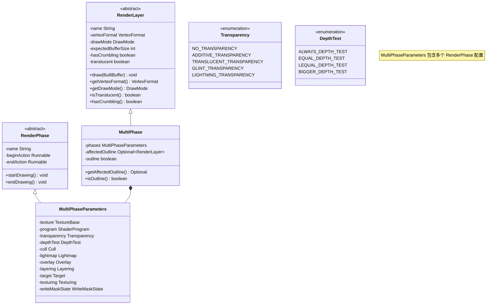
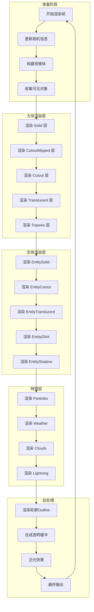
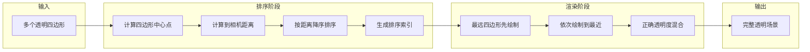
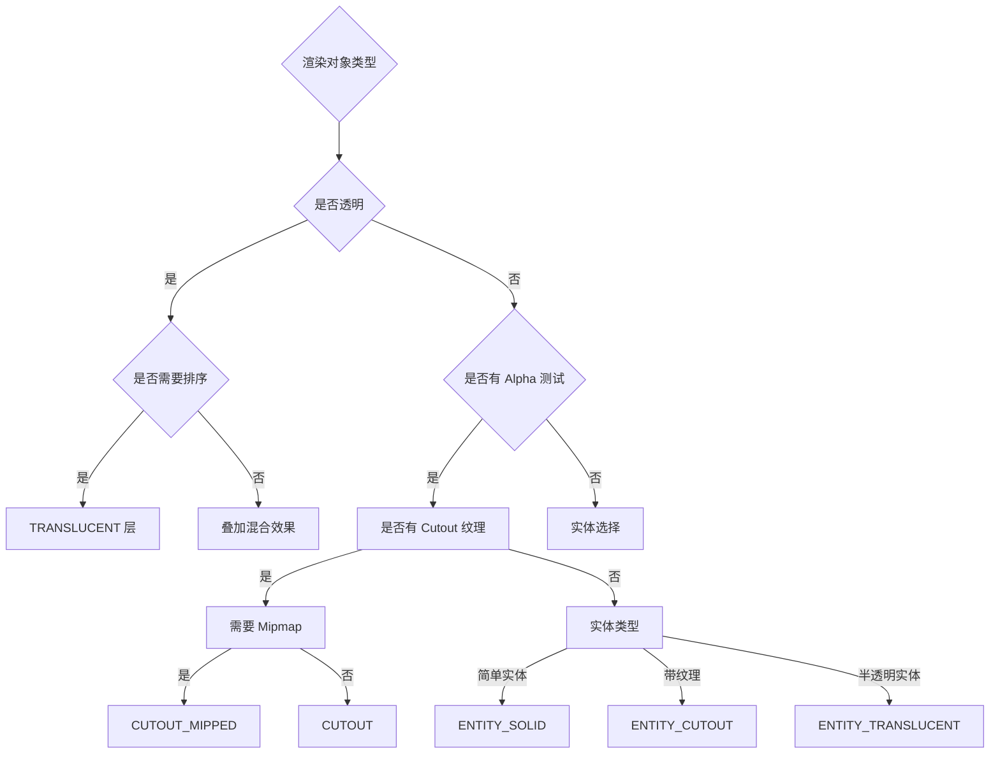

# Minecraft 1.21 渲染层系统深度分析

> 基于 CFR 0.2.2 反编译源代码的渲染层系统完整分析
> 版本信息: Protocol 767, World Version 3953

---

## 概述

渲染层系统（RenderLayer System）是 Minecraft 客户端渲染引擎的核心基础设施，负责定义和管理渲染管线中的各种绘制状态。每个 RenderLayer 代表一组独特的渲染配置，包括顶点格式、着色器程序、纹理绑定、混合模式、深度测试、裁剪面剔除等状态设置。

### 1.1 为什么需要渲染层

Minecraft 的世界由多种不同类型的对象组成，每种对象都有其独特的渲染需求：

- **不透明方块**：需要深度测试和深度写入
- **透明方块**（如玻璃、冰）：需要透明度混合且必须按距离排序
- **实体**：需要特殊的光照处理和轮廓渲染
- **粒子效果**：需要加法混合和特殊的排序
- **文字和UI**：需要独立于3D世界的渲染顺序

渲染层系统通过将相似渲染需求的对象归类到同一层，实现了：
1. **状态最小化**：减少 OpenGL 状态切换开销
2. **正确排序**：确保透明物体从后向前渲染
3. **多目标渲染**：支持延迟渲染和特效后处理
4. **可扩展性**：允许模组添加自定义渲染层

### 1.2 系统架构

```
┌─────────────────────────────────────────────────────────────────────┐
│                        渲染层系统架构                                │
├─────────────────────────────────────────────────────────────────────┤
│                                                                     │
│  ┌───────────────────────────────────────────────────────────────┐   │
│  │                     RenderLayer (抽象基类)                      │   │
│  │  ┌─────────────┬─────────────┬─────────────┬─────────────┐   │   │
│  │  │ 顶点格式    │ 绘制模式     │ 缓冲区大小  │ 渲染状态    │   │   │
│  │  └─────────────┴─────────────┴─────────────┴─────────────┘   │   │
│  └───────────────────────────────────────────────────────────────┘   │
│                            │                                          │
│                            ▼                                          │
│  ┌───────────────────────────────────────────────────────────────┐   │
│  │                   RenderPhase (渲染阶段配置)                      │   │
│  │  ┌─────────────┬─────────────┬─────────────┬─────────────┐   │   │
│  │  │ 着色器程序   │ 透明度模式   │ 深度测试    │ 纹理绑定    │   │   │
│  │  └─────────────┴─────────────┴─────────────┴─────────────┘   │   │
│  │  ┌─────────────┬─────────────┬─────────────┬─────────────┐   │   │
│  │  │ 裁剪面剔除  │ 光照图      │ 叠加颜色    │ 层级偏移    │   │   │
│  │  └─────────────┴─────────────┴─────────────┴─────────────┘   │   │
│  └───────────────────────────────────────────────────────────────┘   │
│                            │                                          │
│                            ▼                                          │
│  ┌───────────────────────────────────────────────────────────────┐   │
│  │                   VertexConsumerProvider                        │   │
│  │              (顶点消费者提供者，管理多图层缓冲)                    │   │
│  └───────────────────────────────────────────────────────────────┘   │
│                            │                                          │
│                            ▼                                          │
│  ┌───────────────────────────────────────────────────────────────┐   │
│  │                      BufferBuilder                             │   │
│  │                 (顶点缓冲区构建器)                               │   │
│  └───────────────────────────────────────────────────────────────┘   │
│                                                                     │
└─────────────────────────────────────────────────────────────────────┘
```

---

## 渲染层类型 (RenderLayer Types)

Minecraft 1.21 定义了丰富的渲染层类型，涵盖从基础方块到复杂特效的所有渲染需求。

### 2.1 方块渲染层

| 渲染层名称 | 用途 | 透明度 | 特殊属性 |
|-----------|------|--------|----------|
| `solid` | 固体方块 | 无 | 使用 mipmap |
| `cutout_mipped` | 半透明方块（树叶、栏杆） | Alpha 测试 | 使用 mipmap |
| `cutout` | 细节半透明方块 | Alpha 测试 | 无 mipmap |
| `translucent` | 透明方块（玻璃、冰） | 混合排序 | 延迟渲染 |
| `translucent_moving_block` | 移动的透明方块 | 混合排序 | 用于活塞推动 |

```D:\Minecraft-Learning\assets\mc\1.21\net\minecraft\client\render\RenderLayer.java
private static final RenderLayer SOLID = RenderLayer.of("solid", 
    VertexFormats.POSITION_COLOR_TEXTURE_LIGHT_NORMAL, 
    VertexFormat.DrawMode.QUADS, 
    0x400000, 
    true, 
    false, 
    MultiPhaseParameters.builder()
        .lightmap(ENABLE_LIGHTMAP)
        .program(SOLID_PROGRAM)
        .texture(MIPMAP_BLOCK_ATLAS_TEXTURE)
        .build(true)
);

private static final RenderLayer TRANSLUCENT = RenderLayer.of("translucent", 
    VertexFormats.POSITION_COLOR_TEXTURE_LIGHT_NORMAL, 
    VertexFormat.DrawMode.QUADS, 
    786432, 
    true, 
    true, 
    RenderLayer.of(TRANSLUCENT_PROGRAM)
);
```

### 2.2 实体渲染层

| 渲染层名称 | 用途 | 透明度 | 特殊属性 |
|-----------|------|--------|----------|
| `entity_solid` | 实体固体部分 | 无 | 背面剔除 |
| `entity_cutout` | 实体切割纹理 | Alpha 测试 | 背面剔除 |
| `entity_cutout_no_cull` | 双面实体 | Alpha 测试 | 无背面剔除 |
| `entity_translucent` | 半透明实体 | 混合 | 无背面剔除 |
| `entity_translucent_cull` | 半透明实体 | 混合 | 背面剔除 |
| `entity_no_outline` | 无轮廓实体 | 混合 | 用于旁观者模式 |
| `entity_shadow` | 实体阴影 | 混合 | 深度测试 ≤ |
| `entity_glint` | 附魔光泽 | 特殊混合 | 视图偏移 |

```D:\Minecraft-Learning\assets\mc\1.21\net\minecraft\client\render\RenderLayer.java
private static final Function<Identifier, RenderLayer> ENTITY_CUTOUT = Util.memoize(texture -> {
    MultiPhaseParameters multiPhaseParameters = MultiPhaseParameters.builder()
        .program(ENTITY_CUTOUT_PROGRAM)
        .texture(new RenderPhase.Texture((Identifier)texture, false, false))
        .transparency(NO_TRANSPARENCY)
        .lightmap(ENABLE_LIGHTMAP)
        .overlay(ENABLE_OVERLAY_COLOR)
        .build(true);
    return RenderLayer.of("entity_cutout", 
        VertexFormats.POSITION_COLOR_TEXTURE_OVERLAY_LIGHT_NORMAL, 
        VertexFormat.DrawMode.QUADS, 
        1536, 
        true, 
        false, 
        multiPhaseParameters
    );
});

private static final Function<Identifier, RenderLayer> ENTITY_TRANSLUCENT_CULL = Util.memoize(texture -> {
    MultiPhaseParameters multiPhaseParameters = MultiPhaseParameters.builder()
        .program(ENTITY_TRANSLUCENT_CULL_PROGRAM)
        .texture(new RenderPhase.Texture((Identifier)texture, false, false))
        .transparency(TRANSLUCENT_TRANSPARENCY)
        .lightmap(ENABLE_LIGHTMAP)
        .overlay(ENABLE_OVERLAY_COLOR)
        .build(true);
    return RenderLayer.of("entity_translucent_cull", 
        VertexFormats.POSITION_COLOR_TEXTURE_OVERLAY_LIGHT_NORMAL, 
        VertexFormat.DrawMode.QUADS, 
        1536, 
        true, 
        true, 
        multiPhaseParameters
    );
});
```

### 2.3 特效渲染层

| 渲染层名称 | 用途 | 透明度 | 特殊属性 |
|-----------|------|--------|----------|
| `glint` | 物品附魔光泽 | 特殊混合 | UV 动画 |
| `entity_glint` | 实体附魔光泽 | 特殊混合 | 视图偏移 |
| `armor_entity_glint` | 护甲附魔光泽 | 特殊混合 | 多层偏移 |
| `lightning` | 闪电效果 | 加法混合 | 天气目标 |
| `crumbling` | 方块破坏动画 | 特殊混合 | 多边形偏移 |
| `breeze_wind` | 微风粒子特效 | 透明 | UV 偏移 |

### 2.4 天气与环境渲染层

| 渲染层名称 | 用途 | 透明度 | 特殊属性 |
|-----------|------|--------|----------|
| `clouds` | 云朵 | 透明 | 多目标渲染 |
| `weather` | 雨雪效果 | 加法 | 天气目标 |
| `end_portal` | 末地传送门 | 无 | 多纹理 |
| `end_gateway` | 末地网关 | 无 | 多纹理 |
| `dragon_rays` | 龙骑射线 | 加法 | 深度写入控制 |

### 2.5 UI 与调试渲染层

| 渲染层名称 | 用途 | 透明度 | 特殊属性 |
|-----------|------|--------|----------|
| `text` | 渲染文字 | 透明 | 光照图 |
| `text_background` | 文字背景 | 透明 | 光照图 |
| `gui` | GUI 元素 | 透明 | 深度测试 ≤ |
| `lines` | 线条绘制 | 透明 | 线宽控制 |
| `debug_filled_box` | 调试方框 | 透明 | 视图偏移 |

---

## 渲染层创建 (Layer Creation)

### 3.1 MultiPhaseParameters 构建器模式

Minecraft 使用构建器模式创建复杂的渲染层配置：

```D:\Minecraft-Learning\assets\mc\1.21\net\minecraft\client\render\RenderLayer.java
public static MultiPhaseParameters of(RenderPhase.ShaderProgram program) {
    return MultiPhaseParameters.builder()
        .lightmap(ENABLE_LIGHTMAP)
        .program(program)
        .texture(MIPMAP_BLOCK_ATLAS_TEXTURE)
        .transparency(TRANSLUCENT_TRANSPARENCY)
        .target(TRANSLUCENT_TARGET)
        .build(true);
}

// 创建自定义渲染层
public static RenderLayer createCustomLayer(Identifier texture) {
    return RenderLayer.of(
        "custom_layer",
        VertexFormats.POSITION_COLOR_TEXTURE_OVERLAY_LIGHT_NORMAL,
        VertexFormat.DrawMode.QUADS,
        1536,
        false,
        false,
        MultiPhaseParameters.builder()
            .program(ENTITY_CUTOUT_PROGRAM)
            .texture(new RenderPhase.Texture(texture, false, false))
            .transparency(NO_TRANSPARENCY)
            .cull(ENABLE_CULLING)
            .lightmap(ENABLE_LIGHTMAP)
            .overlay(ENABLE_OVERLAY_COLOR)
            .build(true)
    );
}
```

### 3.2 完整配置示例

```java
// 创建带有多重配置的渲染层
public static RenderLayer createAdvancedLayer(
    String name,
    Identifier texture,
    boolean transparent,
    boolean noCull,
    RenderPhase.Transparency transparency
) {
    MultiPhaseParameters.Builder builder = MultiPhaseParameters.builder()
        .program(ENTITY_CUTOUT_PROGRAM)
        .texture(new RenderPhase.Texture(texture, false, false))
        .transparency(transparency)
        .lightmap(ENABLE_LIGHTMAP)
        .overlay(ENABLE_OVERLAY_COLOR);
    
    // 裁剪面配置
    if (noCull) {
        builder.cull(DISABLE_CULLING);
    }
    
    // 深度测试配置
    builder.depthTest(LEQUAL_DEPTH_TEST);
    
    // 写入遮罩配置
    if (transparent) {
        builder.writeMaskState(COLOR_MASK);
    }
    
    // 层级偏移（用于防止 Z-fighting）
    builder.layering(VIEW_OFFSET_Z_LAYERING);
    
    return RenderLayer.of(
        name,
        VertexFormats.POSITION_COLOR_TEXTURE_OVERLAY_LIGHT_NORMAL,
        VertexFormat.DrawMode.QUADS,
        1536,
        true,  // hasCrumbling
        transparent,  // translucent
        builder.build(true)
    );
}
```

### 3.3 实体渲染层工厂方法

```D:\Minecraft-Learning\assets\mc\1.21\net\minecraft\client\render\RenderLayer.java
public static RenderLayer getEntitySolid(Identifier texture) {
    return ENTITY_SOLID.apply(texture);
}

public static RenderLayer getEntityCutout(Identifier texture) {
    return ENTITY_CUTOUT.apply(texture);
}

public static RenderLayer getEntityCutoutNoCull(Identifier texture, boolean affectsOutline) {
    return ENTITY_CUTOUT_NO_CULL.apply(texture, affectsOutline);
}

public static RenderLayer getEntityTranslucentCull(Identifier texture) {
    return ENTITY_TRANSLUCENT_CULL.apply(texture);
}

public static RenderLayer getEntityTranslucent(Identifier texture, boolean affectsOutline) {
    return ENTITY_TRANSLUCENT.apply(texture, affectsOutline);
}

// 创建带发光效果的渲染层
public static RenderLayer getEntityTranslucentEmissive(Identifier texture) {
    return RenderLayer.getEntityTranslucentEmissive(texture, true);
}

public static RenderLayer getEntityTranslucentEmissive(Identifier texture, boolean affectsOutline) {
    return ENTITY_TRANSLUCENT_EMISSIVE.apply(texture, affectsOutline);
}
```

---

## 缓冲区状态 (BufferState)

### 4.1 BufferBuilder 核心结构

`BufferBuilder` 是顶点缓冲区的构建器，负责将几何数据组装成 GPU 可处理的格式。

```D:\Minecraft-Learning\assets\mc\1.21\net\minecraft\client\render\BufferBuilder.java
@Environment(value=EnvType.CLIENT)
public class BufferBuilder implements VertexConsumer {
    
    // 缓冲区分配器
    private final BufferAllocator allocator;
    
    // 顶点格式配置
    private final VertexFormat format;
    private final VertexFormat.DrawMode drawMode;
    private final int vertexSizeByte;
    private final int requiredMask;
    private final int[] offsetsByElementId;
    
    // 顶点数据
    private long vertexPointer = -1L;
    private int vertexCount;
    private int currentMask;
    private boolean building = true;
    
    // 优化标志
    private final boolean canSkipElementChecks;
    private final boolean hasOverlay;
    
    public BufferBuilder(BufferAllocator allocator, VertexFormat.DrawMode drawMode, VertexFormat format) {
        if (!format.has(VertexFormatElement.POSITION)) {
            throw new IllegalArgumentException("Cannot build mesh with no position element");
        }
        this.allocator = allocator;
        this.drawMode = drawMode;
        this.format = format;
        this.vertexSizeByte = format.getVertexSizeByte();
        this.requiredMask = format.getRequiredMask() & ~VertexFormatElement.POSITION.getBit();
        this.offsetsByElementId = format.getOffsetsByElementId();
        
        // 针对常见格式的优化
        boolean bl = format == VertexFormats.POSITION_COLOR_TEXTURE_OVERLAY_LIGHT_NORMAL;
        boolean bl2 = format == VertexFormats.POSITION_COLOR_TEXTURE_LIGHT_NORMAL;
        this.canSkipElementChecks = bl || bl2;
        this.hasOverlay = bl;
    }
}
```

### 4.2 顶点属性写入

```D:\Minecraft-Learning\assets\mc\1.21\net\minecraft\client\render\BufferBuilder.java
@Override
public VertexConsumer vertex(float x, float y, float z) {
    long l = this.beginVertex() + (long)this.offsetsByElementId[VertexFormatElement.POSITION.id()];
    this.currentMask = this.requiredMask;
    MemoryUtil.memPutFloat(l, x);
    MemoryUtil.memPutFloat(l + 4L, y);
    MemoryUtil.memPutFloat(l + 8L, z);
    return this;
}

@Override
public VertexConsumer color(int red, int green, int blue, int alpha) {
    long l = this.beginElement(VertexFormatElement.COLOR);
    if (l != -1L) {
        MemoryUtil.memPutByte(l, (byte)red);
        MemoryUtil.memPutByte(l + 1L, (byte)green);
        MemoryUtil.memPutByte(l + 2L, (byte)blue);
        MemoryUtil.memPutByte(l + 3L, (byte)alpha);
    }
    return this;
}

@Override
public VertexConsumer texture(float u, float v) {
    long l = this.beginElement(VertexFormatElement.UV_0);
    if (l != -1L) {
        MemoryUtil.memPutFloat(l, u);
        MemoryUtil.memPutFloat(l + 4L, v);
    }
    return this;
}

@Override
public VertexConsumer light(int u, int v) {
    return this.putUv((short)u, (short)v, VertexFormatElement.UV_2);
}

@Override
public VertexConsumer normal(float x, float y, float z) {
    long l = this.beginElement(VertexFormatElement.NORMAL);
    if (l != -1L) {
        MemoryUtil.memPutByte(l, BufferBuilder.floatToByte(x));
        MemoryUtil.memPutByte(l + 1L, BufferBuilder.floatToByte(y));
        MemoryUtil.memPutByte(l + 2L, BufferBuilder.floatToByte(z));
    }
    return this;
}
```

### 4.3 优化的批量顶点写入

```D:\Minecraft-Learning\assets\mc\1.21\net\minecraft\client\render\BufferBuilder.java
@Override
public void vertex(
    float x, float y, float z, 
    int color, float u, float v, 
    int overlay, int light, 
    float normalX, float normalY, float normalZ
) {
    if (this.canSkipElementChecks) {
        // 优化的直接内存写入
        long m;
        long l = this.beginVertex();
        
        // 位置 (12 bytes)
        MemoryUtil.memPutFloat(l + 0L, x);
        MemoryUtil.memPutFloat(l + 4L, y);
        MemoryUtil.memPutFloat(l + 8L, z);
        
        // 颜色 (4 bytes)
        BufferBuilder.putColor(l + 12L, color);
        
        // 纹理坐标 (8 bytes)
        MemoryUtil.memPutFloat(l + 16L, u);
        MemoryUtil.memPutFloat(l + 20L, v);
        
        if (this.hasOverlay) {
            // 叠加纹理 UV (4 bytes)
            BufferBuilder.putInt(l + 24L, overlay);
            m = l + 28L;
        } else {
            m = l + 24L;
        }
        
        // 光照图 UV (4 bytes)
        BufferBuilder.putInt(m + 0L, light);
        
        // 法线 (3 bytes)
        MemoryUtil.memPutByte(m + 4L, BufferBuilder.floatToByte(normalX));
        MemoryUtil.memPutByte(m + 5L, BufferBuilder.floatToByte(normalY));
        MemoryUtil.memPutByte(m + 6L, BufferBuilder.floatToByte(normalZ));
        
        return;
    }
    
    // 回退到标准方法
    VertexConsumer.super.vertex(x, y, z, color, u, v, overlay, light, normalX, normalY, normalZ);
}
```

### 4.4 VertexConsumerProvider 管理多图层

```D:\Minecraft-Learning\assets\mc\1.21\net\minecraft\client\render\VertexConsumerProvider.java
@Environment(value=EnvType.CLIENT)
public interface VertexConsumerProvider {
    
    /**
     * 获取指定渲染层的顶点消费者
     */
    public VertexConsumer getBuffer(RenderLayer var1);
    
    // 立即绘制模式
    public static Immediate immediate(BufferAllocator buffer) {
        return VertexConsumerProvider.immediate(Object2ObjectSortedMaps.emptyMap(), buffer);
    }
    
    // 延迟绘制模式（支持图层缓冲区）
    public static Immediate immediate(
        SequencedMap<RenderLayer, BufferAllocator> layerBuffers, 
        BufferAllocator fallbackBuffer
    ) {
        return new Immediate(fallbackBuffer, layerBuffers);
    }
    
    public static class Immediate implements VertexConsumerProvider {
        protected final BufferAllocator allocator;
        protected final SequencedMap<RenderLayer, BufferAllocator> layerBuffers;
        protected final Map<RenderLayer, BufferBuilder> pending = new HashMap<>();
        protected RenderLayer currentLayer;
        
        @Override
        public VertexConsumer getBuffer(RenderLayer renderLayer) {
            BufferBuilder bufferBuilder = this.pending.get(renderLayer);
            
            // 如果顶点不共享且图层已存在，先绘制
            if (bufferBuilder != null && !renderLayer.areVerticesNotShared()) {
                this.draw(renderLayer, bufferBuilder);
                bufferBuilder = null;
            }
            
            if (bufferBuilder != null) {
                return bufferBuilder;
            }
            
            // 尝试使用专用的图层缓冲区
            BufferAllocator bufferAllocator = this.layerBuffers.get(renderLayer);
            if (bufferAllocator != null) {
                bufferBuilder = new BufferBuilder(
                    bufferAllocator, 
                    renderLayer.getDrawMode(), 
                    renderLayer.getVertexFormat()
                );
            } else {
                // 切换到新图层，绘制当前图层
                if (this.currentLayer != null) {
                    this.draw(this.currentLayer);
                }
                bufferBuilder = new BufferBuilder(
                    this.allocator, 
                    renderLayer.getDrawMode(), 
                    renderLayer.getVertexFormat()
                );
                this.currentLayer = renderLayer;
            }
            
            this.pending.put(renderLayer, bufferBuilder);
            return bufferBuilder;
        }
        
        public void drawCurrentLayer() {
            if (this.currentLayer != null) {
                this.draw(this.currentLayer);
                this.currentLayer = null;
            }
        }
        
        public void draw() {
            this.drawCurrentLayer();
            for (RenderLayer renderLayer : this.layerBuffers.keySet()) {
                this.draw(renderLayer);
            }
        }
        
        private void draw(RenderLayer layer, BufferBuilder builder) {
            BuiltBuffer builtBuffer = builder.endNullable();
            if (builtBuffer != null) {
                // 透明图层需要按距离排序
                if (layer.isTranslucent()) {
                    BufferAllocator bufferAllocator = this.layerBuffers.getOrDefault(
                        layer, this.allocator
                    );
                    builtBuffer.sortQuads(bufferAllocator, RenderSystem.getVertexSorting());
                }
                layer.draw(builtBuffer);
            }
            if (layer.equals(this.currentLayer)) {
                this.currentLayer = null;
            }
        }
    }
}
```

---

## RenderLayer 实现类详解

### 5.1 MultiPhaseParameters 构建器

```D:\Minecraft-Learning\assets\mc\1.21\net\minecraft\client\render\RenderLayer.java
public static final class MultiPhaseParameters {
    final RenderPhase.TextureBase texture;
    private final RenderPhase.ShaderProgram program;
    private final RenderPhase.Transparency transparency;
    private final RenderPhase.DepthTest depthTest;
    final RenderPhase.Cull cull;
    private final RenderPhase.Lightmap lightmap;
    private final RenderPhase.Overlay overlay;
    private final RenderPhase.Layering layering;
    private final RenderPhase.Target target;
    private final RenderPhase.Texturing texturing;
    private final RenderPhase.WriteMaskState writeMaskState;
    private final RenderPhase.LineWidth lineWidth;
    private final RenderPhase.ColorLogic colorLogic;
    final OutlineMode outlineMode;
    final ImmutableList<RenderPhase> phases;
    
    public static class Builder {
        private RenderPhase.TextureBase texture = RenderPhase.NO_TEXTURE;
        private RenderPhase.ShaderProgram program = RenderPhase.NO_PROGRAM;
        private RenderPhase.Transparency transparency = RenderPhase.NO_TRANSPARENCY;
        private RenderPhase.DepthTest depthTest = RenderPhase.LEQUAL_DEPTH_TEST;
        private RenderPhase.Cull cull = RenderPhase.ENABLE_CULLING;
        private RenderPhase.Lightmap lightmap = RenderPhase.DISABLE_LIGHTMAP;
        private RenderPhase.Overlay overlay = RenderPhase.DISABLE_OVERLAY_COLOR;
        private RenderPhase.Layering layering = RenderPhase.NO_LAYERING;
        private RenderPhase.Target target = RenderPhase.MAIN_TARGET;
        private RenderPhase.Texturing texturing = RenderPhase.DEFAULT_TEXTURING;
        private RenderPhase.WriteMaskState writeMaskState = RenderPhase.ALL_MASK;
        private RenderPhase.LineWidth lineWidth = RenderPhase.FULL_LINE_WIDTH;
        private RenderPhase.ColorLogic colorLogic = RenderPhase.NO_COLOR_LOGIC;
        
        public Builder texture(RenderPhase.TextureBase texture) {
            this.texture = texture;
            return this;
        }
        
        public Builder program(RenderPhase.ShaderProgram program) {
            this.program = program;
            return this;
        }
        
        public Builder transparency(RenderPhase.Transparency transparency) {
            this.transparency = transparency;
            return this;
        }
        
        public Builder depthTest(RenderPhase.DepthTest depthTest) {
            this.depthTest = depthTest;
            return this;
        }
        
        public Builder cull(RenderPhase.Cull cull) {
            this.cull = cull;
            return this;
        }
        
        public Builder lightmap(RenderPhase.Lightmap lightmap) {
            this.lightmap = lightmap;
            return this;
        }
        
        public Builder overlay(RenderPhase.Overlay overlay) {
            this.overlay = overlay;
            return this;
        }
        
        public Builder layering(RenderPhase.Layering layering) {
            this.layering = layering;
            return this;
        }
        
        public Builder target(RenderPhase.Target target) {
            this.target = target;
            return this;
        }
        
        public Builder texturing(RenderPhase.Texturing texturing) {
            this.texturing = texturing;
            return this;
        }
        
        public Builder writeMaskState(RenderPhase.WriteMaskState writeMaskState) {
            this.writeMaskState = writeMaskState;
            return this;
        }
        
        public Builder lineWidth(RenderPhase.LineWidth lineWidth) {
            this.lineWidth = lineWidth;
            return this;
        }
        
        public Builder colorLogic(RenderPhase.ColorLogic colorLogic) {
            this.colorLogic = colorLogic;
            return this;
        }
        
        public MultiPhaseParameters build(boolean affectsOutline) {
            return this.build(affectsOutline ? OutlineMode.AFFECTS_OUTLINE : OutlineMode.NONE);
        }
        
        public MultiPhaseParameters build(OutlineMode outlineMode) {
            return new MultiPhaseParameters(
                this.texture, this.program, this.transparency, this.depthTest,
                this.cull, this.lightmap, this.overlay, this.layering,
                this.target, this.texturing, this.writeMaskState, this.lineWidth,
                this.colorLogic, outlineMode
            );
        }
    }
}
```

### 5.2 MultiPhase 渲染层

```D:\Minecraft-Learning\assets\mc\1.21\net\minecraft\client\render\RenderLayer.java
public static final class MultiPhase extends RenderLayer {
    static final BiFunction<Identifier, RenderPhase.Cull, RenderLayer> CULLING_LAYERS = 
        Util.memoize((texture, culling) -> 
            RenderLayer.of(
                "outline", 
                VertexFormats.POSITION_TEXTURE_COLOR, 
                VertexFormat.DrawMode.QUADS, 
                1536, 
                MultiPhaseParameters.builder()
                    .program(OUTLINE_PROGRAM)
                    .texture(new RenderPhase.Texture((Identifier)texture, false, false))
                    .cull((RenderPhase.Cull)culling)
                    .depthTest(ALWAYS_DEPTH_TEST)
                    .target(OUTLINE_TARGET)
                    .build(OutlineMode.IS_OUTLINE)
            )
        );
    
    private final MultiPhaseParameters phases;
    private final Optional<RenderLayer> affectedOutline;
    private final boolean outline;
    
    MultiPhase(
        String name, 
        VertexFormat vertexFormat, 
        VertexFormat.DrawMode drawMode, 
        int expectedBufferSize, 
        boolean hasCrumbling, 
        boolean translucent, 
        MultiPhaseParameters phases
    ) {
        super(
            name, 
            vertexFormat, 
            drawMode, 
            expectedBufferSize, 
            hasCrumbling, 
            translucent, 
            () -> phases.phases.forEach(RenderPhase::startDrawing),  // beginAction
            () -> phases.phases.forEach(RenderPhase::endDrawing)       // endAction
        );
        this.phases = phases;
        this.affectedOutline = phases.outlineMode == OutlineMode.AFFECTS_OUTLINE 
            ? phases.texture.getId().map(texture -> CULLING_LAYERS.apply(
                (Identifier)texture, phases.cull)) 
            : Optional.empty();
        this.outline = phases.outlineMode == OutlineMode.IS_OUTLINE;
    }
    
    public Optional<RenderLayer> getAffectedOutline() {
        return this.affectedOutline;
    }
    
    public boolean isOutline() {
        return this.outline;
    }
    
    protected final MultiPhaseParameters getPhases() {
        return this.phases;
    }
}
```

### 5.3 OutlineMode 枚举

```D:\Minecraft-Learning\assets\mc\1.21\net\minecraft\client\render\RenderLayer.java
public static enum OutlineMode {
    NONE("none"),           // 不影响轮廓
    IS_OUTLINE("is_outline"),           // 是轮廓渲染层
    AFFECTS_OUTLINE("affects_outline"); // 影响轮廓的渲染层
    
    private final String name;
    
    private OutlineMode(String name) {
        this.name = name;
    }
}
```

---

## 多重采样 (Multitexture)

### 6.1 纹理图集支持

Minecraft 使用纹理图集（Texture Atlas）来减少纹理切换开销。所有方块和实体纹理都打包在大型图集中。

```D:\Minecraft-Learning\assets\mc\1.21\net\minecraft\client\render\TexturedRenderLayers.java
@Environment(value=EnvType.CLIENT)
public class TexturedRenderLayers {
    // 纹理图集标识符
    public static final Identifier SHULKER_BOXES_ATLAS_TEXTURE = 
        Identifier.ofVanilla("textures/atlas/shulker_boxes.png");
    public static final Identifier BEDS_ATLAS_TEXTURE = 
        Identifier.ofVanilla("textures/atlas/beds.png");
    public static final Identifier BANNER_PATTERNS_ATLAS_TEXTURE = 
        Identifier.ofVanilla("textures/atlas/banner_patterns.png");
    public static final Identifier SHIELD_PATTERNS_ATLAS_TEXTURE = 
        Identifier.ofVanilla("textures/atlas/shield_patterns.png");
    public static final Identifier SIGNS_ATLAS_TEXTURE = 
        Identifier.ofVanilla("textures/atlas/signs.png");
    public static final Identifier CHEST_ATLAS_TEXTURE = 
        Identifier.ofVanilla("textures/atlas/chest.png");
    public static final Identifier ARMOR_TRIMS_ATLAS_TEXTURE = 
        Identifier.ofVanilla("textures/atlas/armor_trims.png");
    
    // 预定义的渲染层
    private static final RenderLayer SHULKER_BOXES_RENDER_LAYER = 
        RenderLayer.getEntityCutoutNoCull(SHULKER_BOXES_ATLAS_TEXTURE);
    private static final RenderLayer BEDS_RENDER_LAYER = 
        RenderLayer.getEntitySolid(BEDS_ATLAS_TEXTURE);
    private static final RenderLayer BANNER_PATTERNS_RENDER_LAYER = 
        RenderLayer.getEntityNoOutline(BANNER_PATTERNS_ATLAS_TEXTURE);
    private static final RenderLayer SIGN_RENDER_LAYER = 
        RenderLayer.getEntityCutoutNoCull(SIGNS_ATLAS_TEXTURE);
    private static final RenderLayer CHEST_RENDER_LAYER = 
        RenderLayer.getEntityCutout(CHEST_ATLAS_TEXTURE);
    private static final RenderLayer ARMOR_TRIMS_RENDER_LAYER = 
        RenderLayer.getArmorCutoutNoCull(ARMOR_TRIMS_ATLAS_TEXTURE);
    
    // 着色器变体
    private static final RenderLayer ENTITY_SOLID = 
        RenderLayer.getEntitySolid(SpriteAtlasTexture.BLOCK_ATLAS_TEXTURE);
    private static final RenderLayer ENTITY_CUTOUT = 
        RenderLayer.getEntityCutout(SpriteAtlasTexture.BLOCK_ATLAS_TEXTURE);
    private static final RenderLayer ITEM_ENTITY_TRANSLUCENT_CULL = 
        RenderLayer.getItemEntityTranslucentCull(SpriteAtlasTexture.BLOCK_ATLAS_TEXTURE);
    private static final RenderLayer ENTITY_TRANSLUCENT_CULL = 
        RenderLayer.getEntityTranslucentCull(SpriteAtlasTexture.BLOCK_ATLAS_TEXTURE);
    
    // 获取渲染层的工厂方法
    public static RenderLayer getEntitySolid() {
        return ENTITY_SOLID;
    }
    
    public static RenderLayer getEntityCutout() {
        return ENTITY_CUTOUT;
    }
    
    public static RenderLayer getItemEntityTranslucentCull() {
        return ITEM_ENTITY_TRANSLUCENT_CULL;
    }
    
    public static RenderLayer getEntityTranslucentCull() {
        return ENTITY_TRANSLUCENT_CULL;
    }
}
```

### 6.2 SpriteIdentifier 和 UV 映射

```D:\Minecraft-Learning\assets\mc\1.21\net\minecraft\client\render\SpriteTexturedVertexConsumer.java
@Environment(value=EnvType.CLIENT)
public class SpriteTexturedVertexConsumer implements VertexConsumer {
    private final VertexConsumer delegate;
    private final Sprite sprite;
    
    public SpriteTexturedVertexConsumer(VertexConsumer delegate, Sprite sprite) {
        this.delegate = delegate;
        this.sprite = sprite;
    }
    
    @Override
    public VertexConsumer vertex(float x, float y, float z) {
        return this.delegate.vertex(x, y, z);
    }
    
    @Override
    public VertexConsumer color(int red, int green, int blue, int alpha) {
        return this.delegate.color(red, green, blue, alpha);
    }
    
    @Override
    public VertexConsumer texture(float u, float v) {
        // 将归一化 UV 映射到精灵纹理坐标
        return this.delegate.texture(
            MathHelper.lerp(u, this.sprite.getMinU(), this.sprite.getMaxU()),
            MathHelper.lerp(v, this.sprite.getMinV(), this.sprite.getMaxV())
        );
    }
    
    @Override
    public VertexConsumer overlay(int u, int v) {
        return this.delegate.overlay(u, v);
    }
    
    @Override
    public VertexConsumer light(int u, int v) {
        return this.delegate.light(u, v);
    }
    
    @Override
    public VertexConsumer normal(float x, float y, float z) {
        return this.delegate.normal(x, y, z);
    }
}
```

### 6.3 多纹理渲染

```D:\Minecraft-Learning\assets\mc\1.21\net\minecraft\client\render\RenderLayer.java
// 末地传送门使用多纹理
private static final RenderLayer END_PORTAL = RenderLayer.of(
    "end_portal", 
    VertexFormats.POSITION, 
    VertexFormat.DrawMode.QUADS, 
    1536, 
    false, 
    false, 
    MultiPhaseParameters.builder()
        .program(END_PORTAL_PROGRAM)
        .texture(
            RenderPhase.Textures.create()
                .add(EndPortalBlockEntityRenderer.SKY_TEXTURE, false, false)
                .add(EndPortalBlockEntityRenderer.PORTAL_TEXTURE, false, false)
                .build()
        )
        .build(false)
);
```

---

## 渲染管线集成 (Pipeline Integration)

### 7.1 渲染阶段管理

```D:\Minecraft-Learning\assets\mc\1.21\net\minecraft\client\render\RenderLayer.java
public abstract class RenderLayer extends RenderPhase {
    private final VertexFormat vertexFormat;
    private final VertexFormat.DrawMode drawMode;
    private final int expectedBufferSize;
    private final boolean hasCrumbling;
    private final boolean translucent;
    
    public void draw(BuiltBuffer buffer) {
        this.startDrawing();
        BufferRenderer.drawWithGlobalProgram(buffer);
        this.endDrawing();
    }
    
    public int getExpectedBufferSize() {
        return this.expectedBufferSize;
    }
    
    public VertexFormat getVertexFormat() {
        return this.vertexFormat;
    }
    
    public VertexFormat.DrawMode getDrawMode() {
        return this.drawMode;
    }
    
    public Optional<RenderLayer> getAffectedOutline() {
        return Optional.empty();
    }
    
    public boolean isOutline() {
        return false;
    }
    
    public boolean hasCrumbling() {
        return this.hasCrumbling;
    }
    
    public boolean areVerticesNotShared() {
        return !this.drawMode.shareVertices;
    }
    
    public boolean isTranslucent() {
        return this.translucent;
    }
}
```

### 7.2 方块层列表

```D:\Minecraft-Learning\assets\mc\1.21\net\minecraft\client\render\RenderLayer.java
private static final ImmutableList<RenderLayer> BLOCK_LAYERS = ImmutableList.of(
    RenderLayer.getSolid(),
    RenderLayer.getCutoutMipped(),
    RenderLayer.getCutout(),
    RenderLayer.getTranslucent(),
    RenderLayer.getTripwire()
);

public static List<RenderLayer> getBlockLayers() {
    return BLOCK_LAYERS;
}
```

### 7.3 RenderLayers 方块映射

```D:\Minecraft-Learning\assets\mc\1.21\net\minecraft\client\render\RenderLayers.java
public class RenderLayers {
    private static final Map<Block, RenderLayer> BLOCKS = Util.make(Maps.newHashMap(), map -> {
        // 绊线层
        RenderLayer renderLayer = RenderLayer.getTripwire();
        map.put(Blocks.TRIPWIRE, renderLayer);
        
        // Cutout Mipped 层（树叶等）
        RenderLayer renderLayer2 = RenderLayer.getCutoutMipped();
        map.put(Blocks.GRASS_BLOCK, renderLayer2);
        map.put(Blocks.IRON_BARS, renderLayer2);
        map.put(Blocks.GLASS_PANE, renderLayer2);
        map.put(Blocks.LEAVES, renderLayer2);
        // ... 更多树叶方块
        
        // Cutout 层（细节纹理方块）
        RenderLayer renderLayer3 = RenderLayer.getCutout();
        map.put(Blocks.GLASS, renderLayer3);
        map.put(Blocks.TORCH, renderLayer3);
        map.put(Blocks.FLOWER_POT, renderLayer3);
        // ... 更多方块
        
        // Translucent 层（透明方块）
        RenderLayer renderLayer4 = RenderLayer.getTranslucent();
        map.put(Blocks.ICE, renderLayer4);
        map.put(Blocks.GLASS, renderLayer4);
        map.put(Blocks.SLIME_BLOCK, renderLayer4);
        // ... 更多透明方块
    });
    
    public static RenderLayer getBlockLayer(BlockState state) {
        Block block = state.getBlock();
        if (block instanceof LeavesBlock) {
            return fancyGraphicsOrBetter ? RenderLayer.getCutoutMipped() : RenderLayer.getSolid();
        }
        RenderLayer renderLayer = BLOCKS.get(block);
        if (renderLayer != null) {
            return renderLayer;
        }
        return RenderLayer.getSolid();
    }
    
    public static RenderLayer getEntityBlockLayer(BlockState state, boolean direct) {
        RenderLayer renderLayer = RenderLayers.getBlockLayer(state);
        if (renderLayer == RenderLayer.getTranslucent()) {
            if (!MinecraftClient.isFabulousGraphicsOrBetter()) {
                return TexturedRenderLayers.getEntityTranslucentCull();
            }
            return direct 
                ? TexturedRenderLayers.getEntityTranslucentCull() 
                : TexturedRenderLayers.getItemEntityTranslucentCull();
        }
        return TexturedRenderLayers.getEntityCutout();
    }
}
```

---

## 源码分析 (Source Code Analysis)

### 8.1 RenderPhase 透明度模式

```D:\Minecraft-Learning\assets\mc\1.21\net\minecraft\client\render\RenderPhase.java
public static final Transparency NO_TRANSPARENCY = new Transparency(
    "no_transparency", 
    () -> RenderSystem.disableBlend(), 
    () -> {}
);

public static final Transparency ADDITIVE_TRANSPARENCY = new Transparency(
    "additive_transparency", 
    () -> {
        RenderSystem.enableBlend();
        RenderSystem.blendFunc(GlStateManager.SrcFactor.ONE, GlStateManager.DstFactor.ONE);
    }, 
    () -> {
        RenderSystem.disableBlend();
        RenderSystem.defaultBlendFunc();
    }
);

public static final Transparency TRANSLUCENT_TRANSPARENCY = new Transparency(
    "translucent_transparency", 
    () -> {
        RenderSystem.enableBlend();
        RenderSystem.blendFuncSeparate(
            GlStateManager.SrcFactor.SRC_ALPHA, 
            GlStateManager.DstFactor.ONE_MINUS_SRC_ALPHA, 
            GlStateManager.SrcFactor.ONE, 
            GlStateManager.DstFactor.ONE_MINUS_SRC_ALPHA
        );
    }, 
    () -> {
        RenderSystem.disableBlend();
        RenderSystem.defaultBlendFunc();
    }
);

public static final Transparency GLINT_TRANSPARENCY = new Transparency(
    "glint_transparency", 
    () -> {
        RenderSystem.enableBlend();
        RenderSystem.blendFuncSeparate(
            GlStateManager.SrcFactor.SRC_COLOR, 
            GlStateManager.DstFactor.ONE, 
            GlStateManager.SrcFactor.ZERO, 
            GlStateManager.DstFactor.ONE
        );
    }, 
    () -> {
        RenderSystem.disableBlend();
        RenderSystem.defaultBlendFunc();
    }
);
```

### 8.2 渲染目标（多目标渲染）

```D:\Minecraft-Learning\assets\mc\1.21\net\minecraft\client\render\RenderPhase.java
public static final Target MAIN_TARGET = new Target(
    "main_target", 
    () -> {}, 
    () -> {}
);

public static final Target OUTLINE_TARGET = new Target(
    "outline_target", 
    () -> MinecraftClient.getInstance().worldRenderer
        .getEntityOutlinesFramebuffer().beginWrite(false), 
    () -> MinecraftClient.getInstance().getFramebuffer().beginWrite(false)
);

public static final Target TRANSLUCENT_TARGET = new Target(
    "translucent_target", 
    () -> {
        if (MinecraftClient.isFabulousGraphicsOrBetter()) {
            MinecraftClient.getInstance().worldRenderer
                .getTranslucentFramebuffer().beginWrite(false);
        }
    }, 
    () -> {
        if (MinecraftClient.isFabulousGraphicsOrBetter()) {
            MinecraftClient.getInstance().getFramebuffer().beginWrite(false);
        }
    }
);

public static final Target ITEM_ENTITY_TARGET = new Target(
    "item_entity_target", 
    () -> {
        if (MinecraftClient.isFabulousGraphicsOrBetter()) {
            MinecraftClient.getInstance().worldRenderer
                .getEntityFramebuffer().beginWrite(false);
        }
    }, 
    () -> {
        if (MinecraftClient.isFabulousGraphicsOrBetter()) {
            MinecraftClient.getInstance().getFramebuffer().beginWrite(false);
        }
    }
);
```

### 8.3 Z-Fighting 防护层级

```D:\Minecraft-Learning\assets\mc\1.21\net\minecraft\client\render\RenderPhase.java
public static final Layering NO_LAYERING = new Layering(
    "no_layering", 
    () -> {}, 
    () -> {}
);

public static final Layering POLYGON_OFFSET_LAYERING = new Layering(
    "polygon_offset_layering", 
    () -> {
        RenderSystem.polygonOffset(-1.0f, -10.0f);
        RenderSystem.enablePolygonOffset();
    }, 
    () -> {
        RenderSystem.polygonOffset(0.0f, 0.0f);
        RenderSystem.disablePolygonOffset();
    }
);

public static final Layering VIEW_OFFSET_Z_LAYERING = new Layering(
    "view_offset_z_layering", 
    () -> {
        Matrix4fStack matrix4fStack = RenderSystem.getModelViewStack();
        matrix4fStack.pushMatrix();
        matrix4fStack.scale(0.99975586f, 0.99975586f, 0.99975586f);
        RenderSystem.applyModelViewMatrix();
    }, 
    () -> {
        Matrix4fStack matrix4fStack = RenderSystem.getModelViewStack();
        matrix4fStack.popMatrix();
        RenderSystem.applyModelViewMatrix();
    }
);
```

### 8.4 纹理模式

```D:\Minecraft-Learning\assets\mc\1.21\net\minecraft\client\render\RenderPhase.java
public static final Texture MIPMAP_BLOCK_ATLAS_TEXTURE = new Texture(
    SpriteAtlasTexture.BLOCK_ATLAS_TEXTURE, false, true
);

public static final Texture BLOCK_ATLAS_TEXTURE = new Texture(
    SpriteAtlasTexture.BLOCK_ATLAS_TEXTURE, false, false
);

// 闪烁纹理效果
public static final Texturing GLINT_TEXTURING = new Texturing(
    "glint_texturing", 
    () -> RenderPhase.setupGlintTexturing(8.0f), 
    () -> RenderSystem.resetTextureMatrix()
);

public static final Texturing ENTITY_GLINT_TEXTURING = new Texturing(
    "entity_glint_texturing", 
    () -> RenderPhase.setupGlintTexturing(0.16f), 
    () -> RenderSystem.resetTextureMatrix()
);

private static void setupGlintTexturing(float scale) {
    long l = (long)((double)Util.getMeasuringTimeMs() 
        * MinecraftClient.getInstance().options.getGlintSpeed().getValue() * 8.0);
    float f = (float)(l % 110000L) / 110000.0f;
    float g = (float)(l % 30000L) / 30000.0f;
    
    Matrix4f matrix4f = new Matrix4f().translation(-f, g, 0.0f);
    matrix4f.rotateZ(0.17453292f).scale(scale);
    RenderSystem.setTextureMatrix(matrix4f);
}
```

---

## Mermaid 图表

### 9.1 渲染层层次结构



### 9.2 渲染管线流程



### 9.3 透明度排序流程



---

## 性能考虑 (Performance Considerations)

### 10.1 缓冲区大小配置

```D:\Minecraft-Learning\assets\mc\1.21\net\minecraft\client\render\RenderLayer.java
public static final int SOLID_BUFFER_SIZE = 0x400000;    // 4MB
public static final int CUTOUT_BUFFER_SIZE = 786432;     // 768KB
public static final int DEFAULT_BUFFER_SIZE = 1536;       // 1.5KB

// 根据使用场景选择合适的缓冲区大小
private static final RenderLayer SOLID = RenderLayer.of(
    "solid", 
    VertexFormats.POSITION_COLOR_TEXTURE_LIGHT_NORMAL, 
    VertexFormat.DrawMode.QUADS, 
    0x400000,  // 大缓冲区用于高密度方块
    true,      // hasCrumbling
    false,     // translucent
    MultiPhaseParameters.builder()...
);

private static final Function<Identifier, RenderLayer> ENTITY_CUTOUT = Util.memoize(texture -> {
    return RenderLayer.of(
        "entity_cutout", 
        VertexFormats.POSITION_COLOR_TEXTURE_OVERLAY_LIGHT_NORMAL, 
        VertexFormat.DrawMode.QUADS, 
        1536,  // 小缓冲区用于实体
        true, 
        false, 
        multiPhaseParameters
    );
});
```

### 10.2 渲染层缓存

Minecraft 使用 `Util.memoize()` 缓存函数结果，避免重复创建相同的渲染层实例：

```D:\Minecraft-Learning\assets\mc\1.21\net\minecraft\client\render\RenderLayer.java
// 实体渲染层使用记忆化缓存
private static final Function<Identifier, RenderLayer> ENTITY_SOLID = Util.memoize(texture -> {
    MultiPhaseParameters multiPhaseParameters = MultiPhaseParameters.builder()
        .program(ENTITY_SOLID_PROGRAM)
        .texture(new RenderPhase.Texture((Identifier)texture, false, false))
        .transparency(NO_TRANSPARENCY)
        .lightmap(ENABLE_LIGHTMAP)
        .overlay(ENABLE_OVERLAY_COLOR)
        .build(true);
    return RenderLayer.of("entity_solid", ...)
});

private static final Function<Identifier, RenderLayer> ENTITY_CUTOUT = Util.memoize(texture -> {
    // ... 配置 ...
    return RenderLayer.of("entity_cutout", ...);
});

// 调用时获取缓存的实例
public static RenderLayer getEntityCutout(Identifier texture) {
    return ENTITY_CUTOUT.apply(texture);
}
```

### 10.3 透明排序优化

透明对象的正确排序对渲染质量至关重要：

```D:\Minecraft-Learning\assets\mc\1.21\net\minecraft\client\render\VertexConsumerProvider.java
private void draw(RenderLayer layer, BufferBuilder builder) {
    BuiltBuffer builtBuffer = builder.endNullable();
    if (builtBuffer != null) {
        // 仅对透明图层进行距离排序
        if (layer.isTranslucent()) {
            BufferAllocator bufferAllocator = this.layerBuffers.getOrDefault(
                layer, this.allocator
            );
            // 使用 GPU 进行四边形排序
            builtBuffer.sortQuads(
                bufferAllocator, 
                RenderSystem.getVertexSorting()
            );
        }
        layer.draw(builtBuffer);
    }
}
```

### 10.4 性能建议表

| 优化项 | 描述 | 影响 | 实现难度 |
|-------|------|------|----------|
| 减少纹理切换 | 合并纹理到图集 | 高 | 中 |
| 批量绘制 | 将多个对象合并到同一缓冲区 | 高 | 低 |
| 选择性剔除 | 跳过不可见对象的渲染调用 | 高 | 低 |
| LOD 系统 | 远处使用简化几何体 | 中 | 高 |
| 延迟渲染 | 分离透明对象到独立通道 | 中 | 中 |
| 帧缓冲复用 | 避免重复创建/销毁 FBO | 中 | 中 |
| 顶点格式优化 | 使用紧凑顶点格式 | 中 | 低 |

### 10.5 渲染层选择决策树



---

## 总结

Minecraft 1.21 的渲染层系统是一个精心设计的模块化架构，核心设计理念包括：

### 架构特点

1. **分层设计**：通过 RenderLayer 抽象层分离渲染配置和实际渲染逻辑
2. **状态组合**：使用 RenderPhase 组件化配置透明度、深度测试、混合模式等
3. **构建器模式**：通过 MultiPhaseParameters.Builder 提供灵活的渲染层创建接口
4. **记忆化缓存**：避免重复创建相同配置的渲染层实例
5. **多目标渲染**：支持轮廓、天气、粒子等特效的独立渲染通道

### 关键类

- **RenderLayer**：渲染层基类，定义顶点格式、绘制模式和渲染状态
- **RenderPhase**：渲染阶段配置，包含着色器、透明度、深度测试等设置
- **MultiPhaseParameters**：多阶段参数构建器
- **BufferBuilder**：顶点缓冲区构建器，处理几何数据组装
- **VertexConsumerProvider**：管理多图层缓冲区的顶点消费者提供者

### 扩展点

- 通过 `RenderLayer.of()` 创建自定义渲染层
- 实现 `VertexConsumer` 接口添加自定义顶点处理
- 利用 `RenderPhase` 组件组合新的透明度或混合模式
- 通过 `Target` 支持多目标渲染和后处理特效

理解渲染层系统对于进行 Minecraft 客户端模组开发、性能优化和自定义渲染效果实现至关重要。
