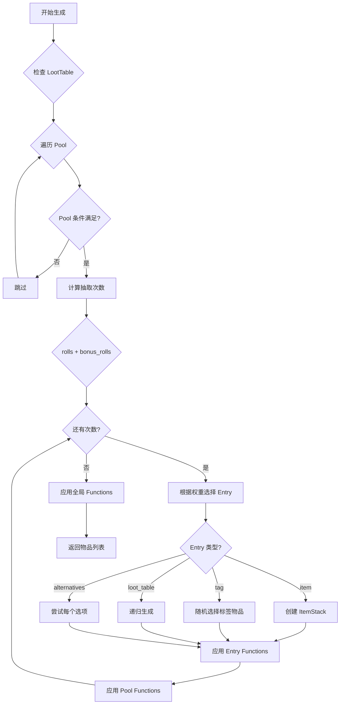
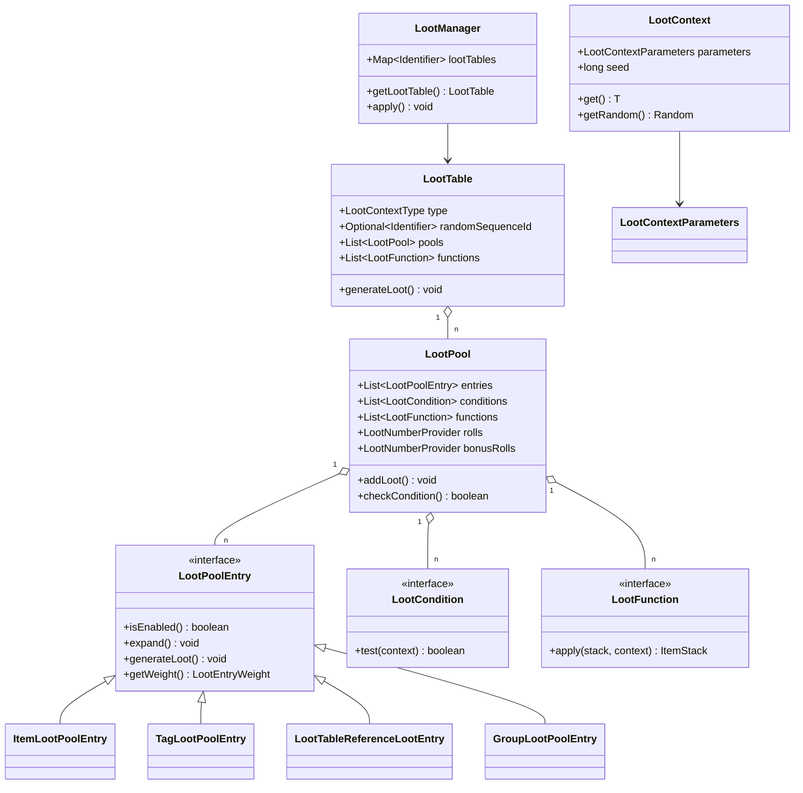

# Minecraft 1.21 战利品系统

> 基于 CFR 0.2.2 反编译源代码的战利品系统完整分析
> 版本信息: Protocol 767, World Version 3953

---

## 1. 概述

战利品系统（Loot System）是 Minecraft 物品获取的核心机制，控制着方块掉落、实体掉落、钓鱼、箱子奖励等所有物品生成逻辑。系统通过 JSON 数据包定义，使用条件（Condition）和函数（Function）实现高度灵活的掉落配置。

### 1.1 战利品系统架构

```
┌─────────────────────────────────────────────────────────────┐
│                    战利品系统核心架构                          │
├─────────────────────────────────────────────────────────────┤
│                                                             │
│  ┌──────────────────┐   ┌──────────────────────────────┐   │
│  │   LootTable       │   │     LootContext             │   │
│  │   (战利品表)       │◄──│     (上下文)                │   │
│  └────────┬─────────┘   └──────────────┬─────────────┘   │
│           │                              │                  │
│           ▼                              ▼                  │
│  ┌──────────────────┐   ┌──────────────────────────────┐   │
│  │   LootPool        │   │  LootContextParameters      │   │
│  │   (战利品池)       │   │  (上下文参数)                │   │
│  └────────┬─────────┘   └──────────────────────────────┘   │
│           │                                             │
│    ┌──────┴──────┐                                       │
│    ▼             ▼                                        │
│ ┌─────────┐ ┌──────────┐                                 │
│ │LootEntry│ │LootCondition│                               │
│ │(条目)   │ │(条件)     │                                 │
│ └─────────┘ └──────────┘                                 │
│    │                                                        │
│    ▼                                                        │
│ ┌──────────┐                                                │
│ │LootFunction│                                               │
│ │(函数)    │                                                │
│ └──────────┘                                                │
│                                                             │
└─────────────────────────────────────────────────────────────┘
```

---

## 2. 核心类详解

### 2.1 LootTable - 战利品表

```net/minecraft/loot/LootTable.java
public class LootTable {
    // 上下文类型（决定能使用什么条件/函数）
    private final LootContextType type;

    // 随机序列 ID
    private final Optional<Identifier> randomSequenceId;

    // 所有的池
    private final List<LootPool> pools;

    // 全局函数
    private final List<LootFunction> functions;

    // 生成战利品
    public void generateLoot(LootContextParameterSet parameters,
                            Consumer<ItemStack> lootConsumer) {
        // 创建上下文
        LootContext context = new LootContext.Builder(parameters)
            .withRandom(this.randomSequenceId)
            .build(this.type);

        // 为每个池生成战利品
        for (LootPool pool : this.pools) {
            if (pool.checkCondition(context)) {
                pool.addLoot(lootConsumer, context);
            }
        }

        // 应用全局函数
        for (LootFunction function : this.functions) {
            // 对所有已生成的物品应用函数
        }
    }

    // 获取重复次数
    public int getRolls(LootContext context) {
        int rolls = 1;
        for (LootPool pool : this.pools) {
            rolls += pool.getRolls(context);
        }
        return rolls;
    }

    // 验证战利品表
    public void validate(LootReporter reporter) {
        for (LootPool pool : this.pools) {
            pool.validate(reporter);
        }
    }
}
```

### 2.2 LootPool - 战利品池

```net/minecraft/loot/LootPool.java
public class LootPool {
    // 奖品条目
    public final List<LootPoolEntry> entries;

    // 生效条件
    public final List<LootCondition> conditions;

    // 处理函数
    public final List<LootFunction> functions;

    // 抽取次数
    public final LootNumberProvider rolls;

    // 额外抽取次数（受幸运影响）
    public final LootNumberProvider bonusRolls;

    // 添加战利品
    public void addLoot(Consumer<ItemStack> lootConsumer, LootContext context) {
        // 计算实际抽取次数
        int rolls = this.rolls.getInt(context);
        int bonusRolls = this.bonusRolls.getInt(context);
        int totalRolls = rolls + bonusRolls;

        // 多次抽取
        for (int i = 0; i < totalRolls; i++) {
            // 根据权重随机选择条目
            LootPoolEntry entry = this.chooseEntry(context);
            if (entry != null) {
                // 展开条目（如引用其他表）
                entry.expand(context, expanded -> {
                    // 生成物品
                    expanded.generateLoot(lootConsumer, context);
                });
            }
        }
    }

    // 检查条件
    public boolean checkCondition(LootContext context) {
        for (LootCondition condition : this.conditions) {
            if (!condition.test(context)) {
                return false;
            }
        }
        return true;
    }

    // 根据权重选择条目
    private LootPoolEntry chooseEntry(LootContext context) {
        float totalWeight = 0;
        for (LootPoolEntry entry : this.entries) {
            if (entry.isEnabled(context)) {
                totalWeight += entry.getWeight(context).getWeight();
            }
        }

        float randomValue = context.getRandom().nextFloat() * totalWeight;
        float currentWeight = 0;

        for (LootPoolEntry entry : this.entries) {
            if (entry.isEnabled(context)) {
                currentWeight += entry.getWeight(context).getWeight();
                if (currentWeight >= randomValue) {
                    return entry;
                }
            }
        }

        return this.entries.get(context.getRandom().nextInt(this.entries.size()));
    }
}
```

### 2.3 LootCondition - 条件接口

```net/minecraft/loot/condition/LootCondition.java
public interface LootCondition {
    // 测试条件是否满足
    boolean test(LootContext context);

    // 获取 Codec 用于序列化
    default Codec<? extends LootCondition> getCodec() {
        return null;
    }
}
```

**常用条件实现类**：

| 类名 | 用途 | JSON ID |
|------|------|---------|
| `RandomChanceLootCondition` | 随机概率 | `minecraft:random_chance` |
| `KilledByPlayerLootCondition` | 被玩家击杀 | `minecraft:killed_by_player` |
| `SurvivesExplosionLootCondition` | 爆炸中存活 | `minecraft:survives_explosion` |
| `TableBonusLootCondition` | 抢夺/时运 | `minecraft:table_bonus` |
| `EntityPropertiesLootCondition` | 实体属性 | `minecraft:entity_properties` |
| `EnchantmentCheckLootCondition` | 附魔检查 | `minecraft:enchantment_check` |
| `InvertedLootCondition` | 条件反转 | `minecraft:inverted` |
| `ReferenceLootCondition` | 引用其他条件 | `minecraft:reference` |
| `WeatherCheckLootCondition` | 天气检查 | `minecraft:weather_check` |
| `BlockStatePropertyLootCondition` | 方块状态 | `minecraft:block_state_property` |

### 2.4 LootFunction - 函数接口

```net/minecraft/loot/function/LootFunction.java
public interface LootFunction {
    // 应用函数到物品
    ItemStack apply(ItemStack stack, LootContext context);

    // 获取 Codec
    default Codec<? extends LootFunction> getCodec() {
        return null;
    }
}
```

**常用函数实现类**：

| 类名 | 用途 | JSON ID |
|------|------|---------|
| `SetCountLootFunction` | 设置数量 | `minecraft:set_count` |
| `SetNbtLootFunction` | 设置 NBT | `minecraft:set_nbt` |
| `EnchantRandomlyLootFunction` | 随机附魔 | `minecraft:enchant_randomly` |
| `LootingEnchantLootFunction` | 抢夺加成 | `minecraft:looting_enchant` |
| `SetAttributesLootFunction` | 设置属性 | `minecraft:set_attributes` |
| `CopyNbtLootFunction` | 复制 NBT | `minecraft:copy_nbt` |
| `ExplorationMapLootFunction` | 探索地图 | `minecraft:exploration_map` |
| `FurnaceSmeltLootFunction` | 熔炉烧制 | `minecraft:furnace_smelt` |
| `SetBannerPatternsLootFunction` | 设置旗帜图案 | `minecraft:set_banner_patterns` |
| `SetStewEffectLootFunction` | 设置炖菜效果 | `minecraft:set_stew_effect` |

---

## 3. 战利品条目系统

### 3.1 LootPoolEntry 接口

```net/minecraft/loot/entry/LootPoolEntry.java
public interface LootPoolEntry {
    // 是否启用
    boolean isEnabled(LootContext context);

    // 展开（如引用其他表）
    void expand(LootContext context, Consumer<LootPoolEntry> expandedConsumer);

    // 生成战利品
    void generateLoot(Consumer<ItemStack> lootConsumer, LootContext context);

    // 获取权重
    LootEntryWeight getWeight(LootContext context);

    // 获取质量
    int getQuality(LootContext context);

    // 获取 Codec
    default Codec<? extends LootPoolEntry> getCodec() {
        return null;
    }
}
```

### 3.2 条目类型

| 类型 | 类 | JSON ID | 说明 |
|------|-----|---------|------|
| 物品 | `ItemLootPoolEntry` | `minecraft:item` | 直接物品 |
| 标签 | `TagLootPoolEntry` | `minecraft:tag` | 引用物品标签 |
| 引用 | `LootTableReferenceLootEntry` | `minecraft:loot_table` | 引用其他战利品表 |
| 分组 | `GroupLootPoolEntry` | `minecraft:group` | 分组容器 |
| 替代 | `AlternativeLootPoolEntry` | `minecraft:alternatives` | 替代选项 |
| 序列 | `SequenceLootPoolEntry` | `minecraft:sequence` | 顺序执行 |
| 空 | `EmptyLootPoolEntry` | `minecraft:empty` | 空条目 |

### 3.3 ItemLootPoolEntry - 物品条目

```net/minecraft/loot/entry/ItemLootPoolEntry.java
public class ItemLootPoolEntry extends TagLootPoolEntry {
    private final Item item;
    private final LootNumberProvider count;
    private final List<LootFunction> functions;

    @Override
    public void generateLoot(Consumer<ItemStack> lootConsumer, LootContext context) {
        // 创建物品
        ItemStack stack = new ItemStack(this.item);

        // 设置数量
        int count = this.count.getInt(context);
        stack.setCount(count);

        // 应用函数
        for (LootFunction function : this.functions) {
            stack = function.apply(stack, context);
        }

        // 输出
        lootConsumer.accept(stack);
    }
}
```

---

## 4. 上下文系统

### 4.1 LootContext - 战利品上下文

```net/minecraft/loot/context/LootContext.java
public class LootContext {
    private final LootContextParameters parameters;
    private final long seed;
    private final RegistryWrapper.Impl<LootModifier> luckBonus;

    // 创建 Builder
    public static Builder builder(LootContextParameterSet parameters) {
        return new Builder(parameters);
    }

    // 获取随机数
    public Random getRandom() {
        return new Random(this.seed);
    }

    // 获取参数
    public <T> T get(LootContextParameter<T> parameter) {
        return this.parameters.get(parameter);
    }

    // 上下文参数
    public enum EntityTarget {
        THIS,           // 当前实体
        ATTACKER,       // 攻击者
        DIRECT_ENTITY,   // 直接实体
        KILLER,         // 杀手
        ORIGIN          // 起源
    }
}
```

### 4.2 LootContextParameters - 上下文参数

```net/minecraft/loot/context/LootContextParameters.java
public class LootContextParameters {
    // 常用参数
    public static final LootContextParameter<Entity> THIS =
        new LootContextParameter<>("this");

    public static final LootContextParameter<Entity> ATTACKER =
        new LootContextParameter<>("attacker");

    public static final LootContextParameter<Entity> KILLER =
        new LootContextParameter<>("killer");

    public static final LootContextParameter<Entity> DIRECT_KILLER_ENTITY =
        new LootContextParameter<>("direct_killer_entity");

    public static final LootContextParameter<PlayerEntity> LAST_KILL_PLAYER =
        new LootContextParameter<>("last_kill_player");

    public static final LootContextParameter<BlockState> BLOCK_STATE =
        new LootContextParameter<>("block_state");

    public static final LootContextParameter<BlockEntity> BLOCK_ENTITY =
        new LootContextParameter<>("block_entity");

    public static final LootContextParameter<ItemStack> TOOL =
        new LootContextParameter<>("tool");

    public static final LootContextParameter<Float> EXPLOSION_RADIUS =
        new LootContextParameter<>("explosion_radius");
}
```

---

## 5. 内置战利品表

### 5.1 LootTables - 内置表注册

```net/minecraft/loot/LootTables.java
public class LootTables {
    // 方块掉落
    public static final LootTable BLOCKS = register("blocks", LootContextTypes.BLOCK);

    // 实体掉落
    public static final LootTable EMPTY = register("empty", LootContextTypes.EMPTY);

    // 游戏事件掉落
    public static final LootTable GAMEPLAY = register("gameplay", LootContextTypes.EMPTY);

    // ===== 实体掉落 =====
    public static final LootTable ZOMBIE = register("entities/zombie", LootContextTypes.ENTITY);
    public static final LootTable CREEPER = register("entities/creeper", LootContextTypes.ENTITY);
    public static final LootTable SKELETON = register("entities/skeleton", LootContextTypes.ENTITY);
    public static final LootTable ENDERMAN = register("entities/enderman", LootContextTypes.ENTITY);
    public static final LootTable PIG = register("entities/pig", LootContextTypes.ENTITY);
    public static final LootTable COW = register("entities/cow", LootContextTypes.ENTITY);
    public static final LootTable SHEEP = register("entities/sheep", LootContextTypes.ENTITY);
    public static final LootTable CHICKEN = register("entities/chicken", LootContextTypes.ENTITY);
    public static final LootTable RABBIT = register("entities/rabbit", LootContextTypes.ENTITY);
    public static final LootTable BEE = register("entities/bee", LootContextTypes.ENTITY);

    // ===== 抽成相关 =====
    public static final LootTable FISHING = register("gameplay/fishing", LootContextTypes.FISHING);
    public static final LootTable FISHING_JUNK = register("gameplay/fishing/junk", LootContextTypes.FISHING);
    public static final LootTable FISHING_TREASURE = register("gameplay/fishing/treasure", LootContextTypes.FISHING);

    // =====  chests =====
    public static final LootTable JUNGLE_TEMPLE = register("chests/jungle_temple", LootContextTypes.CHEST);
    public static final LootTable DESERT_PYRAMID = register("chests/desert_pyramid", LootContextTypes.CHEST);
    public static final LootTable STRONGHOLD = register("chests/stronghold", LootContextTypes.CHEST);
    public static final LootTable VILLAGE = register("chests/village", LootContextTypes.CHEST);
    public static final LootTable BURIED_TREASURE = register("chests/buried_treasure", LootContextTypes.CHEST);
    public static final LootTable SHIPWRECK_TREASURE = register("chests/shipwreck_treasure", LootContextTypes.CHEST);
}
```

---

## 6. JSON 数据包格式

### 6.1 完整示例

```json
{
    "type": "minecraft:generic",
    "random_sequence": "minecraft:entities/cow",
    "pools": [
        {
            "rolls": 1,
            "bonus_rolls": 0,
            "entries": [
                {
                    "type": "minecraft:item",
                    "name": "minecraft:leather",
                    "weight": 1,
                    "quality": 0,
                    "functions": [
                        {
                            "function": "minecraft:set_count",
                            "count": {
                                "type": "minecraft:uniform",
                                "min": 0,
                                "max": 2
                            }
                        }
                    ]
                }
            ],
            "conditions": [
                {
                    "condition": "minecraft:killed_by_player"
                }
            ],
            "functions": [
                {
                    "function": "minecraft:looting_enchant_bonus",
                    "count": {
                        "type": "minecraft:uniform",
                        "min": 0,
                        "max": 1
                    }
                }
            ]
        }
    ],
    "functions": []
}
```

### 6.2 条件示例

```json
{
    "condition": "minecraft:random_chance",
    "chance": 0.5
}
```

```json
{
    "condition": "minecraft:table_bonus",
    "enchantment": "minecraft:looting",
    "chances": [0.01, 0.02, 0.03, 0.04, 0.05]
}
```

### 6.3 函数示例

```json
{
    "function": "minecraft:set_count",
    "count": {
        "type": "minecraft:uniform",
        "min": 1,
        "max": 3
    }
}
```

```json
{
    "function": "minecraft:enchant_randomly",
    "enchantments": ["minecraft:sharpness", "minecraft:knockback"]
}
```

---

## 7. 战利品生成流程

### 7.1 生成流程图



### 7.2 服务端使用示例

```java
// 在服务端生成战利品
public void generateLoot(World world, Entity killer, LootTable table) {
    LootContext context = new LootContext.Builder(world)
        .withParameter(LootContextParameters.THIS, killer)
        .withParameter(LootContextParameters.KILLER, killer)
        .withRandom(killer.getRandom())
        .build(LootContextTypes.ENTITY);

    List<ItemStack> loot = new ArrayList<>();
    table.generateLoot(context, loot::add);

    // 将物品给予玩家
    for (ItemStack stack : loot) {
        player.getInventory().offerOrDrop(stack);
    }
}
```

---

## 8. LootManager - 管理器

```net/minecraft/loot/LootManager.java
public class LootManager implements ReloadableResourceManagerImpl.Reloadable {
    // 所有战利品表
    private Map<Identifier, LootTable> lootTables = new HashMap<>();

    // 加载资源包中的战利品表
    public void apply(Map<Identifier, JsonElement> jsons, ResourceReloadContext context) {
        for (Map.Entry<Identifier, JsonElement> entry : jsons.entrySet()) {
            Identifier id = entry.getKey();
            JsonObject json = entry.getValue().getAsJsonObject();
            LootTable table = LootTable.fromJson(json, context);
            this.lootTables.put(id, table);
        }
    }

    // 获取战利品表
    public LootTable getLootTable(RegistryKey<LootTable> key) {
        return this.lootTables.getOrDefault(key.getValue(), LootTables.EMPTY);
    }

    // 获取所有表
    public Collection<LootTable> getAllTables() {
        return this.lootTables.values();
    }
}
```

---

## 9. Fabric API 扩展

### 9.1 LootTableEvents

```java
net/fabricmc/fabric/api/loot/v3/LootTableEvents.java

// 修改现有战利品表
LootTableEvents.MODIFY.register((key, tableBuilder, source, registries) -> {
    if (source.isBuiltin() && key.equals(LootTables.ENTITIES.ZOMBIE)) {
        // 添加自定义掉落
        tableBuilder.pool(LootPool.builder()
            .with(ItemEntry.builder(Items.ROTTEN_FLESH)
                .weight(1)
            )
            .with(EntryBuilder.builder(Items.DIAMOND)
                .weight(1)
                .conditionally(RandomChanceLootCondition.builder(0.01f))
            )
        );
    }
});

// 替换整个战利品表
LootTableEvents.REPLACE.register((key, tableBuilder, source, registries) -> {
    if (source.isBuiltin() && key.equals(LootTables.CHESTS.VILLAGE_WEAPONSMITH)) {
        return LootTable.builder()
            .pool(...)
            .build();
    }
    return tableBuilder;
});
```

### 9.2 LootConditionEvents

```java
// 注册自定义条件
LootConditionEvents.register("mymod:has_mod_loaded", context ->
    LootCondition.class,
    (codec, json) -> /* 从 JSON 构建条件 */);

// 或使用 Builder 模式
public static LootCondition hasModLoaded(String modId) {
    return builder()
        .builder(hasModLoadedCodec)
        .build();
}
```

### 9.3 LootFunctionEvents

```java
// 注册自定义函数
LootFunctionEvents.register("mymod:add_lore", context ->
    LootFunction.class,
    (codec, json) -> {
        String lore = GsonHelper.getString(json, "lore");
        return stack -> {
            // 添加 Lore 到 NBT
            return stack;
        };
    });
```

---

## 10. 常见用例

### 10.1 方块掉落修改

```java
LootTableEvents.MODIFY.register((key, tableBuilder, source, registries) -> {
    if (source.isBuiltin() && key.equals(LootTables.BLOCKS.DIAMOND_ORE)) {
        tableBuilder.pool(LootPool.builder()
            .with(ItemEntry.builder(Items.DIAMOND)
                .weight(1)
                .apply(SetCountLootFunction.builder(
                    UniformLootNumberProvider.create(1f, 3f)
                ))
                .conditionally(TableBonusLootCondition.builder(
                    registries.getOrThrow(RegistryKeys.ENCHANTMENT)
                        .getOrThrow(Enchantments.FORTUNE),
                    0.1f  // 基础概率
                ))
            )
        );
    }
});
```

### 10.2 实体掉落修改

```java
LootTableEvents.MODIFY.register((key, tableBuilder, source, registries) -> {
    if (source.isBuiltin() && key.equals(LootTables.ENTITIES.CREEPER)) {
        tableBuilder.pool(LootPool.builder()
            .with(ItemEntry.builder(Items.GUNPOWDER)
                .weight(1)
                .apply(SetCountLootFunction.builder(
                    UniformLootNumberProvider.create(0f, 2f)
                ))
                .conditionally(LootingEnchantLootCondition.builder(
                    registries.getOrThrow(RegistryKeys.ENCHANTMENT)
                        .getOrThrow(Enchantments.LOOTING),
                    0.01f
                ))
            )
        );
    }
});
```

---

## 11. 类图总结



---

## 12. 总结

| 概念 | Minecraft 术语 | JSON 字段 |
|------|---------------|----------|
| 战利品表 | LootTable | 顶层 JSON |
| 池 | LootPool | `pools[]` |
| 条目 | LootPoolEntry | `entries[]` |
| 条件 | LootCondition | `conditions[]` |
| 函数 | LootFunction | `functions[]` |
| 抽取次数 | rolls | `rolls` |
| 额外次数 | bonusRolls | `bonus_rolls` |
| 权重 | weight | `weight` |
| 质量 | quality | `quality` |
| 随机序列 | randomSequenceId | `random_sequence` |

战利品系统遵循 **表 → 池 → 条件检查 → 抽取 → 条目展开 → 函数应用** 的生成流程，通过 JSON 实现完全数据驱动的掉落配置。

---

## 显式覆盖文件

### loot/ 目录（130 个文件）

#### 核心接口与基类

| 文件名 | 说明 |
|--------|------|
| `LootTable.java` | 战利品表 |
| `LootPool.java` | 战利品池 |
| `LootContext.java` | 战利品上下文 |
| `LootContextType.java` | 上下文类型 |
| `LootContextParameter.java` | 上下文参数 |
| `LootContextParameters.java` | 上下文参数常量 |
| `LootContextParameterSet.java` | 上下文参数集合 |
| `LootContextAware.java` | 上下文感知接口 |
| `LootContextLoseringCondition.java` | 上下文丢失条件 |
| `LootDataType.java` | 战利品数据类型 |
| `LootTableReporter.java` | 战利品表报告器 |
| `LootTables.java` | 内置战利品表常量 |

#### 战利品池条目 (Entry)

| 文件名 | 说明 |
|--------|------|
| `LootPoolEntry.java` | 战利品池条目接口 |
| `LootPoolEntryType.java` | 条目类型 |
| `LootPoolEntryTypes.java` | 条目类型常量 |
| `LootTableEntry.java` | 战利品表条目 |
| `ItemEntry.java` | 物品条目 |
| `TagEntry.java` | 标签条目 |
| `AlternativeEntry.java` | 替代条目 |
| `GroupEntry.java` | 分组条目 |
| `SequenceEntry.java` | 序列条目 |
| `EmptyEntry.java` | 空条目 |
| `CombinedEntry.java` | 组合条目 |
| `DynamicEntry.java` | 动态条目 |
| `LeafEntry.java` | 叶子条目 |
| `EntryCombiner.java` | 条目组合器 |
| `LootChoice.java` | 战利品选择 |

#### 条件系统 (Condition)

| 文件名 | 说明 |
|--------|------|
| `LootCondition.java` | 条件接口 |
| `LootConditionType.java` | 条件类型 |
| `LootConditionTypes.java` | 条件类型常量 |
| `LootConditionConsumingBuilder.java` | 条件消费构建器 |
| `AlternativeLootCondition.java` | 替代条件 |
| `AllOfLootCondition.java` | 所有条件 |
| `AnyOfLootCondition.java` | 任意条件 |
| `InvertedLootCondition.java` | 反转条件 |
| `RandomChanceLootCondition.java` | 随机概率条件 |
| `RandomChanceWithEnchantedBonusLootCondition.java` | 附魔加成概率 |
| `SurvivesExplosionLootCondition.java` | 爆炸存活条件 |
| `KilledByPlayerLootCondition.java` | 被玩家击杀条件 |
| `TableBonusLootCondition.java` | 表加成条件 |
| `EntityPropertiesLootCondition.java` | 实体属性条件 |
| `EntityScoresLootCondition.java` | 实体计分条件 |
| `EnchantmentCheckLootCondition.java` | 附魔检查条件 |
| `EnchantmentActiveCheckLootCondition.java` | 附魔激活检查 |
| `BlockStatePropertyLootCondition.java` | 方块状态条件 |
| `LocationCheckLootCondition.java` | 位置检查条件 |
| `MatchToolLootCondition.java` | 工具匹配条件 |
| `ReferenceLootCondition.java` | 引用条件 |
| `WeatherCheckLootCondition.java` | 天气检查条件 |
| `TimeCheckLootCondition.java` | 时间检查条件 |
| `DamageSourcePropertiesLootCondition.java` | 伤害源属性条件 |
| `ValueCheckLootCondition.java` | 值检查条件 |

#### 函数系统 (Function)

| 文件名 | 说明 |
|--------|------|
| `LootFunction.java` | 函数接口 |
| `LootFunctionType.java` | 函数类型 |
| `LootFunctionTypes.java` | 函数类型常量 |
| `LootFunctionConsumingBuilder.java` | 函数消费构建器 |
| `ConditionalLootFunction.java` | 条件函数 |
| `SetCountLootFunction.java` | 设置数量 |
| `SetDamageLootFunction.java` | 设置耐久 |
| `SetNbtLootFunction.java` | 设置 NBT |
| `SetNameLootFunction.java` | 设置名称 |
| `SetLoreLootFunction.java` | 设置 Lore |
| `SetCustomDataLootFunction.java` | 设置自定义数据 |
| `SetCustomModelDataLootFunction.java` | 设置自定义模型数据 |
| `EnchantRandomlyLootFunction.java` | 随机附魔 |
| `EnchantWithLevelsLootFunction.java` | 按等级附魔 |
| `EnchantedCountIncreaseLootFunction.java` | 附魔数量增加 |
| `FurnaceSmeltLootFunction.java` | 熔炉烧制 |
| `CopyNameLootFunction.java` | 复制名称 |
| `CopyNbtLootFunction.java` | 复制 NBT |
| `CopyStateLootFunction.java` | 复制状态 |
| `CopyComponentsLootFunction.java` | 复制组件 |
| `SetComponentsLootFunction.java` | 设置组件 |
| `SetContentsLootFunction.java` | 设置内容物 |
| `SetPotionLootFunction.java` | 设置药水 |
| `SetStewEffectLootFunction.java` | 设置炖菜效果 |
| `SetInstrumentLootFunction.java` | 设置乐器 |
| `SetBannerPatternLootFunction.java` | 设置旗帜图案 |
| `SetFireworkExplosionLootFunction.java` | 设置烟花爆炸 |
| `SetFireworksLootFunction.java` | 设置烟花 |
| `SetAttributesLootFunction.java` | 设置属性 |
| `SetItemLootFunction.java` | 设置物品 |
| `SetOminousBottleAmplifierLootFunction.java` | 设置不祥瓶子等级 |
| `ExplorationMapLootFunction.java` | 探索地图 |
| `FillPlayerHeadLootFunction.java` | 填充玩家头颅 |
| `LimitCountLootFunction.java` | 限制数量 |
| `ReferenceLootFunction.java` | 引用函数 |
| `ApplyBonusLootFunction.java` | 应用加成 |
| `FilteredLootFunction.java` | 过滤函数 |
| `ModifyContentsLootFunction.java` | 修改内容物 |
| `SetBookCoverLootFunction.java` | 设置书封面 |
| `SetWritableBookPagesLootFunction.java` | 设置可写书页 |
| `SetWrittenBookPagesLootFunction.java` | 设置成书页 |
| `ExplosionDecayLootFunction.java` | 爆炸衰减 |
| `ToggleTooltipsLootFunction.java` | 切换提示 |
| `AndLootFunction.java` | 与函数 |
| `StorageLootNbtProvider.java` | 存储 NBT 提供者 |
| `LootNbtProvider.java` | NBT 提供者接口 |
| `LootNbtProviderType.java` | NBT 提供者类型 |
| `LootNbtProviderTypes.java` | NBT 提供者类型常量 |
| `ContextLootNbtProvider.java` | 上下文 NBT 提供者 |
| `ContainerComponentModifier.java` | 容器组件修饰符 |
| `ContainerComponentModifiers.java` | 容器组件修饰符常量 |
| `LootScoreProvider.java` | 计分提供者接口 |
| `LootScoreProviderType.java` | 计分提供者类型 |
| `LootScoreProviderTypes.java` | 计分提供者类型常量 |
| `FixedLootScoreProvider.java` | 固定计分提供者 |
| `ContextLootScoreProvider.java` | 上下文计分提供者 |

#### 数值提供者 (Number Provider)

| 文件名 | 说明 |
|--------|------|
| `LootNumberProvider.java` | 数值提供者接口 |
| `LootNumberProviderType.java` | 数值提供者类型 |
| `LootNumberProviderTypes.java` | 数值提供者类型常量 |
| `ConstantLootNumberProvider.java` | 常量数值提供者 |
| `UniformLootNumberProvider.java` | 均匀分布提供者 |
| `BinomialLootNumberProvider.java` | 二项分布提供者 |
| `EnchantmentLevelLootNumberProvider.java` | 附魔等级提供者 |
| `ScoreLootNumberProvider.java` | 计分提供者 |
| `BoundedIntUnaryOperator.java` | 有界整数一元运算符 |
