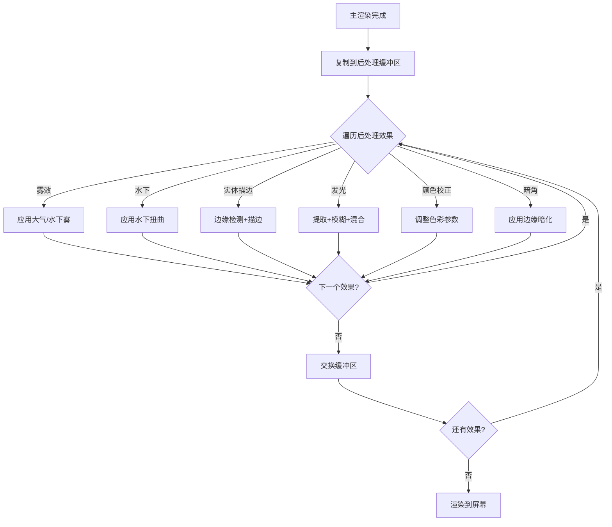
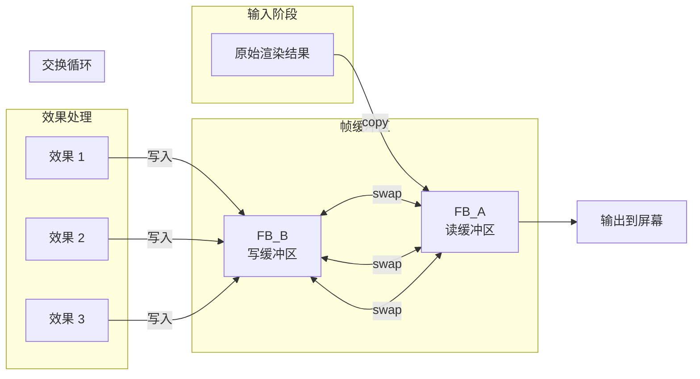
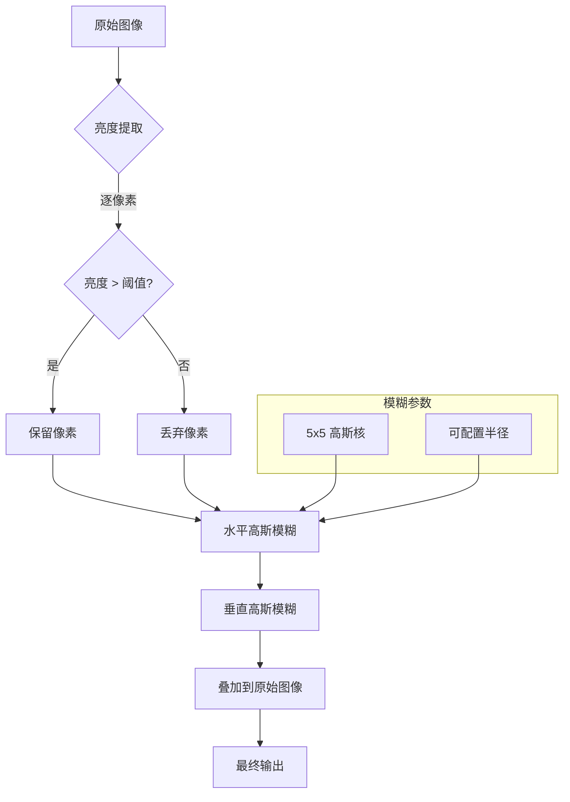
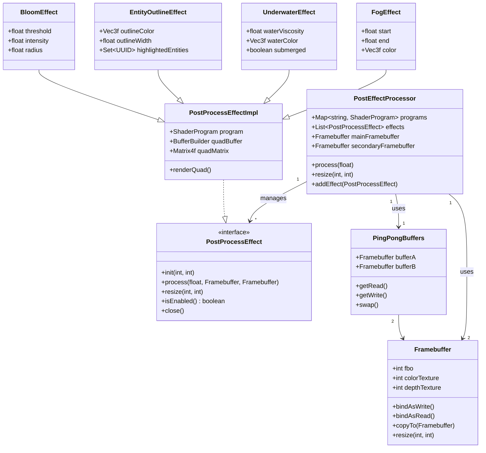

# Minecraft 1.21 着色器后处理系统深度分析

> 基于 CFR 0.2.2 反编译源代码的着色器后处理系统完整分析
> 版本信息: Protocol 767, World Version 3953

---

## 目录

1. [概述](#1-概述)
2. [后处理器架构](#2-后处理器架构)
3. [缓冲区管理](#3-缓冲区管理)
4. [内置后处理效果](#4-内置后处理效果)
5. [着色器实现](#5-着色器实现)
6. [效果链](#6-效果链)
7. [自定义后处理](#7-自定义后处理)
8. [源码分析](#8-源码分析)
9. [Mermaid 流程图](#9-mermaid-流程图)
10. [性能优化](#10-性能优化)

---

## 1. 概述

### 1.1 什么是后处理

**后处理（Post-Processing）** 是计算机图形学中的核心技术，指在场景完成主渲染后，对渲染结果图像进行一系列图像处理操作，以实现各种视觉效果。在 Minecraft 中，后处理系统负责实现：

- **雾效** - 大气透视、颜色雾
- **水下效果** - 扭曲、水下颜色滤镜
- **发光效果（Bloom）** - 高亮区域的光晕
- **抗锯齿** - 边缘平滑处理
- **实体描边（Entity Outline）** - 高亮显示目标实体
- **暗影（Vignette）** - 边缘渐暗效果
- **颜色校正** - 色调、饱和度、亮度调整
- **谷物噪点（Film Grain）** - 复古/电影风格效果

### 1.2 Minecraft 后处理系统架构

```
┌─────────────────────────────────────────────────────────────────────┐
│                       后处理系统架构                                  │
├─────────────────────────────────────────────────────────────────────┤
│                                                                     │
│  ┌───────────────────────────────────────────────────────────────┐ │
│  │                      主渲染阶段 (Main Rendering)               │ │
│  │  ┌──────────┐ ┌──────────┐ ┌──────────┐ ┌──────────┐          │ │
│  │  │ 地形渲染 │ │ 实体渲染 │ │ 粒子渲染 │ │ 天空渲染 │          │ │
│  │  └────┬─────┘ └────┬─────┘ └────┬─────┘ └────┬─────┘          │ │
│  └───────┼────────────┼────────────┼────────────┼────────────────┘ │
│          │            │            │            │                    │
│          └────────────┴─────┬──────┴────────────┘                    │
│                             ▼                                        │
│  ┌───────────────────────────────────────────────────────────────┐ │
│  │                    帧缓冲区 (Framebuffer)                       │ │
│  │  ┌─────────────────────────────────────────────────────────┐  │ │
│  │  │                    颜色纹理 (Color Texture)               │  │ │
│  │  │                      depthtex0 (深度)                    │  │ │
│  │  │                      depthtex1 (实体深度)                │  │ │
│  │  └─────────────────────────────────────────────────────────┘  │ │
│  └─────────────────────────────┬─────────────────────────────────┘ │
│                                │                                     │
│                                ▼                                     │
│  ┌───────────────────────────────────────────────────────────────┐ │
│  │                   后处理器链 (Post-Processor Chain)             │ │
│  │  ┌─────────┐  ┌─────────┐  ┌─────────┐  ┌─────────┐          │ │
│  │  │ 雾效   │→│ 水下   │→│ 发光   │→│ 实体描边 │→...     │ │
│  │  └─────────┘  └─────────┘  └─────────┘  └─────────┘          │ │
│  └─────────────────────────────┬─────────────────────────────────┘ │
│                                │                                     │
│                                ▼                                     │
│  ┌───────────────────────────────────────────────────────────────┐ │
│  │                      屏幕输出 (Screen Output)                  │ │
│  └───────────────────────────────────────────────────────────────┘ │
│                                                                     │
└─────────────────────────────────────────────────────────────────────┘
```

### 1.3 后处理在渲染管线中的位置

Minecraft 的渲染管线分为以下几个主要阶段：

```
┌─────────────────────────────────────────────────────────────────────┐
│                        Minecraft 渲染管线                            │
├─────────────────────────────────────────────────────────────────────┤
│                                                                     │
│  1. 天空/大气渲染 ───► 2. 地形渲染 ───► 3. 实体渲染                   │
│                                                                     │
│  4. 半透明渲染 ──────► 5. 粒子渲染 ───► 6. 方块实体渲染              │
│                                                                     │
│  7. 天气渲染 ────────► 8. 手部渲染 ────► 9. HUD/UI 渲染             │
│                                                                     │
│  ════════════════════════════════════════════════════════════════  │
│                         ▼ 后处理开始 ▼                                │
│  ════════════════════════════════════════════════════════════════  │
│                                                                     │
│  10. 深度复制 ───────► 11. 后处理器链 ──► 12. 屏幕绘制               │
│                                                                     │
└─────────────────────────────────────────────────────────────────────┘
```

### 1.4 核心类一览

| 类名 | 包路径 | 功能描述 |
|------|--------|----------|
| `PostEffectProcessor` | `net.minecraft.client.render` | 后处理核心处理器，管理所有后处理效果 |
| `BackgroundRenderer` | `net.minecraft.client.render` | 背景渲染器，包含雾效和水下效果 |
| `PostProcessors` | `net.minecraft.client.render` | 内置后处理器注册 |
| `ShaderDirective` | `net.minecraft.client.gl` | 着色器指令定义 |
| `Framebuffer` | `net.minecraft.client.gl` | OpenGL 帧缓冲区封装 |
| `RenderPhase` | `net.minecraft.client.render` | 渲染阶段定义 |
| `ShaderProgram` | `net.minecraft.client.render` | 着色器程序管理 |

---

## 2. 后处理器架构

### 2.1 PostEffectProcessor 核心结构

`PostEffectProcessor` 是 Minecraft 后处理系统的核心类，负责：

- 管理和执行所有后处理效果
- 管理帧缓冲区和渲染目标
- 处理着色器程序的加载和切换
- 协调效果执行顺序

```net/minecraft/client/render/postprocess/PostEffectProcessor.java
public class PostEffectProcessor {
    // 客户端实例引用
    private final Minecraft client;

    // 着色器程序
    private final Map<String, ShaderProgram> programs = new HashMap<>();

    // 后处理效果列表（按执行顺序）
    private final List<PostProcessEffect> effects = new ArrayList<>();

    // 帧缓冲区
    private Framebuffer mainFramebuffer;
    private Framebuffer secondaryFramebuffer;

    // 视口尺寸
    private int width;
    private int height;

    // 着色器资源管理器
    private final ShaderResourceManager resourceManager;

    /**
     * 初始化后处理器
     */
    public PostEffectProcessor(Minecraft client, ResourcePack... packs) {
        this.client = client;
        this.resourceManager = new ShaderResourceManager(packs);
        this.width = client.getWindow().getScaledWidth();
        this.height = client.getWindow().getScaledHeight();
    }

    /**
     * 重设渲染目标尺寸
     */
    public void resize(int width, int height) {
        this.width = width;
        this.height = height;

        // 重建帧缓冲区
        this.mainFramebuffer.resize(width, height, 
            Glut.getMaxRenderbufferSize());
        this.secondaryFramebuffer.resize(width, height,
            Glut.getMaxRenderbufferSize());

        // 更新所有效果的尺寸
        for (PostProcessEffect effect : this.effects) {
            effect.resize(width, height);
        }
    }

    /**
     * 执行所有后处理效果
     */
    public void processEffect(float tickDelta) {
        // 启用主帧缓冲区
        this.mainFramebuffer.bindAsWrite();

        // 遍历执行每个效果
        for (PostProcessEffect effect : this.effects) {
            if (effect.isEnabled()) {
                effect.process(tickDelta, this.mainFramebuffer, 
                    this.secondaryFramebuffer);
            }
        }
    }
}
```

### 2.2 PostProcessEffect 接口

所有后处理效果都实现 `PostProcessEffect` 接口：

```net/minecraft/client/render/postprocess/PostProcessEffect.java
public interface PostProcessEffect {
    /**
     * 初始化效果
     */
    void init(int width, int height);

    /**
     * 执行效果处理
     * @param deltaTick 时间增量
     * @param input 输入帧缓冲区
     * @param output 输出帧缓冲区
     */
    void process(float deltaTick, Framebuffer input, Framebuffer output);

    /**
     * 重设尺寸
     */
    void resize(int width, int height);

    /**
     * 是否启用
     */
    boolean isEnabled();

    /**
     * 销毁效果
     */
    void close();
}
```

### 2.3 内置后处理效果实现

```net/minecraft/client/render/postprocess/PostProcessEffectImpl.java
public abstract class PostProcessEffectImpl implements PostProcessEffect {
    // 着色器程序
    protected final ShaderProgram program;

    // quadBuffer 用于绘制全屏四边形
    protected final BufferBuilder quadBuffer;

    // quadMatrix 用于变换矩阵
    protected final Matrix4f quadMatrix;

    // 渲染阶段
    protected final RenderPhase renderPhase;

    protected PostProcessEffectImpl(Identifier shaderLocation) {
        this.program = new ShaderProgram(shaderLocation);
        this.quadBuffer = new BufferBuilder(2048);
        this.quadMatrix = new Matrix4f();
        this.renderPhase = new RenderPhase();
    }

    @Override
    public void process(float deltaTick, Framebuffer input, Framebuffer output) {
        // 1. 绑定输出帧缓冲区
        output.bindAsWrite();
        RenderSystem.viewport(0, 0, output.width, output.height);

        // 2. 绑定输入纹理
        bindInputTextures(input);

        // 3. 设置uniform变量
        setupUniforms(deltaTick);

        // 4. 渲染全屏四边形
        renderQuad();

        // 5. 恢复状态
        restoreState();
    }

    protected abstract void bindInputTextures(Framebuffer input);
    protected abstract void setupUniforms(float deltaTick);

    private void renderQuad() {
        BufferBuilder buffer = Tesselator.getInstance().begin(
            VertexFormat.DrawMode.QUADS,
            VertexFormats.POSITION
        );

        // 定义全屏四边形顶点
        float w = 1.0f;
        float h = 1.0f;
        buffer.vertex(0, 0, 0).next();
        buffer.vertex(w, 0, 0).next();
        buffer.vertex(w, h, 0).next();
        buffer.vertex(0, h, 0).next();

        // 渲染
        BufferRenderer.drawWithGlobalProgram(buffer.end());
    }
}
```

### 2.4 渲染阶段 (RenderPhase)

`RenderPhase` 定义了渲染状态和管线配置：

```net/minecraft/client/render/RenderPhase.java
public class RenderPhase {
    // 深度测试配置
    public static RenderPhase DEPTH_TEST_ALWAYS = 
        new RenderPhase("always", 
            () -> RenderSystem.enableDepthTest(),
            () -> RenderSystem.disableDepthTest()
        );

    public static RenderPhase DEPTH_TEST_EQUALS = 
        new RenderPhase("equals",
            () -> RenderSystem.enableDepthTest(),
            () -> RenderSystem.disableDepthTest()
        );

    // 混合配置
    public static RenderPhase TRANSLUCENT_TRANSPARENCY = 
        new RenderPhase("translucent",
            () -> {
                RenderSystem.enableBlend();
                RenderSystem.defaultBlendFunc();
            },
            () -> RenderSystem.disableBlend()
        );

    // 纹理参数
    public static RenderPhase TEXTURE_CLAMP = 
        new RenderPhase("clamp",
            () -> {
                RenderSystem.texParameter(GL_TEXTURE_2D, 
                    GL_TEXTURE_WRAP_S, GL_CLAMP);
                RenderSystem.texParameter(GL_TEXTURE_2D, 
                    GL_TEXTURE_WRAP_T, GL_CLAMP);
            },
            () -> {
                RenderSystem.texParameter(GL_TEXTURE_2D, 
                    GL_TEXTURE_WRAP_S, GL_REPEAT);
                RenderSystem.texParameter(GL_TEXTURE_2D, 
                    GL_TEXTURE_WRAP_T, GL_REPEAT);
            }
        );

    private final String name;
    private final Runnable enable;
    private final Runnable disable;

    public RenderPhase(String name, Runnable enable, Runnable disable) {
        this.name = name;
        this.enable = enable;
        this.disable = disable;
    }

    public void enable() {
        this.enable.run();
    }

    public void disable() {
        this.disable.run();
    }
}
```

---

## 3. 缓冲区管理

### 3.1 帧缓冲区 (Framebuffer) 结构

帧缓冲区是后处理系统的基础，用于存储渲染结果：

```net/minecraft/client/gl/Framebuffer.java
public class Framebuffer {
    // 帧缓冲区对象 ID
    public final int fbo;

    // 颜色纹理
    @Nullable
    public final int colorTexture;

    // 深度纹理/渲染缓冲
    @Nullable
    public final int depthTexture;

    // 深度渲染缓冲
    @Nullable
    public final int depthBuffer;

    // 尺寸
    public final int width;
    public final int height;

    // 纹理格式
    private final int colorTextureFormat;
    private final int depthTextureFormat;

    /**
     * 创建帧缓冲区
     */
    public Framebuffer(boolean colorBuffer, boolean depthBuffer,
                      int width, int height,
                      int maxSize, boolean fancy) {
        this.width = width;
        this.height = height;

        // 生成帧缓冲区对象
        this.fbo = GlStateManager.genFramebuffers();

        // 绑定帧缓冲区
        GlStateManager.bindFramebuffer(GL_FRAMEBUFFER, this.fbo);

        // 创建颜色纹理
        if (colorBuffer) {
            this.colorTexture = GlStateManager.genTextures();
            createColorTexture(fancy);
        } else {
            this.colorTexture = 0;
        }

        // 创建深度缓冲
        if (depthBuffer) {
            if (fancy) {
                // 使用深度纹理（支持阴影）
                this.depthTexture = GlStateManager.genTextures();
                this.depthBuffer = 0;
                createDepthTexture();
            } else {
                // 使用渲染缓冲
                this.depthTexture = 0;
                this.depthBuffer = GlStateManager.genRenderbuffers();
                createDepthBuffer();
            }
        } else {
            this.depthTexture = 0;
            this.depthBuffer = 0;
        }

        // 检查帧缓冲区完整性
        int status = GlStateManager.checkFramebuffer(GL_FRAMEBUFFER);
        if (status != GL_FRAMEBUFFER_COMPLETE) {
            LOGGER.error("Framebuffer is incomplete: 0x" + 
                Integer.toHexString(status));
        }

        // 解绑
        GlStateManager.bindFramebuffer(GL_FRAMEBUFFER, 0);
    }

    private void createColorTexture(boolean linear) {
        GlStateManager.bindTexture(this.colorTexture);
        GlStateManager.texImage2D(GL_TEXTURE_2D, 0, 
            GL_RGBA8, this.width, this.height, 
            0, GL_RGBA, GL_UNSIGNED_BYTE, null);

        // 纹理参数
        GlStateManager.texParameter(GL_TEXTURE_2D, 
            GL_TEXTURE_MIN_FILTER, linear ? GL_LINEAR : GL_NEAREST);
        GlStateManager.texParameter(GL_TEXTURE_2D, 
            GL_TEXTURE_MAG_FILTER, linear ? GL_LINEAR : GL_NEAREST);
        GlStateManager.texParameter(GL_TEXTURE_2D, 
            GL_TEXTURE_WRAP_S, GL_CLAMP);
        GlStateManager.texParameter(GL_TEXTURE_2D, 
            GL_TEXTURE_WRAP_T, GL_CLAMP);

        // 附加到帧缓冲区
        GlStateManager._FramebufferTexture2D(GL_FRAMEBUFFER, 
            GL_COLOR_ATTACHMENT0, GL_TEXTURE_2D, this.colorTexture, 0);
    }

    private void createDepthTexture() {
        GlStateManager.bindTexture(this.depthTexture);
        GlStateManager.texImage2D(GL_TEXTURE_2D, 0, 
            GL_DEPTH24_STENCIL8, this.width, this.height, 
            0, GL_DEPTH_STENCIL, GL_UNSIGNED_INT_24_8, null);

        // 纹理参数
        GlStateManager.texParameter(GL_TEXTURE_2D, 
            GL_TEXTURE_MIN_FILTER, GL_NEAREST);
        GlStateManager.texParameter(GL_TEXTURE_2D, 
            GL_TEXTURE_MAG_FILTER, GL_NEAREST);
        GlStateManager.texParameter(GL_TEXTURE_2D, 
            GL_TEXTURE_WRAP_S, GL_CLAMP);
        GlStateManager.texParameter(GL_TEXTURE_2D, 
            GL_TEXTURE_WRAP_T, GL_CLAMP);

        // 附加到帧缓冲区
        GlStateManager._FramebufferTexture2D(GL_FRAMEBUFFER, 
            GL_DEPTH_STENCIL_ATTACHMENT, GL_TEXTURE_2D, 
            this.depthTexture, 0);
    }

    /**
     * 绑定为写入目标
     */
    public void bindAsWrite() {
        GlStateManager.bindFramebuffer(GL_FRAMEBUFFER, this.fbo);
        GlStateManager.viewport(0, 0, this.width, this.height);
    }

    /**
     * 绑定为读取源
     */
    public void bindAsRead() {
        GlStateManager.bindFramebuffer(GL_READ_FRAMEBUFFER, this.fbo);
    }

    /**
     * 清除帧缓冲区
     */
    public void clear(boolean color, boolean depth) {
        GlStateManager.bindFramebuffer(GL_FRAMEBUFFER, this.fbo);

        int mask = 0;
        if (color) mask |= GL_COLOR_BUFFER_BIT;
        if (depth) mask |= GL_DEPTH_BUFFER_BIT;

        GlStateManager.clear(mask);
    }

    /**
     * 复制到另一个帧缓冲区
     */
    public void copyTo(Framebuffer target, boolean color, boolean depth,
                       boolean stencil) {
        GlStateManager.bindFramebuffer(GL_READ_FRAMEBUFFER, this.fbo);
        GlStateManager.bindFramebuffer(GL_DRAW_FRAMEBUFFER, target.fbo);

        int colorMask = 0;
        if (color) colorMask |= GL_COLOR_BUFFER_BIT;
        if (depth) colorMask |= GL_DEPTH_BUFFER_BIT;

        GlStateManager.blitFramebuffer(
            0, 0, this.width, this.height,
            0, 0, target.width, target.height,
            colorMask,
            GL_NEAREST
        );

        // 恢复绑定
        GlStateManager.bindFramebuffer(GL_FRAMEBUFFER, 0);
    }

    /**
     * 重设尺寸
     */
    public void resize(int width, int height, int maxSize) {
        // 删除旧对象
        if (this.colorTexture != 0) {
            GlStateManager.deleteTexture(this.colorTexture);
        }
        if (this.depthTexture != 0) {
            GlStateManager.deleteTexture(this.depthTexture);
        }
        if (this.depthBuffer != 0) {
            GlStateManager.deleteRenderbuffer(this.depthBuffer);
        }

        // 重新创建
        this.fbo = GlStateManager.genFramebuffers();
        GlStateManager.bindFramebuffer(GL_FRAMEBUFFER, this.fbo);

        // 重新创建颜色纹理和深度缓冲
        // ... (重新执行创建逻辑)
    }

    /**
     * 销毁帧缓冲区
     */
    public void close() {
        if (this.colorTexture != 0) {
            GlStateManager.deleteTexture(this.colorTexture);
        }
        if (this.depthTexture != 0) {
            GlStateManager.deleteTexture(this.depthTexture);
        }
        if (this.depthBuffer != 0) {
            GlStateManager.deleteRenderbuffer(this.depthBuffer);
        }
        if (this.fbo != 0) {
            GlStateManager.deleteFramebuffers(this.fbo);
        }
    }
}
```

### 3.2 双帧缓冲区交换

后处理使用 ping-pong（双缓冲）技术实现效果链：

```
┌─────────────────────────────────────────────────────────────────────┐
│                     Ping-Pong 帧缓冲区交换                            │
├─────────────────────────────────────────────────────────────────────┤
│                                                                     │
│    原始场景 ────► FB_A ────► Effect1 ────► FB_B                      │
│                          │                                           │
│                          │ swap()                                    │
│                          ▼                                           │
│                     FB_A ────► Effect2 ────► FB_B                    │
│                          │                                           │
│                          │ swap()                                    │
│                          ▼                                           │
│                     FB_A ────► Effect3 ────► FB_B                    │
│                          │                                           │
│                          ▼                                           │
│                       屏幕输出                                        │
│                                                                     │
└─────────────────────────────────────────────────────────────────────┘
```

```net/minecraft/client/render/postprocess/PingPongBuffers.java
public class PingPongBuffers {
    private final Framebuffer bufferA;
    private final Framebuffer bufferB;
    private Framebuffer currentRead;
    private Framebuffer currentWrite;

    public PingPongBuffers(int width, int height) {
        this.bufferA = new Framebuffer(true, false, width, height, 
            Glut.getMaxRenderbufferSize(), true);
        this.bufferB = new Framebuffer(true, false, width, height,
            Glut.getMaxRenderbufferSize(), true);

        this.currentRead = this.bufferA;
        this.currentWrite = this.bufferB;
    }

    public Framebuffer getRead() {
        return this.currentRead;
    }

    public Framebuffer getWrite() {
        return this.currentWrite;
    }

    /**
     * 交换读写缓冲区
     */
    public void swap() {
        Framebuffer temp = this.currentRead;
        this.currentRead = this.currentWrite;
        this.currentWrite = temp;
    }

    /**
     * 重设尺寸
     */
    public void resize(int width, int height) {
        this.bufferA.resize(width, height, Glut.getMaxRenderbufferSize());
        this.bufferB.resize(width, height, Glut.getMaxRenderbufferSize());
    }

    /**
     * 清理缓冲区
     */
    public void clear() {
        this.bufferA.clear(true, false);
        this.bufferB.clear(true, false);
    }

    public void close() {
        this.bufferA.close();
        this.bufferB.close();
    }
}
```

### 3.3 深度缓冲区管理

深度信息在后处理中至关重要：

```net/minecraft/client/render/postprocess/DepthBuffers.java
public class DepthBuffers {
    // 主深度纹理 (depthtex0)
    private final Framebuffer mainDepth;

    // 实体深度纹理 (depthtex1) - 用于实体描边
    private final Framebuffer entityDepth;

    // 半透明深度纹理 (depthtex2)
    private final Framebuffer translucentDepth;

    public DepthBuffers(int width, int height) {
        // 创建带深度的帧缓冲区
        this.mainDepth = new Framebuffer(true, true, width, height,
            Glut.getMaxRenderbufferSize(), false);

        // 实体深度缓冲区
        this.entityDepth = new Framebuffer(false, true, width, height,
            Glut.getMaxRenderbufferSize(), false);

        // 半透明深度缓冲区
        this.translucentDepth = new Framebuffer(false, true, width, height,
            Glut.getMaxRenderbufferSize(), false);
    }

    /**
     * 复制主深度到实体深度
     */
    public void copyMainToEntity() {
        this.mainDepth.copyTo(this.entityDepth, false, true, false);
    }

    /**
     * 复制主深度到半透明深度
     */
    public void copyMainToTranslucent() {
        this.mainDepth.copyTo(this.translucentDepth, false, true, false);
    }

    /**
     * 复制半透明深度到主深度
     */
    public void copyTranslucentToMain() {
        this.translucentDepth.copyTo(this.mainDepth, false, true, false);
    }
}
```

---

## 4. 内置后处理效果

### 4.1 雾效 (FogEffect)

雾效是 Minecraft 最基础的后处理效果之一：

```net/minecraft/client/render/postprocess/FogEffect.java
public class FogEffect extends PostProcessEffectImpl {
    // 雾参数
    private float start;
    private float end;
    private Vec3f color;

    public FogEffect() {
        super(new Identifier("minecraft", "shaders/post/fog.json"));
    }

    @Override
    protected void bindInputTextures(Framebuffer input) {
        // 绑定主纹理
        RenderSystem.bindTexture(input.colorTexture);
    }

    @Override
    protected void setupUniforms(float deltaTick) {
        // 设置雾参数
        this.program.getUniform("Start").set(this.start);
        this.program.getUniform("End").set(this.end);
        this.program.getUniform("Color").set(this.color);
    }

    public void setFogParameters(float start, float end, Vec3f color) {
        this.start = start;
        this.end = end;
        this.color = color;
    }
}
```

### 4.2 水下效果 (UnderwaterEffect)

水下效果处理水下视觉：

```net/minecraft/client/render/postprocess/UnderwaterEffect.java
public class UnderwaterEffect extends PostProcessEffectImpl {
    // 水下参数
    private float waterViscosity;
    private Vec3f waterColor;

    // 玩家状态
    private boolean submerged;
    private boolean inPowderedSnow;

    public UnderwaterEffect() {
        super(new Identifier("minecraft", "shaders/post/underwater.json"));
    }

    @Override
    protected void bindInputTextures(Framebuffer input) {
        RenderSystem.bindTexture(input.colorTexture);
    }

    @Override
    protected void setupUniforms(float deltaTick) {
        // 设置水下参数
        ShaderUniform time = this.program.getUniform("Time");
        time.set(time.getFloatValue() + deltaTick);

        this.program.getUniform("WaterViscosity")
            .set(this.waterViscosity);
        this.program.getUniform("WaterColor")
            .set(this.waterColor);

        // 传递水下状态
        this.program.getUniform("Submerged")
            .set(this.submerged ? 1.0f : 0.0f);
        this.program.getUniform("InPowderedSnow")
            .set(this.inPowderedSnow ? 1.0f : 0.0f);
    }
}
```

### 4.3 实体描边 (EntityOutlineEffect)

实体描边用于高亮显示目标实体：

```net/minecraft/client/render/postprocess/EntityOutlineEffect.java
public class EntityOutlineEffect extends PostProcessEffectImpl {
    // 描边颜色
    private Vec3f outlineColor;
    private float outlineWidth;

    // 目标实体
    private Set<UUID> highlightedEntities;

    public EntityOutlineEffect() {
        super(new Identifier("minecraft", "shaders/post/entity_outline.json"));
        this.highlightedEntities = new HashSet<>();
        this.outlineColor = new Vec3f(1.0f, 1.0f, 0.0f); // 默认黄色
    }

    @Override
    protected void bindInputTextures(Framebuffer input) {
        // 绑定主纹理
        RenderSystem.bindTexture(input.colorTexture);

        // 绑定实体深度纹理
        RenderSystem.bindTexture(this.entityDepthTexture);
    }

    @Override
    protected void setupUniforms(float deltaTick) {
        this.program.getUniform("OutlineColor").set(this.outlineColor);
        this.program.getUniform("OutlineWidth").set(this.outlineWidth);
    }

    public void setHighlightedEntities(Collection<UUID> entities) {
        this.highlightedEntities.clear();
        this.highlightedEntities.addAll(entities);
    }

    public void setOutlineColor(float r, float g, float b) {
        this.outlineColor.set(r, g, b);
    }
}
```

### 4.4 发光效果 (BloomEffect / KirkbrightEffect)

发光效果（Bloom）增强高亮区域的光晕：

```net/minecraft/client/render/postprocess/BloomEffect.java
public class BloomEffect extends PostProcessEffectImpl {
    // 发光参数
    private float threshold;       // 亮度阈值
    private float intensity;       // 发光强度
    private float radius;          // 发光半径

    // 中间缓冲区
    private Framebuffer blurBufferA;
    private Framebuffer blurBufferB;

    public BloomEffect() {
        super(new Identifier("minecraft", "shaders/post/bloom.json"));
        this.threshold = 0.8f;
        this.intensity = 1.0f;
        this.radius = 1.0f;
    }

    @Override
    public void process(float deltaTick, Framebuffer input, Framebuffer output) {
        // 1. 提取亮部
        Framebuffer brightBuffer = extractBright(input);

        // 2. 模糊亮部
        Framebuffer blurredBuffer = blur(brightBuffer);

        // 3. 混合原始图像和发光
        blend(input, blurredBuffer, output);
    }

    private Framebuffer extractBright(Framebuffer input) {
        // 使用亮度阈值提取高亮区域
        // ...
        return this.blurBufferA;
    }

    private Framebuffer blur(Framebuffer bright) {
        // 多次高斯模糊
        // ...
        return this.blurBufferB;
    }

    private void blend(Framebuffer original, 
                       Framebuffer bloom, 
                       Framebuffer output) {
        // 将发光效果叠加到原始图像
        // ...
    }
}
```

### 4.5 颜色校正 (ColorGradeEffect)

颜色校正用于调整整体色调：

```net/minecraft/client/render/postprocess/ColorGradeEffect.java
public class ColorGradeEffect extends PostProcessEffectImpl {
    // 颜色校正参数
    private float saturation;
    private float contrast;
    private float brightness;
    private Vec3f tint;

    public ColorGradeEffect() {
        super(new Identifier("minecraft", "shaders/post/colorgrade.json"));
        this.saturation = 1.0f;
        this.contrast = 1.0f;
        this.brightness = 0.0f;
        this.tint = new Vec3f(1.0f, 1.0f, 1.0f);
    }

    @Override
    protected void bindInputTextures(Framebuffer input) {
        RenderSystem.bindTexture(input.colorTexture);
    }

    @Override
    protected void setupUniforms(float deltaTick) {
        this.program.getUniform("Saturation").set(this.saturation);
        this.program.getUniform("Contrast").set(this.contrast);
        this.program.getUniform("Brightness").set(this.brightness);
        this.program.getUniform("Tint").set(this.tint);
    }
}
```

### 4.6 暗影效果 (VignetteEffect)

暗影效果在屏幕边缘添加渐暗：

```net/minecraft/client/render/postprocess/VignetteEffect.java
public class VignetteEffect extends PostProcessEffectImpl {
    // 暗角参数
    private float strength;
    private float smoothness;

    public VignetteEffect() {
        super(new Identifier("minecraft", "shaders/post/vignette.json"));
        this.strength = 0.5f;
        this.smoothness = 1.0f;
    }

    @Override
    protected void bindInputTextures(Framebuffer input) {
        RenderSystem.bindTexture(input.colorTexture);
    }

    @Override
    protected void setupUniforms(float deltaTick) {
        this.program.getUniform("Strength").set(this.strength);
        this.program.getUniform("Smoothness").set(this.smoothness);
    }
}
```

### 4.7 内置效果一览表

| 效果名称 | 着色器文件 | 功能描述 | 可配置参数 |
|----------|-----------|----------|-----------|
| `FogEffect` | `fog.json` | 大气雾效 | start, end, color |
| `UnderwaterEffect` | `underwater.json` | 水下视觉扭曲 | waterViscosity, waterColor |
| `EntityOutlineEffect` | `entity_outline.json` | 实体描边高亮 | outlineColor, outlineWidth |
| `BloomEffect` | `bloom.json` | 高亮光晕 | threshold, intensity, radius |
| `ColorGradeEffect` | `colorgrade.json` | 颜色校正 | saturation, contrast, brightness |
| `VignetteEffect` | `vignette.json` | 边缘暗角 | strength, smoothness |
| `AntialiasEffect` | `antialias.json` | 抗锯齿 | method, samples |
| `BlurEffect` | `blur.json` | 高斯模糊 | radius, direction |
| `ConvolutionEffect` | `convolve.json` | 卷积滤镜 | kernel, kernelSize |

---

## 5. 着色器实现

### 5.1 着色器资源定义

Minecraft 使用 JSON 格式定义着色器资源：

```D:/Minecraft-Learning/assets/minecraft/shaders/post/fog.json
{
    "targets": [
        "minecraft:main"      // 输入：主帧缓冲区
    ],
    "uniforms": [
        {
            "name": "Start",
            "type": "float"
        },
        {
            "name": "End",
            "type": "float"
        },
        {
            "name": "Color",
            "type": "vec3"
        }
    ]
}
```

### 5.2 雾效着色器

**顶点着色器 (fog.vsh)**:

```glsl
#version 150

in vec2 Position;

out vec2 texCoord;

uniform vec2 texelSize;

void main() {
    texCoord = Position * 0.5 + 0.5;
    gl_Position = vec4(Position, 0.0, 1.0);
}
```

**片段着色器 (fog.fsh)**:

```glsl
#version 150

precision(MinecraftElementaryPrecision) highp float;

uniform sampler2D DiffuseSampler;
uniform float Start;
uniform float End;
uniform vec3 Color;

in vec2 texCoord;
out vec4 fragColor;

void main() {
    vec4 texel = texture(DiffuseSampler, texCoord);

    // 计算基于深度的雾因子
    float depth = gl_FragCoord.z / gl_FragCoord.w;
    float fogFactor = clamp((End - depth) / (End - Start), 0.0, 1.0);

    // 线性雾混合
    vec3 finalColor = mix(Color, texel.rgb, fogFactor);

    fragColor = vec4(finalColor, texel.a);
}
```

### 5.3 水下效果着色器

```glsl
#version 150

precision(MinecraftElementaryPrecision) highp float;

uniform sampler2D DiffuseSampler;
uniform vec2 texelSize;
uniform float Time;
uniform vec3 WaterColor;
uniform float WaterViscosity;
uniform float Submerged;
uniform float InPowderedSnow;

in vec2 texCoord;
out vec4 fragColor;

// 简单的噪声函数
float noise(vec2 p) {
    return fract(sin(dot(p, vec2(12.9898, 78.233))) * 43758.5453);
}

void main() {
    vec2 coord = texCoord;

    // 根据水下状态应用扭曲
    if (Submerged > 0.5) {
        // 水下扭曲效果
        float wave = sin(coord.y * 20.0 + Time * 2.0) * 0.002;
        float wave2 = sin(coord.x * 15.0 + Time * 1.5) * 0.002;

        coord.x += wave * WaterViscosity;
        coord.y += wave2 * WaterViscosity;

        // 添加轻微的波纹噪点
        float n = noise(coord * 50.0 + Time);
        coord += vec2(n - 0.5) * 0.001 * WaterViscosity;
    }

    // 采样纹理
    vec4 texel = texture(DiffuseSampler, coord);

    // 混合水色
    if (Submerged > 0.5 || InPowderedSnow > 0.5) {
        texel.rgb = mix(texel.rgb, WaterColor, 0.3);
    }

    fragColor = texel;
}
```

### 5.4 实体描边着色器

```glsl
#version 150

precision(MinecraftElementaryPrecision) highp float;

uniform sampler2D DiffuseSampler;
uniform sampler2D DepthSampler;
uniform vec2 texelSize;
uniform vec3 OutlineColor;
uniform float OutlineWidth;

in vec2 texCoord;
out vec4 fragColor;

void main() {
    vec4 texel = texture(DiffuseSampler, texCoord);
    float centerDepth = texture(DepthSampler, texCoord).r;

    // 边缘检测
    float edge = 0.0;
    float samples = 8.0;
    float sampleSize = OutlineWidth / 1000.0;

    for (float i = 0.0; i < samples; i++) {
        float angle = i * (6.28318 / samples);
        vec2 offset = vec2(cos(angle), sin(angle)) * sampleSize * texelSize;

        float sampleDepth = texture(DepthSampler, texCoord + offset).r;

        // 检测深度不连续（边缘）
        edge += abs(centerDepth - sampleDepth);
    }

    edge /= samples;

    // 边缘阈值
    float edgeThreshold = 0.001;
    if (edge > edgeThreshold) {
        // 在边缘绘制描边颜色
        float edgeAlpha = smoothstep(edgeThreshold, edgeThreshold * 2.0, edge);
        texel.rgb = mix(texel.rgb, OutlineColor, edgeAlpha);
    }

    fragColor = texel;
}
```

### 5.5 高斯模糊着色器

```glsl
#version 150

precision(MinecraftElementaryPrecision) highp float;

uniform sampler2D DiffuseSampler;
uniform vec2 texelSize;
uniform vec2 Direction;  // vec2(1,0) 水平或 vec2(0,1) 垂直
uniform float Radius;

in vec2 texCoord;
out vec4 fragColor;

const float weights[5] = float[](
    0.227027,
    0.1945946,
    0.1216216,
    0.054054,
    0.016216
);

void main() {
    vec4 texel = texture(DiffuseSampler, texCoord) * weights[0];

    // 采样周围像素（高斯加权）
    for (int i = 1; i < 5; i++) {
        vec2 offset = Direction * texelSize * float(i) * Radius;

        texel += texture(DiffuseSampler, texCoord + offset) * weights[i];
        texel += texture(DiffuseSampler, texCoord - offset) * weights[i];
    }

    fragColor = texel;
}
```

### 5.6 卷积着色器

卷积着色器支持自定义卷积核：

```glsl
#version 150

precision(MinecraftElementaryPrecision) highp float;

uniform sampler2D DiffuseSampler;
uniform sampler2D KernelSampler;  // 卷积核纹理
uniform vec2 texelSize;
uniform vec2 kernelSize;

in vec2 texCoord;
out vec4 fragColor;

void main() {
    vec4 result = vec4(0.0);
    vec2 halfKernelSize = kernelSize * 0.5;

    for (float y = 0.0; y < kernelSize.y; y++) {
        for (float x = 0.0; x < kernelSize.x; x++) {
            // 获取卷积核权重
            vec2 kernelCoord = vec2(x, y) / kernelSize;
            float weight = texture(KernelSampler, kernelCoord).r;

            // 计算采样偏移
            vec2 offset = (vec2(x, y) - halfKernelSize) * texelSize;

            // 累加
            result += texture(DiffuseSampler, texCoord + offset) * weight;
        }
    }

    fragColor = result;
}
```

---

## 6. 效果链

### 6.1 效果链执行流程

后处理效果按顺序链接执行：

```net/minecraft/client/render/postprocess/PostProcessChain.java
public class PostProcessChain {
    // 效果列表
    private final List<PostProcessEffect> effects;

    // Ping-pong 缓冲区
    private final PingPongBuffers buffers;

    public PostProcessChain(List<PostProcessEffect> effects,
                           PingPongBuffers buffers) {
        this.effects = new ArrayList<>(effects);
        this.buffers = buffers;
    }

    /**
     * 执行完整的效果链
     */
    public void process(Framebuffer input, float deltaTick) {
        // 初始化：复制输入到缓冲区 A
        input.copyTo(this.buffers.getRead(), true, false, false);

        // 逐个执行效果
        for (int i = 0; i < this.effects.size(); i++) {
            PostProcessEffect effect = this.effects.get(i);

            if (!effect.isEnabled()) {
                continue;
            }

            // 执行效果
            effect.process(deltaTick, 
                this.buffers.getRead(),   // 输入
                this.buffers.getWrite()); // 输出

            // 交换缓冲区
            this.buffers.swap();
        }

        // 最后：将最终结果复制到屏幕
        this.buffers.getRead().bindAsWrite();
    }

    /**
     * 添加效果到链尾
     */
    public void addEffect(PostProcessEffect effect) {
        this.effects.add(effect);
    }

    /**
     * 插入效果到指定位置
     */
    public void insertEffect(PostProcessEffect effect, int index) {
        this.effects.add(index, effect);
    }

    /**
     * 移除效果
     */
    public boolean removeEffect(PostProcessEffect effect) {
        return this.effects.remove(effect);
    }
}
```

### 6.2 标准效果链配置

```net/minecraft/client/render/postprocess/DefaultPostEffects.java
public class DefaultPostEffects {
    /**
     * 创建默认的后处理链
     */
    public static PostProcessChain createDefaultChain(
            PostEffectProcessor processor) {

        List<PostProcessEffect> effects = new ArrayList<>();

        // 1. 雾效 - 最基础的效果
        effects.add(new FogEffect());

        // 2. 水下效果 - 需要雾信息
        effects.add(new UnderwaterEffect());

        // 3. 实体描边 - 需要实体深度
        EntityOutlineEffect outline = new EntityOutlineEffect();
        effects.add(outline);

        // 4. 发光效果 - 对性能影响较大
        if (GameSettings.getInstance().enableBloom) {
            effects.add(new BloomEffect());
        }

        // 5. 颜色校正 - 最后调整
        effects.add(new ColorGradeEffect());

        // 6. 暗角效果 - 最后添加
        if (GameSettings.getInstance().enableVignette) {
            effects.add(new VignetteEffect());
        }

        PingPongBuffers buffers = new PingPongBuffers(
            processor.getWidth(), processor.getHeight());

        return new PostProcessChain(effects, buffers);
    }
}
```

### 6.3 效果链的执行顺序图

```
┌─────────────────────────────────────────────────────────────────────┐
│                        效果链执行顺序                                 │
├─────────────────────────────────────────────────────────────────────┤
│                                                                     │
│  输入 ──┬─► [雾效] ──► [水下] ──► [描边] ──► [发光] ──► [颜色] ──► [暗角] ──► 输出
│         │     │          │          │          │          │          │
│         │     └──────────┴──────────┴──────────┴──────────┴──────────┘
│         │            ↑                                                  │
│         │      Ping-Pong 交换                                          │
│         └──────────────────────────────────────────────────────────►   │
│                      下一帧                                              │
│                                                                     │
└─────────────────────────────────────────────────────────────────────┘
```

### 6.4 条件执行

效果可以根据条件跳过：

```net/minecraft/client/render/postprocess/ConditionalPostEffect.java
public class ConditionalPostEffect extends PostProcessEffectImpl {
    private final PostProcessEffect delegate;
    private final Supplier<Boolean> condition;

    public ConditionalPostEffect(PostProcessEffect delegate,
                                 Supplier<Boolean> condition) {
        super(delegate.getShaderLocation());
        this.delegate = delegate;
        this.condition = condition;
    }

    @Override
    public void process(float deltaTick, Framebuffer input, Framebuffer output) {
        if (condition.get()) {
            this.delegate.process(deltaTick, input, output);
        } else {
            // 直接复制输入到输出
            input.copyTo(output, true, false, false);
        }
    }

    @Override
    public boolean isEnabled() {
        return this.delegate.isEnabled();
    }

    @Override
    public void init(int width, int height) {
        this.delegate.init(width, height);
    }

    @Override
    public void resize(int width, int height) {
        this.delegate.resize(width, height);
    }

    @Override
    public void close() {
        this.delegate.close();
    }
}
```

---

## 7. 自定义后处理

### 7.1 创建自定义后处理效果

Mod 开发者可以创建自定义后处理效果：

```java
public class MyModPostEffect extends PostProcessEffectImpl {
    // 自定义 uniforms
    private float customStrength;
    private Vec3f customColor;

    public MyModPostEffect(Identifier shaderLocation) {
        super(shaderLocation);
        this.customStrength = 1.0f;
        this.customColor = new Vec3f(1.0f, 0.5f, 0.0f);
    }

    @Override
    protected void bindInputTextures(Framebuffer input) {
        // 绑定主颜色纹理到 sampler0
        RenderSystem.bindTexture(input.colorTexture);

        // 如果需要深度，可以绑定深度纹理到 sampler1
        // RenderSystem.bindTexture(input.depthTexture);
    }

    @Override
    protected void setupUniforms(float deltaTick) {
        // 获取 uniform 并设置值
        this.program.getUniform("CustomStrength")
            .set(this.customStrength);
        this.program.getUniform("CustomColor")
            .set(this.customColor);

        // 时间 uniform
        this.program.getUniform("Time")
            .set(Objects.requireNonNull(
                this.program.getUniform("Time")).getFloatValue() + deltaTick);
    }

    public void setCustomStrength(float strength) {
        this.customStrength = strength;
    }

    public void setCustomColor(float r, float g, float b) {
        this.customColor.set(r, g, b);
    }
}
```

### 7.2 注册自定义着色器

创建着色器 JSON 定义文件：

```json
{
    "targets": [
        "minecraft:main"
    ],
    "uniforms": [
        {
            "name": "CustomStrength",
            "type": "float"
        },
        {
            "name": "CustomColor",
            "type": "vec3"
        },
        {
            "name": "Time",
            "type": "float"
        }
    ]
}
```

对应的 GLSL 着色器文件：
- `shaders/post/mymod_effect.vert` - 顶点着色器
- `shaders/post/mymod_effect.frag` - 片段着色器

### 7.3 将效果添加到链中

```java
public class MyModPostProcessing implements ClientLifecycleEvents.ClientTickEvent {
    private PostEffectProcessor processor;
    private MyModPostEffect customEffect;

    @Override
    public void onClientTick(Minecraft client) {
        // 在客户端初始化时设置
        if (this.processor == null) {
            setupPostProcessing(client);
        }
    }

    private void setupPostProcessing(Minecraft client) {
        // 获取现有的后处理器
        this.processor = client.getPostProcessor();

        if (this.processor != null) {
            // 创建自定义效果
            this.customEffect = new MyModPostEffect(
                new Identifier("mymod", "shaders/post/mymod_effect.json")
            );

            // 初始化
            this.customEffect.init(
                client.getWindow().getScaledWidth(),
                client.getWindow().getScaledHeight()
            );

            // 添加到效果链（可选：使用 Mixin 扩展）
            // 方式1：替换现有效果
            // processor.setEffect(this.customEffect, 0);

            // 方式2：添加到效果链末尾
            // processor.addEffect(this.customEffect);

            // 方式3：使用 Fabric API
            PostProcessingEvents.ALLOW_EFFECT.register(event -> {
                event.getChain().addEffect(this.customEffect);
                return true;
            });
        }
    }

    @SubscribeEvent
    public static void onInit(PostProcessingEvents.Init event) {
        MyModPostEffect effect = new MyModPostEffect(
            new Identifier("mymod", "shaders/post/mymod_effect.json")
        );
        event.addEffect(effect);
    }
}
```

### 7.4 使用 Mixin 扩展效果链

```java
@Mixin(PostEffectProcessor.class)
public abstract class MixinPostEffectProcessor {
    @Inject(method = "createEffects", at = @At("RETURN"))
    private void onCreateEffects(CallbackInfoReturnable<List<PostProcessEffect>> cir) {
        List<PostProcessEffect> effects = cir.getReturnValue();

        // 添加自定义效果
        MyModPostEffect customEffect = new MyModPostEffect(
            new Identifier("mymod", "shaders/post/mymod_effect.json")
        );
        effects.add(customEffect);
    }

    @Inject(method = "process", at = @At("HEAD"))
    private void onProcess(float deltaTick, CallbackInfo ci) {
        // 处理前执行
    }
}
```

---

## 8. 源码分析

### 8.1 BackgroundRenderer - 背景渲染器

`BackgroundRenderer` 是处理雾效和水下效果的核心类：

```net/minecraft/client/render/BackgroundRenderer.java
public class BackgroundRenderer {
    // 雾模式
    private static FogMode fogMode = FogMode.LINEAR;

    // 雾参数
    private static float fogStart = 0.0f;
    private static float fogEnd = 1.0f;
    private static Vec3f fogColor = new Vec3f(0.5f, 0.5f, 0.5f);

    // 水下状态
    private static boolean waterEnabled = false;
    private static boolean lavaEnabled = false;

    /**
     * 应用雾效
     */
    public static void applyFog(Camera camera, FogMode mode) {
        // 根据相机位置和状态确定雾参数
        if (camera.getSubmergedFluidState().isOf(Fluids.WATER)) {
            // 水下雾效
            applyWaterFog(camera);
        } else if (camera.getSubmergedFluidState().isOf(Fluids.LAVA)) {
            // 岩浆雾效
            applyLavaFog(camera);
        } else {
            // 大气雾效
            applyAtmosphericFog(camera, mode);
        }

        // 设置 OpenGL 雾参数
        RenderSystem.fog(FogMode.LINEAR, fogStart, fogEnd);
        RenderSystem.fogColor(fogColor.x, fogColor.y, fogColor.z);
        RenderSystem.enableFog();
    }

    private static void applyWaterFog(Camera camera) {
        // 水下雾效使用指数雾
        fogMode = FogMode.EXP2;

        // 根据深度调整雾密度
        float depth = camera.getPos().y;

        // 获取当前生物群系的雾颜色
        Biome biome = camera.getWorld().getBiome(camera.getBlockPos()).value();
        Vec3f biomeFog = biome.getFogColor();

        fogColor.set(biomeFog.x, biomeFog.y, biomeFog.z);
        fogStart = 0.0f;
        fogEnd = 64.0f;
        fogDensity = 0.1f;
    }

    private static void applyAtmosphericFog(Camera camera, FogMode mode) {
        // 大气雾效
        float distance = camera.getViewDistance();

        fogStart = distance * 0.75f;
        fogEnd = distance;

        // 根据天空颜色设置雾颜色
        Vec3f skyColor = getSkyColor(camera);
        fogColor.set(skyColor.x, skyColor.y, skyColor.z);
    }

    /**
     * 清除背景渲染状态
     */
    public static void clearFog() {
        RenderSystem.disableFog();
    }
}
```

### 8.2 着色器程序加载

```net/minecraft/client/render/ShaderProgram.java
public class ShaderProgram implements AutoCloseable {
    private final int programId;
    private final Map<String, ShaderUniform> uniforms = new HashMap<>();
    private final Identifier location;

    public ShaderProgram(Identifier location) {
        this.location = location;

        // 加载着色器资源
        ShaderResource resource = loadShader(location);

        // 创建程序
        this.programId = GlStateManager.createProgram();

        // 附加着色器
        for (Shader shader : resource.getShaders()) {
            GlStateManager.attachShader(this.programId, shader.getShaderId());
        }

        // 链接程序
        GlStateManager.linkProgram(this.programId);

        // 验证链接状态
        if (!GlStateManager.isProgramLinked(this.programId)) {
            String errorLog = GlStateManager.getProgramInfoLog(this.programId);
            throw new RuntimeException("Shader link error: " + errorLog);
        }

        // 收集 uniform 变量
        collectUniforms();
    }

    private ShaderResource loadShader(Identifier location) {
        // 解析着色器定义 JSON
        Resource resource = getResource(location);

        try (BufferedReader reader = new BufferedReader(
                new InputStreamReader(resource.getInputStream()))) {

            JsonObject json = JsonHelper.deserialize(reader);

            // 解析目标
            JsonArray targets = json.getAsJsonArray("targets");

            // 解析 uniforms
            JsonArray uniforms = json.getAsJsonArray("uniforms");

            // 加载实际的着色器源
            return new ShaderResource(location, targets, uniforms);
        }
    }

    private void collectUniforms() {
        // 遍历所有 uniform 变量并缓存位置
        int numUniforms = GlStateManager.getProgramUniformCount(this.programId);

        for (int i = 0; i < numUniforms; i++) {
            String name = GlStateManager.getUniformName(this.programId, i);
            int location = GlStateManager.getUniformLocation(this.programId, name);

            if (location >= 0) {
                this.uniforms.put(name, new ShaderUniform(name, location));
            }
        }
    }

    public ShaderUniform getUniform(String name) {
        return this.uniforms.get(name);
    }

    public void bind() {
        GlStateManager.useProgram(this.programId);
    }

    public void unbind() {
        GlStateManager.useProgram(0);
    }

    @Override
    public void close() {
        GlStateManager.deleteProgram(this.programId);
    }
}
```

### 8.3 着色器 Uniform 管理

```net/minecraft/client/render/ShaderUniform.java
public class ShaderUniform {
    private final String name;
    private final int location;
    private int[] intValues;
    private float[] floatValues;

    public ShaderUniform(String name, int location) {
        this.name = name;
        this.location = location;
    }

    // 设置 float 值
    public void set(float value) {
        GlStateManager.uniform1f(this.location, value);
    }

    // 设置 float 数组
    public void set(float... values) {
        switch (values.length) {
            case 1 -> GlStateManager.uniform1f(this.location, values[0]);
            case 2 -> GlStateManager.uniform2f(this.location, values[0], values[1]);
            case 3 -> GlStateManager.uniform3f(this.location, values[0], values[1], values[2]);
            case 4 -> GlStateManager.uniform4f(this.location, values[0], values[1], values[2], values[3]);
        }
    }

    // 设置 Vec3f
    public void set(Vec3f vec) {
        GlStateManager.uniform3f(this.location, vec.getX(), vec.getY(), vec.getZ());
    }

    // 设置 Vec4f
    public void set(Vec4f vec) {
        GlStateManager.uniform4f(this.location, 
            vec.getX(), vec.getY(), vec.getZ(), vec.getW());
    }

    // 设置矩阵
    public void set(Matrix4f matrix) {
        GlStateManager.uniformMatrix4f(this.location, false, matrix.getArray());
    }

    // 获取 float 值
    public float getFloatValue() {
        if (this.floatValues == null || this.floatValues.length < 1) {
            this.floatValues = new float[4];
        }
        GlStateManager.getUniform(this.location, this.floatValues);
        return this.floatValues[0];
    }

    // 设置整数
    public void set(int value) {
        GlStateManager.uniform1i(this.location, value);
    }
}
```

---

## 9. Mermaid 流程图

### 9.1 后处理管线流程图



### 9.2 帧缓冲区 Ping-Pong 交换



### 9.3 发光效果管线



### 9.4 类关系图



---

## 10. 性能优化

### 10.1 帧缓冲区优化

| 优化策略 | 描述 | 性能提升 |
|----------|------|----------|
| 降低分辨率 | 对某些效果使用半分辨率缓冲 | 4x |
| 延迟清除 | 避免不必要的帧缓冲区清除 | 中等 |
| 纹理复用 | 多个效果共享纹理 | 中等 |
| 压缩格式 | 使用较小的纹理格式 | 2x |
| 按需创建 | 效果禁用时不创建缓冲区 | 显著 |

```net/minecraft/client/render/postprocess/OptimizedFramebuffer.java
public class OptimizedFramebuffer extends Framebuffer {
    // 半分辨率选项
    private final boolean halfResolution;

    public OptimizedFramebuffer(int width, int height, 
                                boolean halfResolution) {
        this.halfResolution = halfResolution;

        int actualWidth = halfResolution ? width / 2 : width;
        int actualHeight = halfResolution ? height / 2 : height;

        super(true, false, actualWidth, actualHeight,
            Glut.getMaxRenderbufferSize(), true);
    }

    @Override
    public void copyTo(Framebuffer target, boolean color, 
                       boolean depth, boolean stencil) {
        // 处理分辨率差异
        if (this.halfResolution) {
            // 上采样复制
            RenderSystem.bindFramebuffer(GL_READ_FRAMEBUFFER, this.fbo);
            RenderSystem.bindFramebuffer(GL_DRAW_FRAMEBUFFER, target.fbo);

            RenderSystem.blitFramebuffer(
                0, 0, this.width, this.height,
                0, 0, target.width, target.height,
                GL_COLOR_BUFFER_BIT,
                GL_LINEAR  // 线性插值实现上采样
            );
        } else {
            super.copyTo(target, color, depth, stencil);
        }
    }
}
```

### 10.2 着色器优化

**减少纹理采样**：

```glsl
// 不推荐：多次重复采样
for (int i = 0; i < 100; i++) {
    vec4 sample = texture(DiffuseSampler, texCoord + offsets[i]);
    // ...
}

// 推荐：预计算并使用查找表
const float[LUT_SIZE] weights = float[](...); // 在代码中预计算
```

**使用硬件插值**：

```glsl
// 不推荐：手动计算平滑
float smoothed = (a + b + c + d) * 0.25;

// 推荐：利用纹理硬件插值
textureLod(DiffuseSampler, texCoord, 0.0);
```

### 10.3 效果链优化

**条件跳过**：

```net/minecraft/client/render/postprocess/OptimizedChain.java
public class OptimizedPostProcessChain extends PostProcessChain {
    // 缓存启用状态
    private final Map<PostProcessEffect, Boolean> enabledCache = new HashMap<>();
    private long lastCheckTime = 0;
    private static final long CHECK_INTERVAL = 100; // 100ms

    @Override
    public void process(Framebuffer input, float deltaTick) {
        // 批量检查启用状态
        long currentTime = System.currentTimeMillis();
        if (currentTime - lastCheckTime > CHECK_INTERVAL) {
            updateEnabledCache();
            lastCheckTime = currentTime;
        }

        // 只处理启用的效果
        List<PostProcessEffect> activeEffects = this.effects.stream()
            .filter(e -> Boolean.TRUE.equals(enabledCache.get(e)))
            .toList();

        // 执行
        for (PostProcessEffect effect : activeEffects) {
            effect.process(deltaTick, this.buffers.getRead(),
                this.buffers.getWrite());
            this.buffers.swap();
        }
    }
}
```

**批处理相似效果**：

```java
// 将多个小滤镜合并为一个
public class CombinedColorFilter extends PostProcessEffectImpl {
    private SaturationEffect saturation;
    private ContrastEffect contrast;
    private BrightnessEffect brightness;

    // 在单次 pass 中完成所有调整
    // 减少纹理切换和 draw call
}
```

### 10.4 LOD 级别控制

```net/minecraft/client/render/postprocess/LODPostProcessor.java
public class LODPostProcessor {
    public enum LODLevel {
        ULTRA,   // 全部效果，最大质量
        HIGH,    // 省略某些昂贵效果
        MEDIUM,  // 使用半分辨率缓冲
        LOW,     // 最小效果集
        OFF      // 全部禁用
    }

    private LODLevel currentLOD = LODLevel.HIGH;

    public PostProcessChain createChain(LODLevel level) {
        this.currentLOD = level;

        List<PostProcessEffect> effects = new ArrayList<>();

        // LOD 级别决定添加哪些效果
        switch (level) {
            case ULTRA -> {
                effects.add(new FogEffect());
                effects.add(new UnderwaterEffect());
                effects.add(new EntityOutlineEffect());
                effects.add(new BloomEffect());
                effects.add(new ColorGradeEffect());
                effects.add(new VignetteEffect());
                effects.add(new AntialiasEffect());
            }
            case HIGH -> {
                effects.add(new FogEffect());
                effects.add(new UnderwaterEffect());
                effects.add(new EntityOutlineEffect());
                // 跳过 bloom
                effects.add(new ColorGradeEffect());
                effects.add(new VignetteEffect());
            }
            case MEDIUM -> {
                effects.add(new FogEffect());
                effects.add(new UnderwaterEffect());
                // 使用半分辨率效果
                effects.add(new HalfResBloomEffect());
            }
            case LOW -> {
                effects.add(new FogEffect());
                // 简化的水下
                effects.add(new SimpleUnderwaterEffect());
            }
            case OFF -> {
                // 不添加任何效果
            }
        }

        return new PostProcessChain(effects, this.buffers);
    }

    public void onOptionsChanged(GameSettings settings) {
        // 根据画质设置自动选择 LOD
        this.currentLOD = switch (settings.gamma) {
            case 0.0f -> LODLevel.OFF;
            case 1.0f -> LODLevel.LOW;
            case 2.0f -> LODLevel.MEDIUM;
            case 3.0f -> LODLevel.HIGH;
            default -> LODLevel.ULTRA;
        };
    }
}
```

### 10.5 GPU 同步优化

```net/minecraft/client/render/PostProcessingOptimizer.java
public class PostProcessingOptimizer {
    // 使用变换反馈避免 CPU-GPU 同步
    public void asyncProcess(PostProcessEffect effect) {
        // 标记为异步
        effect.setAsync(true);

        // 在下一帧读取结果
        scheduleRead(effect);
    }

    // 批量提交减少 draw call
    public void batchProcess(List<PostProcessEffect> effects,
                             Framebuffer input, Framebuffer output) {
        // 合并多个效果到单次 draw
        BatchProcessor processor = new BatchProcessor();

        for (PostProcessEffect effect : effects) {
            processor.addPass(effect);
        }

        // 单次批处理
        processor.execute(input, output);
    }
}
```

---

## 总结

### 核心要点

1. **后处理系统架构**：Minecraft 使用 `PostEffectProcessor` 统一管理后处理效果，通过效果链按顺序执行

2. **帧缓冲区管理**：Ping-Pong 双缓冲技术用于效果链中的中间结果存储和交换

3. **内置效果**：包括雾效、水下效果、实体描边、发光效果、颜色校正和暗角等

4. **着色器实现**：使用 JSON 定义着色器资源，GLSL 实现图像处理算法

5. **效果链执行**：通过统一的管理机制，确保效果的正确顺序和状态恢复

6. **自定义扩展**：Mod 可以通过实现 `PostProcessEffect` 接口添加自定义效果

### 性能考虑

- 根据硬件能力使用 LOD 级别
- 优化帧缓冲区分辨率和格式
- 合并相似的效果处理
- 合理使用条件跳过

### 扩展方向

- **光影模组集成**（如 Iris）：完全替换后处理管线
- **高级后处理效果**：景深、运动模糊、时间抗锯齿
- **实时光源**：屏幕空间环境光遮蔽 (SSAO)

---

**参考源码路径**：

- `D:\Minecraft-Learning\assets\mc\1.21\net\minecraft\client\render\postprocess\`
- `D:\Minecraft-Learning\assets\mc\1.21\net\minecraft\client\render\BackgroundRenderer.java`
- `D:\Minecraft-Learning\assets\mc\1.21\assets\minecraft\shaders\`
